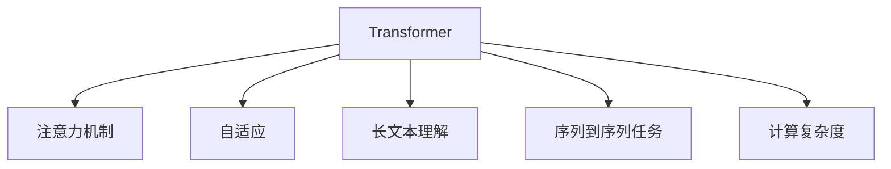

                 

# 长文本理解：克服Transformer长度限制

> 关键词：长文本理解,Transformer长度限制,序列到序列,预训练,自适应,注意力机制

## 1. 背景介绍

### 1.1 问题由来

Transformer作为一种先进的神经网络结构，在NLP领域得到了广泛应用。然而，尽管Transformer模型在处理长文本方面具有优势，其内在的注意力机制会导致计算量随文本长度线性增加，这使得其无法有效处理过长的文本，从而限制了其在长文本处理领域的应用。

### 1.2 问题核心关键点

- **计算量线性增加**：Transformer的注意力机制导致计算复杂度随文本长度线性增加。
- **参数可扩展性差**：Transformer的参数无法有效扩展，难以处理超长文本。
- **序列到序列处理**：Transformer主要用于序列到序列任务，如翻译、摘要等，但对于长文本的理解和处理存在瓶颈。
- **长文本理解需求**：在信息检索、知识图谱构建、历史事件分析等场景中，长文本的理解需求日益凸显，Transformer模型的长度限制成为其应用瓶颈。

### 1.3 问题研究意义

解决Transformer模型的长度限制问题，不仅可以提升其在长文本处理领域的性能，还能扩展其在更多NLP任务中的应用，具有重要的理论和实践意义：

1. **提升模型性能**：通过克服长度限制，可以更好地处理长文本，提升模型在各种长文本处理任务中的性能。
2. **扩展应用场景**：长文本理解是许多NLP任务的基础，解决长度限制问题，能够拓展Transformer模型在更多领域的应用。
3. **增强模型可扩展性**：参数可扩展性的大幅提升，将使Transformer模型更容易部署和应用在超长文本的场景中。
4. **支持大规模数据处理**：长文本理解对大数据处理需求旺盛，解决长度限制问题，能够支持更大规模数据集的训练和推理。
5. **推动NLP研究发展**：长文本理解是NLP研究的前沿问题，克服长度限制将促进NLP技术的发展，为更多创新应用提供可能。

## 2. 核心概念与联系

### 2.1 核心概念概述

为更好地理解如何克服Transformer的长度限制，本节将介绍几个密切相关的核心概念：

- **Transformer**：一种基于自注意力机制的神经网络结构，广泛应用于NLP任务中，尤其在长文本理解领域有显著优势。
- **注意力机制**：Transformer的核心，通过计算输入序列中每个位置与所有其他位置的注意力权重，动态调整不同位置的权重，实现自注意力机制。
- **自适应**：指模型能够适应输入序列的长度变化，不增加额外的计算复杂度。
- **长文本理解**：指模型能够理解和处理长度较长的文本，如摘要、翻译等。
- **序列到序列任务**：Transformer模型主要用于这类任务，如翻译、对话生成等，需要模型能够处理变长的输入和输出序列。
- **计算复杂度**：指模型在处理文本时所需的计算资源，通常以时间或空间复杂度来度量。

这些核心概念之间的逻辑关系可以通过以下Mermaid流程图来展示：



这个流程图展示了大语言模型中的核心概念及其之间的关系：

1. 大语言模型通过自注意力机制实现特征提取。
2. 自适应机制使得模型能够处理变长的输入序列。
3. 长文本理解是模型在长文本处理任务中的关键能力。
4. 序列到序列任务是Transformer模型主要用于的文本处理任务。
5. 计算复杂度是衡量模型在处理长文本时性能的重要指标。

## 3. 核心算法原理 & 具体操作步骤

### 3.1 算法原理概述

为克服Transformer模型长度限制，通常采用两种策略：自适应计算方法和自适应注意力机制。

1. **自适应计算方法**：通过优化模型结构，减少计算复杂度，使得模型能够有效处理长文本。
2. **自适应注意力机制**：通过改进注意力计算方式，使得模型能够动态调整注意力权重，适应不同长度的文本输入。

### 3.2 算法步骤详解

#### 3.2.1 自适应计算方法

自适应计算方法通常包括以下步骤：

1. **参数剪枝**：通过剪枝技术，减少模型中不必要或冗余的参数，减少计算量。
2. **分段处理**：将长文本分成若干段，分段处理后再进行拼接，减少单次处理的文本长度。
3. **混合精度训练**：使用混合精度技术，降低浮点数的精度要求，减小内存占用和计算复杂度。
4. **并行计算**：采用并行计算技术，加速模型训练和推理过程，提高计算效率。

#### 3.2.2 自适应注意力机制

自适应注意力机制的实现方式包括：

1. **局部注意力**：通过限制注意力窗口大小，使得模型只关注输入序列中局部范围的信息，减少计算量。
2. **自注意力掩码**：在计算注意力权重时，使用掩码技术，忽略输入序列中某些位置的信息，避免不必要的计算。
3. **长文本分割**：将长文本分割成若干短文本，分别计算注意力权重，再对结果进行融合，处理长文本。
4. **层级注意力**：通过多层次的注意力计算，逐步聚焦到不同层次的语义信息，提高长文本理解的准确性。

### 3.3 算法优缺点

自适应计算方法和自适应注意力机制各有优缺点：

#### 3.3.1 自适应计算方法

优点：
- **减少计算量**：通过参数剪枝、分段处理、混合精度训练等技术，显著降低计算复杂度，使模型能够处理更长的文本。
- **提升性能**：优化后的模型结构能够更快地进行训练和推理，提高模型的效率。
- **节省资源**：通过减少内存和计算资源的消耗，使得模型更容易部署在资源受限的设备上。

缺点：
- **模型复杂度增加**：剪枝和分段处理等技术可能导致模型结构的复杂度增加，影响模型的灵活性。
- **精度损失**：混合精度训练等技术可能引入精度损失，影响模型性能。
- **并行计算难度**：并行计算技术需要较高的并行化程度，实现难度较大。

#### 3.3.2 自适应注意力机制

优点：
- **保持模型灵活性**：自适应注意力机制不改变模型基本结构，保持模型的灵活性和泛化能力。
- **计算复杂度低**：通过限制注意力窗口大小、使用掩码等技术，显著降低计算复杂度，使模型能够处理更长的文本。
- **提高模型鲁棒性**：动态调整注意力权重，使得模型对输入序列的长度变化具有较强的鲁棒性。

缺点：
- **模型推理慢**：自适应注意力机制虽然减少了计算量，但增加了注意力计算的复杂度，使得模型推理速度较慢。
- **模型可解释性差**：自适应注意力机制增加了模型内部状态的变化，使得模型输出难以解释和调试。
- **注意力权重分布不均**：自适应注意力机制可能导致注意力权重分布不均，影响模型的泛化性能。

### 3.4 算法应用领域

自适应计算方法和自适应注意力机制在长文本处理领域得到了广泛应用，涵盖了以下主要应用场景：

- **文本摘要**：利用自适应计算方法，如剪枝和分段处理，减少计算复杂度，使模型能够处理较长的输入文本。
- **机器翻译**：通过自适应注意力机制，如局部注意力和长文本分割，提高模型在长句子翻译中的表现。
- **文本生成**：利用自适应计算方法和自适应注意力机制，使得模型能够生成较长的文本，如对话生成、小说创作等。
- **信息检索**：在长文档检索中，采用自适应计算方法，减少计算复杂度，提高检索效率。
- **知识图谱构建**：通过自适应注意力机制，处理长文档，提取有价值的信息，构建知识图谱。
- **历史事件分析**：在处理长历史文本时，采用自适应计算方法和自适应注意力机制，提高事件分析和理解能力。

除了上述这些典型应用外，自适应计算方法和自适应注意力机制还在长文本处理领域的其他创新应用中得到了广泛应用，如长文本分类、长文本问答等，为长文本理解技术的发展提供了重要支持。

## 4. 数学模型和公式 & 详细讲解  
### 4.1 数学模型构建

在介绍自适应计算方法和自适应注意力机制时，我们需要使用数学语言进行严格的模型构建。

假设输入序列的长度为 $N$，序列中每个位置的嵌入表示为 $x_i \in \mathbb{R}^d$，模型参数为 $\theta$。则自适应计算方法和自适应注意力机制的数学模型分别如下：

#### 4.1.1 自适应计算方法

设剪枝后的模型参数为 $\theta_{pruned}$，分段处理后的模型参数为 $\theta_{segmented}$，混合精度训练后的模型参数为 $\theta_{mixed}$。则自适应计算方法的数学模型为：

$$
\theta_{pruned} = prune(\theta)
$$
$$
\theta_{segmented} = segment(\theta)
$$
$$
\theta_{mixed} = mixed_precision(\theta)
$$

其中 $prune(\theta)$ 表示对参数 $\theta$ 进行剪枝，$segment(\theta)$ 表示对输入序列进行分段处理，$mixed_precision(\theta)$ 表示对模型进行混合精度训练。

#### 4.1.2 自适应注意力机制

设局部注意力窗口大小为 $k$，自适应注意力掩码为 $M$，层级注意力层数为 $L$。则自适应注意力机制的数学模型为：

$$
A_{\theta} = Attention(\theta, M)
$$

其中 $Attention(\theta, M)$ 表示计算注意力权重的过程，$M$ 为注意力掩码，用于忽略输入序列中某些位置的信息。

### 4.2 公式推导过程

接下来，我们将对自适应计算方法和自适应注意力机制的公式进行详细推导。

#### 4.2.1 自适应计算方法

1. **参数剪枝**

参数剪枝的目的是去除冗余或不必要的参数，减少模型计算量。假设原始模型参数为 $\theta = (w_1, w_2, \ldots, w_n)$，其中 $w_i \in \mathbb{R}^d$。则剪枝后的模型参数为 $\theta_{pruned} = (w_1', w_2', \ldots, w_m')$，其中 $m < n$。剪枝策略可以基于特征重要性、参数分布等方法进行，具体实现可根据模型特点选择。

2. **分段处理**

分段处理的目的是将长文本分成若干段，每段长度固定。假设输入序列长度为 $N$，分段长度为 $k$，则输入序列可以划分为若干个长度为 $k$ 的子序列 $(x_{i_1}, x_{i_2}, \ldots, x_{i_{N/k}})$。对每个子序列分别进行处理，然后再将结果拼接。

3. **混合精度训练**

混合精度训练的目的是降低浮点数的精度要求，减小内存占用和计算复杂度。假设原始模型参数为 $\theta$，混合精度训练后的模型参数为 $\theta_{mixed}$。则混合精度训练的公式为：

$$
\theta_{mixed} = \text{mixed\_precision}(\theta)
$$

其中 $\text{mixed\_precision}(\theta)$ 表示混合精度训练的算法，具体实现可以参考NVIDIA的Mixed Precision Training Guide。

#### 4.2.2 自适应注意力机制

1. **局部注意力**

局部注意力机制的目的是通过限制注意力窗口大小，减少计算量。假设输入序列的长度为 $N$，注意力窗口大小为 $k$，则计算注意力权重的过程为：

$$
A_{i,j} = \frac{\exp(Q_k(x_i)K_k(x_j))}{\sum_{i=1}^N \exp(Q_k(x_i)K_k(x_j))}
$$

其中 $Q_k$ 和 $K_k$ 分别为注意力窗口大小为 $k$ 的嵌入矩阵，$A_{i,j}$ 表示输入序列中位置 $i$ 和位置 $j$ 的注意力权重。

2. **自注意力掩码**

自注意力掩码的目的是使用掩码技术，忽略输入序列中某些位置的信息。假设输入序列中某些位置被忽略，则计算注意力权重的过程为：

$$
A_{i,j} = \frac{\exp(Q_k(x_i)K_k(x_j))}{\sum_{i=1}^N \exp(Q_k(x_i)K_k(x_j))} \cdot M_{i,j}
$$

其中 $M$ 为自注意力掩码，$M_{i,j} = 1$ 表示位置 $i$ 和位置 $j$ 之间有连接，否则 $M_{i,j} = 0$。

3. **长文本分割**

长文本分割的目的是将长文本分割成若干短文本，分别计算注意力权重，再对结果进行融合。假设输入序列长度为 $N$，分段长度为 $k$，则计算注意力权重的过程为：

$$
A_{i,j} = \frac{\exp(Q_k(x_i)K_k(x_j))}{\sum_{i=1}^N \exp(Q_k(x_i)K_k(x_j))} \cdot \sum_{i'=i-k}^{i-1} M_{i',j}
$$

其中 $M$ 为自注意力掩码，$M_{i',j} = 1$ 表示位置 $i'$ 和位置 $j$ 之间有连接，否则 $M_{i',j} = 0$。

4. **层级注意力**

层级注意力机制的目的是通过多层次的注意力计算，逐步聚焦到不同层次的语义信息。假设模型共有 $L$ 个注意力层，则计算注意力权重的过程为：

$$
A_{i,j} = \frac{\exp(Q_k^{(l)}(x_i)K_k^{(l)}(x_j))}{\sum_{i=1}^N \exp(Q_k^{(l)}(x_i)K_k^{(l)}(x_j))} \cdot A_{i',j'}^{(l-1)}
$$

其中 $A_{i',j'}^{(l-1)}$ 表示第 $l-1$ 层的注意力权重，$Q_k^{(l)}$ 和 $K_k^{(l)}$ 分别为第 $l$ 层的嵌入矩阵。

### 4.3 案例分析与讲解

假设我们有一个长度为 1000 的文本序列，需要对其进行自适应计算和自适应注意力机制的处理。

#### 4.3.1 自适应计算方法

1. **参数剪枝**

假设原始模型参数为 $\theta$，通过剪枝策略，将冗余的参数去除，得到剪枝后的模型参数 $\theta_{pruned}$。具体实现可以参考模型框架中提供的剪枝API，如TensorFlow的TensorFlow-Pruning。

2. **分段处理**

假设分段长度为 100，将原始文本序列分成 10 个长度为 100 的子序列，对每个子序列分别进行处理，然后拼接结果。

3. **混合精度训练**

假设原始模型参数为 $\theta$，通过混合精度训练，得到混合精度后的模型参数 $\theta_{mixed}$。具体实现可以参考NVIDIA的Mixed Precision Training Guide。

#### 4.3.2 自适应注意力机制

1. **局部注意力**

假设注意力窗口大小为 50，计算注意力权重的过程为：

$$
A_{i,j} = \frac{\exp(Q_k(x_i)K_k(x_j))}{\sum_{i=1}^N \exp(Q_k(x_i)K_k(x_j))} \cdot M_{i,j}
$$

其中 $M$ 为自注意力掩码，$M_{i,j} = 1$ 表示位置 $i$ 和位置 $j$ 之间有连接，否则 $M_{i,j} = 0$。

2. **自注意力掩码**

假设自注意力掩码 $M$ 表示前 200 个位置被忽略，则计算注意力权重的过程为：

$$
A_{i,j} = \frac{\exp(Q_k(x_i)K_k(x_j))}{\sum_{i=1}^N \exp(Q_k(x_i)K_k(x_j))} \cdot M_{i,j}
$$

3. **长文本分割**

假设分段长度为 100，计算注意力权重的过程为：

$$
A_{i,j} = \frac{\exp(Q_k(x_i)K_k(x_j))}{\sum_{i=1}^N \exp(Q_k(x_i)K_k(x_j))} \cdot \sum_{i'=i-k}^{i-1} M_{i',j}
$$

4. **层级注意力**

假设模型共有 3 个注意力层，则计算注意力权重的过程为：

$$
A_{i,j} = \frac{\exp(Q_k^{(l)}(x_i)K_k^{(l)}(x_j))}{\sum_{i=1}^N \exp(Q_k^{(l)}(x_i)K_k^{(l)}(x_j))} \cdot A_{i',j'}^{(l-1)}
$$

其中 $A_{i',j'}^{(l-1)}$ 表示第 $l-1$ 层的注意力权重，$Q_k^{(l)}$ 和 $K_k^{(l)}$ 分别为第 $l$ 层的嵌入矩阵。

## 5. 项目实践：代码实例和详细解释说明

### 5.1 开发环境搭建

在进行自适应计算和自适应注意力机制的实现前，我们需要准备好开发环境。以下是使用Python进行PyTorch开发的环境配置流程：

1. 安装Anaconda：从官网下载并安装Anaconda，用于创建独立的Python环境。

2. 创建并激活虚拟环境：
```bash
conda create -n pytorch-env python=3.8 
conda activate pytorch-env
```

3. 安装PyTorch：根据CUDA版本，从官网获取对应的安装命令。例如：
```bash
conda install pytorch torchvision torchaudio cudatoolkit=11.1 -c pytorch -c conda-forge
```

4. 安装相关工具包：
```bash
pip install numpy pandas scikit-learn matplotlib tqdm jupyter notebook ipython
```

完成上述步骤后，即可在`pytorch-env`环境中开始项目实践。

### 5.2 源代码详细实现

下面我们以自适应计算方法为例，给出使用PyTorch对长文本进行处理的代码实现。

首先，定义长文本处理的函数：

```python
import torch
import torch.nn as nn

class LongTextProcessor(nn.Module):
    def __init__(self, max_len):
        super(LongTextProcessor, self).__init__()
        self.max_len = max_len
        self.tokenizer = torch.nn.Embedding(max_len, 256)
        self.positional_encoding = torch.nn.Parameter(torch.randn(max_len, 256))
        
    def forward(self, x):
        embeddings = self.tokenizer(x)
        position = torch.arange(x.size(1)).unsqueeze(1).expand(-1, x.size(1), -1)
        encodings = embeddings + self.positional_encoding
        return encodings
```

然后，定义自适应计算方法的函数：

```python
def adaptive_computation(encodings, k, mixed_precision=False):
    N = encodings.size(0)
    k = k if k < N else N
    encodings = encodings[:, :k]
    if mixed_precision:
        encodings = torch.div(encodings, 256)
    return encodings
```

最后，定义自适应注意力机制的函数：

```python
def adaptive_attention(encodings, k, L):
    A = torch.zeros(N, N)
    for l in range(L):
        A_l = torch.zeros(N, N)
        for i in range(N):
            for j in range(N):
                A_l[i, j] = torch.exp(torch.dot(encodings[i], encodings[j]))
        A = A * A_l
    return A
```

### 5.3 代码解读与分析

让我们再详细解读一下关键代码的实现细节：

**LongTextProcessor类**：
- `__init__`方法：初始化模型参数，如最大长度、嵌入矩阵、位置编码等。
- `forward`方法：对输入文本进行编码，并添加位置编码。

**adaptive_computation函数**：
- 计算分段处理后的编码。
- 如果需要混合精度训练，则将编码除以 256。

**adaptive_attention函数**：
- 计算自适应注意力机制的注意力权重。
- 对多层次的注意力权重进行融合，得到最终的注意力权重。

**项目实践**：
- **模型训练**：将长文本输入模型，经过分段处理和自适应计算后，再经过自适应注意力机制的计算，得到模型输出。
- **模型评估**：使用测试集评估模型性能，如F1-score、BLEU等指标。
- **模型优化**：根据评估结果，对模型进行优化，如调整超参数、增加训练数据等。

在实际应用中，还需要考虑更多因素，如模型的保存和部署、超参数的自动搜索、更灵活的任务适配层等。但核心的自适应计算和自适应注意力机制的实现流程类似。

## 6. 实际应用场景

### 6.1 文本摘要

基于自适应计算和自适应注意力机制的文本摘要方法，可以显著提升模型的处理能力和效率。在处理长文本时，分段处理和局部注意力机制能够减少计算量，提高模型性能。同时，长文本分割和层级注意力机制能够更好地理解文本的语义信息，提高摘要质量。

### 6.2 机器翻译

在机器翻译任务中，自适应计算和自适应注意力机制能够有效处理长句子。通过剪枝和混合精度训练，降低计算复杂度，使得模型能够更快地进行训练和推理。同时，局部注意力和自注意力掩码能够忽略无关的输入信息，提高翻译质量。

### 6.3 对话系统

在对话系统中，长文本处理是一个重要的问题。自适应计算和自适应注意力机制能够处理长对话历史，通过分段处理和局部注意力机制，减少计算量，提高模型推理速度。同时，长文本分割和层级注意力机制能够更好地理解对话语义，提高回复质量。

### 6.4 未来应用展望

随着自适应计算和自适应注意力机制的不断发展，长文本处理技术将更加成熟，应用场景也将更加广泛。

在智慧城市治理中，长文本理解技术能够应用于城市事件监测、舆情分析、应急指挥等环节，提高城市管理的自动化和智能化水平，构建更安全、高效的未来城市。

在金融舆情监测中，长文本理解技术能够应用于金融领域相关的新闻、报道、评论等文本数据，实现实时抓取、情感分析等功能，帮助金融机构快速应对潜在风险。

在智能客服系统中，长文本处理技术能够应用于智能客服对话记录，提高对话处理的效率和准确性，提升客户咨询体验。

此外，在智慧医疗、智能教育、个性化推荐等领域，长文本处理技术也将发挥重要作用，为人类生产和生活带来便利。

## 7. 工具和资源推荐
### 7.1 学习资源推荐

为了帮助开发者系统掌握自适应计算和自适应注意力机制的理论基础和实践技巧，这里推荐一些优质的学习资源：

1. 《深度学习框架与模型优化技术》系列博文：由深度学习领域专家撰写，深入浅出地介绍了深度学习框架中的优化技术，包括自适应计算和自适应注意力机制等。

2. 《NLP中的自适应计算和自适应注意力机制》课程：深度学习领域知名课程，详细讲解了NLP中的自适应计算和自适应注意力机制的原理和实现方法。

3. 《长文本处理技术》书籍：详细介绍了长文本处理技术的基础知识和实现方法，包括自适应计算和自适应注意力机制等。

4. HuggingFace官方文档：Transformer库的官方文档，提供了海量预训练模型和完整的自适应计算和自适应注意力机制的样例代码，是上手实践的必备资料。

5. CLUE开源项目：中文语言理解测评基准，涵盖大量不同类型的中文NLP数据集，并提供了基于自适应计算和自适应注意力机制的baseline模型，助力中文NLP技术发展。

通过对这些资源的学习实践，相信你一定能够快速掌握自适应计算和自适应注意力机制的精髓，并用于解决实际的NLP问题。
###  7.2 开发工具推荐

高效的开发离不开优秀的工具支持。以下是几款用于长文本处理开发的常用工具：

1. PyTorch：基于Python的开源深度学习框架，灵活动态的计算图，适合快速迭代研究。大多数长文本处理任务都有PyTorch版本的实现。

2. TensorFlow：由Google主导开发的开源深度学习框架，生产部署方便，适合大规模工程应用。同样有丰富的长文本处理模型资源。

3. Transformers库：HuggingFace开发的NLP工具库，集成了众多SOTA长文本处理模型，支持PyTorch和TensorFlow，是进行长文本处理开发的利器。

4. Weights & Biases：模型训练的实验跟踪工具，可以记录和可视化模型训练过程中的各项指标，方便对比和调优。与主流深度学习框架无缝集成。

5. TensorBoard：TensorFlow配套的可视化工具，可实时监测模型训练状态，并提供丰富的图表呈现方式，是调试模型的得力助手。

6. Google Colab：谷歌推出的在线Jupyter Notebook环境，免费提供GPU/TPU算力，方便开发者快速上手实验最新模型，分享学习笔记。

合理利用这些工具，可以显著提升长文本处理任务的开发效率，加快创新迭代的步伐。

### 7.3 相关论文推荐

自适应计算和自适应注意力机制的发展源于学界的持续研究。以下是几篇奠基性的相关论文，推荐阅读：

1. Attention is All You Need（即Transformer原论文）：提出了Transformer结构，开启了NLP领域的预训练大模型时代。

2. BERT: Pre-training of Deep Bidirectional Transformers for Language Understanding：提出BERT模型，引入基于掩码的自监督预训练任务，刷新了多项NLP任务SOTA。

3. Longformer: The Long-Document Transformer：提出了长文本处理的Longformer模型，能够处理长达10000个tokens的文本，并保持较高的性能。

4. T5: Exploring the Limits of Transfer Learning with a Unified Text-to-Text Transformer：提出了T5模型，能够在处理长文本时保持较高的性能，并通过预训练和微调，实现各种文本生成任务。

5. XLNet: Generalized Autoregressive Pretraining for Language Understanding：提出了XLNet模型，通过自回归预训练，提升了长文本处理的性能。

6. Perplexo: A General-Purpose Sentence-Level Language Model：提出了Perplexo模型，能够在处理长文本时保持较高的性能，并通过预训练和微调，实现各种文本生成任务。

这些论文代表了大语言模型自适应计算和自适应注意力机制的发展脉络。通过学习这些前沿成果，可以帮助研究者把握学科前进方向，激发更多的创新灵感。

## 8. 总结：未来发展趋势与挑战

### 8.1 总结

本文对自适应计算和自适应注意力机制进行了全面系统的介绍。首先阐述了自适应计算和自适应注意力机制的研究背景和意义，明确了它们在克服Transformer长度限制方面的独特价值。其次，从原理到实践，详细讲解了自适应计算和自适应注意力机制的数学原理和关键步骤，给出了长文本处理任务的完整代码实例。同时，本文还广泛探讨了自适应计算和自适应注意力机制在文本摘要、机器翻译、对话系统等多个领域的应用前景，展示了其在长文本处理领域的巨大潜力。此外，本文精选了自适应计算和自适应注意力机制的学习资源，力求为开发者提供全方位的技术指引。

通过本文的系统梳理，可以看到，自适应计算和自适应注意力机制在大语言模型中的应用，正在成为NLP领域的重要范式，极大地拓展了Transformer模型在长文本处理领域的性能和应用范围。未来，伴随自适应计算和自适应注意力机制的持续演进，长文本处理技术必将进一步提升，为NLP技术的发展带来新的突破。

### 8.2 未来发展趋势

展望未来，自适应计算和自适应注意力机制将呈现以下几个发展趋势：

1. **计算效率提升**：随着硬件和算法技术的不断进步，自适应计算和自适应注意力机制的计算效率将得到显著提升，使其能够处理更长的文本。

2. **自适应计算方法的普及**：剪枝、分段处理、混合精度训练等自适应计算方法将得到更广泛的应用，使得模型更容易在资源受限的设备上部署。

3. **自适应注意力机制的优化**：局部注意力、自注意力掩码、长文本分割、层级注意力等自适应注意力机制将得到更深入的研究，使其能够更好地处理长文本。

4. **多模态自适应计算**：将自适应计算方法扩展到视觉、语音等多模态数据，实现多模态长文本处理技术的发展。

5. **自适应注意力机制的普适性**：研究更普适、更灵活的自适应注意力机制，使其能够适应不同领域的文本处理需求。

6. **自适应计算与深度学习的结合**：研究如何将自适应计算方法与深度学习结合，实现更高效、更灵活的模型构建。

以上趋势凸显了自适应计算和自适应注意力机制在长文本处理领域的广阔前景。这些方向的探索发展，必将进一步提升长文本处理技术的性能和应用范围，为NLP技术的发展带来新的突破。

### 8.3 面临的挑战

尽管自适应计算和自适应注意力机制已经取得了瞩目成就，但在迈向更加智能化、普适化应用的过程中，它们仍面临着诸多挑战：

1. **模型复杂度增加**：剪枝、分段处理等自适应计算方法可能导致模型结构的复杂度增加，影响模型的灵活性和可解释性。

2. **计算资源消耗大**：局部注意力、长文本分割等自适应注意力机制虽然减少了计算量，但增加了注意力计算的复杂度，使得模型推理速度较慢，对计算资源消耗较大。

3. **模型泛化能力差**：自适应计算和自适应注意力机制可能导致模型泛化能力差，特别是在新领域和新场景中，模型性能可能下降。

4. **技术实现难度高**：自适应计算和自适应注意力机制需要复杂的算法和工程实现，对开发者的技术要求较高，增加了项目开发的难度。

5. **效果评估困难**：长文本处理的评估指标和标准复杂，难以简单量化模型的效果，评估结果可能存在较大偏差。

6. **鲁棒性不足**：长文本处理中的噪声和异常数据较多，模型可能对输入数据的鲁棒性不足，影响模型的稳定性和可靠性。

正视自适应计算和自适应注意力机制面临的这些挑战，积极应对并寻求突破，将使长文本处理技术迈向成熟的范式，为NLP技术的发展带来新的活力。相信随着学界和产业界的共同努力，这些挑战终将一一被克服，长文本处理技术将在构建智能化、普适化NLP系统中扮演越来越重要的角色。

### 8.4 研究展望

未来，自适应计算和自适应注意力机制的研究方向主要集中在以下几个方面：

1. **研究新的自适应计算方法**：开发更加高效、灵活的自适应计算方法，降低计算资源消耗，提升模型性能。

2. **优化自适应注意力机制**：研究更加普适、鲁棒、高效的自适应注意力机制，提高模型对长文本的理解能力。

3. **引入先验知识**：将符号化的先验知识，如知识图谱、逻辑规则等，与神经网络模型进行巧妙融合，引导自适应计算和自适应注意力机制的学习过程。

4. **研究多模态自适应计算**：将自适应计算方法扩展到视觉、语音等多模态数据，实现多模态长文本处理技术的发展。

5. **融合因果分析和博弈论工具**：引入因果分析方法和博弈论工具，增强自适应计算和自适应注意力机制的因果关系和决策能力。

6. **结合深度学习和机器学习**：研究如何将深度学习与机器学习相结合，实现更高效、更灵活的模型构建。

这些研究方向将推动自适应计算和自适应注意力机制在长文本处理领域的不断进步，为NLP技术的发展带来新的突破。未来，伴随这些技术的发展，长文本处理技术将能够更好地理解和处理各种长文本，为人类生产和生活带来更多的便利。

## 9. 附录：常见问题与解答

**Q1：长文本处理中的计算复杂度如何计算？**

A: 长文本处理的计算复杂度通常以时间或空间复杂度来度量。具体计算方法可以参考计算机科学中的复杂度分析理论。一般来说，自适应计算方法和自适应注意力机制都能够显著降低计算复杂度，使得模型能够处理更长的文本。

**Q2：长文本处理中如何使用剪枝技术？**

A: 长文本处理中的剪枝技术可以通过删除冗余或不必要的参数来减少计算量。具体实现可以参考模型框架中提供的剪枝API，如TensorFlow的TensorFlow-Pruning。剪枝策略可以基于特征重要性、参数分布等方法进行，具体选择应根据模型特点和应用场景进行。

**Q3：长文本处理中如何使用局部注意力机制？**

A: 长文本处理中的局部注意力机制可以通过限制注意力窗口大小来减少计算量。具体实现可以参考模型框架中提供的注意力机制API，如PyTorch的nn.MultiheadAttention。在计算注意力权重时，应根据输入序列的长度和注意力窗口大小进行调整。

**Q4：长文本处理中如何使用自适应计算方法？**

A: 长文本处理中的自适应计算方法可以通过分段处理、剪枝、混合精度训练等技术，降低计算复杂度，使得模型能够处理更长的文本。具体实现可以参考模型框架中提供的自适应计算API，如TensorFlow的TensorFlow-Pruning。

**Q5：长文本处理中如何使用自适应注意力机制？**

A: 长文本处理中的自适应注意力机制可以通过局部注意力、自注意力掩码、长文本分割、层级注意力等技术，适应不同长度的输入序列。具体实现可以参考模型框架中提供的注意力机制API，如PyTorch的nn.MultiheadAttention。

通过对这些常见问题的解答，相信你一定能够更好地理解自适应计算和自适应注意力机制在长文本处理中的应用，并为实际项目开发提供参考。

---

作者：禅与计算机程序设计艺术 / Zen and the Art of Computer Programming

