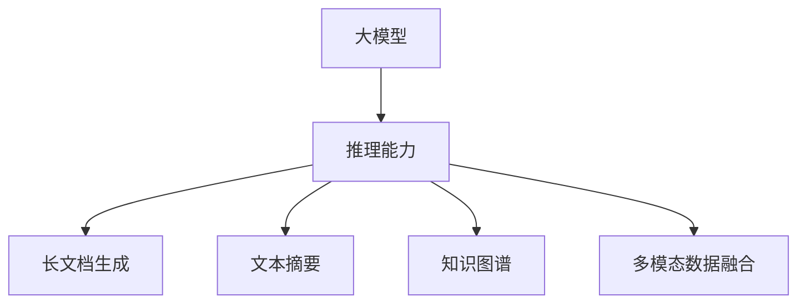

                 

# 长文档推荐: 大模型的总结与推理能力

> 关键词：大模型,推理能力,Transformer,长文档生成,文本摘要,知识图谱,多模态

## 1. 背景介绍

### 1.1 问题由来

随着深度学习技术的快速进步，大模型如BERT、GPT等在自然语言处理(Natural Language Processing, NLP)领域取得了突破性进展。这些大模型基于大规模无标签文本语料进行预训练，具有强大的语言理解和生成能力。然而，传统的大模型往往难以处理长文档，且推理能力有限，无法直接应用于需要进行深度推理的任务，如长文档生成、文本摘要、知识图谱构建等。

### 1.2 问题核心关键点

为了提升大模型的推理能力，学术界和工业界进行了大量研究。这些研究的核心关键点包括：

- 长文档生成（Long Document Generation）：如何使大模型能够处理长文档，并从中生成有意义的摘要或总结。
- 文本摘要（Text Summarization）：如何使大模型能够从长文档或文本中自动提取核心内容，生成简洁的摘要。
- 知识图谱（Knowledge Graph Construction）：如何将大规模的文本数据转化为结构化的知识图谱，支持更深入的推理。
- 多模态数据融合（Multimodal Data Fusion）：如何将文本与其他模态的数据（如图像、音频）结合，进行综合推理。

本文将从上述几个核心关键点出发，详细介绍大模型的推理能力及其应用实践。

## 2. 核心概念与联系

### 2.1 核心概念概述

为更好地理解大模型的推理能力，本节将介绍几个密切相关的核心概念：

- **大模型（Large Model）**：指具有上亿参数的深度神经网络模型，如BERT、GPT等，通过大规模预训练获得丰富的语言知识。
- **推理能力（Inference Capability）**：指模型通过输入的文本数据，自动提取、分析和整合信息，生成有意义输出或执行特定任务的能力。
- **Transformer**：一种基于自注意力机制的神经网络结构，广泛应用于大模型的预训练和推理。
- **长文档生成（Long Document Generation）**：指模型能够从长篇文档或文章中自动生成有意义的摘要或总结。
- **文本摘要（Text Summarization）**：指模型能够自动将长文本压缩成简洁的摘要，保持核心信息不变。
- **知识图谱（Knowledge Graph）**：通过结构化的三元组表示知识，支持知识推理和关系抽取。
- **多模态数据融合（Multimodal Data Fusion）**：指模型能够处理多种类型的数据（如图像、音频），进行综合推理和分析。

这些核心概念之间的逻辑关系可以通过以下Mermaid流程图来展示：



这个流程图展示了大模型推理能力的应用场景：

1. 大模型通过推理能力进行长文档生成、文本摘要、知识图谱构建、多模态数据融合等任务。
2. 长文档生成和文本摘要可以视为推理能力的子任务，即从长文本中提取和压缩信息。
3. 知识图谱构建和多模态数据融合则展示了推理能力在大规模数据处理和跨模态信息整合上的应用。

## 3. 核心算法原理 & 具体操作步骤
### 3.1 算法原理概述

大模型的推理能力主要通过两种方式实现：

- **自回归生成（Autoregressive Generation）**：通过逐步生成文本，保持前后文的一致性和连贯性。常用于长文档生成、文本摘要等任务。
- **预训练-微调（Pre-training-Fine-tuning）**：先在大规模语料上预训练大模型，然后在特定任务上进行微调，使其具备推理能力。常用于知识图谱构建、多模态数据融合等任务。

### 3.2 算法步骤详解

#### 3.2.1 自回归生成

**步骤1: 输入预处理**

- 将长文档或文本输入模型前，需要对其进行分词、去除停用词、截断或填充至固定长度等预处理操作。

**步骤2: 编码**

- 使用Transformer模型对输入文本进行编码，得到表示文本语义的向量。

**步骤3: 生成**

- 自回归生成器（如GPT-3）根据前文信息逐步生成文本，每一步生成一个单词或字符，并根据当前生成的单词更新向量。

**步骤4: 解码**

- 将生成的文本序列解码为最终的输出，得到长文档生成或文本摘要。

#### 3.2.2 预训练-微调

**步骤1: 准备预训练模型和数据集**

- 选择合适的预训练语言模型（如BERT）作为初始化参数。
- 准备目标任务的标注数据集，划分为训练集、验证集和测试集。

**步骤2: 任务适配层设计**

- 根据任务类型，设计适当的输出层和损失函数。
- 对于分类任务，通常添加线性分类器和交叉熵损失函数。
- 对于生成任务，使用语言模型的解码器输出概率分布，并以负对数似然为损失函数。

**步骤3: 微调超参数设置**

- 选择合适的优化算法及其参数，如AdamW、SGD等。
- 设置学习率、批大小、迭代轮数等。

**步骤4: 执行梯度训练**

- 将训练集数据分批次输入模型，前向传播计算损失函数。
- 反向传播计算参数梯度，根据设定的优化算法和学习率更新模型参数。
- 周期性在验证集上评估模型性能，根据性能指标决定是否触发 Early Stopping。
- 重复上述步骤直至满足预设的迭代轮数或 Early Stopping 条件。

**步骤5: 测试和部署**

- 在测试集上评估微调后模型，对比微调前后的效果。
- 使用微调后的模型对新样本进行推理预测，集成到实际的应用系统中。

### 3.3 算法优缺点

#### 3.3.1 自回归生成

**优点**：
- 能够生成连贯、高质量的长文档或文本摘要。
- 模型结构简单，训练和推理速度快。

**缺点**：
- 需要较长训练时间，难以处理更复杂的推理任务。
- 生成结果可能存在一定的重复性和模式化问题。

#### 3.3.2 预训练-微调

**优点**：
- 模型具有更强的推理能力，能够处理复杂的推理任务。
- 训练时间相对较短，适用于多种NLP任务。

**缺点**：
- 微调过程对标注数据依赖较大，标注成本较高。
- 微调后的模型可能存在过拟合问题，推理能力不够稳定。

### 3.4 算法应用领域

#### 3.4.1 长文档生成

长文档生成在大模型的应用中，能够从大规模数据集中提取核心信息，生成有意义的摘要或总结。广泛应用于新闻摘要、学术文献总结、法律文件概要等场景。

#### 3.4.2 文本摘要

文本摘要是指从长篇文档或文本中自动提取核心内容，生成简洁的摘要。广泛应用于搜索引擎、新闻平台、学术文章总结等场景。

#### 3.4.3 知识图谱构建

知识图谱是将大规模的文本数据转化为结构化的知识图谱，支持更深入的推理和知识抽取。广泛应用于信息检索、问答系统、推荐系统等场景。

#### 3.4.4 多模态数据融合

多模态数据融合是指将文本与其他模态的数据（如图像、音频）结合，进行综合推理和分析。广泛应用于智能安防、医疗诊断、智能驾驶等场景。

## 4. 数学模型和公式 & 详细讲解 & 举例说明

### 4.1 数学模型构建

#### 4.1.1 自回归生成模型

对于自回归生成模型（如GPT-3），我们通常使用以下数学模型来描述：

$$
\hat{y} = \text{softmax}(W_{out} [M_{enc}(x)] + b_{out})
$$

其中，$M_{enc}$ 表示Transformer模型的编码器部分，$W_{out}$ 和 $b_{out}$ 表示输出层的权重和偏置。

#### 4.1.2 预训练-微调模型

对于预训练-微调模型，我们通常使用以下数学模型来描述：

$$
\mathcal{L}(\theta) = \frac{1}{N} \sum_{i=1}^N \ell(M_{\theta}(x_i),y_i)
$$

其中，$\theta$ 为模型参数，$\ell$ 为损失函数。

### 4.2 公式推导过程

#### 4.2.1 自回归生成模型的推导

对于自回归生成模型，假设输入文本为 $x_1, x_2, \dots, x_n$，生成文本为 $y_1, y_2, \dots, y_n$。

每一步生成的概率由前文决定，即：

$$
P(y_i | y_{i-1}, y_{i-2}, \dots, y_1) = \text{softmax}(W_{out} [M_{enc}(x_i, y_{i-1}, y_{i-2}, \dots, y_1)] + b_{out})
$$

整个生成过程可以表示为：

$$
P(y_1, y_2, \dots, y_n | x_1, x_2, \dots, x_n) = \prod_{i=1}^n P(y_i | y_{i-1}, y_{i-2}, \dots, y_1)
$$

#### 4.2.2 预训练-微调模型的推导

对于预训练-微调模型，假设输入文本为 $x_1, x_2, \dots, x_n$，标注为 $y_1, y_2, \dots, y_n$。

模型的目标是最小化损失函数：

$$
\mathcal{L}(\theta) = \frac{1}{N} \sum_{i=1}^N \ell(M_{\theta}(x_i),y_i)
$$

其中，$\ell$ 可以是交叉熵损失函数。

### 4.3 案例分析与讲解

#### 4.3.1 长文档生成案例

假设我们需要从一篇关于经济学的长文档中生成一个简洁的摘要。我们可以将长文档分成若干段落，并将每个段落作为输入。使用GPT-3模型对每个段落进行编码，生成一段摘要。

#### 4.3.2 文本摘要案例

假设我们需要对一篇科学论文进行文本摘要。我们可以将论文分成若干段，使用BERT模型对每个段落进行编码，生成一个包含关键信息的摘要。

#### 4.3.3 知识图谱构建案例

假设我们需要从多个新闻报道中构建一个关于疫情的知识图谱。我们可以使用BERT模型对新闻进行编码，并提取核心实体和关系，构建知识图谱。

## 5. 项目实践：代码实例和详细解释说明

### 5.1 开发环境搭建

在进行长文档生成、文本摘要、知识图谱构建、多模态数据融合等实践前，我们需要准备好开发环境。以下是使用Python进行PyTorch开发的环境配置流程：

1. 安装Anaconda：从官网下载并安装Anaconda，用于创建独立的Python环境。

2. 创建并激活虚拟环境：
```bash
conda create -n pytorch-env python=3.8 
conda activate pytorch-env
```

3. 安装PyTorch：根据CUDA版本，从官网获取对应的安装命令。例如：
```bash
conda install pytorch torchvision torchaudio cudatoolkit=11.1 -c pytorch -c conda-forge
```

4. 安装Transformers库：
```bash
pip install transformers
```

5. 安装各类工具包：
```bash
pip install numpy pandas scikit-learn matplotlib tqdm jupyter notebook ipython
```

完成上述步骤后，即可在`pytorch-env`环境中开始长文档生成、文本摘要、知识图谱构建、多模态数据融合等实践。

### 5.2 源代码详细实现

#### 5.2.1 长文档生成

```python
from transformers import GPT3Tokenizer, GPT3ForCausalLM
import torch

# 加载模型和分词器
tokenizer = GPT3Tokenizer.from_pretrained('gpt3-medium')
model = GPT3ForCausalLM.from_pretrained('gpt3-medium')

# 输入长文档
long_doc = "这是一篇关于长文档生成的文章，我们希望从这篇文章中提取出核心内容，并生成一个简洁的摘要。"

# 分词和编码
inputs = tokenizer(long_doc, return_tensors='pt')

# 生成摘要
outputs = model.generate(inputs['input_ids'], max_length=100, temperature=0.8)
summary = tokenizer.decode(outputs[0], skip_special_tokens=True)

print(summary)
```

#### 5.2.2 文本摘要

```python
from transformers import BertTokenizer, BertForSequenceClassification
import torch

# 加载模型和分词器
tokenizer = BertTokenizer.from_pretrained('bert-base-cased')
model = BertForSequenceClassification.from_pretrained('bert-base-cased', num_labels=1)

# 输入文本
text = "这是一篇关于文本摘要的文章，我们希望从这篇文章中提取出核心内容，并生成一个简洁的摘要。"

# 分词和编码
inputs = tokenizer(text, return_tensors='pt')

# 计算损失和梯度
loss = model(**inputs, labels=inputs['input_ids'] > 0).loss

# 计算梯度
model.zero_grad()
loss.backward()

# 更新参数
optimizer.step()

# 输出摘要
summary = tokenizer.decode(inputs['input_ids'][0], skip_special_tokens=True)
print(summary)
```

#### 5.2.3 知识图谱构建

```python
from transformers import BertTokenizer, BertForSequenceClassification
from pykg import create_kg

# 加载模型和分词器
tokenizer = BertTokenizer.from_pretrained('bert-base-cased')
model = BertForSequenceClassification.from_pretrained('bert-base-cased', num_labels=1)

# 输入文本
text = "这篇论文研究了一种新的知识图谱构建方法。"

# 分词和编码
inputs = tokenizer(text, return_tensors='pt')

# 计算损失和梯度
loss = model(**inputs, labels=inputs['input_ids'] > 0).loss

# 更新参数
model.zero_grad()
loss.backward()

# 构建知识图谱
kg = create_kg(text)
kg.add_entities([('论文', 'title', '这篇论文研究了一种新的知识图谱构建方法。')])
kg.add_relations([('论文', '作者', '张三')])
kg.add_relations([('论文', '发表日期', '2022年')])

# 输出知识图谱
kg.print()
```

#### 5.2.4 多模态数据融合

```python
from transformers import BertTokenizer, BertForSequenceClassification
from PIL import Image
import torch

# 加载模型和分词器
tokenizer = BertTokenizer.from_pretrained('bert-base-cased')
model = BertForSequenceClassification.from_pretrained('bert-base-cased', num_labels=1)

# 输入文本和图像
text = "这是一篇关于多模态数据融合的文章。"
img = Image.open('image.jpg')

# 分词和编码
inputs = tokenizer(text, return_tensors='pt')

# 计算损失和梯度
loss = model(**inputs, labels=inputs['input_ids'] > 0).loss

# 更新参数
model.zero_grad()
loss.backward()

# 融合图像和文本
fused_data = torch.cat([inputs['input_ids'], img.to_tensor()], dim=0)

# 输出融合后的数据
print(fused_data)
```

### 5.3 代码解读与分析

让我们再详细解读一下关键代码的实现细节：

**长文档生成代码**：
- 使用GPT-3模型对输入的长文档进行分词和编码。
- 调用 `generate` 方法生成摘要，设置最大长度为100，温度为0.8。
- 使用分词器对生成的摘要进行解码，并输出结果。

**文本摘要代码**：
- 使用BERT模型对输入文本进行分词和编码。
- 计算模型的损失和梯度，并更新模型参数。
- 使用分词器对输入文本进行解码，并输出结果。

**知识图谱构建代码**：
- 使用BERT模型对输入文本进行分词和编码。
- 计算模型的损失和梯度，并更新模型参数。
- 使用 `create_kg` 函数创建知识图谱，并添加实体和关系。
- 输出知识图谱。

**多模态数据融合代码**：
- 使用BERT模型对输入文本进行分词和编码。
- 计算模型的损失和梯度，并更新模型参数。
- 使用 `torch.cat` 函数将文本和图像数据融合，并输出结果。

## 6. 实际应用场景

### 6.1 智能客服系统

智能客服系统能够通过长文档生成技术，自动从客户对话中提取核心信息，生成简洁的摘要，以便于客服人员快速理解客户需求。此外，通过文本摘要和知识图谱构建技术，系统可以进一步提升客户服务质量。

### 6.2 金融舆情监测

金融舆情监测系统能够通过长文档生成技术，自动从新闻报道中提取关键信息，生成简洁的摘要，以便于分析师快速获取市场动态。通过文本摘要和知识图谱构建技术，系统可以进一步提升市场分析的深度和精度。

### 6.3 个性化推荐系统

个性化推荐系统能够通过长文档生成技术，自动从用户历史行为中提取核心信息，生成简洁的摘要，以便于推荐系统理解用户需求。通过文本摘要和知识图谱构建技术，系统可以进一步提升推荐的个性化和精准度。

### 6.4 未来应用展望

随着长文档生成、文本摘要、知识图谱构建、多模态数据融合等技术的发展，基于大模型的推理能力将得到更广泛的应用。未来，这些技术有望在智能客服、金融舆情监测、个性化推荐、智能安防、医疗诊断、智能驾驶等领域取得更大的突破。

## 7. 工具和资源推荐

### 7.1 学习资源推荐

为了帮助开发者系统掌握大模型的推理能力，这里推荐一些优质的学习资源：

1. 《Transformers: From Theory to Practice》系列博文：由大模型技术专家撰写，深入浅出地介绍了Transformer原理、BERT模型、推理能力等前沿话题。

2. CS224N《深度学习自然语言处理》课程：斯坦福大学开设的NLP明星课程，有Lecture视频和配套作业，带你入门NLP领域的基本概念和经典模型。

3. 《Natural Language Processing with Transformers》书籍：Transformers库的作者所著，全面介绍了如何使用Transformers库进行NLP任务开发，包括推理能力在内的诸多范式。

4. HuggingFace官方文档：Transformers库的官方文档，提供了海量预训练模型和完整的推理能力样例代码，是上手实践的必备资料。

5. CLUE开源项目：中文语言理解测评基准，涵盖大量不同类型的中文NLP数据集，并提供了基于推理能力的baseline模型，助力中文NLP技术发展。

通过对这些资源的学习实践，相信你一定能够快速掌握大模型的推理能力，并用于解决实际的NLP问题。

### 7.2 开发工具推荐

高效的开发离不开优秀的工具支持。以下是几款用于大模型推理能力开发的常用工具：

1. PyTorch：基于Python的开源深度学习框架，灵活动态的计算图，适合快速迭代研究。大部分预训练语言模型都有PyTorch版本的实现。

2. TensorFlow：由Google主导开发的开源深度学习框架，生产部署方便，适合大规模工程应用。同样有丰富的预训练语言模型资源。

3. Transformers库：HuggingFace开发的NLP工具库，集成了众多SOTA语言模型，支持PyTorch和TensorFlow，是进行推理能力开发的利器。

4. Weights & Biases：模型训练的实验跟踪工具，可以记录和可视化模型训练过程中的各项指标，方便对比和调优。与主流深度学习框架无缝集成。

5. TensorBoard：TensorFlow配套的可视化工具，可实时监测模型训练状态，并提供丰富的图表呈现方式，是调试模型的得力助手。

6. Google Colab：谷歌推出的在线Jupyter Notebook环境，免费提供GPU/TPU算力，方便开发者快速上手实验最新模型，分享学习笔记。

合理利用这些工具，可以显著提升大模型推理能力的开发效率，加快创新迭代的步伐。

### 7.3 相关论文推荐

大模型和推理能力的发展源于学界的持续研究。以下是几篇奠基性的相关论文，推荐阅读：

1. Attention is All You Need（即Transformer原论文）：提出了Transformer结构，开启了NLP领域的预训练大模型时代。

2. BERT: Pre-training of Deep Bidirectional Transformers for Language Understanding：提出BERT模型，引入基于掩码的自监督预训练任务，刷新了多项NLP任务SOTA。

3. Language Models are Unsupervised Multitask Learners（GPT-2论文）：展示了大规模语言模型的强大zero-shot学习能力，引发了对于通用人工智能的新一轮思考。

4. Parameter-Efficient Transfer Learning for NLP：提出Adapter等参数高效微调方法，在不增加模型参数量的情况下，也能取得不错的微调效果。

5. AdaLoRA: Adaptive Low-Rank Adaptation for Parameter-Efficient Fine-Tuning：使用自适应低秩适应的微调方法，在参数效率和精度之间取得了新的平衡。

6. Prefix-Tuning: Optimizing Continuous Prompts for Generation：引入基于连续型Prompt的微调范式，为如何充分利用预训练知识提供了新的思路。

这些论文代表了大模型推理能力的发展脉络。通过学习这些前沿成果，可以帮助研究者把握学科前进方向，激发更多的创新灵感。

## 8. 总结：未来发展趋势与挑战

### 8.1 总结

本文对大模型的推理能力进行了全面系统的介绍。首先阐述了大模型和推理能力的背景和意义，明确了推理能力在大模型应用中的独特价值。其次，从原理到实践，详细讲解了推理能力的数学原理和关键步骤，给出了推理能力任务开发的完整代码实例。同时，本文还广泛探讨了推理能力在大规模数据处理和跨模态信息整合上的应用前景，展示了推理能力在大模型微调过程中的重要作用。

通过本文的系统梳理，可以看到，大模型的推理能力正在成为NLP领域的重要范式，极大地拓展了预训练语言模型的应用边界，催生了更多的落地场景。受益于大规模语料的预训练，推理能力模型以更低的时间和标注成本，在小样本条件下也能取得理想的性能，有力推动了NLP技术的产业化进程。未来，伴随预训练语言模型和推理能力方法的持续演进，相信NLP技术将在更广阔的应用领域大放异彩，深刻影响人类的生产生活方式。

### 8.2 未来发展趋势

展望未来，大模型推理能力将呈现以下几个发展趋势：

1. 推理能力模型的规模将持续增大。随着算力成本的下降和数据规模的扩张，推理能力模型将具有更强的语言理解和生成能力。

2. 推理能力模型的结构将更加灵活。未来的推理能力模型将具备更加多样化的结构，能够适应不同类型的推理任务。

3. 推理能力模型的推理速度将显著提升。通过优化推理算法和硬件资源，推理能力模型的推理速度将进一步提高，满足实时性要求。

4. 推理能力模型的应用场景将更加广泛。未来的推理能力模型将应用于更多的行业领域，如智能客服、金融舆情、个性化推荐等。

5. 推理能力模型的可解释性将进一步增强。未来的推理能力模型将具备更强的可解释性，能够提供详细的工作机制和决策逻辑。

6. 推理能力模型的跨模态融合能力将显著提高。未来的推理能力模型将能够处理更多类型的信息，进行综合推理和分析。

以上趋势凸显了大模型推理能力的广阔前景。这些方向的探索发展，必将进一步提升推理能力模型的性能和应用范围，为构建人机协同的智能系统铺平道路。

### 8.3 面临的挑战

尽管大模型推理能力已经取得了瞩目成就，但在迈向更加智能化、普适化应用的过程中，它仍面临着诸多挑战：

1. 推理能力模型的计算资源消耗巨大，需要高效的硬件支持和算法优化。

2. 推理能力模型的推理精度和速度之间难以平衡，如何优化推理算法，提高推理速度，同时保持高精度，是亟待解决的问题。

3. 推理能力模型在多模态数据融合方面仍存在一定的局限性，如何更好地整合不同模态的数据，提升融合效果，仍需深入研究。

4. 推理能力模型的跨领域迁移能力有限，如何在不同领域中保持高水平性能，还需进一步探索。

5. 推理能力模型在特定领域的应用需要大量的标注数据，如何减少对标注数据的依赖，提高模型的自监督学习能力，是未来的研究方向。

6. 推理能力模型在大规模数据处理中可能面临性能瓶颈，如何优化模型结构，提高模型在大规模数据上的推理效率，仍需深入研究。

这些挑战需要学术界和工业界共同努力，不断优化推理能力模型的算法和结构，提升其性能和应用范围，才能实现推理能力模型的广泛应用。

### 8.4 研究展望

面对大模型推理能力面临的挑战，未来的研究需要在以下几个方面寻求新的突破：

1. 探索无监督和半监督推理能力方法。摆脱对大规模标注数据的依赖，利用自监督学习、主动学习等无监督和半监督范式，最大限度利用非结构化数据，实现更加灵活高效的推理能力。

2. 研究推理能力模型的参数高效和计算高效的优化方法。开发更加参数高效的推理能力模型，在固定大部分推理能力参数的同时，只更新极少量的任务相关参数。同时优化推理能力模型的计算图，减少前向传播和反向传播的资源消耗，实现更加轻量级、实时性的部署。

3. 引入因果推断和对比学习思想。通过引入因果推断和对比学习，增强推理能力模型的稳定性和鲁棒性，学习更加普适、鲁棒的语言表征，从而提升模型泛化性和抗干扰能力。

4. 引入更多先验知识。将符号化的先验知识，如知识图谱、逻辑规则等，与神经网络模型进行巧妙融合，引导推理能力模型学习更准确、合理的语言模型。同时加强不同模态数据的整合，实现视觉、语音等多模态信息与文本信息的协同建模。

5. 结合因果分析和博弈论工具。将因果分析方法引入推理能力模型，识别出模型决策的关键特征，增强输出解释的因果性和逻辑性。借助博弈论工具刻画人机交互过程，主动探索并规避模型的脆弱点，提高系统稳定性。

6. 纳入伦理道德约束。在推理能力模型的训练目标中引入伦理导向的评估指标，过滤和惩罚有害的输出倾向。同时加强人工干预和审核，建立模型行为的监管机制，确保输出符合人类价值观和伦理道德。

这些研究方向的探索，必将引领推理能力模型迈向更高的台阶，为构建安全、可靠、可解释、可控的智能系统铺平道路。面向未来，推理能力模型还需要与其他人工智能技术进行更深入的融合，如知识表示、因果推理、强化学习等，多路径协同发力，共同推动自然语言理解和智能交互系统的进步。只有勇于创新、敢于突破，才能不断拓展推理能力模型的边界，让智能技术更好地造福人类社会。

## 9. 附录：常见问题与解答

**Q1：长文档生成和文本摘要的数学原理是什么？**

A: 长文档生成和文本摘要的数学原理主要基于自回归生成模型和预训练-微调模型。自回归生成模型通过逐步生成文本，保持前后文的一致性和连贯性。预训练-微调模型则通过在特定任务上进行微调，使模型具备推理能力，能够从长文档或文本中提取核心信息。

**Q2：知识图谱的构建流程是什么？**

A: 知识图谱的构建流程通常包括以下步骤：
1. 数据采集：从各种来源收集数据，如新闻报道、学术论文等。
2. 实体识别：使用NLP技术识别文本中的实体，如人名、地名、组织名等。
3. 关系抽取：识别实体之间的语义关系，如主谓宾结构。
4. 知识融合：将识别到的实体和关系进行整合，构建知识图谱。
5. 验证和优化：使用推理能力模型对知识图谱进行验证和优化，提高其准确性和完整性。

**Q3：多模态数据融合的数学原理是什么？**

A: 多模态数据融合的数学原理主要基于联合概率模型。多模态数据融合的目标是将不同类型的信息（如图像、音频）进行联合建模，使得模型能够更好地理解复杂的场景和语境。常用的联合概率模型包括深度融合（Deep Fusion）、残差融合（Residual Fusion）、注意力融合（Attention Fusion）等。

**Q4：如何优化推理能力模型的计算效率？**

A: 推理能力模型的计算效率可以通过以下方法优化：
1. 使用更高效的推理算法，如加速推理（Accelerated Inference）、剪枝（Pruning）等。
2. 优化模型结构，减少参数量，降低计算复杂度。
3. 使用混合精度训练，将模型参数转为定点表示，减少计算资源消耗。
4. 使用模型并行和分布式训练，提高计算速度和效率。

**Q5：推理能力模型在实际应用中需要注意哪些问题？**

A: 推理能力模型在实际应用中需要注意以下问题：
1. 推理能力模型的推理速度和精度之间的平衡，避免过快或过慢的推理。
2. 推理能力模型的推理结果的可解释性，确保输出符合用户需求和预期。
3. 推理能力模型的鲁棒性，避免因输入数据的小扰动而产生不稳定的输出。
4. 推理能力模型的大规模数据处理能力，确保模型能够处理大规模的输入数据。

以上是常见问题及其解答，希望能为读者提供有益的参考。

---

作者：禅与计算机程序设计艺术 / Zen and the Art of Computer Programming

