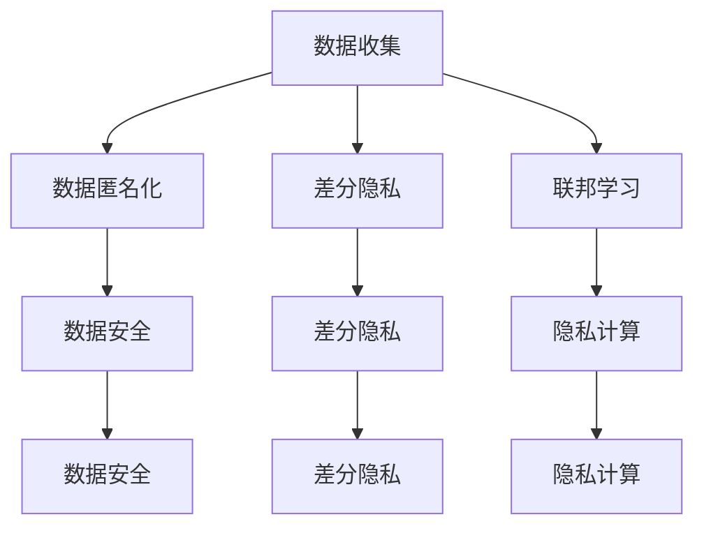

                 

# 隐私保护:人工智能时代的重要议题

> 关键词：人工智能,隐私保护,数据安全,数据匿名化,差分隐私,联邦学习,隐私计算

## 1. 背景介绍

随着人工智能技术的不断发展和应用，隐私保护问题显得愈发重要。在AI时代，数据是驱动技术进步的核心，而隐私保护则是数据利用的前提。无论是在金融、医疗、教育还是智能家居等领域，数据泄露和滥用都可能导致严重的社会问题。如何在使用数据驱动AI技术的同时，确保用户隐私安全，成为当下亟待解决的重要议题。

本文将详细阐述隐私保护在人工智能中的核心概念、核心算法以及具体操作，同时结合实际应用场景进行深入分析，以期为相关从业者提供系统全面的隐私保护技术指导。

## 2. 核心概念与联系

### 2.1 核心概念概述

为了深入理解隐私保护在人工智能中的重要性，首先需要介绍几个关键概念：

- **人工智能(AI)**：人工智能是指使计算机系统具有执行通常需要人类智能的任务的能力。人工智能通过学习大量数据，使得机器能够自主完成图像识别、语音识别、自然语言处理等复杂任务。

- **隐私保护**：隐私保护是指在数据收集、存储、处理和传输等环节，保护用户个人信息不被泄露或滥用的过程。隐私保护涉及多个技术领域，如数据加密、差分隐私、数据匿名化等。

- **数据安全**：数据安全旨在保障数据的完整性、可用性和保密性，防止数据被未经授权的访问、篡改或泄露。

- **数据匿名化**：数据匿名化是指在保留数据有用信息的同时，去除或模糊化数据中包含的个人信息，以防止数据泄露。

- **差分隐私**：差分隐私是指在数据处理过程中，通过添加噪声等手段，使得攻击者无法从数据中区分出个体身份，从而保护数据主体的隐私。

- **联邦学习**：联邦学习是一种分布式机器学习方法，多个参与方在本地计算模型，将模型参数汇总到中心服务器上进行全局优化，避免数据泄露。

- **隐私计算**：隐私计算是指在不共享原始数据的情况下，通过加密计算、多方安全计算等技术，确保数据处理过程中的隐私性。

这些核心概念共同构成了隐私保护的框架，它们之间的逻辑关系可以通过以下Mermaid流程图来展示：



这个流程图展示了隐私保护过程的各个关键环节，以及它们之间的相互关联。

## 3. 核心算法原理 & 具体操作步骤

### 3.1 算法原理概述

隐私保护的算法和技术多样，但总体上可以分为两类：基于数据加密和基于差分隐私。

**基于数据加密**：通过对数据进行加密，确保在传输和存储过程中不被未授权者访问。常用的加密技术包括对称加密和非对称加密，如AES、RSA等。

**基于差分隐私**：通过在数据处理过程中引入噪声，使得攻击者无法从数据中区分出个体信息。差分隐私保证了数据处理结果与原始数据有足够大的差异，从而确保隐私。

### 3.2 算法步骤详解

以下是隐私保护在人工智能中的具体操作步骤：

**Step 1: 数据收集与预处理**

数据收集是隐私保护流程的第一步。收集到的数据需经过预处理，包括数据清洗、数据去重、数据标注等。在预处理阶段，需要设计隐私保护措施，如数据加密和数据匿名化。

**Step 2: 数据加密与传输**

在数据传输过程中，使用数据加密技术，如SSL/TLS等，确保数据在网络传输中的安全。具体步骤包括：

1. 数据加密：使用对称加密算法（如AES）对数据进行加密。
2. 密钥交换：通过非对称加密算法（如RSA）交换加密和解密密钥。
3. 数据传输：通过加密的通道进行数据传输。

**Step 3: 数据存储与访问控制**

数据存储需使用访问控制机制，确保只有授权人员可以访问数据。存储环节的隐私保护措施包括：

1. 数据分区：将数据分区存储，确保每个分区只有授权人员可以访问。
2. 数据备份：定期备份数据，确保数据的安全性。
3. 访问控制：使用身份验证和访问授权机制，限制数据访问。

**Step 4: 数据处理与隐私保护**

数据处理过程中，需引入隐私保护技术，如数据匿名化和差分隐私。具体步骤包括：

1. 数据匿名化：通过去除或模糊化数据中包含的个人信息，保护数据隐私。
2. 差分隐私：在数据处理过程中，引入噪声，使得攻击者无法从数据中区分出个体信息。

**Step 5: 结果发布与审计**

结果发布需保证数据的隐私性，避免数据泄露。具体措施包括：

1. 结果加密：对处理结果进行加密，确保在传输和存储过程中安全。
2. 隐私审计：定期进行隐私审计，确保隐私保护措施的有效性。

### 3.3 算法优缺点

隐私保护在AI时代的重要性不言而喻，但不同类型的隐私保护技术各有优缺点：

- **基于数据加密**的优点在于，能够有效防止数据在传输和存储过程中的泄露。但缺点是加密和解密过程需要消耗大量计算资源，且在数据使用过程中需对每个数据进行解密，增加了操作复杂度。

- **基于差分隐私**的优点在于，能够保护数据隐私的同时，保持数据的有用性。但缺点是引入噪声后，数据精度可能会下降，影响模型性能。

## 4. 数学模型和公式 & 详细讲解

### 4.1 数学模型构建

隐私保护的核心数学模型包括差分隐私和联邦学习。

**差分隐私模型**：

差分隐私模型定义如下：

$$
\epsilon-\text{差分隐私} = \begin{cases}
\forall S\subseteq D, Pr[f(D) \in S] \leq \frac{e^{\epsilon}}{2} \times Pr[f(D) \in S] + \frac{1}{2} \\
其中，f(D) 是数据集D上的任意函数
\end{cases}
$$

该模型要求，对于任意包含一个数据点的集合S，攻击者从差分隐私算法输出中得到该点的概率不超过 $e^{\epsilon}/2$。$\epsilon$ 是隐私预算，用于衡量隐私保护的强度。

**联邦学习模型**：

联邦学习模型定义如下：

$$
f(x_i) = \sum_{i=1}^N w_i f(x_i, \theta)
$$

其中，$x_i$ 是客户端i上传的局部数据，$w_i$ 是客户端i的权重，$\theta$ 是全局模型参数。联邦学习通过在多个客户端上传数据，在服务器端聚合更新模型参数，避免数据集中存储。

### 4.2 公式推导过程

**差分隐私推导**：

以Laplace机制为例，差分隐私的数学推导如下：

1. 噪声分布选择：Laplace机制中，引入噪声 $N$ 服从拉普拉斯分布 $N(0, \frac{\epsilon}{2})$。
2. 隐私预算计算：对于敏感信息 $x$，引入噪声后的信息 $y$ 的概率密度函数为：
   $$
   p(y|x) = \frac{1}{2}e^{-\frac{|y-x|}{\epsilon}}
   $$
   其中，$|y-x|$ 表示 $y$ 与 $x$ 之间的差异。
3. 差分隐私保证：
   $$
   Pr[|y-x| \geq \delta] \leq \frac{e^{\epsilon}}{2} + \frac{1}{2}
   $$
   其中，$\delta$ 是隐私保护的范围。

**联邦学习推导**：

以SGD算法为例，联邦学习的数学推导如下：

1. 本地训练：在每个客户端i上，使用SGD算法训练模型参数 $w_i$，更新规则为：
   $$
   w_i^{t+1} = w_i^t - \eta_i \nabla f_i(w_i^t)
   $$
2. 参数聚合：在服务器端，聚合每个客户端上传的参数 $w_i$，得到全局模型参数 $\theta$：
   $$
   \theta = \frac{1}{N} \sum_{i=1}^N w_i
   $$
3. 参数更新：在服务器端，更新全局模型参数 $\theta$：
   $$
   \theta = \theta - \eta \nabla f(\theta)
   $$

### 4.3 案例分析与讲解

**案例一：医疗数据的隐私保护**

在医疗领域，隐私保护至关重要。以下是一个使用差分隐私保护医疗数据的案例：

1. 数据收集：收集大量医疗数据，包括病历、检查报告等。
2. 数据预处理：对数据进行清洗和标注，去除无关信息。
3. 差分隐私：在数据处理过程中，引入噪声，确保数据隐私。例如，使用Laplace机制添加噪声，使得攻击者无法从数据中区分出个体信息。
4. 模型训练：使用差分隐私数据训练医疗诊断模型。
5. 结果发布：在发布模型结果时，对结果进行加密，确保数据隐私。

**案例二：金融数据的联邦学习**

在金融领域，联邦学习被广泛应用于风控模型训练。以下是一个使用联邦学习保护金融数据的案例：

1. 数据收集：收集不同金融机构的用户数据。
2. 数据预处理：对数据进行清洗和去重，去除冗余信息。
3. 模型训练：在每个金融机构本地训练风控模型，使用联邦学习算法聚合更新模型参数。
4. 结果发布：在发布模型结果时，使用差分隐私技术保护用户隐私。

## 5. 项目实践：代码实例和详细解释说明

### 5.1 开发环境搭建

在进行隐私保护项目实践前，需要准备开发环境。以下是使用Python进行PyTorch开发的环境配置流程：

1. 安装Anaconda：从官网下载并安装Anaconda，用于创建独立的Python环境。
2. 创建并激活虚拟环境：
```bash
conda create -n pytorch-env python=3.8 
conda activate pytorch-env
```
3. 安装PyTorch：根据CUDA版本，从官网获取对应的安装命令。例如：
```bash
conda install pytorch torchvision torchaudio cudatoolkit=11.1 -c pytorch -c conda-forge
```
4. 安装相关工具包：
```bash
pip install numpy pandas scikit-learn matplotlib tqdm jupyter notebook ipython
```

完成上述步骤后，即可在`pytorch-env`环境中开始隐私保护项目实践。

### 5.2 源代码详细实现

以下是使用PyTorch实现差分隐私和联邦学习的代码实例。

**差分隐私代码实现**：

```python
import torch
from torch.nn.functional import relu

class LaplaceNoise:
    def __init__(self, epsilon):
        self.epsilon = epsilon
        self.scale = epsilon / 2

    def sample(self, shape):
        return torch.from_numpy(self.sample_n(size=shape)).to('cuda')
        
    def sample_n(self, size):
        return self.scale * torch.from_numpy(np.random.laplace(0, 1, size))

def train_model(data, labels, epsilon):
    model = torch.nn.Sequential(torch.nn.Linear(784, 128), relu(), torch.nn.Linear(128, 10), relu(), torch.nn.LogSoftmax(dim=1))
    model.to('cuda')
    
    optimizer = torch.optim.SGD(model.parameters(), lr=0.01)
    
    for epoch in range(10):
        for i, (images, labels) in enumerate(data):
            images = images.view(images.shape[0], -1).to('cuda')
            labels = labels.to('cuda')
            
            optimizer.zero_grad()
            output = model(images)
            loss = torch.nn.functional.nll_loss(output, labels)
            loss = loss + LaplaceNoise(epsilon).sample((1,)).to('cuda')
            loss.backward()
            optimizer.step()
            
            if (i+1) % 100 == 0:
                print('Epoch [{}/{}], Step [{}/{}], Loss: {:.4f}'.format(epoch+1, 10, i+1, len(data), loss.item()))

    return model
```

**联邦学习代码实现**：

```python
import torch
from torch.nn import Linear, ReLU
from torch.optim import SGD

class Client:
    def __init__(self, num_users, data, labels, local_model, global_model, epsilon):
        self.num_users = num_users
        self.data = data
        self.labels = labels
        self.local_model = local_model
        self.global_model = global_model
        self.epsilon = epsilon

    def train_local(self):
        optimizer = SGD(self.local_model.parameters(), lr=0.1)
        for epoch in range(10):
            for i, (images, labels) in enumerate(self.data):
                images = images.view(images.shape[0], -1)
                labels = labels
                optimizer.zero_grad()
                output = self.local_model(images)
                loss = torch.nn.functional.nll_loss(output, labels)
                loss = loss + LaplaceNoise(self.epsilon).sample((1,)).to('cuda')
                loss.backward()
                optimizer.step()
                if (i+1) % 100 == 0:
                    print('User {} Epoch [{}/{}], Step [{}/{}], Loss: {:.4f}'.format(self.num_users, epoch+1, 10, i+1, len(self.data), loss.item()))
        self.local_model.load_state_dict(torch.load('client_{}.pth'.format(self.num_users)))
        torch.save(self.local_model.state_dict(), 'client_{}.pth'.format(self.num_users))

    def train_global(self, server):
        optimizer = SGD(self.global_model.parameters(), lr=0.1)
        for epoch in range(10):
            for user in range(self.num_users):
                data = torch.load('client_{}.pth'.format(user+1))
                labels = self.labels
                optimizer.zero_grad()
                output = self.global_model(data)
                loss = torch.nn.functional.nll_loss(output, labels)
                loss.backward()
                optimizer.step()
                if (epoch+1) % 10 == 0:
                    print('Global Epoch [{}/{}], Loss: {:.4f}'.format(epoch+1, 10, loss.item()))

def train_federated_learning(data, labels, num_users, epsilon):
    local_model = torch.nn.Sequential(Linear(784, 128), ReLU(), Linear(128, 10))
    global_model = torch.nn.Sequential(Linear(784*num_users, 128), ReLU(), Linear(128, 10))
    
    client1 = Client(1, data[0], labels[0], local_model, global_model, epsilon)
    client1.train_local()
    
    for user in range(1, num_users):
        client = Client(user+1, data[user], labels[user], local_model, global_model, epsilon)
        client.train_local()
    
    server = Client(0, data, labels, local_model, global_model, epsilon)
    server.train_global(client1)
```

### 5.3 代码解读与分析

**差分隐私代码解读**：

1. 定义Laplace噪声类，用于生成符合拉普拉斯分布的噪声。
2. 定义模型训练函数，在每个epoch中对数据进行处理，并在损失函数中添加噪声。
3. 模型训练过程中，利用Laplace噪声对输出进行加密，确保隐私。

**联邦学习代码解读**：

1. 定义Client类，用于每个用户本地训练模型。
2. 定义Client类中的训练函数，使用SGD算法在本地数据上训练模型，并在损失函数中添加噪声。
3. 定义全局模型训练函数，通过聚合每个用户的模型参数，进行全局优化。

## 6. 实际应用场景

### 6.1 医疗数据隐私保护

在医疗领域，隐私保护尤为重要。以下是一个使用差分隐私保护医疗数据的实际应用场景：

1. 数据收集：收集大量医疗数据，包括病历、检查报告等。
2. 数据预处理：对数据进行清洗和标注，去除无关信息。
3. 差分隐私：在数据处理过程中，引入噪声，确保数据隐私。例如，使用Laplace机制添加噪声，使得攻击者无法从数据中区分出个体信息。
4. 模型训练：使用差分隐私数据训练医疗诊断模型。
5. 结果发布：在发布模型结果时，对结果进行加密，确保数据隐私。

### 6.2 金融数据联邦学习

在金融领域，联邦学习被广泛应用于风控模型训练。以下是一个使用联邦学习保护金融数据的实际应用场景：

1. 数据收集：收集不同金融机构的用户数据。
2. 数据预处理：对数据进行清洗和去重，去除冗余信息。
3. 模型训练：在每个金融机构本地训练风控模型，使用联邦学习算法聚合更新模型参数。
4. 结果发布：在发布模型结果时，使用差分隐私技术保护用户隐私。

## 7. 工具和资源推荐

### 7.1 学习资源推荐

为了帮助开发者系统掌握隐私保护的理论基础和实践技巧，这里推荐一些优质的学习资源：

1. 《隐私保护技术：从原理到应用》系列博文：由隐私保护技术专家撰写，深入浅出地介绍了隐私保护的基本概念和前沿技术。

2. 《差分隐私》课程：斯坦福大学开设的隐私保护课程，涵盖了差分隐私、联邦学习等多个前沿技术。

3. 《隐私保护：理论与实践》书籍：全面介绍了隐私保护的理论和实践，包括差分隐私、数据匿名化等技术。

4. International Conference on Privacy, Security, and Trust (PS&T)：隐私保护领域的国际会议，汇集了最新的研究成果和最佳实践。

通过对这些资源的学习实践，相信你一定能够快速掌握隐私保护技术的精髓，并用于解决实际的隐私保护问题。

### 7.2 开发工具推荐

高效的开发离不开优秀的工具支持。以下是几款用于隐私保护开发的常用工具：

1. PyTorch：基于Python的开源深度学习框架，灵活动态的计算图，适合快速迭代研究。大部分隐私保护技术都有PyTorch版本的实现。

2. TensorFlow：由Google主导开发的开源深度学习框架，生产部署方便，适合大规模工程应用。

3. TensorFlow Privacy：TensorFlow配套的隐私保护库，提供了差分隐私、联邦学习等多种隐私保护技术。

4. OpenMined：开源社区，提供了一系列的隐私保护工具和资源，包括差分隐私、多方安全计算等技术。

5. SecureML：由Google开发的联邦学习框架，支持多种隐私保护算法和模型优化。

合理利用这些工具，可以显著提升隐私保护项目的开发效率，加快创新迭代的步伐。

### 7.3 相关论文推荐

隐私保护在AI时代的发展得益于学界的持续研究。以下是几篇奠基性的相关论文，推荐阅读：

1. Differential Privacy: An Introduction（差分隐私入门）：介绍差分隐私的基本概念和数学模型。

2. Privacy-Preserving Deep Learning: An Overview（隐私保护深度学习综述）：全面综述了隐私保护深度学习的研究现状和未来方向。

3. Federated Learning in Healthcare: A Survey of Recent Advances and Challenges（联邦学习在医疗领域综述）：综述了联邦学习在医疗领域的研究进展和应用挑战。

4. Secure Multi-Party Computation for Privacy-Preserving Machine Learning（多方安全计算）：介绍多方安全计算的基本原理和应用场景。

5. Privacy-Preserving Knowledge Distillation（隐私保护知识蒸馏）：提出隐私保护知识蒸馏算法，在保持隐私的同时，实现模型压缩。

这些论文代表了大数据隐私保护技术的发展脉络。通过学习这些前沿成果，可以帮助研究者把握学科前进方向，激发更多的创新灵感。

## 8. 总结：未来发展趋势与挑战

### 8.1 总结

本文对隐私保护在人工智能中的核心概念、核心算法以及具体操作进行了全面系统的介绍。首先阐述了隐私保护的重要性，明确了隐私保护在AI技术应用中的必要性。其次，从原理到实践，详细讲解了差分隐私和联邦学习的数学原理和关键步骤，给出了隐私保护任务开发的完整代码实例。同时，本文还广泛探讨了隐私保护方法在医疗、金融、智能家居等多个行业领域的应用前景，展示了隐私保护范式的巨大潜力。此外，本文精选了隐私保护技术的各类学习资源，力求为读者提供全方位的技术指引。

通过本文的系统梳理，可以看到，隐私保护技术在人工智能时代的重要性愈发凸显，且在未来具有广阔的应用前景。未来隐私保护技术的发展，将为AI技术的落地应用提供坚实的保障，促进人工智能技术的可持续发展。

### 8.2 未来发展趋势

展望未来，隐私保护技术将呈现以下几个发展趋势：

1. **技术集成**：隐私保护技术将与AI模型、区块链等技术深度融合，形成更为完整的隐私保护体系。

2. **分布式计算**：隐私保护将支持大规模分布式计算，提高数据处理的效率和隐私保护的强度。

3. **模型压缩**：隐私保护算法将与模型压缩技术结合，提升模型性能和隐私保护的效率。

4. **多方安全计算**：多方安全计算将广泛应用于隐私保护，确保数据处理过程中的隐私性。

5. **联邦学习**：联邦学习将继续快速发展，支持更广泛的数据源和应用场景。

6. **差分隐私改进**：差分隐私将引入更多新的噪声分布和机制，提升隐私保护的强度和实用性。

### 8.3 面临的挑战

尽管隐私保护技术在AI时代的重要性不言而喻，但在实现过程中仍面临诸多挑战：

1. **数据质量问题**：数据收集和预处理环节存在大量噪声和不完整信息，影响隐私保护的效果。

2. **计算资源消耗**：隐私保护算法通常需要消耗大量的计算资源，如何在保证隐私保护的同时，减少资源消耗，是一个重要的研究方向。

3. **隐私与可用性平衡**：隐私保护技术需要在保护隐私和数据可用性之间找到平衡点，防止过度保护导致数据难以利用。

4. **隐私审计**：隐私保护的实时性和透明度需要进一步提升，确保隐私保护措施的有效性。

5. **跨平台兼容性**：隐私保护技术需要兼容不同平台和环境，提升应用的广泛性和可扩展性。

### 8.4 研究展望

面对隐私保护面临的这些挑战，未来的研究需要在以下几个方面寻求新的突破：

1. **数据清洗与预处理**：探索更高效的数据清洗和预处理技术，确保数据质量。

2. **计算资源优化**：开发更高效的计算资源优化算法，提高隐私保护算法的效率。

3. **隐私与可用性优化**：通过引入隐私预算和隐私级别等机制，平衡隐私保护和数据可用性。

4. **隐私审计与监控**：设计更有效的隐私审计和监控机制，确保隐私保护措施的有效性。

5. **跨平台兼容性**：研究和开发跨平台兼容的隐私保护技术，提升应用的广泛性和可扩展性。

这些研究方向将推动隐私保护技术的不断演进，为AI技术的广泛应用提供坚实的保障。未来隐私保护技术的发展，将为构建安全、可靠、可解释、可控的智能系统铺平道路。

## 9. 附录：常见问题与解答

**Q1: 如何评估隐私保护的效果？**

A: 隐私保护的评估主要通过隐私预算和隐私审计进行。隐私预算用于衡量隐私保护的强度，隐私审计用于评估隐私保护措施的有效性。

**Q2: 差分隐私和联邦学习有什么区别？**

A: 差分隐私和联邦学习都是隐私保护技术，但它们的主要区别在于数据处理的方式。差分隐私通过在数据处理过程中引入噪声，保护数据隐私；联邦学习通过在多个本地节点上训练模型，聚合更新全局模型参数，避免数据集中存储。

**Q3: 联邦学习中如何防止模型泄露？**

A: 联邦学习通过在每个本地节点上训练模型，然后将模型参数汇总到中心服务器上进行全局优化，可以有效地防止模型泄露。

**Q4: 数据匿名化有哪些技术手段？**

A: 数据匿名化的技术手段包括数据去重、数据扰动、数据伪装等。常见的数据匿名化算法包括K-匿名化、L-多样性、T-接近性等。

**Q5: 隐私保护与数据安全的关系是什么？**

A: 隐私保护与数据安全是紧密相关的。隐私保护旨在保护数据隐私，防止数据泄露和滥用；而数据安全旨在保护数据的完整性和可用性，防止数据被篡改或损坏。隐私保护是数据安全的延伸，两者共同保障数据的安全性。

---

作者：禅与计算机程序设计艺术 / Zen and the Art of Computer Programming

