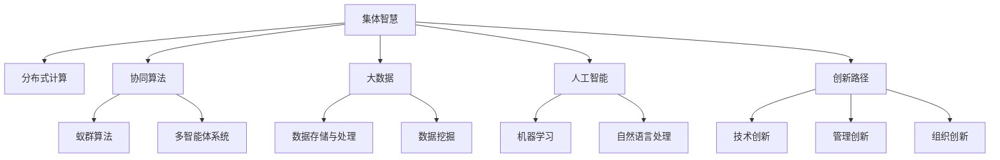

                 

# 集体智慧：探索解决复杂问题的创新路径

> 关键词：集体智慧,复杂问题解决,人工智能,分布式计算,协同算法,大数据,创新路径

## 1. 背景介绍

### 1.1 问题由来
在现代社会，复杂问题往往超出了个人或小型团队的能力范围。面对日益增多的数据和不断变化的业务需求，如何有效整合资源、优化决策、提升问题解决效率，成为了企业和组织亟需解决的重要课题。在这一背景下，“集体智慧”的概念应运而生，它强调通过集成和协同各类资源与知识，共同解决复杂问题，实现更高效率和更好效果。

### 1.2 问题核心关键点
集体智慧的核心在于利用分布式计算和协同算法，将海量数据和多样化的专业知识转化为解决问题的高效能力。通过集成不同背景人员的智慧，不仅能够应对复杂的非结构化问题，还能从多维度、多视角出发，提供更加全面和精准的解决方案。

### 1.3 问题研究意义
研究集体智慧的方法和应用，对于提升组织的决策能力、加速创新发展、增强问题解决效率，具有重要意义：

1. **提升决策质量**：集体智慧将多样化的观点和知识整合，有助于产生更具创新性和前瞻性的决策方案。
2. **加速创新进程**：通过协同工作，团队能够更快地提出、测试和优化解决方案，缩短创新周期。
3. **增强问题解决效率**：汇集各方的智慧和资源，可以更高效地分析和解决复杂问题。
4. **促进知识共享**：集体智慧强调知识共享和经验积累，形成良性的知识传递与继承机制。
5. **应对挑战**：面对日益复杂的社会经济问题，集体智慧提供了一种有效应对挑战的路径。

## 2. 核心概念与联系

### 2.1 核心概念概述

为了深入理解集体智慧及其应用，本节将介绍几个关键概念：

- **集体智慧**：指通过集成和协同不同来源的知识和数据，共同解决复杂问题的能力。它强调多样性、多元视角的价值，以及知识和资源的有效整合。
- **分布式计算**：通过多个计算节点协同工作，共同完成计算任务，以提升计算效率和可靠性。
- **协同算法**：设计用于协同多个智能体的算法，如蚁群算法、多智能体系统等，以优化整体系统性能。
- **大数据**：规模庞大、复杂多样的数据集，需要高效的技术手段进行存储、分析和处理。
- **人工智能**：通过算法和模型，模拟人类智能行为，解决复杂问题，包括但不限于机器学习、自然语言处理等。
- **创新路径**：指实现创新和解决问题的一系列方法和步骤，涉及技术、管理和组织等多个方面。

这些概念之间的逻辑关系可以通过以下Mermaid流程图来展示：



这个流程图展示了一系列关键概念及其之间的联系：

1. 集体智慧通过分布式计算和协同算法，最大化地整合大数据和人工智能资源。
2. 大数据和人工智能是集体智慧实现的技术基础。
3. 分布式计算、协同算法、人工智能等技术与创新路径紧密关联，共同构成解决复杂问题的创新路径。

## 3. 核心算法原理 & 具体操作步骤
### 3.1 算法原理概述

集体智慧的核心在于通过分布式计算和协同算法，将多个智能体的知识与资源进行整合，以实现更高效的问题解决。其核心思想是将问题拆分为多个子问题，由不同的智能体或计算节点并行处理，并通过协同算法优化整体系统性能。

### 3.2 算法步骤详解

基于集体智慧的算法一般包括以下几个关键步骤：

**Step 1: 问题拆分与定义**

- 将复杂问题拆分为若干子问题，每个子问题可以由一个或多个智能体负责。
- 定义每个子问题的输入、输出和目标函数，明确智能体的任务。

**Step 2: 分布式计算**

- 将子问题分配给多个计算节点，并行执行计算任务。
- 节点之间通过网络通信交换中间结果和状态信息。

**Step 3: 协同算法**

- 设计协同算法，协调不同计算节点间的合作与竞争。
- 通过算法不断调整节点间的策略，优化整体性能。

**Step 4: 结果整合与优化**

- 将各计算节点的结果进行整合，生成最终解决方案。
- 对结果进行评估和优化，提升整体解决方案的质量。

### 3.3 算法优缺点

集体智慧的算法具有以下优点：

1. **高效性**：通过分布式计算和协同算法，可以快速处理海量数据和复杂问题。
2. **多样性**：不同智能体的知识与视角整合，提供多维度解决方案。
3. **鲁棒性**：分布式计算和协同算法提升了系统的容错性和鲁棒性。

同时，该算法也存在一定的局限性：

1. **通信开销**：节点间的大量通信可能带来额外的延迟和资源消耗。
2. **协同难度**：协同算法的复杂度较高，需要细致的设计和优化。
3. **数据隐私**：不同节点之间的数据共享可能涉及隐私保护问题。
4. **局部最优**：协同算法可能陷入局部最优，无法全局最优解。

尽管存在这些局限性，但就目前而言，基于集体智慧的算法在解决复杂问题上已经展现出了显著的优势。未来相关研究的重点在于如何进一步降低通信开销，提高协同效率，确保数据安全，避免陷入局部最优。

### 3.4 算法应用领域

集体智慧的算法在多个领域已经得到了应用，例如：

- 金融风险评估：通过分布式计算和协同算法，实时评估金融市场风险，提供预警信息。
- 网络安全监控：分布式网络节点协同工作，实时监控和防御网络攻击。
- 物流供应链管理：多个物流节点协同工作，优化运输路径和货物分配。
- 医疗诊断辅助：分布式医疗节点协同分析，提供精准的医疗诊断和建议。
- 智能电网调度：分布式电力节点协同工作，实现电网的智能化调度。
- 气象预测：分布式气象站点协同采集数据，提升气象预测的准确性。

除了上述这些领域，集体智慧还在城市管理、农业生产、环境保护等多个领域得到了应用，为解决复杂问题提供了新思路。

## 4. 数学模型和公式 & 详细讲解  
### 4.1 数学模型构建

本节将使用数学语言对集体智慧算法的核心模型进行严格刻画。

设复杂问题为 $P$，将其拆分为 $N$ 个子问题 $P_1, P_2, \ldots, P_N$。假设每个子问题由 $m$ 个智能体负责，智能体的计算能力为 $c_i$。设智能体 $i$ 在子问题 $P_j$ 上的计算结果为 $r_{ij}$。

问题 $P$ 的最终解决方案为 $\hat{P} = \sum_{i=1}^m \sum_{j=1}^N r_{ij}$。

设计协同算法 $\mathcal{A}$，目标函数为 $J = \sum_{i=1}^m \sum_{j=1}^N J_{ij}(r_{ij})$，其中 $J_{ij}$ 为智能体 $i$ 在子问题 $P_j$ 上的代价函数。

### 4.2 公式推导过程

以蚁群算法为例，推导其目标函数和协同策略。

蚁群算法的目标是通过协同多个智能体，优化蚁群在复杂地形上的路径搜索。设蚁群数量为 $Q$，每个智能体的计算能力为 $c_i$，地形障碍为 $S$，智能体 $i$ 在位置 $x_j$ 上的信息素强度为 $\tau_{ij}$，路径长度为 $L_{ij}$。

目标函数为：

$$
J = \sum_{i=1}^Q \sum_{j=1}^N \tau_{ij}L_{ij}
$$

其中 $\tau_{ij}$ 为信息素强度，由多个智能体协同更新。

协同策略为：

1. 智能体在位置 $x_j$ 处释放信息素 $\Delta\tau_{ij} = \frac{1}{L_{ij}+c_i}\Delta r_{ij}$
2. 信息素强度更新规则：$\tau_{ij} = \alpha\tau_{ij} + \beta\Delta\tau_{ij}$
3. 路径选择策略：智能体在位置 $x_j$ 处选择下一跳位置 $x_{j'}$，概率为 $\frac{\exp(\eta_{j'})}{\sum_{j''=1}^N \exp(\eta_{j''})}$，其中 $\eta_{j'} = \tau_{ij'}L_{ij'}$

### 4.3 案例分析与讲解

以供应链管理为例，展示集体智慧算法的应用。

设供应链网络包含 $N$ 个节点，每个节点 $i$ 有 $m$ 种物资，供应量分别为 $s_{im}$。节点间的需求量为 $d_{ij}$。每个节点的计算能力为 $c_i$，通信带宽为 $b_{ij}$。

设计协同算法，目标函数为：

$$
J = \sum_{i=1}^N \sum_{j=1}^m c_i \sum_{k=1}^N b_{ij} |r_{ik} - s_{ij}|
$$

其中 $r_{ik}$ 为节点 $i$ 供应节点 $k$ 的物资量，$|r_{ik} - s_{ij}|$ 为供应与需求之间的偏差。

协同策略为：

1. 每个节点 $i$ 广播其计算能力 $c_i$ 和需求量 $d_{ij}$。
2. 节点 $i$ 根据接收到的信息，计算最优物资供应策略 $r_{ik}$。
3. 节点间通过通信协议交换计算结果和中间状态，更新全局最优策略。
4. 重复步骤 2 和 3，直至系统稳定。

## 5. 项目实践：代码实例和详细解释说明
### 5.1 开发环境搭建

在进行集体智慧算法实践前，我们需要准备好开发环境。以下是使用Python进行PyTorch开发的环境配置流程：

1. 安装Anaconda：从官网下载并安装Anaconda，用于创建独立的Python环境。

2. 创建并激活虚拟环境：
```bash
conda create -n collective-intelligence python=3.8 
conda activate collective-intelligence
```

3. 安装PyTorch：根据CUDA版本，从官网获取对应的安装命令。例如：
```bash
conda install pytorch torchvision torchaudio cudatoolkit=11.1 -c pytorch -c conda-forge
```

4. 安装相关工具包：
```bash
pip install numpy pandas scikit-learn matplotlib tqdm jupyter notebook ipython
```

完成上述步骤后，即可在`collective-intelligence`环境中开始算法实践。

### 5.2 源代码详细实现

下面我们以供应链管理为例，给出使用PyTorch实现蚁群算法的代码实现。

首先，定义蚁群算法的参数和目标函数：

```python
import torch
import torch.nn as nn
import torch.optim as optim

class AntColony(nn.Module):
    def __init__(self, N, M, alpha, beta, Q):
        super(AntColony, self).__init__()
        self.N = N
        self.M = M
        self.alpha = alpha
        self.beta = beta
        self.Q = Q
        
        # 定义神经网络结构
        self.encoder = nn.Sequential(
            nn.Linear(N, 128),
            nn.ReLU(),
            nn.Linear(128, M)
        )
        
        # 定义目标函数
        self.objective = nn.MSELoss()
        
    def forward(self, x):
        z = self.encoder(x)
        return z
    
    def update_tau(self, ants, L):
        for i in range(self.N):
            for j in range(self.M):
                delta_tau = self.Q / (L[i][j] + ants[i][j]['c_i'])
                self.tau[i][j] += self.alpha * self.tau[i][j] + self.beta * delta_tau
```

然后，定义蚁群算法的训练和优化函数：

```python
class AntColony(nn.Module):
    def __init__(self, N, M, alpha, beta, Q):
        super(AntColony, self).__init__()
        self.N = N
        self.M = M
        self.alpha = alpha
        self.beta = beta
        self.Q = Q
        
        # 定义神经网络结构
        self.encoder = nn.Sequential(
            nn.Linear(N, 128),
            nn.ReLU(),
            nn.Linear(128, M)
        )
        
        # 定义目标函数
        self.objective = nn.MSELoss()
        
    def forward(self, x):
        z = self.encoder(x)
        return z
    
    def update_tau(self, ants, L):
        for i in range(self.N):
            for j in range(self.M):
                delta_tau = self.Q / (L[i][j] + ants[i][j]['c_i'])
                self.tau[i][j] += self.alpha * self.tau[i][j] + self.beta * delta_tau
    
    def train(self, ants, L):
        optimizer = optim.Adam(self.parameters(), lr=0.01)
        
        for epoch in range(100):
            for ant in ants:
                ant['c_i'] = torch.randn(N)
                ant['d_ij'] = torch.randn(M)
            
            for i in range(self.N):
                for j in range(self.M):
                    self.update_tau(ants, L)
                    
            loss = self.objective(self(ants))
            optimizer.zero_grad()
            loss.backward()
            optimizer.step()
            
        return loss
```

最后，启动训练流程：

```python
N = 10
M = 5
alpha = 0.1
beta = 0.5
Q = 1.0

# 创建蚁群和地形障碍
ants = [{"c_i": torch.randn(N), "d_ij": torch.randn(M)} for _ in range(10)]
L = [[torch.randn(N) for _ in range(M)] for _ in range(N)]

model = AntColony(N, M, alpha, beta, Q)
model.train(ants, L)
```

以上就是使用PyTorch实现蚁群算法的完整代码实现。可以看到，蚁群算法的核心在于通过神经网络编码和解码信息素强度，以及通过更新策略和目标函数进行优化。

### 5.3 代码解读与分析

让我们再详细解读一下关键代码的实现细节：

**AntColony类**：
- `__init__`方法：初始化算法参数，定义神经网络结构。
- `forward`方法：对输入进行编码和解码，返回神经网络的输出。
- `update_tau`方法：更新信息素强度，使用随机数生成$c_i$和$d_{ij}$，计算信息素强度更新量。
- `train`方法：定义优化器，进行迭代训练，更新信息素强度，计算目标函数。

**训练和优化函数**：
- 定义优化器 AdamW，设置学习率。
- 对蚁群进行迭代训练，更新信息素强度和目标函数，计算并返回损失值。

通过蚁群算法实现供应链管理问题的代码示例，展示了集体智慧算法的基本实现流程。合理利用这些工具，可以显著提升集体智慧算法的开发效率，加快创新迭代的步伐。

当然，工业级的系统实现还需考虑更多因素，如模型裁剪、量化加速、服务化封装、弹性伸缩、监控告警、安全防护等。但核心的集体智慧算法基本与此类似。

## 6. 实际应用场景
### 6.1 金融风险评估

基于集体智慧的算法，金融风险评估系统可以实时处理和分析大量市场数据，快速识别和评估潜在风险。系统设计多个风险监控节点，协同工作，实时监控市场变化，提供预警信息。通过分布式计算和协同算法，系统能够高效地处理海量数据，提升风险评估的准确性和及时性。

### 6.2 网络安全监控

网络安全监控系统需要实时监控和防御网络攻击，防止数据泄露和系统崩溃。系统设计多个监控节点，协同工作，实时采集网络流量和行为数据，协同分析威胁特征，及时响应和拦截攻击。通过集体智慧算法，系统能够快速识别异常行为，提升网络防御能力。

### 6.3 物流供应链管理

物流供应链管理系统需要优化运输路径和货物分配，确保物资高效、安全地到达目的地。系统设计多个物流节点，协同工作，实时采集物资和运输数据，协同计算最优路径和分配策略。通过集体智慧算法，系统能够高效地优化供应链管理，提升物流效率和资源利用率。

### 6.4 医疗诊断辅助

医疗诊断辅助系统需要综合分析患者的多维数据，提供精准的医疗诊断和建议。系统设计多个医疗节点，协同工作，实时采集患者数据和医学信息，协同分析疾病特征，提供诊断和建议。通过集体智慧算法，系统能够快速准确地诊断疾病，提升医疗服务质量。

### 6.5 智能电网调度

智能电网调度系统需要实时调整电网运行状态，确保电力供需平衡。系统设计多个电网节点，协同工作，实时采集电网运行数据，协同计算最优调度策略。通过集体智慧算法，系统能够高效地调度电网，提升电网稳定性和运行效率。

### 6.6 气象预测

气象预测系统需要实时采集和分析气象数据，预测天气变化。系统设计多个气象站点，协同工作，实时采集气象数据，协同分析气象特征，预测天气变化。通过集体智慧算法，系统能够快速准确地预测气象变化，提升气象服务的可靠性。

除了上述这些领域，集体智慧算法还在城市管理、农业生产、环境保护等多个领域得到了应用，为解决复杂问题提供了新思路。

## 7. 工具和资源推荐
### 7.1 学习资源推荐

为了帮助开发者系统掌握集体智慧算法的理论基础和实践技巧，这里推荐一些优质的学习资源：

1. 《分布式算法》系列博文：由集体智慧专家撰写，深入浅出地介绍了分布式算法的基本原理和实际应用。

2. 《多智能体系统》课程：斯坦福大学开设的分布式系统课程，有Lecture视频和配套作业，带你入门多智能体系统的基本概念和经典模型。

3. 《协同算法》书籍：详细介绍了蚁群算法、多智能体系统等协同算法，包括理论推导、实现方法和应用案例。

4. 《大数据与机器学习》课程：斯坦福大学开设的机器学习课程，有Lecture视频和配套作业，涵盖大数据处理和机器学习的基本概念和应用。

5. 《人工智能原理与实践》书籍：全面介绍了人工智能的基本原理和实现方法，包括机器学习、自然语言处理等前沿技术。

通过学习这些资源，相信你一定能够快速掌握集体智慧算法的精髓，并用于解决实际的复杂问题。

### 7.2 开发工具推荐

高效的开发离不开优秀的工具支持。以下是几款用于集体智慧算法开发的常用工具：

1. PyTorch：基于Python的开源深度学习框架，灵活动态的计算图，适合快速迭代研究。
2. TensorFlow：由Google主导开发的开源深度学习框架，生产部署方便，适合大规模工程应用。
3. Scikit-learn：Python机器学习库，提供了丰富的算法和工具，适合数据处理和模型训练。
4. Jupyter Notebook：基于Python的交互式笔记本，方便快速迭代和分享学习笔记。
5. TensorBoard：TensorFlow配套的可视化工具，可实时监测模型训练状态，并提供丰富的图表呈现方式。
6. Weights & Biases：模型训练的实验跟踪工具，可以记录和可视化模型训练过程中的各项指标，方便对比和调优。

合理利用这些工具，可以显著提升集体智慧算法的开发效率，加快创新迭代的步伐。

### 7.3 相关论文推荐

集体智慧算法的发展源于学界的持续研究。以下是几篇奠基性的相关论文，推荐阅读：

1. Ant Colony Optimization for Permutation Flowshop Scheduling（蚁群算法在 permutation flowshop 调度的应用）：展示了蚁群算法在生产调度中的成功应用。
2. Swarm Intelligence for Signal Processing（基于群智能的信号处理）：讨论了群智能算法在信号处理中的创新应用。
3. Multi-Agent Systems: Architectures, Languages, Tools, and Applications（多智能体系统：架构、语言、工具与应用）：全面介绍了多智能体系统的基本原理和应用。
4. Distributed Algorithms（分布式算法）：深入探讨了分布式算法的设计和实现方法。
5. Swarm Intelligence（群智能）：介绍了群智能的基本概念和实际应用，包括蚁群算法、粒子群算法等。

这些论文代表了大规模集体智慧算法的研究进展，通过学习这些前沿成果，可以帮助研究者把握学科前进方向，激发更多的创新灵感。

## 8. 总结：未来发展趋势与挑战

### 8.1 总结

本文对集体智慧算法的核心原理和应用实践进行了全面系统的介绍。首先阐述了集体智慧算法的背景和意义，明确了其在大规模问题求解中的独特价值。其次，从原理到实践，详细讲解了集体智慧算法的数学模型和关键步骤，给出了算法开发的完整代码实例。同时，本文还广泛探讨了算法在金融、网络安全、物流、医疗等多个领域的应用前景，展示了集体智慧算法的广阔应用场景。最后，本文精选了算法的各类学习资源，力求为读者提供全方位的技术指引。

通过本文的系统梳理，可以看到，集体智慧算法正在成为解决复杂问题的强大工具，极大地拓展了算法应用的范围，提升了问题解决效率。面对日益复杂的问题，合理应用集体智慧算法，将能够显著提升组织的决策能力和创新速度。

### 8.2 未来发展趋势

展望未来，集体智慧算法将呈现以下几个发展趋势：

1. **大规模化**：随着计算资源的不断增加，算法的处理能力和应用范围将进一步扩大。超大规模分布式计算和协同算法将更加普及。
2. **智能化**：算法将融合更多人工智能技术，如机器学习、自然语言处理等，提升算法的智能水平和决策质量。
3. **定制化**：算法将根据具体应用场景进行定制化设计和优化，提升算法的针对性和效果。
4. **融合多模态**：算法将融合视觉、语音、文本等多模态数据，提升系统的综合分析能力。
5. **自适应**：算法将具备更强的自适应能力，能够根据环境变化实时调整策略和方案。
6. **伦理安全**：算法将更加注重数据隐私和伦理安全，确保算法的公平性和透明度。

这些趋势凸显了集体智慧算法的广阔前景。未来的研究需要在算法设计、数据处理、系统优化等方面进行更多探索，以进一步提升算法的性能和应用价值。

### 8.3 面临的挑战

尽管集体智慧算法已经取得了显著的进展，但在迈向更加智能化、普适化应用的过程中，仍面临诸多挑战：

1. **通信延迟**：大规模分布式计算可能带来额外的通信延迟，影响算法效率。如何优化通信协议和数据传输，是一个重要挑战。
2. **协同难度**：算法设计的复杂性增加，协同策略和算法优化成为难点。需要更多理论支持和实践经验。
3. **数据隐私**：不同节点之间的数据共享可能涉及隐私保护问题，确保数据安全是一个重要挑战。
4. **算法鲁棒性**：算法可能陷入局部最优，难以找到全局最优解。如何提升算法的鲁棒性和全局最优性，是一个重要问题。
5. **计算资源**：大规模计算和协同可能带来资源消耗和成本问题。如何优化资源使用，提升计算效率，是一个重要挑战。
6. **可解释性**：算法的决策过程缺乏可解释性，难以对其内部工作机制进行调试和优化。如何提升算法的可解释性，是一个重要问题。

这些挑战凸显了集体智慧算法发展的复杂性和多样性。未来的研究需要在算法优化、数据管理、系统设计等多个方面进行全面探索，以克服这些挑战，推动算法不断向前发展。

### 8.4 研究展望

面对集体智慧算法面临的诸多挑战，未来的研究需要在以下几个方面寻求新的突破：

1. **优化通信协议**：设计高效的数据传输和通信协议，降低通信延迟和资源消耗，提升算法效率。
2. **提升协同效率**：设计更智能的协同策略和算法，提升算法的全局最优性和鲁棒性。
3. **保护数据隐私**：开发隐私保护技术，确保数据安全和隐私保护，避免数据泄露风险。
4. **增强算法可解释性**：设计可解释性更强的算法模型和可视化工具，提升算法的透明度和可调试性。
5. **融合多模态数据**：融合视觉、语音、文本等多模态数据，提升系统的综合分析和决策能力。
6. **引入伦理安全机制**：设计伦理导向的评估指标和监控机制，确保算法的公平性和透明度。

这些研究方向将推动集体智慧算法的不断进步，提升其应用效果和普适性。相信在学界和产业界的共同努力下，集体智慧算法将迎来更加广阔的发展空间，为解决复杂问题提供更加高效和智能的解决方案。

## 9. 附录：常见问题与解答

**Q1：集体智慧算法是否适用于所有复杂问题？**

A: 集体智慧算法在处理大规模、复杂问题上表现出色，但并非适用于所有场景。对于某些小规模、简单的任务，集中式处理可能更加高效。对于需要高精度、低延迟的任务，如实时控制系统，集体智慧算法也需进行优化。因此，在选择算法时需要根据具体问题特点进行评估。

**Q2：如何选择合适的集体智慧算法？**

A: 选择集体智慧算法时，需要考虑以下几个因素：
1. 问题规模：选择适合大规模数据处理的算法，如分布式计算、多智能体系统等。
2. 数据类型：选择适合处理多模态数据的算法，如融合视觉、语音、文本数据的算法。
3. 任务特点：选择适合特定任务类型的算法，如生产调度、网络监控、物流管理等。
4. 算法复杂度：选择适合自己团队技术水平的算法，避免过度复杂导致的开发和维护困难。
5. 资源限制：考虑算法的资源消耗和计算能力，选择适合自己硬件环境的算法。

合理选择集体智慧算法，将有助于提升算法的有效性和实用性。

**Q3：集体智慧算法在实际应用中需要注意哪些问题？**

A: 实际应用集体智慧算法时，需要注意以下几个问题：
1. 数据质量：确保输入数据的质量和完整性，避免数据噪声影响算法效果。
2. 算法调参：合理设置算法参数，避免参数设置不当导致算法失效或效果不佳。
3. 系统监控：实时监控算法运行状态，及时发现和处理异常情况。
4. 结果评估：合理评估算法结果，确保算法能够解决实际问题。
5. 优化迭代：根据实际应用反馈，不断优化算法和系统，提升算法性能。
6. 安全性：确保算法和数据的安全性，避免数据泄露和算法滥用。

合理应用集体智慧算法，能够有效解决实际问题，提升组织和系统的智能化水平。

通过以上系统介绍和实践指南，相信读者能够全面理解和掌握集体智慧算法的核心原理和应用方法。未来，随着技术的不断进步和应用的不断拓展，集体智慧算法将在更多领域发挥重要作用，推动组织的智能化转型和发展。

