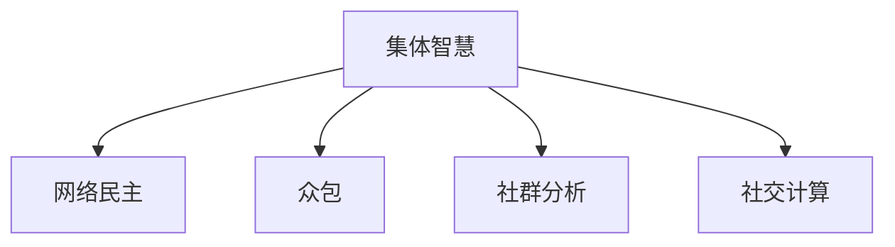

                 

# 集体智慧：群体决策的优势与陷阱

## 1. 背景介绍

### 1.1 问题由来

随着信息技术的快速发展和社交媒体的普及，互联网平台已成为人们获取信息、交流思想的重要渠道。越来越多的组织和决策机构开始利用网络平台，发动群众参与决策过程，以期在提升决策效率和质量的同时，保障社会公平公正。在多元化的互联网时代，如何发挥集体智慧的优势，规避其陷阱，是当前信息技术领域的一个重要研究课题。

### 1.2 问题核心关键点

基于网络平台的大规模群体决策，具备以下几个核心关键点：

- **信息获取的广泛性**：互联网平台使得任何人都能方便地获取决策相关信息，提升了决策过程的信息覆盖面。
- **决策参与的便捷性**：低门槛的参与条件和便捷的交流方式，极大激发了普通群众的参与意愿。
- **决策过程的透明性**：透明公开的决策流程，使得决策过程易于监督和问责。
- **决策结果的多样性**：不同背景、专业、视角的参与者，使得决策结果具有更高的多样性。
- **决策效率的提升**：快速响应、即时反馈的机制，提升了决策效率。
- **决策风险的扩大**：众多参与者可能会带来不同程度的偏见和误导性信息，增加决策风险。

这些关键点共同构成了基于网络平台的群体决策框架，带来了社会治理、企业决策等方面的深刻变革。然而，集体智慧的广泛应用，同样伴随着显著的陷阱和挑战。如何最大化发挥集体智慧的优势，同时规避其潜在风险，成为当前研究的一个重要方向。

## 2. 核心概念与联系

### 2.1 核心概念概述

为更好地理解基于网络平台的群体决策，本节将介绍几个密切相关的核心概念：

- **集体智慧（Collective Intelligence）**：指通过网络平台聚集众人的智慧，进行决策分析、问题解决等。集体智慧可以涵盖决策制定、创新、科学发现等多个领域。

- **网络民主（Cyber-Democracy）**：指利用互联网平台进行民主参与、政策讨论等决策过程。网络民主通过提升决策过程的透明度、参与度，推动社会治理的民主化进程。

- **众包（Crowdsourcing）**：指利用网络平台聚集大量自愿者，完成特定任务。众包广泛应用于数据分析、内容审核、客户服务等各个领域。

- **社群分析（Social Network Analysis）**：指分析群体间的互动关系，通过网络结构揭示群体行为和决策机制。

- **社交计算（Social Computing）**：指利用网络平台的社会互动特性，进行数据挖掘、知识发现、情感分析等。

这些核心概念之间的逻辑关系可以通过以下Mermaid流程图来展示：



这个流程图展示出集体智慧与网络民主、众包、社群分析、社交计算等概念的紧密联系，揭示了不同概念间的关系和作用。

## 3. 核心算法原理 & 具体操作步骤
### 3.1 算法原理概述

基于网络平台的群体决策，本质上是利用算法模型对海量信息进行处理，并集成众多参与者的意见，形成最终的决策结果。其核心算法原理包括：

- **信息获取与汇聚**：通过网络平台收集各类信息，汇聚成决策所需的数据集。
- **意见表达与融合**：参与者通过投票、评分、评论等方式表达意见，算法模型融合这些意见，形成决策备选方案。
- **结果评估与选择**：对备选方案进行评估，选择最合适的方案作为决策结果。

### 3.2 算法步骤详解

基于网络平台的群体决策算法步骤一般包括：

1. **信息收集**：通过网络平台收集各类相关数据，形成决策所需的数据集。数据来源包括专家意见、历史案例、法律法规、市场调研等。

2. **模型构建**：根据决策目标和数据特征，选择合适的算法模型，如线性回归、分类树、聚类算法、推荐系统等。

3. **数据预处理**：对收集到的数据进行清洗、归一化、去噪等预处理操作，提升数据质量。

4. **模型训练**：使用训练集对模型进行训练，优化模型参数，提高预测精度。

5. **决策执行**：将训练好的模型应用于新的数据集，得到决策结果。

6. **结果验证与反馈**：对决策结果进行验证，根据反馈对模型进行调整和优化。

7. **参与者激励**：对参与者进行激励，如奖励、积分等，以鼓励更多人参与决策。

8. **决策公开与监督**：将决策结果公开透明展示，接受公众监督，保证决策过程的公正性。

### 3.3 算法优缺点

基于网络平台的群体决策方法具有以下优点：

- **决策效率高**：通过算法自动化处理海量信息，极大地提升了决策效率。
- **决策结果多样**：大量参与者的不同视角和意见，增强了决策结果的多样性和全面性。
- **决策过程透明**：决策过程公开透明，便于监督和问责。

同时，该方法也存在一定的局限性：

- **信息噪音高**：海量信息可能包含大量误导性、低质量的信息，增加了噪音。
- **决策一致性低**：众多参与者的意见可能存在不一致，影响决策结果的稳定性。
- **算法复杂度高**：处理海量数据和众多参与者意见，算法模型的复杂度较高。
- **算法公平性问题**：算法模型可能存在算法偏见，导致某些群体意见被不公平地忽略或放大。

尽管存在这些局限性，但基于网络平台的群体决策方法仍然是提升决策质量和效率的重要途径。未来相关研究的重点在于如何进一步降低信息噪音，提高决策一致性，保证算法公平性，从而更好地发挥集体智慧的优势。

### 3.4 算法应用领域

基于网络平台的群体决策方法，已经在多个领域得到了广泛的应用，例如：

- 社会治理：通过网络平台发动群众参与政策讨论、民生改善等社会治理决策。
- 企业决策：利用网络平台进行项目评审、市场调研、创新方案等企业决策。
- 科技创新：通过网络平台征集创新想法、评估技术方案，推动技术进步。
- 公共安全：利用网络平台收集情报信息，进行公共安全决策。
- 医疗健康：通过网络平台征集疾病防治方案、健康管理策略等医疗决策。

除了上述这些经典应用外，基于网络平台的群体决策方法还将在更多领域得到应用，为社会治理、企业决策、科技创新等方面提供新的动力。

## 4. 数学模型和公式 & 详细讲解 & 举例说明

### 4.1 数学模型构建

本节将使用数学语言对基于网络平台的群体决策过程进行更加严格的刻画。

记决策问题为 $P$，数据集为 $D=\{(x_i,y_i)\}_{i=1}^N$，其中 $x_i$ 为输入特征向量，$y_i$ 为标签或决策结果。假设网络平台汇聚了 $K$ 个专家，每个专家的意见权重为 $w_k$，则群体决策的数学模型可以表示为：

$$
y^* = \sum_{k=1}^K w_k f_k(x)
$$

其中 $f_k$ 表示专家 $k$ 的决策模型，可以是线性回归、分类树、聚类算法等。$w_k$ 表示专家 $k$ 的权重，通常由专家经验、参与度等决定。

### 4.2 公式推导过程

在实际应用中，群体决策的数学模型需要进一步细化。以线性回归为例，专家 $k$ 的决策模型可以表示为：

$$
f_k(x) = \theta_k^T x
$$

其中 $\theta_k$ 表示专家 $k$ 的模型参数。群体决策的线性回归模型可以表示为：

$$
y^* = \sum_{k=1}^K w_k \theta_k^T x
$$

根据线性回归的求解方法，群体决策的模型参数 $\theta$ 可以通过最小二乘法求解，公式如下：

$$
\theta = (X^T W X)^{-1} X^T W y
$$

其中 $X=\begin{bmatrix}x_1^T \\ x_2^T \\ \vdots \\ x_N^T \end{bmatrix}$，$W=\begin{bmatrix}w_1 \\ w_2 \\ \vdots \\ w_K \end{bmatrix}$。

### 4.3 案例分析与讲解

以智能城市交通规划为例，群体决策的数学模型可以表示为：

- 输入特征 $x$ 包括历史交通数据、天气预报、用户出行习惯等。
- 决策结果 $y$ 为交通信号灯的亮度和分布。
- 专家 $k$ 的决策模型可以表示为线性回归模型 $f_k(x) = \theta_k^T x$。
- 专家的权重 $w_k$ 可以基于专家经验、专业背景、历史贡献等进行设定。

假设存在 $K$ 个专家，每个专家提供 $M$ 条决策建议，则数据集 $D$ 可以表示为：

$$
D = \{(x_i, y_i)\}_{i=1}^{NKM}
$$

其中 $x_i$ 表示第 $i$ 条建议的特征向量，$y_i$ 表示第 $i$ 条建议的决策结果。

将专家建议集合并，可以构建群体决策的线性回归模型：

$$
y^* = \sum_{k=1}^K \sum_{m=1}^M w_{k,m} f_k(x)
$$

其中 $w_{k,m}$ 表示专家 $k$ 的第 $m$ 条建议的权重，通常为专家建议的准确性和专业性。

通过求解上述线性回归模型，可以得到最优的群体决策方案，即交通信号灯的亮度和分布。

## 5. 项目实践：代码实例和详细解释说明
### 5.1 开发环境搭建

在进行群体决策的代码实现前，我们需要准备好开发环境。以下是使用Python进行Scikit-Learn开发的Python环境配置流程：

1. 安装Anaconda：从官网下载并安装Anaconda，用于创建独立的Python环境。

2. 创建并激活虚拟环境：
```bash
conda create -n scikit-learn-env python=3.8 
conda activate scikit-learn-env
```

3. 安装Scikit-Learn：使用pip安装Scikit-Learn库。

4. 安装各类工具包：
```bash
pip install numpy pandas scikit-learn matplotlib tqdm jupyter notebook ipython
```

完成上述步骤后，即可在`scikit-learn-env`环境中开始群体决策的实现。

### 5.2 源代码详细实现

以下是一个简单的群体决策线性回归模型实现示例：

```python
from sklearn.linear_model import LinearRegression
from sklearn.metrics import mean_squared_error
from sklearn.model_selection import train_test_split

# 创建虚拟数据集
X = np.random.randn(100, 10)
y = np.dot(X, np.random.randn(10, 1)) + np.random.randn(100, 1)

# 创建专家集
K = 5
w_k = np.random.rand(K, 1)
f_k = np.dot(X, w_k) + np.random.randn(100, 1)

# 合并专家建议
X_all = np.concatenate([X, X])
y_all = np.concatenate([y, y])
w_all = np.concatenate([w_k, w_k])

# 划分训练集和测试集
X_train, X_test, y_train, y_test = train_test_split(X_all, y_all, test_size=0.2)

# 构建群体决策模型
model = LinearRegression()
model.fit(X_train, y_train)

# 预测结果
y_pred = model.predict(X_test)

# 评估模型性能
mse = mean_squared_error(y_test, y_pred)
print(f"MSE: {mse:.2f}")
```

在这个示例中，我们使用Scikit-Learn库实现了简单的群体决策线性回归模型。通过随机生成数据集和专家集，构建了包含专家意见的群体决策模型，并使用均方误差（MSE）评估了模型的预测性能。

### 5.3 代码解读与分析

让我们再详细解读一下关键代码的实现细节：

**数据生成与专家集创建**：
- `np.random.randn` 生成随机数据，用于模拟专家建议。
- `w_k` 生成随机权重，表示专家意见的随机性。
- `f_k` 使用专家意见和权重计算出专家建议。

**数据合并与模型训练**：
- `np.concatenate` 将专家建议合并为一个数据集。
- `train_test_split` 将数据集划分为训练集和测试集。
- `LinearRegression` 构建线性回归模型，并使用 `fit` 方法进行训练。

**预测与性能评估**：
- `predict` 方法用于预测测试集结果。
- `mean_squared_error` 方法计算预测值与真实值之间的均方误差。

可以看到，Scikit-Learn库使得构建群体决策模型的代码实现变得简洁高效。开发者可以将更多精力放在数据处理、模型改进等高层逻辑上，而不必过多关注底层的实现细节。

当然，工业级的系统实现还需考虑更多因素，如模型的保存和部署、超参数的自动搜索、更灵活的算法组合等。但核心的群体决策算法基本与此类似。

## 6. 实际应用场景
### 6.1 智能城市交通规划

基于网络平台的群体决策方法，可以应用于智能城市交通规划的各个环节。传统交通规划往往依赖专家和历史数据的统计分析，周期长、成本高、效果有限。而通过网络平台发动群众参与决策，能够快速响应城市交通需求，形成更加科学合理的规划方案。

在技术实现上，可以构建城市交通问题的数学模型，通过网络平台收集群众的出行建议和偏好，利用群体决策方法生成交通信号灯的亮度和分布方案。微调模型的预测结果后，可以作为交通规划的重要参考。通过持续收集群众反馈，不断优化交通规划方案，提升城市交通管理水平。

### 6.2 社会治理决策

社会治理决策，如社区服务、治安管理、环境保护等，也可以通过网络平台进行群体决策。通过广泛发动群众参与决策，政府部门可以更好地了解民意，制定更符合公众需求的政策。

在技术实现上，可以构建各类社会治理问题的决策模型，通过网络平台收集群众的意见和建议，利用群体决策方法生成决策方案。微调模型的预测结果后，可以作为政府决策的重要参考。通过持续收集群众反馈，不断优化政策方案，提升社会治理的透明度和参与度。

### 6.3 企业项目评审

企业项目评审，如产品开发、市场调研、创新方案等，也可以通过网络平台进行群体决策。通过发动内部员工和外部专家参与决策，能够形成更加全面、客观的评审结果。

在技术实现上，可以构建企业项目评审的决策模型，通过网络平台收集各类意见和建议，利用群体决策方法生成评审结果。微调模型的预测结果后，可以作为项目评审的重要参考。通过持续收集反馈，不断优化评审流程，提升企业决策的科学性和公正性。

### 6.4 未来应用展望

随着网络平台的普及和群体决策方法的不断发展，基于网络平台的群体决策将在更多领域得到应用，为社会治理、企业决策、科技创新等方面提供新的动力。

在智慧医疗领域，基于网络平台的群体决策方法可以用于疾病防治方案、医疗资源配置等决策，提升医疗服务的公平性和效率。

在智能教育领域，群体决策方法可以用于课程设计、教学方法、评估标准等决策，提升教育的个性化和多样性。

在智慧城市治理中，群体决策方法可以用于公共设施布局、城市规划、环境治理等决策，提升城市管理的科学性和透明度。

此外，在金融、制造、能源等众多领域，基于网络平台的群体决策方法也将不断涌现，为各行各业提供新的决策工具。相信随着技术的日益成熟，群体决策方法将成为社会治理、企业决策、科技创新等领域的标准化工具，推动各行业决策水平的提升。

## 7. 工具和资源推荐
### 7.1 学习资源推荐

为了帮助开发者系统掌握基于网络平台的群体决策理论基础和实践技巧，这里推荐一些优质的学习资源：

1. 《群体智慧：从个体到集体》书籍：详细介绍了群体智慧的概念、应用和挑战，是了解群体决策理论的重要参考书。

2. 《大数据时代下的群体决策》课程：由知名学者开设的课程，系统讲解了基于大数据的群体决策方法，包括数据处理、模型构建、结果评估等。

3. 《社交计算与群体智慧》书籍：介绍了社交计算的基本原理和应用，详细讲解了基于社交网络的群体决策方法。

4. HuggingFace官方文档：提供了丰富的群体决策模型和代码实现，是学习群体决策算法的必备资料。

5. CybOS开源项目：开源社区开发的群体决策平台，提供了大量的实验和应用案例，方便开发者实践学习。

通过对这些资源的学习实践，相信你一定能够快速掌握基于网络平台的群体决策的精髓，并用于解决实际的决策问题。

### 7.2 开发工具推荐

高效的开发离不开优秀的工具支持。以下是几款用于群体决策开发的常用工具：

1. Jupyter Notebook：开源的交互式编程环境，支持Python、R等语言，方便开发者编写和调试代码。

2. Scikit-Learn：基于Python的机器学习库，提供了丰富的群体决策模型和算法实现，如线性回归、分类树、聚类算法等。

3. TensorFlow：由Google主导开发的开源深度学习框架，支持大规模分布式训练，适合处理海量数据。

4. Weights & Biases：模型训练的实验跟踪工具，可以记录和可视化模型训练过程中的各项指标，方便对比和调优。

5. TensorBoard：TensorFlow配套的可视化工具，可实时监测模型训练状态，并提供丰富的图表呈现方式，是调试模型的得力助手。

6. Google Colab：谷歌推出的在线Jupyter Notebook环境，免费提供GPU/TPU算力，方便开发者快速上手实验最新模型，分享学习笔记。

合理利用这些工具，可以显著提升群体决策任务的开发效率，加快创新迭代的步伐。

### 7.3 相关论文推荐

群体决策技术的发展源于学界的持续研究。以下是几篇奠基性的相关论文，推荐阅读：

1. Wisdom of the Crowds: Why the Masses Are Smarter Than an Expert in Groups （Wisdom of Crowds）：提出群体智慧的概念，揭示了群体决策的优势和陷阱。

2. Social Loops: Social Media as a Public Sphere（Social Loops）：探讨了社交媒体对群体决策的影响，揭示了网络民主的潜力和挑战。

3. Crowdsourcing: Task Design and Labor Markets on Amazon Mechanical Turk（Crowdsourcing）：详细介绍了众包的机制和应用，揭示了众包的效率和局限性。

4. The Collective Intelligence of Societies （The Collective Intelligence of Societies）：介绍了社群分析的基本原理和应用，揭示了社交网络对群体决策的影响。

5. Social Computing: The Internet as a Collective Brain （Social Computing）：探讨了社交计算的概念和应用，揭示了社交计算对群体智慧的促进作用。

这些论文代表了大数据和社交网络时代群体决策理论的发展脉络。通过学习这些前沿成果，可以帮助研究者把握学科前进方向，激发更多的创新灵感。

## 8. 总结：未来发展趋势与挑战
### 8.1 总结

本文对基于网络平台的群体决策方法进行了全面系统的介绍。首先阐述了群体决策的概念和优势，明确了其对提升决策效率和质量的重要作用。其次，从原理到实践，详细讲解了群体决策的数学模型和算法实现，给出了群体决策任务开发的完整代码实例。同时，本文还广泛探讨了群体决策方法在智能城市交通规划、社会治理、企业决策等多个领域的应用前景，展示了群体决策方法的应用潜力。此外，本文精选了群体决策技术的各类学习资源，力求为读者提供全方位的技术指引。

通过本文的系统梳理，可以看到，基于网络平台的群体决策方法正在成为提升决策质量和效率的重要途径。伴随大数据、社交网络等技术的发展，群体决策方法的应用将更加广泛，对社会治理、企业决策、科技创新等各个领域带来深远影响。

### 8.2 未来发展趋势

展望未来，群体决策技术将呈现以下几个发展趋势：

1. 数据融合与集成：随着数据采集技术的不断进步，越来越多的数据类型将被整合到群体决策中，提升决策信息的丰富性和多样性。

2. 算法优化与创新：基于深度学习、强化学习等技术的群体决策算法将不断优化，提升决策的准确性和效率。

3. 模型透明与解释：群体决策模型的可解释性和透明性将成为新的研究方向，帮助决策者理解模型的决策过程和结果。

4. 跨领域融合：群体决策方法将与其他人工智能技术进行更深入的融合，如知识表示、因果推理、强化学习等，提升决策系统的智能化水平。

5. 伦理道德约束：在群体决策过程中，如何确保决策过程的公平性、透明性和道德性，将成为重要的研究方向。

6. 社会治理智能化：基于网络平台的群体决策方法将进一步应用于社会治理领域，提升社会治理的智能化水平。

以上趋势凸显了基于网络平台的群体决策技术的广阔前景。这些方向的探索发展，必将进一步提升决策系统的效率和质量，为社会治理、企业决策、科技创新等各个领域提供新的工具和手段。

### 8.3 面临的挑战

尽管基于网络平台的群体决策技术已经取得了一定成就，但在迈向更加智能化、普适化应用的过程中，仍面临诸多挑战：

1. 数据质量与噪声：海量数据的采集和整合可能带来数据噪音和错误，影响决策质量。如何确保数据的质量和准确性，需要进一步研究和优化。

2. 算法偏见与公平性：群体决策算法可能存在算法偏见，导致某些群体意见被不公平地忽略或放大。如何设计公平、透明的算法，需要更多的研究和实践。

3. 计算资源限制：群体决策方法通常需要处理大规模数据，计算资源的需求较高。如何优化算法，降低计算复杂度，需要进一步研究和探索。

4. 参与者激励机制：如何激励参与者积极参与决策，提升决策质量，需要设计有效的激励机制。

5. 模型解释性与透明性：群体决策模型通常比较复杂，难以解释和理解。如何增强模型的透明性，提升用户信任度，需要进一步研究和实践。

6. 社会信任与合作：群体决策需要参与者的广泛信任和合作，如何构建信任机制，需要更多的社会研究和政策支持。

这些挑战是群体决策技术走向成熟的关键因素，需要学界、产业界和政策制定者的共同努力。唯有不断克服这些挑战，群体决策技术才能真正发挥其潜力和优势。

### 8.4 研究展望

面对群体决策面临的挑战，未来的研究需要在以下几个方面寻求新的突破：

1. 提升数据质量与真实性：进一步优化数据采集和整合方法，提升数据的质量和真实性。

2. 设计公平透明的算法：设计更多公平、透明的群体决策算法，确保不同群体的意见都能得到公平对待。

3. 优化计算效率与资源使用：探索新的计算方法和算法，降低群体决策的计算复杂度，提升计算效率。

4. 构建信任与合作机制：设计有效的参与者激励机制，构建信任机制，促进参与者的广泛合作。

5. 增强模型的解释性与透明性：探索新的模型解释方法和技术，提升模型的透明性和可解释性。

6. 推进社会治理智能化：利用群体决策技术，提升社会治理的智能化水平，促进社会治理的公平和透明。

这些研究方向将为群体决策技术的进一步发展提供新的动力，助力社会治理、企业决策、科技创新等各个领域实现智能化转型。

## 9. 附录：常见问题与解答

**Q1：网络平台上的数据质量如何保证？**

A: 网络平台上的数据质量需要通过多层次的数据清洗和预处理来保证。可以采用数据去重、缺失值填补、异常值检测等技术手段，提升数据的真实性和可靠性。同时，通过人工审核和众包验证，进一步提升数据质量。

**Q2：如何处理群体决策中的算法偏见？**

A: 处理群体决策中的算法偏见，需要从数据采集、模型设计、结果评估等多个环节进行综合考虑。可以通过多样化的数据来源和权重分配，减少算法偏见的影响。在设计模型时，可以引入公平性约束和平衡策略，确保不同群体的意见得到公平对待。在结果评估时，可以引入公平性指标和透明性机制，提升算法的公平性和可解释性。

**Q3：网络平台上的参与者激励机制如何设计？**

A: 网络平台上的参与者激励机制设计需要考虑参与者的多样性和动态性。可以通过积分奖励、排名展示、虚拟货币等手段，激励参与者积极参与决策。同时，可以设置多轮反馈机制，持续优化激励策略，确保参与者的持续参与和高质量贡献。

**Q4：群体决策模型的透明性与解释性如何提升？**

A: 提升群体决策模型的透明性和解释性，需要采用更加可解释的算法和技术。可以选择线性回归、决策树等简单模型，减少模型的复杂度，提升模型的透明性。可以引入可解释性工具，如LIME、SHAP等，对模型进行解释和分析，提升用户对决策结果的理解和信任度。

**Q5：如何构建网络平台上的信任机制？**

A: 构建网络平台上的信任机制，需要从平台设计、用户互动、监管机制等多个方面进行综合考虑。可以通过平台认证、用户评价、行为记录等手段，建立用户信任。同时，可以引入第三方审计和监管机制，确保平台操作的透明性和公正性。通过持续优化平台设计和运营，构建良好的用户体验和信任氛围。

总之，基于网络平台的群体决策方法在提升决策质量和效率方面具有重要价值，但其面临的挑战和问题也需要认真对待。通过不断的技术创新和实践优化，群体决策方法必将在更多领域得到应用，为社会治理、企业决策、科技创新等带来新的突破和机遇。

---

作者：禅与计算机程序设计艺术 / Zen and the Art of Computer Programming

