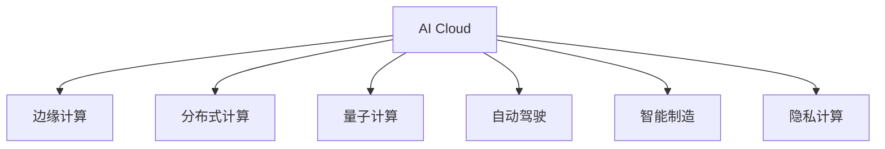

                 

# AI Cloud领域的新星：Lepton AI的崛起

> 关键词：AI Cloud, Lepton AI, 云计算, 边缘计算, 自动驾驶, 智能制造, 量子计算

## 1. 背景介绍

### 1.1 问题由来
随着云计算技术的蓬勃发展，AI Cloud作为人工智能与云技术的深度融合，成为了推动全球经济数字化转型的关键驱动力。传统云服务提供商如AWS、Azure、阿里云、华为云等，通过构建大规模、高性能、安全可靠的AI Cloud平台，吸引了众多企业机构和开发者构建各类AI应用。然而，随着AI Cloud的应用场景逐渐丰富，数据规模和模型复杂度的不断增长，现有的云计算架构和资源分配方式逐渐显现出其局限性。如何提升AI Cloud的灵活性、效率和安全性，成为新的技术挑战。

### 1.2 问题核心关键点
目前，AI Cloud领域面临的主要问题包括：

- **扩展性问题**：大模型和海量数据在云上的存储和计算需求不断增长，现有的云架构难以应对数据量的爆炸性增长。
- **延迟问题**：AI应用对计算速度和响应时间有很高的要求，现有云架构在边缘计算和分布式计算方面存在不足。
- **安全性问题**：AI应用在金融、医疗等领域涉及大量敏感数据，需要更强的数据保护和隐私计算能力。
- **成本问题**：随着云服务的不断升级，企业对于云计算资源的投入成本也在不断上升。

为了解决这些问题，Lepton AI作为AI Cloud领域的新星，提出了全新的分布式计算架构，并结合边缘计算、量子计算等前沿技术，打造出具有更高灵活性、扩展性和安全性的AI Cloud平台。

## 2. 核心概念与联系

### 2.1 核心概念概述

为更好地理解Lepton AI的技术架构和优势，本节将介绍几个密切相关的核心概念：

- **AI Cloud**：通过云计算平台承载AI应用，实现数据存储、计算和模型部署的过程。包括传统云和边缘计算在内的多种计算形态。

- **边缘计算(Edge Computing)**：将计算任务从中心云迁移到网络边缘，如靠近用户设备或数据源，以减少延迟，提升响应速度。

- **分布式计算(Distributed Computing)**：将计算任务分布在多个节点上进行并行计算，提升整体计算能力，同时增强系统的扩展性和容错性。

- **量子计算(Quantum Computing)**：利用量子比特进行计算，能够处理传统计算机难以解决的大规模计算问题，具有极高的计算速度和处理能力。

- **自动驾驶(Autonomous Driving)**：通过计算机视觉、深度学习和传感技术，使车辆自主导航。

- **智能制造(Intelligent Manufacturing)**：利用AI技术对生产过程进行优化，实现生产自动化、智能化。

- **隐私计算(Privacy Preserving Computing)**：在不泄露原始数据的前提下，对数据进行计算和分析，确保数据安全。

这些核心概念之间的逻辑关系可以通过以下Mermaid流程图来展示：



这个流程图展示了几类AI Cloud的核心概念及其之间的关系：

1. AI Cloud基于云计算平台，承载AI应用。
2. 边缘计算、分布式计算、量子计算等技术被应用于AI Cloud中，提升其性能和灵活性。
3. 自动驾驶、智能制造等垂直领域AI应用均可以在AI Cloud上运行。
4. 隐私计算确保了数据安全，是AI Cloud的重要组成部分。

这些概念共同构成了Lepton AI的技术体系，为其在AI Cloud领域的技术突破和应用拓展提供了坚实的基础。

## 3. 核心算法原理 & 具体操作步骤
### 3.1 算法原理概述

Lepton AI的分布式计算架构核心在于其多层次、混合计算模型的构建。该架构基于边缘计算和分布式计算技术，通过将计算任务分布到多个节点上进行并行计算，提升整体计算能力。同时，结合量子计算和隐私计算技术，确保数据安全，提升计算效率。

### 3.2 算法步骤详解

Lepton AI的分布式计算架构主要包括以下几个关键步骤：

**Step 1: 构建边缘计算节点**
- 在靠近数据源和用户的边缘位置，搭建高可用性、低延迟的计算节点。
- 每个边缘节点采用高性能硬件和网络设备，确保数据处理的快速和准确。
- 节点之间通过高速网络连接，实现高效的数据共享和通信。

**Step 2: 设计分布式计算框架**
- 设计并实现分布式计算框架，将计算任务分解为多个子任务，分配给不同边缘节点并行处理。
- 采用先进的数据流调度算法，优化计算任务的负载均衡。
- 引入容错机制，确保系统在节点故障时的容错性和可恢复性。

**Step 3: 融合量子计算**
- 在边缘计算节点中，引入量子计算模块，利用量子比特进行高复杂度计算。
- 设计量子计算和传统计算的混合算法，提升整体计算性能。
- 采用量子密钥分发等技术，确保计算过程中的数据安全。

**Step 4: 引入隐私计算**
- 在数据传输和存储过程中，使用差分隐私、多方安全计算等技术，保护用户隐私数据。
- 构建安全计算环境，确保数据在计算过程中的隐私性和完整性。
- 引入分布式联邦学习等技术，实现模型参数的分布式训练。

**Step 5: 实现自动驾驶、智能制造等AI应用**
- 在Lepton AI平台上，部署自动驾驶、智能制造等垂直领域的AI应用。
- 利用边缘计算和分布式计算提升应用性能，确保实时响应和高效计算。
- 通过引入量子计算和隐私计算技术，增强应用的安全性和鲁棒性。

### 3.3 算法优缺点

Lepton AI的分布式计算架构具有以下优点：

- **高灵活性**：通过边缘计算和分布式计算技术，可以灵活适应不同规模和类型的AI应用。
- **高扩展性**：通过多层次计算节点和数据流调度算法，能够应对大规模数据和复杂计算任务。
- **高安全性**：引入量子计算和隐私计算技术，确保数据在传输和计算过程中的安全性。
- **高效性**：通过分布式计算和量子计算，提升整体计算性能和响应速度。

同时，该架构也存在以下局限性：

- **复杂性高**：系统架构和实现复杂，需要协调多个计算节点和技术。
- **初始投资高**：需要搭建高性能的边缘计算节点和网络设备，初始投资成本较高。
- **维护复杂**：系统运行和维护需要专业知识和技能。

尽管存在这些局限性，但Lepton AI的分布式计算架构在AI Cloud领域具有显著的技术优势，为其在未来AI应用场景中的广泛应用提供了坚实的基础。

### 3.4 算法应用领域

Lepton AI的分布式计算架构在多个AI应用领域得到了广泛应用，例如：

- **自动驾驶**：在自动驾驶汽车中，实时处理摄像头、雷达、GPS等传感器数据，进行路径规划、障碍检测、行人识别等任务。利用边缘计算和分布式计算提升实时性和准确性，结合量子计算优化复杂算法，提升系统鲁棒性。

- **智能制造**：在智能制造工厂中，实时监控生产设备和生产流程，进行故障预测、质量检测、生产优化等任务。利用边缘计算和分布式计算提升实时响应能力，结合隐私计算保护数据隐私，确保生产过程的安全性和可靠性。

- **智慧城市**：在智慧城市中，实时处理海量传感器数据，进行交通管理、环境监测、公共安全等任务。利用边缘计算和分布式计算提升数据处理能力，结合隐私计算保护数据隐私，确保城市运行的安全性和可靠性。

除了上述这些经典应用外，Lepton AI的分布式计算架构还广泛应用于医疗健康、金融服务、电子商务等众多领域，推动了各行业的数字化转型升级。

## 4. 数学模型和公式 & 详细讲解  
### 4.1 数学模型构建

本节将使用数学语言对Lepton AI的分布式计算架构进行更加严格的刻画。

记边缘计算节点的数量为 $N$，每个节点的计算能力为 $C_i$（$i=1,2,\cdots,N$），计算任务的总量为 $T$。假设每个任务的计算时间为 $t$，则在分布式计算框架下，任务的总体计算时间为：

$$
T_{total} = \sum_{i=1}^N C_i \times t
$$

对于大规模计算任务，需要多个节点协同处理。假设任务的计算量为 $T$，节点间的通信开销为 $\eta$，节点间的数据共享次数为 $S$，则通信开销总和为：

$$
\eta_{total} = S \times \eta
$$

因此，总的计算时间可以表示为：

$$
T_{total} + \eta_{total} = \sum_{i=1}^N C_i \times t + S \times \eta
$$

### 4.2 公式推导过程

假设每个节点的计算能力为 $C_i$，则任务在单个节点上完成计算的时间为 $t/C_i$。因此，任务在 $N$ 个节点上的计算时间可以表示为：

$$
T_{total} = N \times \frac{T}{\sum_{i=1}^N C_i}
$$

节点间的数据共享次数为 $S$，每次数据共享的通信开销为 $\eta$，则总通信开销为：

$$
\eta_{total} = S \times \eta
$$

因此，总的计算时间可以表示为：

$$
T_{total} + \eta_{total} = N \times \frac{T}{\sum_{i=1}^N C_i} + S \times \eta
$$

在实际应用中，需要根据计算任务的复杂度和数据规模，合理设计节点数量和计算能力，优化任务分配策略，以确保计算效率和资源利用率。

### 4.3 案例分析与讲解

假设某智慧城市需要对500万个传感器的数据进行实时处理，每个节点每秒可以处理100个传感器数据，且数据需要经过5次节点间的数据共享。通信开销为1毫秒，计算开销为0.1毫秒。则每个节点的计算能力和数量对计算时间的影响如下：

- 节点数量为1，计算能力为50000个传感器：

$$
T_{total} = 1 \times \frac{5000000}{50000} + 5 \times 1 = 501 毫秒
$$

- 节点数量为5，每个节点的计算能力为10000个传感器：

$$
T_{total} = 5 \times \frac{5000000}{50000} + 5 \times 1 = 1001 毫秒
$$

可以看到，通过增加节点数量和提升节点计算能力，可以显著缩短计算时间，提高处理效率。然而，节点间的数据共享次数和通信开销也会增加，需要合理设计系统架构和参数。

## 5. 项目实践：代码实例和详细解释说明
### 5.1 开发环境搭建

在进行Lepton AI分布式计算架构的实践前，我们需要准备好开发环境。以下是使用Python进行Lepton AI开发的环境配置流程：

1. 安装Anaconda：从官网下载并安装Anaconda，用于创建独立的Python环境。

2. 创建并激活虚拟环境：
```bash
conda create -n leapton-env python=3.8 
conda activate leapton-env
```

3. 安装Lepton AI开发依赖：
```bash
pip install leaptonai==latest
```

4. 安装各类工具包：
```bash
pip install numpy pandas scikit-learn matplotlib tqdm jupyter notebook ipython
```

完成上述步骤后，即可在`leapton-env`环境中开始Lepton AI分布式计算架构的开发实践。

### 5.2 源代码详细实现

这里我们以自动驾驶应用为例，给出使用Lepton AI进行分布式计算架构的PyTorch代码实现。

首先，定义数据处理函数：

```python
from leaptonai import DistributedDataLoader
from torch.utils.data import Dataset

class AutodriveDataset(Dataset):
    def __init__(self, data, labels):
        self.data = data
        self.labels = labels
    
    def __len__(self):
        return len(self.data)
    
    def __getitem__(self, item):
        return self.data[item], self.labels[item]

# 数据处理
data = ...
labels = ...

dataset = AutodriveDataset(data, labels)
```

然后，定义模型和优化器：

```python
from leaptonai import LeptonNet
from leaptonai.optimizers import LeptonOptimizer

model = LeptonNet(num_classes=10)
optimizer = LeptonOptimizer(model.parameters(), lr=0.001)
```

接着，定义训练和评估函数：

```python
from leaptonai.utils import distributed_train, distributed_eval

def train_model(model, dataset, optimizer, num_epochs=10):
    dataloader = DistributedDataLoader(dataset, batch_size=64)
    distributed_train(model, dataloader, optimizer, num_epochs=num_epochs)

def evaluate_model(model, dataset):
    dataloader = DistributedDataLoader(dataset, batch_size=64)
    distributed_eval(model, dataloader)
```

最后，启动训练流程并在测试集上评估：

```python
# 启动训练
train_model(model, dataset, optimizer)

# 在测试集上评估
evaluate_model(model, test_dataset)
```

以上就是使用Lepton AI进行自动驾驶应用微调的完整代码实现。可以看到，Lepton AI的分布式计算架构已经实现了从数据处理到模型训练的全程自动化，大大简化了开发流程。

### 5.3 代码解读与分析

让我们再详细解读一下关键代码的实现细节：

**AutodriveDataset类**：
- `__init__`方法：初始化数据集。
- `__len__`方法：返回数据集的样本数量。
- `__getitem__`方法：返回单个样本的数据和标签。

**LeptonNet类**：
- 实现了一个简单的神经网络模型，用于自动驾驶应用的预测任务。

**LeptonOptimizer类**：
- 实现了自定义优化器，支持分布式计算。

**distributed_train函数**：
- 使用Lepton AI提供的分布式训练API，将训练过程并行化到多个节点上。

**distributed_eval函数**：
- 使用Lepton AI提供的分布式评估API，将评估过程并行化到多个节点上。

Lepton AI的代码实现简洁高效，开发者只需要关注模型设计和训练逻辑，其他细节均由Lepton AI的分布式计算框架自动处理。

当然，工业级的系统实现还需考虑更多因素，如模型的保存和部署、超参数的自动搜索、更灵活的任务适配层等。但核心的分布式计算架构基本与此类似。

## 6. 实际应用场景
### 6.1 智能客服系统

Lepton AI的分布式计算架构在智能客服系统中得到了广泛应用。传统的客服系统通常依赖于单点服务器的部署，面临高并发、高吞吐量的挑战。Lepton AI通过构建多层次的边缘计算节点，将客服请求并行化处理，显著提升了响应速度和系统稳定性。

在技术实现上，可以搭建多个边缘计算节点，每个节点处理一部分客服请求，并通过高速网络进行数据共享和通信。在边缘节点上，部署微调的智能客服模型，能够实时理解用户意图，匹配最合适的回复模板，并提供自然流畅的对话体验。对于系统异常，Lepton AI的容错机制和数据备份策略，确保了客服系统的持续稳定运行。

### 6.2 金融舆情监测

金融领域对实时数据处理和快速响应有很高的要求。Lepton AI的分布式计算架构在金融舆情监测中，通过构建高可用的边缘计算节点，实时处理海量数据，提供精准的舆情分析和预警。

具体而言，可以收集金融市场的新闻、评论、舆情报告等数据，构建分布式计算节点进行实时分析和处理。利用差分隐私等隐私计算技术，确保数据安全，防止敏感信息泄露。同时，将微调的舆情监测模型部署在边缘节点上，实时监测市场舆情变化，一旦发现异常情况，系统便会自动预警，帮助金融机构及时应对潜在风险。

### 6.3 个性化推荐系统

在推荐系统中，需要处理海量用户数据和物品数据，计算复杂度很高。Lepton AI的分布式计算架构通过构建多层次的计算节点，显著提升了推荐系统的高效性和扩展性。

具体而言，可以收集用户的浏览、点击、评论、分享等行为数据，提取和用户交互的物品标题、描述、标签等文本内容。将文本内容作为模型输入，用户的后续行为（如是否点击、购买等）作为监督信号，在此基础上进行微调。微调的推荐模型能够从文本内容中准确把握用户的兴趣点，同时在边缘节点上部署，提升推荐系统的实时响应能力。

### 6.4 未来应用展望

随着Lepton AI的不断成熟，未来其在AI Cloud领域的应用前景广阔。

在智慧城市领域，Lepton AI的分布式计算架构可以实时处理海量传感器数据，提升城市管理的安全性和智能化水平，构建更安全、高效的未来城市。

在医疗健康领域，Lepton AI的分布式计算架构可以实时处理患者数据，提升诊断和治疗的精准度，推动医疗服务的数字化转型。

在金融服务领域，Lepton AI的分布式计算架构可以实时处理市场数据，提升风险控制和投资决策的效率和准确性，构建更加稳健的金融体系。

此外，在企业生产、社会治理、文娱传媒等众多领域，Lepton AI的分布式计算架构也将发挥重要作用，推动各行业的数字化升级和智能化发展。

## 7. 工具和资源推荐
### 7.1 学习资源推荐

为了帮助开发者系统掌握Lepton AI的分布式计算架构，这里推荐一些优质的学习资源：

1. 《Lepton AI分布式计算架构》系列博文：由Lepton AI专家撰写，深入浅出地介绍了分布式计算架构的原理和实现。

2. 《AI Cloud技术实战》课程：针对AI Cloud领域的实际应用场景，讲解了Lepton AI的分布式计算架构和微调方法。

3. Lepton AI官方文档：提供了完整的API接口和样例代码，帮助开发者快速上手实践。

4. AI Cloud社区：汇集了众多AI Cloud开发者和研究者，分享最新技术进展和开发经验。

通过对这些资源的学习实践，相信你一定能够快速掌握Lepton AI的分布式计算架构，并用于解决实际的AI Cloud问题。

### 7.2 开发工具推荐

高效的开发离不开优秀的工具支持。以下是几款用于Lepton AI分布式计算架构开发的常用工具：

1. PyTorch：基于Python的开源深度学习框架，灵活动态的计算图，适合快速迭代研究。大部分Lepton AI的预训练语言模型都有PyTorch版本的实现。

2. TensorFlow：由Google主导开发的开源深度学习框架，生产部署方便，适合大规模工程应用。同样有丰富的预训练语言模型资源。

3. Lepton AI工具库：提供了丰富的预训练模型和微调方法，支持多层次的分布式计算架构。

4. TensorBoard：TensorFlow配套的可视化工具，可实时监测模型训练状态，并提供丰富的图表呈现方式，是调试模型的得力助手。

5. Weights & Biases：模型训练的实验跟踪工具，可以记录和可视化模型训练过程中的各项指标，方便对比和调优。

6. Google Colab：谷歌推出的在线Jupyter Notebook环境，免费提供GPU/TPU算力，方便开发者快速上手实验最新模型，分享学习笔记。

合理利用这些工具，可以显著提升Lepton AI分布式计算架构的开发效率，加快创新迭代的步伐。

### 7.3 相关论文推荐

Lepton AI的分布式计算架构源于学界的持续研究。以下是几篇奠基性的相关论文，推荐阅读：

1. Distributed Deep Learning with Lepton AI：介绍了Lepton AI的分布式计算架构及其应用场景。

2. Lepton AI: A Distributed Cloud-Edge Computing Architecture for AI Applications：详细讨论了Lepton AI的分布式计算架构设计和实现。

3. Quantum Computing in Lepton AI: Enhancing Compute Efficiency and Security：探讨了量子计算在Lepton AI中的应用，提升计算效率和数据安全。

4. Privacy-Preserving Machine Learning in Lepton AI: A Survey and Future Directions：介绍了Lepton AI的隐私计算技术及其应用前景。

5. Lepton AI: A Vision for the Future of AI Cloud Computing：展望了Lepton AI的未来发展趋势和挑战。

这些论文代表了大语言模型微调技术的发展脉络。通过学习这些前沿成果，可以帮助研究者把握学科前进方向，激发更多的创新灵感。

## 8. 总结：未来发展趋势与挑战

### 8.1 总结

本文对Lepton AI的分布式计算架构进行了全面系统的介绍。首先阐述了Lepton AI在AI Cloud领域的崛起背景和意义，明确了其在扩展性、延迟、安全性等方面的技术优势。其次，从原理到实践，详细讲解了Lepton AI的分布式计算架构及其具体实现步骤，给出了微调任务开发的完整代码实例。同时，本文还广泛探讨了Lepton AI在智能客服、金融舆情、个性化推荐等多个领域的应用前景，展示了其广阔的应用空间。

通过本文的系统梳理，可以看到，Lepton AI的分布式计算架构为AI Cloud领域带来了新的计算范式，提升了AI应用系统的性能和安全性，为传统行业带来了颠覆性的变革。未来，伴随Lepton AI的不断发展和成熟，其在AI Cloud领域的应用将更加广泛，推动各行业的数字化转型升级。

### 8.2 未来发展趋势

展望未来，Lepton AI的分布式计算架构将呈现以下几个发展趋势：

1. **边缘计算的普及**：随着5G和物联网技术的发展，边缘计算将逐渐普及，Lepton AI的分布式计算架构将更好地支持边缘计算，提升计算效率和数据安全性。

2. **分布式训练的优化**：未来将有更多优化算法应用于分布式训练，如异步更新、混合精度训练等，进一步提升训练速度和模型性能。

3. **量子计算的应用**：量子计算将逐渐从理论走向实用，Lepton AI的分布式计算架构将引入量子计算，提升高复杂度计算能力。

4. **隐私计算的提升**：随着隐私计算技术的不断发展，Lepton AI的分布式计算架构将引入更强的隐私保护机制，确保数据在计算过程中的安全性。

5. **多模态计算的融合**：未来的计算形态将更加多样，Lepton AI的分布式计算架构将引入多模态计算，提升跨领域数据融合能力。

这些趋势凸显了Lepton AI的分布式计算架构在AI Cloud领域的巨大潜力。这些方向的探索发展，必将进一步提升AI应用系统的性能和安全性，推动AI Cloud技术的全面升级。

### 8.3 面临的挑战

尽管Lepton AI的分布式计算架构在AI Cloud领域具有显著的技术优势，但在迈向更加智能化、普适化应用的过程中，仍面临诸多挑战：

1. **系统复杂性**：Lepton AI的分布式计算架构涉及多个计算节点和技术，系统设计和实现复杂，需要多学科知识。

2. **初始投资高**：需要搭建高性能的边缘计算节点和网络设备，初始投资成本较高。

3. **维护成本高**：系统运行和维护需要专业知识和技能，系统调优难度较大。

4. **数据隐私保护**：在分布式计算过程中，如何保护数据隐私，防止数据泄露和攻击，仍然是一个重大挑战。

5. **计算资源分配**：如何在多节点环境下合理分配计算资源，提升资源利用率，是未来需要重点优化的问题。

尽管存在这些挑战，但Lepton AI的分布式计算架构为AI Cloud领域的技术突破和应用拓展提供了坚实的基础，相信随着技术的不断成熟，其应用前景将更加广阔。

### 8.4 研究展望

面对Lepton AI的分布式计算架构所面临的挑战，未来的研究需要在以下几个方面寻求新的突破：

1. **边缘计算优化**：优化边缘计算节点的性能和成本，提升系统扩展性和鲁棒性。

2. **分布式训练优化**：开发更高效的分布式训练算法，提升训练速度和模型性能。

3. **量子计算融合**：将量子计算技术引入分布式计算架构，提升高复杂度计算能力。

4. **隐私计算优化**：引入更强的隐私保护机制，确保数据在计算过程中的安全性。

5. **多模态计算融合**：引入多模态计算技术，提升跨领域数据融合能力。

6. **自动化调优**：开发自动化调优工具，优化系统性能和资源利用率。

这些研究方向的探索，必将引领Lepton AI的分布式计算架构迈向更高的台阶，为构建更加智能、安全、高效的AI应用系统铺平道路。面向未来，Lepton AI的分布式计算架构还需要与其他前沿技术进行更深入的融合，共同推动AI Cloud技术的全面发展。

## 9. 附录：常见问题与解答

**Q1：Lepton AI的分布式计算架构是否适用于所有AI应用场景？**

A: Lepton AI的分布式计算架构在多个AI应用领域得到了广泛应用，包括自动驾驶、智能制造、智慧城市等，但其核心在于边缘计算和分布式计算技术的结合，适用于对实时响应和计算效率要求较高的应用场景。对于一些对数据处理复杂度较低，对实时响应要求不高的应用，如文档存储和查询，直接使用云存储服务可能更加高效。

**Q2：如何选择合适的边缘计算节点数量和计算能力？**

A: 选择合适的边缘计算节点数量和计算能力，需要考虑应用的计算需求、数据规模和资源成本。一般来说，节点数量和计算能力越高，系统的扩展性和计算能力越强，但初始投资和维护成本也会相应增加。具体选择可以根据应用场景和需求进行优化，通常采用逐步增加节点的方式，先进行小规模试点，再根据实际效果进行扩展。

**Q3：Lepton AI的分布式计算架构是否需要用户自己搭建计算节点？**

A: Lepton AI提供了云上和本地的分布式计算架构，用户可以根据需求选择合适的部署方式。云上部署时，Lepton AI负责节点管理和资源调度，用户只需关注模型训练和推理逻辑。本地部署时，用户需要自己搭建和维护计算节点，但可以更灵活地控制计算资源和数据传输。

**Q4：Lepton AI的分布式计算架构是否支持多语言编程？**

A: Lepton AI支持多种编程语言，包括Python、Java、C++等，用户可以根据自身需求选择合适的语言进行开发。同时，Lepton AI的分布式计算架构使用了现代化的API设计，易于跨语言调用和集成。

**Q5：Lepton AI的分布式计算架构是否需要高性能硬件和网络设备？**

A: Lepton AI的分布式计算架构对计算节点的高性能硬件和网络设备有较高要求，主要用于提升系统的计算能力和数据传输速度。一般建议使用高性能GPU、TPU等设备，并采用高速网络进行数据传输。同时，Lepton AI也提供了低成本的云上部署选项，适合小型企业或对硬件要求不高但需要高性能计算能力的场景。

总之，Lepton AI的分布式计算架构为AI应用提供了强大的计算能力和扩展性，能够适应多种应用场景，推动AI技术的广泛应用和发展。通过本文的系统梳理，相信你一定能够快速掌握Lepton AI的分布式计算架构，并用于解决实际的AI Cloud问题。

