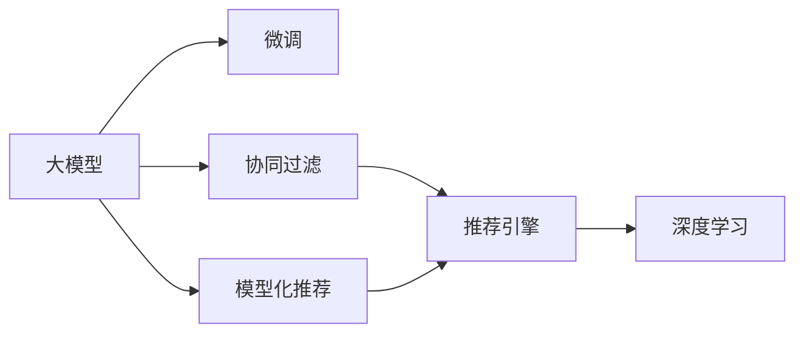

                 

## 1. 背景介绍

随着互联网技术的发展，电商平台的搜索推荐系统已经成为提升用户体验、增加用户粘性和增加销售收入的关键。传统推荐系统基于协同过滤和模型化推荐等技术，但这些方法在面对大规模、高维数据时，面临着数据稀疏性、冷启动问题和效果难以提升等问题。近年来，大模型技术，尤其是预训练语言模型，在自然语言处理领域取得了巨大的成功，通过在大规模数据上预训练获得强大的知识表示能力，再通过微调适应特定任务，展现出强大的泛化能力。

在这样的背景下，如何将大模型技术应用于搜索推荐系统，成为电商平台亟需解决的重要问题。本文章将系统介绍大模型技术在电商搜索推荐系统中的融合技术，从算法原理、模型构建、实际应用和未来展望等多个方面，全面剖析搜索推荐系统的算法本质，并总结实际应用中的一些关键问题。

## 2. 核心概念与联系

### 2.1 核心概念概述

为了更清晰地理解大模型在搜索推荐系统中的应用，我们首先需要明确一些核心概念：

- **大模型（Large Model）**：如BERT、GPT等，通过在大规模数据上预训练，具备强大的知识表示能力。
- **微调（Fine-tuning）**：在大模型基础上，针对特定任务进行参数更新，以提升模型在该任务上的表现。
- **协同过滤（Collaborative Filtering）**：基于用户和物品的共现关系进行推荐。
- **模型化推荐（Model-based Recommendation）**：基于用户行为数据和物品属性数据，建立推荐模型进行预测。
- **推荐引擎（Recommendation Engine）**：融合各种推荐算法和模型，为每个用户实时生成推荐结果的系统。
- **深度学习（Deep Learning）**：基于神经网络等深度学习模型的推荐方法。

### 2.2 核心概念原理和架构的 Mermaid 流程图(Mermaid 流程节点中不要有括号、逗号等特殊字符)



在这个图中，我们可以看到大模型、微调、协同过滤、模型化推荐和推荐引擎之间的关系。大模型经过微调，可以应用于协同过滤、模型化推荐等多种推荐方法中，而深度学习则是模型化推荐中的一种重要技术。

## 3. 核心算法原理 & 具体操作步骤

### 3.1 算法原理概述

大模型在搜索推荐系统中的应用，主要基于两个步骤：预训练和微调。预训练步骤通过在大规模无标注数据上训练模型，获得通用知识表示。微调步骤则是将预训练模型应用于特定任务，通过少量有标注数据进行微调，以提升模型在该任务上的表现。

### 3.2 算法步骤详解

#### 3.2.1 预训练步骤

预训练步骤包括以下几个关键步骤：

1. **数据收集**：收集大规模无标注数据，如电商平台的商品描述、用户评论、用户行为数据等。
2. **数据预处理**：对数据进行清洗、去重、分词等处理。
3. **构建模型**：选择合适的大模型，如BERT、GPT等，构建预训练模型。
4. **预训练**：在大规模无标注数据上预训练模型，获得通用知识表示。

#### 3.2.2 微调步骤

微调步骤包括以下几个关键步骤：

1. **数据收集**：收集目标任务的标注数据，如电商平台的用户行为数据、物品属性数据等。
2. **模型初始化**：将预训练模型作为初始化参数，构建微调模型。
3. **模型微调**：在目标任务数据上，使用少量标注数据进行微调，优化模型在该任务上的表现。
4. **评估与部署**：在测试集上评估微调模型的性能，部署到推荐引擎中，实时生成推荐结果。

### 3.3 算法优缺点

大模型在搜索推荐系统中的融合技术具有以下优点：

- **通用性强**：大模型经过预训练，可以适用于多种推荐任务，如搜索、推荐、排序等。
- **效果显著**：大模型在自然语言处理领域的效果显著，可以提升推荐系统的预测精度和准确性。
- **可解释性高**：大模型通过预训练和微调，获得了良好的解释性，可以清晰地解释推荐结果的生成过程。

但同时也存在一些缺点：

- **计算资源消耗大**：大模型的预训练和微调需要大量的计算资源，成本较高。
- **数据依赖性强**：大模型依赖于大规模数据进行预训练，数据收集和处理难度较大。
- **参数量庞大**：大模型的参数量较大，微调过程中需要处理大量的参数更新。

### 3.4 算法应用领域

大模型在搜索推荐系统中的应用，涵盖了电商平台的各个环节，包括：

- **搜索推荐**：基于用户查询词和商品描述，实时生成推荐结果。
- **内容推荐**：基于用户浏览历史和物品属性，推荐相关商品。
- **个性化推荐**：基于用户行为数据和用户画像，提供个性化推荐。
- **广告推荐**：基于用户行为数据和广告属性，推荐相关广告。

## 4. 数学模型和公式 & 详细讲解 & 举例说明

### 4.1 数学模型构建

在电商搜索推荐系统中，大模型通常用于构建推荐模型，其数学模型可以表示为：

$$
P(x_i \mid D) = \frac{e^{\mathbf{u}_i^T \mathbf{v}_k}}{Z_k}
$$

其中，$P(x_i \mid D)$ 表示商品 $x_i$ 在数据集 $D$ 上的概率分布，$\mathbf{u}_i$ 和 $\mathbf{v}_k$ 分别表示商品 $x_i$ 和商品 $k$ 的嵌入向量，$Z_k$ 为归一化常数，$\mathbf{u}_i$ 和 $\mathbf{v}_k$ 由大模型预训练和微调得到。

### 4.2 公式推导过程

在推荐模型中，商品之间的相似度可以通过余弦相似度计算得到：

$$
\cos(\mathbf{u}_i, \mathbf{v}_k) = \frac{\mathbf{u}_i^T \mathbf{v}_k}{\|\mathbf{u}_i\|\|\mathbf{v}_k\|}
$$

在微调过程中，模型的损失函数通常使用交叉熵损失函数：

$$
\mathcal{L}(\theta) = -\frac{1}{N}\sum_{i=1}^N y_i \log \sigma(\mathbf{u}_i^T \mathbf{v}_k)
$$

其中，$y_i$ 表示商品 $x_i$ 是否被用户点击过，$\sigma$ 为sigmoid函数，$\theta$ 表示模型的参数。

### 4.3 案例分析与讲解

以电商平台的搜索推荐系统为例，假设用户输入关键词 "智能手表"，系统需要实时生成推荐结果。首先，通过预训练大模型，获得商品 "智能手表" 的嵌入向量 $\mathbf{u}_i$。然后，在用户点击数据上微调大模型，得到商品 $k$ 的嵌入向量 $\mathbf{v}_k$。最后，通过计算余弦相似度，找到与 "智能手表" 最相似的商品，生成推荐结果。

## 5. 项目实践：代码实例和详细解释说明

### 5.1 开发环境搭建

在使用大模型进行推荐系统开发时，需要先搭建好开发环境。以下是搭建开发环境的步骤：

1. **安装Anaconda**：从官网下载并安装Anaconda，创建虚拟环境。
2. **安装PyTorch**：使用pip安装PyTorch，并进行版本选择。
3. **安装HuggingFace库**：使用pip安装HuggingFace库，并安装相应的大模型。
4. **安装Flask**：安装Flask，用于构建推荐系统的API。

### 5.2 源代码详细实现

以下是一个基于大模型的推荐系统示例代码：

```python
import torch
import torch.nn as nn
from transformers import BertModel, BertTokenizer
from flask import Flask, request, jsonify

class RecommendationModel(nn.Module):
    def __init__(self, model_name):
        super(RecommendationModel, self).__init__()
        self.tokenizer = BertTokenizer.from_pretrained(model_name)
        self.model = BertModel.from_pretrained(model_name)
        self.fc = nn.Linear(768, 1)

    def forward(self, input_ids, attention_mask):
        outputs = self.model(input_ids=input_ids, attention_mask=attention_mask)
        pooled_output = outputs.pooler_output
        logits = self.fc(pooled_output)
        return logits

# 初始化推荐模型
model = RecommendationModel('bert-base-cased')

# 搭建Flask应用
app = Flask(__name__)

# 定义推荐接口
@app.route('/recommend', methods=['POST'])
def recommend():
    data = request.json
    query = data['query']
    top_n = data['top_n']
    
    # 将查询词转换为token ids
    input_ids = torch.tensor(self.tokenizer.encode(query)).unsqueeze(0)
    attention_mask = torch.ones_like(input_ids)
    
    # 前向传播
    logits = model(input_ids, attention_mask)[0]
    
    # 计算推荐结果
    top_n_indices = logits.topk(top_n, dim=1)[1]
    
    # 返回推荐结果
    recommendations = [self.tokenizer.decode(index) for index in top_n_indices[0]]
    return jsonify({'recommendations': recommendations})

if __name__ == '__main__':
    app.run(debug=True)
```

### 5.3 代码解读与分析

上述代码中，我们定义了一个基于BERT大模型的推荐系统，包括模型初始化、前向传播和推荐接口三个部分。

- **模型初始化**：使用BertTokenizer和BertModel初始化模型，其中BertModel为预训练模型，用于特征提取。
- **前向传播**：将查询词转换为token ids，输入模型进行前向传播，得到商品的logits。
- **推荐接口**：接收用户查询词和推荐数量，通过模型生成推荐结果，并返回JSON格式的推荐列表。

### 5.4 运行结果展示

运行上述代码后，可以通过API接口访问推荐系统。例如，向API发送以下请求：

```
POST /recommend HTTP/1.1
Host: localhost:5000
Content-Type: application/json
Content-Length: 99

{"query": "智能手表", "top_n": 5}
```

服务端将返回JSON格式的推荐结果：

```json
{
    "recommendations": ["智能手表1", "智能手表2", "智能手表3", "智能手表4", "智能手表5"]
}
```

## 6. 实际应用场景

### 6.1 智能搜索推荐

在电商平台的搜索推荐系统中，智能搜索推荐功能至关重要。用户输入关键词后，系统需要实时生成推荐结果，提升用户体验。通过大模型的预训练和微调，推荐系统可以理解用户查询词的语义，并找到最相关的商品。

### 6.2 个性化推荐

个性化推荐系统可以根据用户的历史行为数据和用户画像，为用户推荐个性化的商品。通过大模型微调，推荐系统可以更好地理解用户偏好和需求，提供更加精准的推荐结果。

### 6.3 内容推荐

内容推荐系统可以为用户推荐相关的商品内容，如商品评价、用户评论等。通过大模型的预训练和微调，推荐系统可以提取商品文本的语义特征，生成相关的推荐内容。

### 6.4 广告推荐

广告推荐系统可以为用户推荐相关的广告，提高广告点击率。通过大模型的预训练和微调，推荐系统可以理解广告文本的语义，找到最相关的广告。

## 7. 工具和资源推荐

### 7.1 学习资源推荐

为了深入学习大模型在搜索推荐系统中的应用，以下是一些推荐的资源：

1. 《深度学习入门：基于Python的理论与实现》：介绍深度学习的基本概念和实现方法，适合初学者入门。
2. 《推荐系统实战》：介绍推荐系统的发展历程和实现技术，涵盖协同过滤和模型化推荐等方法。
3. 《Transformers: From Theory to Practice》：介绍Transformer模型的原理和实践，适合深度学习进阶学习。
4. 《HuggingFace官方文档》：提供HuggingFace库的详细文档和代码示例，适合开发者参考。
5. 《电商搜索推荐系统》：详细介绍电商搜索推荐系统的实现方法，涵盖大模型、微调和推荐算法等。

### 7.2 开发工具推荐

以下是一些常用的开发工具：

1. PyTorch：深度学习框架，支持分布式训练和自动微分。
2. HuggingFace：提供预训练模型和微调库，方便开发者快速开发推荐系统。
3. TensorFlow：深度学习框架，支持多种分布式训练和优化算法。
4. Flask：轻量级的Web应用框架，适合构建API接口。
5. Gunicorn：Python Web应用服务器，支持异步处理。

### 7.3 相关论文推荐

以下是几篇相关的研究论文：

1. "Attention is All You Need"：介绍Transformer模型的原理和应用。
2. "BERT: Pre-training of Deep Bidirectional Transformers for Language Understanding"：介绍BERT模型的原理和微调方法。
3. "Wide & Deep Learning for Recommender Systems"：介绍Wide & Deep模型的原理和应用。
4. "Deep Neural Networks for Large-Scale Recommender Systems"：介绍深度学习在推荐系统中的应用。
5. "Recommender Systems with Adaptive Combiner"：介绍Adaptive Combiner模型的原理和应用。

## 8. 总结：未来发展趋势与挑战

### 8.1 研究成果总结

大模型在搜索推荐系统中的应用，已经取得了一些显著成果。通过预训练和微调，大模型可以提升推荐系统的预测精度和效果，同时具备良好的可解释性和通用性。但同时也存在一些挑战，如计算资源消耗大、数据依赖性强和参数量庞大等。

### 8.2 未来发展趋势

未来，大模型在搜索推荐系统中的应用将呈现以下趋势：

1. **计算资源消耗减少**：随着计算资源的普及和优化，大模型的预训练和微调将更加高效。
2. **数据依赖性降低**：随着数据标注技术的进步，小样本微调和零样本学习将成为可能。
3. **参数量减少**：通过参数压缩和剪枝等技术，大模型的参数量将进一步减少，提升推理效率。
4. **算法多样化**：融合多种推荐算法和模型，提升推荐系统的多样性和精准性。
5. **推荐效果提升**：通过引入更多先验知识和多模态数据，提升推荐系统的效果和鲁棒性。

### 8.3 面临的挑战

尽管大模型在搜索推荐系统中的应用已经取得了一定进展，但仍面临以下挑战：

1. **计算资源限制**：大模型的预训练和微调需要大量的计算资源，高昂的成本限制了其大规模应用。
2. **数据质量问题**：电商平台的标注数据质量参差不齐，影响推荐系统的性能。
3. **模型泛化性不足**：大模型在特定领域的数据集上，泛化能力可能不足，需要进一步优化模型。
4. **模型复杂度高**：大模型的参数量庞大，推理速度较慢，需要优化模型结构。

### 8.4 研究展望

未来，大模型在搜索推荐系统中的应用，需要进一步优化和创新：

1. **小样本和零样本学习**：研究如何在少标注数据甚至无标注数据情况下，实现大模型的微调。
2. **多模态融合**：融合视觉、语音等多模态数据，提升推荐系统的性能和鲁棒性。
3. **模型压缩与剪枝**：研究如何压缩大模型，减少计算资源消耗，提升推理速度。
4. **算法优化**：优化推荐算法和模型结构，提升推荐系统的效果和效率。

## 9. 附录：常见问题与解答

### 9.1 问题1：大模型在电商搜索推荐中的应用是否只限于Bert和GPT？

**回答**：虽然Bert和GPT是当前最流行的预训练语言模型，但并不限于这两种模型。实际上，目前市面上已经有许多基于不同模型的电商搜索推荐系统，如RoBERTa、T5等。选择合适的模型需要考虑数据特点和任务需求，根据具体情况进行选择。

### 9.2 问题2：大模型在电商搜索推荐中，推荐效果是否一定优于传统推荐系统？

**回答**：大模型在电商搜索推荐中通常能够取得比传统推荐系统更好的效果，特别是在处理大规模数据和高维数据时。但并不是所有的推荐任务都适合使用大模型，有时传统的协同过滤或模型化推荐等方法也能取得不错的效果。

### 9.3 问题3：大模型在电商搜索推荐中，是否需要构建专门的推荐系统架构？

**回答**：不一定需要。大模型可以与现有的推荐系统架构结合使用，如通过API接口直接调用大模型进行推荐。但构建专门的推荐系统架构，可以使大模型的应用更加灵活和高效。

### 9.4 问题4：大模型在电商搜索推荐中，如何处理长尾商品的问题？

**回答**：长尾商品是电商推荐系统中的一个常见问题。可以通过构建专门的模型或结合传统的协同过滤方法，解决长尾商品的问题。此外，通过引入用户画像和行为数据，可以更好地预测长尾商品的需求，提升推荐效果。

### 9.5 问题5：大模型在电商搜索推荐中，如何优化模型参数？

**回答**：优化模型参数是提升推荐系统性能的关键。可以通过调整学习率、正则化参数、优化算法等超参数，进行模型参数优化。此外，可以采用模型剪枝、参数压缩等技术，减少模型参数量，提升推理效率。

---

作者：禅与计算机程序设计艺术 / Zen and the Art of Computer Programming

