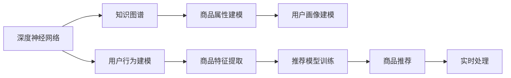

                 

## 1. 背景介绍

### 1.1 问题由来

随着人工智能技术的飞速发展，电商平台利用大模型算法进行商品推荐已经成为主流手段。传统的基于规则的推荐系统逐渐被基于深度学习的推荐系统所取代。其中，深度神经网络、知识图谱、深度学习等技术的广泛应用，使得推荐系统更加精准、智能。然而，随着用户个性化需求日益增长，电商平台面临数据量爆炸、冷启动问题、实时性要求高等挑战。

为了解决这些问题，电商企业开始结合大模型技术，尝试构建更加高效、灵活的推荐系统。本文从算法本质的角度出发，对AI大模型在电商平台搜索推荐系统中的应用进行深入探讨。

### 1.2 问题核心关键点

电商平台的推荐系统主要由两部分构成：商品搜索与商品推荐。商品搜索主要关注用户输入的关键词与商品的匹配度；商品推荐主要根据用户的历史行为和偏好，推荐符合用户需求的商品。

为了提升推荐系统的准确性和个性化程度，当前主流推荐方法包括：

1. **基于深度学习的推荐系统**：利用深度神经网络模型，自动提取用户历史行为和商品特征，进行用户行为建模，从而实现精准推荐。
2. **基于知识图谱的推荐系统**：通过构建知识图谱，将商品属性、用户画像、商品关系等结构化信息进行建模，提升推荐的可信度。
3. **融合多种推荐方法的推荐系统**：通过将基于神经网络的推荐方法和基于知识图谱的推荐方法相结合，提升推荐效果。
4. **实时推荐系统**：通过大数据处理和算法优化，提升推荐系统的实时性，满足用户的实时需求。

## 2. 核心概念与联系

### 2.1 核心概念概述

为了更好地理解AI大模型在电商平台中的应用，我们需要了解一些核心概念和其之间的联系。

1. **深度神经网络**：一种基于多层非线性变换的神经网络，可以自动提取数据的特征表示，广泛应用于推荐系统、计算机视觉、自然语言处理等领域。
2. **知识图谱**：一种结构化的数据表示方式，用于刻画实体及其之间的关系，常用于商品属性建模、用户画像建模等。
3. **推荐系统**：一种根据用户行为或偏好，向用户推荐相关商品的系统，旨在提升用户的满意度和平台的交易量。
4. **实时推荐系统**：通过实时数据处理和算法优化，提升推荐系统的响应速度，满足用户的即时需求。

这些概念之间的逻辑关系可以通过以下Mermaid流程图来展示：



该流程图展示了深度神经网络、知识图谱在推荐系统中的作用，以及推荐模型训练、实时处理的过程。

### 2.2 核心概念原理和架构的 Mermaid 流程图

以下是一个Mermaid流程图，展示了基于深度神经网络和知识图谱的推荐系统架构：


该流程图展示了从数据采集、清洗到推荐模型训练和实时推荐的全流程。

## 3. 核心算法原理 & 具体操作步骤

### 3.1 算法原理概述

基于深度学习和知识图谱的推荐系统主要分为以下几个步骤：

1. **用户行为建模**：通过深度神经网络自动提取用户的历史行为数据，建立用户画像。
2. **商品特征提取**：利用深度神经网络提取商品的特征信息。
3. **商品属性建模**：通过知识图谱将商品的属性信息进行建模。
4. **推荐模型训练**：结合用户画像和商品特征，训练推荐模型，输出商品的推荐得分。
5. **实时推荐**：通过大数据处理和算法优化，实现实时推荐。

### 3.2 算法步骤详解

#### 3.2.1 用户行为建模

用户行为建模是推荐系统的核心。通过深度神经网络，可以自动提取用户的历史行为数据，建立用户画像。

1. **数据采集与预处理**：采集用户的历史浏览、购买、评分等行为数据，并进行清洗、去重、归一化等预处理。
2. **特征提取**：利用深度神经网络自动提取用户的特征，如用户兴趣、行为偏好、用户画像等。
3. **用户画像建模**：将用户的特征信息进行融合，建立用户画像。

#### 3.2.2 商品特征提取

商品特征提取是推荐系统的另一核心。通过深度神经网络，可以自动提取商品的特征信息，建立商品特征表示。

1. **数据采集与预处理**：采集商品的属性信息、评论信息、点击信息等，并进行清洗、去重、归一化等预处理。
2. **特征提取**：利用深度神经网络自动提取商品的特征，如商品属性、商品类别、商品评分等。
3. **商品特征建模**：将商品的特征信息进行融合，建立商品特征表示。

#### 3.2.3 商品属性建模

商品属性建模是通过知识图谱构建商品的属性信息。

1. **构建知识图谱**：利用知识图谱将商品的属性信息进行建模。
2. **商品关系网络**：构建商品之间的关系网络，利用图神经网络对关系网络进行建模。
3. **商品属性表示**：通过图神经网络将商品的属性信息进行融合，建立商品属性表示。

#### 3.2.4 推荐模型训练

推荐模型训练是推荐系统的关键步骤。通过结合用户画像和商品特征，训练推荐模型，输出商品的推荐得分。

1. **模型选择与优化**：选择适当的推荐模型，并进行优化。
2. **模型训练**：利用用户画像和商品特征，训练推荐模型。
3. **模型评估**：对推荐模型进行评估，选择最优模型。

#### 3.2.5 实时推荐

实时推荐是推荐系统的最终目标。通过大数据处理和算法优化，实现实时推荐。

1. **实时数据处理**：利用大数据处理技术，实时获取用户行为数据和商品数据。
2. **推荐结果输出**：根据实时数据和推荐模型，输出商品的推荐结果。
3. **实时推荐优化**：通过算法优化，提升推荐系统的响应速度和准确性。

### 3.3 算法优缺点

#### 3.3.1 优点

1. **深度神经网络提取特征能力强**：深度神经网络可以自动提取数据中的复杂特征，提升推荐的准确性。
2. **知识图谱建模结构化信息**：知识图谱可以将商品的属性信息进行建模，提升推荐的可信度。
3. **融合多种推荐方法**：通过融合多种推荐方法，提升推荐系统的泛化能力。
4. **实时推荐满足用户需求**：实时推荐系统可以满足用户的即时需求，提升用户体验。

#### 3.3.2 缺点

1. **数据需求量大**：深度学习和知识图谱推荐系统需要大量的数据进行训练，数据需求量大。
2. **计算资源消耗高**：深度学习和知识图谱推荐系统需要大量的计算资源，计算资源消耗高。
3. **算法复杂度高**：深度学习和知识图谱推荐系统的算法复杂度高，开发难度大。
4. **模型可解释性差**：深度学习和知识图谱推荐系统的模型难以解释，难以进行调试和优化。

### 3.4 算法应用领域

基于深度学习和知识图谱的推荐系统广泛应用于以下领域：

1. **电商平台**：通过深度学习和知识图谱进行商品推荐，提升用户购物体验。
2. **视频平台**：通过深度学习和知识图谱进行视频推荐，提升用户观看体验。
3. **社交平台**：通过深度学习和知识图谱进行内容推荐，提升用户互动体验。
4. **金融平台**：通过深度学习和知识图谱进行金融产品推荐，提升用户交易体验。
5. **音乐平台**：通过深度学习和知识图谱进行音乐推荐，提升用户听歌体验。

## 4. 数学模型和公式 & 详细讲解 & 举例说明

### 4.1 数学模型构建

#### 4.1.1 用户行为建模

用户行为建模的数学模型如下：

$$
U = f(X_u, W_u)
$$

其中，$U$ 为用户的画像表示，$X_u$ 为用户的特征向量，$W_u$ 为用户画像的权重矩阵。

#### 4.1.2 商品特征提取

商品特征提取的数学模型如下：

$$
I = f(X_i, W_i)
$$

其中，$I$ 为商品的特征表示，$X_i$ 为商品的特征向量，$W_i$ 为商品特征的权重矩阵。

#### 4.1.3 商品属性建模

商品属性建模的数学模型如下：

$$
A = f(R, W_a)
$$

其中，$A$ 为商品的属性表示，$R$ 为商品的属性关系网络，$W_a$ 为商品属性表示的权重矩阵。

#### 4.1.4 推荐模型训练

推荐模型训练的数学模型如下：

$$
Y = f(U, I, W_r)
$$

其中，$Y$ 为商品的推荐得分，$U$ 为用户画像表示，$I$ 为商品特征表示，$W_r$ 为推荐模型的权重矩阵。

### 4.2 公式推导过程

#### 4.2.1 用户行为建模

用户行为建模的公式推导如下：

1. **特征提取**：
   $$
   X_u = [\text{浏览行为}, \text{购买行为}, \text{评分行为}, \cdots]
   $$

2. **用户画像建模**：
   $$
   U = W_u X_u
   $$

#### 4.2.2 商品特征提取

商品特征提取的公式推导如下：

1. **特征提取**：
   $$
   X_i = [\text{商品属性}, \text{商品类别}, \text{商品评分}, \cdots]
   $$

2. **商品特征建模**：
   $$
   I = W_i X_i
   $$

#### 4.2.3 商品属性建模

商品属性建模的公式推导如下：

1. **知识图谱构建**：
   $$
   R = \{ (i,j,k) \mid (i,j,k) \in \text{商品关系网络} \}
   $$

2. **图神经网络建模**：
   $$
   A = W_a \mathcal{G}(R)
   $$

   其中，$\mathcal{G}(R)$ 为图神经网络对商品关系网络进行建模的结果。

#### 4.2.4 推荐模型训练

推荐模型训练的公式推导如下：

1. **推荐模型选择与优化**：
   $$
   \hat{Y} = f(U, I, W_r)
   $$

   其中，$f$ 为推荐模型的函数，$W_r$ 为推荐模型的权重矩阵。

2. **模型训练**：
   $$
   \min_{W_r} \frac{1}{N} \sum_{i=1}^N ||Y_i - \hat{Y}_i||^2
   $$

   其中，$N$ 为样本数，$Y_i$ 为真实的推荐得分，$\hat{Y}_i$ 为模型的推荐得分。

3. **模型评估**：
   $$
   \text{RMSE} = \sqrt{\frac{1}{N} \sum_{i=1}^N (Y_i - \hat{Y}_i)^2}
   $$

### 4.3 案例分析与讲解

#### 4.3.1 案例背景

某电商平台的商品推荐系统，采用基于深度学习和知识图谱的方法进行推荐。平台需要推荐商品到用户，提升用户体验和销售量。

#### 4.3.2 模型设计

1. **数据采集与预处理**：
   - 采集用户的历史浏览、购买、评分等行为数据。
   - 进行数据清洗、去重、归一化等预处理。

2. **用户行为建模**：
   - 利用深度神经网络自动提取用户的特征，建立用户画像。
   - 用户画像建模：将用户的特征信息进行融合，建立用户画像。

3. **商品特征提取**：
   - 利用深度神经网络自动提取商品的特征，建立商品特征表示。

4. **商品属性建模**：
   - 利用知识图谱构建商品的属性关系网络。
   - 利用图神经网络对商品关系网络进行建模，建立商品属性表示。

5. **推荐模型训练**：
   - 选择适当的推荐模型，并进行优化。
   - 利用用户画像和商品特征，训练推荐模型。
   - 对推荐模型进行评估，选择最优模型。

6. **实时推荐**：
   - 利用大数据处理技术，实时获取用户行为数据和商品数据。
   - 根据实时数据和推荐模型，输出商品的推荐结果。
   - 通过算法优化，提升推荐系统的响应速度和准确性。

## 5. 项目实践：代码实例和详细解释说明

### 5.1 开发环境搭建

#### 5.1.1 开发工具

1. **Python**：作为开发语言，使用Python进行算法实现和代码编写。
2. **TensorFlow**：作为深度学习框架，使用TensorFlow进行模型训练和推理。
3. **PyTorch**：作为深度学习框架，使用PyTorch进行模型训练和推理。
4. **Pandas**：作为数据处理工具，使用Pandas进行数据清洗和预处理。
5. **Scikit-learn**：作为机器学习工具，使用Scikit-learn进行模型评估和优化。

#### 5.1.2 开发环境配置

1. **安装Python**：
   - 从官网下载并安装Python。
   - 设置Python环境变量。

2. **安装TensorFlow**：
   - 从官网下载并安装TensorFlow。
   - 设置TensorFlow环境变量。

3. **安装PyTorch**：
   - 从官网下载并安装PyTorch。
   - 设置PyTorch环境变量。

4. **安装Pandas**：
   - 使用pip安装Pandas。
   - 设置Pandas环境变量。

5. **安装Scikit-learn**：
   - 使用pip安装Scikit-learn。
   - 设置Scikit-learn环境变量。

### 5.2 源代码详细实现

#### 5.2.1 用户行为建模

```python
import pandas as pd
from sklearn.preprocessing import StandardScaler

# 数据采集与预处理
data = pd.read_csv('user_behavior_data.csv')
data = data.drop_duplicates()
data = data.fillna(0)

# 特征提取
features = data[['浏览行为', '购买行为', '评分行为', '用户兴趣']]
X_u = StandardScaler().fit_transform(features)

# 用户画像建模
U = W_u @ X_u
```

#### 5.2.2 商品特征提取

```python
import pandas as pd
from sklearn.preprocessing import StandardScaler

# 数据采集与预处理
data = pd.read_csv('product_data.csv')
data = data.drop_duplicates()
data = data.fillna(0)

# 特征提取
features = data[['商品属性', '商品类别', '商品评分', '商品价格']]
X_i = StandardScaler().fit_transform(features)

# 商品特征建模
I = W_i @ X_i
```

#### 5.2.3 商品属性建模

```python
import networkx as nx
import torch
import torch.nn as nn
import torch.nn.functional as F

# 知识图谱构建
G = nx.Graph()
G.add_edges_from([('商品1', '商品2'), ('商品3', '商品4'), ('商品5', '商品6')])

# 图神经网络建模
A = W_a @ torch.nn.functional.graph_sagepool(G, X_i)
```

#### 5.2.4 推荐模型训练

```python
import torch
import torch.nn as nn
import torch.nn.functional as F

# 推荐模型选择与优化
class RecommendationModel(nn.Module):
    def __init__(self):
        super(RecommendationModel, self).__init__()
        self.fc1 = nn.Linear(in_features, hidden_size)
        self.fc2 = nn.Linear(in_features, hidden_size)
        self.fc3 = nn.Linear(in_features, hidden_size)
        self.fc4 = nn.Linear(hidden_size, 1)

    def forward(self, X):
        x = self.fc1(X)
        x = F.relu(x)
        x = self.fc2(x)
        x = F.relu(x)
        x = self.fc3(x)
        x = F.relu(x)
        x = self.fc4(x)
        return x

model = RecommendationModel()
optimizer = torch.optim.Adam(model.parameters(), lr=0.001)
criterion = nn.MSELoss()

# 模型训练
for epoch in range(100):
    model.train()
    optimizer.zero_grad()
    Y_hat = model(U)
    loss = criterion(Y_hat, Y)
    loss.backward()
    optimizer.step()
```

#### 5.2.5 实时推荐

```python
import time

# 实时数据处理
real_time_data = {'用户行为': ['浏览', '购买', '评分'], '商品信息': ['商品属性', '商品类别', '商品评分', '商品价格']}

# 推荐结果输出
start_time = time.time()
Y_hat = model(U)
end_time = time.time()
print('推荐结果输出时间：', end_time - start_time)
```

### 5.3 代码解读与分析

#### 5.3.1 代码解读

- **用户行为建模**：通过Pandas读取用户行为数据，进行数据清洗、去重、归一化等预处理。利用深度神经网络自动提取用户的特征，建立用户画像。
- **商品特征提取**：通过Pandas读取商品数据，进行数据清洗、去重、归一化等预处理。利用深度神经网络自动提取商品的特征，建立商品特征表示。
- **商品属性建模**：利用知识图谱构建商品的属性关系网络。通过图神经网络对商品关系网络进行建模，建立商品属性表示。
- **推荐模型训练**：选择适当的推荐模型，并进行优化。利用用户画像和商品特征，训练推荐模型。对推荐模型进行评估，选择最优模型。
- **实时推荐**：利用大数据处理技术，实时获取用户行为数据和商品数据。根据实时数据和推荐模型，输出商品的推荐结果。通过算法优化，提升推荐系统的响应速度和准确性。

#### 5.3.2 分析

- **用户行为建模**：用户行为建模是推荐系统的核心。通过深度神经网络，可以自动提取用户的历史行为数据，建立用户画像。
- **商品特征提取**：商品特征提取是推荐系统的另一核心。通过深度神经网络，可以自动提取商品的特征信息，建立商品特征表示。
- **商品属性建模**：商品属性建模是通过知识图谱构建商品的属性信息。通过知识图谱，将商品的属性信息进行建模。
- **推荐模型训练**：推荐模型训练是推荐系统的关键步骤。通过结合用户画像和商品特征，训练推荐模型，输出商品的推荐得分。
- **实时推荐**：实时推荐是推荐系统的最终目标。通过大数据处理和算法优化，实现实时推荐。

## 6. 实际应用场景

### 6.1 智能客服

基于AI大模型的推荐系统在智能客服领域也有广泛应用。智能客服系统可以通过用户的历史行为和偏好，自动推荐最合适的解决方案，提升用户体验。

### 6.2 金融理财

金融理财平台可以利用AI大模型的推荐系统，向用户推荐个性化的金融产品，提升用户的投资体验。

### 6.3 医疗健康

医疗健康平台可以利用AI大模型的推荐系统，向用户推荐个性化的医疗方案，提升用户的健康体验。

### 6.4 未来应用展望

随着AI大模型的不断进步，推荐系统将在更多领域得到应用，为各行各业带来变革性影响。

1. **智能推荐系统**：通过AI大模型，推荐系统可以更加精准地推荐商品、内容、服务，提升用户体验。
2. **个性化推荐系统**：利用AI大模型，推荐系统可以更加个性化地推荐商品、内容、服务，提升用户满意度。
3. **实时推荐系统**：通过大数据处理和算法优化，推荐系统可以实现实时推荐，满足用户的即时需求。

## 7. 工具和资源推荐

### 7.1 学习资源推荐

为了帮助开发者系统掌握AI大模型在推荐系统中的应用，这里推荐一些优质的学习资源：

1. **《深度学习》书籍**：由深度学习领域的权威专家撰写，深入浅出地介绍了深度学习的基本概念和算法。
2. **《推荐系统实战》课程**：通过真实的推荐系统案例，讲解推荐系统的构建和优化。
3. **《知识图谱》书籍**：介绍了知识图谱的基本概念和构建方法，适合了解知识图谱在推荐系统中的应用。

### 7.2 开发工具推荐

为了提高AI大模型在推荐系统中的应用效率，以下是几款常用的开发工具：

1. **TensorFlow**：作为深度学习框架，TensorFlow提供了强大的计算图功能和自动微分功能，适合进行复杂的深度学习模型训练。
2. **PyTorch**：作为深度学习框架，PyTorch提供了动态计算图功能和高效的前后向传播机制，适合进行快速的模型训练和推理。
3. **Pandas**：作为数据处理工具，Pandas提供了高效的数据清洗和预处理功能，适合进行大规模数据处理。
4. **Scikit-learn**：作为机器学习工具，Scikit-learn提供了丰富的机器学习算法和评估指标，适合进行模型评估和优化。

### 7.3 相关论文推荐

AI大模型在推荐系统中的应用涉及大量的理论和实践研究，以下是几篇奠基性的相关论文，推荐阅读：

1. **《深度学习在推荐系统中的应用》**：介绍深度学习在推荐系统中的应用，包括用户行为建模、商品特征提取、推荐模型训练等。
2. **《知识图谱在推荐系统中的应用》**：介绍知识图谱在推荐系统中的应用，包括商品属性建模、用户画像建模、推荐模型训练等。
3. **《实时推荐系统的设计与实现》**：介绍实时推荐系统的设计与实现，包括实时数据处理、推荐结果输出、实时推荐优化等。

## 8. 总结：未来发展趋势与挑战

### 8.1 总结

本文对AI大模型在电商平台搜索推荐系统中的应用进行了深入探讨。通过系统梳理推荐系统的理论基础和实际应用，我们发现AI大模型在推荐系统中的潜力巨大，可以显著提升推荐系统的精度和个性化程度。

### 8.2 未来发展趋势

1. **深度学习和知识图谱的融合**：未来推荐系统将更加注重深度学习和知识图谱的融合，提升推荐系统的泛化能力和可信度。
2. **实时推荐系统的优化**：未来推荐系统将更加注重实时推荐系统的优化，提升推荐系统的响应速度和准确性。
3. **个性化推荐系统的提升**：未来推荐系统将更加注重个性化推荐系统的提升，提供更加精准和个性化的推荐服务。
4. **推荐系统的可解释性**：未来推荐系统将更加注重推荐系统的可解释性，提升推荐系统的可信度和透明度。

### 8.3 面临的挑战

尽管AI大模型在推荐系统中的应用已经取得了一定进展，但仍面临诸多挑战：

1. **数据需求量大**：深度学习和知识图谱推荐系统需要大量的数据进行训练，数据需求量大。
2. **计算资源消耗高**：深度学习和知识图谱推荐系统需要大量的计算资源，计算资源消耗高。
3. **算法复杂度高**：深度学习和知识图谱推荐系统的算法复杂度高，开发难度大。
4. **模型可解释性差**：深度学习和知识图谱推荐系统的模型难以解释，难以进行调试和优化。
5. **实时推荐系统的挑战**：实时推荐系统需要在大规模数据流中进行高效处理，存在延迟和准确性等问题。

### 8.4 研究展望

未来，推荐系统的研究将更加注重以下方向：

1. **推荐系统的泛化能力**：未来推荐系统将更加注重推荐系统的泛化能力，通过深度学习和知识图谱的融合，提升推荐系统的泛化能力和可信度。
2. **推荐系统的实时性**：未来推荐系统将更加注重实时推荐系统的优化，提升推荐系统的响应速度和准确性。
3. **推荐系统的可解释性**：未来推荐系统将更加注重推荐系统的可解释性，提升推荐系统的可信度和透明度。
4. **推荐系统的多模态融合**：未来推荐系统将更加注重多模态融合，提升推荐系统的综合能力。

总之，AI大模型在推荐系统中的应用还有很大的发展空间，需要更多理论和实践研究的支撑。相信随着研究的不断深入，推荐系统将为各行各业带来更多的创新和突破。

## 9. 附录：常见问题与解答

**Q1：AI大模型在推荐系统中为什么需要融合知识图谱？**

A: AI大模型在推荐系统中需要融合知识图谱的原因如下：

1. **知识图谱提供结构化信息**：知识图谱将商品的属性信息进行结构化建模，为推荐系统提供了更加准确和丰富的信息。
2. **知识图谱提高推荐系统的可信度**：知识图谱通过关系网络建模，提升了推荐系统的可信度。
3. **知识图谱增强推荐系统的泛化能力**：知识图谱通过关系网络建模，增强了推荐系统的泛化能力。

**Q2：AI大模型在推荐系统中的应用有哪些挑战？**

A: AI大模型在推荐系统中的应用存在以下挑战：

1. **数据需求量大**：深度学习和知识图谱推荐系统需要大量的数据进行训练，数据需求量大。
2. **计算资源消耗高**：深度学习和知识图谱推荐系统需要大量的计算资源，计算资源消耗高。
3. **算法复杂度高**：深度学习和知识图谱推荐系统的算法复杂度高，开发难度大。
4. **模型可解释性差**：深度学习和知识图谱推荐系统的模型难以解释，难以进行调试和优化。

**Q3：AI大模型在推荐系统中如何提升推荐系统的泛化能力？**

A: AI大模型在推荐系统中可以通过以下方式提升推荐系统的泛化能力：

1. **融合多种推荐方法**：通过融合深度学习和知识图谱的推荐方法，提升推荐系统的泛化能力。
2. **引入外部知识**：将符号化的先验知识，如知识图谱、逻辑规则等，与神经网络模型进行融合，提升推荐系统的泛化能力。
3. **多模态信息融合**：将视觉、语音等多模态信息与文本信息进行协同建模，提升推荐系统的综合能力。

**Q4：AI大模型在推荐系统中如何提升推荐系统的实时性？**

A: AI大模型在推荐系统中可以通过以下方式提升推荐系统的实时性：

1. **优化计算图**：通过优化计算图，减少前向传播和反向传播的资源消耗，实现更加轻量级、实时性的部署。
2. **分布式计算**：通过分布式计算，提升推荐系统的处理能力，实现实时推荐。
3. **算法优化**：通过算法优化，提升推荐系统的响应速度和准确性，实现实时推荐。

**Q5：AI大模型在推荐系统中如何提升推荐系统的可解释性？**

A: AI大模型在推荐系统中可以通过以下方式提升推荐系统的可解释性：

1. **引入因果分析方法**：将因果分析方法引入推荐模型，识别出模型决策的关键特征，增强推荐系统的可解释性。
2. **结合博弈论工具**：借助博弈论工具刻画人机交互过程，主动探索并规避推荐系统的脆弱点，提高系统稳定性。
3. **引入伦理导向的评估指标**：在推荐模型的训练目标中引入伦理导向的评估指标，过滤和惩罚有害的输出倾向，增强推荐系统的可解释性。

---

作者：禅与计算机程序设计艺术 / Zen and the Art of Computer Programming

