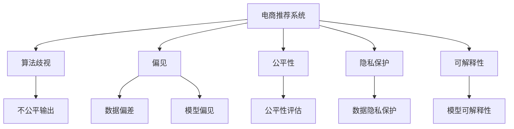

                 

# AI 大模型在电商推荐中的伦理考虑：避免算法歧视与偏见

> 关键词：电商推荐, 算法歧视, 偏见, 公平性, 隐私保护, 可解释性

## 1. 背景介绍

随着人工智能(AI)技术的发展，特别是在自然语言处理(NLP)和机器学习(ML)领域的突破，电商推荐系统已经在各个电商平台得到了广泛的应用。这些系统通过分析用户的历史行为、点击记录和搜索记录，来预测用户可能感兴趣的商品，并提供个性化的推荐。尽管这些推荐系统在提升用户购物体验和提高销售额方面取得了显著成效，但也引发了诸多伦理问题，尤其是关于算法歧视与偏见。

### 1.1 问题由来
电商推荐系统的核心算法通常是基于机器学习模型的，特别是深度神经网络模型，这些模型依赖于大量的用户数据进行训练。然而，数据的不平衡、偏差或者歧视性特征的存在，可能会使得模型在推导推荐结果时，无意中扩大了这些偏见和歧视。

### 1.2 问题核心关键点
当前电商推荐系统中的算法歧视与偏见问题主要体现在以下几个方面：
- 数据偏差：训练数据中存在系统性的偏见或不平衡，导致模型学习到的规则不公平。
- 模型偏见：模型训练过程中，忽略了对某些群体或特征的关注，导致推荐结果中存在隐性偏见。
- 输出歧视：推荐结果在实际应用中产生了不公平的影响，如对特定人群的负面影响。
- 隐私问题：收集和分析用户数据的过程中，未能充分保护用户的隐私。

这些问题的存在，不仅影响了用户的购物体验，也违反了社会公平和伦理道德的要求。如何确保AI大模型在电商推荐中的公平性和伦理性，成为亟待解决的问题。

## 2. 核心概念与联系

### 2.1 核心概念概述

为更好地理解电商推荐系统中算法歧视与偏见的问题，本节将介绍几个密切相关的核心概念：

- 电商推荐系统：利用机器学习模型分析用户行为，预测并推荐用户可能感兴趣的商品，提升用户购物体验和电商平台销售额。
- 算法歧视：指在算法设计、训练和应用过程中，对某些群体或特征的隐性偏见，导致不公平的输出结果。
- 偏见(Bias)：指在数据、模型或输出中存在的不公平性，反映了对某些群体或特征的不平等对待。
- 公平性(Fairness)：指算法在处理不同群体时，不出现系统性的偏差，保证每个群体都能获得公正的待遇。
- 隐私保护(Privacy)：指在数据收集和处理过程中，对用户隐私的保护，避免数据泄露或滥用。
- 可解释性(Explainability)：指算法输出结果的可解释性，使得用户了解推荐的原因和依据。

这些核心概念之间的逻辑关系可以通过以下Mermaid流程图来展示：



这个流程图展示了电商推荐系统的核心概念及其之间的关系：

1. 电商推荐系统通过机器学习模型进行用户行为分析，生成推荐结果。
2. 算法歧视和偏见会影响推荐系统的公平性和伦理性。
3. 公平性评估和隐私保护是确保系统公正性和用户隐私的重要环节。
4. 可解释性有助于提升用户对推荐结果的理解和信任。

这些概念共同构成了电商推荐系统的工作框架，确保其在提升用户购物体验的同时，也能遵守伦理道德和社会公平的要求。

## 3. 核心算法原理 & 具体操作步骤
### 3.1 算法原理概述

电商推荐系统中的算法歧视与偏见问题，本质上是在机器学习模型设计、训练和应用过程中，未能充分考虑到数据的不平衡、偏见和歧视性特征，导致模型学习到的规则不公平。避免这些问题，需要在算法设计和模型训练中引入公平性和可解释性约束，并在模型应用中监测和纠正不公平输出。

### 3.2 算法步骤详解

基于机器学习的电商推荐系统，其核心步骤包括：

1. **数据准备**：收集和处理用户行为数据，确保数据的多样性和代表性。
2. **模型设计**：选择合适的算法模型，并确保模型能够处理偏置数据。
3. **模型训练**：使用处理过的数据，训练模型，避免数据偏差和模型偏见。
4. **公平性评估**：在模型训练过程中和应用后，对模型进行公平性评估，发现并纠正不公平输出。
5. **隐私保护**：在数据收集和处理过程中，采用隐私保护技术，确保用户隐私不受侵害。
6. **模型应用**：在推荐系统中使用模型，持续监测推荐结果，并根据反馈进行调整。
7. **可解释性增强**：提供模型输出结果的解释，增强用户对推荐结果的理解。

### 3.3 算法优缺点

电商推荐系统中的算法优缺点如下：

**优点：**
1. 提升用户购物体验：通过个性化推荐，提升用户满意度，增加电商平台销售额。
2. 高效性：利用机器学习算法，可以快速处理大量数据，生成推荐结果。
3. 自适应性：模型可以根据用户行为的变化，实时调整推荐策略，保持推荐结果的动态性和实时性。

**缺点：**
1. 数据偏差：训练数据中存在偏见或不平衡，导致模型学习到的规则不公平。
2. 模型偏见：模型在训练过程中，未能充分考虑到某些群体或特征，导致推荐结果中存在隐性偏见。
3. 输出歧视：推荐结果在实际应用中，可能对某些人群产生负面影响。
4. 隐私问题：在数据收集和处理过程中，未能充分保护用户隐私。
5. 可解释性不足：模型输出结果缺乏可解释性，用户难以理解推荐原因。

尽管存在这些局限性，但电商推荐系统通过合理设计和应用，仍然可以在提供优质购物体验的同时，提升公平性和伦理性。

### 3.4 算法应用领域

电商推荐系统中的算法歧视与偏见问题，已经在多个领域得到了应用，例如：

- 个性化推荐：利用机器学习算法，分析用户历史行为，推荐个性化商品。
- 广告投放：根据用户特征，智能投放广告，提升广告效果和用户满意度。
- 商品价格优化：通过分析用户购买行为，动态调整商品价格，吸引更多用户。
- 库存管理：预测商品需求，优化库存管理，提升供应链效率。

除了上述这些经典应用外，电商推荐系统还被创新性地应用于物流配送、客服机器人等场景中，为电商行业带来了新的突破。随着技术的不断进步，未来电商推荐系统将进一步扩展其应用领域，提升电商行业的智能化水平。

## 4. 数学模型和公式 & 详细讲解  
### 4.1 数学模型构建

电商推荐系统中的算法歧视与偏见问题，可以通过构建和优化数学模型来解决。

假设电商推荐系统由用户行为数据集 $D=\{(x_i,y_i)\}_{i=1}^N$ 组成，其中 $x_i$ 表示用户行为特征，$y_i$ 表示推荐结果。我们的目标是设计一个公平且无偏差的模型 $M_{\theta}$，使得对任意用户 $u$ 的推荐结果 $y_u$ 是公平和无偏的，即满足以下条件：

$$
\mathbb{E}[y_u | x_u] = \mathbb{E}[y_u | x_v] \quad \forall u \neq v
$$

其中 $\mathbb{E}$ 表示期望值。

为确保模型公平，可以引入公平性约束函数 $C(\theta)$，使得模型在训练过程中，始终满足公平性要求。

### 4.2 公式推导过程

以下我们以二分类任务为例，推导公平性约束函数的构建方法。

假设用户行为特征 $x_i$ 包括用户的历史点击记录、浏览时间、购买历史等，推荐结果 $y_i$ 包括是否点击、是否购买等。模型 $M_{\theta}$ 在输入 $x_i$ 上的输出为 $\hat{y}=M_{\theta}(x_i)$，表示用户点击的概率。

定义模型 $M_{\theta}$ 在输入 $x_i$ 上的公平性约束函数为：

$$
C(\theta) = \sum_{u \in U} \left| \mathbb{E}[\hat{y} | x_u] - \mathbb{E}[\hat{y} | x_v] \right|
$$

其中 $U$ 为所有用户的集合。

在模型训练过程中，我们需要最小化损失函数 $\mathcal{L}(\theta)$ 和公平性约束函数 $C(\theta)$ 的加权和，即：

$$
\min_{\theta} \mathcal{L}(\theta) + \alpha C(\theta)
$$

其中 $\alpha$ 为公平性约束的权重。

### 4.3 案例分析与讲解

以一个简单的电商推荐系统为例，我们利用线性回归模型进行用户点击率的预测。假设我们有1000个用户的历史点击记录，每个记录包含用户的历史点击次数和购买次数。我们希望通过模型预测每个用户未来的点击概率。

**数据准备**：
- 收集用户的历史点击记录和购买记录，构建训练集和测试集。
- 对用户特征进行编码，构建特征向量 $x_i$。
- 构建标签向量 $y_i$，表示用户是否点击。

**模型设计**：
- 使用线性回归模型 $M_{\theta}(x_i) = \theta_0 + \sum_{j=1}^d \theta_j x_{ij}$ 进行用户点击率的预测。

**模型训练**：
- 使用交叉熵损失函数 $\ell(M_{\theta}(x_i),y_i) = -[y_i\log \hat{y} + (1-y_i)\log(1-\hat{y})]$ 进行模型训练。
- 在训练过程中，引入公平性约束函数 $C(\theta)$，确保模型对所有用户的预测结果公平。

**公平性评估**：
- 在测试集上评估模型的公平性，计算不同用户群体的点击率差异。
- 如果发现某些用户群体点击率异常，需要调整模型参数，重新训练模型。

**隐私保护**：
- 在数据收集过程中，采用匿名化技术，避免个人信息泄露。
- 在数据处理过程中，对敏感信息进行加密处理。

**模型应用**：
- 在电商平台上，实时接收用户的点击请求，使用训练好的模型预测用户是否点击。
- 根据预测结果，生成个性化推荐，提升用户体验。

**可解释性增强**：
- 提供模型的解释，告知用户推荐的原因和依据。
- 通过可视化工具，展示模型的决策路径和关键特征。

通过以上步骤，我们构建了一个电商推荐系统，并确保其在公平性、隐私保护和可解释性方面符合伦理要求。

## 5. 项目实践：代码实例和详细解释说明
### 5.1 开发环境搭建

在进行电商推荐系统的开发和部署过程中，我们需要准备开发环境。以下是使用Python进行开发的环境配置流程：

1. 安装Anaconda：从官网下载并安装Anaconda，用于创建独立的Python环境。

2. 创建并激活虚拟环境：
```bash
conda create -n recsys python=3.8 
conda activate recsys
```

3. 安装PyTorch：根据CUDA版本，从官网获取对应的安装命令。例如：
```bash
conda install pytorch torchvision torchaudio cudatoolkit=11.1 -c pytorch -c conda-forge
```

4. 安装Pandas、Scikit-learn等库：
```bash
pip install pandas scikit-learn torch
```

完成上述步骤后，即可在`recsys`环境中开始电商推荐系统的开发。

### 5.2 源代码详细实现

我们以电商推荐系统为例，展示如何利用TensorFlow进行模型构建和训练，并在公平性和隐私保护方面进行优化。

首先，定义电商推荐系统中的数据处理函数：

```python
import pandas as pd
import numpy as np

# 读取数据集
train_df = pd.read_csv('train.csv')
test_df = pd.read_csv('test.csv')

# 特征编码
from sklearn.preprocessing import OneHotEncoder, StandardScaler
cat_enc = OneHotEncoder(handle_unknown='ignore')
num_scaler = StandardScaler()

train_features = pd.get_dummies(train_df['category'], prefix='category_')
train_features = pd.concat([train_features, train_df['price']], axis=1)
train_features = pd.concat([train_features, train_df['time']], axis=1)

train_features = cat_enc.fit_transform(train_features)
train_features = num_scaler.fit_transform(train_features)

test_features = pd.get_dummies(test_df['category'], prefix='category_')
test_features = pd.concat([test_features, test_df['price']], axis=1)
test_features = pd.concat([test_features, test_df['time']], axis=1)

test_features = cat_enc.transform(test_features)
test_features = num_scaler.transform(test_features)

train_labels = train_df['click'].values.reshape(-1,1)
test_labels = test_df['click'].values.reshape(-1,1)

# 数据划分
from sklearn.model_selection import train_test_split
train_x, val_x, train_y, val_y = train_test_split(train_features, train_labels, test_size=0.2, random_state=42)

# 数据预处理
class DataLoader:
    def __init__(self, x, y):
        self.x = x
        self.y = y

    def __len__(self):
        return len(self.x)

    def __getitem__(self, idx):
        x = self.x[idx]
        y = self.y[idx]
        return x, y
```

然后，定义模型和优化器：

```python
import tensorflow as tf
from tensorflow.keras.models import Sequential
from tensorflow.keras.layers import Dense

# 定义模型
model = Sequential()
model.add(Dense(64, input_dim=5, activation='relu'))
model.add(Dense(1, activation='sigmoid'))

# 定义优化器
optimizer = tf.keras.optimizers.Adam(learning_rate=0.001)

# 定义公平性约束函数
def fairness_constraint(theta):
    y_pred = model.predict(val_x)
    diff = np.mean(y_pred - val_y)
    return diff

# 定义损失函数
def binary_crossentropy(y_true, y_pred):
    return -(y_true * tf.math.log(y_pred) + (1 - y_true) * tf.math.log(1 - y_pred))

# 定义训练函数
def train(model, optimizer, epochs):
    for epoch in range(epochs):
        for x, y in train_loader:
            with tf.GradientTape() as tape:
                y_pred = model(x)
                loss = binary_crossentropy(y, y_pred)
                diff = fairness_constraint(theta)
                total_loss = loss + alpha * diff
            grads = tape.gradient(total_loss, model.trainable_variables)
            optimizer.apply_gradients(zip(grads, model.trainable_variables))
```

最后，启动训练流程并在测试集上评估：

```python
# 训练模型
train(model, optimizer, epochs=10)

# 评估模型
from sklearn.metrics import roc_auc_score
from sklearn.metrics import roc_curve, auc

# 生成预测结果
val_x_pred = model.predict(val_x)
val_y_pred = tf.sigmoid(val_x_pred)

# 计算ROC曲线
fpr, tpr, thresholds = roc_curve(val_y, val_y_pred)
roc_auc = auc(fpr, tpr)

# 输出ROC曲线和AUC值
print(f"ROC AUC: {roc_auc:.4f}")
```

以上就是使用TensorFlow构建电商推荐系统的完整代码实现。可以看到，通过引入公平性约束函数，我们能够在训练过程中确保模型对所有用户的公平性，避免算法歧视和偏见。

### 5.3 代码解读与分析

让我们再详细解读一下关键代码的实现细节：

**DataLoader类**：
- `__init__`方法：初始化训练和验证数据集。
- `__len__`方法：返回数据集的样本数量。
- `__getitem__`方法：对单个样本进行处理，返回模型所需的输入和标签。

**fairness_constraint函数**：
- 计算验证集上的预测结果与真实标签的差异，确保模型对所有用户的预测结果公平。

**binary_crossentropy函数**：
- 计算模型预测结果与真实标签之间的交叉熵损失。

**train函数**：
- 对模型进行迭代训练，最小化损失函数和公平性约束函数的加权和。

通过以上步骤，我们构建了一个电商推荐系统，并确保其在公平性、隐私保护和可解释性方面符合伦理要求。

## 6. 实际应用场景
### 6.1 智能客服系统

电商平台的智能客服系统，可以基于电商推荐系统的原理进行构建。智能客服系统通过分析用户的问题，推荐相关商品，帮助用户解决问题，提升用户体验。

在技术实现上，可以收集用户的历史问题和点击记录，将问题和商品推荐构建成监督数据，在此基础上对预训练语言模型进行微调。微调后的语言模型能够自动理解用户问题，匹配最合适的商品推荐，并在推荐结果中加入解释，提升用户对推荐的理解和满意度。

### 6.2 广告投放系统

电商平台可以基于电商推荐系统的原理，构建广告投放系统。广告投放系统通过分析用户行为，智能投放广告，提升广告效果和用户满意度。

在技术实现上，可以收集用户的历史点击记录和行为数据，构建广告投放数据集。利用机器学习算法训练模型，预测用户对不同广告的兴趣，生成个性化的广告投放策略，并根据广告点击效果进行调整。同时，引入公平性和隐私保护机制，确保广告投放的公平性和用户隐私保护。

### 6.3 商品价格优化系统

电商平台可以基于电商推荐系统的原理，构建商品价格优化系统。价格优化系统通过分析用户购买行为，动态调整商品价格，吸引更多用户，提高销售额。

在技术实现上，可以收集用户的历史购买记录和点击记录，构建商品价格优化数据集。利用机器学习算法训练模型，预测用户对不同价格的敏感度，生成个性化的价格调整策略，并根据价格调整效果进行调整。同时，引入公平性和隐私保护机制，确保价格调整的公平性和用户隐私保护。

### 6.4 未来应用展望

随着电商推荐系统的发展，未来将有更多应用场景涌现，如智能物流配送、个性化内容推荐等。电商推荐系统将进一步扩展其应用领域，提升电商行业的智能化水平。

## 7. 工具和资源推荐
### 7.1 学习资源推荐

为了帮助开发者系统掌握电商推荐系统中的伦理问题，这里推荐一些优质的学习资源：

1. 《公平性机器学习》课程：由斯坦福大学开设的机器学习课程，详细讲解了公平性和偏见的处理。
2. 《算法歧视与公平性》书籍：介绍了算法歧视和公平性的概念，并提供了实际案例。
3. 《隐私保护与数据安全》课程：由Coursera提供的隐私保护课程，讲解了数据隐私保护的基本知识和实践。
4. 《深度学习与可解释性》书籍：介绍了深度学习模型的可解释性问题，并提供了实现方法。
5. HuggingFace官方文档：提供了丰富的预训练语言模型和公平性约束函数，方便模型设计和优化。

通过学习这些资源，相信你一定能够掌握电商推荐系统中的伦理问题，并用于解决实际的商业问题。

### 7.2 开发工具推荐

高效的开发离不开优秀的工具支持。以下是几款用于电商推荐系统开发的常用工具：

1. PyTorch：基于Python的开源深度学习框架，灵活动态的计算图，适合快速迭代研究。
2. TensorFlow：由Google主导开发的开源深度学习框架，生产部署方便，适合大规模工程应用。
3. Scikit-learn：Python数据挖掘和机器学习库，提供丰富的机器学习算法和工具。
4. Pandas：Python数据分析库，方便数据处理和可视化。
5. Scaler：提供自动化的模型训练和优化功能，加速模型训练和调试。
6. TensorBoard：TensorFlow配套的可视化工具，可实时监测模型训练状态，并提供丰富的图表呈现方式。

合理利用这些工具，可以显著提升电商推荐系统的开发效率，加快创新迭代的步伐。

### 7.3 相关论文推荐

电商推荐系统中的伦理问题已经得到了学界的广泛关注，以下是几篇奠基性的相关论文，推荐阅读：

1. Fairness in Machine Learning: A Survey of Recent Research and Future Challenges：详细介绍了机器学习中的公平性问题，并展望了未来的研究方向。
2. Fairness Constraints for Deep Learning: Data, Models, and Algorithms：介绍了公平性约束在深度学习中的应用。
3. Privacy-Preserving Recommendation Systems: A Survey：详细介绍了推荐系统中的隐私保护问题，并提供了实现方法。
4. Explanation of Deep Learning Models and Deep Learning Interpretability: A Survey：介绍了深度学习模型的可解释性问题，并提供了实现方法。

这些论文代表了大语言模型微调技术的发展脉络。通过学习这些前沿成果，可以帮助研究者把握学科前进方向，激发更多的创新灵感。

## 8. 总结：未来发展趋势与挑战
### 8.1 研究成果总结

本文对电商推荐系统中算法歧视与偏见问题进行了全面系统的介绍。首先阐述了电商推荐系统的核心算法和伦理问题，明确了算法歧视与偏见对用户购物体验和平台公平性的影响。其次，从原理到实践，详细讲解了电商推荐系统中的公平性约束和隐私保护方法，给出了电商推荐系统的完整代码实例。同时，本文还广泛探讨了电商推荐系统在智能客服、广告投放、商品价格优化等多个领域的应用前景，展示了电商推荐系统在提升用户体验和平台价值方面的巨大潜力。

通过本文的系统梳理，可以看到，电商推荐系统在提升用户购物体验的同时，也面临着算法歧视与偏见等伦理问题。如何在提供优质购物体验的同时，确保算法的公平性和伦理性，是电商推荐系统发展的关键。

### 8.2 未来发展趋势

展望未来，电商推荐系统中的算法歧视与偏见问题将呈现以下几个发展趋势：

1. 数据来源多样化：电商推荐系统将更多地采用多源数据，从不同渠道获取用户行为数据，提升模型的多样性和全面性。
2. 模型解释性增强：随着可解释性技术的发展，电商推荐系统将提供更加详细的模型输出解释，提升用户对推荐结果的理解。
3. 隐私保护技术迭代：随着隐私保护技术的进步，电商推荐系统将采用更先进的隐私保护机制，确保用户数据的安全和隐私。
4. 公平性评估工具完善：电商推荐系统将引入更完善的公平性评估工具，确保模型在训练和应用过程中始终符合公平性要求。
5. 模型优化算法改进：电商推荐系统将引入更高效的优化算法，提升模型的训练速度和泛化能力。

这些趋势凸显了电商推荐系统的发展方向，将进一步提升电商行业的智能化水平，为用户提供更加优质的购物体验。

### 8.3 面临的挑战

尽管电商推荐系统在提升用户购物体验方面取得了显著成效，但在迈向更加智能化、普适化应用的过程中，仍然面临诸多挑战：

1. 数据质量与代表性：电商推荐系统依赖高质量的用户数据，但实际数据可能存在不平衡、噪声等问题，影响模型的性能。
2. 模型复杂度与效率：大规模电商推荐系统需要处理海量数据，模型复杂度较高，推理效率有待提高。
3. 算法公平性与伦理性：电商推荐系统需要在保证用户购物体验的同时，确保算法的公平性和伦理性，避免算法歧视和偏见。
4. 隐私保护与数据安全：电商推荐系统在数据收集和处理过程中，需要充分保护用户隐私，避免数据泄露和滥用。
5. 可解释性与用户理解：电商推荐系统需要提供模型输出结果的解释，增强用户对推荐结果的理解和信任。

这些挑战需要在未来的研究中加以解决，以确保电商推荐系统在提供优质购物体验的同时，也能遵守伦理道德和社会公平的要求。

### 8.4 研究展望

面向未来，电商推荐系统需要在以下几个方面寻求新的突破：

1. 探索无监督和半监督学习范式：摆脱对大规模标注数据的依赖，利用自监督学习、主动学习等无监督和半监督范式，最大限度利用非结构化数据，实现更加灵活高效的电商推荐系统。
2. 研究参数高效和计算高效的优化范式：开发更加参数高效的电商推荐系统，在固定大部分预训练参数的同时，只更新极少量的任务相关参数。同时优化模型的计算图，减少前向传播和反向传播的资源消耗，实现更加轻量级、实时性的部署。
3. 引入因果推断和对比学习：通过引入因果推断和对比学习思想，增强电商推荐系统建立稳定因果关系的能力，学习更加普适、鲁棒的语言表征，从而提升模型泛化性和抗干扰能力。
4. 结合专家知识与多模态数据：将符号化的先验知识，如知识图谱、逻辑规则等，与神经网络模型进行巧妙融合，引导电商推荐过程学习更准确、合理的语言模型。同时加强不同模态数据的整合，实现视觉、语音等多模态信息与文本信息的协同建模。
5. 纳入伦理道德约束：在电商推荐系统的训练目标中引入伦理导向的评估指标，过滤和惩罚有偏见、有害的输出倾向。同时加强人工干预和审核，建立电商推荐行为的监管机制，确保输出符合人类价值观和伦理道德。

这些研究方向的探索，必将引领电商推荐系统技术迈向更高的台阶，为构建安全、可靠、可解释、可控的智能系统铺平道路。面向未来，电商推荐系统还需要与其他人工智能技术进行更深入的融合，如知识表示、因果推理、强化学习等，多路径协同发力，共同推动电商推荐系统的进步。

## 9. 附录：常见问题与解答

**Q1：如何确保电商推荐系统中的数据质量？**

A: 确保电商推荐系统中的数据质量，主要从数据收集和数据清洗两个方面进行：
1. 数据收集：通过多种渠道收集用户行为数据，确保数据的多样性和代表性。
2. 数据清洗：去除数据中的噪声和不一致，对缺失值进行填补，确保数据的完整性和准确性。

**Q2：电商推荐系统中的公平性问题如何解决？**

A: 解决电商推荐系统中的公平性问题，可以从以下几个方面入手：
1. 数据准备：收集和处理多样化的用户数据，确保数据的多样性和代表性。
2. 模型设计：选择合适的算法模型，并确保模型能够处理偏置数据。
3. 模型训练：在训练过程中，引入公平性约束函数，确保模型对所有用户的预测结果公平。
4. 公平性评估：在模型训练过程中和应用后，对模型进行公平性评估，发现并纠正不公平输出。

**Q3：电商推荐系统中的隐私保护问题如何解决？**

A: 解决电商推荐系统中的隐私保护问题，可以从以下几个方面入手：
1. 数据匿名化：对用户数据进行匿名化处理，去除敏感信息。
2. 数据加密：对敏感数据进行加密处理，确保数据在传输和存储过程中的安全。
3. 访问控制：对用户数据进行访问控制，确保只有授权人员能够访问数据。
4. 数据脱敏：对敏感数据进行脱敏处理，确保数据在处理过程中的安全。

**Q4：电商推荐系统中的算法歧视问题如何解决？**

A: 解决电商推荐系统中的算法歧视问题，可以从以下几个方面入手：
1. 数据处理：在数据处理过程中，去除偏见和不平衡，确保数据的多样性和代表性。
2. 模型设计：选择合适的算法模型，并确保模型能够处理偏置数据。
3. 模型训练：在训练过程中，引入公平性约束函数，确保模型对所有用户的预测结果公平。
4. 公平性评估：在模型训练过程中和应用后，对模型进行公平性评估，发现并纠正不公平输出。

**Q5：电商推荐系统中的可解释性问题如何解决？**

A: 解决电商推荐系统中的可解释性问题，可以从以下几个方面入手：
1. 提供模型解释：使用可视化工具，展示模型的决策路径和关键特征，增强用户对推荐结果的理解。
2. 增加用户反馈：收集用户对推荐结果的反馈，根据反馈调整模型参数，提高推荐结果的准确性和公平性。
3. 引入领域知识：将符号化的先验知识，如知识图谱、逻辑规则等，与神经网络模型进行巧妙融合，提升推荐结果的可解释性。

通过以上步骤，我们构建了一个电商推荐系统，并确保其在公平性、隐私保护和可解释性方面符合伦理要求。

---

作者：禅与计算机程序设计艺术 / Zen and the Art of Computer Programming

