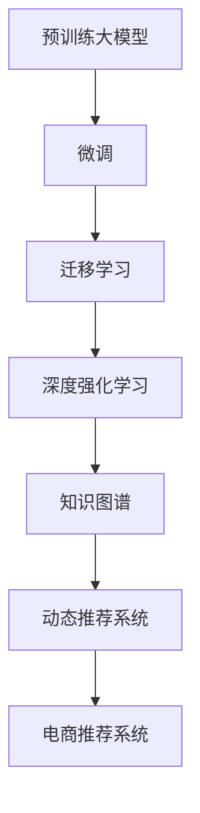

                 

# AI 大模型在电商推荐中的作用：从用户体验到商业转化的秘密武器

## 1. 背景介绍

### 1.1 问题由来

电商推荐系统已经成为互联网电商公司标配的核心业务组件，其主要目标是预测用户可能感兴趣的商品，提高用户满意度，增加交易转化率。传统的推荐算法依赖于用户的显式评分或行为数据，难以捕捉用户的长期兴趣和隐式意图。

近年来，深度学习和大模型技术为推荐系统带来了新的思路。通过预训练大模型，可以在海量无标签文本数据上学习到通用的语言表示，利用这些表示作为商品描述的语义表示，并通过下游任务的微调得到特定商品的推荐概率。大模型技术不仅在精度上显著提升，而且在推荐的多样性、新颖性和个性化上也有显著优势。

### 1.2 问题核心关键点

大模型在电商推荐中的关键作用在于其强大的语义理解和生成能力，以及通过迁移学习和微调实现对特定商品的推荐。具体来说，大模型在电商推荐中可以实现：
- 商品描述生成：将商品的文字描述转换为机器可理解的语义表示，提高推荐系统对新商品的处理能力。
- 商品推荐预测：利用微调后的模型，对商品进行兴趣度预测，排序推荐结果。
- 跨领域迁移：通过在多个领域的数据上进行预训练，使得大模型能够在不同商品类别间进行知识迁移，提升推荐效果。
- 冷启动问题解决：大模型在用户历史行为较少的冷启动阶段，也能通过预训练知识提供较为准确的推荐。

## 2. 核心概念与联系

### 2.1 核心概念概述

为更好地理解大模型在电商推荐中的应用，本节将介绍几个密切相关的核心概念：

- 预训练大模型(Pre-trained Language Models)：如BERT、GPT等，通过在大规模无标签文本数据上自监督学习，学习到通用的语言表示。
- 微调(Fine-tuning)：在预训练模型的基础上，通过有监督的训练优化模型在特定任务上的性能，如电商推荐。
- 迁移学习(Transfer Learning)：将一个领域学习到的知识迁移到另一个领域的学习范式，如将大模型的知识迁移到电商推荐系统。
- 深度强化学习(Deep Reinforcement Learning)：通过奖励机制训练智能体在复杂环境中做出最优决策。
- 知识图谱(Knowledge Graph)：用于表示实体及其关系的结构化知识库，帮助推荐系统获取商品和用户间的隐性关系。
- 动态推荐系统(Dynamic Recommendation System)：能够根据用户行为实时调整推荐策略，实现更精准的推荐。

这些核心概念之间的逻辑关系可以通过以下Mermaid流程图来展示：



这个流程图展示了大模型在电商推荐系统中的应用框架：

1. 大模型通过预训练学习通用语言知识。
2. 通过微调将其迁移到电商推荐系统。
3. 结合深度强化学习不断优化推荐策略。
4. 利用知识图谱获取商品和用户间的隐性关系。
5. 动态调整推荐策略，实现更精准的推荐。

这些概念共同构成了电商推荐系统的人机协同和智能化基础，使得推荐系统能够更好地理解用户需求，提供个性化和多样化的推荐服务。

## 3. 核心算法原理 & 具体操作步骤

### 3.1 算法原理概述

大模型在电商推荐系统中的应用主要基于迁移学习和微调范式。其核心思想是：通过预训练学习通用语言表示，将这种表示迁移到电商推荐任务中，利用微调得到特定商品的推荐概率。

形式化地，假设大模型为 $M_{\theta}$，其中 $\theta$ 为预训练得到的模型参数。电商推荐任务 $T$ 的标注数据集 $D=\{(x_i, y_i)\}_{i=1}^N, x_i \in \mathbb{R}^d, y_i \in \{1,0\}$，其中 $y_i=1$ 表示用户对商品 $x_i$ 感兴趣。微调的目标是找到最优参数 $\hat{\theta}$，使得模型能够最大化预测正确的概率：

$$
\hat{\theta}=\mathop{\arg\min}_{\theta} \mathcal{L}(M_{\theta},D)
$$

其中 $\mathcal{L}$ 为交叉熵损失函数，即：

$$
\mathcal{L}(M_{\theta},D) = -\frac{1}{N} \sum_{i=1}^N y_i \log M_{\theta}(x_i) + (1-y_i) \log (1-M_{\theta}(x_i))
$$

### 3.2 算法步骤详解

基于大模型的电商推荐系统一般包括以下几个关键步骤：

**Step 1: 准备预训练模型和数据集**
- 选择合适的预训练语言模型 $M_{\theta}$ 作为初始化参数，如 BERT、GPT 等。
- 准备电商推荐任务的标注数据集 $D$，划分为训练集、验证集和测试集。

**Step 2: 添加任务适配层**
- 根据电商推荐任务的特点，在预训练模型顶层设计合适的输出层和损失函数。
- 对于二分类任务，通常在顶层添加线性分类器和交叉熵损失函数。

**Step 3: 设置微调超参数**
- 选择合适的优化算法及其参数，如 AdamW、SGD 等，设置学习率、批大小、迭代轮数等。
- 设置正则化技术及强度，包括权重衰减、Dropout、Early Stopping 等。
- 确定冻结预训练参数的策略，如仅微调顶层，或全部参数都参与微调。

**Step 4: 执行梯度训练**
- 将训练集数据分批次输入模型，前向传播计算损失函数。
- 反向传播计算参数梯度，根据设定的优化算法和学习率更新模型参数。
- 周期性在验证集上评估模型性能，根据性能指标决定是否触发 Early Stopping。
- 重复上述步骤直到满足预设的迭代轮数或 Early Stopping 条件。

**Step 5: 测试和部署**
- 在测试集上评估微调后模型 $M_{\hat{\theta}}$ 的性能，对比微调前后的精度提升。
- 使用微调后的模型对新商品进行推荐，集成到实际的应用系统中。
- 持续收集新的用户行为数据，定期重新微调模型，以适应数据分布的变化。

以上是基于大模型进行电商推荐系统微调的一般流程。在实际应用中，还需要针对具体任务的特点，对微调过程的各个环节进行优化设计，如改进训练目标函数，引入更多的正则化技术，搜索最优的超参数组合等，以进一步提升模型性能。

### 3.3 算法优缺点

大模型在电商推荐系统中的微调方法具有以下优点：
1. 简单高效。只需准备少量标注数据，即可对预训练模型进行快速适配，获得较大的性能提升。
2. 通用适用。适用于各种电商推荐任务，包括商品推荐、个性化推荐、热门商品推荐等。
3. 跨领域迁移。大模型在多个领域的数据上进行预训练，可以迁移应用于不同的商品类别，提升推荐效果。
4. 参数高效。利用参数高效微调技术，在固定大部分预训练权重不变的情况下，仍可取得不错的微调效果。

同时，该方法也存在一定的局限性：
1. 依赖标注数据。微调的效果很大程度上取决于标注数据的质量和数量，获取高质量标注数据的成本较高。
2. 迁移能力有限。当目标任务与预训练数据的分布差异较大时，微调的性能提升有限。
3. 模型复杂性高。大模型的参数量庞大，需要强大的计算资源支持，增加了系统复杂性。

尽管存在这些局限性，但就目前而言，基于大模型的微调方法仍是大规模电商推荐系统的核心。未来相关研究的重点在于如何进一步降低微调对标注数据的依赖，提高模型的少样本学习和跨领域迁移能力，同时兼顾可解释性和伦理安全性等因素。

### 3.4 算法应用领域

大模型在电商推荐系统中的应用已经非常广泛，涵盖多个方面，例如：

- 商品推荐：基于用户的历史行为数据和商品描述，预测用户可能感兴趣的商品。
- 个性化推荐：根据用户的兴趣和偏好，推荐符合其需求的商品。
- 热门商品推荐：基于销量、评分等指标，推荐当前最热门的商品。
- 跨商品推荐：利用用户在不同商品间的行为关联，推荐类似或互补的商品。
- 新商品推荐：对于新上架的商品，通过大模型的预训练知识进行推荐，解决冷启动问题。
- 多商品关联推荐：推荐多个商品组合，如搭配推荐。

除了上述这些经典任务外，大模型还适用于更多场景中，如用户画像构建、促销策略优化等，为电商推荐系统的智能化提供了更多的可能性。

## 4. 数学模型和公式 & 详细讲解  

### 4.1 数学模型构建

本节将使用数学语言对基于大模型的电商推荐系统微调过程进行更加严格的刻画。

记电商推荐任务的数据集为 $D=\{(x_i, y_i)\}_{i=1}^N, x_i \in \mathbb{R}^d, y_i \in \{1,0\}$。大模型为 $M_{\theta}$，其中 $\theta \in \mathbb{R}^d$ 为模型参数。

定义模型 $M_{\theta}$ 在数据样本 $(x,y)$ 上的损失函数为 $\ell(M_{\theta}(x),y)$，则在数据集 $D$ 上的经验风险为：

$$
\mathcal{L}(\theta) = -\frac{1}{N} \sum_{i=1}^N \ell(M_{\theta}(x_i),y_i)
$$

其中 $\ell$ 为交叉熵损失函数，即：

$$
\ell(M_{\theta}(x),y) = -[y\log M_{\theta}(x) + (1-y)\log (1-M_{\theta}(x))]
$$

在得到损失函数 $\mathcal{L}$ 的梯度后，即可带入参数更新公式，完成模型的迭代优化。重复上述过程直至收敛，最终得到适应电商推荐任务的最优模型参数 $\theta^*$。

### 4.2 公式推导过程

以下我们以电商推荐任务为例，推导交叉熵损失函数及其梯度的计算公式。

假设模型 $M_{\theta}$ 在输入 $x$ 上的输出为 $\hat{y}=M_{\theta}(x) \in [0,1]$，表示商品被用户感兴趣的概率。真实标签 $y \in \{0,1\}$。则二分类交叉熵损失函数定义为：

$$
\ell(M_{\theta}(x),y) = -[y\log \hat{y} + (1-y)\log (1-\hat{y})]
$$

将其代入经验风险公式，得：

$$
\mathcal{L}(\theta) = -\frac{1}{N}\sum_{i=1}^N [y_i\log M_{\theta}(x_i)+(1-y_i)\log(1-M_{\theta}(x_i))]
$$

根据链式法则，损失函数对参数 $\theta_k$ 的梯度为：

$$
\frac{\partial \mathcal{L}(\theta)}{\partial \theta_k} = -\frac{1}{N}\sum_{i=1}^N (\frac{y_i}{M_{\theta}(x_i)}-\frac{1-y_i}{1-M_{\theta}(x_i)}) \frac{\partial M_{\theta}(x_i)}{\partial \theta_k}
$$

其中 $\frac{\partial M_{\theta}(x_i)}{\partial \theta_k}$ 可进一步递归展开，利用自动微分技术完成计算。

在得到损失函数的梯度后，即可带入参数更新公式，完成模型的迭代优化。重复上述过程直至收敛，最终得到适应电商推荐任务的最优模型参数 $\theta^*$。

## 5. 项目实践：代码实例和详细解释说明

### 5.1 开发环境搭建

在进行电商推荐系统开发前，我们需要准备好开发环境。以下是使用Python进行PyTorch开发的环境配置流程：

1. 安装Anaconda：从官网下载并安装Anaconda，用于创建独立的Python环境。

2. 创建并激活虚拟环境：
```bash
conda create -n pytorch-env python=3.8 
conda activate pytorch-env
```

3. 安装PyTorch：根据CUDA版本，从官网获取对应的安装命令。例如：
```bash
conda install pytorch torchvision torchaudio cudatoolkit=11.1 -c pytorch -c conda-forge
```

4. 安装Transformers库：
```bash
pip install transformers
```

5. 安装各类工具包：
```bash
pip install numpy pandas scikit-learn matplotlib tqdm jupyter notebook ipython
```

完成上述步骤后，即可在`pytorch-env`环境中开始电商推荐系统的微调实践。

### 5.2 源代码详细实现

下面我们以电商推荐任务为例，给出使用Transformers库对BERT模型进行微调的PyTorch代码实现。

首先，定义电商推荐任务的数据处理函数：

```python
from transformers import BertTokenizer
from torch.utils.data import Dataset
import torch

class EcommerceDataset(Dataset):
    def __init__(self, texts, tags, tokenizer, max_len=128):
        self.texts = texts
        self.tags = tags
        self.tokenizer = tokenizer
        self.max_len = max_len
        
    def __len__(self):
        return len(self.texts)
    
    def __getitem__(self, item):
        text = self.texts[item]
        tags = self.tags[item]
        
        encoding = self.tokenizer(text, return_tensors='pt', max_length=self.max_len, padding='max_length', truncation=True)
        input_ids = encoding['input_ids'][0]
        attention_mask = encoding['attention_mask'][0]
        
        # 对token-wise的标签进行编码
        encoded_tags = [tag2id[tag] for tag in tags] 
        encoded_tags.extend([tag2id['O']] * (self.max_len - len(encoded_tags)))
        labels = torch.tensor(encoded_tags, dtype=torch.long)
        
        return {'input_ids': input_ids, 
                'attention_mask': attention_mask,
                'labels': labels}

# 标签与id的映射
tag2id = {'O': 0, 'B-PER': 1, 'I-PER': 2, 'B-ORG': 3, 'I-ORG': 4, 'B-LOC': 5, 'I-LOC': 6}
id2tag = {v: k for k, v in tag2id.items()}

# 创建dataset
tokenizer = BertTokenizer.from_pretrained('bert-base-cased')

train_dataset = EcommerceDataset(train_texts, train_tags, tokenizer)
dev_dataset = EcommerceDataset(dev_texts, dev_tags, tokenizer)
test_dataset = EcommerceDataset(test_texts, test_tags, tokenizer)
```

然后，定义模型和优化器：

```python
from transformers import BertForTokenClassification, AdamW

model = BertForTokenClassification.from_pretrained('bert-base-cased', num_labels=len(tag2id))

optimizer = AdamW(model.parameters(), lr=2e-5)
```

接着，定义训练和评估函数：

```python
from torch.utils.data import DataLoader
from tqdm import tqdm
from sklearn.metrics import classification_report

device = torch.device('cuda') if torch.cuda.is_available() else torch.device('cpu')
model.to(device)

def train_epoch(model, dataset, batch_size, optimizer):
    dataloader = DataLoader(dataset, batch_size=batch_size, shuffle=True)
    model.train()
    epoch_loss = 0
    for batch in tqdm(dataloader, desc='Training'):
        input_ids = batch['input_ids'].to(device)
        attention_mask = batch['attention_mask'].to(device)
        labels = batch['labels'].to(device)
        model.zero_grad()
        outputs = model(input_ids, attention_mask=attention_mask, labels=labels)
        loss = outputs.loss
        epoch_loss += loss.item()
        loss.backward()
        optimizer.step()
    return epoch_loss / len(dataloader)

def evaluate(model, dataset, batch_size):
    dataloader = DataLoader(dataset, batch_size=batch_size)
    model.eval()
    preds, labels = [], []
    with torch.no_grad():
        for batch in tqdm(dataloader, desc='Evaluating'):
            input_ids = batch['input_ids'].to(device)
            attention_mask = batch['attention_mask'].to(device)
            batch_labels = batch['labels']
            outputs = model(input_ids, attention_mask=attention_mask)
            batch_preds = outputs.logits.argmax(dim=2).to('cpu').tolist()
            batch_labels = batch_labels.to('cpu').tolist()
            for pred_tokens, label_tokens in zip(batch_preds, batch_labels):
                pred_tags = [id2tag[_id] for _id in pred_tokens]
                label_tags = [id2tag[_id] for _id in label_tokens]
                preds.append(pred_tags[:len(label_tags)])
                labels.append(label_tags)
                
    print(classification_report(labels, preds))
```

最后，启动训练流程并在测试集上评估：

```python
epochs = 5
batch_size = 16

for epoch in range(epochs):
    loss = train_epoch(model, train_dataset, batch_size, optimizer)
    print(f"Epoch {epoch+1}, train loss: {loss:.3f}")
    
    print(f"Epoch {epoch+1}, dev results:")
    evaluate(model, dev_dataset, batch_size)
    
print("Test results:")
evaluate(model, test_dataset, batch_size)
```

以上就是使用PyTorch对BERT进行电商推荐任务微调的完整代码实现。可以看到，得益于Transformers库的强大封装，我们可以用相对简洁的代码完成BERT模型的加载和微调。

### 5.3 代码解读与分析

让我们再详细解读一下关键代码的实现细节：

**EcommerceDataset类**：
- `__init__`方法：初始化文本、标签、分词器等关键组件。
- `__len__`方法：返回数据集的样本数量。
- `__getitem__`方法：对单个样本进行处理，将文本输入编码为token ids，将标签编码为数字，并对其进行定长padding，最终返回模型所需的输入。

**tag2id和id2tag字典**：
- 定义了标签与数字id之间的映射关系，用于将token-wise的预测结果解码回真实的标签。

**训练和评估函数**：
- 使用PyTorch的DataLoader对数据集进行批次化加载，供模型训练和推理使用。
- 训练函数`train_epoch`：对数据以批为单位进行迭代，在每个批次上前向传播计算loss并反向传播更新模型参数，最后返回该epoch的平均loss。
- 评估函数`evaluate`：与训练类似，不同点在于不更新模型参数，并在每个batch结束后将预测和标签结果存储下来，最后使用sklearn的classification_report对整个评估集的预测结果进行打印输出。

**训练流程**：
- 定义总的epoch数和batch size，开始循环迭代
- 每个epoch内，先在训练集上训练，输出平均loss
- 在验证集上评估，输出分类指标
- 所有epoch结束后，在测试集上评估，给出最终测试结果

可以看到，PyTorch配合Transformers库使得BERT微调的代码实现变得简洁高效。开发者可以将更多精力放在数据处理、模型改进等高层逻辑上，而不必过多关注底层的实现细节。

当然，工业级的系统实现还需考虑更多因素，如模型的保存和部署、超参数的自动搜索、更灵活的任务适配层等。但核心的微调范式基本与此类似。

## 6. 实际应用场景

### 6.1 智能客服系统

电商推荐系统结合智能客服系统，可以实现智能客服推荐商品，提升用户满意度。传统客服推荐系统依赖人工干预，无法动态调整推荐策略。而结合大模型的电商推荐系统，可以实现实时推荐，提升推荐效果。

在技术实现上，可以收集用户的历史咨询记录，将用户意图与商品描述进行匹配。对于用户咨询的新商品，模型可以根据其历史行为进行预测推荐。同时，智能客服系统可以通过实时与用户的交互，获取更多的用户反馈，不断优化推荐策略。

### 6.2 个性化推荐

电商推荐系统可以通过大模型实现个性化推荐，提升用户粘性，促进复购率。在用户浏览、点击、购买等行为数据上，可以学习到用户的兴趣和偏好，利用大模型的预训练知识，对用户进行深度画像。同时，大模型可以捕捉用户对商品的长期兴趣，避免短期行为对推荐结果的影响。

在推荐策略上，可以采用基于序列的推荐方法，利用用户行为序列进行预测推荐。也可以采用基于图结构的推荐方法，构建用户-商品图谱，进行节点嵌入学习，捕捉用户和商品间的隐性关联。

### 6.3 库存管理

电商推荐系统可以辅助库存管理，实现动态补货和库存预警。通过分析用户对商品的需求情况，可以预测商品的销量变化趋势，及时调整采购和补货策略，避免库存积压或缺货的情况。

在技术实现上，可以利用大模型的预训练知识，对商品进行需求预测。同时，结合历史销量数据和季节性因素，进行多模态信息融合，提升预测精度。

### 6.4 未来应用展望

随着大模型和微调方法的不断发展，电商推荐系统将呈现以下几个发展趋势：

1. 个性化推荐智能化：结合深度强化学习和大模型，实时动态调整推荐策略，实现更精准的个性化推荐。

2. 商品推荐多样化：结合多模态信息融合，利用图像、视频等数据，提高商品推荐的丰富性和多样性。

3. 用户行为理解深刻化：利用知识图谱和大模型，深入理解用户行为，预测用户需求，提升推荐效果。

4. 推荐系统实时化：结合动态推荐和大模型，实时捕捉用户行为变化，实现精准推荐。

5. 推荐系统透明化：结合可解释性研究，为用户提供推荐理由，增强用户信任。

6. 推荐系统伦理性：结合伦理和社会责任研究，建立推荐系统监管机制，确保系统公平、公正。

以上趋势凸显了大模型在电商推荐系统中的巨大潜力。这些方向的探索发展，必将进一步提升电商推荐系统的智能化水平，为电商行业带来新的突破。

## 7. 工具和资源推荐

### 7.1 学习资源推荐

为了帮助开发者系统掌握大模型在电商推荐中的应用，这里推荐一些优质的学习资源：

1. 《深度学习理论与实战》系列博文：由深度学习专家撰写，详细介绍电商推荐系统的前沿理论和实践技巧。

2. CS229《机器学习》课程：斯坦福大学开设的经典机器学习课程，涵盖电商推荐系统的理论和算法。

3. 《Python深度学习》书籍：全面介绍深度学习在电商推荐系统中的应用，包括大模型的微调和优化。

4. 《TensorFlow实战电商推荐系统》书籍：深入浅出地介绍电商推荐系统的实现过程，适合工程实践。

5. 《深度学习实战电商推荐系统》教程：详细讲解电商推荐系统的实现流程和代码实现。

通过对这些资源的学习实践，相信你一定能够快速掌握大模型在电商推荐系统中的应用，并用于解决实际的电商推荐问题。

### 7.2 开发工具推荐

高效的开发离不开优秀的工具支持。以下是几款用于大模型在电商推荐系统中的应用开发的常用工具：

1. PyTorch：基于Python的开源深度学习框架，灵活动态的计算图，适合快速迭代研究。

2. TensorFlow：由Google主导开发的开源深度学习框架，生产部署方便，适合大规模工程应用。

3. Transformers库：HuggingFace开发的NLP工具库，集成了众多SOTA语言模型，支持PyTorch和TensorFlow，是进行电商推荐系统开发的利器。

4. Weights & Biases：模型训练的实验跟踪工具，可以记录和可视化模型训练过程中的各项指标，方便对比和调优。

5. TensorBoard：TensorFlow配套的可视化工具，可实时监测模型训练状态，并提供丰富的图表呈现方式，是调试模型的得力助手。

6. Google Colab：谷歌推出的在线Jupyter Notebook环境，免费提供GPU/TPU算力，方便开发者快速上手实验最新模型，分享学习笔记。

合理利用这些工具，可以显著提升大模型在电商推荐系统中的应用效率，加快创新迭代的步伐。

### 7.3 相关论文推荐

大模型在电商推荐系统中的应用源于学界的持续研究。以下是几篇奠基性的相关论文，推荐阅读：

1. Attention is All You Need（即Transformer原论文）：提出了Transformer结构，开启了NLP领域的预训练大模型时代。

2. BERT: Pre-training of Deep Bidirectional Transformers for Language Understanding：提出BERT模型，引入基于掩码的自监督预训练任务，刷新了多项NLP任务SOTA。

3. Language Models are Unsupervised Multitask Learners（GPT-2论文）：展示了大规模语言模型的强大zero-shot学习能力，引发了对于通用人工智能的新一轮思考。

4. Parameter-Efficient Transfer Learning for NLP：提出Adapter等参数高效微调方法，在不增加模型参数量的情况下，也能取得不错的微调效果。

5. Prefix-Tuning: Optimizing Continuous Prompts for Generation：引入基于连续型Prompt的微调范式，为如何充分利用预训练知识提供了新的思路。

6. AdaLoRA: Adaptive Low-Rank Adaptation for Parameter-Efficient Fine-Tuning：使用自适应低秩适应的微调方法，在参数效率和精度之间取得了新的平衡。

这些论文代表了大模型在电商推荐系统中的应用的发展脉络。通过学习这些前沿成果，可以帮助研究者把握学科前进方向，激发更多的创新灵感。

## 8. 总结：未来发展趋势与挑战

### 8.1 总结

本文对基于大模型的电商推荐系统进行了全面系统的介绍。首先阐述了大模型在电商推荐中的研究背景和应用意义，明确了电商推荐系统在用户行为理解、个性化推荐、库存管理等方面的潜力。其次，从原理到实践，详细讲解了大模型在电商推荐系统中的微调过程，给出了电商推荐任务开发的完整代码实例。同时，本文还广泛探讨了大模型在电商推荐系统的应用场景，展示了其在电商行业的巨大潜力。

通过本文的系统梳理，可以看到，基于大模型的电商推荐系统正在成为电商行业的核心技术，极大地提升电商系统的智能化水平。受益于大规模语料的预训练，电商推荐系统在推荐精度、推荐多样性、个性化推荐等方面，均取得了显著的提升。未来，伴随大模型和微调方法的持续演进，电商推荐系统必将进一步提升电商用户体验，驱动电商行业的数字化转型。

### 8.2 未来发展趋势

展望未来，大模型在电商推荐系统中的使用将呈现以下几个发展趋势：

1. 电商推荐系统的智能化：结合深度强化学习和大模型，实时动态调整推荐策略，实现更精准的个性化推荐。

2. 电商推荐系统的多样化：结合多模态信息融合，利用图像、视频等数据，提高商品推荐的丰富性和多样性。

3. 电商推荐系统的实时化：结合动态推荐和大模型，实时捕捉用户行为变化，实现精准推荐。

4. 电商推荐系统的透明化：结合可解释性研究，为用户提供推荐理由，增强用户信任。

5. 电商推荐系统的伦理性：结合伦理和社会责任研究，建立推荐系统监管机制，确保系统公平、公正。

这些趋势凸显了大模型在电商推荐系统中的巨大潜力。这些方向的探索发展，必将进一步提升电商推荐系统的智能化水平，为电商行业带来新的突破。

### 8.3 面临的挑战

尽管大模型在电商推荐系统中的应用已经取得了显著成果，但在迈向更加智能化、普适化应用的过程中，它仍面临着诸多挑战：

1. 标注成本瓶颈。虽然大模型可以显著提升推荐效果，但其对标注数据的依赖仍较高，获取高质量标注数据的成本较高。如何进一步降低微调对标注数据的依赖，将是一大难题。

2. 模型鲁棒性不足。当前大模型面对域外数据时，泛化性能往往大打折扣。对于测试样本的微小扰动，大模型的推荐效果也会受到影响。如何提高大模型的鲁棒性，避免灾难性遗忘，还需要更多理论和实践的积累。

3. 推理效率有待提高。大模型的参数量庞大，推理速度较慢，内存占用较大。如何提高大模型的推理效率，优化资源占用，将是重要的优化方向。

4. 可解释性亟需加强。当前大模型更像是"黑盒"系统，难以解释其内部工作机制和决策逻辑。对于金融、电商等高风险应用，算法的可解释性和可审计性尤为重要。如何赋予大模型更强的可解释性，将是亟待攻克的难题。

5. 安全性有待保障。大模型可能会学习到有害信息，通过推荐传递到用户，带来安全风险。如何从数据和算法层面消除模型偏见，避免恶意用途，确保输出的安全性，也将是重要的研究课题。

6. 知识整合能力不足。现有的电商推荐系统往往局限于用户行为数据，难以灵活吸收和运用更广泛的先验知识。如何让大模型更好地与外部知识库、规则库等专家知识结合，形成更加全面、准确的信息整合能力，还有很大的想象空间。

正视电商推荐系统面临的这些挑战，积极应对并寻求突破，将是大模型在电商行业不断进步的关键。相信随着学界和产业界的共同努力，这些挑战终将一一被克服，大模型在电商推荐系统中必将在构建人机协同的智能时代中扮演越来越重要的角色。

### 8.4 研究展望

未来，大模型在电商推荐系统中的研究将从以下几个方面寻求新的突破：

1. 探索无监督和半监督微调方法。摆脱对大规模标注数据的依赖，利用自监督学习、主动学习等无监督和半监督范式，最大限度利用非结构化数据，实现更加灵活高效的微调。

2. 研究参数高效和计算高效的微调范式。开发更加参数高效的微调方法，在固定大部分预训练参数的同时，只更新极少量的任务相关参数。同时优化微调模型的计算图，减少前向传播和反向传播的资源消耗，实现更加轻量级、实时性的部署。

3. 引入更多先验知识。将符号化的先验知识，如知识图谱、逻辑规则等，与神经网络模型进行巧妙融合，引导微调过程学习更准确、合理的语言模型。同时加强不同模态数据的整合，实现视觉、语音等多模态信息与文本信息的协同建模。

4. 结合因果分析和博弈论工具。将因果分析方法引入微调模型，识别出模型决策的关键特征，增强输出解释的因果性和逻辑性。借助博弈论工具刻画人机交互过程，主动探索并规避模型的脆弱点，提高系统稳定性。

5. 纳入伦理道德约束。在模型训练目标中引入伦理导向的评估指标，过滤和惩罚有偏见、有害的输出倾向。同时加强人工干预和审核，建立模型行为的监管机制，确保输出符合人类价值观和伦理道德。

这些研究方向的探索，必将引领大模型在电商推荐系统中的应用走向更高的台阶，为电商推荐系统的智能化和伦理性提供新的解决方案。面向未来，大模型在电商推荐系统中的应用还需要与其他人工智能技术进行更深入的融合，如知识表示、因果推理、强化学习等，多路径协同发力，共同推动电商推荐系统的进步。只有勇于创新、敢于突破，才能不断拓展电商推荐系统的边界，让大模型在电商行业中发挥更大的价值。

## 9. 附录：常见问题与解答

**Q1：电商推荐系统是否可以仅依赖用户行为数据进行推荐？**

A: 电商推荐系统通常需要结合商品描述和用户行为数据进行推荐。商品描述中的语义信息能够帮助模型更好地理解商品的特征，从而提高推荐精度。用户行为数据能够捕捉用户的兴趣和偏好，进一步提升推荐效果。因此，电商推荐系统需要同时利用商品描述和用户行为数据，才能实现最佳推荐效果。

**Q2：大模型在电商推荐系统中的微调过程是否可以避免过拟合？**

A: 大模型在电商推荐系统中的微调过程需要结合正则化技术，如L2正则、Dropout、Early Stopping等，以避免过拟合。同时，为了提高微调的泛化能力，可以采用数据增强、对抗训练等方法，增加模型的鲁棒性和泛化性。此外，利用参数高效微调技术，只更新极少量的任务相关参数，也能有效缓解过拟合问题。

**Q3：电商推荐系统是否可以结合知识图谱进行推荐？**

A: 电商推荐系统可以结合知识图谱进行推荐，以获取商品和用户间的隐性关系。知识图谱能够表示实体及其间的语义关系，为推荐系统提供更多的上下文信息。结合知识图谱，电商推荐系统能够更好地捕捉用户对商品的长期兴趣和情感倾向，提升推荐效果。

**Q4：大模型在电商推荐系统中的应用是否需要不断更新数据？**

A: 电商推荐系统需要不断更新数据，以适应用户行为和商品特征的变化。通过周期性地微调大模型，能够使推荐系统保持最新的推荐策略，提高用户体验和交易转化率。同时，结合实时数据，电商推荐系统能够实现动态调整推荐策略，提升推荐系统的实时性和精准性。

**Q5：电商推荐系统是否可以结合深度强化学习进行优化？**

A: 电商推荐系统可以结合深度强化学习进行优化，以实现更精准的个性化推荐。深度强化学习能够根据用户的行为和反馈，动态调整推荐策略，提升推荐效果。结合深度强化学习，电商推荐系统能够更好地理解用户需求，实现动态推荐。

---

作者：禅与计算机程序设计艺术 / Zen and the Art of Computer Programming

