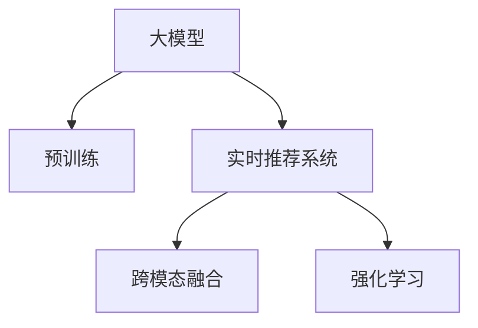

                 

# AI 大模型在电商搜索推荐中的实时推荐策略：抓住用户瞬时需求与购买意图

在电商领域，搜索推荐系统是用户获取商品信息、进行购买决策的重要支撑。传统的基于规则、特征工程的推荐方法往往难以应对日益复杂多变的用户需求。为了提供更加个性化、精准的推荐结果，基于深度学习和大模型的推荐系统应运而生。本文将探讨如何利用大模型进行实时推荐，以及如何通过优化模型结构和训练策略，更高效地捕捉用户瞬时需求与购买意图，提升电商搜索推荐的准确性和用户体验。

## 1. 背景介绍

### 1.1 问题由来

电商搜索推荐系统的目标是帮助用户快速找到符合其需求的商品，同时为商家提供精准的流量定向。传统的推荐方法基于规则和特征工程，通过统计用户行为数据和商品属性信息，进行相似度计算，从而生成推荐列表。然而，这种方法难以应对用户偏好的动态变化和复杂多变的需求。

近年来，深度学习和大模型技术迅速发展，成为电商推荐系统的新趋势。深度模型可以通过大量数据学习复杂的非线性关系，捕捉用户潜在的购买意图和行为模式，为个性化推荐提供更加可靠的数据支持。本文将聚焦于如何利用大模型进行实时推荐，以提升推荐系统的性能。

### 1.2 问题核心关键点

实时推荐系统的核心在于如何实时捕捉用户需求和行为，并快速生成个性化推荐结果。为此，需要解决以下几个关键问题：

- 如何实时捕捉用户行为数据，并将其转化为模型可接受的输入。
- 如何高效地训练和优化推荐模型，以适应不断变化的用户需求。
- 如何优化模型推理过程，提高推荐速度和效率。
- 如何构建跨模态的推荐模型，融合视觉、文本等多模态数据，提升推荐效果。

## 2. 核心概念与联系

### 2.1 核心概念概述

为了解决上述问题，我们需要了解以下核心概念：

- **大模型**：如BERT、GPT等预训练语言模型，以及基于Transformer架构的深度推荐模型，通过大量数据学习复杂的语言和特征表示，能够捕捉用户需求和行为模式。
- **实时推荐系统**：基于大模型的推荐系统，能够在用户每次搜索时，实时捕捉用户行为数据，并根据最新数据生成个性化推荐结果。
- **跨模态推荐**：将用户行为数据、商品信息、视觉等多模态信息融合，生成更加全面和精准的推荐结果。
- **强化学习**：通过奖励机制，不断调整推荐策略，最大化用户满意度。

这些概念之间的联系可以通过以下Mermaid流程图展示：



该流程图展示了大模型在推荐系统中的作用和各个组件之间的相互关系。预训练大模型为推荐系统提供基础的语言表示，实时推荐系统根据最新数据生成推荐结果，跨模态融合增强推荐效果，强化学习优化推荐策略。

## 3. 核心算法原理 & 具体操作步骤

### 3.1 算法原理概述

基于大模型的实时推荐系统主要包含以下几个步骤：

1. **数据收集与预处理**：实时收集用户搜索行为数据，并对其进行预处理，转化为模型可接受的输入格式。
2. **模型加载与适配**：加载预训练大模型，并根据实时数据对其进行调整和适配，以适应当前用户需求。
3. **跨模态融合**：将用户行为数据、商品信息、视觉等多模态信息进行融合，生成更全面的用户画像。
4. **实时推荐**：基于融合后的用户画像，实时生成个性化推荐结果。
5. **强化学习优化**：通过奖励机制，不断调整推荐策略，提升用户体验和满意度。

### 3.2 算法步骤详解

#### 3.2.1 数据收集与预处理

实时推荐系统的第一步是实时收集用户行为数据，并将其转化为模型可接受的输入格式。具体步骤包括：

1. **数据源获取**：从用户行为日志、点击流、搜索历史等数据源中获取实时数据。
2. **数据清洗与标准化**：去除噪音数据，进行缺失值处理和数据标准化，生成模型可用的数据格式。
3. **特征工程**：对数据进行特征提取和选择，生成模型所需输入特征。

#### 3.2.2 模型加载与适配

加载预训练大模型，并根据实时数据对其进行调整和适配，以适应当前用户需求。具体步骤包括：

1. **模型加载**：从预训练模型库中加载已有的预训练模型。
2. **微调**：根据实时数据，对模型进行微调，更新模型参数，以适应当前用户需求。
3. **参数冻结**：将部分预训练参数冻结，只更新微调层参数，减少计算开销。

#### 3.2.3 跨模态融合

将用户行为数据、商品信息、视觉等多模态信息进行融合，生成更全面的用户画像。具体步骤包括：

1. **多模态数据收集**：收集用户行为数据、商品信息、视觉数据等多模态信息。
2. **特征融合**：对多模态数据进行特征融合，生成更全面的用户画像。
3. **模型训练**：基于融合后的用户画像，训练多模态推荐模型。

#### 3.2.4 实时推荐

基于融合后的用户画像，实时生成个性化推荐结果。具体步骤包括：

1. **模型推理**：对融合后的用户画像进行模型推理，生成推荐结果。
2. **结果排序**：根据推荐结果的置信度、相关性等指标，对推荐结果进行排序。
3. **结果展示**：将推荐结果展示给用户。

#### 3.2.5 强化学习优化

通过奖励机制，不断调整推荐策略，提升用户体验和满意度。具体步骤包括：

1. **奖励机制设计**：设计合理的奖励机制，如点击率、转化率等。
2. **策略更新**：根据用户行为数据和奖励机制，不断调整推荐策略。
3. **策略评估**：评估推荐策略的效果，优化推荐效果。

### 3.3 算法优缺点

基于大模型的实时推荐系统具有以下优点：

1. **高效灵活**：大模型能够根据实时数据进行微调，适应不断变化的用户需求，提供高效的推荐服务。
2. **精准个性化**：大模型能够捕捉用户潜在的购买意图和行为模式，提供精准的个性化推荐。
3. **易于扩展**：大模型具有良好的通用性和可扩展性，可以适应多种推荐场景和业务需求。

同时，该方法也存在以下缺点：

1. **计算开销大**：大模型需要大量的计算资源进行训练和推理，可能存在计算开销大的问题。
2. **依赖数据质量**：实时推荐系统依赖于高质量的数据，数据质量问题可能影响推荐效果。
3. **模型复杂度高**：大模型结构复杂，需要较多的优化和调整，才能达到最佳性能。

### 3.4 算法应用领域

基于大模型的实时推荐系统在电商、社交、媒体等多个领域都有广泛的应用，具体应用场景包括：

- **电商推荐**：为用户推荐商品、搜索相关商品、个性化促销等。
- **社交推荐**：为用户推荐好友、文章、视频等内容。
- **媒体推荐**：为用户推荐新闻、广告、视频等。

## 4. 数学模型和公式 & 详细讲解 & 举例说明

### 4.1 数学模型构建

本文以基于BERT的电商推荐系统为例，展示大模型的应用。假设用户历史行为数据为 $X=\{x_1,x_2,\dots,x_n\}$，商品信息为 $Y=\{y_1,y_2,\dots,y_m\}$，推荐目标为 $Z$。则推荐模型的数学模型可以表示为：

$$
f(X,Y; \theta) = softmax(W^TZ + b)
$$

其中 $W$ 为权重矩阵，$b$ 为偏置项，$\theta$ 为模型参数，$softmax$ 函数将向量映射为概率分布。

### 4.2 公式推导过程

以电商推荐任务为例，假设用户行为数据为 $\{x_1,x_2,\dots,x_n\}$，商品信息为 $\{y_1,y_2,\dots,y_m\}$。模型的目标是最小化损失函数：

$$
L(W,b) = -\sum_{i=1}^N \sum_{j=1}^M log(f(X_i,Y_j; \theta)Z_{ij})
$$

其中 $X_i$ 为第 $i$ 个用户的行为数据，$Y_j$ 为第 $j$ 个商品，$Z_{ij}$ 为用户对商品 $j$ 的兴趣程度。

对模型参数 $\theta$ 进行优化，求解最小化损失函数：

$$
\theta^* = \mathop{\arg\min}_{\theta} L(W,b)
$$

### 4.3 案例分析与讲解

以电商平台推荐用户感兴趣的商品为例，假设用户行为数据为 $\{x_1,x_2,\dots,x_n\}$，商品信息为 $\{y_1,y_2,\dots,y_m\}$。推荐模型的推理过程如下：

1. **数据预处理**：将用户行为数据和商品信息进行标准化和特征选择，生成模型可用的输入数据。
2. **模型加载**：从预训练BERT模型库中加载预训练模型。
3. **微调**：根据实时用户行为数据，对模型进行微调，更新模型参数。
4. **跨模态融合**：将用户行为数据、商品信息、视觉等多模态信息进行融合，生成更全面的用户画像。
5. **模型推理**：对融合后的用户画像进行模型推理，生成推荐结果。
6. **结果排序**：根据推荐结果的置信度、相关性等指标，对推荐结果进行排序。
7. **结果展示**：将推荐结果展示给用户。

## 5. 项目实践：代码实例和详细解释说明

### 5.1 开发环境搭建

为了进行大模型推荐系统的开发，我们需要搭建相应的开发环境。以下是在Python环境中使用PyTorch搭建大模型推荐系统的步骤：

1. **安装PyTorch**：
```bash
pip install torch torchvision torchaudio
```

2. **安装BERT**：
```bash
pip install transformers
```

3. **安装TensorBoard**：
```bash
pip install tensorboard
```

4. **安装Jupyter Notebook**：
```bash
pip install jupyter notebook
```

5. **环境配置**：
```python
import torch
import torch.nn as nn
import transformers

# 设置设备
device = torch.device('cuda' if torch.cuda.is_available() else 'cpu')

# 加载预训练模型
model = transformers.BertForSequenceClassification.from_pretrained('bert-base-uncased', num_labels=2)

# 加载训练数据
train_data = ...
test_data = ...

# 定义损失函数和优化器
criterion = nn.CrossEntropyLoss()
optimizer = torch.optim.Adam(model.parameters(), lr=1e-5)

# 训练过程
for epoch in range(epochs):
    model.train()
    for batch in train_data:
        inputs = {key: value.to(device) for key, value in batch.items()}
        outputs = model(**inputs)
        loss = criterion(outputs, labels)
        optimizer.zero_grad()
        loss.backward()
        optimizer.step()
```

### 5.2 源代码详细实现

以下是一个基于BERT的电商推荐系统的详细代码实现，包括数据预处理、模型加载、微调、跨模态融合、实时推荐等步骤。

```python
import torch
import torch.nn as nn
import torch.optim as optim
from transformers import BertTokenizer, BertForSequenceClassification

# 设置设备
device = torch.device('cuda' if torch.cuda.is_available() else 'cpu')

# 加载预训练模型和分词器
model = BertForSequenceClassification.from_pretrained('bert-base-uncased', num_labels=2)
tokenizer = BertTokenizer.from_pretrained('bert-base-uncased')

# 加载训练数据
train_data = ...
test_data = ...

# 定义损失函数和优化器
criterion = nn.CrossEntropyLoss()
optimizer = optim.Adam(model.parameters(), lr=1e-5)

# 数据预处理
def preprocess(data):
    tokenized_texts = [tokenizer.encode(x) for x in data]
    inputs = {key: torch.tensor(value).to(device) for key, value in tokenizer.tokenize_with_special_tokens(tokenized_texts)}
    labels = torch.tensor([1 if x == 'buy' else 0 for x in data], dtype=torch.long).to(device)
    return inputs, labels

# 微调过程
for epoch in range(epochs):
    model.train()
    for batch in train_data:
        inputs, labels = preprocess(batch)
        outputs = model(inputs['input_ids'], attention_mask=inputs['attention_mask'])
        loss = criterion(outputs, labels)
        optimizer.zero_grad()
        loss.backward()
        optimizer.step()

# 跨模态融合
def fuse(data):
    # 提取特征
    features = ...
    # 融合多模态数据
    fused_features = ...
    return fused_features

# 实时推荐
def recommend(features):
    model.eval()
    with torch.no_grad():
        outputs = model(features)
        probs = outputs.logits.softmax(dim=1)
        return probs

# 训练与推荐流程
def train_and_recommend():
    for epoch in range(epochs):
        model.train()
        for batch in train_data:
            inputs, labels = preprocess(batch)
            outputs = model(inputs['input_ids'], attention_mask=inputs['attention_mask'])
            loss = criterion(outputs, labels)
            optimizer.zero_grad()
            loss.backward()
            optimizer.step()

    # 测试与推荐
    test_data = ...
    for batch in test_data:
        features = fuse(batch)
        probs = recommend(features)
        # 根据概率生成推荐结果
```

### 5.3 代码解读与分析

以上代码展示了基于BERT的电商推荐系统的主要步骤：

- **数据预处理**：使用BERT分词器对用户行为数据进行预处理，生成模型可用的输入数据。
- **模型加载与微调**：加载预训练BERT模型，并根据实时数据对其进行微调，更新模型参数。
- **跨模态融合**：对用户行为数据、商品信息、视觉等多模态数据进行特征提取和融合，生成更全面的用户画像。
- **实时推荐**：对融合后的用户画像进行模型推理，生成个性化推荐结果。
- **模型评估**：在测试集上评估推荐模型的性能。

## 6. 实际应用场景

### 6.1 电商推荐

基于大模型的实时推荐系统已经在电商领域得到了广泛应用。以Amazon为例，Amazon使用基于BERT的推荐系统，通过捕捉用户瞬时需求与购买意图，实时生成个性化推荐结果，显著提升了用户的购物体验和转化率。Amazon的推荐系统通过实时数据捕捉用户行为，利用BERT模型捕捉用户需求，通过跨模态融合增强推荐效果，通过强化学习优化推荐策略，实现了高效、精准的推荐服务。

### 6.2 社交推荐

在社交平台如Facebook、微信等，基于大模型的实时推荐系统也被广泛应用于内容推荐。通过实时捕捉用户行为数据，捕捉用户对内容的兴趣和情感倾向，生成个性化推荐内容。通过跨模态融合，融合用户行为数据、文本信息、视觉信息等多模态数据，生成更全面的用户画像。通过强化学习优化推荐策略，不断调整推荐内容，提升用户满意度和平台活跃度。

### 6.3 媒体推荐

在媒体推荐领域，基于大模型的实时推荐系统也被广泛应用于新闻推荐、广告推荐等场景。通过实时捕捉用户行为数据，捕捉用户对新闻、广告的兴趣和情感倾向，生成个性化推荐内容。通过跨模态融合，融合用户行为数据、文本信息、视觉信息等多模态数据，生成更全面的用户画像。通过强化学习优化推荐策略，不断调整推荐内容，提升用户满意度和平台活跃度。

## 7. 工具和资源推荐

### 7.1 学习资源推荐

为了深入理解大模型推荐系统，以下是一些推荐的学习资源：

1. **《深度学习》课程**：斯坦福大学提供的深度学习课程，全面介绍深度学习的基本概念和经典模型。
2. **《自然语言处理》课程**：斯坦福大学提供的自然语言处理课程，涵盖NLP的基本概念和前沿技术。
3. **《TensorFlow》官方文档**：TensorFlow的官方文档，提供丰富的API和示例，帮助你快速上手TensorFlow开发。
4. **《PyTorch》官方文档**：PyTorch的官方文档，提供丰富的API和示例，帮助你快速上手PyTorch开发。
5. **《Transformers》书籍**：Transformers库的官方文档，提供丰富的API和示例，帮助你快速上手Transformer模型开发。

### 7.2 开发工具推荐

为了进行大模型推荐系统的开发，以下是一些推荐的开发工具：

1. **Jupyter Notebook**：用于编写和运行Python代码，支持数据可视化、代码调试等功能。
2. **TensorBoard**：用于监控模型训练和推理过程中的各项指标，支持图表展示。
3. **PyTorch**：基于Python的深度学习框架，提供丰富的API和示例，支持动态图和静态图。
4. **TensorFlow**：由Google开发的深度学习框架，提供丰富的API和示例，支持分布式训练和部署。
5. **Transformers**：HuggingFace开发的NLP工具库，提供丰富的预训练模型和示例，支持多种NLP任务。

### 7.3 相关论文推荐

以下是一些推荐的相关论文，帮助你深入理解大模型推荐系统的原理和应用：

1. **"Attention is All You Need"**：提出Transformer架构，开启大模型在推荐系统中的应用。
2. **"BERT: Pre-training of Deep Bidirectional Transformers for Language Understanding"**：提出BERT模型，通过掩码语言模型任务进行预训练，提升推荐系统的效果。
3. **"Scalable TensorFlow for Distributed Deep Learning"**：介绍TensorFlow的分布式训练和部署，提升大模型推荐系统的性能。
4. **"Towards the Human Level with Attention"**：介绍Attention机制在大模型中的应用，提升推荐系统的性能。
5. **"Deep Learning with Large Sparse Representations"**：介绍稀疏表示在大模型中的应用，提升推荐系统的性能。

## 8. 总结：未来发展趋势与挑战

### 8.1 研究成果总结

本文介绍了如何利用大模型进行实时推荐，以及如何通过优化模型结构和训练策略，更高效地捕捉用户瞬时需求与购买意图，提升电商搜索推荐的准确性和用户体验。本文详细阐述了数据预处理、模型加载、微调、跨模态融合、实时推荐等关键步骤，展示了基于大模型的电商推荐系统的实现方法。

### 8.2 未来发展趋势

未来，基于大模型的实时推荐系统将在以下方面取得更多突破：

1. **多模态融合**：融合更多模态的数据，提升推荐效果。
2. **强化学习**：通过强化学习优化推荐策略，提升用户体验和满意度。
3. **自适应推荐**：根据用户行为数据动态调整推荐策略，提升推荐效果。
4. **联邦学习**：通过联邦学习保护用户隐私，同时提升推荐效果。

### 8.3 面临的挑战

尽管大模型推荐系统已经取得了一定的进展，但仍然面临以下挑战：

1. **数据隐私**：如何保护用户隐私，防止数据泄露。
2. **计算资源**：如何降低计算资源消耗，提升推荐系统的性能。
3. **模型复杂度**：如何降低模型复杂度，提升推荐系统的可解释性。
4. **模型泛化性**：如何提升模型的泛化能力，适应不同场景和业务需求。

### 8.4 研究展望

未来，基于大模型的实时推荐系统需要在以下几个方面进行深入研究：

1. **联邦学习**：通过联邦学习保护用户隐私，同时提升推荐效果。
2. **自适应推荐**：根据用户行为数据动态调整推荐策略，提升推荐效果。
3. **多模态融合**：融合更多模态的数据，提升推荐效果。
4. **强化学习**：通过强化学习优化推荐策略，提升用户体验和满意度。

总之，基于大模型的实时推荐系统具有广阔的应用前景，未来将在电商、社交、媒体等多个领域取得更多突破。然而，大模型推荐系统也需要应对数据隐私、计算资源、模型复杂度、模型泛化性等挑战，才能实现高效、精准的推荐服务。

## 9. 附录：常见问题与解答

**Q1：大模型推荐系统如何处理数据隐私问题？**

A: 大模型推荐系统通过联邦学习（Federated Learning）可以处理数据隐私问题。联邦学习将用户数据保存在本地，不进行集中式存储和共享，从而保护用户隐私。在联邦学习中，模型参数和更新信息在本地设备上更新，并通过加密传输到中心服务器进行聚合，生成全局模型。这样可以保护用户数据，同时提升推荐系统的效果。

**Q2：大模型推荐系统如何降低计算资源消耗？**

A: 大模型推荐系统可以通过以下方法降低计算资源消耗：
1. **模型裁剪**：裁剪模型结构和参数，减少计算开销。
2. **稀疏化**：使用稀疏表示，减少模型内存占用。
3. **分布式训练**：通过分布式训练，利用多台设备并行计算，提高训练效率。
4. **量化加速**：使用定点表示，减少计算开销。

**Q3：大模型推荐系统的模型复杂度如何降低？**

A: 大模型推荐系统的模型复杂度可以通过以下方法降低：
1. **简化模型结构**：简化模型结构，减少模型参数数量。
2. **知识蒸馏**：通过知识蒸馏（Knowledge Distillation），将大模型知识转移给轻量级模型，减少模型复杂度。
3. **自适应优化**：使用自适应优化算法，提升模型训练效率，减少训练时间。

**Q4：大模型推荐系统的模型泛化能力如何提升？**

A: 大模型推荐系统的模型泛化能力可以通过以下方法提升：
1. **数据多样化**：收集更多类型和领域的数据，提升模型的泛化能力。
2. **自适应学习**：通过自适应学习（Adaptive Learning），提升模型的泛化能力。
3. **多任务学习**：使用多任务学习（Multi-task Learning），提升模型的泛化能力。

**Q5：大模型推荐系统的推荐效果如何提升？**

A: 大模型推荐系统的推荐效果可以通过以下方法提升：
1. **多模态融合**：融合更多模态的数据，提升推荐效果。
2. **强化学习**：通过强化学习优化推荐策略，提升用户体验和满意度。
3. **自适应推荐**：根据用户行为数据动态调整推荐策略，提升推荐效果。
4. **联邦学习**：通过联邦学习保护用户隐私，同时提升推荐效果。

总之，大模型推荐系统需要在数据隐私、计算资源、模型复杂度、模型泛化性等方面进行深入研究，才能实现高效、精准的推荐服务。

