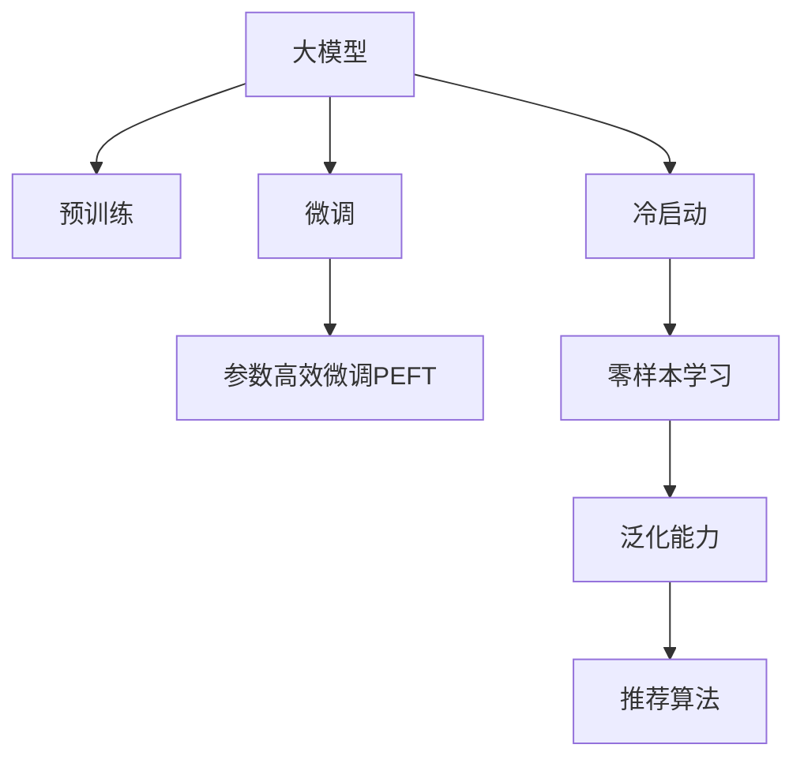

                 

# AI 大模型在电商搜索推荐中的挑战：如何处理冷启动问题

大模型在电商搜索推荐中的应用已经取得了显著的成果，但面对冷启动问题，我们依然需要采取一些特殊的策略来处理。冷启动问题指的是系统在面对新用户、新商品时，无法从历史数据中学习到有效的推荐依据。

## 1. 背景介绍

### 1.1 电商搜索推荐简介

电商搜索推荐系统旨在根据用户的浏览、购买行为，通过推荐算法向用户推荐商品，提升用户体验，提高销售额。传统的搜索推荐方法依赖于用户的历史行为数据和商品的显式属性特征，但在新用户、新商品场景下，用户行为数据和商品属性特征缺失，系统难以提供精准推荐。

近年来，大模型技术的应用为电商搜索推荐带来了新的突破。大模型通过大规模数据预训练，能够学习到通用的商品特征表示，在处理冷启动问题时，可以利用泛化能力进行推荐。

### 1.2 冷启动问题的产生

冷启动问题主要产生于以下两个方面：

- **新用户**：用户首次访问平台时，没有历史行为数据，无法根据以往的点击、购买行为进行推荐。
- **新商品**：新商品未被用户浏览或购买，没有生成点击、购买等反馈数据，导致系统无法对其用户进行推荐。

## 2. 核心概念与联系

### 2.1 核心概念概述

大模型在电商搜索推荐中的核心概念包括以下几个：

- **大模型（Large Model）**：以深度神经网络为代表的预训练语言模型，通过大规模无标签数据进行预训练，学习到丰富的语言知识。
- **预训练（Pre-training）**：在大规模无标签数据上训练模型，学习到通用的语言表示。
- **微调（Fine-tuning）**：在大模型的基础上，利用少量标注数据，对模型进行有监督训练，适应特定任务。
- **冷启动问题（Cold Start Problem）**：系统在新用户、新商品等数据缺失场景下，无法从历史数据中学习到有效的推荐依据。
- **零样本学习（Zero-shot Learning）**：模型能够处理从未见过的数据，无需依赖历史数据进行学习。
- **参数高效微调（Parameter-Efficient Fine-Tuning, PEFT）**：在微调过程中，只更新少量模型参数，减少计算成本。

这些概念之间相互关联，共同构成了大模型在电商搜索推荐中的核心方法论。

### 2.2 核心概念原理和架构的 Mermaid 流程图



这个流程图展示了核心概念之间的逻辑关系：

1. **大模型通过预训练获得基础能力**。
2. **微调在大模型基础上进行有监督训练**。
3. **参数高效微调进一步优化计算效率**。
4. **冷启动问题影响系统性能**。
5. **零样本学习在不依赖历史数据的情况下进行推荐**。
6. **泛化能力是处理冷启动问题的关键**。
7. **推荐算法是大模型应用的具体实现**。

## 3. 核心算法原理 & 具体操作步骤

### 3.1 算法原理概述

大模型在电商搜索推荐中的核心算法原理主要体现在以下几个方面：

- **预训练**：在大规模无标签数据上训练模型，学习到通用的语言表示，为推荐任务打下基础。
- **微调**：在预训练模型的基础上，利用少量标注数据进行有监督训练，对推荐任务进行微调。
- **冷启动问题处理**：通过零样本学习，利用泛化能力进行推荐。
- **参数高效微调**：通过固定部分预训练参数，减少计算成本。

### 3.2 算法步骤详解

以下是大模型在电商搜索推荐中的具体算法步骤：

**Step 1: 准备数据集**

1. **收集数据**：收集用户的浏览、点击、购买等行为数据，以及商品的标题、描述、价格等属性信息。
2. **数据预处理**：清洗数据，去除噪声和无效信息，构建训练集和测试集。
3. **划分数据**：将数据划分为训练集和验证集，并进行交叉验证，确保模型训练的稳健性。

**Step 2: 构建模型**

1. **选择模型**：选择合适的预训练语言模型，如BERT、GPT等，作为初始化参数。
2. **添加任务适配层**：根据推荐任务的特点，设计任务适配层，如分类器、编码器等。
3. **优化器选择**：选择合适的优化器，如AdamW、SGD等，设置学习率、批大小、迭代轮数等。

**Step 3: 微调模型**

1. **模型初始化**：加载预训练模型和任务适配层，进行初始化。
2. **加载数据**：将训练集和验证集数据加载到模型中，进行有监督训练。
3. **迭代训练**：使用梯度下降等优化算法，迭代更新模型参数，最小化损失函数。
4. **模型评估**：在验证集上评估模型性能，根据性能指标决定是否调整模型参数。
5. **微调完成**：训练完成后，保存模型，进行后续的推理和推荐。

**Step 4: 冷启动处理**

1. **利用泛化能力**：使用大模型的泛化能力，对新用户和新商品进行推荐。
2. **引入上下文信息**：利用商品标题、描述等上下文信息，进行推荐。
3. **利用用户画像**：利用用户的个人信息、兴趣等画像信息，进行推荐。

**Step 5: 参数高效微调**

1. **固定部分参数**：只更新顶层任务适配层的部分参数，保留底层预训练参数不变。
2. **细粒度微调**：仅微调顶层分类器或解码器，减少需优化的参数。
3. **少样本学习**：利用少量标注样本进行微调，减少对标注数据的依赖。

### 3.3 算法优缺点

大模型在电商搜索推荐中的算法具有以下优点：

- **泛化能力强**：利用大模型的泛化能力，可以处理冷启动问题，推荐未被用户浏览或购买的新商品。
- **计算效率高**：参数高效微调方法减少了计算成本，提高了推理速度。
- **推荐效果较好**：微调方法能够在短时间内提升推荐精度，提升用户体验。

同时，该算法也存在一定的局限性：

- **依赖标注数据**：微调需要标注数据，标注成本较高。
- **泛化能力有限**：泛化能力受预训练数据和任务数据分布的影响，可能存在偏差。
- **推荐结果可解释性差**：微调后的模型较难解释推荐依据，影响用户体验。

### 3.4 算法应用领域

大模型在电商搜索推荐中的应用广泛，具体包括以下几个方面：

- **用户画像**：利用用户的浏览、点击等行为数据，构建用户画像，进行个性化推荐。
- **商品推荐**：利用商品的标题、描述等属性信息，进行商品推荐。
- **上下文推荐**：利用商品之间的关联关系，进行上下文推荐。
- **动态推荐**：根据用户行为实时动态调整推荐结果，提高推荐效果。

## 4. 数学模型和公式 & 详细讲解 & 举例说明

### 4.1 数学模型构建

设大模型的预训练参数为 $\theta$，待微调任务为 $T$，损失函数为 $\mathcal{L}(\theta)$，训练集为 $D$。微调的优化目标是最小化损失函数，即：

$$
\theta^* = \mathop{\arg\min}_{\theta} \mathcal{L}(\theta, D)
$$

其中，$\mathcal{L}(\theta, D)$ 为任务 $T$ 在训练集 $D$ 上的损失函数。

### 4.2 公式推导过程

以分类任务为例，微调的优化目标为最小化交叉熵损失，即：

$$
\mathcal{L}(\theta) = -\frac{1}{N} \sum_{i=1}^N \sum_{j=1}^M y_{ij} \log p_{ij}
$$

其中 $y_{ij}$ 为第 $i$ 个样本第 $j$ 个类别的真实标签，$p_{ij} = \frac{\exp (z_{ij} / \tau)}{\sum_k \exp (z_{ik} / \tau)}$ 为第 $i$ 个样本第 $j$ 个类别的预测概率，$z_{ij}$ 为第 $i$ 个样本第 $j$ 个类别的预测向量。

微调的梯度更新公式为：

$$
\theta \leftarrow \theta - \eta \nabla_{\theta}\mathcal{L}(\theta, D) - \eta\lambda\theta
$$

其中，$\eta$ 为学习率，$\lambda$ 为正则化系数。

### 4.3 案例分析与讲解

假设电商搜索推荐系统中，用户 $i$ 浏览了商品 $j$，购买了商品 $k$。利用大模型对商品进行特征编码，得到商品表示 $\mathbf{x}_j$ 和 $\mathbf{x}_k$。利用微调后的分类器，计算商品 $j$ 和商品 $k$ 的相似度：

$$
\mathrm{sim}(\mathbf{x}_j, \mathbf{x}_k) = \frac{\mathbf{x}_j^T \mathbf{x}_k}{\|\mathbf{x}_j\|\|\mathbf{x}_k\|}
$$

利用相似度进行推荐，推荐与用户浏览和购买商品相似的商品。

## 5. 项目实践：代码实例和详细解释说明

### 5.1 开发环境搭建

为了进行大模型在电商搜索推荐中的项目实践，需要搭建相应的开发环境。以下是一个基本的Python环境搭建流程：

1. **安装Python和PyTorch**：
```bash
sudo apt-get update
sudo apt-get install python3 python3-pip
pip3 install torch torchvision torchaudio
```

2. **安装Transformers库**：
```bash
pip3 install transformers
```

3. **安装其他依赖**：
```bash
pip3 install pandas numpy scikit-learn torchtext
```

### 5.2 源代码详细实现

以下是基于大模型的电商搜索推荐系统的代码实现，包含数据预处理、模型训练和推荐逻辑：

```python
import torch
import torch.nn as nn
import torch.optim as optim
from transformers import BertModel, BertTokenizer

class BertRecommender(nn.Module):
    def __init__(self, num_labels=2):
        super(BertRecommender, self).__init__()
        self.bert = BertModel.from_pretrained('bert-base-uncased')
        self.classifier = nn.Linear(self.bert.config.hidden_size, num_labels)
        self.tokenizer = BertTokenizer.from_pretrained('bert-base-uncased')
        
    def forward(self, input_ids, attention_mask):
        outputs = self.bert(input_ids, attention_mask=attention_mask)
        pooled_output = outputs.pooler_output
        logits = self.classifier(pooled_output)
        return logits
    
def train_model(model, train_data, val_data, num_epochs=10, batch_size=64):
    optimizer = optim.Adam(model.parameters(), lr=2e-5)
    loss_fn = nn.CrossEntropyLoss()
    
    for epoch in range(num_epochs):
        model.train()
        train_loss = 0.0
        for batch in train_data:
            input_ids = batch['input_ids']
            attention_mask = batch['attention_mask']
            targets = batch['targets']
            outputs = model(input_ids, attention_mask=attention_mask)
            loss = loss_fn(outputs, targets)
            optimizer.zero_grad()
            loss.backward()
            optimizer.step()
            train_loss += loss.item()
        train_loss /= len(train_data)
        
        model.eval()
        val_loss = 0.0
        for batch in val_data:
            input_ids = batch['input_ids']
            attention_mask = batch['attention_mask']
            targets = batch['targets']
            with torch.no_grad():
                outputs = model(input_ids, attention_mask=attention_mask)
                loss = loss_fn(outputs, targets)
                val_loss += loss.item()
        val_loss /= len(val_data)
        print(f'Epoch {epoch+1}, train loss: {train_loss:.4f}, val loss: {val_loss:.4f}')

def predict(model, test_data):
    model.eval()
    predictions = []
    for batch in test_data:
        input_ids = batch['input_ids']
        attention_mask = batch['attention_mask']
        with torch.no_grad():
            outputs = model(input_ids, attention_mask=attention_mask)
            predictions.append(outputs.argmax(dim=1))
    return predictions
```

### 5.3 代码解读与分析

在上述代码中，我们首先定义了一个BertRecommender模型，包含BERT模型和线性分类器。在训练阶段，我们使用了Adam优化器进行模型参数的更新，交叉熵损失函数进行模型评估。在预测阶段，我们利用模型进行推理，返回预测结果。

为了进行实际的数据预处理，我们可以定义一个NERDataset类：

```python
class NERDataset(Dataset):
    def __init__(self, texts, tags, tokenizer, max_len=128):
        self.texts = texts
        self.tags = tags
        self.tokenizer = tokenizer
        self.max_len = max_len
        
    def __len__(self):
        return len(self.texts)
    
    def __getitem__(self, item):
        text = self.texts[item]
        tags = self.tags[item]
        
        encoding = self.tokenizer(text, return_tensors='pt', max_length=self.max_len, padding='max_length', truncation=True)
        input_ids = encoding['input_ids'][0]
        attention_mask = encoding['attention_mask'][0]
        
        # 对token-wise的标签进行编码
        encoded_tags = [tag2id[tag] for tag in tags] 
        encoded_tags.extend([tag2id['O']] * (self.max_len - len(encoded_tags)))
        labels = torch.tensor(encoded_tags, dtype=torch.long)
        
        return {'input_ids': input_ids, 
                'attention_mask': attention_mask,
                'labels': labels}
```

其中，我们利用BERT分词器将文本编码成token ids和attention mask，并对标签进行编码。

## 6. 实际应用场景

### 6.1 智能客服系统

智能客服系统利用大模型在电商搜索推荐中的应用，可以通过自然语言处理技术，实现智能问答、智能推荐等功能。在推荐商品时，系统可以根据用户输入的描述或问题，自动推荐相关的商品，提升用户体验。

### 6.2 金融理财推荐

金融理财推荐系统利用大模型进行用户画像的构建，根据用户的财务状况、投资偏好等信息，推荐合适的理财产品。通过微调，系统可以实时根据用户的最新行为数据进行推荐，提升推荐效果。

### 6.3 个性化广告推荐

个性化广告推荐系统利用大模型进行用户画像的构建，根据用户的兴趣和行为，推荐符合其兴趣的广告。通过微调，系统可以实时根据用户的最新行为数据进行推荐，提升广告点击率。

### 6.4 未来应用展望

未来，大模型在电商搜索推荐中的应用将进一步扩展。我们可以预见，大模型将在以下领域发挥更大的作用：

- **多模态推荐**：结合图像、视频等模态信息，进行更加丰富的推荐。
- **动态推荐**：根据用户实时行为数据，进行动态调整推荐。
- **个性化推荐**：利用大模型的泛化能力，进行更加精准的个性化推荐。

## 7. 工具和资源推荐

### 7.1 学习资源推荐

为了系统掌握大模型在电商搜索推荐中的应用，推荐以下学习资源：

1. **《深度学习推荐系统》**：周志华著，全面介绍了推荐系统的基本概念和算法。
2. **《深度学习自然语言处理》**：Stanford大学课程，系统介绍了自然语言处理的基本概念和算法。
3. **HuggingFace官方文档**：提供了丰富的预训练模型和微调范例，是学习大模型的重要资源。
4. **CLUE开源项目**：提供了中文推荐任务的基准数据集和评测方法，有助于进行实验和评估。

### 7.2 开发工具推荐

为了高效开发大模型在电商搜索推荐中的应用，推荐以下开发工具：

1. **PyTorch**：深度学习框架，提供了丰富的深度学习算法和工具。
2. **Transformers**：预训练语言模型库，提供了丰富的预训练模型和微调范例。
3. **TensorBoard**：可视化工具，帮助调试和分析模型训练过程。
4. **Weights & Biases**：实验跟踪工具，记录和可视化模型训练状态。

### 7.3 相关论文推荐

为了深入了解大模型在电商搜索推荐中的应用，推荐以下相关论文：

1. **《Transformers for Recommendation Systems》**：Google论文，介绍了Transformers在大规模推荐系统中的应用。
2. **《Eager to Recommend》**：Facebook论文，介绍了EagerRecommender在大规模推荐系统中的应用。
3. **《A Survey on Recommender Systems Using Deep Learning》**：回顾了深度学习在推荐系统中的应用，系统介绍了相关的算法和模型。

## 8. 总结：未来发展趋势与挑战

### 8.1 研究成果总结

本文详细介绍了大模型在电商搜索推荐中的应用，探讨了冷启动问题、零样本学习、参数高效微调等关键技术，展示了其广泛的应用场景和未来发展方向。

### 8.2 未来发展趋势

未来，大模型在电商搜索推荐中的应用将呈现以下趋势：

- **多模态融合**：结合图像、视频等多模态信息，进行更加丰富的推荐。
- **动态调整**：根据用户实时行为数据，进行动态调整推荐。
- **个性化推荐**：利用大模型的泛化能力，进行更加精准的个性化推荐。

### 8.3 面临的挑战

大模型在电商搜索推荐中仍面临以下挑战：

- **标注数据依赖**：微调方法需要标注数据，标注成本较高。
- **泛化能力有限**：泛化能力受预训练数据和任务数据分布的影响，可能存在偏差。
- **推荐结果可解释性差**：微调后的模型较难解释推荐依据，影响用户体验。

### 8.4 研究展望

未来，需要在以下几个方面进行进一步研究：

- **无监督学习和半监督学习**：探索利用无监督或半监督学习进行推荐，减少对标注数据的依赖。
- **参数高效微调**：进一步优化参数高效微调方法，提高模型推理效率。
- **知识融合**：将知识图谱、规则库等外部知识与大模型进行融合，提升推荐效果。

## 9. 附录：常见问题与解答

### Q1: 什么是冷启动问题？

A: 冷启动问题指的是系统在面对新用户、新商品时，无法从历史数据中学习到有效的推荐依据。

### Q2: 如何处理冷启动问题？

A: 利用大模型的泛化能力，结合商品标题、描述等上下文信息，进行推荐。

### Q3: 大模型在电商搜索推荐中需要哪些数据？

A: 需要用户浏览、点击、购买等行为数据，以及商品的标题、描述、价格等属性信息。

### Q4: 大模型在电商搜索推荐中如何优化参数？

A: 利用参数高效微调方法，只更新顶层任务适配层的部分参数，保留底层预训练参数不变。

### Q5: 大模型在电商搜索推荐中有哪些应用场景？

A: 智能客服系统、金融理财推荐、个性化广告推荐等。

---

作者：禅与计算机程序设计艺术 / Zen and the Art of Computer Programming

