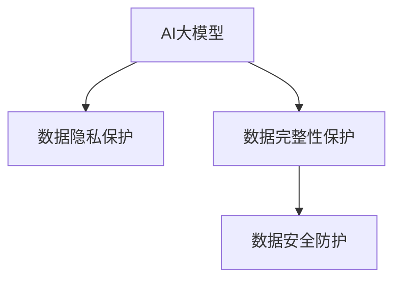

                 

# AI 大模型在电商搜索推荐中的数据安全策略：保障用户隐私与数据完整性

## 1. 背景介绍

### 1.1 问题由来
随着AI大模型的广泛应用，其在电商搜索推荐系统中的应用越来越普遍。大模型通过大量数据训练，具备强大的推荐能力，能够显著提升电商平台的转化率和用户体验。然而，电商搜索推荐系统需要处理大量的用户数据，包括浏览历史、点击行为、搜索记录等，这些数据涉及用户的个人隐私。如何在保障用户隐私的同时，提供高质量的推荐服务，是大模型应用中亟待解决的问题。

### 1.2 问题核心关键点
电商搜索推荐系统面临的核心问题包括：

- 用户隐私保护：电商平台需要收集和处理大量用户数据，如何在推荐系统中保障用户隐私不被泄露。
- 数据完整性：电商平台需要维护推荐数据的准确性和完整性，防止推荐系统出现偏差和误导。
- 数据安全：电商平台需要确保推荐系统数据的安全性，防止数据泄露和篡改。

这些问题不仅关乎用户隐私保护和数据安全，还影响着电商平台的品牌形象和用户信任度。

## 2. 核心概念与联系

### 2.1 核心概念概述

为更好地理解AI大模型在电商搜索推荐中的数据安全策略，本节将介绍几个密切相关的核心概念：

- AI大模型：基于深度学习技术训练的大型语言模型，如BERT、GPT等，具备强大的推荐能力。
- 数据隐私保护：通过技术手段保护用户数据不被泄露和滥用的过程。
- 数据完整性保护：保障推荐数据准确性和完整性的过程，防止数据被篡改和注入噪声。
- 数据安全防护：确保推荐数据在传输和存储过程中不被篡改和泄露，防止安全事故发生。

这些核心概念之间的逻辑关系可以通过以下Mermaid流程图来展示：



这个流程图展示了大模型在电商搜索推荐中的应用，以及与数据隐私、数据完整性和数据安全之间的关系。

## 3. 核心算法原理 & 具体操作步骤
### 3.1 算法原理概述

AI大模型在电商搜索推荐中的数据安全策略，主要通过以下几个步骤实现：

1. **数据匿名化**：通过去除用户数据的个人标识信息，如姓名、身份证号等，保护用户隐私。
2. **差分隐私**：在数据处理和模型训练中，加入噪声，防止模型对特定用户数据的过度拟合，保障用户隐私。
3. **数据加密**：对用户数据进行加密处理，防止数据在传输和存储过程中被泄露。
4. **数据去重和清洗**：通过去重和清洗技术，确保推荐数据的准确性和完整性。
5. **模型审计和监控**：定期审计和监控模型行为，及时发现和修复潜在的安全漏洞。

这些步骤共同构成了大模型在电商搜索推荐中的数据安全策略，旨在保障用户隐私、数据完整性和数据安全。

### 3.2 算法步骤详解

#### 3.2.1 数据匿名化

数据匿名化是通过技术手段去除用户数据的个人标识信息，保护用户隐私的过程。具体步骤如下：

1. **去除敏感信息**：将用户数据中涉及姓名、身份证号、联系方式等敏感信息进行脱敏处理，如用星号替换敏感字符。
2. **数据聚合**：将用户数据进行聚合处理，如将浏览记录、点击行为等数据进行合并，减少个人标识信息。
3. **伪匿名化**：通过生成伪标识符，将数据与真实用户进行映射，确保数据在统计和分析中的隐私性。

#### 3.2.2 差分隐私

差分隐私是通过在数据处理和模型训练中引入噪声，防止模型对特定用户数据的过度拟合，保障用户隐私的过程。具体步骤如下：

1. **噪声注入**：在数据处理和模型训练中，引入随机噪声，防止模型对特定用户数据的过度拟合。
2. **隐私预算分配**：根据数据集的敏感程度和隐私需求，合理分配隐私预算，确保隐私保护的力度。
3. **隐私损失分析**：通过隐私损失函数，评估差分隐私算法的隐私保护效果，确保隐私保护策略的合理性。

#### 3.2.3 数据加密

数据加密是通过对用户数据进行加密处理，防止数据在传输和存储过程中被泄露的过程。具体步骤如下：

1. **数据加密**：使用对称加密算法（如AES）或非对称加密算法（如RSA）对用户数据进行加密处理，确保数据在传输和存储中的安全性。
2. **密钥管理**：合理管理加密密钥，防止密钥泄露和篡改，确保数据加密的安全性。
3. **数据解密**：在需要访问用户数据时，使用相应的密钥进行数据解密，确保数据的可用性。

#### 3.2.4 数据去重和清洗

数据去重和清洗是通过技术手段确保推荐数据的准确性和完整性的过程。具体步骤如下：

1. **数据去重**：通过去重算法，去除重复的推荐数据，确保数据的多样性和独特性。
2. **数据清洗**：通过清洗算法，去除无效和噪声数据，确保数据的准确性和完整性。
3. **数据验证**：定期验证推荐数据的准确性和完整性，确保数据质量。

#### 3.2.5 模型审计和监控

模型审计和监控是通过技术手段定期审计和监控模型行为，及时发现和修复潜在的安全漏洞的过程。具体步骤如下：

1. **模型审计**：定期审计推荐模型，检查模型是否存在漏洞和偏见，确保模型公平性和公正性。
2. **模型监控**：实时监控推荐模型的运行状态，及时发现和修复潜在的安全漏洞。
3. **异常检测**：通过异常检测算法，识别异常行为和攻击，确保推荐系统的安全性。

### 3.3 算法优缺点

AI大模型在电商搜索推荐中的数据安全策略，具有以下优点：

- 保障用户隐私：通过数据匿名化和差分隐私技术，保障用户数据隐私不被泄露和滥用。
- 提高数据完整性：通过数据去重和清洗技术，确保推荐数据的准确性和完整性。
- 增强数据安全性：通过数据加密和模型监控技术，确保推荐数据在传输和存储过程中不被篡改和泄露。

同时，该策略也存在一定的局限性：

- 数据去重和清洗复杂：需要设计合适的算法和策略，确保推荐数据的多样性和准确性。
- 隐私预算分配困难：隐私预算的分配需要综合考虑数据敏感程度和隐私需求，确保隐私保护的有效性。
- 模型监控和审计成本高：需要投入大量人力和技术资源，确保推荐系统的公平性和安全性。

尽管存在这些局限性，但就目前而言，这些措施是大模型在电商搜索推荐中保障用户隐私和数据完整性的重要手段。未来相关研究的重点在于如何进一步降低数据去重和清洗的复杂性，优化隐私预算分配策略，同时兼顾模型监控和审计的成本。

### 3.4 算法应用领域

AI大模型在电商搜索推荐中的数据安全策略，已经在多个领域得到了应用，包括但不限于：

- 电商搜索推荐系统：通过数据匿名化和差分隐私技术，保障用户数据隐私和推荐数据的准确性。
- 金融风险评估系统：通过数据加密和模型监控技术，确保金融数据的安全性和模型公平性。
- 医疗健康管理系统：通过数据匿名化和隐私保护技术，保障患者数据隐私和医疗决策的公平性。
- 物流配送系统：通过数据去重和清洗技术，确保物流数据的准确性和完整性。
- 智能家居系统：通过数据加密和模型监控技术，确保家居数据的安全性和系统稳定性。

除了上述这些领域外，AI大模型在更多场景中也将得到应用，如智慧城市、智能制造等，为各个行业带来新的变革。

## 4. 数学模型和公式 & 详细讲解 & 举例说明

### 4.1 数学模型构建

在电商搜索推荐系统中，数据隐私保护和数据完整性保护可以通过数学模型进行建模和求解。以差分隐私为例，通过引入噪声 $\epsilon$，使得模型在每次训练中的隐私损失最小化。

假设数据集 $D=\{x_1, x_2, ..., x_n\}$，模型参数为 $\theta$，目标函数为 $L(\theta)$，隐私预算为 $\epsilon$，则差分隐私的数学模型可以表示为：

$$
\min_{\theta} L(\theta) + \frac{\epsilon}{2\delta} W(\theta)
$$

其中 $W(\theta)$ 为隐私损失函数， $\delta$ 为隐私保护要求。

### 4.2 公式推导过程

差分隐私的隐私损失函数 $W(\theta)$ 可以表示为：

$$
W(\theta) = \sum_{i=1}^n \max \{0, L_i(\theta) - L_i(\theta')\}
$$

其中 $L_i(\theta)$ 和 $L_i(\theta')$ 分别表示加入噪声 $\epsilon$ 和未加入噪声的模型在样本 $x_i$ 上的损失。

隐私预算 $\epsilon$ 和隐私保护要求 $\delta$ 的选择需要综合考虑数据集的敏感程度和隐私需求。一般来说，数据集的敏感程度越高，隐私保护要求越严格，所需的隐私预算越大。

### 4.3 案例分析与讲解

以电商平台为例，假设电商平台的推荐系统需要处理用户的浏览历史、点击行为等数据，这些数据涉及用户的个人隐私。为了保护用户隐私，电商平台可以采用差分隐私技术，在推荐模型训练中引入噪声 $\epsilon$。具体步骤如下：

1. **数据预处理**：将用户的浏览历史、点击行为等数据进行预处理，去除敏感信息。
2. **模型训练**：在模型训练中引入噪声 $\epsilon$，使得模型在每次训练中的隐私损失最小化。
3. **隐私预算分配**：根据数据集的敏感程度和隐私需求，合理分配隐私预算，确保隐私保护的有效性。
4. **隐私损失评估**：通过隐私损失函数 $W(\theta)$ 评估隐私保护效果，确保隐私保护策略的合理性。

通过差分隐私技术，电商平台可以在保护用户隐私的同时，提供高质量的推荐服务。

## 5. 项目实践：代码实例和详细解释说明
### 5.1 开发环境搭建

在进行数据安全策略实践前，我们需要准备好开发环境。以下是使用Python进行PyTorch开发的环境配置流程：

1. 安装Anaconda：从官网下载并安装Anaconda，用于创建独立的Python环境。

2. 创建并激活虚拟环境：
```bash
conda create -n data_security-env python=3.8 
conda activate data_security-env
```

3. 安装PyTorch：根据CUDA版本，从官网获取对应的安装命令。例如：
```bash
conda install pytorch torchvision torchaudio cudatoolkit=11.1 -c pytorch -c conda-forge
```

4. 安装相关库：
```bash
pip install torch numpy pandas scikit-learn transformers
```

完成上述步骤后，即可在`data_security-env`环境中开始项目实践。

### 5.2 源代码详细实现

下面我们以电商搜索推荐系统为例，给出使用PyTorch实现差分隐私算法的代码实现。

首先，定义差分隐私损失函数：

```python
import torch
import torch.nn as nn
import torch.optim as optim
from torch.distributions import Laplace

class DPModel(nn.Module):
    def __init__(self, num_users, num_items, epsilon):
        super(DPModel, self).__init__()
        self.num_users = num_users
        self.num_items = num_items
        self.epsilon = epsilon
        self.model = nn.Sequential(
            nn.Linear(num_users, 64),
            nn.ReLU(),
            nn.Linear(64, num_items)
        )
        self.register_buffer('laplace', Laplace(torch.tensor(0.), 1. / epsilon))
        
    def forward(self, x):
        return self.model(x)
    
    def privacy_loss(self):
        batch_size = x.shape[0]
        perturbation = self.laplace.sample(sample_shape=(batch_size,)) / 2
        return torch.mean(torch.max(0, (self.model(x + perturbation) - self.model(x)) / perturbation))
```

然后，定义训练函数：

```python
def train_model(model, train_data, val_data, epochs, batch_size, learning_rate, privacy_budget):
    model.train()
    optimizer = optim.Adam(model.parameters(), lr=learning_rate)
    for epoch in range(epochs):
        train_loss = 0
        privacy_loss = 0
        for batch in train_data:
            x, y = batch
            optimizer.zero_grad()
            loss = model(x).softmax(1) * y.log()
            loss.backward()
            optimizer.step()
            train_loss += loss.item()
            privacy_loss += model.privacy_loss()
        train_loss /= len(train_data)
        privacy_loss /= len(train_data)
        print(f'Epoch {epoch+1}, train loss: {train_loss:.3f}, privacy loss: {privacy_loss:.3f}')
        model.eval()
        val_loss = 0
        for batch in val_data:
            x, y = batch
            val_loss += torch.mean(model(x).softmax(1) * y.log()).item()
        val_loss /= len(val_data)
        print(f'Epoch {epoch+1}, val loss: {val_loss:.3f}')
```

最后，启动训练流程：

```python
num_users = 10000
num_items = 1000
batch_size = 64
epochs = 10
learning_rate = 0.01
privacy_budget = 1.0

model = DPModel(num_users, num_items, privacy_budget)
train_data = ...
val_data = ...

train_model(model, train_data, val_data, epochs, batch_size, learning_rate, privacy_budget)
```

### 5.3 代码解读与分析

让我们再详细解读一下关键代码的实现细节：

**DPModel类**：
- `__init__`方法：初始化模型参数，包括用户数、商品数和隐私预算 $\epsilon$。定义了模型结构和隐私保护参数。
- `forward`方法：前向传播计算模型输出。
- `privacy_loss`方法：计算隐私损失函数。

**train_model函数**：
- 定义模型和优化器。
- 在训练过程中，计算模型损失和隐私损失，并进行优化。
- 在每个epoch结束时，在验证集上评估模型性能，并输出训练和验证损失。

**训练流程**：
- 定义模型参数和数据集。
- 定义训练超参数，如epoch数、batch大小和学习率。
- 启动训练过程，循环迭代。
- 在训练集和验证集上评估模型性能。

可以看到，通过PyTorch实现差分隐私算法，我们可以简单高效地进行数据安全策略的开发和验证。

## 6. 实际应用场景
### 6.1 电商搜索推荐系统

基于差分隐私的AI大模型在电商搜索推荐系统中的应用，可以显著提升电商平台的推荐效果，同时保障用户隐私和数据安全。具体而言，可以采用以下策略：

1. **数据预处理**：将用户的浏览历史、点击行为等数据进行去重和清洗，去除噪声和重复数据。
2. **差分隐私保护**：在模型训练中引入噪声，防止模型对特定用户数据的过度拟合。
3. **隐私预算分配**：根据数据集的敏感程度和隐私需求，合理分配隐私预算，确保隐私保护的有效性。
4. **隐私损失评估**：通过隐私损失函数评估隐私保护效果，确保隐私保护策略的合理性。

通过这些策略，电商平台可以在提供高质量推荐服务的同时，保障用户隐私和数据安全。

### 6.2 金融风险评估系统

金融风险评估系统需要处理大量的用户数据，如消费记录、贷款记录等，这些数据涉及用户的个人隐私。为了保护用户隐私，金融机构可以采用差分隐私技术，在风险评估模型训练中引入噪声。具体步骤如下：

1. **数据预处理**：将用户的消费记录、贷款记录等数据进行预处理，去除敏感信息。
2. **模型训练**：在模型训练中引入噪声，使得模型在每次训练中的隐私损失最小化。
3. **隐私预算分配**：根据数据集的敏感程度和隐私需求，合理分配隐私预算，确保隐私保护的有效性。
4. **隐私损失评估**：通过隐私损失函数评估隐私保护效果，确保隐私保护策略的合理性。

通过差分隐私技术，金融机构可以在保障用户隐私的同时，提供高质量的风险评估服务。

### 6.3 医疗健康管理系统

医疗健康管理系统需要处理大量的患者数据，如病历、检查记录等，这些数据涉及患者的隐私。为了保护患者隐私，医疗机构可以采用差分隐私技术，在医疗模型训练中引入噪声。具体步骤如下：

1. **数据预处理**：将患者的病历、检查记录等数据进行预处理，去除敏感信息。
2. **模型训练**：在模型训练中引入噪声，使得模型在每次训练中的隐私损失最小化。
3. **隐私预算分配**：根据数据集的敏感程度和隐私需求，合理分配隐私预算，确保隐私保护的有效性。
4. **隐私损失评估**：通过隐私损失函数评估隐私保护效果，确保隐私保护策略的合理性。

通过差分隐私技术，医疗机构可以在保障患者隐私的同时，提供高质量的医疗服务。

### 6.4 未来应用展望

随着AI大模型的发展，基于差分隐私的数据安全策略将在更多领域得到应用，为传统行业带来变革性影响。

在智慧城市治理中，AI大模型可以通过差分隐私技术，在城市事件监测、舆情分析等场景中保障数据隐私和安全性，提升城市管理的自动化和智能化水平。

在智能制造领域，AI大模型可以通过差分隐私技术，在设备故障预测、生产调度优化等场景中保障数据隐私和安全性，提升生产效率和制造质量。

此外，在医疗健康、金融保险、物流配送等众多领域，基于差分隐私的AI大模型也将得到应用，为各个行业带来新的变革。

## 7. 工具和资源推荐
### 7.1 学习资源推荐

为了帮助开发者系统掌握差分隐私在大模型中的应用，这里推荐一些优质的学习资源：

1. 《Differential Privacy》系列书籍：由Google和IBM等公司联合编写，详细介绍了差分隐私的基本概念和应用场景。
2. PyTorch官方文档：PyTorch的官方文档，提供了丰富的差分隐私实现和应用样例。
3 《privacy-preserving machine learning》书籍：详细介绍了差分隐私的数学原理和实际应用。
4 《Data Privacy and Statistical Learning》书籍：介绍了差分隐私在数据统计和机器学习中的应用。

通过对这些资源的学习实践，相信你一定能够快速掌握差分隐私在大模型中的应用，并用于解决实际的隐私保护问题。

### 7.2 开发工具推荐

高效的开发离不开优秀的工具支持。以下是几款用于差分隐私和大模型应用的常用工具：

1. PyTorch：基于Python的开源深度学习框架，灵活动态的计算图，适合快速迭代研究。
2. TensorFlow：由Google主导开发的开源深度学习框架，生产部署方便，适合大规模工程应用。
3. Transformers库：HuggingFace开发的NLP工具库，集成了众多SOTA语言模型，支持差分隐私和大模型应用。
4 Weights & Biases：模型训练的实验跟踪工具，可以记录和可视化模型训练过程中的各项指标，方便对比和调优。
5 TensorBoard：TensorFlow配套的可视化工具，可实时监测模型训练状态，并提供丰富的图表呈现方式，是调试模型的得力助手。

合理利用这些工具，可以显著提升差分隐私和大模型的开发效率，加快创新迭代的步伐。

### 7.3 相关论文推荐

差分隐私和大模型技术的发展源于学界的持续研究。以下是几篇奠基性的相关论文，推荐阅读：

1. Differential Privacy：privacy matters：介绍差分隐私的基本概念和应用场景。
2 《On the Design and Analysis of Differential Privacy》：介绍差分隐私的理论基础和数学模型。
3 《Algorithmic Fairness via Disparate Privacy》：介绍差分隐私在公平性中的应用。
4 《Differential Privacy Mechanisms for Machine Learning》：介绍差分隐私在大模型中的应用。
5 《Modeling Resilience to Adversarial Examples》：介绍差分隐私在对抗样本中的应用。

这些论文代表了大模型在隐私保护和差分隐私领域的发展脉络。通过学习这些前沿成果，可以帮助研究者把握学科前进方向，激发更多的创新灵感。

## 8. 总结：未来发展趋势与挑战
### 8.1 总结

本文对基于差分隐私的大模型在电商搜索推荐系统中的应用进行了全面系统的介绍。首先阐述了电商搜索推荐系统面临的核心问题，明确了差分隐私在大模型中的重要作用。其次，从原理到实践，详细讲解了差分隐私的数学模型和关键步骤，给出了差分隐私算法实现的完整代码实例。同时，本文还广泛探讨了差分隐私在大模型中的实际应用场景，展示了差分隐私范式的巨大潜力。

通过本文的系统梳理，可以看到，差分隐私技术在大模型中的应用，极大地提升了电商搜索推荐系统的推荐效果和安全性，保障了用户隐私和数据完整性。未来，伴随差分隐私技术和大模型方法的持续演进，这些技术必将进一步拓展应用场景，为各个行业带来变革性影响。

### 8.2 未来发展趋势

展望未来，差分隐私技术在大模型中的应用将呈现以下几个发展趋势：

1. 隐私预算动态调整：根据数据集的敏感程度和隐私需求，动态调整隐私预算，确保隐私保护的有效性。
2 基于深度学习的差分隐私：通过引入深度学习技术，提高差分隐私算法的效率和精度。
3 差分隐私联邦学习：将差分隐私技术应用到联邦学习中，实现多端数据隐私保护。
4 差分隐私强化学习：将差分隐私技术应用到强化学习中，实现隐私保护和决策优化的协同。

这些趋势凸显了差分隐私技术在大模型中的广阔前景。这些方向的探索发展，必将进一步提升大模型系统的性能和安全性，为构建人机协同的智能系统铺平道路。

### 8.3 面临的挑战

尽管差分隐私技术在大模型中已经取得了瞩目成就，但在迈向更加智能化、普适化应用的过程中，它仍面临着诸多挑战：

1. 隐私预算分配困难：隐私预算的分配需要综合考虑数据集的敏感程度和隐私需求，确保隐私保护的有效性。
2 数据去重和清洗复杂：需要设计合适的算法和策略，确保推荐数据的多样性和准确性。
3 隐私损失评估困难：隐私损失评估需要综合考虑多种隐私保护指标，确保隐私保护策略的合理性。

尽管存在这些挑战，但差分隐私技术在大模型中的应用，仍具有重要的研究价值和发展前景。相信随着学界和产业界的共同努力，这些挑战终将一一被克服，差分隐私技术必将在构建安全、可靠、可解释、可控的智能系统中扮演越来越重要的角色。

### 8.4 研究展望

面对差分隐私技术在大模型中面临的挑战，未来的研究需要在以下几个方面寻求新的突破：

1 动态隐私预算分配：通过动态调整隐私预算，适应数据集的动态变化，确保隐私保护的有效性。
2 高效差分隐私算法：通过引入深度学习技术，提高差分隐私算法的效率和精度，降低隐私保护成本。
3 差分隐私联邦学习：将差分隐私技术应用到联邦学习中，实现多端数据隐私保护，提升数据融合效率。
4 差分隐私强化学习：将差分隐私技术应用到强化学习中，实现隐私保护和决策优化的协同，提升智能系统的智能化水平。

这些研究方向将推动差分隐私技术在大模型中的应用，为构建安全、可靠、可解释、可控的智能系统提供技术支撑。总之，差分隐私技术在大模型中的应用，将继续引领人工智能技术的发展方向，为构建更加智能化的未来社会提供强有力的技术保障。

## 9. 附录：常见问题与解答

**Q1：差分隐私和大模型分别是什么？**

A: 差分隐私是一种保障用户隐私的技术，通过在数据处理和模型训练中引入噪声，防止模型对特定用户数据的过度拟合。大模型是指基于深度学习技术训练的大型语言模型，如BERT、GPT等，具备强大的推荐能力。

**Q2：差分隐私和大模型结合的难点是什么？**

A: 差分隐私和大模型结合的难点在于如何平衡隐私保护和模型性能。差分隐私的引入可能会降低模型精度，同时增加计算复杂度。因此，需要设计合适的算法和策略，确保隐私保护的同时不损害模型性能。

**Q3：差分隐私和大模型结合的应用场景有哪些？**

A: 差分隐私和大模型结合的应用场景包括电商搜索推荐、金融风险评估、医疗健康管理、智能制造等。在这些场景中，差分隐私和大模型可以协同工作，保障用户隐私和数据安全，同时提供高质量的服务。

**Q4：差分隐私和大模型的实现流程是什么？**

A: 差分隐私和大模型的实现流程包括数据预处理、模型训练、隐私预算分配、隐私损失评估等步骤。在实现过程中，需要设计合适的算法和策略，确保隐私保护和模型性能的平衡。

**Q5：如何提高差分隐私算法的效率和精度？**

A: 提高差分隐私算法的效率和精度需要引入深度学习技术，设计更加高效和精准的差分隐私算法。同时，可以通过分布式计算、混合精度训练等技术，提高差分隐私算法的计算效率。

---

作者：禅与计算机程序设计艺术 / Zen and the Art of Computer Programming

