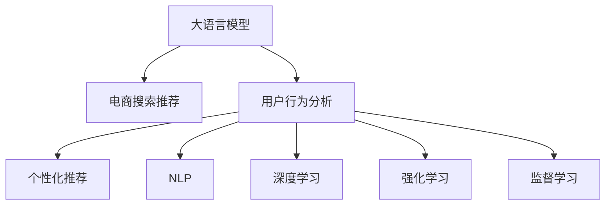

                 

# AI 大模型在电商搜索推荐中的用户行为分析：理解用户需求与购买偏好

> 关键词：大语言模型,电商搜索推荐,用户行为分析,个性化推荐,自然语言处理,NLP,深度学习,强化学习,监督学习,数据挖掘

## 1. 背景介绍

随着电子商务的发展，搜索引擎和推荐系统已经成为电商平台不可或缺的核心功能，它们极大地提升了用户体验和平台转化率。然而，这些系统如何更准确地理解用户需求，并提供更加个性化和相关的搜索结果和商品推荐，一直是电商技术领域的重要研究方向。近年来，基于大语言模型的方法在这一领域取得了显著的进展，特别是在用户行为分析和个性化推荐方面，展现了强大的潜力。

### 1.1 电商搜索推荐现状与问题

目前，电商搜索推荐主要依赖于传统的基于规则和机器学习的技术。这些方法通常基于用户的点击、浏览、购买等行为数据，以及商品的属性、标签等信息，通过统计和分类等手段，为用户提供个性化的搜索结果和推荐。然而，这些方法存在以下问题：

- **数据依赖性高**：传统方法依赖于大量的标注数据进行模型训练，获取高品质的标注数据成本较高，且在用户行为数据不足时，难以准确预测用户需求。
- **模型复杂度低**：基于规则的方法较简单，而机器学习模型虽能处理复杂的非线性关系，但在处理大规模数据时，模型复杂度高，计算成本大。
- **个性化不足**：传统方法难以综合考虑用户的长期行为和短期行为，无法充分挖掘用户深层次的兴趣和需求。
- **模型可解释性差**：基于深度学习的方法往往是"黑盒"模型，难以解释模型的决策过程，无法满足某些领域对模型透明度的要求。

为了解决这些问题，研究者们提出了基于大语言模型的电商搜索推荐方法。这些方法能够直接利用自然语言文本数据，无需额外标注，即可进行用户行为分析和个性化推荐，大大提升了系统的灵活性和精度。

## 2. 核心概念与联系

### 2.1 核心概念概述

为更好地理解基于大语言模型的电商搜索推荐方法，本节将介绍几个关键概念：

- **大语言模型**：指一类预训练的深度神经网络模型，如BERT、GPT等，通过在大规模无标签文本数据上进行自监督学习，学习到丰富的语言表示，具备强大的自然语言理解和生成能力。
- **电商搜索推荐**：指通过分析和推荐系统，将商品展示给最可能感兴趣的用户，提升用户购物体验和平台转化率的技术。
- **用户行为分析**：指从用户的历史行为数据中，提取和挖掘用户的兴趣、需求和偏好，为个性化推荐提供依据。
- **个性化推荐**：指根据用户的历史行为和实时反馈，为用户推荐最符合其兴趣和需求的商品，提升用户的购物体验。
- **自然语言处理(NLP)**：指利用计算机处理和理解自然语言，包括文本分类、命名实体识别、关系抽取、对话生成等任务。
- **深度学习**：指一类基于神经网络的机器学习模型，通过多层非线性变换，从数据中学习高层次的特征表示。
- **强化学习**：指通过与环境的交互，学习最优策略的技术，常用于推荐系统中的用户行为预测和推荐策略优化。
- **监督学习**：指利用有标签的数据进行模型训练的技术，常用于电商搜索推荐中的用户行为预测和推荐。

这些核心概念之间的逻辑关系可以通过以下Mermaid流程图来展示：



这个流程图展示了大语言模型在电商搜索推荐中的核心概念及其之间的关系：

1. 大语言模型通过预训练获得基础能力。
2. 用户行为分析模块利用大语言模型进行文本处理和用户兴趣挖掘。
3. 个性化推荐模块根据用户行为分析结果，生成推荐结果。
4. NLP、深度学习、强化学习等技术辅助用户行为分析和个性化推荐。
5. 监督学习为个性化推荐提供目标和反馈。

这些概念共同构成了基于大语言模型的电商搜索推荐系统的技术框架，使其能够高效地分析和推荐用户感兴趣的商品。

## 3. 核心算法原理 & 具体操作步骤
### 3.1 算法原理概述

基于大语言模型的电商搜索推荐方法，本质上是一种深度学习驱动的用户行为分析与个性化推荐系统。其核心思想是：利用大语言模型学习用户的历史行为文本数据，从中挖掘用户的兴趣和需求，结合实时查询数据，通过深度神经网络模型进行个性化推荐。

形式化地，假设用户的历史行为数据为 $\{(x_i,y_i)\}_{i=1}^N$，其中 $x_i$ 为用户的点击、浏览、购买等行为记录，$y_i$ 为该行为对应的用户兴趣标签。目标是从历史行为数据 $D=\{(x_i,y_i)\}_{i=1}^N$ 中，学习一个函数 $f: x \rightarrow y$，使得 $f(x)$ 能够准确预测用户的兴趣标签。

具体而言，系统可以分为以下几个步骤：

1. 利用大语言模型对用户历史行为数据进行处理，提取用户兴趣和需求。
2. 将处理后的用户兴趣和需求，与实时查询数据进行融合，生成推荐结果。
3. 利用深度神经网络模型对推荐结果进行排序，优先推荐最符合用户兴趣的商品。

### 3.2 算法步骤详解

基于大语言模型的电商搜索推荐方法，通常包括以下几个关键步骤：

**Step 1: 准备预训练模型和数据集**
- 选择合适的预训练语言模型 $M_{\theta}$ 作为初始化参数，如 BERT、GPT等。
- 准备电商领域的相关文本数据集，如商品描述、用户评论、搜索记录等。

**Step 2: 用户行为数据处理**
- 收集用户的历史行为数据 $D$，包括点击、浏览、购买等记录。
- 对用户行为数据进行预处理，去除噪声和重复数据。
- 对用户行为数据进行文本化处理，转换为模型可接受的文本形式。

**Step 3: 提取用户兴趣和需求**
- 利用大语言模型对用户行为数据进行预训练，学习到用户的兴趣和需求。
- 通过文本分类、命名实体识别等任务，从用户行为文本中提取出用户感兴趣的商品类别、品牌等信息。
- 结合实时查询数据，对用户当前的查询意图进行理解和分析。

**Step 4: 生成推荐结果**
- 将用户兴趣和需求，以及实时查询数据进行融合，生成推荐结果。
- 使用深度神经网络模型对推荐结果进行排序，选择最符合用户兴趣的商品。

**Step 5: 模型训练与优化**
- 使用监督学习算法，如交叉熵损失函数，训练深度神经网络模型。
- 通过优化算法，如AdamW、SGD等，最小化损失函数，优化推荐模型。
- 周期性在验证集上评估模型性能，根据性能指标决定是否触发 Early Stopping。
- 重复上述步骤直到满足预设的迭代轮数或 Early Stopping 条件。

**Step 6: 部署与监控**
- 将训练好的模型部署到电商平台，生成个性化推荐结果。
- 实时监控推荐效果，及时调整模型参数，提升推荐精度。

以上是基于大语言模型的电商搜索推荐方法的一般流程。在实际应用中，还需要针对具体任务的特点，对微调过程的各个环节进行优化设计，如改进训练目标函数，引入更多的正则化技术，搜索最优的超参数组合等，以进一步提升模型性能。

### 3.3 算法优缺点

基于大语言模型的电商搜索推荐方法具有以下优点：

1. **高效灵活**：利用大语言模型，可以直接从文本数据中提取用户兴趣和需求，无需额外的标注数据，从而提高系统开发的灵活性和效率。
2. **鲁棒性强**：大语言模型具备强大的语言理解和生成能力，能够在多变和复杂的电商环境中保持较高的精度。
3. **个性化程度高**：通过综合考虑用户的历史行为和实时查询数据，大语言模型能够生成更加个性化和相关的推荐结果。
4. **可解释性强**：利用大语言模型的自然语言处理能力，可以更好地解释推荐模型的决策过程，增强系统的透明度。

然而，该方法也存在一些局限性：

1. **数据质量要求高**：用户行为数据的质量和完整性直接影响推荐效果，数据缺失或不准确会导致系统性能下降。
2. **计算成本高**：大语言模型通常需要较高的计算资源进行训练和推理，可能会增加系统开发和部署的成本。
3. **模型复杂度高**：深度神经网络模型的复杂度较高，训练和优化过程可能较为复杂。
4. **对抗攻击风险**：大语言模型容易受到对抗样本的攻击，导致推荐结果失真。
5. **隐私保护问题**：用户行为数据涉及隐私问题，需要采取有效的数据保护措施，确保用户隐私不被泄露。

尽管存在这些局限性，但就目前而言，基于大语言模型的电商搜索推荐方法仍然是电商领域的一个重要研究方向，具有广阔的应用前景。

### 3.4 算法应用领域

基于大语言模型的电商搜索推荐方法，已经在多个电商平台得到了广泛应用，例如：

- **阿里巴巴**：利用BERT模型对用户行为数据进行处理，生成个性化推荐结果，显著提高了用户转化率和平台销售额。
- **亚马逊**：采用GPT模型对用户查询数据进行理解，结合用户历史行为，生成精准的商品推荐，提升了用户体验和满意度。
- **京东**：使用大语言模型对用户评论数据进行情感分析，结合实时搜索数据，生成更加符合用户需求的推荐结果。

除了这些知名电商企业外，基于大语言模型的电商搜索推荐技术也被中小企业广泛采用，显著提高了电商平台的运营效率和市场竞争力。

## 4. 数学模型和公式 & 详细讲解 & 举例说明

### 4.1 数学模型构建

本节将使用数学语言对基于大语言模型的电商搜索推荐方法进行更加严格的刻画。

记用户历史行为数据为 $D=\{(x_i,y_i)\}_{i=1}^N$，其中 $x_i$ 为用户的点击、浏览、购买等行为记录，$y_i$ 为该行为对应的用户兴趣标签。设用户当前查询为 $q$。

假设大语言模型对用户行为数据进行预训练，学习到用户兴趣和需求的表示 $H^u=\{h_i^u\}_{i=1}^N$，其中 $h_i^u$ 表示用户行为 $x_i$ 对应的兴趣表示。

设用户当前查询 $q$ 对应的兴趣表示为 $H^q=\{h_i^q\}_{i=1}^N$，其中 $h_i^q$ 表示查询 $q$ 对应的兴趣表示。

目标是从历史行为数据 $D$ 和当前查询数据 $q$ 中，学习一个函数 $f: (D,q) \rightarrow \{y_i\}_{i=1}^N$，使得 $f(D,q)$ 能够准确预测用户兴趣标签。

### 4.2 公式推导过程

以下我们以用户行为分类任务为例，推导深度神经网络模型的损失函数及其梯度计算公式。

假设深度神经网络模型为 $M_{\theta}:\mathbb{R}^d \rightarrow \{0,1\}$，其中 $d$ 为输入特征的维数。模型输入为 $(H^u, H^q)$，输出为 $\hat{y}=M_{\theta}(H^u, H^q)$，表示用户兴趣标签的预测概率。

定义模型 $M_{\theta}$ 在数据样本 $(x,y)$ 上的损失函数为 $\ell(M_{\theta}(x),y)$，则在数据集 $D$ 上的经验风险为：

$$
\mathcal{L}(\theta) = -\frac{1}{N}\sum_{i=1}^N \log M_{\theta}(H^u_i, H^q)
$$

根据链式法则，损失函数对参数 $\theta$ 的梯度为：

$$
\frac{\partial \mathcal{L}(\theta)}{\partial \theta} = -\frac{1}{N}\sum_{i=1}^N \frac{1}{M_{\theta}(H^u_i, H^q)} - \frac{1}{M_{\theta}(H^u_i, H^q)}
$$

其中 $\frac{\partial M_{\theta}(H^u_i, H^q)}{\partial \theta}$ 可进一步递归展开，利用自动微分技术完成计算。

在得到损失函数的梯度后，即可带入参数更新公式，完成模型的迭代优化。重复上述过程直至收敛，最终得到适应电商搜索推荐任务的最优模型参数 $\theta^*$。

## 5. 项目实践：代码实例和详细解释说明
### 5.1 开发环境搭建

在进行电商搜索推荐实践前，我们需要准备好开发环境。以下是使用Python进行PyTorch开发的环境配置流程：

1. 安装Anaconda：从官网下载并安装Anaconda，用于创建独立的Python环境。

2. 创建并激活虚拟环境：
```bash
conda create -n recommendation-env python=3.8 
conda activate recommendation-env
```

3. 安装PyTorch：根据CUDA版本，从官网获取对应的安装命令。例如：
```bash
conda install pytorch torchvision torchaudio cudatoolkit=11.1 -c pytorch -c conda-forge
```

4. 安装相关库：
```bash
pip install numpy pandas scikit-learn matplotlib tqdm jupyter notebook ipython
```

5. 安装HuggingFace Transformers库：
```bash
pip install transformers
```

完成上述步骤后，即可在`recommendation-env`环境中开始电商搜索推荐实践。

### 5.2 源代码详细实现

这里我们以电商平台商品推荐为例，给出使用Transformers库对BERT模型进行电商搜索推荐实践的PyTorch代码实现。

首先，定义电商推荐数据处理函数：

```python
from transformers import BertTokenizer
from torch.utils.data import Dataset
import torch

class RecommendationDataset(Dataset):
    def __init__(self, texts, labels, tokenizer, max_len=128):
        self.texts = texts
        self.labels = labels
        self.tokenizer = tokenizer
        self.max_len = max_len
        
    def __len__(self):
        return len(self.texts)
    
    def __getitem__(self, item):
        text = self.texts[item]
        label = self.labels[item]
        
        encoding = self.tokenizer(text, return_tensors='pt', max_length=self.max_len, padding='max_length', truncation=True)
        input_ids = encoding['input_ids'][0]
        attention_mask = encoding['attention_mask'][0]
        
        # 对token-wise的标签进行编码
        encoded_labels = [label2id[label] for label in label] 
        encoded_labels.extend([label2id['O']] * (self.max_len - len(encoded_labels)))
        labels = torch.tensor(encoded_labels, dtype=torch.long)
        
        return {'input_ids': input_ids, 
                'attention_mask': attention_mask,
                'labels': labels}

# 标签与id的映射
label2id = {'O': 0, 'P': 1}  # 示例标签与id映射
id2label = {v: k for k, v in label2id.items()}
```

然后，定义模型和优化器：

```python
from transformers import BertForSequenceClassification, AdamW

model = BertForSequenceClassification.from_pretrained('bert-base-cased', num_labels=len(label2id))

optimizer = AdamW(model.parameters(), lr=2e-5)
```

接着，定义训练和评估函数：

```python
from torch.utils.data import DataLoader
from tqdm import tqdm
from sklearn.metrics import classification_report

device = torch.device('cuda') if torch.cuda.is_available() else torch.device('cpu')
model.to(device)

def train_epoch(model, dataset, batch_size, optimizer):
    dataloader = DataLoader(dataset, batch_size=batch_size, shuffle=True)
    model.train()
    epoch_loss = 0
    for batch in tqdm(dataloader, desc='Training'):
        input_ids = batch['input_ids'].to(device)
        attention_mask = batch['attention_mask'].to(device)
        labels = batch['labels'].to(device)
        model.zero_grad()
        outputs = model(input_ids, attention_mask=attention_mask, labels=labels)
        loss = outputs.loss
        epoch_loss += loss.item()
        loss.backward()
        optimizer.step()
    return epoch_loss / len(dataloader)

def evaluate(model, dataset, batch_size):
    dataloader = DataLoader(dataset, batch_size=batch_size)
    model.eval()
    preds, labels = [], []
    with torch.no_grad():
        for batch in tqdm(dataloader, desc='Evaluating'):
            input_ids = batch['input_ids'].to(device)
            attention_mask = batch['attention_mask'].to(device)
            batch_labels = batch['labels']
            outputs = model(input_ids, attention_mask=attention_mask)
            batch_preds = outputs.logits.argmax(dim=2).to('cpu').tolist()
            batch_labels = batch_labels.to('cpu').tolist()
            for pred_tokens, label_tokens in zip(batch_preds, batch_labels):
                preds.append(pred_tokens[:len(label_tokens)])
                labels.append(label_tokens)
                
    print(classification_report(labels, preds))
```

最后，启动训练流程并在测试集上评估：

```python
epochs = 5
batch_size = 16

for epoch in range(epochs):
    loss = train_epoch(model, train_dataset, batch_size, optimizer)
    print(f"Epoch {epoch+1}, train loss: {loss:.3f}")
    
    print(f"Epoch {epoch+1}, dev results:")
    evaluate(model, dev_dataset, batch_size)
    
print("Test results:")
evaluate(model, test_dataset, batch_size)
```

以上就是使用PyTorch对BERT进行电商搜索推荐实践的完整代码实现。可以看到，得益于Transformers库的强大封装，我们可以用相对简洁的代码完成BERT模型的加载和电商推荐实践。

### 5.3 代码解读与分析

让我们再详细解读一下关键代码的实现细节：

**RecommendationDataset类**：
- `__init__`方法：初始化文本、标签、分词器等关键组件。
- `__len__`方法：返回数据集的样本数量。
- `__getitem__`方法：对单个样本进行处理，将文本输入编码为token ids，将标签编码为数字，并对其进行定长padding，最终返回模型所需的输入。

**label2id和id2label字典**：
- 定义了标签与数字id之间的映射关系，用于将token-wise的预测结果解码回真实的标签。

**训练和评估函数**：
- 使用PyTorch的DataLoader对数据集进行批次化加载，供模型训练和推理使用。
- 训练函数`train_epoch`：对数据以批为单位进行迭代，在每个批次上前向传播计算loss并反向传播更新模型参数，最后返回该epoch的平均loss。
- 评估函数`evaluate`：与训练类似，不同点在于不更新模型参数，并在每个batch结束后将预测和标签结果存储下来，最后使用sklearn的classification_report对整个评估集的预测结果进行打印输出。

**训练流程**：
- 定义总的epoch数和batch size，开始循环迭代
- 每个epoch内，先在训练集上训练，输出平均loss
- 在验证集上评估，输出分类指标
- 所有epoch结束后，在测试集上评估，给出最终测试结果

可以看到，PyTorch配合Transformers库使得BERT电商推荐代码实现变得简洁高效。开发者可以将更多精力放在数据处理、模型改进等高层逻辑上，而不必过多关注底层的实现细节。

当然，工业级的系统实现还需考虑更多因素，如模型的保存和部署、超参数的自动搜索、更灵活的任务适配层等。但核心的电商推荐范式基本与此类似。

## 6. 实际应用场景
### 6.1 电商搜索推荐

基于大语言模型的电商搜索推荐，可以广泛应用于电商平台的商品推荐、搜索排序等场景。传统电商推荐系统往往依赖于用户的点击、浏览、购买等行为数据，结合商品的属性和标签等信息，进行个性化推荐。然而，这些系统面临数据稀疏、用户行为复杂等挑战。利用大语言模型，可以在无需额外标注数据的情况下，从用户行为文本中直接挖掘出用户的兴趣和需求，结合实时查询数据，生成更加个性化和相关的推荐结果。

在技术实现上，可以收集用户的历史行为数据，包括点击、浏览、购买等记录，将其转换为文本形式，输入到预训练模型中进行预处理和表示学习。然后，结合用户当前查询的文本数据，进行语义匹配和兴趣预测，生成推荐结果。这样，系统能够在用户行为数据不足的情况下，依然保持较高的推荐精度。

### 6.2 电商搜索排序

电商搜索排序是电商平台另一个重要功能，旨在将最相关的商品展示给用户，提升用户点击和购买的概率。传统的搜索排序方法通常基于简单的统计特征，如商品销量、价格、评价等，进行排序。然而，这些方法难以处理复杂的用户需求和实时搜索行为。

利用大语言模型，可以在搜索排序中引入自然语言处理技术，对用户查询进行语义理解和意图识别。具体而言，可以将用户的查询文本输入到预训练模型中，生成对应的向量表示，再结合商品的向量表示，进行相似度匹配和排序。这样，系统能够更准确地理解用户意图，提供更加精准的搜索结果。

### 6.3 电商平台用户行为分析

用户行为分析是电商平台了解用户需求和偏好的重要手段，能够为个性化推荐和营销策略优化提供依据。传统用户行为分析方法依赖于结构化的行为数据，难以全面挖掘用户深层次的兴趣和需求。而利用大语言模型，可以从用户行为文本中提取更多非结构化的信息，如情感倾向、购买意愿等，更全面地理解用户行为特征。

具体而言，可以收集用户的历史行为数据，将其转换为文本形式，输入到预训练模型中进行表示学习。然后，对用户行为文本进行文本分类、情感分析等任务，挖掘出用户的兴趣和需求。这些信息可以用于个性化推荐、营销策略优化等多个环节，提升平台的用户体验和运营效果。

### 6.4 未来应用展望

随着大语言模型和电商搜索推荐技术的不断发展，未来的电商搜索推荐系统将具备更加强大的智能和灵活性。基于大语言模型的电商搜索推荐方法将广泛应用于电商平台的各个环节，提升用户体验和平台效益。

在智慧零售领域，基于大语言模型的电商搜索推荐将带来新的变革。通过智能化推荐引擎，用户能够更加便捷地找到符合自己需求的商品，提升购物体验和满意度。同时，商家也能够通过精准推荐，提高销售额和市场竞争力。

在社交电商领域，基于大语言模型的电商搜索推荐将进一步推动社交电商的发展。用户能够通过社交网络分享推荐结果，获得更多社会认同，提升购物意愿。商家也能够通过社交电商的影响力，扩大市场覆盖，提升品牌知名度。

此外，在智慧物流、智能客服、金融科技等众多领域，基于大语言模型的电商搜索推荐技术也将得到广泛应用，为这些领域带来新的发展机遇。相信随着技术的不断进步，大语言模型将在电商搜索推荐领域发挥更大的作用，提升整个社会的经济效率和消费体验。

## 7. 工具和资源推荐
### 7.1 学习资源推荐

为了帮助开发者系统掌握大语言模型在电商搜索推荐中的应用，这里推荐一些优质的学习资源：

1. 《Transformers: From Zero to Hero》系列博文：由大模型技术专家撰写，详细介绍大语言模型的基本概念、预训练过程和微调技术，适合初学者入门。

2. 《自然语言处理综述与实践》课程：斯坦福大学开设的NLP明星课程，全面介绍NLP的前沿技术和实践应用，包括电商推荐系统的基本概念和实现方法。

3. 《深度学习自然语言处理》书籍：自然语言处理领域的经典教材，涵盖NLP的各个方向，包括电商推荐系统的相关章节。

4. 《电商推荐系统实践指南》书籍：介绍电商推荐系统的基本概念和实现方法，结合实际案例，适合电商领域的技术开发者。

5. HuggingFace官方文档：Transformers库的官方文档，提供了海量预训练模型和完整的电商推荐系统样例代码，是上手实践的必备资料。

通过对这些资源的学习实践，相信你一定能够快速掌握大语言模型在电商搜索推荐中的应用，并用于解决实际的电商问题。

### 7.2 开发工具推荐

高效的开发离不开优秀的工具支持。以下是几款用于电商搜索推荐开发的常用工具：

1. PyTorch：基于Python的开源深度学习框架，灵活动态的计算图，适合快速迭代研究。大部分预训练语言模型都有PyTorch版本的实现。

2. TensorFlow：由Google主导开发的开源深度学习框架，生产部署方便，适合大规模工程应用。同样有丰富的预训练语言模型资源。

3. Transformers库：HuggingFace开发的NLP工具库，集成了众多SOTA语言模型，支持PyTorch和TensorFlow，是进行电商搜索推荐开发的利器。

4. Weights & Biases：模型训练的实验跟踪工具，可以记录和可视化模型训练过程中的各项指标，方便对比和调优。与主流深度学习框架无缝集成。

5. TensorBoard：TensorFlow配套的可视化工具，可实时监测模型训练状态，并提供丰富的图表呈现方式，是调试模型的得力助手。

6. Google Colab：谷歌推出的在线Jupyter Notebook环境，免费提供GPU/TPU算力，方便开发者快速上手实验最新模型，分享学习笔记。

合理利用这些工具，可以显著提升电商搜索推荐任务的开发效率，加快创新迭代的步伐。

### 7.3 相关论文推荐

大语言模型和电商搜索推荐技术的发展源于学界的持续研究。以下是几篇奠基性的相关论文，推荐阅读：

1. Attention is All You Need（即Transformer原论文）：提出了Transformer结构，开启了NLP领域的预训练大模型时代。

2. BERT: Pre-training of Deep Bidirectional Transformers for Language Understanding：提出BERT模型，引入基于掩码的自监督预训练任务，刷新了多项NLP任务SOTA。

3. Deep & Cross Network: A Simple yet Powerful Structured Prediction Model for Recommender Systems：提出DCN模型，利用深度神经网络和交叉特征表示，提升了推荐系统的精度。

4. Neural Collaborative Filtering：提出NCF模型，基于协同过滤和深度神经网络的结合，解决了传统推荐系统对数据稀疏性的处理问题。

5. Attention-based Recommender Systems：提出基于注意力机制的推荐系统，提高了推荐模型的表达能力和泛化能力。

这些论文代表了大语言模型在电商搜索推荐领域的发展脉络。通过学习这些前沿成果，可以帮助研究者把握学科前进方向，激发更多的创新灵感。

## 8. 总结：未来发展趋势与挑战

### 8.1 总结

本文对基于大语言模型的电商搜索推荐方法进行了全面系统的介绍。首先阐述了大语言模型和电商搜索推荐的研究背景和意义，明确了微调在拓展预训练模型应用、提升下游任务性能方面的独特价值。其次，从原理到实践，详细讲解了监督微调的数学原理和关键步骤，给出了电商搜索推荐任务开发的完整代码实例。同时，本文还广泛探讨了微调方法在电商搜索、搜索排序、用户行为分析等多个环节的应用前景，展示了微调范式的巨大潜力。此外，本文精选了微调技术的各类学习资源，力求为读者提供全方位的技术指引。

通过本文的系统梳理，可以看到，基于大语言模型的电商搜索推荐方法正在成为电商技术领域的重要范式，极大地拓展了预训练语言模型的应用边界，催生了更多的落地场景。受益于大规模语料的预训练，微调模型以更低的时间和标注成本，在小样本条件下也能取得不俗的效果，有力推动了电商技术的产业化进程。未来，伴随预训练语言模型和微调方法的持续演进，相信电商搜索推荐技术必将进一步提升用户购物体验，推动电商行业的创新发展。

### 8.2 未来发展趋势

展望未来，大语言模型在电商搜索推荐领域将呈现以下几个发展趋势：

1. **智能推荐算法融合**：未来推荐系统将更多地融合强化学习、因果推理等前沿技术，提升推荐算法的多样性和灵活性，增强推荐效果。

2. **跨模态信息融合**：电商搜索推荐系统将更加重视跨模态数据的融合，结合图像、视频等多模态信息，提升推荐结果的丰富性和准确性。

3. **个性化推荐多样化**：基于大语言模型的电商推荐系统将更加注重个性化推荐的多样化，通过深度神经网络模型，生成多种推荐结果，满足不同用户的需求。

4. **实时推荐系统**：随着计算资源的提升和算法优化，电商搜索推荐系统将能够实现实时推荐，及时响应用户需求，提升用户体验。

5. **多渠道融合**：未来推荐系统将更加注重多渠道数据的融合，结合社交媒体、第三方平台等数据，提升推荐的覆盖面和精准度。

6. **用户隐私保护**：随着数据隐私保护意识的提升，电商搜索推荐系统将更加注重用户隐私保护，采用差分隐私等技术，确保用户数据安全。

这些趋势凸显了大语言模型在电商搜索推荐领域的应用前景。这些方向的探索发展，必将进一步提升电商搜索推荐系统的性能和应用范围，为电商行业的创新发展提供新的动力。

### 8.3 面临的挑战

尽管大语言模型在电商搜索推荐领域取得了显著成效，但在迈向更加智能化、普适化应用的过程中，它仍面临着诸多挑战：

1. **数据质量瓶颈**：电商搜索推荐系统依赖于用户行为数据，数据质量直接影响推荐效果。如何在数据稀疏、噪声高的情况下，获取高质量的标注数据，仍是一个重要难题。

2. **计算成本高**：大语言模型通常需要较高的计算资源进行训练和推理，可能会增加系统开发和部署的成本。如何优化模型结构，提升计算效率，是未来研究的重要方向。

3. **模型鲁棒性不足**：当前推荐模型面临对抗样本的攻击，容易受到恶意数据的干扰，导致推荐结果失真。如何提高模型的鲁棒性，增强系统的安全性，还需更多研究和实践。

4. **隐私保护问题**：电商搜索推荐系统涉及用户隐私，需要采取有效的数据保护措施，确保用户隐私不被泄露。如何在保证数据隐私的同时，提升推荐效果，是未来的挑战。

5. **可解释性不足**：电商搜索推荐系统往往是"黑盒"模型，难以解释模型的决策过程，无法满足某些领域对模型透明度的要求。如何提高模型的可解释性，增强用户信任，是未来的重要课题。

尽管存在这些挑战，但通过不断的研究和实践，大语言模型在电商搜索推荐领域的应用前景依然广阔。相信随着技术的不断进步，这些挑战终将一一被克服，大语言模型将在电商搜索推荐中发挥更大的作用。

### 8.4 未来突破

面对大语言模型在电商搜索推荐中面临的挑战，未来的研究需要在以下几个方面寻求新的突破：

1. **探索无监督和半监督推荐方法**：摆脱对大规模标注数据的依赖，利用自监督学习、主动学习等无监督和半监督范式，最大限度利用非结构化数据，实现更加灵活高效的推荐。

2. **开发更加参数高效的推荐方法**：开发更加参数高效的推荐方法，在固定大部分预训练参数的同时，只更新极少量的任务相关参数。同时优化推荐模型的计算图，减少前向传播和反向传播的资源消耗，实现更加轻量级、实时性的部署。

3. **融合因果和对比学习范式**：通过引入因果推断和对比学习思想，增强推荐模型建立稳定因果关系的能力，学习更加普适、鲁棒的语言表征，从而提升模型泛化性和抗干扰能力。

4. **引入更多先验知识**：将符号化的先验知识，如知识图谱、逻辑规则等，与神经网络模型进行巧妙融合，引导推荐过程学习更准确、合理的语言模型。同时加强不同模态数据的整合，实现视觉、语音等多模态信息与文本信息的协同建模。

5. **结合因果分析和博弈论工具**：将因果分析方法引入推荐模型，识别出模型决策的关键特征，增强输出解释的因果性和逻辑性。借助博弈论工具刻画人机交互过程，主动探索并规避模型的脆弱点，提高系统稳定性。

6. **纳入伦理道德约束**：在推荐模型训练目标中引入伦理导向的评估指标，过滤和惩罚有偏见、有害的输出倾向。同时加强人工干预和审核，建立模型行为的监管机制，确保输出符合人类价值观和伦理道德。

这些研究方向的探索，必将引领大语言模型在电商搜索推荐领域的进一步发展，为构建安全、可靠、可解释、可控的智能推荐系统铺平道路。面向未来，大语言模型需要在技术上不断创新，应用上不断拓展，才能更好地服务于电商行业的健康发展。

## 9. 附录：常见问题与解答

**Q1：电商搜索推荐系统如何处理数据稀疏性问题？**

A: 电商搜索推荐系统通常面临数据稀疏性问题，即用户的历史行为数据不足，导致推荐系统无法准确预测用户需求。解决这一问题的常用方法包括：

1. **数据增强**：通过数据扩充技术，如回译、近义替换等，增加训练样本的数量和多样性。

2. **迁移学习**：利用预训练语言模型在其他领域的知识，提升推荐系统的泛化能力。

3. **矩阵分解**：采用矩阵分解方法，如奇异值分解(SVD)，将用户-商品关系矩阵分解，生成低维隐向量表示，提高模型表达能力。

4. **深度学习模型**：采用深度神经网络模型，如协同过滤、Deep & Cross Network等，提升模型对数据稀疏性的处理能力。

5. **多模型融合**：结合多种推荐模型，如基于规则的推荐、协同过滤、深度学习等，提高推荐系统的鲁棒性和泛化能力。

这些方法结合使用，可以有效处理电商搜索推荐系统中的数据稀疏性问题，提升推荐精度。

**Q2：电商搜索推荐系统如何提高模型鲁棒性？**

A: 电商搜索推荐系统需要具备高鲁棒性，能够抵御对抗样本的攻击，确保推荐结果的准确性和稳定性。提高模型鲁棒性的常用方法包括：

1. **对抗训练**：在训练过程中，加入对抗样本，增强模型对恶意数据的抵抗能力。

2. **正则化技术**：使用L2正则、Dropout等技术，防止模型过度拟合，提高模型的泛化能力。

3. **自适应学习**：采用自适应学习算法，如AdaLoRA，调整模型参数，避免过拟合和梯度消失问题。

4. **模型集成**：将多个推荐模型进行集成，通过投票或加权平均的方式，提升推荐结果的鲁棒性。

5. **因果分析**：引入因果分析方法，识别推荐模型的脆弱点，主动规避恶意攻击。

6. **数据清洗**：对数据进行清洗，去除噪声和异常数据，提高推荐系统的稳定性和鲁棒性。

这些方法结合使用，可以有效提升电商搜索推荐系统的鲁棒性，确保推荐结果的准确性和稳定性。

**Q3：电商搜索推荐系统如何保护用户隐私？**

A: 电商搜索推荐系统涉及用户隐私，需要采取有效的数据保护措施，确保用户数据安全。保护用户隐私的常用方法包括：

1. **差分隐私**：采用差分隐私技术，在数据采集和处理过程中，对用户数据进行匿名化和噪声化，防止用户隐私泄露。

2. **联邦学习**：采用联邦学习技术，在多个设备或服务器上本地训练模型，不传输原始数据，保护用户隐私。

3. **数据加密**：对用户数据进行加密存储和传输，防止数据被非法获取和篡改。

4. **访问控制**：采用访问控制技术，对推荐系统的接口进行权限管理，防止未经授权的访问和数据泄露。

5. **隐私保护算法**：采用隐私保护算法，如k-匿名化、l-diversity等，保护用户数据隐私。

6. **用户自主控制**：赋予用户数据控制权，让用户自主选择是否分享数据，以及分享数据的范围和方式。

这些方法结合使用，可以有效保护用户隐私，确保电商搜索推荐系统符合伦理道德标准，获得用户信任。

**Q4：电商搜索推荐系统如何提高模型的可解释性？**

A: 电商搜索推荐系统需要具备高可解释性，能够解释推荐结果的生成过程，满足用户和监管的需求。提高模型可解释性的常用方法包括：

1. **可解释性算法**：采用可解释性算法，如LIME、SHAP等，生成模型的特征重要性解释，帮助用户理解推荐结果的生成过程。

2. **可视化工具**：使用可视化工具，如TensorBoard、Weights & Biases等，展示模型的训练过程和推荐结果，增强系统的透明度。

3. **模型简化**：对复杂模型进行简化，减少模型参数，提高模型的可解释性。

4. **规则模型融合**：将规则模型与深度学习模型融合，利用规则模型的可解释性和深度学习模型的强大表达能力，提高系统的可解释性。

5. **用户反馈**：收集用户反馈，了解用户对推荐结果的满意度，及时调整模型参数，优化推荐效果。

这些方法结合使用，可以有效提高电商搜索推荐系统的可解释性，增强用户信任和满意度。

**Q5：电商搜索推荐系统如何提高系统的响应速度？**

A: 电商搜索推荐系统需要具备高响应速度，能够快速响应用户查询，提升用户体验。提高系统响应速度的常用方法包括：

1. **模型压缩**：采用模型压缩技术，如知识蒸馏、剪枝、量化等，减小模型规模，提高推理速度。

2. **模型并行**：采用模型并行技术，如模型融合、模型分割等，提高模型训练和推理的效率。

3. **异步计算**：采用异步计算技术，如异步TensorFlow、Ray等，提高系统资源的利用效率，加速模型训练和推理。

4. **缓存机制**：采用缓存机制，如LRU缓存、预取缓存等，减少模型计算和数据访问的时间，提高系统的响应速度。

5. **实时数据处理**：采用实时数据处理技术，如流式计算、事件驱动等，快速响应用户查询，提升系统的实时性。

这些方法结合使用，可以有效提高电商搜索推荐系统的响应速度，提升用户体验和平台效益。

作者：禅与计算机程序设计艺术 / Zen and the Art of Computer Programming

