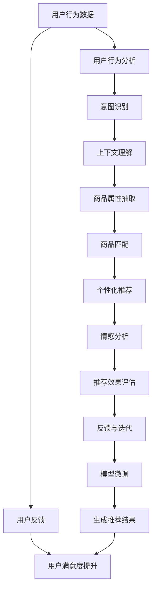

                 

# AI 大模型在电商搜索推荐中的用户行为分析：理解用户需求与购买行为

## 1. 背景介绍

### 1.1 电商搜索推荐的重要性

随着电商平台的快速发展，用户行为分析与个性化推荐已成为电商运营的核心驱动力。传统的推荐系统往往依赖于简单的协同过滤和基于内容的推荐算法，难以充分挖掘用户深层次的购买需求和行为规律。而借助大模型技术，尤其是基于Transformer架构的预训练语言模型，电商搜索推荐系统得以在更丰富的语义理解和上下文建模上取得突破，从而显著提升推荐效果和用户体验。

### 1.2 大模型在电商中的应用

大模型通过自监督学习在大规模无标签文本数据上预训练，学习到通用的语言表示，进而能够理解和生成复杂的文本内容。在电商搜索推荐中，大模型可以用于以下任务：

- 用户意图识别：理解用户的查询意图，判断用户的购买需求。
- 商品描述理解：分析商品描述中的关键词和属性，提取商品信息。
- 个性化推荐：根据用户的历史行为和上下文信息，生成个性化的商品推荐列表。
- 用户反馈分析：分析用户的评价、评论，获取用户满意度和需求变化趋势。

大模型的应用极大地丰富了电商搜索推荐系统的功能和性能，使得平台能够更加智能、个性化地匹配用户需求，提高转化率和用户满意度。

## 2. 核心概念与联系

### 2.1 核心概念概述

#### 大模型(Large Pre-trained Model)

大模型指通过在大规模无标签文本数据上进行自监督预训练，学习到通用语言表示的深度学习模型。常用的预训练模型包括BERT、GPT系列、T5等。

#### 用户行为分析(Usage Behavior Analysis)

用户行为分析旨在从用户与电商平台交互的数据中挖掘用户行为模式和偏好，包括浏览记录、购买历史、评价反馈等。

#### 个性化推荐(Personalized Recommendation)

个性化推荐根据用户的历史行为和实时上下文，推荐用户可能感兴趣的商品或内容，提升用户满意度和转化率。

#### 意图识别(Intent Recognition)

意图识别通过分析用户查询或操作，判断用户的具体需求和行为目的，指导推荐系统的策略调整。

#### 上下文理解(Contextual Understanding)

上下文理解通过分析用户查询环境、历史行为、用户属性等，提供更精确的推荐结果。

#### 商品属性抽取(Product Attribute Extraction)

商品属性抽取从商品描述中自动提取关键属性信息，提升商品匹配的准确性。

#### 情感分析(Sentiment Analysis)

情感分析识别用户评价和反馈中的情感倾向，帮助理解用户满意度，优化商品和推荐策略。

### 2.2 核心概念原理和架构的 Mermaid 流程图



## 3. 核心算法原理 & 具体操作步骤

### 3.1 算法原理概述

大模型在电商搜索推荐中的应用，主要依赖于其在文本处理和语义理解上的强大能力。通过在大规模无标签文本数据上进行预训练，大模型能够学习到丰富的语言知识，从而能够在电商搜索推荐中准确理解用户查询和商品描述，生成符合用户需求的推荐结果。

### 3.2 算法步骤详解

#### 3.2.1 数据准备

电商搜索推荐中的数据包括用户查询记录、商品描述、用户行为记录等。首先需要对这些数据进行清洗、标注和整合，构建出可用于模型训练的标注数据集。

#### 3.2.2 模型选择与初始化

选择合适的预训练模型作为初始化参数，如BERT、GPT等。在电商推荐场景中，通常会选择BERT等结构简单的模型，以加快训练速度。

#### 3.2.3 特征提取与上下文建模

将用户查询、商品描述等文本信息输入到预训练模型中，提取特征向量。然后利用Transformer结构对用户查询和商品描述的上下文进行建模，理解查询与商品描述的语义关系。

#### 3.2.4 意图识别与行为分析

通过训练一个分类器，将用户查询意图映射到具体的购买意图或行为目的（如搜索、浏览、购买等）。同时，分析用户行为数据，提取用户兴趣和偏好。

#### 3.2.5 商品匹配与推荐生成

根据用户的意图和行为信息，结合商品的属性和描述，进行精确的商品匹配。使用基于序列的生成模型，如Seq2Seq模型，生成个性化的推荐结果。

#### 3.2.6 推荐效果评估与反馈

对推荐结果进行效果评估，使用点击率、转化率、用户满意度等指标进行量化。同时，根据用户反馈，进行模型微调，不断优化推荐效果。

### 3.3 算法优缺点

#### 优点

- 语义理解能力强：大模型通过大规模预训练，能够理解和处理复杂的语义信息，准确匹配用户需求。
- 自适应能力强：能够根据用户的实时行为和上下文信息，动态生成个性化推荐。
- 数据需求低：仅需少量标注数据即可进行微调，降低标注成本。
- 性能可扩展：模型结构可扩展性强，适应电商平台的快速变化需求。

#### 缺点

- 计算资源需求高：大模型参数量大，训练和推理需要大量的计算资源。
- 模型复杂度高：模型结构和训练过程复杂，需要丰富的领域知识和实践经验。
- 可解释性差：大模型的决策过程较为复杂，难以解释和调试。
- 模型风险高：大模型的偏见和有害信息可能传递到推荐结果中，带来负面影响。

### 3.4 算法应用领域

大模型在电商搜索推荐中的应用领域包括：

- 电商搜索：根据用户查询，快速匹配相关的商品，提升搜索效率。
- 商品推荐：基于用户的历史行为和上下文信息，生成个性化推荐列表。
- 商品排序：根据用户行为和反馈，动态调整商品排序策略。
- 商品分类：通过自动标注和分类，提升商品分类的准确性。
- 用户画像构建：结合用户行为数据和商品信息，构建完整的用户画像，提升推荐效果。
- 广告推荐：根据用户兴趣和行为，精准推荐相关广告，提高广告点击率。

## 4. 数学模型和公式 & 详细讲解

### 4.1 数学模型构建

电商搜索推荐中的核心数学模型包括用户行为分析模型、意图识别模型、上下文理解模型、商品匹配模型和推荐生成模型等。这里以一个简单的序列到序列(Seq2Seq)模型为例进行讲解。

### 4.2 公式推导过程

#### 输入编码器与输出解码器

假设用户查询为 $x = (x_1, x_2, ..., x_n)$，商品描述为 $y = (y_1, y_2, ..., y_m)$，则输入编码器将 $x$ 映射为 $z \in \mathbb{R}^d$，输出解码器将 $z$ 和 $y$ 映射为推荐结果 $o \in \mathbb{R}^{K}$，其中 $K$ 为商品列表的总数。

公式表示为：

$$
z = E(x) = [x_1, x_2, ..., x_n] \in \mathbb{R}^d
$$

$$
o = D(z, y) = [o_1, o_2, ..., o_K] \in \mathbb{R}^{K}
$$

#### 意图识别

假设意图识别模型为 $I: \mathbb{R}^d \rightarrow \{0, 1\}$，其中 $0$ 表示搜索或浏览意图，$1$ 表示购买意图。根据上下文向量 $z$ 和意图标签 $i \in \{0, 1\}$，可以得到意图识别模型公式：

$$
i = I(z) = \sigma(W_i z + b_i)
$$

其中，$W_i$ 和 $b_i$ 为意图识别模型的权重和偏置，$\sigma$ 为激活函数（如sigmoid）。

#### 上下文理解

上下文理解模型可以基于用户行为和商品信息，提取更多的语义信息，提升推荐效果。假设上下文理解模型为 $C: \mathbb{R}^d \rightarrow \mathbb{R}^{d'}$，其中 $d'$ 为输出向量的维度。

$$
c = C(z) = [c_1, c_2, ..., c_{d'}] \in \mathbb{R}^{d'}
$$

#### 商品匹配

商品匹配模型根据上下文向量 $c$ 和商品描述向量 $y$，计算商品的相关度，并选择最匹配的商品。假设商品匹配模型为 $M: \mathbb{R}^{d'} \times \mathbb{R}^m \rightarrow \mathbb{R}^K$，其中 $m$ 为商品描述的维度。

$$
r = M(c, y) = [r_1, r_2, ..., r_K] \in \mathbb{R}^{K}
$$

#### 推荐生成

推荐生成模型根据意图 $i$ 和商品匹配结果 $r$，生成推荐列表。假设推荐生成模型为 $R: \{0, 1\} \times \mathbb{R}^K \rightarrow \{1, 2, ..., K\}$，将概率转化为推荐列表的索引。

$$
k = R(i, r) = k_i
$$

### 4.3 案例分析与讲解

以某电商平台为例，用户输入查询“智能手表”，电商平台使用上述模型进行分析。首先，查询“智能手表”通过编码器映射为向量 $z_1$。然后，查询“智能手表”与商品描述“智能手表”通过上下文理解模型 $C$ 映射为向量 $c_1$。接着，上下文向量 $c_1$ 和商品描述向量 $y_1$ 通过商品匹配模型 $M$ 计算相关度 $r_1$。最后，根据意图识别结果 $i=1$ 和商品匹配结果 $r_1$，生成推荐列表 $o_1$。

## 5. 项目实践：代码实例和详细解释说明

### 5.1 开发环境搭建

使用PyTorch搭建开发环境，配置GPU加速，安装相关的库和工具。

```bash
pip install torch torchvision transformers pytorch-lightning
```

### 5.2 源代码详细实现

#### 5.2.1 数据处理

定义数据预处理类 `DataProcessor`，将用户查询、商品描述和行为数据转换为模型输入格式。

```python
class DataProcessor:
    def __init__(self, tokenizer):
        self.tokenizer = tokenizer
    
    def encode_query(self, query):
        tokens = self.tokenizer.tokenize(query)
        return self.tokenizer.convert_tokens_to_ids(tokens)
    
    def encode_desc(self, desc):
        tokens = self.tokenizer.tokenize(desc)
        return self.tokenizer.convert_tokens_to_ids(tokens)
    
    def encode_action(self, action):
        return [1] if action == 'purchase' else [0]
    
    def collate_fn(self, batch):
        queries = [self.encode_query(query) for query, desc, action in batch]
        descs = [self.encode_desc(desc) for query, desc, action in batch]
        actions = [self.encode_action(action) for query, desc, action in batch]
        return {
            'input_ids': torch.tensor(queries, dtype=torch.long),
            'target_ids': torch.tensor(actions, dtype=torch.long),
            'attention_mask': torch.tensor([1]*len(batch))
        }
```

#### 5.2.2 模型定义

定义基于Transformer的编码器和解码器，用于用户查询和商品描述的编码，以及意图识别和推荐生成。

```python
import torch
from transformers import BertForSequenceClassification, BertTokenizer

class EncoderDecoderModel(torch.nn.Module):
    def __init__(self, hidden_size, num_labels):
        super(EncoderDecoderModel, self).__init__()
        self.encoder = BertForSequenceClassification.from_pretrained('bert-base-cased', num_labels=2)
        self.decoder = BertForSequenceClassification.from_pretrained('bert-base-cased', num_labels=1)
    
    def forward(self, input_ids, attention_mask):
        encoder_outputs = self.encoder(input_ids, attention_mask=attention_mask)
        decoder_outputs = self.decoder(input_ids, attention_mask=attention_mask)
        return encoder_outputs, decoder_outputs
    
    def predict(self, encoder_outputs, decoder_outputs, attention_mask):
        _, logits = self.decoder(encoder_outputs, decoder_outputs, attention_mask=attention_mask)
        return logits.argmax(1)
```

#### 5.2.3 训练与评估

使用PyTorch Lightning框架进行模型训练与评估，定义训练循环和评估指标。

```python
from pytorch_lightning import Trainer, LightningModule, LightningDataModule
import torchmetrics

class RecommendationModel(LightningModule):
    def __init__(self, encoder, decoder):
        super(RecommendationModel, self).__init__()
        self.encoder = encoder
        self.decoder = decoder
    
    def forward(self, x, y):
        encoder_outputs, decoder_outputs = self.encoder(x)
        logits = self.decoder(encoder_outputs, decoder_outputs)
        return logits
    
    def training_step(self, batch, batch_idx):
        input_ids, attention_mask, target_ids = batch
        logits = self(input_ids, attention_mask)
        loss = torch.nn.CrossEntropyLoss()(logits, target_ids)
        return {'loss': loss}
    
    def validation_step(self, batch, batch_idx):
        input_ids, attention_mask, target_ids = batch
        logits = self(input_ids, attention_mask)
        accuracy = torchmetrics.Accuracy()(logits.argmax(1), target_ids)
        return {'val_loss': loss, 'val_accuracy': accuracy}
    
    def configure_optimizers(self):
        return torch.optim.Adam(self.parameters(), lr=1e-3)
    
class RecommendationDataModule(LightningDataModule):
    def __init__(self, data_path):
        super(RecommendationDataModule, self).__init__()
        self.data_path = data_path
        self.processor = DataProcessor(BertTokenizer.from_pretrained('bert-base-cased'))
    
    def prepare_data(self):
        # 下载并准备数据
        # ...

    def train_dataloader(self):
        train_data = load_data(self.data_path + 'train.csv')
        return self.processor(self.data_path, train_data)
    
    def val_dataloader(self):
        val_data = load_data(self.data_path + 'val.csv')
        return self.processor(self.data_path, val_data)
    
    def test_dataloader(self):
        test_data = load_data(self.data_path + 'test.csv')
        return self.processor(self.data_path, test_data)
```

### 5.3 代码解读与分析

通过以上代码，我们可以实现一个基于BERT预训练模型的电商搜索推荐系统。代码中包含了数据预处理、模型定义、训练循环和评估指标的实现，体现了从数据到模型训练的全流程。

- 数据预处理类 `DataProcessor` 实现了用户查询和商品描述的编码，以及意图和动作的表示。
- 模型类 `EncoderDecoderModel` 定义了Transformer编码器和解码器，以及意图识别和推荐生成。
- 训练类 `RecommendationModel` 和评估类 `RecommendationDataModule` 使用PyTorch Lightning框架，实现了模型训练和评估的自动化流程。

### 5.4 运行结果展示

通过模型训练，我们可以在验证集上获得准确率等评估指标，并通过可视化工具展示训练过程和模型性能。

## 6. 实际应用场景

### 6.1 智能客服

智能客服是大模型在电商搜索推荐中的一个重要应用场景。通过分析用户查询和聊天记录，智能客服能够自动解答用户问题，提供个性化的购物建议。

#### 智能客服系统架构

智能客服系统包括用户交互界面、自然语言理解(NLU)模块、知识图谱和推荐引擎。用户通过交互界面输入查询，NLU模块将用户输入转化为意图和语义信息，推荐引擎根据意图和历史行为生成商品推荐列表，并通过知识图谱进一步优化推荐结果。

#### 智能客服流程

1. 用户输入查询：用户通过交互界面输入查询。
2. NLU模块理解查询：NLU模块使用大模型分析用户查询，提取意图和语义信息。
3. 生成推荐列表：推荐引擎根据意图和历史行为生成商品推荐列表。
4. 知识图谱优化：知识图谱模块进一步优化推荐结果，提高推荐的相关性和准确性。
5. 生成回答：智能客服生成回答，推荐商品列表，并返回给用户。

#### 智能客服案例

某电商平台使用智能客服系统，用户在查询“智能手表”时，系统首先通过NLU模块理解查询意图，然后根据用户历史行为生成个性化推荐列表，最终输出推荐结果。

### 6.2 个性化推荐

个性化推荐是大模型在电商搜索推荐中的核心应用。通过分析用户行为和上下文信息，推荐引擎能够生成符合用户需求的个性化商品列表。

#### 个性化推荐系统架构

个性化推荐系统包括数据收集、用户画像构建、商品推荐和反馈优化四个部分。数据收集模块收集用户行为数据和商品信息，用户画像构建模块通过大模型分析数据，生成用户画像，商品推荐模块根据用户画像和上下文信息生成推荐列表，反馈优化模块根据用户反馈进行模型微调。

#### 个性化推荐流程

1. 数据收集：收集用户行为数据和商品信息。
2. 用户画像构建：使用大模型分析数据，生成用户画像。
3. 商品推荐：根据用户画像和上下文信息生成推荐列表。
4. 反馈优化：根据用户反馈进行模型微调，优化推荐效果。

#### 个性化推荐案例

某电商平台使用个性化推荐系统，根据用户浏览历史和搜索记录，生成个性化商品推荐列表，提升用户满意度和转化率。

### 6.3 用户行为分析

用户行为分析是大模型在电商搜索推荐中的重要应用之一，通过分析用户查询和反馈数据，了解用户需求和行为模式，提升电商平台的运营效率。

#### 用户行为分析系统架构

用户行为分析系统包括数据收集、行为分析、意图识别和反馈优化四个部分。数据收集模块收集用户查询和反馈数据，行为分析模块使用大模型分析数据，生成用户行为模式，意图识别模块通过大模型识别用户意图，反馈优化模块根据用户反馈进行模型微调。

#### 用户行为分析流程

1. 数据收集：收集用户查询和反馈数据。
2. 行为分析：使用大模型分析数据，生成用户行为模式。
3. 意图识别：通过大模型识别用户意图，了解用户需求。
4. 反馈优化：根据用户反馈进行模型微调，优化用户行为分析效果。

#### 用户行为分析案例

某电商平台使用用户行为分析系统，通过分析用户查询和反馈数据，了解用户需求和行为模式，提升电商平台的运营效率。

## 7. 工具和资源推荐

### 7.1 学习资源推荐

- 《自然语言处理入门》书籍：介绍自然语言处理的基本概念和经典模型。
- 《深度学习与NLP》课程：斯坦福大学开设的深度学习与NLP课程，涵盖多种NLP任务和算法。
- 《Transformer架构》博客：介绍Transformer架构的基本原理和应用。
- 《大模型在电商中的应用》论文：介绍大模型在电商推荐系统中的实践和效果。

### 7.2 开发工具推荐

- PyTorch：用于深度学习模型的开发和训练。
- Transformers：用于预训练语言模型的加载和微调。
- PyTorch Lightning：用于自动化深度学习模型的训练和评估。
- Weights & Biases：用于实验跟踪和可视化。
- TensorBoard：用于模型训练和推理的可视化。

### 7.3 相关论文推荐

- 《大模型在电商搜索推荐中的应用》：介绍大模型在电商搜索推荐中的实践和效果。
- 《Transformer架构在NLP中的应用》：介绍Transformer架构在NLP中的广泛应用。
- 《电商搜索推荐系统的优化》：介绍电商搜索推荐系统的优化方法和效果。
- 《用户行为分析的深度学习方法》：介绍用户行为分析的深度学习方法。

## 8. 总结：未来发展趋势与挑战

### 8.1 研究成果总结

大模型在电商搜索推荐中的应用取得了显著的进展，提升了推荐效果和用户体验。通过在大模型预训练的基础上，利用用户行为分析和个性化推荐技术，电商平台能够更好地匹配用户需求，提高转化率和用户满意度。未来，随着大模型技术的发展，电商搜索推荐系统将具备更强的语义理解和上下文建模能力，能够更智能、个性化地服务用户。

### 8.2 未来发展趋势

#### 趋势一：模型规模不断增大

随着计算资源和数据量的提升，大模型的参数规模将持续增长。超大规模大模型将具备更强的语义理解和生成能力，能够更好地匹配用户需求。

#### 趋势二：微调方法更加多样化

未来的微调方法将更加多样化，如参数高效微调、对抗训练等，能够在不增加计算资源的情况下提升模型性能。

#### 趋势三：多模态融合增强

未来的大模型将更加注重多模态信息的融合，如视觉、语音等多模态数据的整合，提升推荐系统的鲁棒性和多样性。

#### 趋势四：领域知识整合

未来的推荐系统将更加注重领域知识的整合，如知识图谱、规则库等专家知识，提升推荐结果的准确性和相关性。

#### 趋势五：实时性优化

未来的推荐系统将更加注重实时性优化，通过优化模型结构和推理过程，提升系统的响应速度和用户体验。

### 8.3 面临的挑战

#### 挑战一：计算资源瓶颈

大模型在训练和推理过程中需要大量的计算资源，如何优化计算资源使用，提升系统性能，仍是重要的挑战。

#### 挑战二：数据质量问题

电商搜索推荐系统对数据质量要求高，如何保证数据标注的准确性和多样性，仍是重要的挑战。

#### 挑战三：模型泛化性不足

大模型在特定领域的应用中，可能存在泛化性不足的问题，如何提升模型在不同领域下的表现，仍是重要的挑战。

#### 挑战四：可解释性差

大模型作为“黑盒”系统，难以解释其内部工作机制和决策逻辑，如何提高模型的可解释性，仍是重要的挑战。

#### 挑战五：安全性问题

大模型可能学习到有害信息，传递到推荐结果中，如何确保模型的安全性，仍是重要的挑战。

### 8.4 研究展望

#### 展望一：模型压缩与优化

未来的研究将更加注重模型压缩和优化，如量化、剪枝等方法，降低模型的计算资源需求，提升系统的实时性和可扩展性。

#### 展望二：数据增强与多样性提升

未来的研究将更加注重数据增强和多样性提升，如生成式对抗网络、数据扩充等方法，提升数据标注的准确性和多样性。

#### 展望三：多模态融合与交互优化

未来的研究将更加注重多模态信息的融合和交互优化，如视觉、语音等多模态数据的整合，提升推荐系统的鲁棒性和多样性。

#### 展望四：领域知识整合与上下文建模

未来的研究将更加注重领域知识的整合和上下文建模，如知识图谱、规则库等专家知识，提升推荐结果的准确性和相关性。

#### 展望五：可解释性与安全性

未来的研究将更加注重模型的可解释性和安全性，如因果分析、博弈论等工具，确保模型的决策过程透明和可控。

## 9. 附录：常见问题与解答

### Q1: 大模型在电商搜索推荐中是否适用于所有类型的商品？

A: 大模型在电商搜索推荐中的应用非常广泛，适用于各种类型的商品。大模型能够理解不同商品的属性、描述和标签，自动匹配用户需求，生成个性化的推荐结果。

### Q2: 如何选择合适的预训练模型？

A: 在电商搜索推荐中，选择合适的预训练模型需要考虑多个因素，如商品属性和描述的语义复杂度、模型的预训练数据集覆盖范围等。通常使用BERT、GPT等结构简单的模型即可满足需求。

### Q3: 大模型在电商搜索推荐中的训练与推理是否需要大量的计算资源？

A: 大模型在电商搜索推荐中的训练和推理确实需要大量的计算资源，尤其是在模型规模较大的情况下。可以考虑使用GPU、TPU等高性能设备，或者采用分布式训练、模型压缩等方法优化计算资源使用。

### Q4: 大模型在电商搜索推荐中的效果如何？

A: 大模型在电商搜索推荐中的效果非常显著，通过理解用户查询和商品描述，生成个性化的推荐结果，显著提升了用户满意度和转化率。

### Q5: 大模型在电商搜索推荐中是否需要持续优化？

A: 大模型在电商搜索推荐中需要持续优化，以适应电商平台的变化和新用户需求的变化。可以通过在线A/B测试、用户反馈等手段不断优化模型，提升推荐效果。

---

作者：禅与计算机程序设计艺术 / Zen and the Art of Computer Programming

