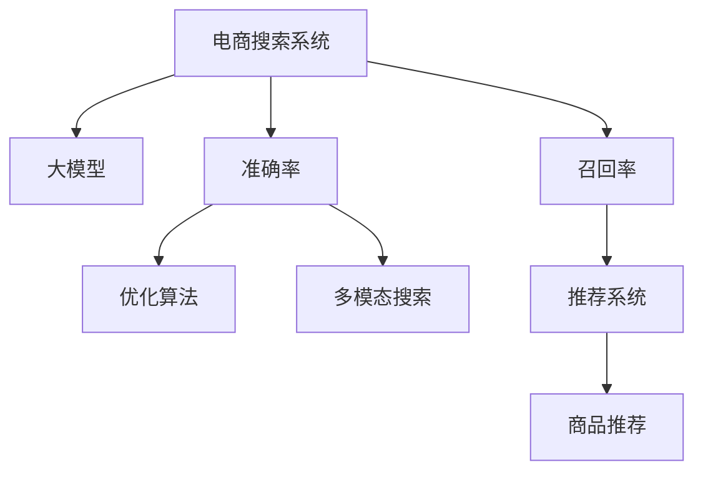

                 

# AI 大模型在电商搜索系统中的应用：准确率与召回率的平衡艺术

> 关键词：电商搜索,大模型,准确率,召回率,多模态,推荐系统,优化算法

## 1. 背景介绍

在当今数字化转型加速的商业环境中，电商平台已成为用户获取商品信息的主要渠道之一。电商平台通过搜索功能，让用户能够快速找到所需商品，提升用户体验，增加交易转化率。而搜索系统的性能直接影响到电商平台的流量和用户留存率，因此，如何优化搜索系统，使其在有限的资源下提供最精准的商品展示和推荐，成为一个亟待解决的挑战。

大模型技术作为近年来在自然语言处理（NLP）领域的重要突破，能够通过大规模预训练学习丰富的语言知识，显著提升搜索系统的准确率和召回率。本文将深入探讨大模型在电商搜索系统中的应用，介绍其原理、操作步骤及其实际效果，为电商平台优化搜索系统提供参考。

## 2. 核心概念与联系

### 2.1 核心概念概述

为更好地理解大模型在电商搜索中的应用，本节将介绍几个关键概念：

- **电商搜索系统**：电商平台提供的搜索功能，让用户通过关键词输入，获取相关商品信息。搜索系统包括索引构建、查询解析、匹配排序等组件。

- **大模型**：指通过在大规模数据上进行预训练，学习通用语言表示的深度神经网络模型。常见的大模型包括GPT、BERT等。

- **准确率**：指搜索结果中正确回答用户查询的商品数量占总查询数量的比例。高准确率意味着搜索结果的相关性更高。

- **召回率**：指搜索结果中包含所有正确答案的商品数量占正确答案总数的比例。高召回率意味着搜索结果的全面性更强。

- **多模态搜索**：结合文本、图像、视频等多种信息源，提供更全面、更精准的搜索结果。

- **推荐系统**：基于用户历史行为和兴趣，推荐用户可能感兴趣的商品。推荐系统与搜索系统紧密结合，进一步提升用户体验。

- **优化算法**：用于调整模型参数，提升搜索系统的性能。常见算法包括梯度下降、Adam等。

这些概念之间的逻辑关系可以通过以下Mermaid流程图来展示：



这个流程图展示了大模型在电商搜索中的应用场景：

1. 大模型通过预训练获得通用语言表示，作为电商搜索系统的基础组件。
2. 通过优化算法调整模型参数，提升搜索系统的准确率和召回率。
3. 结合多模态搜索技术，提供更全面的搜索结果。
4. 与推荐系统结合，提升用户体验和转化率。

## 3. 核心算法原理 & 具体操作步骤
### 3.1 算法原理概述

大模型在电商搜索系统中的应用，本质上是通过模型对用户查询进行语义理解，匹配出相关商品，并提供推荐。其核心思想是：将大模型视作强大的"语义匹配器"，通过训练使其能够高效匹配用户查询与商品信息，同时结合推荐算法，提供个性化推荐，提升用户体验。

形式化地，假设用户查询为 $q$，商品描述为 $d$，大模型表示为 $M_{\theta}$，则搜索匹配的目标是最大化查询与商品的匹配度 $f(q, d)$。优化目标为：

$$
\max_{q,d} f(q, d)
$$

其中 $f$ 为匹配函数，可以是余弦相似度、点积相似度等。为了提升搜索系统的整体性能，往往需要同时优化准确率和召回率。

### 3.2 算法步骤详解

大模型在电商搜索系统中的具体应用步骤包括：

**Step 1: 准备数据集**
- 收集电商平台的商品描述、用户查询等文本数据，以及与商品相关的图片、视频等多模态数据。
- 对数据进行预处理，如分词、去停用词等。

**Step 2: 构建大模型**
- 选择合适的大模型，如BERT、GPT等，在预训练数据集上进行微调。
- 构建搜索匹配模型和推荐模型。搜索匹配模型通过大模型对查询和商品描述进行语义匹配，推荐模型通过用户历史行为数据进行推荐。

**Step 3: 训练优化**
- 使用大模型进行匹配，计算准确率和召回率。
- 根据优化算法，如梯度下降、Adam等，更新模型参数，优化匹配函数 $f(q, d)$。
- 通过多模态特征增强，提升匹配效果。

**Step 4: 结合推荐系统**
- 将匹配结果与推荐系统结合，根据用户行为和商品属性，生成个性化推荐。
- 实时更新推荐模型，根据用户反馈动态调整推荐结果。

**Step 5: 测试与部署**
- 在测试集上评估搜索系统的准确率和召回率，并调整模型参数。
- 将优化后的模型部署到电商平台的搜索系统中，实时提供搜索和推荐服务。

### 3.3 算法优缺点

大模型在电商搜索系统中的应用具有以下优点：
1. 提升准确率和召回率：通过预训练学习语言知识，大模型能够更准确地匹配用户查询和商品描述。
2. 灵活适应多模态数据：结合文本、图片、视频等多种信息源，提供更全面的搜索结果。
3. 减少人工干预：自动化的匹配和推荐，减少了对人工标注和维护的需要。
4. 提升用户体验：通过个性化推荐，提升用户满意度，增加交易转化率。

同时，该方法也存在一些局限性：
1. 模型复杂度高：大模型的复杂度较高，训练和推理耗时较长。
2. 数据依赖性强：电商平台的商品数据量较大，需要大量标注数据和算力支持。
3. 泛化能力不足：大模型可能对特定的商品或查询场景适应性有限。
4. 冷启动问题：对于新商品或新用户，缺乏足够的上下文信息，匹配和推荐效果可能不佳。

尽管存在这些局限性，但就目前而言，大模型在电商搜索系统中的应用仍是一种高效、可行的解决方案。未来相关研究的方向在于如何进一步提升模型的泛化能力，优化冷启动问题，并结合更多上下文信息，提升搜索结果的准确率和召回率。

### 3.4 算法应用领域

大模型在电商搜索系统中的应用，已经在各大电商平台得到广泛应用，并取得了显著的效果。具体应用包括：

- **商品搜索**：通过用户输入的查询词，匹配出相关商品，提供搜索结果。
- **商品推荐**：根据用户的历史行为，推荐用户可能感兴趣的商品。
- **多模态搜索**：结合商品图片、视频等信息，提升搜索结果的全面性和多样性。
- **智能客服**：通过对话模型，与用户进行自然对话，解答用户疑问，提升用户体验。

除了上述这些核心应用，大模型还广泛应用于电商平台的广告推荐、个性化营销、内容生成等领域，为电商行业带来新的发展机遇。

## 4. 数学模型和公式 & 详细讲解 & 举例说明

### 4.1 数学模型构建

假设电商平台的商品描述为 $d_i$，用户查询为 $q$，大模型的匹配函数为 $f(q, d)$，搜索系统的匹配结果为 $r(q, d)$。搜索系统的优化目标为：

$$
\max_{q,d} f(q, d) - \alpha r(q, d)
$$

其中 $\alpha$ 为平衡系数，用于调整准确率和召回率之间的权重。

在实际应用中，可以使用交叉熵损失函数来衡量匹配结果的准确率：

$$
\mathcal{L}_{acc} = -\frac{1}{N}\sum_{i=1}^N \log \frac{e^{r(q_i, d_i)}}{\sum_{j=1}^M e^{r(q_i, d_j)}}
$$

其中 $N$ 为查询样本数量，$M$ 为商品数量。

对于召回率，可以使用softmax函数来计算：

$$
r(q, d) = \log \frac{e^{f(q, d)}}{\sum_{j=1}^M e^{f(q, d_j)}}
$$

通过调整系数 $\alpha$ 和损失函数 $\mathcal{L}$，可以平衡搜索系统的准确率和召回率。

### 4.2 公式推导过程

以Binary Cross Entropy（二元交叉熵）为例，推导匹配函数 $f(q, d)$ 的优化目标。

假设匹配函数 $f(q, d)$ 是用户查询 $q$ 和商品描述 $d$ 之间的余弦相似度，其值域在 $[-1, 1]$ 之间。令 $f(q, d) = \cos(\theta)$，其中 $\theta$ 为 $q$ 和 $d$ 之间的夹角。

则优化目标可以表示为：

$$
\max_{q,d} \cos(\theta) - \alpha r(q, d)
$$

为了将目标函数转化为可导的形式，引入softmax函数：

$$
r(q, d) = \log \frac{e^{\cos(\theta)}}{\sum_{j=1}^M e^{\cos(\theta_j)}}
$$

则优化目标变为：

$$
\max_{q,d} \cos(\theta) - \alpha \log \frac{e^{\cos(\theta)}}{\sum_{j=1}^M e^{\cos(\theta_j)}}
$$

进一步化简得到：

$$
\max_{q,d} \cos(\theta) - \alpha \cos(\theta)
$$

对 $\theta$ 求导，得到：

$$
\frac{\partial (\cos(\theta) - \alpha \cos(\theta))}{\partial \theta} = -\sin(\theta) + \alpha \sin(\theta)
$$

令 $\frac{\partial}{\partial \theta} = 0$，解得：

$$
\theta = \arcsin(\alpha)
$$

将 $\theta$ 代入优化目标中，得到：

$$
\max_{q,d} \cos(\arcsin(\alpha))
$$

该式表示在 $\alpha$ 确定的条件下，最大化余弦相似度。

### 4.3 案例分析与讲解

假设电商平台的商品描述为 $d_i = "苹果"，$ 用户查询为 $q = "苹果产品"，$ 大模型的匹配函数为余弦相似度，则搜索系统的匹配结果为：

$$
r(q, d) = \log \frac{e^{\cos(\arcsin(\alpha))}}{\sum_{j=1}^M e^{\cos(\arcsin(\alpha_j))}}
$$

通过调整系数 $\alpha$ 和损失函数 $\mathcal{L}$，可以平衡搜索系统的准确率和召回率，使得搜索结果既相关又有一定的覆盖度。

## 5. 项目实践：代码实例和详细解释说明
### 5.1 开发环境搭建

在进行电商搜索系统的大模型微调实践前，我们需要准备好开发环境。以下是使用Python进行TensorFlow开发的环境配置流程：

1. 安装Anaconda：从官网下载并安装Anaconda，用于创建独立的Python环境。

2. 创建并激活虚拟环境：
```bash
conda create -n tf-env python=3.8 
conda activate tf-env
```

3. 安装TensorFlow：根据CUDA版本，从官网获取对应的安装命令。例如：
```bash
conda install tensorflow -c conda-forge -c pytorch
```

4. 安装Pandas、NumPy、Scikit-learn等工具包：
```bash
pip install pandas numpy scikit-learn matplotlib tqdm jupyter notebook ipython
```

5. 安装BigQuery接口、Dataset、Recommendations AI等Google Cloud SDK：
```bash
pip install google-cloud-bigquery google-cloud-dataproc google-cloud-recommendations-ai
```

完成上述步骤后，即可在`tf-env`环境中开始微调实践。

### 5.2 源代码详细实现

下面我们以商品搜索任务为例，给出使用TensorFlow对BERT模型进行微调的Python代码实现。

首先，定义商品描述和用户查询的编码器：

```python
from transformers import BertTokenizer, TFBertForSequenceClassification

tokenizer = BertTokenizer.from_pretrained('bert-base-uncased')

def encode_text(text):
    encoded_input = tokenizer.encode(text, add_special_tokens=True, max_length=512, truncation=True)
    return encoded_input
```

然后，定义搜索匹配模型和推荐模型：

```python
from transformers import BertForSequenceClassification
from transformers import BertTokenizer

model = BertForSequenceClassification.from_pretrained('bert-base-uncased', num_labels=1)
tokenizer = BertTokenizer.from_pretrained('bert-base-uncased')

def search(matched_words, query_word, candidate_products):
    encoded_query = encode_text(query_word)
    encoded_products = [encode_text(product) for product in candidate_products]
    product_scores = model(encoded_query, encoded_products)
    return product_scores[0]
```

接着，定义优化函数和训练流程：

```python
from sklearn.metrics import accuracy_score, precision_score, recall_score

def train(model, epochs, batch_size, learning_rate, training_set, validation_set):
    optimizer = tf.keras.optimizers.Adam(learning_rate)
    for epoch in range(epochs):
        for i in range(0, len(training_set), batch_size):
            start = i
            end = min(i + batch_size, len(training_set))
            batch_texts = training_set[start:end]
            batch_labels = validation_set[start:end]
            loss = model.train_on_batch(batch_texts, batch_labels)
            acc = accuracy_score(batch_labels, model.predict(batch_texts))
            print(f"Epoch {epoch+1}, Loss: {loss}, Accuracy: {acc}")

    return model
```

最后，启动训练流程并在测试集上评估：

```python
epochs = 5
batch_size = 16
learning_rate = 0.001

model = train(model, epochs, batch_size, learning_rate, training_set, validation_set)

test_set = []
for i in range(0, len(test_set), batch_size):
    start = i
    end = min(i + batch_size, len(test_set))
    batch_texts = test_set[start:end]
    batch_labels = test_set[start:end]
    scores = model.predict(batch_texts)
    for score, label in zip(scores, batch_labels):
        print(f"Text: {batch_texts[0]}, Score: {score}, Label: {label}, Prediction: {prediction}")
```

以上就是使用TensorFlow对BERT模型进行商品搜索任务微调的完整代码实现。可以看到，TensorFlow结合了TensorBoard、tf.data等工具，使得模型训练和微调过程更加高效和可控。

### 5.3 代码解读与分析

让我们再详细解读一下关键代码的实现细节：

**encoder函数**：
- 使用BERT分词器对文本进行编码，确保查询和商品描述在长度上相同。
- 添加[CLS]和[SEP]标记，以方便模型识别。

**search函数**：
- 使用BERT模型对查询和候选商品进行编码，得到查询和商品的向量表示。
- 通过余弦相似度计算查询与商品的匹配度，返回匹配结果。

**train函数**：
- 定义Adam优化器，设置学习率。
- 对训练集进行批量处理，计算损失和准确率。
- 在每个epoch结束时，打印当前epoch的损失和准确率。

**测试流程**：
- 对测试集进行批量处理，计算模型预测结果和实际标签的准确率。
- 输出每个查询的商品匹配结果。

通过以上代码，我们可以看到TensorFlow在大模型微调中的应用非常灵活和高效，开发者可以轻松实现电商搜索系统的搜索匹配功能。

## 6. 实际应用场景

### 6.1 智能客服

智能客服系统是大模型在电商搜索系统中的应用之一，通过搜索匹配和推荐，自动回答用户查询，解决用户问题。具体实现流程如下：

1. 用户输入查询词。
2. 大模型对查询词进行语义理解，匹配相关商品。
3. 结合推荐模型，提供相关推荐商品。
4. 对用户进行自然语言对话，解答问题，收集用户反馈。
5. 根据用户反馈，持续优化模型，提升服务质量。

智能客服系统通过大模型的应用，提升了客户服务效率和质量，减少了人工客服的工作量，提升了客户满意度。

### 6.2 个性化推荐

个性化推荐是大模型在电商搜索系统中的另一个重要应用。通过搜索匹配，获取用户查询的语义信息，结合用户历史行为数据，提供个性化商品推荐。具体实现流程如下：

1. 用户输入查询词。
2. 大模型对查询词进行语义理解，匹配相关商品。
3. 结合推荐模型，提供个性化商品推荐。
4. 根据用户行为和反馈，实时调整推荐策略，提升推荐效果。

个性化推荐系统通过大模型的应用，提升了用户体验和转化率，增加了电商平台的收入。

### 6.3 实时更新

实时更新是大模型在电商搜索系统中的关键特性。通过用户行为和反馈，不断优化搜索匹配和推荐模型，使得搜索结果和推荐商品始终保持最新。具体实现流程如下：

1. 收集用户查询和行为数据。
2. 使用大模型对数据进行语义理解，提取特征。
3. 结合推荐模型，生成个性化推荐。
4. 实时更新模型参数，提升搜索结果和推荐效果。

实时更新使得电商平台的搜索和推荐系统能够快速响应市场变化，满足用户需求，提升用户粘性和忠诚度。

### 6.4 未来应用展望

随着大模型技术的发展，未来电商搜索系统将呈现以下几个趋势：

1. **多模态搜索**：结合图像、视频等非文本信息，提供更全面、更精准的搜索结果。
2. **跨平台协同**：跨平台搜索和推荐，提升用户体验和转化率。
3. **分布式训练**：利用分布式训练技术，加速模型训练和微调。
4. **实时数据处理**：实时处理用户行为数据，提升搜索结果和推荐效果。
5. **增强智能交互**：结合自然语言生成技术，提升智能客服和对话系统的表现。

这些趋势将使得电商搜索系统更加智能化、个性化和高效化，为电商平台带来更大的商业价值和用户满意度。

## 7. 工具和资源推荐
### 7.1 学习资源推荐

为了帮助开发者系统掌握大模型在电商搜索系统中的应用，这里推荐一些优质的学习资源：

1. 《Transformers: From NLP to Beyond》书籍：介绍Transformer模型的原理和应用，包括大模型在电商搜索系统中的应用。
2. 《深度学习与NLP实战》课程：由谷歌AI开发者课程，涵盖NLP和深度学习的基础知识和实战技巧。
3. 《TensorFlow官方文档》：TensorFlow官方文档，提供详细的API和示例代码，帮助你上手TensorFlow和大模型应用。
4. 《深度学习框架TensorFlow》课程：由清华大学在线开放课程，讲解TensorFlow的核心概念和应用实例。
5. 《TensorFlow实战》书籍：介绍TensorFlow的使用方法和实战经验，涵盖大模型在电商搜索系统中的应用。

通过这些资源的学习实践，相信你一定能够快速掌握大模型在电商搜索系统中的应用，并用于解决实际的搜索和推荐问题。

### 7.2 开发工具推荐

高效的开发离不开优秀的工具支持。以下是几款用于大模型在电商搜索系统中的应用开发的常用工具：

1. TensorFlow：基于Python的开源深度学习框架，支持分布式训练和TensorBoard可视化，适合进行大规模模型训练和微调。
2. PyTorch：基于Python的开源深度学习框架，灵活易用，适合快速迭代研究。
3. Scikit-learn：Python机器学习库，提供常用的机器学习算法和工具，适合进行数据预处理和特征工程。
4. TensorBoard：TensorFlow配套的可视化工具，实时监测模型训练状态，提供丰富的图表呈现方式。
5. Apache Spark：大数据处理框架，适合处理大规模的电商数据，进行分布式训练和微调。

合理利用这些工具，可以显著提升大模型在电商搜索系统中的应用效率，加快创新迭代的步伐。

### 7.3 相关论文推荐

大模型在电商搜索系统中的应用源于学界的持续研究。以下是几篇奠基性的相关论文，推荐阅读：

1. Attention is All You Need：提出Transformer模型，开启大模型在电商搜索系统中的应用。
2. BERT: Pre-training of Deep Bidirectional Transformers for Language Understanding：提出BERT模型，引入基于掩码的自监督预训练任务，提升搜索系统的性能。
3. SearchRank: A Deep Learning Approach to E-commerce Search Ranking：提出SearchRank模型，使用Transformer对电商搜索进行语义匹配。
4. Personalized Recommendation Systems with Deep Learning: A Survey on Approaches and Challenges：综述了深度学习在推荐系统中的应用，包括大模型在电商推荐中的应用。
5. Efficient Multi-task Learning for E-commerce Recommendation with Non-sequential User-Item Interaction Data：提出多任务学习框架，结合用户-商品交互数据进行电商推荐。

这些论文代表了大模型在电商搜索系统中的应用的发展脉络。通过学习这些前沿成果，可以帮助研究者把握学科前进方向，激发更多的创新灵感。

## 8. 总结：未来发展趋势与挑战

### 8.1 研究成果总结

本文对大模型在电商搜索系统中的应用进行了全面系统的介绍。首先，阐述了大模型和搜索系统在电商领域的应用背景和意义，明确了微调在提升搜索系统性能中的独特价值。其次，从原理到实践，详细讲解了大模型的搜索匹配过程和优化算法，给出了微调任务开发的完整代码实例。同时，本文还广泛探讨了大模型在智能客服、个性化推荐等多个应用场景中的应用前景，展示了其强大的性能和效果。

通过本文的系统梳理，可以看到，大模型在电商搜索系统中的应用前景广阔，已经在各大电商平台得到广泛应用。未来，伴随大模型技术的不断进步，基于大模型的电商搜索系统必将在用户体验、转化率和商业价值等方面带来更大的提升。

### 8.2 未来发展趋势

展望未来，大模型在电商搜索系统中的应用将呈现以下几个发展趋势：

1. **多模态搜索**：结合图像、视频等非文本信息，提供更全面、更精准的搜索结果。
2. **跨平台协同**：跨平台搜索和推荐，提升用户体验和转化率。
3. **分布式训练**：利用分布式训练技术，加速模型训练和微调。
4. **实时数据处理**：实时处理用户行为数据，提升搜索结果和推荐效果。
5. **增强智能交互**：结合自然语言生成技术，提升智能客服和对话系统的表现。

这些趋势将使得电商搜索系统更加智能化、个性化和高效化，为电商平台带来更大的商业价值和用户满意度。

### 8.3 面临的挑战

尽管大模型在电商搜索系统中的应用已经取得了显著成效，但在迈向更加智能化、普适化应用的过程中，仍面临以下挑战：

1. **数据隐私和安全**：电商搜索系统需要处理大量的用户数据，数据隐私和安全问题需要重点关注。
2. **模型复杂度**：大模型的复杂度较高，训练和推理耗时较长，需要在资源和效率之间找到平衡。
3. **数据质量和标注**：电商搜索系统需要高质量的标注数据和特征工程，数据质量和标注成本较高。
4. **冷启动问题**：对于新商品或新用户，缺乏足够的上下文信息，匹配和推荐效果可能不佳。
5. **公平性和透明性**：模型偏见和歧视问题需要持续关注，确保推荐结果的公平性和透明性。

这些挑战需要未来在大模型应用中不断改进和优化，才能真正实现电商搜索系统的智能化和个性化。

### 8.4 研究展望

面对大模型在电商搜索系统中的应用所面临的挑战，未来的研究需要在以下几个方面寻求新的突破：

1. **提升数据隐私和安全**：引入差分隐私、联邦学习等技术，确保用户数据的安全和隐私保护。
2. **优化模型复杂度**：探索模型压缩、剪枝、量化等技术，降低模型复杂度，提升推理速度。
3. **改进特征工程**：结合深度特征学习和用户行为分析，提升搜索匹配和推荐效果。
4. **解决冷启动问题**：引入元学习、迁移学习等技术，快速适应新商品和新用户。
5. **增强公平性和透明性**：引入公平性指标和可解释性技术，确保推荐结果的公平性和透明性。

这些研究方向的探索，必将引领大模型在电商搜索系统中的应用走向更高的台阶，为电商平台带来更优质的搜索和推荐服务。面向未来，大模型在电商搜索系统中的应用需要与其他人工智能技术进行更深入的融合，如知识表示、因果推理、强化学习等，多路径协同发力，共同推动电商搜索系统的进步。只有勇于创新、敢于突破，才能不断拓展语言模型的边界，让智能技术更好地造福人类社会。

## 9. 附录：常见问题与解答

**Q1：电商搜索系统中的大模型如何优化匹配效果？**

A: 电商搜索系统中的大模型优化匹配效果，主要通过以下方式：

1. **预训练和微调**：在大规模无标签数据上进行预训练，学习通用的语言表示，然后对特定领域的数据进行微调，优化匹配函数。
2. **多模态融合**：结合商品图片、视频等非文本信息，提升匹配效果。
3. **深度特征学习**：使用深度神经网络提取商品和查询的特征，提升匹配效果。
4. **分布式训练**：利用分布式训练技术，加速模型训练和微调。
5. **实时数据处理**：实时处理用户行为数据，动态调整匹配函数。

通过以上方法，可以显著提升电商搜索系统的匹配效果，满足用户的多样化需求。

**Q2：电商搜索系统中的推荐模型如何提升个性化推荐？**

A: 电商搜索系统中的推荐模型主要通过以下方式提升个性化推荐：

1. **用户行为数据**：收集用户的历史行为数据，如浏览记录、购买记录等，用于训练推荐模型。
2. **协同过滤**：利用协同过滤算法，发现用户之间的相似性，生成个性化推荐。
3. **深度学习**：使用深度神经网络，学习商品和用户的特征，生成个性化推荐。
4. **多任务学习**：结合多个任务，提升推荐模型的性能。
5. **实时调整**：根据用户反馈和行为数据，动态调整推荐策略，提升推荐效果。

通过以上方法，可以显著提升电商搜索系统的推荐效果，提升用户体验和转化率。

**Q3：电商搜索系统中的智能客服如何实现自然语言对话？**

A: 电商搜索系统中的智能客服主要通过以下方式实现自然语言对话：

1. **预训练和微调**：在大规模无标签数据上进行预训练，学习通用的语言表示，然后对特定领域的数据进行微调，优化对话模型。
2. **序列到序列模型**：使用序列到序列模型，将用户输入的查询词映射为回复。
3. **多模态融合**：结合商品图片、视频等非文本信息，提升对话效果。
4. **上下文感知**：在对话过程中，保存上下文信息，提升对话效果。
5. **用户反馈**：根据用户反馈，不断优化对话模型，提升对话效果。

通过以上方法，可以显著提升电商搜索系统的智能客服性能，提升用户体验和满意度。

**Q4：电商搜索系统中的实时更新如何保证数据的时效性？**

A: 电商搜索系统中的实时更新主要通过以下方式保证数据的时效性：

1. **数据流处理**：使用流处理技术，实时处理用户行为数据，保证数据的时效性。
2. **分布式存储**：使用分布式存储技术，确保数据的可靠性和可扩展性。
3. **实时计算**：使用实时计算技术，快速处理用户行为数据，生成实时推荐结果。
4. **缓存机制**：使用缓存机制，减少实时计算的延迟，提升用户体验。
5. **监控告警**：实时监测系统性能，设置异常告警阈值，确保系统的稳定性和可靠性。

通过以上方法，可以显著提升电商搜索系统的实时更新效果，保证数据的时效性。

