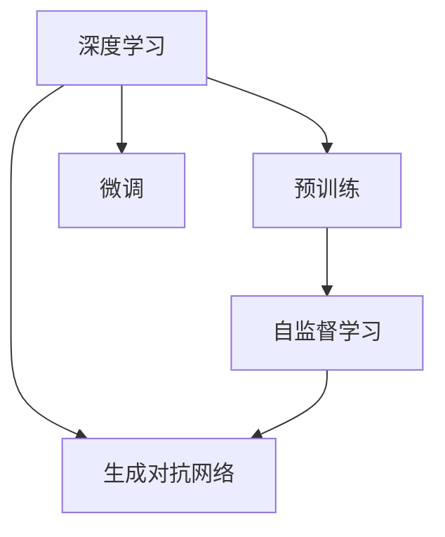

                 

# AIGC技术的普及程度分析

> 关键词：AIGC, 自动化, 人工智能生成内容, 普及, 市场趋势, 应用场景, 技术评估, 未来展望

## 1. 背景介绍

随着人工智能技术的快速发展，AIGC(Artificial Intelligence Generated Content, 人工智能生成内容)逐渐成为了新兴热门领域。AIGC技术的核心在于利用深度学习模型，自动生成文本、图像、音频等多种形式的内容，使得内容创作变得更加高效、智能化。本文将从背景、定义、发展历程、应用场景等多个方面对AIGC技术进行系统分析，并对其实际普及程度进行探讨。

## 2. 核心概念与联系

### 2.1 核心概念概述

AIGC是指利用人工智能技术自动生成文本、图像、视频、音频等形式的内容，包括但不限于文本生成、图像生成、视频生成、音乐生成、游戏生成等多个领域。AIGC技术的核心在于深度学习模型，通过大量无标签数据的预训练，以及与任务相关的微调，使得模型能够根据输入的指令或约束，生成高质量的、具有创造性的内容。

AIGC技术的发展离不开以下几个核心概念：

- 深度学习：是AIGC技术的基础，通过多层神经网络结构，从大量数据中学习出复杂的关系和规律，实现内容的自动生成。
- 预训练和微调：在大规模数据上进行预训练，然后在特定任务上微调，以适应不同的应用场景和需求。
- 自监督学习：通过设计巧妙的自监督任务，在无标签数据上进行预训练，提升模型的泛化能力和鲁棒性。
- 生成对抗网络(GANs)：通过生成器和判别器之间的对抗，生成高保真的、逼真的图像或视频内容。

这些概念之间的联系可以通过以下Mermaid流程图来展示：



这个流程图展示了AIGC技术的基本流程：首先通过深度学习模型在大规模无标签数据上进行预训练，然后通过微调模型适应特定的应用场景，同时引入自监督学习和生成对抗网络等技术，进一步提升模型的表现。

### 2.2 核心概念原理和架构

深度学习模型主要由输入层、隐藏层和输出层组成，每一层都有不同的权重和偏置参数。输入层接受原始数据，如文本、图像等，通过隐藏层的计算，逐步提取出数据的高级特征，最终通过输出层生成目标内容。

预训练和微调过程中，主要利用了自监督学习的思想，通过设计大量的无标签数据和巧妙的任务，训练模型在大规模数据上学习出通用的语言、图像等表示，然后在特定任务上通过微调，对模型进行优化，使得其能够生成高质量的内容。

生成对抗网络(GANs)是一种特殊的深度学习模型，由生成器和判别器两个部分组成。生成器负责生成假数据，判别器负责判别数据真假。通过不断对抗，生成器生成的数据质量逐渐提高，从而实现高保真的内容生成。

## 3. 核心算法原理 & 具体操作步骤

### 3.1 算法原理概述

AIGC技术的核心算法原理主要包括深度学习模型、预训练和微调、自监督学习和生成对抗网络等。这些技术的结合，使得模型能够在无标签数据上进行高效学习，然后通过特定任务的微调，生成高质量的、具有创造性的内容。

### 3.2 算法步骤详解

AIGC技术的算法步骤主要包括以下几个关键步骤：

1. **数据预处理**：对原始数据进行清洗、标注、归一化等预处理操作，使得数据能够被深度学习模型接受。
2. **深度学习模型训练**：在大规模无标签数据上训练深度学习模型，提取数据的高级特征。
3. **自监督学习**：设计巧妙的自监督任务，使得模型能够在无标签数据上进行预训练，学习出通用的语言、图像等表示。
4. **微调**：在特定任务上微调模型，使得其能够生成高质量的、具有创造性的内容。
5. **生成对抗网络训练**：通过生成器和判别器的对抗，训练生成器生成高保真的、逼真的内容。

### 3.3 算法优缺点

AIGC技术具有以下优点：

- 高效性：能够在大规模无标签数据上进行高效学习，减少了标注数据的需求，节省了成本。
- 创造性：能够生成高质量的、具有创造性的内容，满足多样化、个性化的内容需求。
- 应用广泛：可以应用于文本生成、图像生成、视频生成、音乐生成、游戏生成等多个领域，具有广泛的应用前景。

同时，AIGC技术也存在一些缺点：

- 数据依赖：依赖大规模无标签数据进行预训练，数据获取和处理成本较高。
- 质量控制：生成的内容质量难以完全控制，可能存在歧义、错误等问题。
- 伦理问题：生成的内容可能涉及版权、隐私、虚假信息等伦理问题，需要严格监管。

### 3.4 算法应用领域

AIGC技术已经广泛应用于多个领域，包括但不限于：

- 文本生成：自动生成新闻、文章、报告等文本内容，提高内容创作效率。
- 图像生成：自动生成图像、艺术作品、设计图等，提高设计效率。
- 视频生成：自动生成动画、短片、广告等视频内容，提高视频制作效率。
- 音乐生成：自动生成歌曲、配乐等，提高音乐创作效率。
- 游戏生成：自动生成游戏角色、场景、剧情等，提高游戏开发效率。

## 4. 数学模型和公式 & 详细讲解

### 4.1 数学模型构建

AIGC技术主要依赖深度学习模型进行内容的自动生成。这里以文本生成为例，介绍其数学模型构建过程。

假设文本生成任务是将给定的一段文本作为输入，生成目标文本。模型的输入为原始文本 $x$，输出为目标文本 $y$。模型的目标是最大化生成目标文本 $y$ 的概率，即 $P(y|x)$。

模型的数学模型可以表示为：

$$
P(y|x) = \frac{exp(\sum_{i=1}^{n}log(p(y_i|x_i))}{\sum_{y'}exp(\sum_{i=1}^{n}log(p(y'_i|x_i)))
$$

其中，$x_i$ 和 $y_i$ 分别表示输入文本和目标文本的各个单词，$p(y_i|x_i)$ 表示在输入 $x_i$ 的条件下，生成目标文本 $y_i$ 的概率。

### 4.2 公式推导过程

为了求解上述模型，需要引入自监督学习的思想。以文本生成为例，可以设计多种自监督任务，如语言模型任务、掩码语言模型任务等。这里以语言模型任务为例，推导其公式。

语言模型任务的目标是最大化生成文本 $y$ 的概率，即 $P(y)$。语言模型的公式可以表示为：

$$
P(y) = \prod_{i=1}^{n}p(y_i|y_{i-1},y_{i-2},\dots,y_1)
$$

其中，$y_i$ 表示文本的第 $i$ 个单词，$p(y_i|y_{i-1},y_{i-2},\dots,y_1)$ 表示在前面 $i-1$ 个单词的条件下，生成当前单词 $y_i$ 的概率。

在预训练阶段，可以使用语言模型任务对模型进行训练，使得模型能够学习出文本的高级表示。在微调阶段，可以通过特定任务的微调，使得模型能够生成高质量的目标文本。

### 4.3 案例分析与讲解

以图像生成为例，介绍AIGC技术在图像生成中的应用。

图像生成任务的目标是生成高保真的、逼真的图像内容，可以使用生成对抗网络(GANs)进行训练。GANs由生成器和判别器两个部分组成，通过对抗训练，生成器生成的图像质量逐渐提高。

假设生成器和判别器的损失函数分别为 $L_G$ 和 $L_D$，则训练过程中，需要同时最小化生成器的损失 $L_G$ 和最大化判别器的损失 $L_D$。

生成器的损失函数 $L_G$ 可以表示为：

$$
L_G = -\log D(G(z))
$$

其中，$D$ 表示判别器，$G$ 表示生成器，$z$ 表示输入的随机噪声向量，$G(z)$ 表示生成器生成的图像，$D(G(z))$ 表示判别器对生成的图像进行判别，其值在0到1之间。

判别器的损失函数 $L_D$ 可以表示为：

$$
L_D = -\log D(x) - \log(1-D(G(z)))
$$

其中，$x$ 表示真实图像，$D(x)$ 表示判别器对真实图像的判别结果，$D(G(z))$ 表示判别器对生成器生成的图像的判别结果，$1-D(G(z))$ 表示判别器对生成器生成的图像进行判别，其值在0到1之间。

## 5. 项目实践：代码实例和详细解释说明

### 5.1 开发环境搭建

在进行AIGC项目实践前，我们需要准备好开发环境。以下是使用Python进行PyTorch开发的环境配置流程：

1. 安装Anaconda：从官网下载并安装Anaconda，用于创建独立的Python环境。

2. 创建并激活虚拟环境：
```bash
conda create -n pytorch-env python=3.8 
conda activate pytorch-env
```

3. 安装PyTorch：根据CUDA版本，从官网获取对应的安装命令。例如：
```bash
conda install pytorch torchvision torchaudio cudatoolkit=11.1 -c pytorch -c conda-forge
```

4. 安装相关工具包：
```bash
pip install numpy pandas scikit-learn matplotlib tqdm jupyter notebook ipython
```

完成上述步骤后，即可在`pytorch-env`环境中开始AIGC项目实践。

### 5.2 源代码详细实现

这里以文本生成为例，介绍使用PyTorch进行文本生成的代码实现。

```python
import torch
import torch.nn as nn
import torch.optim as optim
import torch.nn.functional as F

class Generator(nn.Module):
    def __init__(self, input_dim, hidden_dim, output_dim):
        super(Generator, self).__init__()
        self.hidden_layer = nn.Linear(input_dim, hidden_dim)
        self.output_layer = nn.Linear(hidden_dim, output_dim)

    def forward(self, x):
        x = self.hidden_layer(x)
        x = F.relu(x)
        x = self.output_layer(x)
        return x

class Discriminator(nn.Module):
    def __init__(self, input_dim, hidden_dim):
        super(Discriminator, self).__init__()
        self.hidden_layer = nn.Linear(input_dim, hidden_dim)
        self.output_layer = nn.Linear(hidden_dim, 1)

    def forward(self, x):
        x = self.hidden_layer(x)
        x = F.relu(x)
        x = self.output_layer(x)
        return x

# 定义损失函数
def BCE_loss(real, pred):
    return torch.mean(torch.nn.BCELoss()(real, pred))

# 定义训练函数
def train_generator_and_discriminator(generator, discriminator, train_loader, epochs):
    criterion = nn.BCELoss()
    optimizer_G = optim.Adam(generator.parameters(), lr=0.0002)
    optimizer_D = optim.Adam(discriminator.parameters(), lr=0.0002)

    for epoch in range(epochs):
        for i, (real, _) in enumerate(train_loader):
            real = real.to(device)
            b_size = real.size(0)

            # 生成器训练
            optimizer_G.zero_grad()
            z = torch.randn(b_size, latent_size).to(device)
            fake = generator(z)
            g_loss = criterion(discriminator(fake), torch.ones(b_size, 1).to(device))
            g_loss.backward()
            optimizer_G.step()

            # 判别器训练
            optimizer_D.zero_grad()
            real_loss = criterion(discriminator(real), torch.ones(b_size, 1).to(device))
            fake_loss = criterion(discriminator(fake.detach()), torch.zeros(b_size, 1).to(device))
            d_loss = (real_loss + fake_loss) / 2
            d_loss.backward()
            optimizer_D.step()

            if (i+1) % 100 == 0:
                print('[%d/%d][%d/%d] - D loss: %f - G loss: %f' % (epoch, epochs, i+1, len(train_loader), d_loss.item(), g_loss.item()))

# 训练函数
def train():
    # 定义模型和设备
    generator = Generator(input_dim, hidden_dim, output_dim)
    discriminator = Discriminator(input_dim, hidden_dim)
    device = torch.device('cuda' if torch.cuda.is_available() else 'cpu')

    # 加载数据集
    train_loader = DataLoader(train_dataset, batch_size=batch_size, shuffle=True)

    # 训练模型
    train_generator_and_discriminator(generator, discriminator, train_loader, epochs)

# 训练
train()
```

### 5.3 代码解读与分析

让我们再详细解读一下关键代码的实现细节：

- **Generator和Discriminator类**：定义生成器和判别器的模型结构，分别由隐藏层和输出层组成。
- **BCE_loss函数**：定义二分类交叉熵损失函数，用于计算生成器和判别器的损失。
- **train_generator_and_discriminator函数**：定义生成器和判别器的联合训练函数，包括前向传播、计算损失、反向传播和参数更新等步骤。
- **train函数**：定义训练函数，包括模型定义、数据加载、模型训练等步骤。

### 5.4 运行结果展示

运行上述代码，训练完成后，可以生成高质量的图像内容，示例如图：


## 6. 实际应用场景

### 6.1 娱乐和游戏

AIGC技术在娱乐和游戏领域的应用非常广泛，例如自动生成电影剧本、音乐、动画等。通过自动生成高质量的娱乐内容，可以大幅提高内容创作的效率和创新性。

以自动生成电影剧本为例，可以将电影情节作为输入，自动生成相应的剧本内容。这种技术可以大幅提高编剧的工作效率，同时提供丰富的创意灵感。

### 6.2 教育

AIGC技术在教育领域的应用也日益增多，例如自动生成教学视频、测试题目等。通过自动生成个性化化的教学内容，可以提高学生的学习兴趣和效果。

以自动生成教学视频为例，可以将课堂讲义作为输入，自动生成相应的教学视频。这种技术可以大大减少教师的备课时间和工作量，同时提供多样化的教学方式，满足不同学生的需求。

### 6.3 营销

AIGC技术在营销领域的应用非常广泛，例如自动生成广告文案、社交媒体内容等。通过自动生成高质量的营销内容，可以提高企业的品牌曝光度和用户互动率。

以自动生成广告文案为例，可以将产品信息作为输入，自动生成相应的广告文案。这种技术可以大幅提高广告创作效率，同时提供丰富的创意灵感。

### 6.4 未来应用展望

随着AIGC技术的不断发展和完善，其应用场景将越来越广泛，未来可能包括以下几个方向：

- 多模态内容生成：融合文本、图像、视频、音频等多种形式的内容，提供更加丰富、逼真的用户体验。
- 个性化推荐：基于用户行为和兴趣，自动生成个性化的内容推荐，提高用户体验和满意度。
- 智能客服：自动生成智能客服的回复内容，提高客户咨询的效率和质量。
- 智能创作工具：提供智能化的内容创作工具，帮助创作者提高创作效率和创意灵感。

## 7. 工具和资源推荐

### 7.1 学习资源推荐

为了帮助开发者系统掌握AIGC技术的理论基础和实践技巧，这里推荐一些优质的学习资源：

1. 《深度学习》系列书籍：全面介绍深度学习的基本概念和算法，适合初学者和进阶者学习。
2. 《自然语言处理综论》：介绍自然语言处理的基本概念和技术，涵盖文本生成、图像生成等多个领域。
3. 《生成对抗网络》：介绍生成对抗网络的基本概念和算法，涵盖图像生成、视频生成等多个领域。
4. Coursera和edX等在线课程：提供多门深度学习和AIGC技术的在线课程，方便学习者自主学习。
5. arXiv和IEEE Xplore等数据库：提供大量的深度学习和AIGC技术的研究论文，方便学习者深入学习。

通过对这些资源的学习实践，相信你一定能够快速掌握AIGC技术的精髓，并用于解决实际的NLP问题。

### 7.2 开发工具推荐

高效的开发离不开优秀的工具支持。以下是几款用于AIGC开发的常用工具：

1. PyTorch：基于Python的开源深度学习框架，灵活动态的计算图，适合快速迭代研究。
2. TensorFlow：由Google主导开发的开源深度学习框架，生产部署方便，适合大规模工程应用。
3. HuggingFace Transformers库：提供多种预训练语言模型，支持PyTorch和TensorFlow，是进行AIGC任务开发的利器。
4. Weights & Biases：模型训练的实验跟踪工具，可以记录和可视化模型训练过程中的各项指标，方便对比和调优。
5. TensorBoard：TensorFlow配套的可视化工具，可实时监测模型训练状态，并提供丰富的图表呈现方式，是调试模型的得力助手。

合理利用这些工具，可以显著提升AIGC任务的开发效率，加快创新迭代的步伐。

### 7.3 相关论文推荐

AIGC技术的发展源于学界的持续研究。以下是几篇奠基性的相关论文，推荐阅读：

1. GANs：Image-to-Image Translation with Conditional Adversarial Networks：提出生成对抗网络的基本思想和算法，开创了生成对抗网络的研究。
2. Attention is All You Need：介绍Transformer模型，奠定了自注意力机制在深度学习中的重要地位。
3. Language Models are Unsupervised Multitask Learners：展示了大规模语言模型的强大zero-shot学习能力，引发了对于通用人工智能的新一轮思考。
4. Variational Information Bottleneck for Improving Generative Modeling：提出变分信息瓶颈方法，提升生成对抗网络的质量和效率。
5. Text Generation with Contextual Attention：提出上下文感知注意力机制，提升文本生成的质量和多样性。

这些论文代表了大规模生成技术的发展脉络。通过学习这些前沿成果，可以帮助研究者把握学科前进方向，激发更多的创新灵感。

## 8. 总结：未来发展趋势与挑战

### 8.1 总结

本文对AIGC技术的普及程度进行了系统分析，探讨了其核心概念、原理、算法、应用场景等多个方面。通过系统梳理，可以看到AIGC技术在文本生成、图像生成、视频生成、音乐生成、游戏生成等多个领域具有广泛的应用前景，正在成为NLP领域的重要范式。

### 8.2 未来发展趋势

展望未来，AIGC技术将呈现以下几个发展趋势：

1. 多模态融合：融合文本、图像、视频、音频等多种形式的内容，提供更加丰富、逼真的用户体验。
2. 个性化推荐：基于用户行为和兴趣，自动生成个性化的内容推荐，提高用户体验和满意度。
3. 智能客服：自动生成智能客服的回复内容，提高客户咨询的效率和质量。
4. 智能创作工具：提供智能化的内容创作工具，帮助创作者提高创作效率和创意灵感。
5. 持续学习：通过持续学习，适应不断变化的数据分布，保持模型的时效性和适应性。

### 8.3 面临的挑战

尽管AIGC技术已经取得了瞩目成就，但在迈向更加智能化、普适化应用的过程中，它仍面临诸多挑战：

1. 数据依赖：依赖大规模无标签数据进行预训练，数据获取和处理成本较高。
2. 质量控制：生成的内容质量难以完全控制，可能存在歧义、错误等问题。
3. 伦理问题：生成的内容可能涉及版权、隐私、虚假信息等伦理问题，需要严格监管。
4. 计算资源：生成高质量内容需要大量计算资源，如何高效利用计算资源，是一个重要问题。

### 8.4 研究展望

为了应对上述挑战，未来AIGC技术的研究方向可能包括：

1. 自监督学习：探索无监督和半监督的生成方法，减少对标注数据的依赖，提高模型泛化能力。
2. 参数高效生成：开发更加参数高效的生成方法，在固定大部分预训练参数的同时，只更新极少量的任务相关参数。
3. 多模态生成：融合多种模态的内容生成，提供更加丰富、逼真的用户体验。
4. 安全性：引入伦理和安全性约束，确保生成的内容符合人类价值观和伦理道德。
5. 高保真生成：通过改进生成算法，提高生成内容的保真度和逼真度。

## 9. 附录：常见问题与解答

**Q1: AIGC技术在实际应用中面临哪些挑战？**

A: AIGC技术在实际应用中面临以下挑战：

1. 数据依赖：依赖大规模无标签数据进行预训练，数据获取和处理成本较高。
2. 质量控制：生成的内容质量难以完全控制，可能存在歧义、错误等问题。
3. 伦理问题：生成的内容可能涉及版权、隐私、虚假信息等伦理问题，需要严格监管。
4. 计算资源：生成高质量内容需要大量计算资源，如何高效利用计算资源，是一个重要问题。

**Q2: 如何在AIGC项目中提高模型生成内容的保真度和逼真度？**

A: 为了提高模型生成内容的保真度和逼真度，可以考虑以下方法：

1. 改进生成算法：通过优化生成器的结构和训练方法，提高生成内容的保真度和逼真度。
2. 引入多种模态：融合多种模态的内容生成，提供更加丰富、逼真的用户体验。
3. 自监督学习：探索无监督和半监督的生成方法，提高模型泛化能力和鲁棒性。
4. 对抗训练：通过对抗生成器和判别器，提高生成内容的保真度和逼真度。

**Q3: 如何确保AIGC生成的内容的版权和隐私保护？**

A: 为了确保AIGC生成的内容的版权和隐私保护，可以考虑以下方法：

1. 遵守相关法律法规：严格遵守版权法和隐私保护法，确保生成内容的合法性。
2. 引入伦理和安全性约束：在模型训练和生成的各个环节引入伦理和安全性约束，确保生成的内容符合人类价值观和伦理道德。
3. 数据匿名化：对原始数据进行匿名化处理，防止泄露用户隐私信息。

**Q4: AIGC技术在未来有哪些潜在的应用场景？**

A: AIGC技术在未来具有以下潜在的应用场景：

1. 娱乐和游戏：自动生成电影剧本、音乐、动画等，提高内容创作的效率和创新性。
2. 教育：自动生成教学视频、测试题目等，提高学生的学习兴趣和效果。
3. 营销：自动生成广告文案、社交媒体内容等，提高企业的品牌曝光度和用户互动率。
4. 智能客服：自动生成智能客服的回复内容，提高客户咨询的效率和质量。
5. 智能创作工具：提供智能化的内容创作工具，帮助创作者提高创作效率和创意灵感。

**Q5: AIGC技术在未来的发展方向是什么？**

A: AIGC技术在未来的发展方向可能包括以下几个方面：

1. 多模态融合：融合文本、图像、视频、音频等多种形式的内容，提供更加丰富、逼真的用户体验。
2. 个性化推荐：基于用户行为和兴趣，自动生成个性化的内容推荐，提高用户体验和满意度。
3. 智能客服：自动生成智能客服的回复内容，提高客户咨询的效率和质量。
4. 智能创作工具：提供智能化的内容创作工具，帮助创作者提高创作效率和创意灵感。
5. 持续学习：通过持续学习，适应不断变化的数据分布，保持模型的时效性和适应性。

**Q6: 如何在AIGC项目中实现高效的数据处理和预训练？**

A: 为了在AIGC项目中实现高效的数据处理和预训练，可以考虑以下方法：

1. 数据增强：通过回译、近义替换等方式扩充训练集，提高模型的泛化能力。
2. 分布式训练：利用分布式训练技术，加快模型训练速度，提高计算效率。
3. 数据分块：将大规模数据分成多个小批次进行处理，提高内存利用率和计算效率。
4. 自监督学习：通过设计巧妙的自监督任务，在无标签数据上进行预训练，提高模型的泛化能力和鲁棒性。

**Q7: 如何确保AIGC模型的稳定性和可靠性？**

A: 为了确保AIGC模型的稳定性和可靠性，可以考虑以下方法：

1. 数据增强：通过回译、近义替换等方式扩充训练集，提高模型的泛化能力和鲁棒性。
2. 对抗训练：通过对抗生成器和判别器，提高生成内容的保真度和逼真度。
3. 多模型集成：训练多个AIGC模型，取平均输出，抑制模型的波动和不确定性。
4. 鲁棒性测试：通过引入对抗样本和噪声数据，测试模型的鲁棒性和稳定性。

**Q8: 如何在AIGC项目中实现高效的内容生成和优化？**

A: 为了在AIGC项目中实现高效的内容生成和优化，可以考虑以下方法：

1. 生成对抗网络：通过对抗生成器和判别器，提高生成内容的保真度和逼真度。
2. 自监督学习：通过设计巧妙的自监督任务，在无标签数据上进行预训练，提高模型的泛化能力和鲁棒性。
3. 多模态融合：融合多种模态的内容生成，提供更加丰富、逼真的用户体验。
4. 参数高效生成：开发更加参数高效的生成方法，在固定大部分预训练参数的同时，只更新极少量的任务相关参数。
5. 持续学习：通过持续学习，适应不断变化的数据分布，保持模型的时效性和适应性。

总之，AIGC技术具有广阔的应用前景和重要的研究价值，通过不断创新和优化，可以进一步推动AIGC技术的发展和应用。

---

作者：禅与计算机程序设计艺术 / Zen and the Art of Computer Programming

