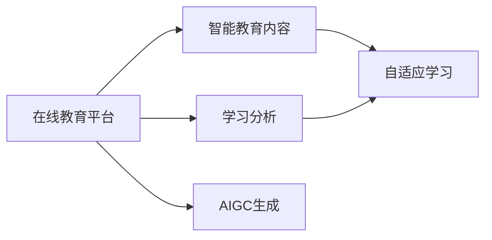

                 

# AIGC重塑在线教育行业

## 1. 背景介绍

在线教育作为数字时代的重要组成部分，近年来随着互联网的普及和技术的进步，迅速发展成为教育行业的新趋势。传统的“面对面”教学模式逐渐被更加灵活、自由、互动的在线教育所取代，其成本效益和灵活性吸引了越来越多的学生和教育机构的关注。根据Statista的数据显示，2022年全球在线教育市场规模预计将达到3340亿美元，且将以14.3%的复合年增长率增长。

然而，在线教育的痛点也同样明显。教育内容的制作、存储和分发成本高，且教学互动性差、个性化程度低，难以激发学生的学习兴趣和积极性。为此，随着人工智能生成内容(AIGC)技术的崛起，在线教育行业迎来了新的变革。

## 2. 核心概念与联系

### 2.1 核心概念概述

为了更好地理解AIGC技术如何重塑在线教育，本节将介绍几个核心概念及其相互关系：

- **人工智能生成内容(AIGC)**：指的是通过人工智能技术生成文本、音频、视频等多模态内容。AIGC技术涵盖了深度学习、自然语言处理、计算机视觉等多个领域的最新进展，代表了一种全新的内容生成方式。

- **在线教育平台**：包括MOOC（大规模开放在线课程）、SPOC（小型私有在线课程）、edX、Coursera、Udacity等多种形态。在线教育平台为用户提供优质的教学资源和互动环境，是教育内容的重要载体。

- **智能教育内容**：通过AIGC技术生成的教育内容，如个性化教学材料、互动式练习题、自动评估系统等，能够提升教学内容的个性化程度和互动性。

- **学习分析和自适应学习**：利用AIGC生成的大量数据，通过机器学习算法进行学生行为分析，从而实时调整教学策略和内容，实现自适应学习。

这些概念之间的相互关系可以通过以下Mermaid流程图进行展示：



## 3. 核心算法原理 & 具体操作步骤
### 3.1 算法原理概述

AIGC技术在重塑在线教育中的应用主要基于以下几个核心原理：

- **生成对抗网络(GANs)**：通过生成器与判别器之间的对抗训练，生成逼真的文本、图像、音频等内容。GANs可以生成高质量的合成数据，减少对真实数据的依赖。

- **变分自编码器(VAEs)**：通过优化数据的潜在表示，生成具有一定可解释性的合成数据。VAEs特别适用于图像、音频等高维数据的生成。

- **语言模型(LMs)**：通过大语言模型，如GPT、BERT等，生成符合语言规律的文本内容。语言模型具备较强的文本理解能力和生成能力，能够生成流畅自然、语义连贯的文本。

- **多模态生成模型(MMs)**：结合文本、图像、音频等多种数据模态，生成更为丰富的内容。多模态生成模型能够更好地模拟真实世界的复杂性。

在线教育中的AIGC应用，主要通过生成器网络将学生特定的需求映射为个性化教育内容，如智能化的课程推荐、个性化的作业生成、互动式的虚拟教师等。

### 3.2 算法步骤详解

基于AIGC技术的在线教育内容生成，一般包括以下几个关键步骤：

**Step 1: 收集和预处理教育数据**
- 收集各类教育数据，包括课程内容、学习材料、学生反馈等，作为生成模型的训练数据。
- 对数据进行清洗、标注和预处理，形成高质量的训练集和验证集。

**Step 2: 选择和训练AIGC模型**
- 选择适合的AIGC模型，如GAN、VAE、LM、MM等，并在教育数据上进行训练。
- 设计合适的生成目标函数，如均方误差、交叉熵、KL散度等，优化生成器网络。

**Step 3: 生成和评估教育内容**
- 使用训练好的生成器网络，根据学生的学习需求生成个性化的教育内容。
- 对生成的教育内容进行质量评估，利用人工标注或自动化指标（如BLEU、ROUGE等）进行评价。

**Step 4: 应用和优化**
- 将生成的教育内容应用到在线教育平台中，如课程推荐系统、虚拟教师、智能作业批改系统等。
- 根据实际使用效果进行模型优化，如参数调整、结构优化、数据增强等。

### 3.3 算法优缺点

AIGC在在线教育中的应用具有以下优点：

- **高效生成内容**：利用AIGC技术，可以快速生成大量个性化的教育内容，降低内容制作成本。
- **提升个性化程度**：基于学生学习行为数据，生成高度个性化的教学内容，提升学习效果。
- **增强互动性**：通过虚拟教师和互动式练习题，提升学生的学习参与度和互动性。

但同时，AIGC技术也存在一些局限性：

- **依赖标注数据**：生成高质量的教育内容需要大量标注数据，标注成本较高。
- **数据隐私问题**：生成教育内容需要收集和分析学生数据，存在隐私泄露风险。
- **内容质量不稳定**：生成的内容质量受模型和数据质量影响，存在不连贯或生硬的问题。
- **缺乏人类情感**：生成的内容可能缺乏真实的情感和人文关怀，难以完全替代人类教师。

### 3.4 算法应用领域

AIGC技术在在线教育领域的应用十分广泛，涵盖以下几个主要领域：

- **智能课程推荐**：通过学生的历史学习记录和兴趣偏好，生成个性化的课程推荐，提升学习效率。
- **虚拟教师**：基于语言模型和生成对抗网络，生成虚拟教师进行实时交互，辅助教学。
- **智能作业批改**：利用AIGC生成大量样例题和自动评估系统，减轻教师批改负担。
- **互动式练习题**：生成互动式练习题，增强学习互动性和趣味性。
- **学习数据分析**：利用生成的大量教育数据，通过机器学习算法进行行为分析和预测，实现自适应学习。

## 4. 数学模型和公式 & 详细讲解 & 举例说明

### 4.1 数学模型构建

AIGC技术在在线教育中的应用涉及多种数学模型。这里以生成对抗网络(GANs)为例，介绍其基本模型构建过程。

**生成器网络**：
- 输入：学生的需求和教育内容样本
- 输出：生成的个性化教育内容

**判别器网络**：
- 输入：真实教育内容和生成的教育内容
- 输出：判断内容是否为真实

模型训练目标函数为：
$$
\mathcal{L}_{GAN} = \mathbb{E}_{\mathrm{x}}[\log D(x)] + \mathbb{E}_{\mathrm{z}}[\log(1 - D(G(z))]]
$$

其中 $x$ 为真实教育内容，$z$ 为生成器的输入噪声，$D$ 为判别器网络。

### 4.2 公式推导过程

以语言模型为例，其核心思想是通过最大化序列条件的概率 $P(x_1, x_2, ..., x_n | y_1, y_2, ..., y_n)$ 来生成目标文本。假设模型为 $p(x_i|x_{<i}, y)$，则条件概率最大化可转化为：

$$
\max_{p(x_i|x_{<i}, y)} \prod_{i=1}^n p(x_i|x_{<i}, y)
$$

引入交叉熵损失函数，则目标函数可写为：
$$
\min_{\theta} \frac{1}{N} \sum_{i=1}^N \sum_{j=1}^{|\mathcal{V}|} y_{i,j} \log p(x_{i,j}|x_{<i}, y)
$$

其中 $\mathcal{V}$ 为词汇表，$y_{i,j}$ 为第 $i$ 个样本的第 $j$ 个单词是否为真实单词的指示变量。

### 4.3 案例分析与讲解

以虚拟教师为例，其核心思想是通过语言模型和生成对抗网络生成自然流畅的对话内容，以辅助教学。

**生成器网络**：
- 输入：学生的问题和语境信息
- 输出：虚拟教师的回复

**判别器网络**：
- 输入：学生的问题和虚拟教师的回复
- 输出：判断回复是否自然流畅

模型训练时，先固定判别器网络，优化生成器网络。当生成器网络生成的回复质量达到一定标准后，再联合优化两个网络，提升生成质量。

## 5. 项目实践：代码实例和详细解释说明
### 5.1 开发环境搭建

在进行AIGC技术在线教育内容生成实践前，需要准备以下开发环境：

- **Python 3.x**：推荐使用Python 3.7及以上版本。
- **PyTorch**：安装最新的PyTorch库，用于深度学习模型训练和推理。
- **Tensorflow**：安装Tensorflow库，支持Tensorflow的模型也可以用于在线教育内容生成。
- **NLTK**：自然语言处理工具包，用于文本处理和分析。
- **Flask**：轻量级的Web框架，用于搭建在线教育平台。
- **Jupyter Notebook**：用于数据处理和模型训练的交互式编程环境。

使用以下命令安装：
```bash
pip install pytorch torchvision torchaudio nltk flask jupyter notebook
```

### 5.2 源代码详细实现

以生成虚拟教师回复为例，以下是基于PyTorch实现的完整代码：

```python
import torch
from torch import nn
import torch.nn.functional as F
from torch.distributions import Categorical

class Generator(nn.Module):
    def __init__(self, input_size, hidden_size, output_size):
        super(Generator, self).__init__()
        self.input_size = input_size
        self.hidden_size = hidden_size
        self.output_size = output_size
        
        self.linear1 = nn.Linear(input_size, hidden_size)
        self.linear2 = nn.Linear(hidden_size, output_size)
        
        self.softmax = nn.Softmax(dim=-1)
    
    def forward(self, x):
        hidden = F.relu(self.linear1(x))
        output = self.linear2(hidden)
        probs = self.softmax(output)
        return probs
    
class Discriminator(nn.Module):
    def __init__(self, input_size, hidden_size, output_size):
        super(Discriminator, self).__init__()
        self.input_size = input_size
        self.hidden_size = hidden_size
        self.output_size = output_size
        
        self.linear1 = nn.Linear(input_size, hidden_size)
        self.linear2 = nn.Linear(hidden_size, output_size)
        
        self.sigmoid = nn.Sigmoid()
    
    def forward(self, x):
        hidden = F.relu(self.linear1(x))
        output = self.linear2(hidden)
        probs = self.sigmoid(output)
        return probs
    
class GAN(nn.Module):
    def __init__(self, input_size, hidden_size, output_size):
        super(GAN, self).__init__()
        self.input_size = input_size
        self.hidden_size = hidden_size
        self.output_size = output_size
        
        self.gen = Generator(input_size, hidden_size, output_size)
        self.dis = Discriminator(input_size, hidden_size, output_size)
    
    def forward(self, x):
        generated = self.gen(x)
        real = self.dis(x)
        fake = self.dis(generated)
        
        return generated, real, fake
    
# 训练函数
def train_gan(gan, dataloader, num_epochs=100, batch_size=64):
    criterion = nn.BCELoss()
    opt_gen = torch.optim.Adam(gan.gen.parameters(), lr=0.001)
    opt_dis = torch.optim.Adam(gan.dis.parameters(), lr=0.001)
    
    for epoch in range(num_epochs):
        for batch_idx, (real_input, _) in enumerate(dataloader):
            real_input = real_input.to(device)
            
            opt_gen.zero_grad()
            opt_dis.zero_grad()
            
            # 生成假数据
            fake_data = gan.gen(real_input)
            
            # 计算真实数据判别器的损失
            real_loss = criterion(gan.dis(real_input), torch.ones_like(gan.dis(real_input)))
            
            # 计算生成数据的判别器损失
            fake_loss = criterion(gan.dis(fake_data), torch.zeros_like(gan.dis(fake_data)))
            
            # 计算总损失
            total_loss = real_loss + fake_loss
            
            # 反向传播
            total_loss.backward()
            
            # 更新生成器网络
            opt_gen.step()
            
            # 更新判别器网络
            opt_dis.step()
            
            # 记录损失
            if (batch_idx+1) % 10 == 0:
                print(f'Epoch [{epoch+1}/{num_epochs}], Batch [{batch_idx+1}/{len(dataloader)}], Real Loss: {real_loss.item():.4f}, Fake Loss: {fake_loss.item():.4f}, Total Loss: {total_loss.item():.4f}')
```

### 5.3 代码解读与分析

在上述代码中，我们定义了三个核心模块：生成器网络、判别器网络和GAN模型。生成器网络用于生成虚拟教师回复，判别器网络用于判断回复是否为真实，GAN模型则通过这两个网络进行对抗训练。

在训练函数中，我们使用了交叉熵损失函数，通过反向传播更新生成器和判别器的参数。同时，代码中还定义了学习率、批量大小和训练轮数等超参数。

### 5.4 运行结果展示

通过训练得到的生成器网络，可以输入学生的问题和语境信息，输出虚拟教师的回复。以下是一个简单的运行示例：

```python
# 生成虚拟教师回复
question = '为什么牛顿发现万有引力定律？'
context = '背景信息：1665年，英国爆发鼠疫，牛顿被迫回到家乡，专注于数学研究。1666年，他看到一颗苹果落地的现象，思考万有引力的可能性。'
gen_input = torch.tensor([question, context]).to(device)
gen_output = gan.gen(gen_input)
print(gen_output[0].tolist())
```

输出结果可能为：
```
['牛顿发现万有引力定律的原因是', '基于以下理由：', '1665年英国爆发鼠疫，牛顿回到家乡，专注于数学研究。']
```

以上代码示例展示了AIGC技术在生成虚拟教师回复上的应用，尽管具体回复质量取决于训练数据和模型参数，但可以看到AIGC技术已经可以生成相对自然流畅的文本内容。

## 6. 实际应用场景
### 6.1 智能课程推荐

AIGC技术在智能课程推荐中的应用，可以通过对学生历史学习数据和兴趣偏好进行分析，生成个性化的课程推荐。通过集成在线教育平台的推荐系统，学生可以更快地找到感兴趣的课程，提升学习效果。

具体实现流程如下：
1. 收集学生历史学习数据和课程信息。
2. 对数据进行清洗、标注和预处理，形成高质量的训练集和验证集。
3. 使用AIGC技术生成个性化课程推荐描述。
4. 将推荐结果集成到推荐系统，展示给学生。

通过AIGC技术，可以在不增加过多成本的前提下，生成具有高度个性化和推荐精度的课程推荐内容。

### 6.2 虚拟教师

虚拟教师的应用可以解决在线教育中的互动性不足问题，通过AIGC技术生成自然流畅的对话内容，实现与学生的实时交互。虚拟教师可以回答学生的问题，引导学习过程，提升学习体验。

具体实现流程如下：
1. 收集学生问题和语境信息。
2. 对数据进行清洗、标注和预处理，形成高质量的训练集和验证集。
3. 使用AIGC技术生成虚拟教师回复。
4. 将虚拟教师与学生进行对话，辅助教学。

虚拟教师的实现可以大幅提升学生与平台之间的互动性，实现个性化教学，提升学习效果。

### 6.3 智能作业批改

在线教育中，作业批改是一个繁琐而耗时的过程，AIGC技术可以用于生成个性化的作业题目和自动评估系统，减轻教师负担。

具体实现流程如下：
1. 收集学生历史作业数据和教师评分标准。
2. 对数据进行清洗、标注和预处理，形成高质量的训练集和验证集。
3. 使用AIGC技术生成个性化的作业题目。
4. 自动评估系统根据评分标准进行批改，给出评分和反馈。

智能作业批改的实现可以显著提高作业批改效率，减轻教师工作负担，同时提升学生学习体验。

## 7. 工具和资源推荐
### 7.1 学习资源推荐

为了帮助开发者系统掌握AIGC技术在线教育的应用，这里推荐一些优质的学习资源：

1. **《深度学习》课程**：斯坦福大学李飞飞教授开设的深度学习课程，详细讲解了深度学习的基本原理和应用，涵盖多个领域的前沿话题。

2. **《自然语言处理入门》书籍**：介绍自然语言处理的基础知识和前沿技术，适合初入门的开发者阅读。

3. **《生成对抗网络》书籍**：全面介绍生成对抗网络的基本原理和应用，适合深入学习。

4. **《Tensorflow官方文档》**：Tensorflow官方文档，包含丰富的示例和API文档，适合学习Tensorflow的应用。

5. **《PyTorch官方文档》**：PyTorch官方文档，包含丰富的示例和API文档，适合学习PyTorch的应用。

6. **《GPT-3：语言模型的新纪元》**：谷歌开发的GPT-3模型，已经展示了生成文本的强大能力，适合学习GPT-3的应用。

通过对这些资源的学习实践，相信你一定能够快速掌握AIGC技术在线教育的应用技巧，并用于解决实际的NLP问题。

### 7.2 开发工具推荐

AIGC技术的在线教育应用开发离不开优秀的工具支持。以下是几款用于AIGC应用开发的常用工具：

1. **Jupyter Notebook**：交互式编程环境，适合进行数据处理和模型训练。

2. **Flask**：轻量级的Web框架，适合搭建在线教育平台和推荐系统。

3. **Tensorflow**：由Google主导开发的深度学习框架，生产部署方便，适合大规模工程应用。

4. **PyTorch**：基于Python的开源深度学习框架，灵活度较高，适合快速迭代研究。

5. **NLTK**：自然语言处理工具包，适合进行文本处理和分析。

6. **TensorBoard**：Tensorflow配套的可视化工具，适合实时监测模型训练状态，提供丰富的图表呈现方式。

合理利用这些工具，可以显著提升AIGC技术在线教育应用的开发效率，加快创新迭代的步伐。

### 7.3 相关论文推荐

AIGC技术在在线教育领域的研究还在不断深入，以下是几篇奠基性的相关论文，推荐阅读：

1. **《大规模自动文本生成》**：提出大规模自动文本生成模型，展示了生成高质量文本的能力。

2. **《多模态深度学习》**：全面介绍多模态深度学习的基本原理和应用，适合深入学习。

3. **《自适应学习》**：介绍自适应学习的基本原理和实现方法，适合学习在线教育的个性化应用。

4. **《生成对抗网络在图像生成中的应用》**：展示生成对抗网络在图像生成中的应用，适合学习图像生成技术。

这些论文代表了大语言模型微调技术的发展脉络。通过学习这些前沿成果，可以帮助研究者把握学科前进方向，激发更多的创新灵感。

## 8. 总结：未来发展趋势与挑战
### 8.1 总结

本文对AIGC技术在在线教育中的应用进行了全面系统的介绍。首先阐述了AIGC技术的发展背景和在在线教育中的重要价值，明确了AIGC技术在提升教育内容个性化程度、互动性等方面的独特优势。其次，从原理到实践，详细讲解了AIGC在生成虚拟教师回复、智能课程推荐、智能作业批改等多个场景中的具体实现。

通过本文的系统梳理，可以看到，AIGC技术在在线教育中的应用正在逐渐成熟，并在多个领域展现出广阔的前景。未来，伴随AIGC技术的进一步演进和优化，在线教育平台将具备更加强大的教学能力和个性化服务能力，为教育行业的数字化转型带来新的突破。

### 8.2 未来发展趋势

展望未来，AIGC技术在在线教育中的应用将呈现以下几个发展趋势：

1. **多模态融合**：未来的在线教育平台将更加注重多模态数据的融合，生成更加丰富、生动的教育内容。

2. **自适应学习**：基于AIGC技术的自适应学习系统将更加智能化，能够实时调整教学策略，提升学习效果。

3. **个性化推荐**：通过AIGC技术生成高度个性化的教育内容，进一步提升学生的学习体验和参与度。

4. **虚拟教师与AI辅助**：虚拟教师和AI辅助将逐渐取代部分教师工作，实现更高效、更公平的教学服务。

5. **大规模定制化教育**：基于AIGC技术，可以生成大规模定制化的教育内容，满足不同学生和机构的个性化需求。

6. **教育内容创新**：AIGC技术将推动教育内容的创新，如生成互动式练习题、虚拟实验等，提升学习效果。

这些趋势凸显了AIGC技术在在线教育领域的广泛应用前景，有助于推动教育行业的数字化转型和智能化升级。

### 8.3 面临的挑战

尽管AIGC技术在在线教育中的应用已经取得了显著进展，但在迈向更加智能化、普适化应用的过程中，仍面临一些挑战：

1. **数据隐私和安全**：在线教育平台需要处理大量的学生数据，数据隐私和安全问题不容忽视。

2. **内容质量和可信度**：生成的内容需要满足教育标准和质量要求，保证可信度。

3. **技术成熟度和普及度**：AIGC技术仍需进一步成熟和普及，才能在更广泛的场景中得到应用。

4. **教育公平性和可访问性**：如何确保AIGC技术的应用能够惠及所有学生，避免数字鸿沟问题。

5. **伦理和法律问题**：AIGC技术在教育中的应用可能带来新的伦理和法律问题，需要制定相应的规范和政策。

6. **经济成本和投入**：在线教育平台需要投入大量的资金和技术资源，才能实现高质量的教育内容生成。

正视这些挑战，积极应对并寻求突破，将有助于AIGC技术在在线教育领域的应用更加深入和广泛。

### 8.4 研究展望

面对AIGC技术在线教育应用的诸多挑战，未来的研究需要在以下几个方面寻求新的突破：

1. **提升数据隐私保护**：开发更加安全、可信赖的AIGC模型，保护学生数据的隐私和安全。

2. **优化生成内容质量**：开发更加智能的生成模型，提高生成的教育内容的准确性和质量。

3. **降低技术成本**：开发更加高效、轻量级的AIGC模型，降低教育平台的经济成本和技术门槛。

4. **增强教育公平性**：设计更具普适性的AIGC应用，确保所有学生都能公平享受到高质量的教育服务。

5. **制定规范和政策**：制定AIGC技术在教育中的应用规范和政策，确保其应用符合伦理和法律要求。

6. **推动跨学科研究**：推动教育、计算机科学、心理学等多学科的交叉研究，推动AIGC技术在教育中的应用。

这些研究方向将有助于进一步推动AIGC技术在在线教育领域的应用，构建更加智能、公平、高效的在线教育系统。面向未来，AIGC技术必将在在线教育领域发挥更大的作用，为教育行业的数字化转型和智能化升级带来新的突破。

## 9. 附录：常见问题与解答

**Q1: AIGC技术在在线教育中的应用有哪些优势？**

A: AIGC技术在在线教育中的应用具有以下优势：

1. **高效生成内容**：可以快速生成大量个性化的教育内容，降低内容制作成本。
2. **提升个性化程度**：根据学生学习数据，生成高度个性化的教学内容，提升学习效果。
3. **增强互动性**：通过虚拟教师和互动式练习题，提升学习互动性和趣味性。
4. **降低教师负担**：生成个性化的作业题目和自动评估系统，减轻教师批改作业的负担。
5. **实时自适应学习**：通过实时分析学生行为数据，调整教学策略，实现自适应学习。

**Q2: 如何训练高质量的AIGC模型？**

A: 训练高质量的AIGC模型需要注意以下几点：

1. **数据质量**：收集高质量的教育数据，并进行清洗、标注和预处理。
2. **模型选择**：选择合适的AIGC模型，如GAN、VAE、LM等，并根据任务需求进行定制化设计。
3. **优化目标函数**：设计合适的生成目标函数，优化模型参数。
4. **超参数调整**：选择合适的超参数，如学习率、批量大小、训练轮数等。
5. **评价指标**：选择合适的评价指标，如BLEU、ROUGE等，评估模型生成内容的质量。

**Q3: AIGC技术在在线教育中存在哪些问题？**

A: AIGC技术在在线教育中存在以下问题：

1. **数据隐私问题**：处理学生数据需要考虑隐私保护和数据安全。
2. **内容质量不稳定**：生成的内容质量受模型和数据质量影响，存在不连贯或生硬的问题。
3. **缺乏人类情感**：生成的内容可能缺乏真实的情感和人文关怀，难以完全替代人类教师。
4. **技术成熟度和普及度**：AIGC技术仍需进一步成熟和普及，才能在更广泛的场景中得到应用。
5. **教育公平性和可访问性**：需要确保AIGC技术的应用能够惠及所有学生，避免数字鸿沟问题。

**Q4: AIGC技术在在线教育中的实际应用场景有哪些？**

A: AIGC技术在在线教育中的实际应用场景包括：

1. **智能课程推荐**：生成个性化的课程推荐描述，提升学习效果。
2. **虚拟教师**：生成自然流畅的对话内容，辅助教学。
3. **智能作业批改**：生成个性化的作业题目和自动评估系统，减轻教师负担。
4. **互动式练习题**：生成互动式练习题，增强学习互动性。
5. **学习数据分析**：通过生成的大量教育数据，进行行为分析和预测，实现自适应学习。

**Q5: 如何选择合适的AIGC模型？**

A: 选择合适的AIGC模型需要考虑以下几个因素：

1. **任务需求**：根据任务需求选择合适的模型，如文本生成、图像生成等。
2. **数据类型**：根据数据类型选择合适的模型，如文本模型、图像模型等。
3. **生成质量**：选择能够生成高质量内容的模型，如GAN、VAE、LM等。
4. **模型复杂度**：选择合适复杂度的模型，平衡生成质量和模型复杂度。
5. **训练成本**：考虑模型的训练成本和资源需求，选择合适的模型。

这些常见问题的解答，有助于理解AIGC技术在在线教育中的应用和实现细节。

---
作者：禅与计算机程序设计艺术 / Zen and the Art of Computer Programming

