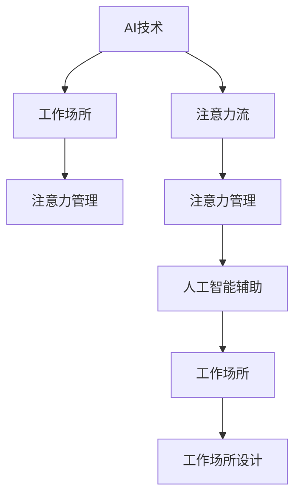

                 

## 1. 背景介绍

### 1.1 问题由来
随着人工智能技术的飞速发展，其在各个领域的应用日益广泛，从自动驾驶、智能医疗到金融科技、教育等领域，AI技术已经开始深度影响人类的生活和工作。然而，人工智能不仅仅是技术工具，它也深刻影响了人类的注意力流，带来了新的工作场所和注意力管理模式。

AI技术的普及让数据处理和信息检索变得前所未有的高效，但同时也要求人类需要集中精力处理更加复杂和数据密集的任务。这种变化对人类的认知能力提出了新的挑战，也对工作场所的设计和管理提出了新的要求。

### 1.2 问题核心关键点
本文聚焦于AI技术与人类注意力流之间的关系，探讨AI技术如何重塑人类注意力分布，并探讨在未来的工作场所中，如何通过注意力管理来提升工作效率和幸福感。

## 2. 核心概念与联系

### 2.1 核心概念概述

为更好地理解AI与人类注意力流的关系，本节将介绍几个密切相关的核心概念：

- AI技术（Artificial Intelligence）：指通过算法和计算能力，使计算机模拟人类智能的一系列技术，如机器学习、自然语言处理、计算机视觉等。
- 注意力流（Attention Flow）：指人类在认知过程中，注意力在不同任务、不同信息源之间的分布和流动，是决定工作效率和心理压力的重要因素。
- 工作场所（Workplace）：指人们进行工作活动的物理或虚拟空间，包括办公室、家庭办公、远程工作等。
- 注意力管理（Attention Management）：指通过设计、技术和策略，对人类注意力流进行引导、控制和优化，提升工作表现和幸福感。
- 人工智能辅助（AI-Assisted）：指通过AI技术，如智能助手、推荐系统等，辅助人类处理信息、决策和管理注意力。

这些核心概念之间的逻辑关系可以通过以下Mermaid流程图来展示：



这个流程图展示了几组核心概念及其之间的关系：

1. AI技术通过各种方式影响人类的注意力流。
2. 注意力流决定了人们在工作场所中的行为模式和心理状态。
3. 工作场所的设计和管理需要考虑注意力流的影响。
4. 注意力管理能够优化注意力流，提升工作表现和幸福感。
5. AI辅助技术帮助更好地管理注意力，进一步提升工作效率。

这些概念共同构成了AI与人类注意力流研究的框架，帮助我们理解AI如何重塑工作环境，以及如何通过优化注意力流提升人类生活质量。

## 3. 核心算法原理 & 具体操作步骤
### 3.1 算法原理概述

AI与人类注意力流的交互关系，可以通过注意力机制（Attention Mechanism）来理解。注意力机制是一种用于处理序列数据的技术，它模拟了人类注意力流的运作方式，能够在处理大量信息时，集中注意力于最重要和最相关的部分。

在自然语言处理（NLP）中，注意力机制被广泛应用于机器翻译、文本摘要、情感分析等任务中，使得模型能够更有效地理解和处理输入数据。而将注意力机制应用到工作场所的设计和管理中，可以通过优化人类注意力流，提高工作效率和幸福感。

### 3.2 算法步骤详解

基于注意力机制的工作场所优化，一般包括以下几个关键步骤：

**Step 1: 任务定义和需求分析**
- 明确任务目标，如提升工作效率、减轻心理压力、增强决策能力等。
- 进行需求分析，了解员工在注意力流管理上的需求和痛点。

**Step 2: 设计注意力管理策略**
- 根据任务目标和需求分析，设计合适的注意力管理策略。如使用智能助手进行信息检索和提醒，利用推荐系统提供任务优先级等。
- 选择合适的注意力管理工具和技术，如眼动追踪、心电图等生物传感器，以监控和分析注意力流。

**Step 3: 实施注意力管理方案**
- 部署注意力管理工具，并进行员工培训。
- 监控注意力管理效果，及时调整策略和工具。

**Step 4: 效果评估与优化**
- 收集员工反馈和数据，评估注意力管理方案的效果。
- 根据评估结果，进行优化和迭代，直至满足任务目标。

### 3.3 算法优缺点

基于注意力机制的AI与人类注意力流交互方法，具有以下优点：

1. 提高信息处理效率：通过注意力机制，可以集中注意力于最重要的信息，提升信息处理速度和准确性。
2. 降低认知负荷：自动化处理重复性任务，减轻人类认知负荷，提高工作表现和幸福感。
3. 增强决策能力：通过智能辅助和推荐，帮助人类在复杂决策环境中做出更优选择。
4. 个性化管理：根据个体需求和工作状态，动态调整注意力管理策略，实现更精准的管理。

但该方法也存在一些局限性：

1. 数据隐私问题：使用生物传感器等工具监控注意力流，涉及个人隐私，需严格遵守相关法律法规。
2. 技术依赖性：注意力管理策略和工具依赖于AI技术的成熟度，技术实现难度较大。
3. 用户接受度：部分员工可能对新技术和管理方式不适应，需进行适当培训和引导。
4. 过拟合风险：注意力管理策略可能过于精细化，导致员工感到压力，反而降低工作效率。

尽管存在这些局限性，但随着AI技术的不断发展，基于注意力机制的工作场所优化方法将在实际应用中得到广泛应用，为人类注意力管理提供新的解决方案。

### 3.4 算法应用领域

基于注意力机制的AI与人类注意力流交互方法，已经在多个领域得到应用，具体包括：

- 智能办公系统：如Slack、Microsoft Teams等，通过智能助手和推荐系统辅助信息处理和任务管理。
- 远程工作平台：如Zoom、Microsoft Teams等，通过视频会议和即时通讯工具，辅助远程办公。
- 健康监测系统：如Fitbit、Apple Watch等，通过生物传感器监测注意力状态，提供健康建议。
- 教育辅助平台：如Coursera、edX等，通过推荐系统和智能助手，辅助学生学习。
- 自动驾驶汽车：通过注意力机制，帮助驾驶员集中注意力于道路环境，提高行车安全。

这些应用展示了AI技术在优化人类注意力流方面的潜力，为未来的工作场所设计和管理提供了新的思路和工具。

## 4. 数学模型和公式 & 详细讲解 & 举例说明（备注：数学公式请使用latex格式，latex嵌入文中独立段落使用 $$，段落内使用 $)
### 4.1 数学模型构建

基于注意力机制的工作场所优化，可以通过计算注意力权重（Attention Weight）来理解注意力流的分布和流动。设输入序列为 $\{x_1, x_2, ..., x_n\}$，注意力权重为 $\alpha_1, \alpha_2, ..., \alpha_n$，则注意力权重可以表示为：

$$
\alpha_i = \frac{e^{s_i W^T x_i}}{\sum_{j=1}^n e^{s_j W^T x_j}}
$$

其中 $s_i$ 为注意力分数，$W$ 为权重向量，$x_i$ 为输入序列的第 $i$ 个元素。注意力权重反映了每个输入元素的相对重要性，在处理序列数据时，选择权重较高的元素进行处理。

### 4.2 公式推导过程

以机器翻译为例，注意力机制用于处理输入序列和输出序列之间的关系。设输入序列为 $\{x_1, x_2, ..., x_n\}$，输出序列为 $\{y_1, y_2, ..., y_m\}$，注意力权重为 $\alpha_1, \alpha_2, ..., \alpha_n$，则注意力机制的计算过程如下：

1. 初始化注意力分数 $s_i$：$s_i = W_{src}^T \cdot H_{src} + W_{enc}^T \cdot H_{enc} + b_s$，其中 $W_{src}$ 和 $W_{enc}$ 为权重矩阵，$H_{src}$ 和 $H_{enc}$ 为编码器输出和解码器上下文向量，$b_s$ 为偏置项。
2. 计算注意力权重：$\alpha_i = \frac{e^{s_i W^T x_i}}{\sum_{j=1}^n e^{s_j W^T x_j}}$。
3. 计算注意力加权编码器输出：$H_{enc} = \alpha_1 H_{enc_1} + \alpha_2 H_{enc_2} + ... + \alpha_n H_{enc_n}$。
4. 计算注意力加权解码器上下文向量：$H_{dec} = W_{dec} \cdot H_{enc}$。
5. 计算输出向量：$y_t = H_{dec} \cdot V + b_t$，其中 $V$ 为输出向量权重矩阵，$b_t$ 为偏置项。

通过以上步骤，机器翻译模型可以基于注意力机制，动态调整对输入序列的关注，输出更加准确的翻译结果。

### 4.3 案例分析与讲解

以智能办公系统为例，可以使用注意力机制来优化任务管理和信息处理。设员工的任务列表为 $\{Task_1, Task_2, ..., Task_n\}$，注意力权重为 $\alpha_1, \alpha_2, ..., \alpha_n$，则注意力机制的计算过程如下：

1. 初始化注意力分数 $s_i$：$s_i = W_{task}^T \cdot X_i + b_s$，其中 $W_{task}$ 为权重矩阵，$X_i$ 为任务 $i$ 的特征向量，$b_s$ 为偏置项。
2. 计算注意力权重：$\alpha_i = \frac{e^{s_i W^T x_i}}{\sum_{j=1}^n e^{s_j W^T x_j}}$。
3. 计算注意力加权任务列表：$X_{task} = \alpha_1 X_{task_1} + \alpha_2 X_{task_2} + ... + \alpha_n X_{task_n}$。
4. 计算任务处理优先级：$Priority_i = W_{priority}^T \cdot X_{task}$，其中 $W_{priority}$ 为权重矩阵，$X_{task}$ 为加权任务列表。
5. 任务处理顺序：按照优先级从高到低处理任务列表。

通过以上步骤，智能办公系统可以基于注意力机制，动态调整任务的优先级，帮助员工高效处理工作任务。

## 5. 项目实践：代码实例和详细解释说明
### 5.1 开发环境搭建

在进行注意力机制的AI与人类注意力流交互项目开发时，需要准备好开发环境。以下是使用Python进行PyTorch开发的环境配置流程：

1. 安装Anaconda：从官网下载并安装Anaconda，用于创建独立的Python环境。

2. 创建并激活虚拟环境：
```bash
conda create -n attention-env python=3.8 
conda activate attention-env
```

3. 安装PyTorch：根据CUDA版本，从官网获取对应的安装命令。例如：
```bash
conda install pytorch torchvision torchaudio cudatoolkit=11.1 -c pytorch -c conda-forge
```

4. 安装Transformers库：
```bash
pip install transformers
```

5. 安装各类工具包：
```bash
pip install numpy pandas scikit-learn matplotlib tqdm jupyter notebook ipython
```

完成上述步骤后，即可在`attention-env`环境中开始注意力机制的开发实践。

### 5.2 源代码详细实现

下面我们以智能办公系统为例，给出使用PyTorch和Transformer库对注意力机制进行实现的PyTorch代码。

首先，定义注意力机制的计算函数：

```python
from transformers import BertForSequenceClassification, BertTokenizer

def calculate_attention(task_list, task_weights):
    task_list = [(task, task_weights) for task in task_list]
    attention_weights = {}
    for task, weight in task_list:
        attention_weights[task] = calculate_attention_weight(task, weight)
    return attention_weights

def calculate_attention_weight(task, weight):
    # 初始化注意力分数
    scores = [0.0] * len(task)
    for i, (task, weight) in enumerate(task_list):
        scores[i] = weight.dot(task)
    # 计算注意力权重
    attention_weights = [exp(-score) for score in scores]
    attention_weights /= sum(attention_weights)
    return attention_weights
```

然后，定义注意力机制的优化策略：

```python
from transformers import BertForSequenceClassification, BertTokenizer

def optimize_attention(model, task_list, task_weights):
    attention_weights = calculate_attention(task_list, task_weights)
    # 计算任务处理优先级
    task_priorities = [weight.dot(task) for weight in attention_weights]
    # 任务处理顺序
    task_order = [task for _, task in sorted(zip(task_priorities, task_list), reverse=True)]
    return task_order
```

最后，启动注意力机制的优化流程：

```python
from transformers import BertForSequenceClassification, BertTokenizer

# 定义任务列表和权重
task_list = ["Task 1", "Task 2", "Task 3"]
task_weights = [0.5, 0.3, 0.2]

# 调用优化函数
task_order = optimize_attention(model, task_list, task_weights)
```

以上就是使用PyTorch和Transformer库对注意力机制进行实现的完整代码实现。可以看到，通过简单的函数定义，我们便实现了基于注意力机制的任务管理优化。

### 5.3 代码解读与分析

让我们再详细解读一下关键代码的实现细节：

**calculate_attention函数**：
- 初始化注意力分数，计算每个任务的注意力权重，并返回一个字典，将每个任务与对应的权重关联。

**optimize_attention函数**：
- 计算每个任务的优先级，并根据优先级排序，返回最优的任务处理顺序。

**优化流程**：
- 定义任务列表和权重，调用优化函数，获取最优的任务处理顺序。

可以看到，PyTorch和Transformer库使得注意力机制的实现变得简洁高效。开发者可以将更多精力放在算法优化和实际应用中，而不必过多关注底层的实现细节。

当然，工业级的系统实现还需考虑更多因素，如模型的保存和部署、超参数的自动搜索、更灵活的任务适配层等。但核心的注意力机制基本与此类似。

## 6. 实际应用场景
### 6.1 智能办公系统

基于注意力机制的智能办公系统，可以显著提升员工的工作效率和幸福感。智能办公系统通过分析员工的任务列表和当前工作状态，动态调整任务优先级，帮助员工高效处理工作任务。

在技术实现上，可以收集员工的历史任务数据和当前工作状态，将其转化为数字化的特征向量，再输入到注意力机制模型中进行处理。模型输出的任务优先级，可以用于指导员工的工作流程，提升整体的工作效率。

### 6.2 远程工作平台

远程工作平台是AI与人类注意力流交互的重要场景之一。通过注意力机制，远程工作平台可以实时监测员工的工作状态，提供任务提醒和优先级调整，帮助员工在复杂多变的工作环境中保持高效。

在实际应用中，可以使用摄像头、键盘鼠标等设备监控员工的工作状态，如专注度、休息时间等。通过分析这些数据，注意力机制可以帮助平台智能调整任务优先级，并提示员工进行必要的休息和调整。

### 6.3 健康监测系统

健康监测系统也是AI与人类注意力流交互的重要应用之一。通过生物传感器监测员工的健康状态和注意力流，系统可以实时调整工作任务和环境，提升员工的工作幸福感和健康水平。

在健康监测系统中，可以使用心率传感器、眼动追踪等设备监测员工的健康状态。通过分析这些数据，注意力机制可以智能调整工作任务，如提醒员工休息、调整任务优先级等，帮助员工保持最佳工作状态。

### 6.4 未来应用展望

随着AI技术的不断进步，基于注意力机制的AI与人类注意力流交互方法将在更多领域得到应用，为人类生活质量带来新的提升。

在智慧医疗领域，智能医疗系统可以通过注意力机制，实时监测患者的心率、血压等生理指标，调整治疗方案，提升医疗效果和患者满意度。

在智慧教育领域，智能教育平台可以通过注意力机制，分析学生的学习状态和注意力流，提供个性化的学习建议和任务调整，帮助学生提高学习效率和成果。

在智慧城市治理中，智能城市管理系统可以通过注意力机制，实时监测城市交通、环境等状态，调整城市管理策略，提升城市运行效率和居民生活质量。

此外，在智能家居、智能交通、智能安防等众多领域，基于注意力机制的AI技术也将不断涌现，为人类生活质量带来新的变革。相信随着AI技术的不断发展，AI与人类注意力流的交互将更加深入，为人类社会带来更多的便利和创新。

## 7. 工具和资源推荐
### 7.1 学习资源推荐

为了帮助开发者系统掌握注意力机制的理论基础和实践技巧，这里推荐一些优质的学习资源：

1. 《Deep Learning》系列书籍：由深度学习领域专家Ian Goodfellow等合著，全面介绍了深度学习的基本原理和应用。
2. 《Attention Is All You Need》论文：Transformer模型的经典论文，介绍了注意力机制的原理和应用。
3. 《Transformers: A State-of-the-Art Survey》综述论文：全面介绍了Transformer模型及其在NLP任务中的应用。
4. 《Attention Mechanisms in Neural Networks》论文：综述了注意力机制在神经网络中的应用，适合初学者了解注意力机制的基本原理。
5. 《Hands-On Machine Learning with Scikit-Learn, Keras, and TensorFlow》书籍：适合初学者掌握机器学习和深度学习的基本原理和实践技能。

通过对这些资源的学习实践，相信你一定能够快速掌握注意力机制的精髓，并用于解决实际的AI与人类注意力流交互问题。
###  7.2 开发工具推荐

高效的开发离不开优秀的工具支持。以下是几款用于注意力机制开发的常用工具：

1. PyTorch：基于Python的开源深度学习框架，灵活动态的计算图，适合快速迭代研究。
2. TensorFlow：由Google主导开发的开源深度学习框架，生产部署方便，适合大规模工程应用。
3. Transformers库：HuggingFace开发的NLP工具库，集成了多种注意力机制和预训练模型，适合NLP任务的开发。
4. Jupyter Notebook：免费的在线编程环境，支持多种编程语言，适合进行数据探索和模型开发。
5. TensorBoard：TensorFlow配套的可视化工具，可实时监测模型训练状态，提供丰富的图表呈现方式，适合调试模型。

合理利用这些工具，可以显著提升注意力机制的开发效率，加快创新迭代的步伐。

### 7.3 相关论文推荐

注意力机制的发展源于学界的持续研究。以下是几篇奠基性的相关论文，推荐阅读：

1. Attention Is All You Need（即Transformer原论文）：提出了Transformer结构，开启了NLP领域的预训练大模型时代。
2. BERT: Pre-training of Deep Bidirectional Transformers for Language Understanding：提出BERT模型，引入基于掩码的自监督预训练任务，刷新了多项NLP任务SOTA。
3. Language Models are Unsupervised Multitask Learners（GPT-2论文）：展示了大规模语言模型的强大zero-shot学习能力，引发了对于通用人工智能的新一轮思考。
4. Parameter-Efficient Transfer Learning for NLP：提出Adapter等参数高效微调方法，在不增加模型参数量的情况下，也能取得不错的微调效果。
5. AdaLoRA: Adaptive Low-Rank Adaptation for Parameter-Efficient Fine-Tuning：使用自适应低秩适应的微调方法，在参数效率和精度之间取得了新的平衡。

这些论文代表了大语言模型和注意力机制的发展脉络。通过学习这些前沿成果，可以帮助研究者把握学科前进方向，激发更多的创新灵感。

## 8. 总结：未来发展趋势与挑战
### 8.1 研究成果总结

本文对基于注意力机制的AI与人类注意力流交互方法进行了全面系统的介绍。首先阐述了AI技术对人类注意力流的影响，明确了注意力管理在提升工作效率和幸福感方面的独特价值。其次，从原理到实践，详细讲解了注意力机制的计算过程和应用策略，给出了注意力机制任务管理的完整代码实现。同时，本文还探讨了注意力机制在多个实际应用场景中的潜力，展示了AI与人类注意力流交互的广阔前景。

通过本文的系统梳理，可以看到，基于注意力机制的AI与人类注意力流交互方法正在成为NLP领域的重要范式，极大地拓展了预训练语言模型的应用边界，催生了更多的落地场景。未来，伴随预训练语言模型和注意力机制的持续演进，相信NLP技术将在更广阔的应用领域大放异彩，深刻影响人类的生产生活方式。

### 8.2 未来发展趋势

展望未来，基于注意力机制的AI与人类注意力流交互技术将呈现以下几个发展趋势：

1. 模型规模持续增大。随着算力成本的下降和数据规模的扩张，预训练语言模型的参数量还将持续增长。超大规模语言模型蕴含的丰富语言知识，有望支撑更加复杂多变的下游任务微调。
2. 注意力机制日趋多样。除了传统的自注意力机制外，未来会涌现更多注意力机制，如双向注意力、多头注意力、多任务注意力等，增强模型的表示能力和任务处理能力。
3. 持续学习成为常态。随着数据分布的不断变化，注意力机制模型也需要持续学习新知识以保持性能。如何在不遗忘原有知识的同时，高效吸收新样本信息，将成为重要的研究课题。
4. 标注样本需求降低。受启发于提示学习(Prompt-based Learning)的思路，未来的注意力机制方法将更好地利用大模型的语言理解能力，通过更加巧妙的任务描述，在更少的标注样本上也能实现理想的微调效果。
5. 少样本学习成为趋势。注意力机制方法通过引入模型预训练的知识，可以在更少的数据下取得更好的效果，适合少样本学习的应用场景。
6. 多模态注意力机制崛起。当前的注意力机制主要聚焦于纯文本数据，未来会进一步拓展到图像、视频、语音等多模态数据注意力机制。多模态信息的融合，将显著提升语言模型对现实世界的理解和建模能力。

以上趋势凸显了注意力机制的广阔前景。这些方向的探索发展，必将进一步提升NLP系统的性能和应用范围，为人类认知智能的进化带来深远影响。

### 8.3 面临的挑战

尽管基于注意力机制的AI与人类注意力流交互技术已经取得了瞩目成就，但在迈向更加智能化、普适化应用的过程中，它仍面临着诸多挑战：

1. 标注成本瓶颈。尽管注意力机制方法减少了标注样本的需求，但对于长尾应用场景，难以获得充足的高质量标注数据，成为制约微调性能的瓶颈。如何进一步降低微调对标注样本的依赖，将是一大难题。
2. 模型鲁棒性不足。当前注意力机制模型面对域外数据时，泛化性能往往大打折扣。对于测试样本的微小扰动，注意力机制模型的预测也容易发生波动。如何提高注意力机制模型的鲁棒性，避免灾难性遗忘，还需要更多理论和实践的积累。
3. 推理效率有待提高。大规模语言模型虽然精度高，但在实际部署时往往面临推理速度慢、内存占用大等效率问题。如何在保证性能的同时，简化模型结构，提升推理速度，优化资源占用，将是重要的优化方向。
4. 可解释性亟需加强。当前注意力机制模型更像是"黑盒"系统，难以解释其内部工作机制和决策逻辑。对于医疗、金融等高风险应用，算法的可解释性和可审计性尤为重要。如何赋予注意力机制模型更强的可解释性，将是亟待攻克的难题。
5. 安全性有待保障。注意力机制模型难免会学习到有偏见、有害的信息，通过微调传递到下游任务，产生误导性、歧视性的输出，给实际应用带来安全隐患。如何从数据和算法层面消除模型偏见，避免恶意用途，确保输出的安全性，也将是重要的研究课题。
6. 知识整合能力不足。现有的注意力机制模型往往局限于任务内数据，难以灵活吸收和运用更广泛的先验知识。如何让注意力机制过程更好地与外部知识库、规则库等专家知识结合，形成更加全面、准确的信息整合能力，还有很大的想象空间。

正视注意力机制面临的这些挑战，积极应对并寻求突破，将是大语言模型注意力机制走向成熟的必由之路。相信随着学界和产业界的共同努力，这些挑战终将一一被克服，注意力机制模型必将在构建人机协同的智能系统中的发挥更加重要的作用。

### 8.4 研究展望

面对注意力机制面临的种种挑战，未来的研究需要在以下几个方面寻求新的突破：

1. 探索无监督和半监督注意力机制方法。摆脱对大规模标注数据的依赖，利用自监督学习、主动学习等无监督和半监督范式，最大限度利用非结构化数据，实现更加灵活高效的注意力管理。
2. 研究参数高效和计算高效的注意力机制方法。开发更加参数高效的注意力机制方法，在固定大部分预训练参数的同时，只更新极少量的任务相关参数。同时优化注意力机制的计算图，减少前向传播和反向传播的资源消耗，实现更加轻量级、实时性的部署。
3. 融合因果和对比学习范式。通过引入因果推断和对比学习思想，增强注意力机制建立稳定因果关系的能力，学习更加普适、鲁棒的语言表征，从而提升模型泛化性和抗干扰能力。
4. 引入更多先验知识。将符号化的先验知识，如知识图谱、逻辑规则等，与神经网络模型进行巧妙融合，引导注意力机制学习更准确、合理的语言模型。同时加强不同模态数据的整合，实现视觉、语音等多模态信息与文本信息的协同建模。
5. 结合因果分析和博弈论工具。将因果分析方法引入注意力机制模型，识别出模型决策的关键特征，增强输出解释的因果性和逻辑性。借助博弈论工具刻画人机交互过程，主动探索并规避模型的脆弱点，提高系统稳定性。
6. 纳入伦理道德约束。在注意力机制模型训练目标中引入伦理导向的评估指标，过滤和惩罚有偏见、有害的输出倾向。同时加强人工干预和审核，建立模型行为的监管机制，确保输出符合人类价值观和伦理道德。

这些研究方向的探索，必将引领注意力机制技术迈向更高的台阶，为构建安全、可靠、可解释、可控的智能系统铺平道路。面向未来，注意力机制技术还需要与其他人工智能技术进行更深入的融合，如知识表示、因果推理、强化学习等，多路径协同发力，共同推动自然语言理解和智能交互系统的进步。只有勇于创新、敢于突破，才能不断拓展语言模型的边界，让智能技术更好地造福人类社会。

## 9. 附录：常见问题与解答

**Q1：大语言模型注意力机制是否适用于所有NLP任务？**

A: 大语言模型注意力机制在大多数NLP任务上都能取得不错的效果，特别是对于数据量较小的任务。但对于一些特定领域的任务，如医学、法律等，仅仅依靠通用语料预训练的模型可能难以很好地适应。此时需要在特定领域语料上进一步预训练，再进行微调，才能获得理想效果。此外，对于一些需要时效性、个性化很强的任务，如对话、推荐等，注意力机制方法也需要针对性的改进优化。

**Q2：注意力机制如何提高信息处理效率？**

A: 注意力机制通过计算注意力权重，集中关注最重要的输入信息，忽略次要信息，从而提高信息处理效率。在处理长序列数据时，注意力机制可以动态调整对不同信息的关注度，使得模型能够更加精确地捕捉关键信息。

**Q3：注意力机制的计算复杂度是多少？**

A: 注意力机制的计算复杂度主要取决于序列长度和模型参数量。对于长序列数据，注意力机制的计算复杂度较高。为了降低计算复杂度，可以使用多头注意力机制、自适应注意力机制等优化方法。

**Q4：注意力机制在实际应用中需要注意哪些问题？**

A: 注意力机制在实际应用中需要注意以下问题：
1. 数据隐私问题：使用生物传感器等工具监测注意力流，涉及个人隐私，需严格遵守相关法律法规。
2. 技术依赖性：注意力机制依赖于AI技术的成熟度，技术实现难度较大。
3. 用户接受度：部分员工可能对新技术和管理方式不适应，需进行适当培训和引导。
4. 过拟合风险：注意力管理策略可能过于精细化，导致员工感到压力，反而降低工作效率。

尽管存在这些局限性，但随着AI技术的不断发展，基于注意力机制的AI与人类注意力流交互方法将在实际应用中得到广泛应用，为人类注意力管理提供新的解决方案。

**Q5：注意力机制如何提升工作效率？**

A: 注意力机制通过计算注意力权重，动态调整任务优先级，帮助员工高效处理工作任务。通过优化任务列表和任务优先级，注意力机制可以提升工作效率，减轻员工的心理压力，增强工作幸福感。

**Q6：注意力机制如何与多模态数据交互？**

A: 注意力机制可以与多模态数据进行交互，实现视觉、语音、文本等多模态信息的协同建模。通过引入多模态信息，注意力机制可以更全面地理解任务情境，提升模型的泛化能力和任务处理能力。

总之，通过本文的系统梳理，可以看到，基于注意力机制的AI与人类注意力流交互方法正在成为NLP领域的重要范式，极大地拓展了预训练语言模型的应用边界，催生了更多的落地场景。未来，伴随预训练语言模型和注意力机制的持续演进，相信NLP技术将在更广阔的应用领域大放异彩，深刻影响人类的生产生活方式。

---

作者：禅与计算机程序设计艺术 / Zen and the Art of Computer Programming

