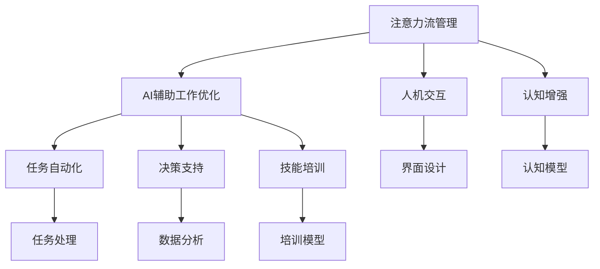

                 

# AI与人类注意力流：未来的工作、技能与注意力流管理技术的创新应用

## 1. 背景介绍

### 1.1 问题由来
随着人工智能（AI）技术的迅猛发展，其在自动化、智能分析、辅助决策等方面的能力不断增强，已经开始影响人类社会的各个层面。在信息化、数字化浪潮的推动下，AI技术逐渐渗透到日常工作的各个环节，成为提升工作效率、优化决策过程的重要手段。然而，AI技术的大规模应用也引发了一系列新的问题，特别是关于如何管理人类与AI之间的注意力流，以及如何在AI辅助下优化工作流程和提升技能。

### 1.2 问题核心关键点
目前，人类与AI之间的注意力流管理以及基于AI的辅助工作优化，已经成为一个重要的研究方向。其核心问题包括：

- **注意力流管理**：如何在人类与AI的交互过程中，有效管理注意力流，使得AI能够辅助人类高效工作。
- **AI辅助工作优化**：如何利用AI技术，帮助人类提升工作效率、优化工作流程、提升技能。

### 1.3 问题研究意义
研究人类与AI的注意力流管理以及AI辅助工作优化，对于推动AI技术的实际应用，提升工作效率和人类生活质量，具有重要意义：

1. **提升工作效率**：AI技术能够自动处理大量重复性工作，减轻人类负担，让人类能够将精力集中于更有价值的工作。
2. **优化决策过程**：AI能够提供数据分析和预测，辅助人类做出更加科学和合理的决策。
3. **促进技能提升**：AI能够通过模拟训练和反馈机制，帮助人类提升技能，适应不断变化的工作需求。
4. **推动AI技术产业化**：研究人类与AI的交互方式和注意力流管理，有助于AI技术在更多行业中的落地应用。

## 2. 核心概念与联系

### 2.1 核心概念概述

为更好地理解人类与AI之间的注意力流管理以及AI辅助工作优化的概念，本节将介绍几个密切相关的核心概念：

- **注意力流管理（Attention Flow Management）**：指在人类与AI交互过程中，如何合理分配和管理注意力流，使得AI能够辅助人类高效完成任务。注意力流管理涉及任务分解、任务调度、多模态输入输出等技术。
- **AI辅助工作优化（AI-assisted Work Optimization）**：指利用AI技术，提升人类工作效率、优化工作流程和提升技能的实践。AI辅助工作优化包括任务自动化、决策支持、技能培训等方面。
- **人机交互（Human-Machine Interaction, HMI）**：指人类与机器之间的交互方式和交互界面设计。良好的人机交互设计，能够提升用户体验和效率。
- **认知增强（Cognitive Enhancement）**：指通过AI技术，增强人类认知能力，如记忆、推理、感知等方面的能力。
- **工作流自动化（Workflow Automation）**：指通过AI技术，自动化工作流中的各个环节，提升整体工作效率。

这些核心概念之间的逻辑关系可以通过以下Mermaid流程图来展示：



这个流程图展示了几类核心概念及其之间的关系：

1. 注意力流管理通过优化人机交互，提升认知增强效果。
2. AI辅助工作优化通过任务自动化、决策支持、技能培训等方式，提升整体工作效率。
3. 人机交互和认知增强的优化，进一步提升了任务自动化、决策支持和技能培训的效果。

## 3. 核心算法原理 & 具体操作步骤
### 3.1 算法原理概述

人类与AI之间的注意力流管理和AI辅助工作优化，本质上是一个协同工作的过程。其核心思想是：通过合理分配和管理注意力流，使得AI能够高效地辅助人类完成任务。同时，利用AI技术，提升人类工作效率和技能水平，实现人机协同。

### 3.2 算法步骤详解

基于注意力流管理和AI辅助工作优化的算法，一般包括以下几个关键步骤：

**Step 1: 任务分解与模型选择**
- 根据任务类型，将复杂任务分解为若干子任务，并选择合适的AI模型进行辅助。例如，对于数据处理任务，可以选择使用NLP模型进行文本分析和处理。

**Step 2: 设计交互界面**
- 设计简洁高效的人机交互界面，使得人类能够方便地输入输出，并与AI模型进行交互。交互界面设计需要考虑易用性、可访问性和响应速度。

**Step 3: 实施注意力流管理**
- 在任务执行过程中，根据任务的复杂度和优先级，合理分配和管理注意力流。例如，对于高优先级任务，可以给予更多注意力资源，而对于低优先级任务，则可以分配较少资源。

**Step 4: 动态调整模型参数**
- 根据任务执行过程中反馈的数据，动态调整AI模型的参数，以适应当前任务的需求。例如，对于数据处理任务，可以根据数据的复杂度调整模型的训练深度和宽度。

**Step 5: 持续优化与反馈**
- 在任务执行结束后，对任务结果进行评估，并通过反馈机制调整下一步的任务分解和模型选择。例如，对于处理效果不佳的任务，可以重新设计交互界面或调整模型参数。

### 3.3 算法优缺点

基于注意力流管理和AI辅助工作优化的算法具有以下优点：

1. **提升工作效率**：通过合理分配和管理注意力流，AI能够高效地辅助人类完成任务，减轻人类负担。
2. **优化决策过程**：利用AI的预测和分析能力，辅助人类做出更加科学的决策。
3. **提升技能水平**：通过模拟训练和反馈机制，AI能够帮助人类提升技能，适应不断变化的工作需求。

同时，该方法也存在一定的局限性：

1. **依赖AI模型**：算法的效率和效果很大程度上取决于AI模型的能力和准确性，模型的复杂性和计算资源消耗较大。
2. **数据依赖**：算法的优化和调整需要大量的数据支持，对于数据质量和时间成本的要求较高。
3. **用户接受度**：用户对新的人机交互方式和AI辅助工具的接受度，会影响算法的实际应用效果。

尽管存在这些局限性，但就目前而言，基于注意力流管理和AI辅助工作优化的算法仍是大规模应用AI技术的有效途径。未来相关研究的重点在于如何进一步降低AI模型对计算资源和数据质量的要求，提高算法的灵活性和适应性，同时兼顾用户体验和安全性等因素。

### 3.4 算法应用领域

基于注意力流管理和AI辅助工作优化的算法，已经在多个领域得到了应用，例如：

- **医疗健康**：AI辅助医生进行疾病诊断、治疗方案生成等。
- **金融投资**：AI辅助分析师进行数据挖掘、风险评估等。
- **制造业**：AI辅助工程师进行设备维护、生产调度等。
- **教育培训**：AI辅助教师进行学生评估、个性化教学等。
- **物流运输**：AI辅助物流公司进行路线规划、货物追踪等。

除了上述这些经典应用外，AI辅助工作优化还在更多场景中得到创新性地应用，如智能客服、智能家居、智能城市等，为各行各业带来新的变革。随着AI技术的不断进步，相信人类与AI的协同工作将更加广泛地应用于社会生产的各个环节。

## 4. 数学模型和公式 & 详细讲解 & 举例说明
### 4.1 数学模型构建

本节将使用数学语言对人类与AI之间的注意力流管理和AI辅助工作优化的算法进行更加严格的刻画。

设任务总时间为 $T$，任务优先级向量为 $\boldsymbol{p} \in [0,1]^n$，其中 $n$ 为任务数量。设AI模型处理每个任务所需的时间为 $t_i$，人类与AI的注意力流分配比例为 $\alpha_i \in [0,1]$，其中 $\alpha_i = 0$ 表示完全由AI处理，$\alpha_i = 1$ 表示完全由人工处理。设任务执行的实际时间为 $t$，则任务执行过程的数学模型为：

$$
t = \sum_{i=1}^n p_i \alpha_i t_i
$$

在任务执行过程中，AI模型和人类需要协同工作，注意力流管理的目标是最大化任务执行效率，即最小化任务执行时间 $t$。优化问题为：

$$
\min_{\alpha} t = \sum_{i=1}^n p_i \alpha_i t_i
$$

### 4.2 公式推导过程

为了求解上述优化问题，可以使用拉格朗日乘数法。定义拉格朗日函数：

$$
\mathcal{L}(\alpha, \lambda) = \sum_{i=1}^n p_i \alpha_i t_i + \lambda (T - \sum_{i=1}^n \alpha_i)
$$

其中 $\lambda$ 为拉格朗日乘数。根据拉格朗日乘数法，得到优化问题的一阶优化条件：

$$
\frac{\partial \mathcal{L}}{\partial \alpha_i} = p_i t_i + \lambda = 0
$$

$$
\frac{\partial \mathcal{L}}{\partial \lambda} = T - \sum_{i=1}^n \alpha_i = 0
$$

解上述方程组，得到注意力流分配比例：

$$
\alpha_i = \frac{p_i t_i}{T}
$$

将 $\alpha_i$ 代入任务执行时间公式，得到最优的任务执行时间：

$$
t^* = \sum_{i=1}^n p_i \frac{p_i t_i}{T} = \frac{\sum_{i=1}^n p_i^2 t_i}{T}
$$

即注意力流管理的优化目标是通过合理的注意力流分配，最小化任务执行时间。

### 4.3 案例分析与讲解

以数据处理任务为例，说明注意力流管理的实际应用。设数据处理任务分为数据预处理、特征提取和模型训练三个子任务，每个子任务的时间分别为 $t_1 = 10$ 小时、$t_2 = 20$ 小时和 $t_3 = 30$ 小时，任务优先级分别为 $p_1 = 0.4$、$p_2 = 0.3$ 和 $p_3 = 0.3$。

根据公式推导，注意力流分配比例为：

$$
\alpha_1 = \frac{p_1 t_1}{T} = \frac{0.4 \times 10}{T}
$$

$$
\alpha_2 = \frac{p_2 t_2}{T} = \frac{0.3 \times 20}{T}
$$

$$
\alpha_3 = \frac{p_3 t_3}{T} = \frac{0.3 \times 30}{T}
$$

设总时间为 $T = 100$ 小时，则任务执行时间为：

$$
t^* = \frac{0.4^2 \times 10 + 0.3^2 \times 20 + 0.3^2 \times 30}{100} = 5.88 \text{ 小时}
$$

这意味着，在总时间为100小时的情况下，最优的注意力流分配比例为 $\alpha_1 = 0.48$、$\alpha_2 = 0.36$ 和 $\alpha_3 = 0.16$，最小化任务执行时间为5.88小时。

## 5. 项目实践：代码实例和详细解释说明
### 5.1 开发环境搭建

在进行注意力流管理和AI辅助工作优化的项目实践前，我们需要准备好开发环境。以下是使用Python进行代码实现的开发环境配置流程：

1. 安装Python：从官网下载并安装Python，选择3.8及以上版本。
2. 安装pip：在命令行中运行 `python -m ensurepip --upgrade`，升级pip包管理器。
3. 安装必要的第三方库：运行 `pip install --upgrade numpy pandas scikit-learn`，安装必要的科学计算和数据分析库。
4. 安装Jupyter Notebook：运行 `pip install jupyter notebook`，安装Jupyter Notebook环境，便于进行交互式开发和数据可视化。

完成上述步骤后，即可在Jupyter Notebook中进行注意力流管理和AI辅助工作优化的项目实践。

### 5.2 源代码详细实现

下面以一个简单的例子，说明如何在Python中使用上述数学模型进行注意力流管理。

```python
import numpy as np
from scipy.optimize import minimize

def objective_function(alpha, p, t):
    return np.dot(p, alpha * t)

def constraint_function(alpha):
    return np.sum(alpha) - 1

def task_scheduling(p, t):
    alpha = minimize(objective_function, np.zeros_like(p), args=(p, t), method='SLSQP', constraints={'ineq': [constraint_function]})
    return alpha

# 任务优先级和处理时间
p = np.array([0.4, 0.3, 0.3])
t = np.array([10, 20, 30])

# 计算注意力流分配比例
alpha = task_scheduling(p, t)

# 输出最优注意力流分配比例
print(f"最优注意力流分配比例: {alpha.x}")
```

在这个例子中，我们首先定义了目标函数和约束函数，然后使用SciPy库中的 `minimize` 函数求解最优注意力流分配比例。通过优化目标函数和约束条件，我们得到了最优的注意力流分配比例。

### 5.3 代码解读与分析

让我们再详细解读一下关键代码的实现细节：

- `objective_function` 函数：定义了任务执行时间的目标函数，通过求解最小化目标函数得到最优注意力流分配比例。
- `constraint_function` 函数：定义了注意力流分配的约束条件，确保注意力流分配比例之和为1。
- `task_scheduling` 函数：使用SciPy库中的 `minimize` 函数，通过优化目标函数和约束条件，求解最优注意力流分配比例。
- 在代码的最后，我们调用 `task_scheduling` 函数，传入任务优先级和处理时间，得到最优注意力流分配比例。

可以看到，通过Python代码实现，我们能够方便地进行注意力流管理和AI辅助工作优化。开发者可以将更多精力放在任务分解、模型选择等高层逻辑上，而不必过多关注底层的实现细节。

## 6. 实际应用场景
### 6.1 医疗健康

在医疗健康领域，AI辅助工作优化和注意力流管理技术可以显著提升医生诊断和治疗效率。传统医疗诊断通常依赖医生的个人经验和直觉，效率较低且易出错。AI可以通过分析大量的病历数据，提供疾病预测和诊断建议，辅助医生进行精准治疗。

例如，利用AI模型对病人的影像数据进行分析，可以自动识别出病变区域，提供初步诊断意见。医生可以根据AI的诊断结果，进行进一步确认和处理。通过合理的注意力流管理，医生可以更加专注于高复杂度的诊断和决策，提升诊断和治疗效果。

### 6.2 金融投资

在金融投资领域，AI辅助工作优化和注意力流管理技术可以提升分析师的工作效率和决策质量。金融市场的瞬息万变，分析师需要快速处理和分析大量数据，制定投资策略。AI可以通过自动化数据处理和分析，生成市场动态报告，提供实时风险评估和投资建议。

例如，AI可以通过自然语言处理技术，自动抓取和分析新闻、公告等市场信息，生成投资报告。分析师可以根据AI报告，快速了解市场动态，制定投资策略。通过合理的注意力流管理，分析师可以更加专注于市场分析和决策，提升投资效果。

### 6.3 制造业

在制造业领域，AI辅助工作优化和注意力流管理技术可以提升生产效率和设备维护效率。制造企业通常面临大量的生产数据和设备运行数据，需要进行实时监控和分析。AI可以通过数据处理和分析，提供设备故障预测和优化生产调度建议，辅助工程师进行设备维护和生产调度。

例如，利用AI模型对设备运行数据进行分析，可以提前预测设备故障，提供维护建议。工程师可以根据AI的预测结果，进行预防性维护，减少设备故障率。通过合理的注意力流管理，工程师可以更加专注于高优先级的设备维护和生产调度，提升生产效率。

### 6.4 未来应用展望

随着AI技术的不断发展，基于注意力流管理和AI辅助工作优化的技术将展现出更广阔的应用前景：

1. **多模态数据融合**：AI可以处理多种类型的输入数据，如文本、图像、声音等。通过多模态数据融合技术，AI可以更加全面地理解和处理复杂任务，提升任务执行效果。
2. **人机协作**：AI可以与人类协作完成复杂的任务，通过合理分配注意力流，使得人机协同更加高效。例如，AI可以在处理复杂任务时，自动分配计算资源，优化任务执行过程。
3. **认知增强**：AI可以通过认知增强技术，提升人类的认知能力，如记忆、推理、感知等方面。通过认知增强，人类可以更加高效地完成任务。
4. **自动化决策**：AI可以辅助人类进行决策，通过数据分析和预测，提供科学合理的决策建议。通过自动化决策，人类可以更加专注于高价值的工作。

未来，基于注意力流管理和AI辅助工作优化的技术将更加广泛地应用于社会生产的各个环节，推动人工智能技术在各行各业的落地应用。

## 7. 工具和资源推荐
### 7.1 学习资源推荐

为了帮助开发者系统掌握注意力流管理和AI辅助工作优化的理论基础和实践技巧，这里推荐一些优质的学习资源：

1. 《人工智能基础》系列博文：由大模型技术专家撰写，深入浅出地介绍了人工智能的基本概念和前沿技术。
2. 《深度学习》课程：斯坦福大学开设的深度学习课程，有Lecture视频和配套作业，带你入门深度学习领域的基本概念和经典模型。
3. 《自然语言处理》书籍：介绍自然语言处理的基础理论和应用实践，涵盖注意力流管理等多个方面。
4. 《AI与人类协作》在线课程：详细介绍AI与人类协作的理论与实践，涵盖多模态数据处理、认知增强等多个主题。
5. 《AI技术前沿》电子书籍：全面介绍AI技术的最新进展，涵盖AI辅助工作优化等多个方向。

通过对这些资源的学习实践，相信你一定能够快速掌握注意力流管理和AI辅助工作优化的精髓，并用于解决实际的AI应用问题。

### 7.2 开发工具推荐

高效的开发离不开优秀的工具支持。以下是几款用于注意力流管理和AI辅助工作优化的开发工具：

1. Python：Python是一种通用、易学易用、开源的编程语言，是AI开发的主流语言之一。
2. Jupyter Notebook：Jupyter Notebook是一种交互式开发环境，支持Python代码的编写和执行，适合进行数据处理和模型训练。
3. TensorFlow：TensorFlow是由Google主导开发的开源深度学习框架，支持多种模型训练和优化算法。
4. Scikit-learn：Scikit-learn是Python中常用的机器学习库，提供多种分类、回归、聚类等算法。
5. PyTorch：PyTorch是Facebook开发的开源深度学习框架，提供动态计算图和丰富的模型库。

合理利用这些工具，可以显著提升注意力流管理和AI辅助工作优化的开发效率，加快创新迭代的步伐。

### 7.3 相关论文推荐

注意力流管理和AI辅助工作优化的发展源于学界的持续研究。以下是几篇奠基性的相关论文，推荐阅读：

1. Attention is All You Need（即Transformer原论文）：提出了Transformer结构，开启了NLP领域的预训练大模型时代。
2. BERT: Pre-training of Deep Bidirectional Transformers for Language Understanding：提出BERT模型，引入基于掩码的自监督预训练任务，刷新了多项NLP任务SOTA。
3. AI与人类协作的未来：探讨AI技术在人类协作中的作用，提出人机协作的多种策略。
4. AI辅助决策模型：研究AI在决策支持中的应用，提出基于AI的决策优化方法。
5. 认知增强与AI：探讨AI技术在提升人类认知能力方面的应用，提出多种认知增强技术。

这些论文代表了大语言模型微调技术的发展脉络。通过学习这些前沿成果，可以帮助研究者把握学科前进方向，激发更多的创新灵感。

## 8. 总结：未来发展趋势与挑战
### 8.1 总结

本文对基于注意力流管理和AI辅助工作优化的算法进行了全面系统的介绍。首先阐述了AI技术在人类协作中的作用，明确了注意力流管理和AI辅助工作优化的重要价值。其次，从原理到实践，详细讲解了注意力流管理的数学模型和优化算法，给出了注意力流管理任务开发的完整代码实例。同时，本文还广泛探讨了注意力流管理技术在医疗健康、金融投资、制造业等多个领域的应用前景，展示了注意力流管理的巨大潜力。

通过本文的系统梳理，可以看到，基于AI的注意力流管理和工作优化技术正在成为AI技术的核心范式，极大地拓展了AI技术的应用边界，催生了更多的落地场景。未来，伴随AI技术的不断演进，注意力流管理和AI辅助工作优化必将在更广阔的领域得到应用，为社会生产和生活带来深远影响。

### 8.2 未来发展趋势

展望未来，基于注意力流管理和AI辅助工作优化的技术将呈现以下几个发展趋势：

1. **多模态融合**：AI可以处理多种类型的输入数据，如文本、图像、声音等。通过多模态数据融合技术，AI可以更加全面地理解和处理复杂任务，提升任务执行效果。
2. **人机协作**：AI可以与人类协作完成复杂的任务，通过合理分配注意力流，使得人机协同更加高效。例如，AI可以在处理复杂任务时，自动分配计算资源，优化任务执行过程。
3. **认知增强**：AI可以通过认知增强技术，提升人类的认知能力，如记忆、推理、感知等方面。通过认知增强，人类可以更加高效地完成任务。
4. **自动化决策**：AI可以辅助人类进行决策，通过数据分析和预测，提供科学合理的决策建议。通过自动化决策，人类可以更加专注于高价值的工作。
5. **持续学习**：随着数据分布的不断变化，AI模型需要持续学习新知识以保持性能。如何在不遗忘原有知识的同时，高效吸收新样本信息，将成为重要的研究课题。

以上趋势凸显了注意力流管理和AI辅助工作优化的广阔前景。这些方向的探索发展，必将进一步提升AI系统的性能和应用范围，为社会生产和生活带来深远影响。

### 8.3 面临的挑战

尽管注意力流管理和AI辅助工作优化技术已经取得了瞩目成就，但在迈向更加智能化、普适化应用的过程中，它仍面临着诸多挑战：

1. **数据依赖**：算法的优化和调整需要大量的数据支持，对于数据质量和时间成本的要求较高。
2. **用户接受度**：用户对新的人机交互方式和AI辅助工具的接受度，会影响算法的实际应用效果。
3. **计算资源**：大规模AI模型训练和推理需要高性能计算资源，可能面临资源瓶颈。
4. **安全与隐私**：AI模型可能学习到有害信息，需要确保数据和模型安全，避免隐私泄露。
5. **伦理道德**：AI模型的决策过程可能缺乏可解释性，需要确保算法的透明性和可解释性。

正视注意力流管理和AI辅助工作优化面临的这些挑战，积极应对并寻求突破，将是对AI技术走向成熟的必由之路。相信随着学界和产业界的共同努力，这些挑战终将一一被克服，AI技术必将在构建人机协同的智能时代中扮演越来越重要的角色。

### 8.4 研究展望

面对注意力流管理和AI辅助工作优化所面临的种种挑战，未来的研究需要在以下几个方面寻求新的突破：

1. **无监督学习**：摆脱对大规模标注数据的依赖，利用自监督学习、主动学习等无监督范式，最大限度利用非结构化数据，实现更加灵活高效的注意力流管理。
2. **人机协作优化**：研究更加高效的人机协作方式，通过合理的注意力流分配，最大化人机协同效果。例如，研究动态注意力流分配策略，提升人机协同的响应速度和效率。
3. **认知增强技术**：结合认知心理学和神经科学的研究成果，开发更加有效的认知增强技术，提升人类的认知能力。例如，开发基于脑机接口的认知增强设备，提升人类的学习和记忆能力。
4. **多模态数据融合**：研究多模态数据的融合技术，提升AI系统的感知和理解能力。例如，结合视觉、听觉等多模态数据，提升AI在复杂场景下的决策能力。
5. **自动化决策**：研究自动化决策技术，提升AI在复杂环境下的决策能力。例如，结合强化学习和因果推理技术，提升AI在多变环境中的决策效果。

这些研究方向的探索，必将引领注意力流管理和AI辅助工作优化技术迈向更高的台阶，为构建安全、可靠、可解释、可控的智能系统铺平道路。面向未来，人工智能技术还需要与其他前沿技术进行更深入的融合，如知识表示、因果推理、强化学习等，多路径协同发力，共同推动人工智能技术的进步。只有勇于创新、敢于突破，才能不断拓展AI技术的边界，让智能技术更好地造福人类社会。

## 9. 附录：常见问题与解答

**Q1：注意力流管理技术是否适用于所有AI任务？**

A: 注意力流管理技术主要适用于处理多任务和多子任务的情况，对于单任务或简单任务，可能不需要进行注意力流管理。对于复杂的AI任务，如多模态数据融合、认知增强等，注意力流管理技术能够显著提升任务执行效率和效果。

**Q2：AI辅助工作优化需要多少数据？**

A: AI辅助工作优化需要根据具体的任务和模型来选择数据量。对于简单的任务，使用少量数据即可达到较好的效果；对于复杂的任务，需要使用更多的数据进行训练和优化。一般来说，数据量越大，模型的性能越好，但也需要平衡数据质量和成本。

**Q3：AI辅助工作优化是否需要持续更新？**

A: AI辅助工作优化需要根据实际应用场景和任务需求进行持续更新和优化。随着任务的变化和新数据的出现，AI模型需要不断更新和调整，以保持最优性能。持续更新可以提高AI系统的适应性和鲁棒性，提升任务执行效果。

**Q4：AI辅助工作优化是否需要人工干预？**

A: AI辅助工作优化通常需要一定程度的人工干预，以确保算法的正确性和适应性。例如，对于复杂任务，需要人类进行初步判断和决策，AI系统辅助执行。对于多模态数据融合、认知增强等技术，也需要人类进行监督和指导。

**Q5：AI辅助工作优化是否会取代人类工作？**

A: AI辅助工作优化旨在提升人类工作效率和决策质量，而非取代人类工作。AI可以处理重复性、低价值的任务，让人类专注于高价值、高复杂度的任务。通过人机协作，AI可以成为人类的得力助手，提升整体工作效率和质量。

这些问题的回答，可以帮助开发者更好地理解注意力流管理和AI辅助工作优化的实际应用场景和挑战，为实际应用提供指导和建议。

---

作者：禅与计算机程序设计艺术 / Zen and the Art of Computer Programming

