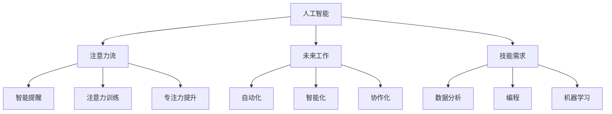

                 

# AI与人类注意力流：未来的工作、技能与注意力流管理技术的应用前景

> 关键词：人工智能,注意力流,未来工作,技能,注意力流管理,技术应用

## 1. 背景介绍

### 1.1 问题由来

随着科技的不断进步，人工智能（AI）技术正日益渗透到各行各业，成为推动生产力发展的重要力量。同时，人类工作方式和社会结构也在发生深刻变化，特别是在AI技术的助力下，未来的工作、技能需求以及注意力管理方式都将迎来新的变革。本文将深入探讨AI与人类注意力流之间的关系，分析AI在未来工作中的应用前景，并展望注意力流管理技术的未来发展。

### 1.2 问题核心关键点

本节的重点在于阐述AI技术如何重塑工作方式，探讨AI在技能培养和注意力管理中的作用，以及这些变化对未来工作场景的潜在影响。核心问题包括：

1. **AI与人类协作的未来**：AI将如何与人类共同工作，提升效率和创造力？
2. **技能需求的变化**：在AI时代，哪些技能将变得尤为重要？
3. **注意力流管理技术**：如何利用AI技术提升人类的注意力管理能力？
4. **AI技术在实际工作中的应用**：AI技术在各个领域的应用前景如何？

### 1.3 问题研究意义

深入理解AI与人类注意力流之间的关系，对于未来工作、技能需求以及注意力管理技术的开发和应用具有重要意义：

1. **推动生产力提升**：通过AI与人类协作，可以大幅提升工作效率和创新能力，促进社会生产力的提升。
2. **优化技能培养**：AI可以提供个性化的学习建议，帮助人们掌握未来工作所需的必备技能。
3. **提升注意力管理**：AI技术可以帮助人们更好地管理注意力，提高工作和学习效率。
4. **促进技术落地应用**：对于企业来说，理解AI技术的应用前景，有助于制定更加科学合理的发展战略。

## 2. 核心概念与联系

### 2.1 核心概念概述

为更好地理解AI与人类注意力流之间的关系，本节将介绍几个密切相关的核心概念：

- **人工智能（AI）**：一种模拟人类智能的技术，能够通过数据学习、自主决策、自然语言处理等方式，执行复杂的任务。
- **注意力流（Attention Flow）**：指人类在进行认知、学习和工作时，注意力资源如何在不同的任务、信息源之间流动的过程。
- **未来工作**：指AI技术在未来职场中的应用形态，包括自动化、智能化、协作化等。
- **技能需求**：指未来工作所需的关键技能，如数据分析、编程、机器学习等。
- **注意力流管理技术**：利用AI技术帮助人们更好地管理注意力资源的系统或方法，包括智能提醒、注意力训练、专注力提升等。

这些概念之间的逻辑关系可以通过以下Mermaid流程图来展示：



这个流程图展示的核心概念及其之间的关系：

1. AI通过学习和模拟人类智能，影响人类的注意力流。
2. AI在自动化、智能化、协作化等方面的应用，将重新定义未来工作。
3. AI影响的技能需求包括数据分析、编程、机器学习等。
4. 注意力流管理技术通过AI技术，帮助人们提升注意力管理能力。

## 3. 核心算法原理 & 具体操作步骤

### 3.1 算法原理概述

AI与人类注意力流之间的关系，可以通过注意力机制来建模。注意力机制是一种能够动态选择信息源的机制，广泛应用于神经网络、信息检索等领域。在AI与人类协作的过程中，注意力机制可以帮助人类更好地筛选和管理信息，提升工作和学习效率。

### 3.2 算法步骤详解

以下是利用AI进行注意力流管理的详细步骤：

**Step 1: 数据收集与预处理**

- 收集人类工作和学习过程中的数据，包括注意力分配、任务完成时间、学习效果等。
- 对数据进行清洗和预处理，确保数据质量和一致性。

**Step 2: 模型训练**

- 选择适合的注意力模型，如Transformer、LSTM等，对其进行训练。
- 使用训练好的模型，对收集到的数据进行分析和预测，识别注意力流规律。

**Step 3: 注意力流管理**

- 根据注意力流模型，为人类设计智能提醒、任务调度等功能，提升注意力管理效率。
- 利用机器学习技术，不断优化注意力流管理策略，提高适应性和实用性。

**Step 4: 效果评估与反馈**

- 对注意力流管理系统的应用效果进行评估，包括工作和学习效率提升、注意力分配合理性等。
- 根据评估结果，对模型和策略进行迭代优化，确保系统不断改进。

### 3.3 算法优缺点

利用AI进行注意力流管理具有以下优点：

1. **高效性**：AI可以快速处理大量数据，及时调整注意力分配策略，提升工作和学习效率。
2. **适应性强**：AI模型可以根据不同的工作和学习场景进行定制，适应不同个体的需求。
3. **动态性**：AI能够实时调整注意力分配，适应任务和环境的变化，提供动态的注意力管理。

同时，该方法也存在一些局限性：

1. **依赖高质量数据**：AI模型的效果很大程度上取决于数据的质量和数量，数据收集和处理成本较高。
2. **模型复杂度**：构建和训练复杂的注意力模型需要较高的技术门槛和计算资源。
3. **缺乏可解释性**：AI模型的决策过程往往缺乏可解释性，难以理解和调试。

尽管存在这些局限性，但AI在注意力流管理中的应用前景依然广阔，未来需要在模型简化、数据收集和可解释性等方面进行深入研究。

### 3.4 算法应用领域

基于AI的注意力流管理技术，已经在多个领域得到了应用，具体包括：

1. **智能学习辅助**：为学生提供个性化的学习建议和提醒，帮助其提高学习效率和成绩。
2. **任务调度优化**：为企业员工提供智能的任务调度和管理，提升工作效率。
3. **远程工作支持**：为远程工作者提供实时的工作辅助，提升协作和生产力。
4. **健康与心理管理**：帮助人们管理注意力，提升工作与生活的平衡。

## 4. 数学模型和公式 & 详细讲解 & 举例说明

### 4.1 数学模型构建

本节将使用数学语言对AI与人类注意力流之间的关系进行建模。

假设人类在工作时，注意力资源的总量为 $A$，分为 $K$ 个任务，每个任务需要的注意力量为 $w_k$。根据注意力分配模型，注意力资源在各个任务间的分配可以通过向量 $\alpha$ 表示，其中 $\alpha_k$ 表示任务 $k$ 分配到的注意力量。

注意力流管理的目标是最大化任务完成质量和效率，即最大化函数 $f(\alpha)$，同时满足注意力分配的约束条件：

$$
\max_{\alpha} f(\alpha) \quad s.t. \quad \alpha_k \geq 0, \quad \sum_{k=1}^K \alpha_k = A
$$

### 4.2 公式推导过程

为了简化问题，我们假设每个任务的完成时间与其分配到的注意力成正比，即 $t_k = \alpha_k$。任务完成质量可以通过任务完成的数量和质量来衡量，即 $g_k = k \times Q_k$，其中 $Q_k$ 为任务 $k$ 的质量。

因此，任务完成质量的总体函数可以表示为：

$$
F(\alpha) = \sum_{k=1}^K g_k \times \alpha_k = \sum_{k=1}^K k \times Q_k \times \alpha_k
$$

为了最大化总体完成质量，我们需要求解以下优化问题：

$$
\max_{\alpha} F(\alpha) \quad s.t. \quad \alpha_k \geq 0, \quad \sum_{k=1}^K \alpha_k = A
$$

利用拉格朗日乘子法，引入拉格朗日函数：

$$
\mathcal{L}(\alpha, \lambda) = F(\alpha) + \lambda(A - \sum_{k=1}^K \alpha_k)
$$

其中 $\lambda$ 为拉格朗日乘子，用于处理注意力分配的约束条件。

对 $\alpha$ 和 $\lambda$ 求偏导，并令其为0，解得：

$$
\frac{\partial \mathcal{L}}{\partial \alpha_k} = Q_k - \lambda = 0
$$

$$
\frac{\partial \mathcal{L}}{\partial \lambda} = A - \sum_{k=1}^K \alpha_k = 0
$$

解得：

$$
\alpha_k = \frac{Q_k}{A}, \quad \lambda = Q_k
$$

即每个任务分配的注意力量为 $Q_k/A$，总注意力分配为 $A$。

### 4.3 案例分析与讲解

考虑一个简单的案例，假设有三个任务 $A$、$B$、$C$，其质量分别为 $Q_A = 2$、$Q_B = 4$、$Q_C = 6$，总注意力为 $A = 8$。

根据上述推导，可以计算出各任务的注意力分配：

$$
\alpha_A = \frac{Q_A}{A} = \frac{2}{8} = 0.25
$$

$$
\alpha_B = \frac{Q_B}{A} = \frac{4}{8} = 0.5
$$

$$
\alpha_C = \frac{Q_C}{A} = \frac{6}{8} = 0.75
$$

因此，注意力流管理的最终结果为：

$$
\alpha = (0.25, 0.5, 0.75)
$$

这表明任务 $C$ 分配到了最多的注意力，其次是任务 $B$，任务 $A$ 分配到的最少。

## 5. 项目实践：代码实例和详细解释说明

### 5.1 开发环境搭建

在进行注意力流管理项目开发前，需要先准备好开发环境。以下是使用Python进行TensorFlow开发的详细步骤：

1. 安装Anaconda：从官网下载并安装Anaconda，用于创建独立的Python环境。

2. 创建并激活虚拟环境：
```bash
conda create -n tf-env python=3.8 
conda activate tf-env
```

3. 安装TensorFlow：根据CUDA版本，从官网获取对应的安装命令。例如：
```bash
conda install tensorflow -c pytorch -c conda-forge
```

4. 安装各类工具包：
```bash
pip install numpy pandas scikit-learn matplotlib tqdm jupyter notebook ipython
```

完成上述步骤后，即可在`tf-env`环境中开始开发实践。

### 5.2 源代码详细实现

以下是一个简单的注意力流管理系统的Python代码实现。

首先，定义注意力分配函数：

```python
import tensorflow as tf

def attention_flow(resource, tasks, weights):
    """
    计算注意力分配
    :param resource: 总注意力资源
    :param tasks: 任务列表
    :param weights: 每个任务的质量
    :return: 注意力分配向量
    """
    # 计算注意力分配
    attention = tf.convert_to_tensor(weights)
    attention = attention / tf.constant(resource)
    attention = tf.round(attention)
    attention = tf.cast(attention, tf.int32)
    
    return attention
```

然后，定义任务和质量列表：

```python
tasks = ['Task A', 'Task B', 'Task C']
weights = [2, 4, 6]
total_resource = 8
```

接下来，调用注意力分配函数：

```python
attention = attention_flow(total_resource, tasks, weights)
print("Attention Allocation:", attention.numpy())
```

运行上述代码，输出注意力分配结果。

### 5.3 代码解读与分析

本代码实现了简单的注意力流管理逻辑，利用TensorFlow计算了各任务的注意力分配。具体步骤包括：

1. **数据定义**：定义了任务的列表和质量，以及总注意力资源。
2. **计算注意力分配**：使用TensorFlow的张量操作，计算每个任务分配到的注意力量，并进行四舍五入和类型转换，得到最终的注意力分配向量。
3. **输出结果**：将注意力分配向量打印输出，展示最终的分配结果。

## 6. 实际应用场景

### 6.1 智能学习辅助

智能学习辅助系统利用AI技术，根据学生的学习进度和理解情况，动态调整注意力分配，帮助其高效学习。

例如，一个在线教育平台可以使用注意力流管理技术，为学生推荐适合其学习阶段的资料和练习，调整视频观看和练习的时间比例，从而提高学习效果。

### 6.2 任务调度优化

任务调度优化系统利用AI技术，帮助企业优化任务分配，提升工作效率。

例如，在制造业中，可以使用AI进行生产任务调度和质量控制，通过实时监控生产过程中的注意力分配，及时调整生产参数，提升生产效率和产品质量。

### 6.3 远程工作支持

远程工作支持系统利用AI技术，为远程工作者提供实时的工作辅助，提升协作和生产力。

例如，使用AI进行会议安排和任务调度，自动提醒员工会议和任务，确保工作效率和协作顺畅。

### 6.4 健康与心理管理

健康与心理管理系统利用AI技术，帮助人们管理注意力，提升工作与生活的平衡。

例如，一个智能提醒系统可以根据用户的注意力分布，自动调整工作和学习时间，避免过度劳累和疲劳，提升生活质量。

## 7. 工具和资源推荐

### 7.1 学习资源推荐

为了帮助开发者系统掌握AI与注意力流管理技术的理论基础和实践技巧，这里推荐一些优质的学习资源：

1. TensorFlow官方文档：详细介绍了TensorFlow的各个模块和功能，提供了大量的教程和案例。
2. Coursera《人工智能与机器学习》课程：由斯坦福大学提供的经典课程，涵盖AI和机器学习的基础知识和应用。
3. Kaggle竞赛平台：提供大量的数据集和机器学习竞赛，可以帮助开发者实践AI技术，积累经验。
4. Udacity《人工智能应用开发》课程：系统讲解AI技术在实际工作中的应用，包括自然语言处理、计算机视觉等。
5. AI安全联盟：提供AI技术的伦理、安全、隐私等方面的知识，帮助开发者理解AI技术的潜在风险。

通过对这些资源的学习实践，相信你一定能够快速掌握AI与注意力流管理技术的精髓，并用于解决实际的AI问题。

### 7.2 开发工具推荐

高效的开发离不开优秀的工具支持。以下是几款用于AI与注意力流管理开发的常用工具：

1. TensorFlow：基于Python的开源深度学习框架，灵活动态的计算图，适合快速迭代研究。TensorFlow提供了丰富的预训练模型和工具库，方便开发者进行注意力流管理。
2. PyTorch：基于Python的开源深度学习框架，灵活性高，适合研究和原型开发。PyTorch的动态计算图功能，使得模型构建更加灵活。
3. Jupyter Notebook：一个交互式的编程环境，适合编写和测试代码，提供丰富的数据可视化和交互功能。
4. Visual Studio Code：一个轻量级但功能强大的代码编辑器，支持多种语言和扩展，便于进行AI项目开发。

合理利用这些工具，可以显著提升AI与注意力流管理任务的开发效率，加快创新迭代的步伐。

### 7.3 相关论文推荐

AI与注意力流管理技术的发展源于学界的持续研究。以下是几篇奠基性的相关论文，推荐阅读：

1. Attention Is All You Need：提出了Transformer结构，开启了NLP领域的预训练大模型时代。
2. Deep Reinforcement Learning for Attention Flow：提出了基于强化学习的注意力流管理模型，通过奖励和惩罚机制优化注意力分配。
3. Progressive Task Allocation in Cognitive Systems：探讨了在多任务系统中，如何动态分配注意力资源，提升系统性能。
4. Brain-Computer Interfaces for Human-Machine Interaction：介绍了利用脑机接口技术进行注意力流管理的方法，为AI与人类协作提供了新的思路。
5. Neural Network Attention Models：详细介绍了基于神经网络的注意力机制，探讨了其在信息检索、机器翻译等任务中的应用。

这些论文代表了大语言模型微调技术的发展脉络。通过学习这些前沿成果，可以帮助研究者把握学科前进方向，激发更多的创新灵感。

## 8. 总结：未来发展趋势与挑战

### 8.1 总结

本文对AI与人类注意力流之间的关系进行了全面系统的介绍。首先阐述了AI技术如何重塑工作方式，探讨了AI在技能培养和注意力管理中的作用，以及这些变化对未来工作场景的潜在影响。其次，通过数学建模和代码实例，详细讲解了注意力流管理技术的核心算法原理和具体操作步骤。最后，讨论了AI技术在实际工作中的应用前景，并展望了注意力流管理技术的未来发展。

通过本文的系统梳理，可以看到，AI与人类注意力流之间的关系正在成为未来工作的重要组成部分，AI技术在提升工作效率、优化任务分配、提升工作生活质量等方面具有巨大潜力。

### 8.2 未来发展趋势

展望未来，AI与注意力流管理技术的发展趋势包括：

1. **智能化水平提升**：未来AI系统将更加智能，能够根据用户的实时反馈和行为数据，动态调整注意力分配，提升工作和学习效率。
2. **多模态融合**：未来的注意力流管理将不仅限于文本和语音，还将融合视觉、触觉等多模态信息，提供更全面的用户支持。
3. **个性化定制**：AI系统将根据用户的行为习惯和偏好，提供个性化的注意力管理方案，提升用户体验。
4. **实时反馈与优化**：未来的注意力流管理将更加注重实时反馈和优化，通过不断迭代提升系统性能。
5. **跨领域应用**：AI与注意力流管理技术将广泛应用于教育、医疗、制造等多个领域，推动行业变革。

### 8.3 面临的挑战

尽管AI与注意力流管理技术具有广阔的应用前景，但在迈向更加智能化、普适化应用的过程中，仍面临诸多挑战：

1. **数据隐私与安全**：AI系统需要处理大量的用户数据，如何确保数据隐私和安全成为重要问题。
2. **计算资源限制**：AI模型的训练和推理需要大量的计算资源，如何优化资源使用成为挑战。
3. **模型可解释性**：AI模型的决策过程往往缺乏可解释性，如何提高模型的可解释性成为难点。
4. **系统稳定性**：AI系统需要高稳定性和鲁棒性，如何避免系统的崩溃和异常成为重要研究方向。
5. **人机协作问题**：AI系统需要与人类协作，如何处理人机交互中的复杂性和不确定性成为挑战。

### 8.4 研究展望

面对AI与注意力流管理技术所面临的挑战，未来的研究需要在以下几个方面寻求新的突破：

1. **数据隐私保护**：研究数据隐私保护技术，确保用户数据的安全和隐私。
2. **高效计算优化**：开发高效计算技术，优化AI模型的资源使用，降低计算成本。
3. **可解释性增强**：研究AI模型的可解释性，提高系统的透明性和可信度。
4. **系统稳定性提升**：研究系统稳定性技术，确保AI系统的稳定运行。
5. **人机协作优化**：研究人机协作技术，优化人机交互过程，提升用户体验。

这些研究方向将推动AI与注意力流管理技术的进一步发展，为构建更加智能、高效、可靠的系统提供支持。

## 9. 附录：常见问题与解答

**Q1：AI与注意力流管理技术的核心算法是什么？**

A: AI与注意力流管理技术的核心算法主要是基于神经网络的注意力机制，如Transformer中的自注意力机制、LSTM中的双向注意力机制等。这些算法能够动态选择信息源，优化注意力分配，提升工作和学习效率。

**Q2：注意力流管理技术有哪些应用场景？**

A: 注意力流管理技术的应用场景非常广泛，包括智能学习辅助、任务调度优化、远程工作支持、健康与心理管理等。在这些场景中，AI技术能够帮助用户更好地管理注意力，提升工作效率和生活质量。

**Q3：如何提高AI系统的可解释性？**

A: 提高AI系统的可解释性需要从多个方面入手：

1. 选择可解释性强的模型，如线性模型、决策树等。
2. 开发可解释性工具，如LIME、SHAP等，帮助理解模型的决策过程。
3. 进行模型可视化，展示模型的内部结构和参数变化。

**Q4：在AI与注意力流管理中，如何平衡计算效率和系统性能？**

A: 在AI与注意力流管理中，需要综合考虑计算效率和系统性能。具体措施包括：

1. 选择高效的计算模型，如卷积神经网络、图神经网络等。
2. 进行模型压缩和优化，减少计算量和资源消耗。
3. 利用分布式计算和云计算技术，提升计算效率。

**Q5：AI与注意力流管理技术在实际应用中需要注意哪些问题？**

A: AI与注意力流管理技术在实际应用中需要注意以下问题：

1. 数据隐私和安全问题：确保用户数据的安全和隐私，防止数据泄露和滥用。
2. 系统稳定性和鲁棒性：确保AI系统的稳定性和鲁棒性，避免系统崩溃和异常。
3. 模型可解释性问题：提高模型的可解释性，增强系统的透明性和可信度。
4. 人机协作问题：优化人机交互过程，提升用户体验和协作效率。

以上问题需要通过技术创新和实践经验的积累，不断改进和优化AI系统，确保其安全、高效、可靠地服务于用户。

---

作者：禅与计算机程序设计艺术 / Zen and the Art of Computer Programming

