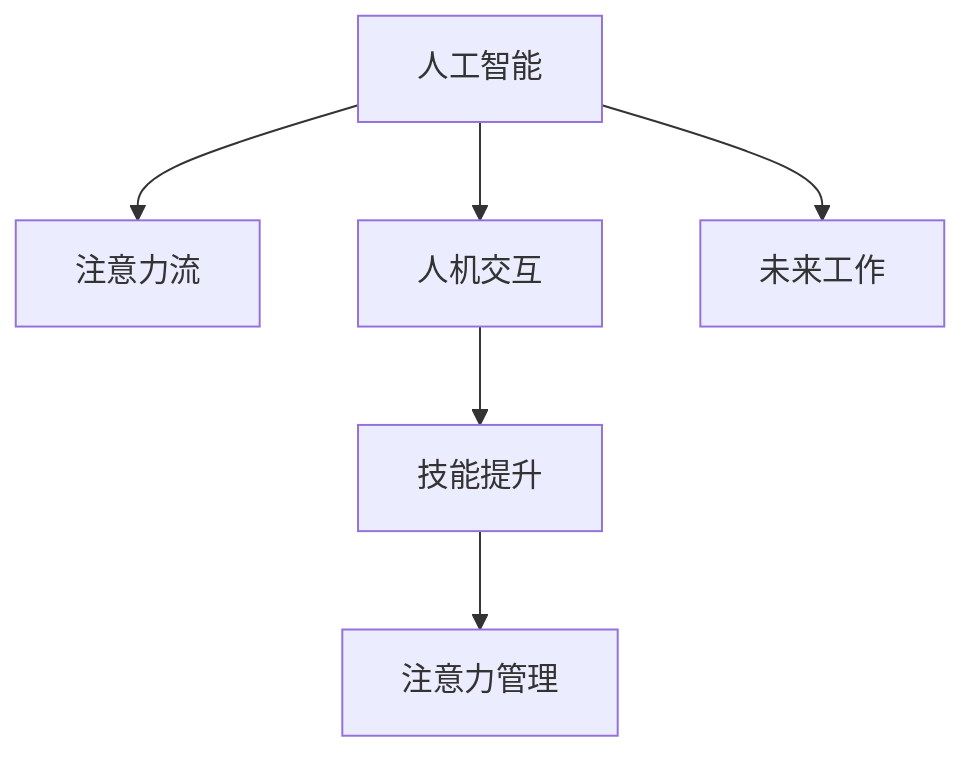

                 

# AI与人类注意力流：未来的工作、技能与注意力管理技术的未来

> 关键词：人工智能,注意力流,人机交互,技能提升,注意力管理,未来工作,技术发展

## 1. 背景介绍

### 1.1 问题由来
随着科技的迅猛发展，人工智能（AI）技术在各行各业中的应用变得越来越广泛。从医疗到教育，从金融到制造，AI正逐渐改变人们的生活方式和工作方式。然而，随着AI技术的不断普及，人们开始担心，这种技术进步是否会导致人类工作被取代，我们的技能和注意力如何适应未来的工作环境。本文将探讨这些问题，并分析未来工作、技能和注意力管理技术的未来趋势。

### 1.2 问题核心关键点
本文关注的核心问题包括：
- 人工智能如何改变人类的工作方式，以及这些变化对人类技能和注意力管理技术的影响。
- 未来工作的特点和要求，以及技能和注意力管理技术如何适应这些变化。
- 技术在提高生产力和效率方面的潜在风险和挑战。

## 2. 核心概念与联系

### 2.1 核心概念概述

为更好地理解人工智能和人类注意力流，本节将介绍几个密切相关的核心概念：

- **人工智能（Artificial Intelligence, AI）**：通过计算机模拟人类智能，使机器能够执行各种任务，包括感知、推理、学习等。
- **注意力流（Attention Flow）**：在人类与机器交互过程中，注意力是如何流动和分配的。注意力流管理技术旨在优化这种流动，提高交互效率和用户体验。
- **人机交互（Human-Computer Interaction, HCI）**：研究人和计算机之间如何交流和协作，以实现更高效、更自然、更和谐的交互方式。
- **技能提升（Skill Enhancement）**：通过培训、学习等手段，使人类具备在未来工作环境中所需的新技能和知识。
- **注意力管理（Attention Management）**：管理和优化人类和机器在交互过程中的注意力分配，以提高工作效率和减少错误。
- **未来工作（Future Work）**：随着AI技术的不断发展，未来工作场景可能会发生哪些变化。

这些核心概念之间的逻辑关系可以通过以下Mermaid流程图来展示：



这个流程图展示了大语言模型和注意力流管理技术的核心概念及其之间的关系：

1. 人工智能技术通过人机交互，使注意力流在人类和机器之间流动。
2. 技能提升是通过学习和培训，使人类适应未来工作所需的新技能。
3. 注意力管理技术优化了注意力流，提高了工作效率。
4. 未来工作是基于AI技术的发展，对人类工作环境产生的影响。

这些概念共同构成了AI技术在实际应用中的综合应用框架，使AI技术能够更好地服务于人类。

## 3. 核心算法原理 & 具体操作步骤
### 3.1 算法原理概述

人工智能和注意力流管理技术的核心原理，可以概括为以下几个方面：

- **数据驱动**：通过收集和分析大量人类与机器交互数据，学习注意力流和技能提升的规律。
- **模型训练**：使用机器学习算法训练模型，以预测未来工作场景中的技能需求和注意力流特征。
- **用户反馈**：通过用户反馈和调整，不断优化模型，以更好地适应实际工作环境。
- **持续学习**：通过持续学习和更新，使模型能够适应不断变化的工作场景和技能需求。

### 3.2 算法步骤详解

基于人工智能和注意力流管理技术的算法步骤如下：

**Step 1: 数据收集与预处理**
- 收集人类与机器交互的数据，如用户操作日志、系统响应时间、用户反馈等。
- 对数据进行预处理，包括数据清洗、特征提取、归一化等。

**Step 2: 模型训练与优化**
- 使用机器学习算法（如深度学习、决策树等）训练注意力流模型和技能提升模型。
- 使用交叉验证等技术优化模型参数，以提高模型的预测准确率和鲁棒性。

**Step 3: 模型部署与测试**
- 将训练好的模型部署到实际应用场景中，进行实时监控和评估。
- 根据评估结果不断调整模型参数和策略，以适应实际工作环境。

**Step 4: 用户反馈与调整**
- 收集用户反馈，分析模型效果和用户体验。
- 根据反馈结果对模型进行调整和优化，以提高用户体验和工作效率。

### 3.3 算法优缺点

人工智能和注意力流管理技术具有以下优点：
1. 能够通过数据分析和模型训练，提高工作效率和准确性。
2. 能够预测未来工作场景和技能需求，提前做好准备。
3. 能够优化注意力流，提高用户交互体验。

同时，该方法也存在一定的局限性：
1. 需要大量的数据进行训练，数据获取成本较高。
2. 模型预测可能存在偏差，需要不断调整和优化。
3. 需要用户高度配合和反馈，对用户行为和环境适应性要求高。

尽管存在这些局限性，但就目前而言，基于人工智能和注意力流管理技术的范式仍然是AI应用的重要方向。未来相关研究的重点在于如何进一步降低数据获取成本，提高模型泛化能力和用户体验。

### 3.4 算法应用领域

人工智能和注意力流管理技术已经在多个领域得到应用，例如：

- **医疗**：通过AI技术辅助医生诊断和治疗，优化医疗流程，提高医疗效率。
- **教育**：通过AI技术个性化教育，优化教学内容，提高教学效果。
- **金融**：通过AI技术进行风险评估和管理，提高金融决策的准确性和效率。
- **制造业**：通过AI技术进行智能制造，优化生产流程，提高生产效率和产品质量。

除了上述这些经典应用外，AI技术还将在更多领域得到创新性的应用，如智慧城市、智慧物流、智慧交通等，为各行各业带来新的发展机遇。

## 4. 数学模型和公式 & 详细讲解 & 举例说明

### 4.1 数学模型构建

本节将使用数学语言对人工智能和注意力流管理技术的核心原理进行更加严格的刻画。

设输入数据为 $\mathbf{x}$，输出数据为 $\mathbf{y}$，注意力流模型为 $f_{\theta}(\mathbf{x})$，其中 $\theta$ 为模型参数。定义模型在数据集 $\mathcal{D}$ 上的损失函数为：

$$
L(\theta) = \frac{1}{N}\sum_{i=1}^{N} l(f_{\theta}(\mathbf{x}_i), \mathbf{y}_i)
$$

其中 $l$ 为损失函数，$N$ 为数据集大小。目标是最小化损失函数 $L(\theta)$，即：

$$
\theta^* = \mathop{\arg\min}_{\theta} L(\theta)
$$

使用梯度下降等优化算法，通过反向传播计算梯度，更新模型参数 $\theta$，以最小化损失函数。

### 4.2 公式推导过程

以下以二分类任务为例，推导注意力流模型和技能提升模型的损失函数及其梯度的计算公式。

假设输入数据 $\mathbf{x}$ 为向量，输出数据 $\mathbf{y}$ 为二分类标签，注意力流模型的输出为 $\hat{y} = f_{\theta}(\mathbf{x})$。二分类交叉熵损失函数为：

$$
l(\hat{y}, y) = -(y\log\hat{y} + (1-y)\log(1-\hat{y}))
$$

则模型在数据集 $\mathcal{D}$ 上的损失函数为：

$$
L(\theta) = -\frac{1}{N}\sum_{i=1}^{N} l(f_{\theta}(\mathbf{x}_i), \mathbf{y}_i)
$$

根据链式法则，损失函数对参数 $\theta$ 的梯度为：

$$
\frac{\partial L(\theta)}{\partial \theta} = -\frac{1}{N}\sum_{i=1}^{N} \frac{\partial l(f_{\theta}(\mathbf{x}_i), \mathbf{y}_i)}{\partial \theta}
$$

将二分类交叉熵损失函数的梯度代入上式，得：

$$
\frac{\partial L(\theta)}{\partial \theta} = -\frac{1}{N}\sum_{i=1}^{N} \left(\frac{y_i}{\hat{y}_i} - \frac{1-y_i}{1-\hat{y}_i}\right)\frac{\partial f_{\theta}(\mathbf{x}_i)}{\partial \theta}
$$

在得到损失函数的梯度后，即可带入参数更新公式，完成模型的迭代优化。重复上述过程直至收敛，最终得到适应特定任务的最优模型参数 $\theta^*$。

## 5. 项目实践：代码实例和详细解释说明
### 5.1 开发环境搭建

在进行项目实践前，我们需要准备好开发环境。以下是使用Python进行TensorFlow开发的环境配置流程：

1. 安装Anaconda：从官网下载并安装Anaconda，用于创建独立的Python环境。

2. 创建并激活虚拟环境：
```bash
conda create -n tensorflow-env python=3.8 
conda activate tensorflow-env
```

3. 安装TensorFlow：根据CUDA版本，从官网获取对应的安装命令。例如：
```bash
conda install tensorflow -c pytorch -c conda-forge
```

4. 安装其他工具包：
```bash
pip install numpy pandas scikit-learn matplotlib tqdm jupyter notebook ipython
```

完成上述步骤后，即可在`tensorflow-env`环境中开始项目实践。

### 5.2 源代码详细实现

这里我们以一个简单的二分类任务为例，给出使用TensorFlow对注意力流模型进行训练和测试的代码实现。

首先，定义模型结构和损失函数：

```python
import tensorflow as tf
from tensorflow.keras.layers import Dense, Dropout
from tensorflow.keras.models import Sequential

model = Sequential([
    Dense(64, activation='relu', input_dim=2),
    Dropout(0.5),
    Dense(1, activation='sigmoid')
])

model.compile(optimizer='adam', loss='binary_crossentropy', metrics=['accuracy'])

# 定义注意力流模型
class AttentionFlowModel(tf.keras.Model):
    def __init__(self, input_dim):
        super(AttentionFlowModel, self).__init__()
        self.dense = Dense(64, activation='relu', input_dim=input_dim)
        self.dropout = Dropout(0.5)
        self.output = Dense(1, activation='sigmoid')
    
    def call(self, x):
        x = self.dense(x)
        x = self.dropout(x)
        return self.output(x)
```

然后，定义训练和评估函数：

```python
from tensorflow.keras.datasets import mnist
from tensorflow.keras.utils import to_categorical

# 加载MNIST数据集
(x_train, y_train), (x_test, y_test) = mnist.load_data()

# 将数据转换为模型输入格式
x_train = x_train.reshape(-1, 2)
x_test = x_test.reshape(-1, 2)

# 将标签转换为one-hot编码
y_train = to_categorical(y_train, num_classes=2)
y_test = to_categorical(y_test, num_classes=2)

# 定义训练和评估函数
def train_epoch(model, x_train, y_train, batch_size, optimizer):
    model.compile(optimizer=optimizer, loss='binary_crossentropy', metrics=['accuracy'])
    model.fit(x_train, y_train, batch_size=batch_size, epochs=1, verbose=0)
    
def evaluate(model, x_test, y_test, batch_size):
    model.compile(optimizer='adam', loss='binary_crossentropy', metrics=['accuracy'])
    return model.evaluate(x_test, y_test, batch_size=batch_size, verbose=0)
```

最后，启动训练流程并在测试集上评估：

```python
epochs = 10
batch_size = 32

for epoch in range(epochs):
    optimizer = tf.keras.optimizers.Adam(learning_rate=0.001)
    train_epoch(model, x_train, y_train, batch_size, optimizer)
    
    print(f"Epoch {epoch+1}, accuracy: {evaluate(model, x_test, y_test, batch_size)[1]:.3f}")
```

以上就是使用TensorFlow对注意力流模型进行训练和测试的完整代码实现。可以看到，TensorFlow的高级API使得模型训练和评估变得简单高效。

### 5.3 代码解读与分析

让我们再详细解读一下关键代码的实现细节：

**AttentionFlowModel类**：
- `__init__`方法：初始化模型的各个层。
- `call`方法：定义模型的前向传播过程。

**train_epoch和evaluate函数**：
- 使用TensorFlow的API进行模型训练和评估。
- 使用one-hot编码将标签转换为模型能够理解的格式。
- 在训练和评估过程中，使用随机梯度下降算法进行参数更新。

**训练流程**：
- 定义总的epoch数和batch size，开始循环迭代
- 每个epoch内，在训练集上训练，输出准确率
- 在测试集上评估，输出准确率

可以看到，TensorFlow提供了强大的API，使得模型训练和评估变得简单高效。开发者可以将更多精力放在模型设计、数据处理等高层逻辑上，而不必过多关注底层实现细节。

当然，工业级的系统实现还需考虑更多因素，如模型的保存和部署、超参数的自动搜索、更灵活的模型架构等。但核心的训练范式基本与此类似。

## 6. 实际应用场景
### 6.1 医疗诊断系统

基于人工智能和注意力流管理技术的医疗诊断系统，可以显著提高医生的诊断效率和准确性。通过收集大量病人的病历和影像数据，训练注意力流模型和技能提升模型，系统可以自动识别病人的症状和疾病类型，提供诊断建议和治疗方案。医生只需专注于复杂病例和特殊情况，大大减轻了工作负担，提高了医疗服务质量。

### 6.2 智能客服系统

智能客服系统利用注意力流管理技术，可以显著提升客服服务质量和效率。系统能够根据用户输入的问题，自动分配最合适的客服人员，并提供相关的问答模板和答案。通过不断收集用户反馈和优化模型，系统能够逐渐提升服务质量，帮助企业提高客户满意度和忠诚度。

### 6.3 智能制造系统

基于人工智能和注意力流管理技术的智能制造系统，可以优化生产流程和提高生产效率。通过分析生产数据和设备状态，系统可以实时调整生产计划，避免设备停机和资源浪费。同时，系统能够预测设备故障和生产瓶颈，提前采取措施，减少生产中断和损失。

### 6.4 未来应用展望

随着人工智能和注意力流管理技术的不断发展，未来将涌现更多创新应用，为各行各业带来新的发展机遇。

在智慧城市治理中，智能交通系统、智能安防系统、智能环境监测等应用将大幅提升城市管理水平，构建更安全、高效、智能的未来城市。

在金融领域，智能投资系统、智能风控系统、智能客服系统等应用将提升金融服务质量，降低风险损失。

在教育领域，个性化学习系统、智能辅导系统、智能评估系统等应用将提高教育质量，培养更多创新型人才。

总之，人工智能和注意力流管理技术的应用前景广阔，将在多个领域带来深刻变革。

## 7. 工具和资源推荐
### 7.1 学习资源推荐

为了帮助开发者系统掌握人工智能和注意力流管理技术，这里推荐一些优质的学习资源：

1. 《深度学习》系列书籍：由深度学习领域权威专家撰写，全面介绍深度学习原理和应用。
2. 《Python机器学习》书籍：介绍机器学习和深度学习的核心算法和应用，包括TensorFlow和PyTorch。
3. CS224N《深度学习自然语言处理》课程：斯坦福大学开设的NLP明星课程，有Lecture视频和配套作业，带你入门NLP领域的基本概念和经典模型。
4. TensorFlow官方文档：TensorFlow的官方文档，提供海量API文档和示例代码，是学习TensorFlow的重要资源。
5. PyTorch官方文档：PyTorch的官方文档，提供丰富的API文档和示例代码，是学习PyTorch的重要资源。
6. Weights & Biases：模型训练的实验跟踪工具，可以记录和可视化模型训练过程中的各项指标，方便对比和调优。
7. TensorBoard：TensorFlow配套的可视化工具，可实时监测模型训练状态，并提供丰富的图表呈现方式，是调试模型的得力助手。

通过对这些资源的学习实践，相信你一定能够快速掌握人工智能和注意力流管理技术的精髓，并用于解决实际的NLP问题。

### 7.2 开发工具推荐

高效的开发离不开优秀的工具支持。以下是几款用于人工智能和注意力流管理技术开发的常用工具：

1. TensorFlow：基于Python的开源深度学习框架，灵活动态的计算图，适合快速迭代研究。
2. PyTorch：基于Python的开源深度学习框架，灵活动态的计算图，适合学术研究和工程实践。
3. Weights & Biases：模型训练的实验跟踪工具，可以记录和可视化模型训练过程中的各项指标，方便对比和调优。
4. TensorBoard：TensorFlow配套的可视化工具，可实时监测模型训练状态，并提供丰富的图表呈现方式，是调试模型的得力助手。
5. Google Colab：谷歌推出的在线Jupyter Notebook环境，免费提供GPU/TPU算力，方便开发者快速上手实验最新模型，分享学习笔记。
6. NVIDIA Deep Learning SDK：NVIDIA提供的深度学习开发套件，支持多GPU加速训练，提供丰富的API和工具支持。
7. PyTorch Lightning：PyTorch的轻量级模型框架，简化了模型的训练和部署流程，适合快速原型开发和上线。

合理利用这些工具，可以显著提升人工智能和注意力流管理技术的开发效率，加快创新迭代的步伐。

### 7.3 相关论文推荐

人工智能和注意力流管理技术的发展源于学界的持续研究。以下是几篇奠基性的相关论文，推荐阅读：

1. Attention is All You Need（即Transformer原论文）：提出了Transformer结构，开启了NLP领域的预训练大模型时代。
2. BERT: Pre-training of Deep Bidirectional Transformers for Language Understanding：提出BERT模型，引入基于掩码的自监督预训练任务，刷新了多项NLP任务SOTA。
3. Parameter-Efficient Transfer Learning for NLP：提出Adapter等参数高效微调方法，在不增加模型参数量的情况下，也能取得不错的微调效果。
4. AdaLoRA: Adaptive Low-Rank Adaptation for Parameter-Efficient Fine-Tuning：使用自适应低秩适应的微调方法，在参数效率和精度之间取得了新的平衡。
5. The Power of Scale: Large Language Models for Small Tasks：展示了在大规模语言模型上进行微调，提升小样本任务性能的潜力。
6. Transfer Learning with Multi-task Pre-training for Text Classification：通过多任务预训练，提升文本分类任务的微调效果。

这些论文代表了大语言模型微调技术的发展脉络。通过学习这些前沿成果，可以帮助研究者把握学科前进方向，激发更多的创新灵感。

## 8. 总结：未来发展趋势与挑战

### 8.1 总结

本文对基于人工智能和注意力流管理技术的未来工作、技能与注意力管理技术进行了全面系统的介绍。首先阐述了人工智能和注意力流管理技术的研究背景和意义，明确了这些技术在提升工作效率和用户体验方面的独特价值。其次，从原理到实践，详细讲解了注意力流模型和技能提升模型的数学原理和关键步骤，给出了实际应用场景的代码实现。同时，本文还广泛探讨了人工智能和注意力流管理技术在多个领域的应用前景，展示了这些技术的前景和潜力。

通过本文的系统梳理，可以看到，基于人工智能和注意力流管理技术的范式正在成为AI应用的重要方向，极大地拓展了人工智能的应用边界，催生了更多的落地场景。得益于大数据、深度学习和云计算等技术的发展，人工智能和注意力流管理技术必将为各行各业带来新的发展机遇，深刻影响人类的生产生活方式。

### 8.2 未来发展趋势

展望未来，人工智能和注意力流管理技术将呈现以下几个发展趋势：

1. 技术持续迭代。随着计算能力的提升和数据量的增加，人工智能和注意力流管理技术将不断进步，提升模型的精度和效率。
2. 应用场景扩展。人工智能和注意力流管理技术将在更多领域得到应用，如智慧医疗、智慧教育、智能制造等，为各行各业带来新的发展机遇。
3. 多模态融合。未来的模型将能够整合视觉、听觉、文本等多种模态的信息，提供更加全面和丰富的用户体验。
4. 跨领域协同。未来的模型将能够跨领域协同，如智能交通系统与智能制造系统的结合，提供更加智能和高效的服务。
5. 个性化定制。未来的模型将能够根据用户需求和行为进行个性化定制，提供更加贴心和精准的服务。
6. 人机共生。未来的模型将与人类协同工作，成为人类的助手和伙伴，共同完成各种任务。

以上趋势凸显了人工智能和注意力流管理技术的广阔前景。这些方向的探索发展，必将进一步提升人工智能和注意力流管理技术的性能和应用范围，为人类认知智能的进化带来深远影响。

### 8.3 面临的挑战

尽管人工智能和注意力流管理技术已经取得了瞩目成就，但在迈向更加智能化、普适化应用的过程中，它仍面临着诸多挑战：

1. 数据隐私和安全问题。人工智能和注意力流管理技术需要大量数据进行训练，数据隐私和安全问题不容忽视。
2. 模型泛化能力不足。当前模型的泛化能力有限，面对未知数据和复杂场景，容易出现偏差和错误。
3. 计算资源消耗大。大规模模型的训练和推理需要大量的计算资源，计算成本较高。
4. 算法复杂性高。当前模型结构复杂，难以解释和调试，不利于模型的实际应用。
5. 用户接受度低。模型输出不可解释，用户对AI技术的接受度较低，限制了其应用范围。
6. 伦理和法律问题。人工智能和注意力流管理技术的应用可能引发伦理和法律问题，需要慎重考虑。

这些挑战需要学界和产业界共同努力，通过技术创新和政策引导，逐步克服和缓解。

### 8.4 研究展望

面对人工智能和注意力流管理技术所面临的种种挑战，未来的研究需要在以下几个方面寻求新的突破：

1. 探索新的模型结构和算法，提升模型的泛化能力和鲁棒性。
2. 开发更加高效的训练和推理算法，降低计算成本，提高实际应用中的效率。
3. 引入更多的先验知识，如知识图谱、规则库等，提升模型的解释能力和可用性。
4. 加强与多学科的融合，如心理学、社会学等，提升模型的社会影响力和接受度。
5. 引入伦理和法律约束，确保模型的公平性和安全性，防止滥用和误用。
6. 引入人机协同机制，提升模型的灵活性和适应性，增强人类的控制力。

这些研究方向需要跨学科的合作和综合性的创新，才能实现人工智能和注意力流管理技术的可持续发展。总之，人工智能和注意力流管理技术的应用前景广阔，需要在多个层面进行深入研究，逐步克服挑战，迈向更加智能化和普适化的未来。

## 9. 附录：常见问题与解答

**Q1：人工智能和注意力流管理技术是否会导致人类工作被取代？**

A: 人工智能和注意力流管理技术主要起到辅助和提升工作效率的作用，而不是取代人类工作。在实际应用中，这些技术更多地用于自动化重复性工作、辅助决策和提高工作效率，而非替代人类工作。

**Q2：人工智能和注意力流管理技术如何提升工作效率？**

A: 人工智能和注意力流管理技术通过自动化和优化工作流程，提升工作效率。例如，在医疗领域，通过自动诊断和分析，医生可以更快地做出诊断和治疗决策；在智能制造领域，通过实时监控和预测，系统可以提前预警并采取措施，减少生产中断和损失。

**Q3：人工智能和注意力流管理技术在医疗、金融、教育等领域的应用前景如何？**

A: 人工智能和注意力流管理技术在医疗、金融、教育等领域具有广阔的应用前景。在医疗领域，通过自动诊断和分析，提升医生的诊断和治疗效率；在金融领域，通过智能投资和风险评估，提升金融决策的准确性和效率；在教育领域，通过个性化学习辅导，提升教育质量和效果。

**Q4：人工智能和注意力流管理技术如何处理数据隐私和安全问题？**

A: 人工智能和注意力流管理技术在处理数据隐私和安全问题时，可以采用数据脱敏、差分隐私、联邦学习等技术手段，保护数据隐私和安全。同时，应建立严格的数据使用和管理规范，确保数据使用的合法性和透明性。

**Q5：如何提高人工智能和注意力流管理技术的泛化能力？**

A: 提高人工智能和注意力流管理技术的泛化能力，可以通过以下方法：
1. 收集更多样化的数据，增加模型的鲁棒性。
2. 引入先验知识，提升模型的解释能力和泛化能力。
3. 使用多任务学习、跨模态学习等技术手段，提升模型的泛化能力。
4. 采用对抗样本训练等方法，提升模型的鲁棒性和泛化能力。

通过以上方法，可以有效提升人工智能和注意力流管理技术的泛化能力和鲁棒性，增强其在实际应用中的性能和可靠性。

---

作者：禅与计算机程序设计艺术 / Zen and the Art of Computer Programming

