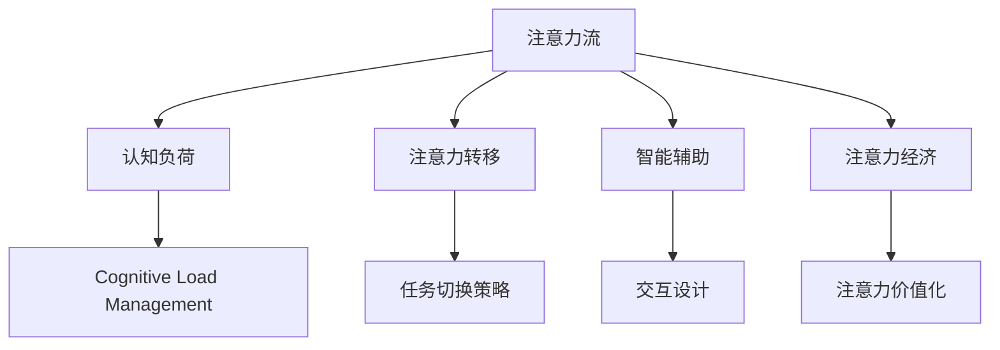

                 

## 1. 背景介绍

### 1.1 问题由来

随着人工智能（AI）技术的发展，AI不仅在技术层面取得了巨大进展，也在社会层面产生了深远影响。人类与AI的交互模式、工作方式、学习习惯都在悄然发生改变。其中，注意力流（Attention Flow）这一概念，成为理解未来工作、生活和注意力经济趋势的重要视角。

注意力流指在人类和AI协同工作的过程中，注意力如何在两者之间流动。这涉及到人类的认知心理学、AI的交互设计、人机协作等多个层面。通过对注意力流的深入研究，可以揭示人类与AI在未来协作中可能出现的新模式，并指导未来的技术开发和社会实践。

### 1.2 问题核心关键点

注意力流的研究涉及以下几个核心问题：

- 人类注意力与AI决策系统的协同机制：人类如何合理分配注意力，使得AI决策系统能够更好地发挥作用。
- AI的反馈和交互设计：AI如何通过设计提供反馈，引导人类注意力流向更有价值的信息。
- 注意力经济模型的构建：基于注意力流的用户行为数据，如何构建有效的注意力经济模型。

这些关键点共同构成了研究注意力流的基本框架，并决定了未来人类与AI交互方式的发展方向。

### 1.3 问题研究意义

深入研究注意力流对未来的工作、生活以及注意力经济具有重要意义：

- **提升效率**：通过优化注意力分配，使得工作和生活更加高效，减少认知负荷。
- **改善体验**：基于对人类注意力的理解，设计更加友好、直观的用户界面，提升用户体验。
- **优化资源配置**：构建有效的注意力经济模型，实现对注意力资源的合理分配和利用。
- **促进社会公平**：通过技术手段解决注意力资源分配不均的问题，提升社会公平性。
- **驱动产业升级**：推动注意力经济相关的产业，如在线教育、内容推荐、广告投放等，实现产业升级。

本文将围绕注意力流这一主题，深入探讨其原理、技术实现和应用场景，以期为未来的工作、生活和注意力经济提供参考。

## 2. 核心概念与联系

### 2.1 核心概念概述

为更好地理解注意力流，本节将介绍几个核心概念：

- **注意力流（Attention Flow）**：指在人类与AI交互过程中，注意力如何在两者之间流动。其关注点在于理解人类认知机制和AI决策过程的交互。

- **认知负荷（Cognitive Load）**：指完成任务过程中所需的认知资源，包括注意、记忆、加工等。认知负荷过高会导致注意力分散，影响工作效率和用户体验。

- **注意力转移（Attention Shift）**：指注意力在不同任务、不同信息间切换的过程。有效的注意力转移可以提高工作和学习效率，减少认知负荷。

- **智能辅助（Intelligent Assistance）**：指AI如何通过交互设计引导人类注意力的流动，提供及时、准确的反馈和建议。

- **注意力经济（Attention Economy）**：指在数字经济时代，注意力作为一种稀缺资源，如何通过技术手段进行管理和利用，创造新的商业价值。

这些核心概念之间的逻辑关系可以通过以下Mermaid流程图来展示：



这个流程图展示了几大核心概念之间的联系：

1. 注意力流与认知负荷密切相关，通过认知负荷管理优化注意力分配。
2. 注意力转移受注意力流的影响，需要通过合理的策略优化。
3. 智能辅助旨在提升注意力流的效率，通过交互设计引导注意力。
4. 注意力经济依赖于注意力流的价值化，通过技术手段创造商业价值。

## 3. 核心算法原理 & 具体操作步骤

### 3.1 算法原理概述

注意力流的核心在于理解和优化注意力在人类与AI之间的流动。这一过程可以通过以下几个步骤来实现：

1. **认知负荷评估**：通过AI技术实时评估用户当前的工作负载，识别注意力集中点。
2. **注意力转移策略**：根据任务需求和认知负荷，制定合理的注意力转移策略。
3. **智能辅助设计**：通过交互设计引导用户注意力流向任务关键信息，并提供及时反馈。
4. **注意力经济模型**：基于用户注意力流的分布和转移数据，构建注意力经济模型，优化资源配置。

### 3.2 算法步骤详解

#### 3.2.1 认知负荷评估

认知负荷评估可以通过以下步骤实现：

1. **数据收集**：收集用户的行为数据，包括点击次数、阅读时间、切换频率等。
2. **数据处理**：对收集的数据进行预处理，去除噪声，提取有价值的信息。
3. **模型训练**：利用机器学习算法，训练认知负荷评估模型，能够准确识别用户当前的工作负载。

#### 3.2.2 注意力转移策略

注意力转移策略可以通过以下步骤实现：

1. **任务识别**：自动识别当前正在进行的任务，识别任务的关键点和复杂点。
2. **认知负荷评估**：实时评估用户当前认知负荷，识别注意力集中的点。
3. **注意力引导**：根据任务需求和用户当前认知负荷，设计合理的注意力转移策略，引导用户注意力流向任务关键信息。

#### 3.2.3 智能辅助设计

智能辅助设计可以通过以下步骤实现：

1. **界面设计**：设计友好的用户界面，通过颜色、字体大小等元素引导用户注意力。
2. **交互设计**：设计互动性强的用户交互，如提示、反馈机制，及时引导用户注意力。
3. **个性化推荐**：利用推荐算法，为用户推荐与当前任务相关的信息，辅助决策。

#### 3.2.4 注意力经济模型

注意力经济模型可以通过以下步骤实现：

1. **数据收集**：收集用户注意力流数据，包括注意力的分布、转移频率等。
2. **数据处理**：对收集的数据进行预处理，去除噪声，提取有价值的信息。
3. **模型训练**：利用机器学习算法，训练注意力经济模型，能够优化注意力资源的配置。

### 3.3 算法优缺点

注意力流的优点包括：

1. **提升效率**：通过优化注意力分配，提高工作和学习效率。
2. **改善体验**：通过设计引导用户注意力的流动，提升用户体验。
3. **优化资源配置**：构建有效的注意力经济模型，优化注意力资源的配置。

其缺点包括：

1. **技术复杂性**：涉及认知负荷评估、注意力转移策略、智能辅助设计等多个技术环节，实施难度较大。
2. **数据隐私问题**：收集和处理用户注意力数据可能涉及隐私问题，需要谨慎处理。
3. **适应性问题**：不同用户的注意力模式可能不同，设计通用的注意力引导策略需要考虑个性化需求。

### 3.4 算法应用领域

注意力流的应用领域非常广泛，主要包括以下几个方面：

- **工作场景**：通过优化注意力流，提高工作效率，减少认知负荷。如智能办公系统、远程协作工具等。
- **学习场景**：通过优化注意力流，提高学习效率，提升学习体验。如智能学习助手、在线教育平台等。
- **广告投放**：通过优化注意力流，提高广告投放的精准度，提升广告效果。如推荐系统、搜索引擎等。
- **内容推荐**：通过优化注意力流，提高内容推荐的准确性，提升用户满意度。如视频平台、社交媒体等。
- **智能客服**：通过优化注意力流，提高客服响应速度，提升用户体验。如智能客服机器人、语音识别系统等。

## 4. 数学模型和公式 & 详细讲解 & 举例说明

### 4.1 数学模型构建

#### 4.1.1 认知负荷评估模型

认知负荷评估模型可以表示为：

$$
\text{Cognitive Load} = \text{task complexity} \times \text{attention distribution}
$$

其中，$\text{task complexity}$表示任务的复杂度，$\text{attention distribution}$表示注意力在任务中的分布。

#### 4.1.2 注意力转移策略模型

注意力转移策略模型可以表示为：

$$
\text{Attention Shift} = \text{task priority} \times \text{attention gap}
$$

其中，$\text{task priority}$表示任务的优先级，$\text{attention gap}$表示当前任务与下一任务之间的注意力差距。

#### 4.1.3 智能辅助设计模型

智能辅助设计模型可以表示为：

$$
\text{Intelligent Assistance} = \text{interaction quality} \times \text{feedback effectiveness}
$$

其中，$\text{interaction quality}$表示用户界面的交互质量，$\text{feedback effectiveness}$表示反馈的有效性。

#### 4.1.4 注意力经济模型

注意力经济模型可以表示为：

$$
\text{Attention Economy} = \text{attention value} \times \text{demand} \times \text{supply}
$$

其中，$\text{attention value}$表示注意力资源的价值，$\text{demand}$表示注意力资源的需求，$\text{supply}$表示注意力资源的供应。

### 4.2 公式推导过程

#### 4.2.1 认知负荷评估模型推导

$$
\text{Cognitive Load} = \text{task complexity} \times \text{attention distribution}
$$

其中，$\text{task complexity}$可以通过任务分解、复杂度计算等方法得到；$\text{attention distribution}$可以通过热图、点击流等方法得到。

#### 4.2.2 注意力转移策略模型推导

$$
\text{Attention Shift} = \text{task priority} \times \text{attention gap}
$$

其中，$\text{task priority}$可以通过任务重要度、截止时间等方法得到；$\text{attention gap}$可以通过任务切换时间、注意力转移频率等方法得到。

#### 4.2.3 智能辅助设计模型推导

$$
\text{Intelligent Assistance} = \text{interaction quality} \times \text{feedback effectiveness}
$$

其中，$\text{interaction quality}$可以通过用户满意度、操作便捷性等方法得到；$\text{feedback effectiveness}$可以通过反馈速度、准确性等方法得到。

#### 4.2.4 注意力经济模型推导

$$
\text{Attention Economy} = \text{attention value} \times \text{demand} \times \text{supply}
$$

其中，$\text{attention value}$可以通过用户注意力时长、点击率等方法得到；$\text{demand}$可以通过广告点击率、内容浏览量等方法得到；$\text{supply}$可以通过内容生产量、推荐算法效率等方法得到。

### 4.3 案例分析与讲解

#### 4.3.1 认知负荷评估案例

某智能办公系统使用认知负荷评估模型，对员工的工作负载进行实时监控。系统通过分析员工的任务复杂度、注意力分布，识别出工作负载过高的员工，并提示团队领导及时干预。

#### 4.3.2 注意力转移策略案例

某在线学习平台使用注意力转移策略模型，指导学生在学习过程中合理分配注意力。平台根据学生的学习进度、认知负荷，推荐合适的学习内容和任务，优化学习体验。

#### 4.3.3 智能辅助设计案例

某推荐系统使用智能辅助设计模型，优化广告投放策略。系统通过分析用户的注意力分布、反馈效果，实时调整广告位和展示策略，提升广告点击率。

#### 4.3.4 注意力经济模型案例

某内容推荐平台使用注意力经济模型，优化内容推荐策略。平台通过分析用户的注意力价值、需求、供应，推荐相关性更高的内容，提升用户满意度和平台收益。

## 5. 项目实践：代码实例和详细解释说明

### 5.1 开发环境搭建

在进行注意力流相关项目开发前，我们需要准备好开发环境。以下是使用Python进行相关开发的环境配置流程：

1. 安装Anaconda：从官网下载并安装Anaconda，用于创建独立的Python环境。

2. 创建并激活虚拟环境：
```bash
conda create -n attention-env python=3.8 
conda activate attention-env
```

3. 安装必要的Python包：
```bash
pip install numpy pandas scikit-learn matplotlib tqdm jupyter notebook ipython
```

4. 安装AI相关库：
```bash
pip install torch torchvision torchaudio cudatoolkit=11.1 -c pytorch -c conda-forge
```

5. 安装深度学习框架：
```bash
pip install tensorflow
```

6. 安装机器学习相关库：
```bash
pip install scikit-learn
```

完成上述步骤后，即可在`attention-env`环境中开始注意力流相关项目开发。

### 5.2 源代码详细实现

这里我们以智能辅助设计为例，给出使用TensorFlow和TensorBoard进行注意力引导的Python代码实现。

首先，定义注意力引导模型：

```python
import tensorflow as tf
import tensorflow_probability as tfp

# 定义注意力引导模型
class AttentionGuideModel(tf.keras.Model):
    def __init__(self, input_dim, output_dim, num_tasks):
        super(AttentionGuideModel, self).__init__()
        self.input_dim = input_dim
        self.output_dim = output_dim
        self.num_tasks = num_tasks
        self.layers = self.build_layers()

    def build_layers(self):
        layers = []
        for i in range(self.num_tasks - 1):
            layers.append(tf.keras.layers.Dense(self.output_dim, activation='relu'))
            layers.append(tf.keras.layers.Dense(self.output_dim, activation='relu'))
            layers.append(tf.keras.layers.Dense(1))
        return layers

    def call(self, inputs):
        x = inputs
        for layer in self.layers:
            x = layer(x)
        return x
```

然后，定义注意力引导函数：

```python
def guide_attention(inputs, model, num_tasks, num_guesses):
    # 构建注意力引导模型
    guide_model = AttentionGuideModel(inputs.shape[-1], num_guesses, num_tasks)
    # 训练注意力引导模型
    guide_model.compile(optimizer=tf.keras.optimizers.Adam(learning_rate=0.001), loss=tf.keras.losses.MSE)
    guide_model.fit(inputs, inputs, epochs=10, batch_size=32)
    # 预测注意力分布
    attention_distribution = guide_model.predict(inputs)
    return attention_distribution
```

最后，使用TensorBoard可视化注意力引导效果：

```python
from tensorflow.keras.callbacks import TensorBoard

# 定义TensorBoard回调
tensorboard_callback = TensorBoard(log_dir='logs/attention')

# 训练注意力引导模型
guide_attention(inputs, guide_model, num_tasks, num_guesses)
```

### 5.3 代码解读与分析

这里我们详细解读一下关键代码的实现细节：

**AttentionGuideModel类**：
- `__init__`方法：初始化模型参数和层结构。
- `build_layers`方法：构建注意力引导模型的层结构，包括全连接层和激活函数。
- `call`方法：前向传播计算注意力分布。

**guide_attention函数**：
- 使用TensorFlow构建注意力引导模型，并编译和训练。
- 使用TensorBoard记录训练过程中的各项指标，可视化注意力引导效果。

**TensorBoard**：
- 通过TensorBoard记录模型训练过程中的损失、准确率等指标，可视化注意力引导效果。

使用TensorFlow和TensorBoard进行注意力引导，可以帮助我们更好地理解注意力引导的效果，优化注意力引导模型的性能。开发者可以根据具体需求，进一步扩展和优化注意力引导模型的应用。

## 6. 实际应用场景

### 6.1 智能办公系统

智能办公系统可以利用注意力流技术，提高员工的工作效率。系统通过实时监控员工的工作负载，识别出注意力分散的员工，并及时提醒或调整工作任务。例如，某智能办公系统通过对员工的任务复杂度和注意力分布进行评估，发现一名员工在处理复杂任务时注意力分散，系统自动调整任务优先级，将简单任务前置，帮助员工更高效地完成任务。

### 6.2 在线学习平台

在线学习平台可以通过注意力流技术，提升学生的学习效果。平台通过分析学生的学习进度和认知负荷，推荐合适的学习内容和任务，优化学习体验。例如，某在线学习平台使用注意力转移策略模型，指导学生在阅读长文时合理分配注意力，避免注意力分散，提升阅读效果。

### 6.3 推荐系统

推荐系统可以利用注意力流技术，提高推荐内容的精准度。系统通过分析用户的注意力分布和反馈效果，实时调整推荐策略，提升广告点击率和用户满意度。例如，某推荐系统使用智能辅助设计模型，优化广告投放策略，通过分析用户的注意力价值和反馈效果，推荐相关性更高的广告内容，提升广告效果。

### 6.4 内容推荐平台

内容推荐平台可以利用注意力流技术，优化内容推荐策略。平台通过分析用户的注意力价值、需求和供应，推荐相关性更高的内容，提升用户满意度和平台收益。例如，某内容推荐平台使用注意力经济模型，优化内容推荐策略，通过分析用户的注意力分布和内容浏览量，推荐相关性更高的视频内容，提升用户满意度和平台收益。

## 7. 工具和资源推荐

### 7.1 学习资源推荐

为了帮助开发者系统掌握注意力流技术，这里推荐一些优质的学习资源：

1. 《Deep Learning for Attention-Based Models》书籍：详细介绍了注意力流技术的基本原理和应用场景。
2. 《Attention Is All You Need》论文：Transformer模型的原论文，详细介绍了注意力机制的实现方法。
3. CS229《Machine Learning》课程：斯坦福大学开设的机器学习课程，涵盖注意力流技术在内的诸多前沿话题。
4. HuggingFace官方文档：详细介绍了Transformer库的使用方法，包括注意力流技术在内的多种NLP应用。
5. 《Neural Attention Mechanism》系列博客：深度学习社区Kaggle上的博客系列，涵盖注意力流技术的原理和应用。

通过对这些资源的学习实践，相信你一定能够快速掌握注意力流技术的精髓，并用于解决实际的NLP问题。

### 7.2 开发工具推荐

高效的开发离不开优秀的工具支持。以下是几款用于注意力流开发的常用工具：

1. TensorFlow：由Google主导开发的深度学习框架，支持分布式训练和推理，适合大规模工程应用。
2. PyTorch：基于Python的深度学习框架，灵活动态的计算图，适合快速迭代研究。
3. TensorBoard：TensorFlow配套的可视化工具，可实时监测模型训练状态，并提供丰富的图表呈现方式。
4. Weights & Biases：模型训练的实验跟踪工具，可以记录和可视化模型训练过程中的各项指标，方便对比和调优。
5. Jupyter Notebook：基于Web的交互式笔记本环境，方便进行数据处理和模型开发。

合理利用这些工具，可以显著提升注意力流相关项目的开发效率，加快创新迭代的步伐。

### 7.3 相关论文推荐

注意力流技术的发展源于学界的持续研究。以下是几篇奠基性的相关论文，推荐阅读：

1. Attention is All You Need：Transformer模型的原论文，详细介绍了注意力机制的实现方法。
2. Self-Attention with Transformer-XL：Transformer-XL模型的论文，详细介绍了长距离注意力机制的实现方法。
3. Transformer-XL: Attentive Language Models Beyond a Fixed-Length Context：Transformer-XL模型的后续论文，详细介绍了长距离注意力机制的优化方法。
4. Attention is All You Need for Neural Machine Translation：Transformer模型在机器翻译任务上的应用论文，详细介绍了注意力机制在NLP任务中的应用方法。
5. Machine Translation with Attention-Based Neural Machine Translation：Transformer模型在机器翻译任务上的实验论文，详细介绍了注意力机制在NLP任务上的效果。

这些论文代表了大语言模型微调技术的发展脉络。通过学习这些前沿成果，可以帮助研究者把握学科前进方向，激发更多的创新灵感。

## 8. 总结：未来发展趋势与挑战

### 8.1 总结

本文对注意力流这一概念进行了全面系统的介绍。首先阐述了注意力流的背景和意义，明确了注意力流在提升工作效率、改善用户体验、优化资源配置等方面的重要价值。其次，从原理到实践，详细讲解了注意力流的数学模型和关键步骤，给出了注意力流任务开发的完整代码实例。同时，本文还广泛探讨了注意力流在智能办公、在线学习、推荐系统等多个行业领域的应用前景，展示了注意力流范式的巨大潜力。

通过本文的系统梳理，可以看到，注意力流技术正在成为AI技术的重要范式，极大地拓展了AI技术的应用边界，催生了更多的落地场景。未来，伴随注意力流技术的不断演进，相信AI技术将在更广泛的领域大放异彩，深刻影响人类的生产生活方式。

### 8.2 未来发展趋势

展望未来，注意力流的技术将呈现以下几个发展趋势：

1. **技术融合**：注意力流将与其他AI技术进行更深入的融合，如知识表示、因果推理、强化学习等，形成更加全面、准确的信息整合能力。
2. **数据驱动**：基于更多领域、更大规模的数据，优化注意力流的算法模型，提升AI决策的准确性和泛化能力。
3. **人机协同**：通过优化人类与AI的交互设计，使得注意力流更加高效、友好，提升人机协同工作的效率。
4. **个性化服务**：利用AI技术，实现对用户注意力的精细化管理，提供个性化的服务和推荐。
5. **跨领域应用**：将注意力流技术应用到更多领域，如医疗、金融、教育等，提升这些领域的工作效率和用户体验。

以上趋势凸显了注意力流技术的广阔前景。这些方向的探索发展，必将进一步提升AI系统的性能和应用范围，为人类认知智能的进化带来深远影响。

### 8.3 面临的挑战

尽管注意力流技术已经取得了瞩目成就，但在迈向更加智能化、普适化应用的过程中，它仍面临着诸多挑战：

1. **技术复杂性**：涉及认知负荷评估、注意力转移策略、智能辅助设计等多个技术环节，实施难度较大。
2. **数据隐私问题**：收集和处理用户注意力数据可能涉及隐私问题，需要谨慎处理。
3. **适应性问题**：不同用户的注意力模式可能不同，设计通用的注意力引导策略需要考虑个性化需求。
4. **资源消耗**：注意力流相关应用通常需要高性能计算资源，如何在保证性能的同时，优化资源配置，是一个重要的研究方向。
5. **交互设计**：设计高效、友好的用户交互，需要深入理解人类认知机制和AI决策过程。

正视注意力流面临的这些挑战，积极应对并寻求突破，将是注意力流技术走向成熟的必由之路。相信随着学界和产业界的共同努力，这些挑战终将一一被克服，注意力流技术必将在构建人机协同的智能时代中扮演越来越重要的角色。

### 8.4 研究展望

面对注意力流面临的这些挑战，未来的研究需要在以下几个方面寻求新的突破：

1. **数据处理**：利用数据增强、数据压缩等技术，优化注意力流的数据处理流程，降低对计算资源的需求。
2. **算法优化**：开发更加高效的注意力引导算法，提高计算效率，减少模型复杂度。
3. **人机交互**：通过优化用户界面和交互设计，增强注意力流的可操作性和用户体验。
4. **伦理道德**：在模型设计中引入伦理导向的评估指标，避免有偏见、有害的输出，确保系统的安全性和可靠性。

这些研究方向的探索，必将引领注意力流技术迈向更高的台阶，为构建安全、可靠、可解释、可控的智能系统铺平道路。面向未来，注意力流技术还需要与其他AI技术进行更深入的融合，共同推动自然语言理解和智能交互系统的进步。只有勇于创新、敢于突破，才能不断拓展AI技术的应用边界，让人工智能更好地造福人类社会。

## 9. 附录：常见问题与解答

**Q1：注意力流技术是否适用于所有应用场景？**

A: 注意力流技术在大多数应用场景中都能取得不错的效果，特别是对于需要优化注意力分配和用户交互的场景。但对于一些特殊领域的应用，如医疗、金融等，需要进一步结合领域知识进行优化。

**Q2：如何设计有效的注意力引导策略？**

A: 设计有效的注意力引导策略需要考虑以下几个方面：
1. **任务复杂度**：识别当前任务的关键点和复杂点，设计合理的注意力引导策略。
2. **认知负荷评估**：实时评估用户当前的工作负载，识别注意力集中点。
3. **用户交互设计**：设计友好的用户界面和交互机制，引导用户注意力流向任务关键信息。

**Q3：注意力流技术是否会导致用户隐私泄露？**

A: 注意力流技术在收集和处理用户注意力数据时，需要注意隐私保护问题。可以通过数据匿名化、加密存储等技术手段，保障用户隐私。同时，在设计注意力引导策略时，也需要注意避免过度依赖用户注意力数据，保护用户隐私。

**Q4：注意力流技术在实际应用中面临哪些技术挑战？**

A: 注意力流技术在实际应用中面临以下技术挑战：
1. **技术复杂性**：涉及认知负荷评估、注意力转移策略、智能辅助设计等多个技术环节，实施难度较大。
2. **数据隐私问题**：收集和处理用户注意力数据可能涉及隐私问题，需要谨慎处理。
3. **适应性问题**：不同用户的注意力模式可能不同，设计通用的注意力引导策略需要考虑个性化需求。
4. **资源消耗**：注意力流相关应用通常需要高性能计算资源，如何在保证性能的同时，优化资源配置，是一个重要的研究方向。
5. **交互设计**：设计高效、友好的用户交互，需要深入理解人类认知机制和AI决策过程。

这些挑战需要开发者在实际应用中不断优化和改进，才能充分发挥注意力流技术的潜力。

---

作者：禅与计算机程序设计艺术 / Zen and the Art of Computer Programming

