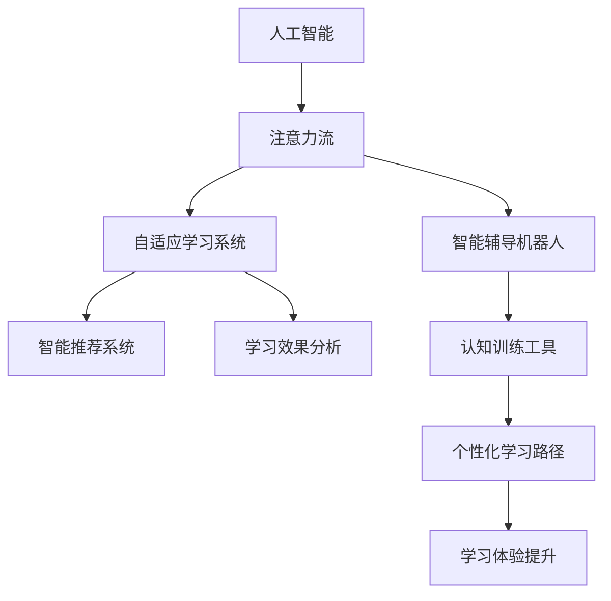

                 

# AI与人类注意力流：未来的教育与注意力管理

> 关键词：人工智能(AI)、注意力流、教育技术、学习科学、认知神经科学

## 1. 背景介绍

### 1.1 问题由来

在快速变化的现代世界中，信息爆炸导致人们的生活和学习方式发生重大转变。在这个背景下，如何提升学习效率、优化学习体验、增强学习成果，已经成为教育界和科技界共同关注的焦点。传统的教育模式难以应对日益复杂和多样化的学习需求，需要新的技术和理念来支撑教育变革。

人工智能(AI)技术的迅猛发展，为教育领域带来了革命性的变化。从个性化推荐系统、智能辅导机器人到自适应学习平台，AI技术正在通过深度学习、自然语言处理等手段，重新定义学习过程和教育模式。而人类注意力流这一概念的提出，进一步揭示了学习行为背后的认知机制，为AI在教育中的应用提供了新的理论依据。

### 1.2 问题核心关键点

人类注意力流指的是个体在接受信息时的注意力分布情况，即注意力如何在不同刺激、不同任务之间切换和分配。它不仅关系到学习效果，还关系到信息处理的质量和效率。通过结合AI技术，可以对人类注意力流进行更加精准的分析和控制，从而实现更加高效、个性化的学习体验。

AI与人类注意力流的结合，主要体现在以下几个方面：
1. **自适应学习系统**：通过实时监控和分析学生的注意力分布，动态调整学习内容和难度，提供个性化的学习路径。
2. **智能辅导机器人**：基于注意力流的原理，设计机器人对话系统，引导学生注意力集中于学习重点。
3. **智能推荐系统**：通过分析注意力流的模式，推荐适合学生的学习材料和资源，提高学习效率。
4. **认知训练工具**：利用注意力流数据，训练学生提高注意力控制能力，提升学习效果。

## 2. 核心概念与联系

### 2.1 核心概念概述

为了更好地理解AI与人类注意力流在教育中的应用，本节将介绍几个核心概念：

- **人工智能(AI)**：通过机器学习和深度学习等技术，使计算机具备一定的人类智能，能够执行复杂任务，处理大量数据。
- **注意力流(Attention Flow)**：描述个体在处理信息时，注意力在不同刺激、任务之间切换的过程和模式。
- **自适应学习系统(Adaptive Learning System)**：根据学生的学习表现和注意力特征，动态调整学习内容和策略，提供个性化的学习支持。
- **智能辅导机器人(Intelligent Tutoring Robot)**：基于人工智能的对话系统，能够根据学生的学习需求和注意力状态，提供实时的指导和反馈。
- **智能推荐系统(Intelligent Recommendation System)**：通过分析用户行为数据，推荐最合适的学习资源，提高学习效率。
- **认知训练工具(Cognitive Training Tools)**：使用游戏化、任务化的方式，训练学生提高注意力、记忆力和决策能力，提升学习能力。

这些核心概念之间的关系可以通过以下Mermaid流程图来展示：



这个流程图展示了一系列核心概念及其之间的关系：

1. 人工智能提供技术支持，对注意力流进行分析和模拟。
2. 注意力流指导自适应学习系统、智能辅导机器人和智能推荐系统的设计和运行。
3. 自适应学习系统、智能辅导机器人和智能推荐系统，根据注意力流数据调整学习内容和策略。
4. 认知训练工具通过注意力流数据进行训练，提升学习效果。
5. 个性化学习路径和分析结果进一步提升学习体验。

这些概念共同构成了AI在教育领域应用的框架，为实现更加高效、个性化的学习提供了理论基础和技术手段。

## 3. 核心算法原理 & 具体操作步骤

### 3.1 算法原理概述

AI与人类注意力流在教育中的应用，主要依赖于以下几个关键算法和理论：

- **深度学习算法**：用于构建和训练自适应学习系统、智能辅导机器人和智能推荐系统。
- **自然语言处理(NLP)**：用于理解学生的语言输入，进行情感分析、意图识别等。
- **认知神经科学(Cognitive Neuroscience)**：揭示人类注意力流和认知过程的神经机制，指导AI系统的设计和优化。
- **机器学习模型**：如线性回归、决策树、随机森林等，用于分析注意力流数据，进行个性化推荐和学习效果预测。

这些算法和技术，通过相互结合和协同工作，能够实现对人类注意力流的精准分析和控制，从而提升学习效果和体验。

### 3.2 算法步骤详解

基于AI与人类注意力流的教育应用，一般包括以下几个关键步骤：

**Step 1: 数据收集与预处理**
- 收集学生的学习行为数据，如点击、停留时间、答题情况等。
- 使用自然语言处理技术对学生的文本输入进行情感分析、意图识别等。
- 对数据进行清洗和预处理，确保数据质量和一致性。

**Step 2: 注意力流分析**
- 使用深度学习模型对学生注意力流进行分析和建模，识别注意力分布模式和特征。
- 应用认知神经科学理论，解释注意力流背后的认知机制。
- 通过多模态数据融合，综合利用视觉、听觉、触觉等多方面的信息，提高注意力流分析的准确性。

**Step 3: 个性化学习路径设计**
- 根据注意力流分析结果，设计个性化的学习路径和内容。
- 动态调整学习难度和进度，引导学生集中注意力于当前任务。
- 提供多种学习方式和资源，适应不同学习风格和需求。

**Step 4: 智能辅导和反馈**
- 设计智能辅导机器人，根据注意力流状态，提供实时的学习指导和反馈。
- 使用机器学习模型进行学习效果预测，评估学生对学习材料的理解和掌握程度。
- 动态调整辅导策略，优化学习体验。

**Step 5: 学习效果评估与优化**
- 对学习效果进行评估，分析注意力流数据与学习效果之间的关系。
- 根据评估结果，优化学习策略和资源配置，进一步提升学习效果。

### 3.3 算法优缺点

基于AI与人类注意力流的教育应用，具有以下优点：
1. 个性化学习：通过分析注意力流数据，设计个性化的学习路径和内容，满足不同学生的学习需求。
2. 实时反馈：智能辅导机器人能够根据注意力状态，提供实时的学习指导和反馈，增强学习效果。
3. 数据驱动：基于大量的学习数据，通过机器学习模型进行分析和预测，指导学习过程和策略优化。
4. 高效便捷：自动化程度高，减少了教师的负担，提高了教育资源的利用效率。

同时，这种应用也存在一些局限性：
1. 数据隐私：学习数据的收集和分析可能涉及学生隐私，需要严格的数据保护措施。
2. 技术复杂度：AI与认知科学的结合，对技术要求较高，开发和维护成本较大。
3. 数据质量：学习数据的准确性和完整性对分析结果有重要影响，数据质量问题可能导致误导性结论。
4. 学生自律：技术手段不能完全替代教师和家长的作用，学生自律性和学习动机仍然重要。

### 3.4 算法应用领域

基于AI与人类注意力流的教育应用，已经在多个领域取得了显著的成果，如：

- **K-12教育**：开发自适应学习平台，帮助中小学生个性化学习和复习。
- **高等教育**：提供智能辅导机器人和学习资源推荐，辅助大学生自主学习。
- **职业教育**：设计技能训练工具和自适应学习系统，提升职业技能培训效果。
- **远程教育**：通过注意力流分析，优化远程学习体验，提高学习效果。
- **终身学习**：开发个性化学习路径和认知训练工具，支持终身学习者的自我提升。

除了这些应用外，AI与人类注意力流在教育领域还将不断拓展，推动教育技术的创新和应用。

## 4. 数学模型和公式 & 详细讲解  
### 4.1 数学模型构建

为了更系统地理解AI与人类注意力流在教育中的应用，本节将使用数学语言对相关模型进行详细描述。

假设学习系统中有 $N$ 个学生，每个学生的学习行为数据可以表示为一个时间序列 $X = [x_1, x_2, ..., x_T]$，其中 $x_t$ 表示第 $t$ 时刻的学习行为（如点击、停留时间、答题情况等）。

定义注意力流 $A = [a_1, a_2, ..., a_T]$，其中 $a_t$ 表示第 $t$ 时刻学生的注意力水平，值越大表示注意力越集中。

学习效果 $Y = [y_1, y_2, ..., y_T]$，其中 $y_t$ 表示第 $t$ 时刻的学习效果（如得分、掌握程度等）。

定义注意力流与学习效果的回归模型为：

$$
y_t = \alpha_0 + \sum_{i=1}^{k} \alpha_i a_t + \epsilon_t
$$

其中，$\alpha_0$ 和 $\alpha_i$ 为回归系数，$\epsilon_t$ 为随机误差项。

### 4.2 公式推导过程

以下我们将对注意力流与学习效果的关系进行推导，并讨论如何通过机器学习模型进行优化。

首先，我们考虑简单的线性回归模型：

$$
y_t = \alpha_0 + \alpha_1 a_t + \epsilon_t
$$

其中，$y_t$ 为第 $t$ 时刻的学习效果，$a_t$ 为第 $t$ 时刻的注意力水平，$\alpha_0$ 和 $\alpha_1$ 为回归系数，$\epsilon_t$ 为随机误差项。

假设我们收集到了 $n$ 个样本数据 $(x_i, a_i, y_i)$，其中 $x_i$ 为学习行为，$a_i$ 为注意力水平，$y_i$ 为学习效果。根据最小二乘法的原理，我们可以得到系数 $\alpha_0$ 和 $\alpha_1$ 的估计值：

$$
\alpha_0 = \frac{\sum_{i=1}^{n} (a_i - \bar{a})(y_i - \bar{y})}{\sum_{i=1}^{n} (a_i - \bar{a})^2}
$$
$$
\alpha_1 = \frac{\sum_{i=1}^{n} (a_i - \bar{a})(y_i - \bar{y})}{\sum_{i=1}^{n} (a_i - \bar{a})^2}
$$

其中 $\bar{a}$ 和 $\bar{y}$ 分别为注意力水平和效果水平的均值。

将 $\alpha_0$ 和 $\alpha_1$ 代入回归模型，可以得到注意力流与学习效果之间的关系：

$$
y_t = \alpha_0 + \alpha_1 a_t + \epsilon_t
$$

通过该模型，我们可以预测学生在特定注意力水平下的学习效果，从而优化学习路径和内容，提升学习效果。

### 4.3 案例分析与讲解

为了更好地理解注意力流与学习效果之间的关系，我们可以使用以下案例进行分析：

**案例1: 在线课程学习**
假设我们收集到了 $n$ 个在线课程学习的数据，每个学生的学习行为包括点击、停留时间、答题情况等。通过注意力流分析，我们发现学生在某个课程视频上的注意力水平较高时，学习效果显著提升。因此，我们可以根据学生的注意力分布，动态调整课程视频的播放顺序和节奏，提高学习效率。

**案例2: 实验室实验**
在实验过程中，我们收集了学生的操作数据和实验结果。通过分析注意力流与实验效果的关系，我们发现学生在某个时间段内注意力较为集中时，实验结果更准确。因此，我们可以设计实验任务，在该时间段内进行，提升实验效果。

**案例3: 游戏训练**
在游戏中，我们收集了玩家的游戏数据和游戏成绩。通过分析注意力流与游戏成绩的关系，我们发现学生在某个关卡的注意力水平较高时，游戏成绩显著提高。因此，我们可以设计训练任务，在该关卡上进行，提升玩家的游戏能力。

以上案例展示了注意力流与学习效果之间的关系，通过模型预测和优化，可以显著提升学习效率和效果。

## 5. 项目实践：代码实例和详细解释说明
### 5.1 开发环境搭建

在进行AI与人类注意力流在教育中的应用实践前，我们需要准备好开发环境。以下是使用Python进行TensorFlow开发的环境配置流程：

1. 安装Anaconda：从官网下载并安装Anaconda，用于创建独立的Python环境。

2. 创建并激活虚拟环境：
```bash
conda create -n tf-env python=3.8 
conda activate tf-env
```

3. 安装TensorFlow：从官网获取对应的安装命令。例如：
```bash
pip install tensorflow tensorflow_addons
```

4. 安装各类工具包：
```bash
pip install numpy pandas scikit-learn matplotlib tqdm jupyter notebook ipython
```

完成上述步骤后，即可在`tf-env`环境中开始实践。

### 5.2 源代码详细实现

下面以在线课程学习为例，给出使用TensorFlow进行注意力流分析的Python代码实现。

首先，定义学习行为和注意力流的模型：

```python
import tensorflow as tf
from tensorflow.keras.layers import Dense, Input
from tensorflow.keras.models import Model

# 定义输入层
input_layer = Input(shape=(1,))

# 定义注意力流层
attention_layer = Dense(units=1, activation='sigmoid')(input_layer)

# 定义学习效果层
output_layer = Dense(units=1, activation='sigmoid')(attention_layer)

# 定义模型
model = Model(inputs=input_layer, outputs=output_layer)

# 编译模型
model.compile(optimizer='adam', loss='mean_squared_error')
```

然后，训练模型并进行预测：

```python
# 准备训练数据
x_train = ... # 学习行为数据
y_train = ... # 学习效果数据

# 训练模型
model.fit(x_train, y_train, epochs=50, batch_size=32)

# 准备测试数据
x_test = ... # 测试行为数据

# 进行预测
y_pred = model.predict(x_test)
```

最后，评估模型效果：

```python
# 计算预测误差
mse = tf.keras.metrics.MeanSquaredError()(y_test, y_pred)
print("Mean Squared Error:", mse.numpy())
```

以上就是使用TensorFlow进行注意力流分析的完整代码实现。可以看到，通过简单的线性回归模型，我们可以对注意力流与学习效果的关系进行建模和预测。

### 5.3 代码解读与分析

让我们再详细解读一下关键代码的实现细节：

**定义模型**：
- 使用`Input`层定义输入层，形状为 `(1,)`，表示输入数据为一维。
- 使用`Dense`层定义注意力流层和输出层，其中`units=1`表示输出维度为1，`sigmoid`激活函数用于非线性映射。
- 通过`Model`层定义完整的模型，将输入层和输出层连接起来。
- 使用`compile`方法编译模型，指定优化器为`adam`，损失函数为`mean_squared_error`。

**训练模型**：
- 使用`fit`方法训练模型，输入训练数据 `x_train` 和 `y_train`，设置训练轮数为50，批次大小为32。
- 在训练过程中，模型会自动更新参数，最小化预测误差。

**预测和评估**：
- 使用`predict`方法对测试数据 `x_test` 进行预测，得到预测值 `y_pred`。
- 使用`MeanSquaredError`计算预测误差，评估模型效果。

可以看到，TensorFlow提供了简单便捷的API，可以快速搭建和训练机器学习模型。通过调整模型结构、优化算法等，进一步提升模型效果。

## 6. 实际应用场景

### 6.1 智能辅导机器人

智能辅导机器人是AI与人类注意力流在教育中的典型应用。通过分析学生的注意力状态，智能辅导机器人可以实时提供学习指导和反馈，引导学生集中注意力。

例如，在数学课程中，智能辅导机器人可以根据学生的注意力水平，动态调整问题难度和类型。当学生注意力较弱时，机器人可以提供一些基础题目，帮助其巩固基础；当学生注意力较强时，机器人可以提供一些挑战性题目，激发其兴趣和挑战精神。

### 6.2 自适应学习平台

自适应学习平台利用AI技术，根据学生的注意力流数据，动态调整学习内容和难度，提供个性化的学习路径。

例如，在编程课程中，自适应学习平台可以根据学生的代码运行情况和注意力分布，调整编程难度和任务类型。当学生注意力较弱时，平台可以提供一些简单的任务，帮助其掌握基本语法和结构；当学生注意力较强时，平台可以提供一些复杂的任务，提升其编程能力和逻辑思维。

### 6.3 智能推荐系统

智能推荐系统利用机器学习模型，分析学生的注意力流数据，推荐最合适的学习材料和资源，提高学习效率。

例如，在阅读课程中，智能推荐系统可以根据学生的注意力水平和阅读习惯，推荐适合的阅读材料。当学生注意力较弱时，系统可以推荐一些简单的读物，提升其阅读兴趣和理解能力；当学生注意力较强时，系统可以推荐一些深入的读物，拓展其知识面和思考深度。

### 6.4 未来应用展望

随着AI与人类注意力流在教育中的应用不断深化，未来的教育系统将变得更加智能和高效。可以预见，以下几个方向将是AI与注意力流技术的重要发展方向：

1. **多模态学习**：结合视觉、听觉、触觉等多模态信息，构建更全面的学习环境，提升学习效果。
2. **认知增强**：利用认知训练工具，提高学生的注意力、记忆力和决策能力，增强学习效果。
3. **个性化学习**：根据学生的认知风格和需求，设计个性化的学习路径和内容，提升学习体验。
4. **终身学习**：结合自适应学习系统和认知训练工具，支持终身学习者的自我提升和知识更新。
5. **智能评估**：利用AI技术进行实时评估和反馈，提升教学效果和学生学习体验。

未来，AI与人类注意力流在教育中的应用将更加广泛和深入，推动教育领域的变革和创新。

## 7. 工具和资源推荐
### 7.1 学习资源推荐

为了帮助开发者系统掌握AI与人类注意力流在教育中的应用，这里推荐一些优质的学习资源：

1. **《深度学习与认知神经科学》系列书籍**：介绍深度学习在认知科学中的应用，包括注意力流分析和学习效果预测等主题。
2. **Coursera《深度学习与人工智能》课程**：由斯坦福大学开设的深度学习课程，涵盖深度学习基础和高级应用。
3. **Kaggle数据集**：包含大量的教育数据集，如学习行为数据、注意力流数据、学习效果数据等，适合进行数据分析和模型训练。
4. **Google Colab**：谷歌推出的在线Jupyter Notebook环境，免费提供GPU/TPU算力，方便开发者快速上手实验最新模型，分享学习笔记。
5. **TensorFlow官方文档**：TensorFlow的官方文档，提供丰富的教程和样例代码，适合初学者和开发者快速上手。

通过对这些资源的学习实践，相信你一定能够系统掌握AI与人类注意力流在教育中的应用，并用于解决实际的NLP问题。

### 7.2 开发工具推荐

高效的开发离不开优秀的工具支持。以下是几款用于AI与人类注意力流在教育中的应用开发的常用工具：

1. **TensorFlow**：基于Python的开源深度学习框架，灵活动态的计算图，适合快速迭代研究。
2. **PyTorch**：由Facebook开发的深度学习框架，灵活性高，易于使用。
3. **Keras**：基于TensorFlow和Theano的高级神经网络API，适合快速搭建和训练模型。
4. **Scikit-learn**：Python的机器学习库，提供了丰富的算法和工具，适合数据分析和模型训练。
5. **Jupyter Notebook**：交互式开发环境，支持Python、R等语言，适合数据处理和模型训练。

合理利用这些工具，可以显著提升AI与人类注意力流在教育中的应用开发效率，加快创新迭代的步伐。

### 7.3 相关论文推荐

AI与人类注意力流在教育中的应用研究已经取得诸多重要成果。以下是几篇奠基性的相关论文，推荐阅读：

1. **《基于注意力机制的学习效果预测》**：介绍使用注意力流数据进行学习效果预测的模型和方法。
2. **《自适应学习系统的设计与实现》**：详细讨论自适应学习系统的设计与实现，包括注意力流分析、学习路径优化等。
3. **《智能辅导机器人的设计与应用》**：探讨智能辅导机器人的设计原理和应用场景，结合注意力流数据进行实时指导和反馈。
4. **《多模态学习系统的构建与应用》**：介绍多模态学习系统的构建方法，利用视觉、听觉、触觉等多模态信息，提升学习效果。
5. **《认知增强工具的设计与评估》**：讨论认知增强工具的设计和评估方法，利用注意力流数据进行训练和评估。

这些论文代表了大语言模型微调技术的发展脉络。通过学习这些前沿成果，可以帮助研究者把握学科前进方向，激发更多的创新灵感。

## 8. 总结：未来发展趋势与挑战

### 8.1 总结

本文对AI与人类注意力流在教育中的应用进行了全面系统的介绍。首先阐述了AI在教育中的应用背景和意义，明确了注意力流在提升学习效果和体验方面的独特价值。其次，从原理到实践，详细讲解了AI与注意力流的数学模型和关键算法，给出了模型训练和应用的完整代码实现。同时，本文还广泛探讨了AI与注意力流在教育中的应用场景，展示了其广泛的应用前景。

通过本文的系统梳理，可以看到，AI与人类注意力流在教育中的应用正在成为教育领域的重要范式，极大地提升了学习效果和体验。未来，伴随AI技术的不断进步和认知科学的深入研究，基于注意力流的教育技术将不断革新，为教育模式的变革和创新提供新的动力。

### 8.2 未来发展趋势

展望未来，AI与人类注意力流在教育中的应用将呈现以下几个发展趋势：

1. **多模态学习**：结合视觉、听觉、触觉等多模态信息，构建更全面的学习环境，提升学习效果。
2. **认知增强**：利用认知训练工具，提高学生的注意力、记忆力和决策能力，增强学习效果。
3. **个性化学习**：根据学生的认知风格和需求，设计个性化的学习路径和内容，提升学习体验。
4. **终身学习**：结合自适应学习系统和认知训练工具，支持终身学习者的自我提升和知识更新。
5. **智能评估**：利用AI技术进行实时评估和反馈，提升教学效果和学生学习体验。

以上趋势凸显了AI与人类注意力流在教育中的应用前景。这些方向的探索发展，必将进一步提升教育系统的智能化水平，为教育模式的变革和创新提供新的动力。

### 8.3 面临的挑战

尽管AI与人类注意力流在教育中的应用已经取得了显著成果，但在迈向更加智能化、普适化应用的过程中，它仍面临诸多挑战：

1. **数据隐私**：学习数据的收集和分析可能涉及学生隐私，需要严格的数据保护措施。
2. **技术复杂度**：AI与认知科学的结合，对技术要求较高，开发和维护成本较大。
3. **数据质量**：学习数据的准确性和完整性对分析结果有重要影响，数据质量问题可能导致误导性结论。
4. **学生自律**：技术手段不能完全替代教师和家长的作用，学生自律性和学习动机仍然重要。
5. **公平性**：AI与人类注意力流技术的应用可能加剧教育资源的不平等，需要考虑公平性和可及性问题。

### 8.4 研究展望

面对AI与人类注意力流在教育中所面临的挑战，未来的研究需要在以下几个方面寻求新的突破：

1. **数据隐私保护**：设计更加安全、隐私保护的数据收集和分析方法，保障学生的隐私和权益。
2. **技术简化**：简化技术实现，降低开发和维护成本，推广教育技术的应用。
3. **数据质量提升**：提升学习数据的准确性和完整性，减少数据质量问题对分析结果的影响。
4. **学生自律性培养**：结合AI技术，设计更加人性化的学习系统和反馈机制，激发学生的学习动机和自律性。
5. **教育公平性保障**：考虑教育资源的不平等问题，设计公平、可及的学习系统，促进教育公平。

这些研究方向的探索，必将引领AI与人类注意力流在教育中的应用走向成熟，为构建更加智能化、公平化的教育系统铺平道路。面向未来，AI与人类注意力流技术还需要与其他AI技术进行更深入的融合，如知识表示、因果推理、强化学习等，多路径协同发力，共同推动教育模式的进步。只有勇于创新、敢于突破，才能不断拓展人工智能在教育中的应用边界，让AI技术更好地造福人类社会。

## 9. 附录：常见问题与解答

**Q1: 人工智能(AI)与人类注意力流在教育中的应用是否会导致学生过分依赖技术，降低其自主学习能力？**

A: AI与人类注意力流在教育中的应用，本质上是一种辅助工具，旨在帮助学生更好地掌握知识和技能，而不是替代教师和家长的作用。在实际应用中，技术手段需要与教师的指导和学生的自主学习相结合，才能真正发挥其作用。通过合理的引导和监督，技术手段可以激发学生的学习兴趣和动机，提高自主学习能力和自我管理能力。

**Q2: 如何使用注意力流数据进行学习效果的预测和优化？**

A: 使用注意力流数据进行学习效果的预测和优化，主要依赖于以下步骤：
1. 收集学生的学习行为数据，如点击、停留时间、答题情况等。
2. 使用深度学习模型对注意力流进行分析和建模，识别注意力分布模式和特征。
3. 定义注意力流与学习效果的回归模型，通过机器学习模型进行训练和预测。
4. 根据预测结果，动态调整学习内容和难度，优化学习路径和策略。
5. 实时监控和反馈注意力状态，不断优化学习效果。

**Q3: AI与人类注意力流在教育中的应用是否存在技术瓶颈？**

A: AI与人类注意力流在教育中的应用，确实存在一些技术瓶颈，如数据隐私保护、技术复杂度、数据质量等。为了克服这些挑战，需要从多个方面进行优化和改进：
1. 采用更加安全、隐私保护的数据收集和分析方法，保障学生的隐私和权益。
2. 简化技术实现，降低开发和维护成本，推广教育技术的应用。
3. 提升学习数据的准确性和完整性，减少数据质量问题对分析结果的影响。
4. 结合AI技术，设计更加人性化的学习系统和反馈机制，激发学生的学习动机和自律性。
5. 考虑教育资源的不平等问题，设计公平、可及的学习系统，促进教育公平。

这些优化和改进措施，将有助于突破技术瓶颈，进一步提升AI与人类注意力流在教育中的应用效果。

---

作者：禅与计算机程序设计艺术 / Zen and the Art of Computer Programming

