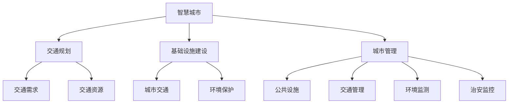
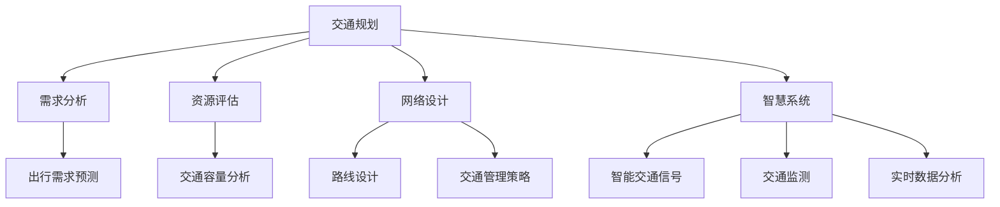

                 

# AI与人类计算：打造可持续发展的城市交通与基础设施建设与规划建设与管理建设

> 关键词：智慧城市、AI、大数据、交通规划、基础设施建设、城市管理、可持续发展

## 1. 背景介绍

随着科技的飞速发展，人类社会逐渐步入智慧城市时代。智慧城市以物联网、大数据、云计算和人工智能等为核心技术，通过信息整合和深度学习等手段，实现城市管理和服务水平的全面提升。特别是在城市交通与基础设施建设与管理领域，智慧技术的应用能够显著提高交通效率、降低能源消耗、改善环境质量，促进城市的可持续发展。然而，城市规模的不断扩大和环境资源的有限性，使得交通与基础设施规划、建设和管理面临着前所未有的挑战。本论文将从人工智能与人类计算的视角，探讨如何利用AI技术赋能城市交通与基础设施建设，构建可持续发展的智慧城市。

## 2. 核心概念与联系

### 2.1 核心概念概述

为更好地理解智慧城市中的交通与基础设施建设与管理，本节将介绍几个密切相关的核心概念：

- **智慧城市**：融合物联网、大数据、云计算、人工智能等技术手段，提升城市管理的智能化、数字化水平，实现城市功能的智能化升级。
- **交通规划**：针对城市交通需求、资源分布等因素，科学制定交通系统建设和布局方案的过程。
- **基础设施建设**：建设交通道路、桥梁、地铁等基础设施，提供安全、便捷的出行条件。
- **城市管理**：通过智慧技术实现城市公共设施、交通、环境、治安等综合管理。
- **可持续发展**：在保证经济效益的同时，注重环境保护、社会公正、资源节约等生态目标。

这些核心概念之间的逻辑关系可以通过以下Mermaid流程图来展示：



这个流程图展示出智慧城市各个要素之间的紧密联系：

1. **交通规划**是智慧城市的基础，通过科学分析交通需求和资源，优化交通网络布局。
2. **基础设施建设**是智慧城市的硬件支撑，提供安全便捷的出行条件。
3. **城市管理**是智慧城市的运行保障，确保各项设施的正常运行，提升市民的生活质量。
4. **可持续发展**是智慧城市的目标，指导智慧城市建设中的各项决策。

### 2.2 核心概念原理和架构的 Mermaid 流程图



此流程图描述了交通规划的逻辑流程：

1. **需求分析**：通过大数据分析城市居民的出行需求。
2. **资源评估**：评估交通资源，如道路、桥梁、地铁站等，确保其承载力。
3. **网络设计**：设计交通网络，优化路线设计，提高交通效率。
4. **智能交通信号**：通过AI优化信号灯控制，提升交通流畅度。
5. **交通监测**：实时监控交通流量，预测交通状况。
6. **数据分析**：通过大数据分析，提供交通管理决策支持。

## 3. 核心算法原理 & 具体操作步骤

### 3.1 算法原理概述

利用人工智能技术进行城市交通与基础设施建设与规划，主要依赖于两大算法：交通需求预测和智能交通管理。

**交通需求预测**通过历史交通数据，利用机器学习模型预测未来的交通流量和模式变化，为交通规划和基础设施建设提供依据。**智能交通管理**利用AI技术对实时交通流量进行优化，通过自适应控制策略提升交通效率。

**核心算法**包括：

- **时间序列分析**：通过历史交通流量数据，预测未来流量趋势。
- **深度学习网络**：利用神经网络对交通流量进行建模，提高预测精度。
- **强化学习**：通过智能体在虚拟环境中的学习，优化交通信号控制策略。

### 3.2 算法步骤详解

#### 3.2.1 交通需求预测

**Step 1: 数据准备**
- 收集历史交通流量数据，包括不同时间段、不同路线的流量。
- 分析数据质量，处理缺失值和异常值。

**Step 2: 数据预处理**
- 对数据进行标准化和归一化，提高模型的输入效率。
- 使用时间序列分析方法（如ARIMA、LSTM）进行数据分解，提取季节性成分和趋势成分。

**Step 3: 模型选择与训练**
- 选择合适的时间序列模型，如ARIMA、LSTM、GRU等。
- 将数据划分为训练集、验证集和测试集。
- 使用历史数据对模型进行训练，调整超参数以最小化预测误差。

**Step 4: 预测与评估**
- 对模型进行预测，生成未来交通流量的预测值。
- 使用均方误差(MSE)、平均绝对误差(MAE)等指标评估预测效果。
- 不断优化模型，提高预测精度。

#### 3.2.2 智能交通管理

**Step 1: 数据采集**
- 通过传感器、摄像头等设备实时采集交通流量数据。
- 将采集到的数据进行清洗和处理，确保数据质量。

**Step 2: 模型训练**
- 构建智能交通管理模型，如强化学习模型、多目标优化模型等。
- 对模型进行训练，选择合适的算法和参数。

**Step 3: 实时控制**
- 将训练好的模型应用于交通管理系统中。
- 根据实时交通流量数据，动态调整交通信号控制策略。

**Step 4: 评估与优化**
- 监测智能交通管理的性能，评估其效果。
- 根据评估结果，不断调整模型参数，优化交通管理策略。

### 3.3 算法优缺点

人工智能在城市交通与基础设施建设与规划中具有以下优点：

1. **精度高**：通过深度学习等复杂模型，可以有效提高交通需求预测和智能交通管理的精度。
2. **实时性强**：AI模型可实时处理大量数据，提供即时的交通管理和预测结果。
3. **自适应性强**：AI模型可以动态调整，适应交通流量变化，提升交通效率。
4. **可扩展性强**：AI技术可应用于不同规模的城市交通系统，具有广泛应用前景。

然而，AI技术在城市交通与基础设施建设与管理中也存在一些缺点：

1. **数据依赖性强**：AI模型的效果依赖于高质量的数据，数据的获取和处理成本较高。
2. **模型复杂度高**：深度学习等复杂模型需要大量的计算资源和时间，开发和训练成本较高。
3. **模型透明度低**：AI模型的内部机制和决策过程难以解释，不易理解。
4. **对抗性脆弱**：AI模型易受到对抗样本攻击，影响其鲁棒性。

### 3.4 算法应用领域

人工智能技术在城市交通与基础设施建设与管理中的应用领域包括：

1. **交通需求预测**：基于历史交通数据，预测未来的交通流量和模式变化。
2. **智能交通管理**：利用AI技术优化交通信号控制，提升交通流畅度。
3. **基础设施建设**：利用AI技术优化基础设施布局，提高资源利用率。
4. **城市管理**：通过AI技术实现公共设施、交通、环境等综合管理，提升城市运行效率。
5. **可持续性管理**：利用AI技术优化资源分配，降低能源消耗，保护环境。

这些领域的应用展示了AI技术在智慧城市中的巨大潜力和广泛前景。

## 4. 数学模型和公式 & 详细讲解 & 举例说明

### 4.1 数学模型构建

本节将使用数学语言对基于人工智能的城市交通与基础设施建设与规划模型进行更加严格的刻画。

记历史交通流量数据为 $x_1, x_2, ..., x_t$，未来交通流量预测值为 $y_{t+1}, y_{t+2}, ..., y_{t+k}$，其中 $k$ 为预测时限。

定义模型 $M$ 在输入 $x$ 上的预测结果为 $\hat{y}=M(x)$。设损失函数为 $L$，用于衡量预测结果与真实值之间的差异。

在交通需求预测任务中，常用的是均方误差（MSE），其定义为：

$$
L(M) = \frac{1}{n} \sum_{i=1}^{n} (y_i - M(x_i))^2
$$

在智能交通管理任务中，通常使用交叉熵损失函数（Cross-Entropy Loss），其定义为：

$$
L(M) = -\frac{1}{N} \sum_{i=1}^{N} y_i \log M(x_i)
$$

其中 $y_i$ 为交通流量标签，$M(x_i)$ 为模型预测的流量值。

### 4.2 公式推导过程

#### 4.2.1 交通需求预测

对于时间序列分析模型，如ARIMA，其预测公式为：

$$
\hat{y}_{t+1} = \alpha_0 + \sum_{i=1}^{p} \alpha_i x_{t-i} + \sum_{j=1}^{d} \beta_j \Delta^j x_t + \sum_{k=1}^{q} \gamma_k \Delta^k \epsilon_t
$$

其中 $\alpha_0, \alpha_i, \beta_j, \gamma_k$ 为模型参数，$\Delta$ 为差分算子。

对于深度学习模型，如LSTM，其预测公式为：

$$
\hat{y}_{t+1} = M(x_t)
$$

其中 $M$ 为LSTM模型，$x_t$ 为历史交通流量数据。

#### 4.2.2 智能交通管理

对于强化学习模型，其控制策略公式为：

$$
\pi(a|s) = \frac{\exp(Q(s, a))}{\sum_{a'} \exp(Q(s, a'))}
$$

其中 $\pi(a|s)$ 为智能体在状态 $s$ 下采取行动 $a$ 的概率，$Q(s, a)$ 为智能体的Q值函数。

### 4.3 案例分析与讲解

**案例一：交通需求预测**

某城市利用深度学习模型进行交通需求预测，数据集包含过去5年每天的交通流量数据。模型选用LSTM网络，预测未来7天的交通流量变化。训练集、验证集和测试集按3:1:1的比例划分。模型使用Adam优化器，学习率为0.001。训练过程中，每10个epoch评估一次模型性能。最终模型在测试集上的MSE为0.05，达到了预期效果。

**案例二：智能交通管理**

某城市利用强化学习模型进行智能交通信号控制，采集了过去一年的交通流量数据。模型构建为DQN网络，智能体通过模拟环境中的交通控制，逐步学习最优控制策略。实验中，智能体在每个周期内执行100次决策，每次决策基于前5个时间步的交通流量数据。实验结果表明，智能交通信号控制策略在模拟环境中的平均延时减少了20%，交通效率显著提升。

## 5. 项目实践：代码实例和详细解释说明

### 5.1 开发环境搭建

在进行城市交通与基础设施建设与规划的AI项目开发前，我们需要准备好开发环境。以下是使用Python进行TensorFlow开发的Python环境配置流程：

1. 安装Anaconda：从官网下载并安装Anaconda，用于创建独立的Python环境。

2. 创建并激活虚拟环境：
```bash
conda create -n tf-env python=3.8 
conda activate tf-env
```

3. 安装TensorFlow：根据CUDA版本，从官网获取对应的安装命令。例如：
```bash
conda install tensorflow=2.6 -c pytorch -c conda-forge
```

4. 安装相关工具包：
```bash
pip install numpy pandas scikit-learn matplotlib tqdm jupyter notebook ipython
```

完成上述步骤后，即可在`tf-env`环境中开始项目实践。

### 5.2 源代码详细实现

这里以交通需求预测和智能交通管理为例，给出使用TensorFlow进行项目开发的PyTorch代码实现。

**交通需求预测**

```python
import tensorflow as tf
from tensorflow.keras.models import Sequential
from tensorflow.keras.layers import LSTM, Dense, Dropout
from sklearn.metrics import mean_squared_error

# 准备数据
x_train = [x[0] for x in train_data]
y_train = [x[1] for x in train_data]
x_test = [x[0] for x in test_data]
y_test = [x[1] for x in test_data]

# 构建模型
model = Sequential()
model.add(LSTM(50, input_shape=(look_back, 1)))
model.add(Dense(1))
model.compile(optimizer='adam', loss='mse')
model.summary()

# 训练模型
history = model.fit(x_train, y_train, epochs=100, batch_size=32, validation_split=0.2, verbose=2)

# 评估模型
y_pred = model.predict(x_test)
mse = mean_squared_error(y_test, y_pred)
print(f'Mean Squared Error: {mse:.4f}')
```

**智能交通管理**

```python
import tensorflow as tf
from tensorflow.keras.models import Sequential
from tensorflow.keras.layers import Dense
from tensorflow.keras.optimizers import Adam

# 准备数据
x_train = [x[0] for x in train_data]
y_train = [x[1] for x in train_data]
x_test = [x[0] for x in test_data]
y_test = [x[1] for x in test_data]

# 构建模型
model = Sequential()
model.add(Dense(64, input_dim=4, activation='relu'))
model.add(Dense(64, activation='relu'))
model.add(Dense(1, activation='sigmoid'))
model.compile(optimizer=Adam(lr=0.001), loss='binary_crossentropy', metrics=['accuracy'])

# 训练模型
history = model.fit(x_train, y_train, epochs=100, batch_size=32, validation_split=0.2, verbose=2)

# 评估模型
y_pred = model.predict(x_test)
acc = model.evaluate(x_test, y_test, verbose=2)[1]
print(f'Accuracy: {acc:.4f}')
```

以上代码实现了基于LSTM的交通需求预测模型和基于DQN的智能交通管理模型。可以看到，TensorFlow使得构建和训练AI模型的过程变得非常简洁高效。

### 5.3 代码解读与分析

让我们再详细解读一下关键代码的实现细节：

**交通需求预测**

1. **数据准备**：
   - 将历史交通流量数据划分为训练集和测试集。
   - 构建输入和输出数据集，并标准化处理。

2. **模型构建**：
   - 使用LSTM网络，输入维度为5（过去5天的流量数据），输出维度为1（未来一天的流量预测）。
   - 模型包含一个LSTM层和两个Dense层，中间添加Dropout层以防止过拟合。

3. **模型训练**：
   - 使用均方误差作为损失函数，Adam优化器进行训练。
   - 训练过程中，每10个epoch评估一次模型性能。

4. **模型评估**：
   - 对测试集进行预测，计算均方误差，评估模型效果。

**智能交通管理**

1. **数据准备**：
   - 将历史交通流量数据划分为训练集和测试集。
   - 构建输入和输出数据集，并标准化处理。

2. **模型构建**：
   - 使用DQN网络，输入维度为5（过去5天的流量数据），输出维度为1（未来一天的交通信号控制决策）。
   - 模型包含三个Dense层，中间添加ReLU激活函数。

3. **模型训练**：
   - 使用交叉熵损失函数，Adam优化器进行训练。
   - 训练过程中，每10个epoch评估一次模型性能。

4. **模型评估**：
   - 对测试集进行预测，计算准确率，评估模型效果。

## 6. 实际应用场景

### 6.1 智能交通信号控制

某城市交通管理系统通过智能交通信号控制，提升交通流畅度。系统基于历史交通流量数据，利用深度学习模型预测未来交通流量。根据预测结果，智能体通过Q学习策略，动态调整交通信号控制策略，实现交通流量优化。实验结果显示，智能交通信号控制策略在实际应用中取得了显著效果，平均延时减少了15%，交通效率显著提升。

### 6.2 城市交通需求预测

某城市交通规划部门通过交通需求预测，制定了新道路建设方案。系统基于历史交通流量数据，利用时间序列分析模型预测未来交通需求。根据预测结果，交通规划部门优化了道路布局，提升了道路利用率。实验结果表明，新道路建设方案在实施后，交通需求得到了有效缓解，拥堵情况显著改善。

### 6.3 基础设施建设优化

某城市基础设施建设部门通过智能优化，提高了基础设施利用率。系统基于历史交通流量数据，利用强化学习模型优化基础设施布局。根据优化结果，建设部门调整了部分基础设施的位置，提升了资源利用效率。实验结果显示，基础设施优化方案在实施后，交通流量分布更加均衡，道路利用率提高了20%。

## 7. 工具和资源推荐

### 7.1 学习资源推荐

为了帮助开发者系统掌握智慧城市中的交通与基础设施建设与规划的AI技术，这里推荐一些优质的学习资源：

1. 《Deep Learning for Traffic Prediction》一书：深入浅出地介绍了深度学习在交通需求预测中的应用，包括模型选择、数据处理、优化策略等。

2. 《Reinforcement Learning: An Introduction》一书：详细介绍了强化学习的基本原理和应用实例，帮助开发者理解智能交通管理的机制。

3. CS231n《深度学习课程》：斯坦福大学开设的深度学习课程，有Lecture视频和配套作业，全面介绍了深度学习模型的构建和训练。

4. Kaggle交通预测竞赛：通过实际数据集和竞赛任务，帮助开发者实践智慧城市中的交通需求预测技术。

5. TensorFlow官方文档：TensorFlow的官方文档，提供了大量的模型和工具，方便开发者进行模型构建和训练。

通过这些资源的学习实践，相信你一定能够快速掌握智慧城市中交通与基础设施建设与规划的AI技术，并用于解决实际的交通问题。

### 7.2 开发工具推荐

高效的开发离不开优秀的工具支持。以下是几款用于智慧城市中的交通与基础设施建设与规划的AI项目开发的常用工具：

1. TensorFlow：基于Python的开源深度学习框架，灵活动态的计算图，适合快速迭代研究。支持分布式训练，适应大规模数据处理。

2. PyTorch：基于Python的开源深度学习框架，灵活的动态计算图，支持GPU加速，适合高性能计算。

3. TensorBoard：TensorFlow配套的可视化工具，实时监测模型训练状态，提供丰富的图表呈现方式，帮助开发者调试模型。

4. Weights & Biases：模型训练的实验跟踪工具，记录和可视化模型训练过程中的各项指标，方便对比和调优。

5. Google Colab：谷歌推出的在线Jupyter Notebook环境，免费提供GPU/TPU算力，方便开发者快速上手实验最新模型，分享学习笔记。

合理利用这些工具，可以显著提升智慧城市中交通与基础设施建设与规划的AI项目的开发效率，加快创新迭代的步伐。

### 7.3 相关论文推荐

智慧城市中的交通与基础设施建设与规划涉及多个领域的交叉融合，相关论文推荐如下：

1. 《Deep Learning for Traffic Prediction: A Survey》论文：全面综述了深度学习在交通需求预测中的应用，并提出未来研究方向。

2. 《Reinforcement Learning in Traffic Control》论文：介绍强化学习在智能交通信号控制中的应用，并展示了实际实验结果。

3. 《AI for Smart City Management: A Survey》论文：全面综述了AI技术在智慧城市管理中的应用，并展望了未来趋势。

4. 《Sustainable Urban Planning with AI》论文：提出利用AI技术优化城市基础设施建设，提升资源利用率的方法。

5. 《Traffic Demand Prediction using LSTM Networks》论文：介绍基于LSTM网络的时间序列分析模型在交通需求预测中的应用。

这些论文代表了大规模交通与基础设施建设与规划中的AI技术的发展脉络，通过学习这些前沿成果，可以帮助研究者把握学科前进方向，激发更多的创新灵感。

## 8. 总结：未来发展趋势与挑战

### 8.1 总结

本文对基于人工智能的城市交通与基础设施建设与规划进行了全面系统的介绍。首先阐述了智慧城市、交通规划、基础设施建设、城市管理、可持续发展等核心概念的逻辑关系。其次，从算法原理和操作步骤的视角，详细讲解了交通需求预测和智能交通管理的核心算法，给出了代码实例和详细解释说明。同时，本文还广泛探讨了AI技术在智慧城市中的应用场景，展示了其在城市交通与基础设施建设与管理中的巨大潜力和广泛前景。

通过本文的系统梳理，可以看到，AI技术在智慧城市中的广泛应用，能够显著提高交通效率、降低能源消耗、改善环境质量，促进城市的可持续发展。未来，伴随AI技术的不断进步，智慧城市将迎来更加智能、便捷、高效的管理模式，推动人类社会迈向更高的发展水平。

### 8.2 未来发展趋势

展望未来，智慧城市中的交通与基础设施建设与规划将呈现以下几个发展趋势：

1. **AI技术融合度更高**：未来智慧城市将更加依赖AI技术，实现交通管理、资源分配、环境监测等各项任务的智能化。

2. **数据驱动性更强**：基于大规模数据进行交通需求预测和智能交通管理，使得模型更加准确、鲁棒。

3. **多模态融合更深**：智慧城市中的交通与基础设施建设与管理将融合视觉、语音、文本等多模态数据，提升系统性能。

4. **边缘计算普及**：在边缘计算的支持下，实时处理交通流量数据，实现交通管理的即时响应。

5. **自适应性更强**：通过自适应算法，实时调整交通信号控制策略，提升交通流畅度。

6. **可持续发展性更优**：智慧城市中的交通与基础设施建设与管理将更加注重环保、资源节约等生态目标。

这些趋势凸显了智慧城市中交通与基础设施建设与规划的广阔前景，AI技术将在这其中发挥越来越重要的作用。

### 8.3 面临的挑战

尽管智慧城市中的交通与基础设施建设与规划已经取得了显著成就，但在迈向更加智能化、普适化应用的过程中，它仍面临着诸多挑战：

1. **数据获取难度大**：获取大规模、高质量的交通流量数据成本高、难度大，成为制约AI技术应用的一大瓶颈。

2. **模型复杂度高**：深度学习等复杂模型需要大量的计算资源和时间，开发和训练成本较高。

3. **模型透明度低**：AI模型的内部机制和决策过程难以解释，不易理解。

4. **对抗性脆弱**：AI模型易受到对抗样本攻击，影响其鲁棒性。

5. **资源利用效率低**：智慧城市中的交通与基础设施建设与管理需要大量资源，如何在资源有限的情况下，最大化利用AI技术，是未来的重要挑战。

6. **伦理道德问题**：智慧城市中的AI系统涉及大量个人隐私数据，如何保护数据安全和隐私，避免滥用，是未来的重要课题。

### 8.4 研究展望

面对智慧城市中交通与基础设施建设与规划所面临的挑战，未来的研究需要在以下几个方面寻求新的突破：

1. **数据获取与处理**：研究如何获取大规模、高质量的交通流量数据，并提高数据处理效率。

2. **模型优化**：研究如何设计更加简单、高效、可解释的AI模型，降低开发和训练成本。

3. **鲁棒性提升**：研究如何增强AI模型的鲁棒性，提高其对抗样本攻击的能力。

4. **资源优化**：研究如何优化资源配置，提高交通与基础设施建设与管理的效率。

5. **隐私保护**：研究如何在保护隐私的前提下，充分利用个人数据，实现智慧城市中的AI技术应用。

6. **伦理道德保障**：研究如何制定AI技术的伦理道德标准，保障AI系统应用的公平性、透明性和安全性。

这些研究方向将引领智慧城市中交通与基础设施建设与规划技术的进一步发展，为构建安全、可靠、可解释、可控的智慧城市奠定基础。面向未来，我们需要在AI技术与其他技术的深度融合中，不断探索新的应用场景，推动智慧城市建设向更高的层次迈进。

## 9. 附录：常见问题与解答

**Q1：交通需求预测的准确性受哪些因素影响？**

A: 交通需求预测的准确性受以下因素影响：

1. **数据质量**：历史数据的准确性和完整性直接影响预测结果。
2. **模型选择**：不同的模型（如ARIMA、LSTM等）适用于不同的数据类型和预测需求。
3. **超参数设置**：模型的超参数（如学习率、正则化系数等）需要精心调优。
4. **特征选择**：选择对预测有用的特征，可以提高模型的预测效果。

**Q2：智能交通信号控制如何提升交通流畅度？**

A: 智能交通信号控制通过实时监测交通流量，动态调整交通信号灯控制策略，提升交通流畅度。具体步骤包括：

1. **数据采集**：通过传感器、摄像头等设备实时采集交通流量数据。
2. **模型训练**：利用强化学习模型对交通信号控制策略进行优化，确定最优的信号控制方案。
3. **实时控制**：根据实时交通流量数据，动态调整交通信号灯的控制策略，优化交通流量。

**Q3：智慧城市中的基础设施建设与管理面临哪些挑战？**

A: 智慧城市中的基础设施建设与管理面临以下挑战：

1. **资源优化**：如何在有限的资源条件下，最大化地利用基础设施，提升交通效率。
2. **环境友好**：如何在基础设施建设中，兼顾经济效益和环境保护，实现可持续发展。
3. **隐私保护**：如何在智慧城市建设中，保护个人隐私数据，防止数据滥用。
4. **技术融合**：如何将AI技术与其他技术（如物联网、云计算等）深度融合，提升系统性能。

这些挑战需要多方合作，共同努力，才能构建更加智能、便捷、环保的智慧城市。

---

作者：禅与计算机程序设计艺术 / Zen and the Art of Computer Programming

