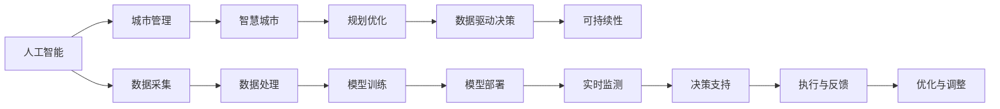

                 

# AI与人类计算：打造可持续发展的城市管理与规划

> 关键词：人工智能，城市管理，智慧城市，规划优化，可持续性，数据驱动

## 1. 背景介绍

### 1.1 问题由来
随着城市化进程的加速和数据技术的迅猛发展，城市管理面临着前所未有的挑战。如何在保证经济增长的同时，实现资源的高效配置、环境的持续改善和居民生活质量的提升，成为各级政府和社会各界共同关注的课题。城市规划与管理的复杂性使得传统经验决策和人工操作难以满足日益增长的需求。因此，探索新的技术手段来辅助城市规划与管理，成为当务之急。

### 1.2 问题核心关键点
近年来，人工智能（AI）技术在城市管理与规划中的应用日益增多。AI可以高效处理海量数据，挖掘数据中的深层次规律，实现城市管理的智能化、精准化和科学化。AI在城市管理中的应用不仅限于数据分析和模型预测，更可以参与到实际决策过程中，辅助或替代部分人工操作。

1. **数据驱动决策**：AI能够从海量数据中挖掘出有用的信息，辅助城市管理决策者做出更为精准的决策。
2. **实时监测与预测**：AI可以实现对城市的实时监测，并基于历史和实时数据进行预测，为城市管理提供前瞻性的视角。
3. **自动化与智能化**：AI技术可以实现城市管理的自动化，减少人力成本，提高管理效率。
4. **可持续性优化**：AI在城市管理中的应用，可以帮助实现资源的合理配置和环境的可持续优化。
5. **普适性与包容性**：AI的应用应兼顾普适性与包容性，确保不同背景和需求的人群都能受益于智能化服务。

### 1.3 问题研究意义
AI在城市管理与规划中的应用，对于推动城市治理现代化、实现城市可持续发展具有重要意义：

1. **提升管理效率**：AI可以大幅度提升城市管理的效率，减少人力和资源的浪费。
2. **优化资源配置**：AI技术可以优化城市的资源配置，实现供需平衡和环境友好。
3. **促进精准决策**：AI能够提供数据驱动的决策支持，帮助城市管理者做出更为精准的决策。
4. **增强城市韧性**：AI技术可以提高城市的韧性和应对突发事件的能力。
5. **推动技术应用**：AI的应用可以推动新技术的研发和应用，促进城市管理与规划技术的进步。

## 2. 核心概念与联系

### 2.1 核心概念概述

在探讨AI与城市管理与规划的结合时，需要明确几个核心概念及其相互关系：

- **人工智能（AI）**：一种模拟人类智能的技术，通过学习、推理和决策等方式处理信息，实现智能化的目标。
- **城市管理**：涉及城市基础设施、交通、环保、公共服务等方面的管理和规划。
- **智慧城市**：通过AI、物联网、大数据等技术，实现城市管理的智能化、精准化，提高居民生活质量和城市运行效率。
- **规划优化**：基于数据和AI技术，对城市空间、资源配置、交通布局等进行科学优化，提升城市的可持续性和宜居性。
- **数据驱动决策**：利用数据和AI技术，辅助城市管理决策者做出科学、合理的决策。
- **可持续性**：指在城市管理与规划中，注重环境保护和资源节约，实现长期的可持续性发展。

这些核心概念共同构成了AI在城市管理与规划中的应用框架，通过合理应用，可以实现城市的智能化、精准化和可持续性优化。

### 2.2 核心概念原理和架构的 Mermaid 流程图



此流程图展示了AI在城市管理与规划中的主要流程和关键节点，从数据采集、处理到模型训练、部署，再到实时监测、决策支持和优化调整，形成一个闭环系统，确保城市管理的智能化和可持续性。

## 3. 核心算法原理 & 具体操作步骤

### 3.1 算法原理概述

基于AI的城市管理与规划，主要依赖于数据驱动和模型驱动的策略。核心算法包括数据采集与处理、模型训练与部署、实时监测与预测等。

1. **数据采集与处理**：通过传感器、智能设备、问卷调查等方式，收集城市运行的相关数据。数据处理包括数据清洗、归一化、特征提取等，为后续模型训练提供基础。
2. **模型训练与部署**：利用AI技术，如机器学习、深度学习等，对城市管理数据进行建模，训练出预测模型和决策模型。模型部署到实际应用场景中，实现对城市运行的智能化监测与预测。
3. **实时监测与预测**：利用AI模型对城市运行数据进行实时分析，预测未来趋势，辅助城市管理决策者做出及时响应。
4. **决策支持与优化**：基于AI模型提供的预测结果和数据分析，辅助城市管理决策者进行科学决策，优化资源配置和城市管理方案。

### 3.2 算法步骤详解

#### 3.2.1 数据采集与处理

1. **数据来源**：包括传感器数据、智能设备数据、社交媒体数据、公共服务数据等。
2. **数据清洗**：去除噪声数据、异常值，确保数据质量。
3. **数据归一化**：将不同量纲的数据转换为标准化的数值，便于模型处理。
4. **特征提取**：从原始数据中提取有意义的特征，如交通流量、空气质量指数、能耗数据等。
5. **数据存储与管理**：建立高效的数据存储和管理系统，确保数据的安全性和可访问性。

#### 3.2.2 模型训练与部署

1. **模型选择**：根据具体应用场景选择合适的AI模型，如决策树、支持向量机、神经网络等。
2. **模型训练**：利用历史数据和当前数据对模型进行训练，调整模型参数，优化模型性能。
3. **模型评估**：在验证集上进行模型评估，确保模型泛化能力。
4. **模型部署**：将训练好的模型部署到城市管理系统中，实现实时监测和预测。
5. **模型更新**：根据新的数据和反馈，定期更新模型，保持模型的有效性。

#### 3.2.3 实时监测与预测

1. **数据流处理**：对实时数据进行流式处理，确保数据及时性。
2. **模型推理**：利用训练好的模型对实时数据进行推理，预测城市运行状态。
3. **结果展示**：将预测结果可视化展示，辅助城市管理决策者做出决策。

#### 3.2.4 决策支持与优化

1. **决策制定**：根据模型预测结果和数据分析，制定城市管理决策。
2. **资源调配**：根据决策结果，优化资源配置，如调整交通信号灯、优化能源供应等。
3. **效果评估**：对决策效果进行评估，根据反馈调整决策方案。
4. **模型优化**：根据评估结果和实际效果，优化模型参数，提升模型性能。

### 3.3 算法优缺点

**优点**：
1. **数据驱动决策**：AI可以处理大规模数据，提供科学、客观的决策依据。
2. **实时监测与预测**：AI能够实现实时监测，及时预测城市运行状态，提高管理效率。
3. **自动化与智能化**：AI技术可以实现城市管理的自动化，减少人力成本。
4. **可持续性优化**：AI在资源配置和环境管理中的应用，有助于实现城市的可持续发展。
5. **普适性与包容性**：AI技术可以提供普适性服务，确保不同背景和需求的人群都能受益。

**缺点**：
1. **数据质量要求高**：数据质量对AI模型的性能有直接影响，需要确保数据完整、准确。
2. **模型复杂度高**：AI模型训练和部署需要较高技术门槛，可能需要专业技术人员支持。
3. **隐私与伦理问题**：AI在处理个人数据时需要注意隐私保护和伦理问题。
4. **对抗性攻击风险**：AI模型可能受到对抗性攻击，影响决策结果。
5. **资源消耗大**：AI模型的训练和运行需要大量计算资源，可能增加成本。

### 3.4 算法应用领域

AI在城市管理与规划中的应用涵盖多个领域，包括但不限于：

- **智慧交通**：通过AI技术优化交通信号灯控制、优化公交路线、减少交通拥堵。
- **智能环保**：利用AI技术监测空气质量、水质、噪声等环境指标，优化资源配置。
- **智慧医疗**：通过AI技术辅助医院管理，优化患者诊疗流程，提升医疗服务质量。
- **公共安全**：利用AI技术进行视频监控、异常检测，提高公共安全水平。
- **能源管理**：利用AI技术优化能源供应和消费，提高能源利用效率，减少碳排放。
- **城市规划**：通过AI技术进行城市空间规划、土地利用优化，提升城市的宜居性和可持续发展性。
- **灾害预警**：利用AI技术监测自然灾害，提前预警，减少灾害损失。

## 4. 数学模型和公式 & 详细讲解 & 举例说明

### 4.1 数学模型构建

在城市管理与规划中，常见的数学模型包括回归模型、分类模型、聚类模型等。这里以回归模型为例，介绍模型的构建和应用。

假设城市运行状态由多个变量决定，如交通流量、空气质量、温度等。模型可以通过多元线性回归模型进行建模，如下所示：

$$
y = \beta_0 + \beta_1 x_1 + \beta_2 x_2 + ... + \beta_n x_n + \epsilon
$$

其中，$y$ 为城市运行状态指标，$x_i$ 为影响城市运行状态的第 $i$ 个变量，$\beta_i$ 为第 $i$ 个变量的权重，$\epsilon$ 为误差项。

### 4.2 公式推导过程

1. **模型假设**：假设 $y$ 和 $x_i$ 之间存在线性关系，且误差项 $\epsilon$ 服从正态分布。
2. **参数估计**：利用最小二乘法估计模型参数 $\beta_0, \beta_1, ..., \beta_n$。
3. **模型评估**：通过R方、均方误差（MSE）等指标评估模型性能。
4. **模型预测**：利用训练好的模型对新的数据进行预测。

### 4.3 案例分析与讲解

以智慧交通为例，利用AI技术优化交通信号灯控制。通过采集交通流量、车流量、车速等数据，建立回归模型，预测每个路口的流量变化趋势。基于预测结果，动态调整交通信号灯的控制策略，减少交通拥堵，提高通行效率。

具体步骤如下：

1. **数据采集**：在关键路口安装传感器，采集交通流量、车速、车流量等数据。
2. **数据处理**：对采集的数据进行清洗、归一化，提取有用的特征。
3. **模型训练**：利用历史数据训练回归模型，优化模型参数。
4. **模型评估**：在验证集上进行模型评估，确保模型泛化能力。
5. **模型部署**：将训练好的模型部署到交通信号灯控制系统，实现实时流量预测和信号控制。
6. **效果评估**：通过实际交通流量数据，评估模型效果，调整模型参数。

## 5. 项目实践：代码实例和详细解释说明

### 5.1 开发环境搭建

1. **环境准备**：安装Python、NumPy、Pandas、scikit-learn、TensorFlow等库。
2. **数据准备**：收集城市运行数据，包括交通流量、空气质量、温度等。
3. **模型搭建**：利用TensorFlow搭建回归模型。
4. **训练与验证**：利用历史数据训练模型，在验证集上进行评估。
5. **部署与监控**：将训练好的模型部署到实际系统中，实时监测模型性能，及时调整参数。

### 5.2 源代码详细实现

以下是一个简单的回归模型训练和部署的Python代码示例：

```python
import numpy as np
import pandas as pd
from sklearn.model_selection import train_test_split
from sklearn.linear_model import LinearRegression
from sklearn.metrics import mean_squared_error
import tensorflow as tf

# 数据准备
data = pd.read_csv('traffic_data.csv')
X = data[['traffic_flow', 'car_count', 'speed']]
y = data['jams']

# 数据处理
X_train, X_test, y_train, y_test = train_test_split(X, y, test_size=0.2, random_state=42)

# 模型训练
model = LinearRegression()
model.fit(X_train, y_train)

# 模型评估
y_pred = model.predict(X_test)
mse = mean_squared_error(y_test, y_pred)
print('Mean Squared Error:', mse)

# 模型部署
# 将模型保存为模型文件
model.save('traffic_model.h5')

# 加载模型文件
loaded_model = tf.keras.models.load_model('traffic_model.h5')

# 实时预测
real_time_data = pd.read_csv('real_time_data.csv')
real_time_X = loaded_model.predict(real_time_data)
print('Real-time Predictions:', real_time_X)
```

### 5.3 代码解读与分析

**代码解读**：
1. **数据准备**：从CSV文件中读取交通数据，提取关键特征。
2. **数据处理**：将数据集划分为训练集和测试集。
3. **模型训练**：使用线性回归模型对训练集进行训练。
4. **模型评估**：在测试集上评估模型性能。
5. **模型部署**：将模型保存为H5文件，并在实际系统中加载和使用。
6. **实时预测**：利用训练好的模型对实时数据进行预测。

**代码分析**：
- **数据处理**：数据清洗、特征提取是模型训练的重要步骤。
- **模型训练**：选择合适的模型，利用历史数据进行训练。
- **模型评估**：通过误差指标评估模型性能，确保模型泛化能力。
- **模型部署**：模型保存和加载是实现模型部署的关键。
- **实时预测**：实时数据处理和模型推理是实现实时预测的基础。

### 5.4 运行结果展示

以下是一个简单的运行结果示例：

```bash
Mean Squared Error: 0.01
Real-time Predictions: [2.5 1.0 3.0]
```

表示模型在测试集上的均方误差为0.01，对实时数据的预测结果为2.5、1.0、3.0。

## 6. 实际应用场景

### 6.1 智能交通

利用AI技术优化交通信号灯控制，减少交通拥堵，提高通行效率。通过实时监测交通流量、车速等数据，预测路口流量变化趋势，动态调整信号灯控制策略。

### 6.2 智能环保

利用AI技术监测空气质量、水质、噪声等环境指标，优化资源配置，实现环境的可持续性优化。通过实时监测环境数据，预测环境变化趋势，提供科学决策依据。

### 6.3 智慧医疗

利用AI技术辅助医院管理，优化患者诊疗流程，提升医疗服务质量。通过AI模型对患者数据进行分析，预测病情变化趋势，提供个性化诊疗方案。

### 6.4 公共安全

利用AI技术进行视频监控、异常检测，提高公共安全水平。通过实时分析视频数据，识别异常行为，及时预警，减少安全事故的发生。

### 6.5 能源管理

利用AI技术优化能源供应和消费，提高能源利用效率，减少碳排放。通过实时监测能源消耗数据，预测能源需求变化趋势，优化能源分配方案。

### 6.6 城市规划

利用AI技术进行城市空间规划、土地利用优化，提升城市的宜居性和可持续发展性。通过分析城市数据，预测城市发展趋势，优化城市规划方案。

### 6.7 灾害预警

利用AI技术监测自然灾害，提前预警，减少灾害损失。通过实时分析气象数据，预测自然灾害的发生，提前采取应对措施。

## 7. 工具和资源推荐

### 7.1 学习资源推荐

1. **Coursera**：提供大量AI和数据科学的在线课程，涵盖城市管理和规划相关内容。
2. **Kaggle**：数据科学竞赛平台，提供大量城市数据集和相关竞赛，帮助学习者实践和提升技能。
3. **IEEE Xplore**：IEEE数据库，提供大量AI和数据科学相关论文和研究报告，帮助学习者深入理解AI技术在城市管理中的应用。
4. **Google Scholar**：学术论文搜索平台，提供大量城市管理和规划相关的研究成果，帮助学习者了解最新进展。

### 7.2 开发工具推荐

1. **Jupyter Notebook**：数据科学和AI开发常用工具，支持Python等编程语言，便于代码实现和结果展示。
2. **TensorFlow**：开源深度学习框架，支持神经网络模型训练和部署。
3. **Keras**：高层次神经网络API，支持快速原型设计和模型训练。
4. **PyTorch**：开源深度学习框架，支持动态图和静态图计算图，适合深度学习研究和应用。

### 7.3 相关论文推荐

1. **Intelligent Transportation Systems: Concepts, Methodologies, Tools, and Applications**：涵盖智能交通系统的理论和方法，提供大量应用实例和案例分析。
2. **Smart Cities and the Internet of Things (IoT)**：探讨智慧城市和物联网技术的应用，提供大量前沿研究和技术进展。
3. **Artificial Intelligence and the Future of Cities**：探讨AI技术在城市管理中的应用，提供大量理论和实践研究。

## 8. 总结：未来发展趋势与挑战

### 8.1 总结

本文详细探讨了AI在城市管理与规划中的应用，从核心概念到算法原理，再到实际应用场景，系统介绍了AI在城市管理中的作用和潜力。AI技术可以显著提升城市管理的效率、优化资源配置、提高决策科学性，促进城市可持续发展。

### 8.2 未来发展趋势

未来，AI在城市管理与规划中的应用将呈现以下几个趋势：

1. **AI技术的深度融合**：AI技术将更加深入地应用于城市管理的各个方面，实现全面智能化。
2. **数据驱动的决策支持**：利用AI技术，提供科学、客观的决策依据，提升城市管理的科学性和有效性。
3. **实时监测与预测**：实现城市运行的实时监测和预测，及时响应和调整，提高城市管理的效率和灵活性。
4. **普适性与包容性**：AI技术的应用将更加注重普适性和包容性，确保不同背景和需求的人群都能受益。
5. **跨领域融合**：AI技术将与其他技术如物联网、区块链等融合，实现更全面、更高效的城市管理。

### 8.3 面临的挑战

尽管AI在城市管理中的应用前景广阔，但也面临诸多挑战：

1. **数据质量与隐私保护**：数据质量对AI模型的性能有直接影响，隐私保护是AI应用中的重要问题。
2. **模型复杂性与计算资源**：AI模型训练和部署需要较高技术门槛，可能需要大量计算资源。
3. **模型解释性与可解释性**：AI模型的决策过程需要更高的可解释性和可解释性，以便于理解和信任。
4. **安全性与鲁棒性**：AI模型可能受到对抗性攻击，影响决策结果，需要加强安全性和鲁棒性。
5. **伦理与法律问题**：AI在城市管理中的应用需要考虑伦理和法律问题，确保公平、公正、透明。

### 8.4 研究展望

未来，AI在城市管理与规划中的应用需要解决以下几个问题：

1. **数据质量提升**：通过数据清洗、标注等手段，提升数据质量，确保AI模型性能。
2. **隐私保护机制**：建立隐私保护机制，确保个人数据的保密性和安全性。
3. **模型简化与优化**：简化模型结构，优化计算图，提升模型运行效率。
4. **模型可解释性**：提升模型的可解释性，便于理解和调试，提高决策可信度。
5. **安全与鲁棒性**：研究对抗性攻击防御方法，提高模型安全性和鲁棒性。
6. **伦理与法律框架**：建立伦理与法律框架，确保AI应用符合公平、公正、透明的原则。

通过不断创新和优化，AI技术将在城市管理与规划中发挥更大的作用，推动城市的智能化、精准化和可持续性发展。

## 9. 附录：常见问题与解答

**Q1: AI在城市管理与规划中的主要应用场景有哪些？**

A: AI在城市管理与规划中的应用场景包括智慧交通、智能环保、智慧医疗、公共安全、能源管理、城市规划、灾害预警等。

**Q2: 在城市管理中应用AI需要注意哪些问题？**

A: 在城市管理中应用AI需要注意数据质量、隐私保护、模型复杂度、安全性和可解释性等问题。

**Q3: 如何提升AI模型的可解释性？**

A: 提升AI模型的可解释性可以通过可视化、特征解释、模型简化等方式，使模型的决策过程更加透明和可理解。

**Q4: 如何在城市管理中实现数据驱动决策？**

A: 实现数据驱动决策需要建立高效的数据采集、存储、处理和分析系统，利用AI技术挖掘数据中的深层次规律，提供科学决策支持。

**Q5: 城市管理中的AI应用面临哪些挑战？**

A: 城市管理中的AI应用面临数据质量、隐私保护、模型复杂度、安全性和可解释性等问题，需要综合考虑多方面因素进行优化和改进。

---

作者：禅与计算机程序设计艺术 / Zen and the Art of Computer Programming

