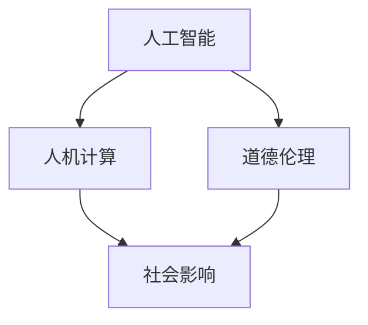

                 

# AI与人类计算：道德、伦理和社会影响

> 关键词：人工智能,人机计算,道德伦理,社会影响,公平性,隐私保护,自动化决策,人机协作,数据隐私

## 1. 背景介绍

### 1.1 问题由来
随着人工智能技术的飞速发展，AI正日益渗透到人类社会的各个角落。人工智能在带来便捷的同时，也引发了一系列道德、伦理和社会问题。例如，人工智能系统的决策透明度和公平性问题，人工智能带来的就业结构变化和职业伦理，以及AI技术在隐私保护和社会治理方面的挑战。

面对这些复杂的社会问题，本文将从道德、伦理和社会影响的角度，探讨人工智能与人类计算的关系。本研究旨在对AI技术进行深入分析，找出其对社会造成的影响，并提出相应的解决方案。

### 1.2 问题核心关键点
本文将重点关注以下几个核心问题：
- AI系统的决策透明度和公平性问题。
- 人工智能对就业结构的影响。
- 人工智能带来的隐私保护问题。
- AI技术在社会治理中的应用与挑战。

## 2. 核心概念与联系

### 2.1 核心概念概述

为更好地理解人工智能与人类计算的关系，本节将介绍几个密切相关的核心概念：

- 人工智能(Artificial Intelligence, AI)：一种通过计算机系统模拟人类智能行为的技术，包括学习、推理、感知、决策等多个方面。
- 人机计算(Human-Machine Computation, HMC)：指人与AI系统之间的交互和协作过程，包括数据获取、模型训练、结果解释等多个环节。
- 道德伦理(Ethics and Ethics)：涉及人工智能的道德准则和伦理规范，如AI决策的公平性、透明性、责任性等。
- 社会影响(Societal Impact)：指AI技术对社会各个层面的影响，包括经济、就业、隐私、伦理等。

这些概念之间的关系可以通过以下Mermaid流程图来展示：



这个流程图展示了几者之间的关系：

1. 人工智能通过人机计算过程与人类交互。
2. 人工智能系统的设计和使用必须符合道德伦理规范。
3. AI技术的发展和应用带来广泛的社会影响。

## 3. 核心算法原理 & 具体操作步骤
### 3.1 算法原理概述

人工智能与人类计算的融合，不仅包括技术层面的算法优化，还涉及道德伦理和社会影响的考量。其核心思想是：通过合理设计算法和制度，使AI系统既能高效完成计算任务，又能确保计算过程符合伦理规范，并对社会产生积极影响。

### 3.2 算法步骤详解

基于上述思想，人工智能与人类计算的融合可以分为以下几个关键步骤：

**Step 1: 确定计算目标与任务**
- 明确AI系统需要完成的具体计算任务，如数据分析、决策支持等。
- 定义计算目标，确定算法的性能指标，如准确率、召回率、响应时间等。

**Step 2: 数据收集与预处理**
- 收集与计算任务相关的数据，并进行清洗、去重、归一化等预处理操作。
- 处理数据隐私问题，确保数据收集和使用符合伦理标准。

**Step 3: 算法设计与优化**
- 选择合适的算法，并进行设计优化。
- 引入公平性、透明性等伦理因素，优化算法决策过程。
- 进行参数调优和模型训练，确保算法的高效性和准确性。

**Step 4: 模型评估与反馈**
- 在实际应用中评估AI系统的性能，收集用户反馈。
- 根据反馈结果，进行算法迭代和优化。
- 定期审查AI系统的伦理合规性，确保其符合道德规范。

**Step 5: 社会影响评估与缓解**
- 评估AI系统对社会的潜在影响，如就业、隐私等。
- 制定相应的缓解措施，如就业培训、数据保护策略等。
- 确保AI系统的决策透明度和责任追究机制。

### 3.3 算法优缺点

基于人机计算的人工智能系统具有以下优点：
1. 高效性。AI系统能够快速处理大量数据，显著提高计算效率。
2. 可靠性。通过合理设计算法，AI系统能够提供准确、一致的计算结果。
3. 可扩展性。AI系统可以通过增加计算资源，轻松扩展计算能力。

然而，AI系统也存在以下缺点：
1. 不透明性。黑盒模型的决策过程难以解释，缺乏可解释性。
2. 偏见问题。AI系统可能会学习到数据中的偏见，导致决策不公平。
3. 就业问题。AI系统的广泛应用可能会引发部分岗位的自动化，带来就业结构变化。
4. 隐私风险。AI系统需要大量的数据支持，可能涉及个人隐私泄露。
5. 伦理挑战。AI系统的行为和决策可能与人类伦理标准冲突。

### 3.4 算法应用领域

人工智能与人类计算的融合已经广泛应用于多个领域：

- 医疗领域：通过数据分析和决策支持，提高医疗诊断和治疗的精准性和效率。
- 金融领域：通过风险控制和市场预测，提升金融决策的科学性和准确性。
- 教育领域：通过个性化学习推荐和智能辅导，增强教育质量和覆盖面。
- 安全领域：通过行为分析和人脸识别，提高公共安全水平。
- 交通领域：通过数据分析和智能调度，提升交通管理和效率。

## 4. 数学模型和公式 & 详细讲解  
### 4.1 数学模型构建

本节将使用数学语言对人工智能与人类计算的融合过程进行严格刻画。

假设AI系统需要完成的任务为 $T$，数据集为 $D=\{(x_i,y_i)\}_{i=1}^N$，其中 $x_i \in \mathcal{X}$ 为输入， $y_i \in \mathcal{Y}$ 为输出。令 $A$ 为选择的算法， $M_{A}$ 为算法的决策模型。则任务 $T$ 的计算过程可以表示为：

$$
M_{A} = \mathop{\arg\min}_{A} \mathcal{L}(D, A)
$$

其中 $\mathcal{L}$ 为任务 $T$ 的损失函数，用于衡量模型 $A$ 在数据集 $D$ 上的表现。常见的损失函数包括均方误差、交叉熵等。

### 4.2 公式推导过程

以分类任务为例，假设模型 $M_{A}$ 输出 $x_i$ 的类别为 $\hat{y}_i$，真实类别为 $y_i$，则分类任务的目标函数为交叉熵损失：

$$
\mathcal{L}(D, A) = -\frac{1}{N}\sum_{i=1}^N y_i\log M_{A}(x_i) + (1-y_i)\log (1-M_{A}(x_i))
$$

目标为最小化上述损失函数，得到最优模型 $M_{A}^*$。

### 4.3 案例分析与讲解

在实际应用中，医疗领域的数据集 $D$ 通常包含患者的病历、影像、基因等高维度数据。为保证数据隐私，AI系统在设计时需引入差分隐私技术，确保患者数据在处理和传输过程中的安全性。

具体而言，在数据预处理阶段，AI系统需对患者数据进行匿名化处理，去除标识性信息。在模型训练阶段，采用差分隐私技术，通过引入噪声扰动机制，保护数据隐私。在结果输出阶段，AI系统需公开结果的统计特性，而非具体数据，以确保患者隐私不被泄露。

## 5. 项目实践：代码实例和详细解释说明
### 5.1 开发环境搭建

在进行人工智能与人类计算的融合实践前，我们需要准备好开发环境。以下是使用Python进行TensorFlow开发的环境配置流程：

1. 安装Anaconda：从官网下载并安装Anaconda，用于创建独立的Python环境。

2. 创建并激活虚拟环境：
```bash
conda create -n tf-env python=3.8 
conda activate tf-env
```

3. 安装TensorFlow：根据CUDA版本，从官网获取对应的安装命令。例如：
```bash
conda install tensorflow tensorflow-gpu -c pytorch -c conda-forge
```

4. 安装各类工具包：
```bash
pip install numpy pandas scikit-learn matplotlib tqdm jupyter notebook ipython
```

完成上述步骤后，即可在`tf-env`环境中开始实践。

### 5.2 源代码详细实现

下面以医疗领域为例，给出使用TensorFlow对AI系统进行融合的Python代码实现。

首先，定义数据处理函数：

```python
import tensorflow as tf
from tensorflow.keras import layers
import numpy as np

def preprocess_data(data):
    # 数据预处理，去除标识性信息，进行匿名化
    # 具体操作依具体场景而定
    return processed_data

# 定义模型结构
def build_model(input_shape):
    model = tf.keras.Sequential([
        layers.Dense(256, activation='relu'),
        layers.Dense(128, activation='relu'),
        layers.Dense(10, activation='softmax')
    ])
    return model

# 定义损失函数
def define_loss(y_true, y_pred):
    return tf.keras.losses.categorical_crossentropy(y_true, y_pred)

# 定义评估指标
def define_metrics(y_true, y_pred):
    return tf.keras.metrics.categorical_accuracy(y_true, y_pred)

# 加载数据
train_data = preprocess_data(train_dataset)
test_data = preprocess_data(test_dataset)

# 构建模型
model = build_model(input_shape=train_data.shape[1])

# 编译模型
model.compile(optimizer='adam', loss=define_loss, metrics=define_metrics)

# 训练模型
model.fit(train_data, train_labels, epochs=10, validation_data=(test_data, test_labels))
```

然后，训练并评估模型：

```python
# 训练模型
history = model.fit(train_data, train_labels, epochs=10, validation_data=(test_data, test_labels))

# 评估模型
test_loss, test_acc = model.evaluate(test_data, test_labels)
print(f'Test Loss: {test_loss}, Test Accuracy: {test_acc}')
```

以上就是使用TensorFlow对医疗领域AI系统进行融合的完整代码实现。可以看到，TensorFlow提供了丰富的API，使得构建和训练AI模型变得相对简单。

### 5.3 代码解读与分析

让我们再详细解读一下关键代码的实现细节：

**preprocess_data函数**：
- 定义数据预处理函数，去除标识性信息，进行匿名化处理。

**build_model函数**：
- 定义模型结构，使用TensorFlow的Sequential模型依次添加层。
- 使用ReLU作为激活函数，提高模型非线性能力。
- 使用Softmax作为输出层，用于分类任务。

**define_loss和define_metrics函数**：
- 定义损失函数和评估指标。

**训练和评估代码**：
- 加载并预处理数据。
- 构建模型并编译。
- 使用训练集进行模型训练，并在验证集上评估模型性能。
- 输出测试结果。

可以看到，TensorFlow提供了简单易用的API，使得AI模型的构建和训练变得高效便捷。开发者可以将更多精力放在数据处理、模型改进等高层逻辑上，而不必过多关注底层的实现细节。

## 6. 实际应用场景
### 6.1 智能医疗诊断

基于人机计算的AI系统，已经在医疗领域得到了广泛应用。例如，智能诊断系统可以自动分析患者的影像数据，提供精准的疾病诊断结果。智能影像分析系统通过深度学习算法，从影像中提取特征，并结合医生的专业知识，生成初步诊断。医生可以在AI系统的辅助下，快速获取关键信息，进行进一步的诊断和确认。

在技术实现上，智能诊断系统需要与医院的影像系统对接，自动获取患者影像数据。同时，需要对影像数据进行去噪、增强、分割等预处理，提取有用的特征。最终，将提取出的特征输入到深度学习模型中，输出初步诊断结果。医生可以根据AI系统的推荐，结合自身经验，进行最终诊断。

### 6.2 智能金融风险控制

金融领域也需要借助AI系统进行风险控制。传统的风险控制手段依赖于人工分析和经验判断，难以应对高频交易和复杂市场。基于人机计算的AI系统，可以通过对历史交易数据的学习，预测市场走势，识别风险点。AI系统可以根据市场变化，自动调整风险控制策略，提高风险管理的效率和精准性。

在实践中，AI系统需要从多个渠道获取市场数据，包括股票、债券、商品等。然后，通过深度学习算法，构建风险预测模型。模型可以根据实时市场数据，输出风险评估结果，并自动调整交易策略。

### 6.3 智能教育个性化推荐

智能教育系统通过AI技术，为学生提供个性化学习推荐，帮助其高效学习。AI系统可以根据学生的学习习惯、知识掌握情况，推荐适合的学习内容和方法。同时，AI系统还可以通过分析学生的作业和测试数据，生成详细的学习报告，提供个性化辅导建议。

在技术实现上，智能教育系统需要从学生的学习记录中提取特征，构建个性化推荐模型。模型可以根据学生的特征和偏好，推荐适合的学习内容。同时，可以根据学生的测试数据，生成详细的学习报告，提供个性化的辅导建议。

### 6.4 未来应用展望

未来，基于人机计算的AI系统将在更多领域得到应用，为社会带来新的变革：

- 智慧城市管理：AI系统可以应用于交通管理、公共安全、环境保护等领域，提升城市治理的智能化水平。
- 智能制造：AI系统可以优化生产流程、预测设备故障、提高产品质量，推动制造业的智能化转型。
- 智能农业：AI系统可以优化种植方案、监测病虫害、提升作物产量，推动农业的智能化发展。
- 智能家居：AI系统可以分析家庭数据，提供个性化服务，提升生活质量。

## 7. 工具和资源推荐
### 7.1 学习资源推荐

为了帮助开发者系统掌握人工智能与人类计算的理论基础和实践技巧，这里推荐一些优质的学习资源：

1. 《人工智能与伦理》系列博文：由大模型技术专家撰写，深入浅出地介绍了人工智能与伦理的关系，探讨了AI技术的道德边界。

2. 《深度学习与道德伦理》课程：斯坦福大学开设的深度学习课程，系统讲解了深度学习与伦理道德的关系，并介绍了AI技术的伦理问题。

3. 《人工智能与社会》书籍：介绍了AI技术对社会各个方面的影响，包括就业、隐私、伦理等，为开发者提供了全面的理论支持。

4. 《人工智能伦理指南》白皮书：由AI研究机构编写，详细介绍了AI技术的伦理规范，为开发者提供了实用的指导。

5. 《AI与人类计算》系列论文：学术界对AI技术在社会中的应用进行系统研究的最新成果，帮助开发者掌握前沿动态。

通过对这些资源的学习实践，相信你一定能够全面掌握人工智能与人类计算的精髓，并用于解决实际的伦理和社会问题。

### 7.2 开发工具推荐

高效的开发离不开优秀的工具支持。以下是几款用于AI与人类计算融合开发的常用工具：

1. TensorFlow：由Google主导开发的深度学习框架，生产部署方便，支持分布式训练，适合大规模工程应用。

2. PyTorch：基于Python的开源深度学习框架，灵活动态的计算图，适合快速迭代研究。

3. Keras：高级神经网络API，简化模型构建过程，支持多种深度学习框架。

4. Weights & Biases：模型训练的实验跟踪工具，可以记录和可视化模型训练过程中的各项指标，方便对比和调优。

5. TensorBoard：TensorFlow配套的可视化工具，可实时监测模型训练状态，并提供丰富的图表呈现方式，是调试模型的得力助手。

6. Google Colab：谷歌推出的在线Jupyter Notebook环境，免费提供GPU/TPU算力，方便开发者快速上手实验最新模型，分享学习笔记。

合理利用这些工具，可以显著提升人工智能与人类计算的融合开发效率，加快创新迭代的步伐。

### 7.3 相关论文推荐

人工智能与人类计算的研究源于学界的持续研究。以下是几篇奠基性的相关论文，推荐阅读：

1. 《人工智能与伦理：一个框架》：提出人工智能伦理框架，探讨了AI技术在社会中的应用与挑战。

2. 《人工智能伦理指南》：提供了AI技术的伦理规范，包括数据隐私、公平性、可解释性等多个方面。

3. 《智能系统的可解释性与伦理》：探讨了智能系统的可解释性与伦理问题，提出了多种可解释性方法。

4. 《人工智能对就业的影响》：系统分析了AI技术对就业结构的影响，提出了应对策略。

5. 《人工智能对隐私保护的影响》：介绍了AI技术在隐私保护方面的应用，提出了隐私保护策略。

这些论文代表了大语言模型微调技术的发展脉络。通过学习这些前沿成果，可以帮助研究者把握学科前进方向，激发更多的创新灵感。

## 8. 总结：未来发展趋势与挑战
### 8.1 总结

本文对人工智能与人类计算的道德、伦理和社会影响进行了全面系统的介绍。首先阐述了AI技术在人类社会中的广泛应用，明确了其对社会各个层面的深远影响。其次，从道德、伦理和社会影响的角度，详细讲解了AI系统的设计、实施和评估过程，给出了具体案例和分析。

通过本文的系统梳理，可以看到，人工智能与人类计算的融合，既有显著的技术优势，也面临诸多伦理和社会挑战。如何在技术创新的同时，确保伦理合规、社会公平，是未来研究的重要方向。

### 8.2 未来发展趋势

展望未来，人工智能与人类计算的融合将呈现以下几个发展趋势：

1. 自动化决策的普及。AI系统将在更多领域实现自动化决策，提高决策效率和精准性。

2. 隐私保护技术的提升。AI系统需要更先进的隐私保护技术，保护数据隐私和安全。

3. 人机协作的深化。AI系统将与人类更加紧密地协作，提升协同工作的效率和效果。

4. 伦理规范的完善。AI系统需要在设计和实施过程中，遵循严格的伦理规范，确保社会公平和公正。

5. 社会治理的智能化。AI系统将应用于社会治理，提升公共服务的智能化水平。

这些趋势凸显了人工智能与人类计算的巨大潜力，相信未来会为人类社会带来更多的便利和进步。

### 8.3 面临的挑战

尽管人工智能与人类计算的融合带来了诸多便利，但在迈向更加智能化、普适化应用的过程中，它仍面临诸多挑战：

1. 数据隐私问题。AI系统需要大量的数据支持，如何保护数据隐私，确保数据安全，是一个重要问题。

2. 算法公平性问题。AI系统可能会学习到数据中的偏见，导致决策不公平。如何在算法设计中引入公平性，是一个重要的研究方向。

3. 伦理规范的执行。AI系统在设计和实施过程中，需要遵循伦理规范，但在实际应用中，如何确保伦理规范得到执行，是一个亟待解决的问题。

4. 社会接受度问题。AI系统在应用过程中，可能会引发社会不满和抵触情绪，如何在技术推广过程中，提高社会的接受度，是一个重要课题。

5. 法律和监管问题。AI系统在应用过程中，可能涉及法律和监管问题，如何在法律框架下进行规范和监管，是一个重要研究方向。

这些挑战需要学术界、产业界和政策制定者共同努力，才能推动人工智能与人类计算的融合，实现科技与社会和谐共进。

### 8.4 研究展望

面对人工智能与人类计算的融合面临的诸多挑战，未来的研究需要在以下几个方面寻求新的突破：

1. 开发先进的隐私保护技术，保护数据隐私和安全。

2. 引入公平性约束机制，确保AI系统的决策公平性。

3. 制定严格的伦理规范，确保AI系统的伦理合规性。

4. 推动社会对AI技术的理解和接受，提高社会的接受度。

5. 建立AI技术的法律和监管框架，确保AI系统的合法合规。

这些研究方向的探索，必将引领人工智能与人类计算的融合技术迈向更高的台阶，为构建人机协作的智能社会铺平道路。面向未来，人工智能与人类计算需要更多地融合伦理、社会等多维度的考量，共同推动人类社会的进步和发展。

## 9. 附录：常见问题与解答

**Q1：人工智能系统如何保证决策的透明性和公平性？**

A: 为保证人工智能系统的决策透明性和公平性，需要引入可解释性和公平性约束机制。具体措施包括：

1. 引入可解释性技术，如可解释AI(Explainable AI)，使AI系统的决策过程透明、可理解。
2. 在算法设计中引入公平性约束，如公平性损失函数，确保不同群体的公平性。
3. 定期进行系统评估，发现并修复潜在的偏见和不公平问题。
4. 引入多方利益相关者参与，确保AI系统的设计和实施符合伦理规范。

**Q2：人工智能系统如何保护数据隐私？**

A: 为保护数据隐私，需要在数据收集、存储、处理和传输等各个环节进行严格保护。具体措施包括：

1. 数据匿名化处理，去除标识性信息，确保数据无法识别个人身份。
2. 引入差分隐私技术，通过引入噪声扰动机制，保护数据隐私。
3. 加密数据传输和存储，确保数据在传输和存储过程中不被泄露。
4. 制定严格的数据访问权限，确保数据仅对授权人员开放。

**Q3：人工智能系统在社会治理中的应用有哪些？**

A: 人工智能系统在社会治理中的应用包括：

1. 智能交通管理：通过数据分析和智能调度，优化交通流量，提高交通管理效率。
2. 智能公共安全：通过人脸识别和行为分析，提升公共安全水平，预防犯罪和灾害。
3. 智能环境保护：通过数据分析和预测，优化环境保护措施，提高环保效果。
4. 智能教育管理：通过数据分析和智能推荐，优化教育资源配置，提高教育质量。
5. 智能医疗管理：通过数据分析和智能诊断，优化医疗资源配置，提高医疗服务质量。

**Q4：如何缓解人工智能系统带来的就业问题？**

A: 为缓解人工智能系统带来的就业问题，需要采取以下措施：

1. 进行职业培训和技能提升，帮助员工适应AI技术带来的变化。
2. 推动跨领域岗位培训，提升员工的多样化技能，提高就业机会。
3. 制定就业保障政策，如失业救济、再就业培训等，帮助失业人员重新就业。
4. 引入AI技术替代劳动强度大、危险性高的工作，提高员工的工作效率和安全性。

**Q5：人工智能系统如何应对伦理规范的挑战？**

A: 为应对伦理规范的挑战，需要采取以下措施：

1. 制定严格的伦理规范，确保AI系统的设计和实施符合伦理标准。
2. 引入多方利益相关者参与，确保AI系统的设计和实施符合社会价值。
3. 定期进行伦理审查，发现并修复潜在伦理问题。
4. 提高AI系统的透明度和可解释性，确保决策过程透明、可理解。

这些措施将有助于确保AI系统的伦理合规性，提升社会对AI技术的信任度。

---

作者：禅与计算机程序设计艺术 / Zen and the Art of Computer Programming

