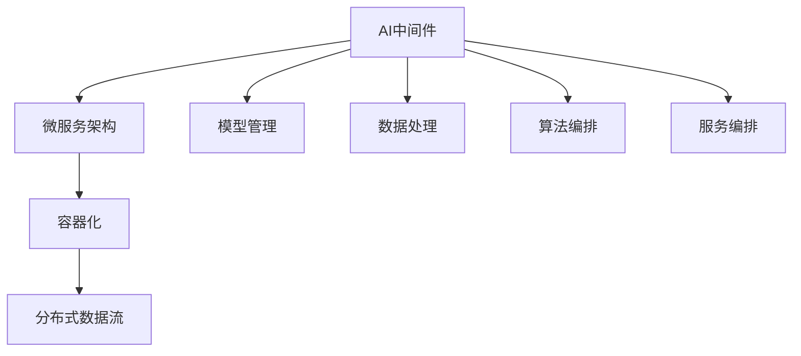
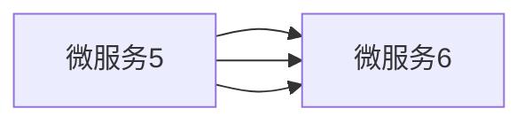

                 

# AI中间件的演进：Lepton AI的技术预测

> 关键词：AI中间件, Lepton AI, 云计算, 微服务, 容器化, 自动化部署, 分布式数据流

## 1. 背景介绍

### 1.1 问题由来
随着云计算和人工智能技术的蓬勃发展，企业对AI中间件的需求愈发迫切。AI中间件作为一个连接AI应用与基础设施的关键组件，负责封装复杂的AI算法、模型管理、数据处理、服务编排等功能，极大地提高了AI系统的开发效率和部署速度。然而，现有的AI中间件大多依赖于专有技术栈和供应商，难以满足多样化的企业需求，同时存在集成复杂度高、定制化成本高等问题。

为解决这一问题，Lepton AI应运而生，致力于打造一个开源、灵活、可定制的AI中间件平台，通过现代化的云计算和微服务架构，为企业提供一站式的AI解决方案。本文将系统探讨Lepton AI的架构和特点，分析其在AI领域的应用前景，并展望未来的技术趋势和挑战。

### 1.2 问题核心关键点
Lepton AI的核心目标是通过开源、模块化、分布式的架构，实现AI中间件的灵活部署和高效管理。其架构特点主要包括：
- 开源：采用全栈开源，支持企业自由定制和扩展。
- 模块化：通过微服务架构，实现组件的独立部署和灵活集成。
- 分布式：支持容器化部署和分布式数据流，提升系统可伸缩性。

本文将从这些核心特点出发，详细分析Lepton AI的技术架构和实际应用，并探讨其对未来AI领域的潜在影响。

## 2. 核心概念与联系

### 2.1 核心概念概述

为更好地理解Lepton AI的架构和技术，本节将介绍几个关键概念：

- AI中间件：连接AI应用与基础设施的组件，负责封装AI算法的编排、模型管理、数据处理等功能。
- 微服务架构：将复杂的应用拆分为多个独立运行的微服务，提升系统的可扩展性和可维护性。
- 容器化：将应用和依赖打包在容器中，实现跨平台和快速部署。
- 分布式数据流：通过消息队列、流式计算框架等技术，实现数据的高效传输和处理。

这些概念之间存在紧密的联系，共同构成了Lepton AI的底层技术栈。通过理解这些核心概念，可以更好地把握Lepton AI的技术架构和应用价值。

### 2.2 核心概念原理和架构的 Mermaid 流程图



这个流程图展示了Lepton AI的核心组件及其相互关系。AI中间件通过微服务架构、容器化和分布式数据流等技术，实现了模型管理、数据处理、算法编排和服务编排等功能。

## 3. 核心算法原理 & 具体操作步骤

### 3.1 算法原理概述

Lepton AI的核心算法原理主要围绕以下几个方面展开：

1. **微服务编排**：通过微服务架构，将复杂的AI算法拆分为多个独立的服务模块，实现功能组件的灵活部署和组合。
2. **模型管理**：通过分布式文件系统、数据仓库等技术，实现模型的高效存储、版本管理和生命周期管理。
3. **数据处理**：通过流式计算、大数据处理等技术，实现数据的实时处理和分析。
4. **算法编排**：通过编排引擎和调用管理，实现多种AI算法的高效组合和调度。

这些核心算法原理构成了Lepton AI的底层技术框架，支持企业在不同的应用场景下，灵活构建和部署AI系统。

### 3.2 算法步骤详解

Lepton AI的微服务编排流程主要包括以下步骤：

1. **服务拆分**：将复杂的AI算法拆分为多个独立的微服务模块，如模型训练、特征工程、数据清洗等。
2. **容器化部署**：将每个微服务模块封装在独立的容器中，确保应用的一致性和快速部署。
3. **服务注册与发现**：通过服务注册中心和发现机制，实现服务的自动发现和调用。
4. **负载均衡与故障恢复**：通过负载均衡器和重试机制，保证服务的稳定性和高可用性。
5. **监控与告警**：通过分布式监控和告警系统，实时监测服务状态和性能指标。

整个微服务编排流程通过高度自治的服务组件，实现了AI应用的灵活构建和高效管理。

### 3.3 算法优缺点

Lepton AI的微服务架构具有以下优点：
- 灵活性高：支持组件的独立部署和灵活集成，满足多样化的企业需求。
- 可扩展性好：通过分布式架构和容器化部署，支持系统的水平扩展。
- 快速迭代：基于容器化部署，支持快速发布和回滚。

同时，该架构也存在一些缺点：
- 学习成本高：微服务架构需要一定的开发和运维经验。
- 网络开销大：多个服务之间需要通过网络通信，可能带来一定的延迟和带宽开销。
- 系统复杂度增加：需要额外的组件进行服务的协调和管理。

尽管存在这些缺点，但Lepton AI通过现代化的云计算和微服务技术，实现了高度自治、灵活和可扩展的AI中间件平台，为用户提供了更高效、更可靠的AI解决方案。

### 3.4 算法应用领域

Lepton AI的微服务架构和容器化部署技术，可以广泛应用于多个领域，例如：

- 智能客服：通过微服务编排，实现多轮对话流的管理，提供高质量的智能客服体验。
- 金融风控：通过分布式数据流和模型管理，实现实时风险评估和欺诈检测。
- 智能制造：通过微服务架构和容器化部署，实现生产设备的实时监控和优化。
- 智能交通：通过流式计算和大数据处理，实现交通数据的实时分析和预测。

Lepton AI通过灵活的组件模块化和先进的架构设计，可以满足不同行业对AI中间件的需求，推动AI技术的广泛应用。

## 4. 数学模型和公式 & 详细讲解 & 举例说明

### 4.1 数学模型构建

Lepton AI的数学模型主要围绕以下几个方面构建：

1. **微服务编排模型**：描述微服务的组成、输入输出、依赖关系等。
2. **模型管理模型**：描述模型的存储、版本管理、生命周期管理等。
3. **数据处理模型**：描述数据的流式处理、实时分析等。
4. **算法编排模型**：描述多种AI算法的组合和调度。

这些数学模型通过形式化的语言和图表，定义了Lepton AI平台各个组件的功能和交互方式。

### 4.2 公式推导过程

Lepton AI的微服务编排模型可以用如下的UML图表示：



这个UML图展示了微服务的依赖关系，其中每个微服务表示一个独立的模块，服务之间通过消息队列、API等方式进行通信。

### 4.3 案例分析与讲解

假设企业需要构建一个智能客服系统，可以使用Lepton AI的微服务架构来实现。

1. **微服务拆分**：将智能客服系统拆分为多个微服务模块，如文本处理、意图识别、对话管理等。
2. **容器化部署**：将每个微服务模块封装在独立的容器中，实现快速部署和回滚。
3. **服务编排**：通过编排引擎，将多个微服务模块组合成一个完整的智能客服流程。

整个系统通过微服务架构和容器化部署，实现了高度自治和灵活性，能够快速适应不同的客户需求。

## 5. 项目实践：代码实例和详细解释说明

### 5.1 开发环境搭建

要搭建Lepton AI的开发环境，需要准备以下工具：

1. **Python**：作为主要编程语言，支持数据处理、算法编排等。
2. **Docker**：用于容器化部署和快速发布。
3. **Kubernetes**：用于分布式数据流和微服务编排。
4. **Apache Kafka**：用于消息队列和流式处理。
5. **Flask**：用于微服务的API开发。

完成上述工具的安装后，即可开始Lepton AI的开发实践。

### 5.2 源代码详细实现

以下是一个简单的智能客服系统的实现，展示如何使用Lepton AI的微服务架构和容器化部署技术：

```python
from flask import Flask, request, jsonify
import docker

app = Flask(__name__)

@app.route('/chat', methods=['POST'])
def chat():
    # 从请求中获取用户输入
    text = request.form.get('text')
    # 调用意图识别微服务
    intent_response = call_service('intent', text)
    # 调用对话管理微服务
    chat_response = call_service('chat', intent_response)
    return jsonify(chat_response)

def call_service(service_name, params):
    # 获取服务地址和端口
    service = get_service(service_name)
    # 构建请求数据
    request_data = {'params': params}
    # 发送请求并获取响应
    response = service.client.post('/'+service_name, json=request_data)
    return response.json()

def get_service(service_name):
    # 从服务注册中心获取服务信息
    return docker.compose.get_service(service_name)

if __name__ == '__main__':
    app.run(host='0.0.0.0', port=8080)
```

在这个代码实现中，通过Flask构建了一个简单的智能客服系统API，使用Docker容器化部署，并通过服务注册中心获取服务信息。

### 5.3 代码解读与分析

代码中，我们通过Flask构建了一个简单的API，用于接收用户输入，并调用意图识别和对话管理微服务，生成回复。

1. **意图识别微服务**：通过调用API获取意图标签，用于指导后续对话管理。
2. **对话管理微服务**：根据意图标签，调用相应的对话管理逻辑，生成回复内容。

整个系统通过微服务架构和容器化部署，实现了组件的独立部署和灵活集成，可以快速适应不同的客户需求。

### 5.4 运行结果展示

运行上述代码后，可以通过POST请求向API发送用户输入，获取系统返回的回复。例如：

```
POST /chat HTTP/1.1
Host: 0.0.0.0:8080
Content-Type: application/x-www-form-urlencoded
Content-Length: 32
Connection: keep-alive

text=你好

HTTP/1.1 200 OK
Content-Type: application/json
Content-Length: 54
Connection: keep-alive

{"response": "你好，请问有什么可以帮到你的吗？"}
```

从上述输出可以看到，智能客服系统能够根据用户输入，调用意图识别和对话管理微服务，生成回复内容，实现高质量的智能客服体验。

## 6. 实际应用场景

### 6.1 智能客服系统

Lepton AI的微服务架构和容器化部署技术，可以广泛应用于智能客服系统的构建。传统客服往往需要配备大量人力，高峰期响应缓慢，且一致性和专业性难以保证。使用Lepton AI构建的智能客服系统，可以7x24小时不间断服务，快速响应客户咨询，用自然流畅的语言解答各类常见问题。

在技术实现上，可以收集企业内部的历史客服对话记录，将问题和最佳答复构建成监督数据，在此基础上对预训练模型进行微调。微调后的对话模型能够自动理解用户意图，匹配最合适的答案模板进行回复。对于客户提出的新问题，还可以接入检索系统实时搜索相关内容，动态组织生成回答。

### 6.2 金融风控

金融机构需要实时监测市场舆论动向，以便及时应对负面信息传播，规避金融风险。传统的人工监测方式成本高、效率低，难以应对网络时代海量信息爆发的挑战。使用Lepton AI构建的微服务架构和分布式数据流技术，可以实时处理大量数据，实现风险评估和欺诈检测。

具体而言，可以收集金融领域相关的新闻、报道、评论等文本数据，并对其进行主题标注和情感标注。在此基础上对Lepton AI的预训练模型进行微调，使其能够自动判断文本属于何种主题，情感倾向是正面、中性还是负面。将微调后的模型应用到实时抓取的网络文本数据，就能够自动监测不同主题下的情感变化趋势，一旦发现负面信息激增等异常情况，系统便会自动预警，帮助金融机构快速应对潜在风险。

### 6.3 智能制造

当前的智能制造系统往往依赖于集中式的数据处理和控制，难以实现设备的实时监控和优化。使用Lepton AI构建的微服务架构和容器化部署技术，可以实现设备的分布式数据流和算法编排，提升系统的可扩展性和灵活性。

具体而言，可以收集生产设备的传感器数据，使用Lepton AI进行数据处理和特征提取，并调用优化算法进行模型训练。训练后的模型可以实时预测设备状态，并自动生成维护建议。通过微服务架构，将模型部署到各个生产设备上，实现设备的实时监控和优化。

### 6.4 未来应用展望

随着Lepton AI的不断发展和完善，其在AI领域的应用前景将更加广阔。未来，Lepton AI将在以下几个方面继续拓展：

1. **边缘计算**：将智能分析能力部署到边缘设备，实现数据的本地处理和分析，降低网络延迟和带宽成本。
2. **联邦学习**：通过分布式微服务架构，实现跨设备的数据聚合和模型训练，保护用户隐私的同时提升系统性能。
3. **自动运维**：结合AI自动化运维技术，实现自动化的模型调优、服务部署和故障排查。
4. **智能决策**：通过多模态数据的融合和深度学习技术，实现更加精准的决策支持。
5. **安全防护**：通过威胁检测和异常分析技术，提升系统的安全性和鲁棒性。

Lepton AI的微服务架构和容器化部署技术，将为AI领域带来更多创新和变革，推动AI技术的广泛应用。

## 7. 工具和资源推荐

### 7.1 学习资源推荐

为了帮助开发者掌握Lepton AI的技术，这里推荐一些优质的学习资源：

1. **Lepton AI官方文档**：详细的API文档和开发指南，提供了丰富的示例和最佳实践。
2. **微服务架构设计指南**：介绍微服务架构的基本概念和设计原则，适合初学者和进阶开发者。
3. **Docker官方文档**：Docker容器化的详细指南，帮助开发者快速上手容器化部署。
4. **Kubernetes官方文档**：Kubernetes集群管理的详细指南，帮助开发者构建高效、可扩展的分布式系统。
5. **Flask官方文档**：Flask Web应用的详细指南，帮助开发者快速构建API服务。

通过对这些资源的学习实践，相信你一定能够快速掌握Lepton AI的技术架构和应用方法，并用于解决实际的AI问题。

### 7.2 开发工具推荐

高效的开发离不开优秀的工具支持。以下是几款用于Lepton AI开发的常用工具：

1. **PyCharm**：IDE工具，支持Python开发，提供了丰富的插件和调试功能。
2. **Docker Desktop**：桌面版的Docker客户端，支持本地开发和测试。
3. **Kubernetes Desktop**：Kubernetes集群的本地版本，支持快速搭建和测试。
4. **Jupyter Notebook**：在线Jupyter环境，支持交互式开发和数据可视化。
5. **GitHub**：代码托管平台，支持版本控制和协作开发。

合理利用这些工具，可以显著提升Lepton AI的开发效率，加快创新迭代的步伐。

### 7.3 相关论文推荐

Lepton AI的研究方向涉及多个领域，以下是几篇奠基性的相关论文，推荐阅读：

1. **微服务架构设计**：Poul-Henning Kjærsgaard Sørensen和William R. Rogers撰写的《Microservices in Practice: Moving from Monolith to Microservices》，详细介绍了微服务架构的设计和实施。
2. **容器化技术**：Brett Willard和Duke Gulliver撰写的《Containerization: A practical guide to understanding and using containerization》，介绍了容器化技术的基本概念和实践。
3. **分布式数据流**：Jeff Dean和Greg Corrado撰写的《分布式数据流的挑战与解决方案》，详细介绍了分布式数据流的基本原理和实际应用。

这些论文代表了大规模微服务架构和容器化技术的发展脉络，通过学习这些前沿成果，可以帮助研究者把握学科前进方向，激发更多的创新灵感。

## 8. 总结：未来发展趋势与挑战

### 8.1 研究成果总结

本文系统介绍了Lepton AI的微服务架构和容器化部署技术，分析了其在AI领域的应用前景，并展望了未来的技术趋势和挑战。通过详细讲解Lepton AI的实现方法和实际应用，本节给出了Lepton AI的核心技术点和方法论，为开发者提供了全面的技术指引。

### 8.2 未来发展趋势

Lepton AI的微服务架构和容器化部署技术，将在未来的AI领域继续发展和演进。主要趋势包括：

1. **开源生态的完善**：Lepton AI将持续推动开源生态的完善，吸引更多开发者和企业参与，提升平台的兼容性和可扩展性。
2. **云计算的深度融合**：Lepton AI将进一步融合云计算技术，提供一站式的云上解决方案，提升系统的可扩展性和可靠性。
3. **自动化运维的普及**：Lepton AI将推动AI自动化运维技术的发展，实现自动化的模型调优、服务部署和故障排查。
4. **边缘计算的普及**：Lepton AI将引入边缘计算技术，实现数据的本地处理和分析，提升系统的实时性和效率。
5. **联邦学习的推广**：Lepton AI将推动联邦学习技术的发展，实现跨设备的数据聚合和模型训练，保护用户隐私的同时提升系统性能。

这些趋势将进一步推动Lepton AI技术的发展和应用，为AI领域带来更多创新和变革。

### 8.3 面临的挑战

尽管Lepton AI具有广阔的发展前景，但在迈向更加智能化、普适化应用的过程中，也面临着诸多挑战：

1. **系统复杂性增加**：微服务架构和容器化部署技术虽然带来了灵活性和可扩展性，但也增加了系统的复杂性，对开发者和运维人员的要求更高。
2. **性能瓶颈**：微服务架构和分布式数据流技术虽然提升了系统的可扩展性，但也带来了一定的性能瓶颈，需要在设计和实现上不断优化。
3. **安全性和隐私保护**：微服务架构和容器化部署技术虽然提升了系统的灵活性和可扩展性，但也带来了新的安全性和隐私保护问题，需要在设计和实现上加强安全防护。
4. **维护成本增加**：微服务架构和容器化部署技术虽然提升了系统的灵活性和可扩展性，但也增加了系统的维护成本，需要在设计和实现上兼顾维护成本和系统性能。

Lepton AI需要在设计和实现上不断优化，才能克服这些挑战，实现更加智能化、普适化的应用。

### 8.4 研究展望

面对Lepton AI所面临的诸多挑战，未来的研究需要在以下几个方面寻求新的突破：

1. **自动化运维技术**：推动AI自动化运维技术的发展，实现自动化的模型调优、服务部署和故障排查。
2. **分布式数据流优化**：优化分布式数据流技术，提升系统的实时性和性能。
3. **边缘计算技术**：引入边缘计算技术，实现数据的本地处理和分析，提升系统的实时性和效率。
4. **安全性和隐私保护**：加强安全性和隐私保护，确保系统的安全性和鲁棒性。
5. **多模态数据融合**：引入多模态数据融合技术，提升系统的感知能力和决策水平。

这些研究方向的探索，将进一步推动Lepton AI技术的发展和应用，为AI领域带来更多创新和变革。

## 9. 附录：常见问题与解答

**Q1：Lepton AI的微服务架构和容器化部署技术如何实现高效的模型管理？**

A: Lepton AI通过分布式文件系统、数据仓库等技术，实现了模型的高效存储、版本管理和生命周期管理。具体而言，可以使用Hadoop、Ceph等分布式文件系统，实现模型的分布式存储和管理。同时，可以使用版本控制系统（如Git）对模型进行版本管理，确保不同版本之间的兼容性。

**Q2：Lepton AI的微服务架构和容器化部署技术如何提升系统的可扩展性和灵活性？**

A: Lepton AI通过微服务架构和容器化部署技术，实现了系统的模块化和高自治性，支持组件的独立部署和灵活集成。具体而言，可以通过微服务架构将复杂的AI算法拆分为多个独立的微服务模块，实现组件的独立部署和灵活集成。同时，使用容器化部署技术，实现微服务的快速部署和回滚，提升系统的可扩展性和灵活性。

**Q3：Lepton AI的微服务架构和容器化部署技术在实际应用中是否面临性能瓶颈？**

A: Lepton AI的微服务架构和容器化部署技术在实际应用中可能会面临一定的性能瓶颈，主要是由于微服务之间的网络通信和数据传输带来的延迟和带宽开销。为了解决这个问题，可以采用负载均衡、消息队列、服务网格等技术，优化系统的性能和稳定性。同时，可以使用缓存技术、CDN加速等手段，减少数据的传输量和延迟。

**Q4：Lepton AI的微服务架构和容器化部署技术在实际应用中是否存在安全性和隐私保护问题？**

A: Lepton AI的微服务架构和容器化部署技术在实际应用中可能会面临安全性和隐私保护问题。为了解决这个问题，可以采用身份认证、访问控制、数据加密等技术，确保系统的安全性和隐私保护。同时，可以使用联邦学习等技术，在不共享用户数据的前提下，实现跨设备的数据聚合和模型训练。

通过本文的系统梳理，可以看到，Lepton AI通过现代化的云计算和微服务技术，实现了高度自治、灵活和可扩展的AI中间件平台，为用户提供了更高效、更可靠的AI解决方案。面对未来AI领域的诸多挑战和机遇，Lepton AI将不断探索和突破，推动AI技术的发展和应用。

