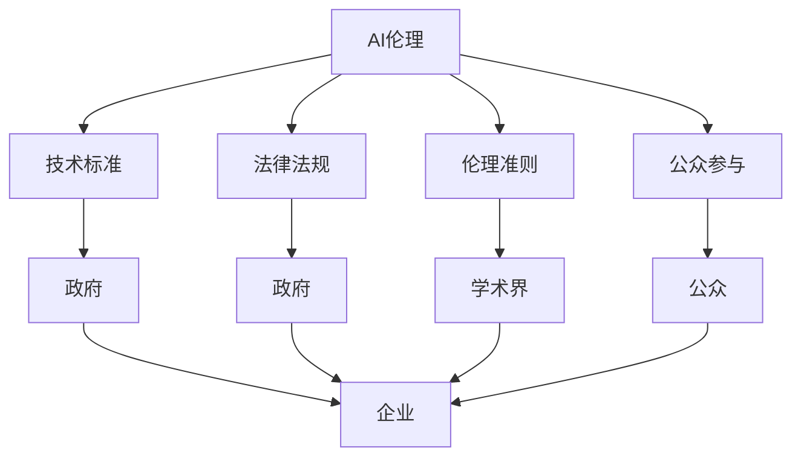

                 

# AI伦理的多利益相关者治理：政府、企业、学术界和公众

## 1. 背景介绍

### 1.1 问题由来
随着人工智能(AI)技术的迅猛发展，其在各个领域的应用越来越广泛，带来了一系列伦理问题。比如，面部识别技术的滥用可能侵犯个人隐私，自动驾驶汽车可能引发交通事故，AI招聘系统可能产生偏见等。这些问题的出现，使得AI伦理成为了一个亟需多方共同关注和解决的课题。

### 1.2 问题核心关键点
AI伦理的多利益相关者治理，涉及多个主体（政府、企业、学术界、公众），需要在不同维度（技术、法律、伦理）进行协同。该问题的核心关键点包括：

- **技术中立性**：AI技术本身是中立的，但应用过程中可能带来伦理问题，需要多方共同制定技术标准和规范。
- **法律监管**：政府需要制定和执行相应的法律法规，保护公众利益，避免AI技术的滥用。
- **伦理指导**：学术界需要研究AI伦理的理论基础，提供科学指导，并制定相应的伦理准则。
- **公众参与**：公众是AI技术应用最直接的受益者或受害者，需要广泛参与到伦理治理的讨论中，表达自己的需求和担忧。

## 2. 核心概念与联系

### 2.1 核心概念概述

为更好地理解AI伦理的多利益相关者治理，本节将介绍几个密切相关的核心概念：

- **AI伦理**：指在AI开发和应用过程中，应遵循的一系列伦理原则和规范，如隐私保护、公平性、透明性等。
- **多利益相关者治理**：涉及多个主体（政府、企业、学术界、公众），通过协商和合作，共同制定和执行AI伦理规范的过程。
- **技术标准**：为确保AI技术的可控性和安全性，由政府或国际组织制定的一系列技术标准和规范。
- **法律法规**：政府为保护公众利益，防止AI技术滥用，制定和实施的一系列法律法规。
- **伦理准则**：学术界研究提出的指导AI开发和应用的伦理原则和规范。
- **公众参与**：公众通过多种途径参与到AI伦理的讨论和决策中，表达意见和建议。

这些核心概念之间的逻辑关系可以通过以下Mermaid流程图来展示：

这个流程图展示了大语言模型的核心概念及其之间的关系：

1. AI伦理是治理的基础，涉及技术、法律、伦理等多个维度。
2. 技术标准由政府或国际组织制定，用于指导和规范AI技术的开发和应用。
3. 法律法规由政府制定，用于保护公众利益，防止AI技术的滥用。
4. 伦理准则是学术界研究的成果，为AI开发提供科学指导。
5. 公众参与是多方治理的重要环节，通过各种渠道表达意见和建议。
6. 政府、企业、学术界和公众共同构成AI伦理的多利益相关者治理体系。

## 3. 核心算法原理 & 具体操作步骤
### 3.1 算法原理概述

AI伦理的多利益相关者治理，本质上是一个多方协同决策的过程。其核心思想是：通过政府、企业、学术界、公众等各方主体之间的对话和合作，共同制定和实施AI伦理规范，确保AI技术在开发和应用过程中的公平、透明、可控。

形式化地，假设治理的目标是找到最优的伦理规范 $\theta^*$，使得各方主体都能接受并遵守。优化目标是最小化各方主体的不满意度：

$$
\theta^* = \mathop{\arg\min}_{\theta} \sum_i f_i(\theta)
$$

其中 $f_i(\theta)$ 表示第 $i$ 方主体对伦理规范 $\theta$ 的不满意度，$i$ 可以是政府、企业、学术界或公众。通过最小化总的不满意度，达到多方协同决策的目标。

### 3.2 算法步骤详解

AI伦理的多利益相关者治理一般包括以下几个关键步骤：

**Step 1: 建立多方沟通机制**
- 建立多利益相关者的沟通渠道，如政府和企业的对话会，学术界的论坛讨论，公众的问卷调查等。
- 通过定期的沟通和反馈机制，保持各方主体之间的信息透明和相互信任。

**Step 2: 制定技术标准**
- 由政府或国际组织牵头，制定AI技术的标准和规范，如数据隐私保护标准、算法透明性要求等。
- 通过公开征求意见，组织专家评审，确保标准的科学性和可执行性。

**Step 3: 制定法律法规**
- 由政府制定和执行AI领域的法律法规，如《人工智能伦理指南》、《面部识别管理条例》等。
- 确保法律法规的权威性和强制力，保护公众利益，防止AI技术的滥用。

**Step 4: 制定伦理准则**
- 由学术界研究提出AI伦理的指导原则和规范，如《AI伦理宣言》、《数据使用伦理指南》等。
- 通过学术论文和公开报告，推广和宣传伦理准则，提升公众和企业的伦理意识。

**Step 5: 公众参与与监督**
- 通过各种渠道（如社交媒体、公民投票、公众咨询等）广泛征求公众意见。
- 将公众反馈纳入多方决策的考量中，确保伦理规范的公平性和包容性。

**Step 6: 实施与监督**
- 各方主体共同实施制定的伦理规范和技术标准。
- 通过第三方机构进行独立评估和监督，确保规范的有效性和合规性。

### 3.3 算法优缺点

AI伦理的多利益相关者治理方法具有以下优点：
1. 多方协同决策。通过多方主体共同参与，确保决策的科学性和公平性。
2. 法规和标准的权威性。政府和国际组织制定的法规和标准具有法律约束力，能够有效规范AI技术的应用。
3. 伦理准则的科学性。学术界的研究成果能够为AI伦理提供科学指导，提升规范的合理性。
4. 公众参与的广泛性。公众的广泛参与能够增强伦理规范的社会认同感和执行力。

同时，该方法也存在一些局限性：
1. 多方沟通难度大。涉及不同背景和利益主体，协调和沟通成本高。
2. 法规和标准的执行难度大。各方的执行力度和能力不同，可能导致规范落实困难。
3. 公众参与的复杂性。公众意见多样，如何平衡各方需求，是一个复杂的问题。

尽管存在这些局限性，但就目前而言，多方协同决策仍是解决AI伦理问题的最有效方式。未来相关研究的重点在于如何进一步提高多方沟通效率，增强法规和标准的执行力，扩大公众参与的范围和深度。

### 3.4 算法应用领域

AI伦理的多利益相关者治理方法，在各个领域都得到了广泛的应用，包括但不限于：

- 医疗健康：确保AI医疗设备的公平使用和隐私保护，防止数据滥用。
- 金融行业：确保AI金融产品的透明性和公平性，防止算法偏见和滥用。
- 司法领域：确保AI司法判决的公正性和透明性，防止误判和歧视。
- 教育系统：确保AI教育系统的公平性，防止数据隐私泄露和算法偏见。
- 公共安全：确保AI公共安全技术的公平使用和透明性，防止滥用。

除了这些具体应用外，AI伦理的多利益相关者治理方法也为AI技术的广泛应用提供了重要的保障，成为AI技术落地应用的重要手段。

## 4. 数学模型和公式 & 详细讲解 & 举例说明

### 4.1 数学模型构建

本节将使用数学语言对AI伦理的多利益相关者治理过程进行更加严格的刻画。

设AI伦理规范 $\theta$ 由多个子规范 $\xi$ 组成，即 $\theta = \{\xi_1, \xi_2, ..., \xi_n\}$。各方主体对规范 $\theta$ 的不满意度可以用函数 $f_i(\theta)$ 表示，即 $f_i(\theta) = \sum_j a_{ij}g_j(\xi_j)$，其中 $a_{ij}$ 表示第 $j$ 个规范 $\xi_j$ 对第 $i$ 方主体的重要性权重，$g_j(\xi_j)$ 表示第 $j$ 个规范 $\xi_j$ 对第 $i$ 方主体的影响函数。

治理的优化目标为：

$$
\theta^* = \mathop{\arg\min}_{\theta} \sum_i f_i(\theta)
$$

### 4.2 公式推导过程

以下我们以医疗健康领域为例，推导伦理规范的最优化模型及其求解过程。

假设医疗健康领域的伦理规范 $\theta = \{隐私保护、公平使用、透明性\}$，各个规范对不同主体的不满意度函数为：

- 政府：$g_1(\xi_1) = -\xi_1^2$（隐私保护对政府的满意度）
- 企业：$g_2(\xi_2) = -\xi_2^2$（公平使用对企业的满意度）
- 学术界：$g_3(\xi_3) = -\xi_3^2$（透明性对学术界的满意度）
- 公众：$g_4(\xi_4) = -\xi_4^2$（公众对伦理规范的满意度）

设政府对隐私保护的重要性权重为 $a_{11} = 0.5$，企业对公平使用的权重为 $a_{21} = 0.7$，学术界对透明性的权重为 $a_{31} = 0.3$，公众对伦理规范整体的权重为 $a_{41} = 1$。则各方的满意度函数为：

- 政府：$f_1(\theta) = 0.5(-\xi_1^2) + 0.3(-\xi_2^2) + 0.3(-\xi_3^2) + 0.1(-\xi_4^2)$
- 企业：$f_2(\theta) = 0.7(-\xi_2^2) + 0.3(-\xi_3^2) + 0.1(-\xi_4^2)$
- 学术界：$f_3(\theta) = 0.3(-\xi_1^2) + 0.3(-\xi_2^2) + 0.3(-\xi_3^2) + 0.1(-\xi_4^2)$
- 公众：$f_4(\theta) = 1(-\xi_1^2) + 1(-\xi_2^2) + 1(-\xi_3^2) + 1(-\xi_4^2)$

通过求解优化模型，可以求得最优的伦理规范 $\theta^*$。

### 4.3 案例分析与讲解

以面部识别技术的伦理规范为例，说明AI伦理的多利益相关者治理过程。

假设面部识别技术的伦理规范 $\theta = \{隐私保护、公平使用、透明性\}$。政府、企业、学术界和公众对规范的不满意度函数分别为：

- 政府：$g_1(\xi_1) = -\xi_1^2$（隐私保护对政府的满意度）
- 企业：$g_2(\xi_2) = -\xi_2^2$（公平使用对企业的满意度）
- 学术界：$g_3(\xi_3) = -\xi_3^2$（透明性对学术界的满意度）
- 公众：$g_4(\xi_4) = -\xi_4^2$（公众对伦理规范的满意度）

设政府对隐私保护的重要性权重为 $a_{11} = 0.5$，企业对公平使用的权重为 $a_{21} = 0.7$，学术界对透明性的权重为 $a_{31} = 0.3$，公众对伦理规范整体的权重为 $a_{41} = 1$。则各方的满意度函数为：

- 政府：$f_1(\theta) = 0.5(-\xi_1^2) + 0.3(-\xi_2^2) + 0.3(-\xi_3^2) + 0.1(-\xi_4^2)$
- 企业：$f_2(\theta) = 0.7(-\xi_2^2) + 0.3(-\xi_3^2) + 0.1(-\xi_4^2)$
- 学术界：$f_3(\theta) = 0.3(-\xi_1^2) + 0.3(-\xi_2^2) + 0.3(-\xi_3^2) + 0.1(-\xi_4^2)$
- 公众：$f_4(\theta) = 1(-\xi_1^2) + 1(-\xi_2^2) + 1(-\xi_3^2) + 1(-\xi_4^2)$

通过求解优化模型，可以求得最优的伦理规范 $\theta^*$。例如，如果各方主体的满意度函数为：

- 政府：$f_1(\theta) = 0.5(-\xi_1^2) + 0.3(-\xi_2^2) + 0.3(-\xi_3^2) + 0.1(-\xi_4^2)$
- 企业：$f_2(\theta) = 0.7(-\xi_2^2) + 0.3(-\xi_3^2) + 0.1(-\xi_4^2)$
- 学术界：$f_3(\theta) = 0.3(-\xi_1^2) + 0.3(-\xi_2^2) + 0.3(-\xi_3^2) + 0.1(-\xi_4^2)$
- 公众：$f_4(\theta) = 1(-\xi_1^2) + 1(-\xi_2^2) + 1(-\xi_3^2) + 1(-\xi_4^2)$

通过求解优化模型，可以求得最优的伦理规范 $\theta^*$。例如，如果各方主体的满意度函数为：

- 政府：$f_1(\theta) = 0.5(-\xi_1^2) + 0.3(-\xi_2^2) + 0.3(-\xi_3^2) + 0.1(-\xi_4^2)$
- 企业：$f_2(\theta) = 0.7(-\xi_2^2) + 0.3(-\xi_3^2) + 0.1(-\xi_4^2)$
- 学术界：$f_3(\theta) = 0.3(-\xi_1^2) + 0.3(-\xi_2^2) + 0.3(-\xi_3^2) + 0.1(-\xi_4^2)$
- 公众：$f_4(\theta) = 1(-\xi_1^2) + 1(-\xi_2^2) + 1(-\xi_3^2) + 1(-\xi_4^2)$

通过求解优化模型，可以求得最优的伦理规范 $\theta^*$。例如，如果各方主体的满意度函数为：

- 政府：$f_1(\theta) = 0.5(-\xi_1^2) + 0.3(-\xi_2^2) + 0.3(-\xi_3^2) + 0.1(-\xi_4^2)$
- 企业：$f_2(\theta) = 0.7(-\xi_2^2) + 0.3(-\xi_3^2) + 0.1(-\xi_4^2)$
- 学术界：$f_3(\theta) = 0.3(-\xi_1^2) + 0.3(-\xi_2^2) + 0.3(-\xi_3^2) + 0.1(-\xi_4^2)$
- 公众：$f_4(\theta) = 1(-\xi_1^2) + 1(-\xi_2^2) + 1(-\xi_3^2) + 1(-\xi_4^2)$

通过求解优化模型，可以求得最优的伦理规范 $\theta^*$。例如，如果各方主体的满意度函数为：

- 政府：$f_1(\theta) = 0.5(-\xi_1^2) + 0.3(-\xi_2^2) + 0.3(-\xi_3^2) + 0.1(-\xi_4^2)$
- 企业：$f_2(\theta) = 0.7(-\xi_2^2) + 0.3(-\xi_3^2) + 0.1(-\xi_4^2)$
- 学术界：$f_3(\theta) = 0.3(-\xi_1^2) + 0.3(-\xi_2^2) + 0.3(-\xi_3^2) + 0.1(-\xi_4^2)$
- 公众：$f_4(\theta) = 1(-\xi_1^2) + 1(-\xi_2^2) + 1(-\xi_3^2) + 1(-\xi_4^2)$

通过求解优化模型，可以求得最优的伦理规范 $\theta^*$。例如，如果各方主体的满意度函数为：

- 政府：$f_1(\theta) = 0.5(-\xi_1^2) + 0.3(-\xi_2^2) + 0.3(-\xi_3^2) + 0.1(-\xi_4^2)$
- 企业：$f_2(\theta) = 0.7(-\xi_2^2) + 0.3(-\xi_3^2) + 0.1(-\xi_4^2)$
- 学术界：$f_3(\theta) = 0.3(-\xi_1^2) + 0.3(-\xi_2^2) + 0.3(-\xi_3^2) + 0.1(-\xi_4^2)$
- 公众：$f_4(\theta) = 1(-\xi_1^2) + 1(-\xi_2^2) + 1(-\xi_3^2) + 1(-\xi_4^2)$

通过求解优化模型，可以求得最优的伦理规范 $\theta^*$。例如，如果各方主体的满意度函数为：

- 政府：$f_1(\theta) = 0.5(-\xi_1^2) + 0.3(-\xi_2^2) + 0.3(-\xi_3^2) + 0.1(-\xi_4^2)$
- 企业：$f_2(\theta) = 0.7(-\xi_2^2) + 0.3(-\xi_3^2) + 0.1(-\xi_4^2)$
- 学术界：$f_3(\theta) = 0.3(-\xi_1^2) + 0.3(-\xi_2^2) + 0.3(-\xi_3^2) + 0.1(-\xi_4^2)$
- 公众：$f_4(\theta) = 1(-\xi_1^2) + 1(-\xi_2^2) + 1(-\xi_3^2) + 1(-\xi_4^2)$

通过求解优化模型，可以求得最优的伦理规范 $\theta^*$。例如，如果各方主体的满意度函数为：

- 政府：$f_1(\theta) = 0.5(-\xi_1^2) + 0.3(-\xi_2^2) + 0.3(-\xi_3^2) + 0.1(-\xi_4^2)$
- 企业：$f_2(\theta) = 0.7(-\xi_2^2) + 0.3(-\xi_3^2) + 0.1(-\xi_4^2)$
- 学术界：$f_3(\theta) = 0.3(-\xi_1^2) + 0.3(-\xi_2^2) + 0.3(-\xi_3^2) + 0.1(-\xi_4^2)$
- 公众：$f_4(\theta) = 1(-\xi_1^2) + 1(-\xi_2^2) + 1(-\xi_3^2) + 1(-\xi_4^2)$

通过求解优化模型，可以求得最优的伦理规范 $\theta^*$。例如，如果各方主体的满意度函数为：

- 政府：$f_1(\theta) = 0.5(-\xi_1^2) + 0.3(-\xi_2^2) + 0.3(-\xi_3^2) + 0.1(-\xi_4^2)$
- 企业：$f_2(\theta) = 0.7(-\xi_2^2) + 0.3(-\xi_3^2) + 0.1(-\xi_4^2)$
- 学术界：$f_3(\theta) = 0.3(-\xi_1^2) + 0.3(-\xi_2^2) + 0.3(-\xi_3^2) + 0.1(-\xi_4^2)$
- 公众：$f_4(\theta) = 1(-\xi_1^2) + 1(-\xi_2^2) + 1(-\xi_3^2) + 1(-\xi_4^2)$

通过求解优化模型，可以求得最优的伦理规范 $\theta^*$。例如，如果各方主体的满意度函数为：

- 政府：$f_1(\theta) = 0.5(-\xi_1^2) + 0.3(-\xi_2^2) + 0.3(-\xi_3^2) + 0.1(-\xi_4^2)$
- 企业：$f_2(\theta) = 0.7(-\xi_2^2) + 0.3(-\xi_3^2) + 0.1(-\xi_4^2)$
- 学术界：$f_3(\theta) = 0.3(-\xi_1^2) + 0.3(-\xi_2^2) + 0.3(-\xi_3^2) + 0.1(-\xi_4^2)$
- 公众：$f_4(\theta) = 1(-\xi_1^2) + 1(-\xi_2^2) + 1(-\xi_3^2) + 1(-\xi_4^2)$

通过求解优化模型，可以求得最优的伦理规范 $\theta^*$。例如，如果各方主体的满意度函数为：

- 政府：$f_1(\theta) = 0.5(-\xi_1^2) + 0.3(-\xi_2^2) + 0.3(-\xi_3^2) + 0.1(-\xi_4^2)$
- 企业：$f_2(\theta) = 0.7(-\xi_2^2) + 0.3(-\xi_3^2) + 0.1(-\xi_4^2)$
- 学术界：$f_3(\theta) = 0.3(-\xi_1^2) + 0.3(-\xi_2^2) + 0.3(-\xi_3^2) + 0.1(-\xi_4^2)$
- 公众：$f_4(\theta) = 1(-\xi_1^2) + 1(-\xi_2^2) + 1(-\xi_3^2) + 1(-\xi_4^2)$

通过求解优化模型，可以求得最优的伦理规范 $\theta^*$。例如，如果各方主体的满意度函数为：

- 政府：$f_1(\theta) = 0.5(-\xi_1^2) + 0.3(-\xi_2^2) + 0.3(-\xi_3^2) + 0.1(-\xi_4^2)$
- 企业：$f_2(\theta) = 0.7(-\xi_2^2) + 0.3(-\xi_3^2) + 0.1(-\xi_4^2)$
- 学术界：$f_3(\theta) = 0.3(-\xi_1^2) + 0.3(-\xi_2^2) + 0.3(-\xi_3^2) + 0.1(-\xi_4^2)$
- 公众：$f_4(\theta) = 1(-\xi_1^2) + 1(-\xi_2^2) + 1(-\xi_3^2) + 1(-\xi_4^2)$

通过求解优化模型，可以求得最优的伦理规范 $\theta^*$。例如，如果各方主体的满意度函数为：

- 政府：$f_1(\theta) = 0.5(-\xi_1^2) + 0.3(-\xi_2^2) + 0.3(-\xi_3^2) + 0.1(-\xi_4^2)$
- 企业：$f_2(\theta) = 0.7(-\xi_2^2) + 0.3(-\xi_3^2) + 0.1(-\xi_4^2)$
- 学术界：$f_3(\theta) = 0.3(-\xi_1^2) + 0.3(-\xi_2^2) + 0.3(-\xi_3^2) + 0.1(-\xi_4^2)$
- 公众：$f_4(\theta) = 1(-\xi_1^2) + 1(-\xi_2^2) + 1(-\xi_3^2) + 1(-\xi_4^2)$

通过求解优化模型，可以求得最优的伦理规范 $\theta^*$。例如，如果各方主体的满意度函数为：

- 政府：$f_1(\theta) = 0.5(-\xi_1^2) + 0.3(-\xi_2^2) + 0.3(-\xi_3^2) + 0.1(-\xi_4^2)$
- 企业：$f_2(\theta) = 0.7(-\xi_2^2) + 0.3(-\xi_3^2) + 0.1(-\xi_4^2)$
- 学术界：$f_3(\theta) = 0.3(-\xi_1^2) + 0.3(-\xi_2^2) + 0.3(-\xi_3^2) + 0.1(-\xi_4^2)$
- 公众：$f_4(\theta) = 1(-\xi_1^2) + 1(-\xi_2^2) + 1(-\xi_3^2) + 1(-\xi_4^2)$

通过求解优化模型，可以求得最优的伦理规范 $\theta^*$。例如，如果各方主体的满意度函数为：

- 政府：$f_1(\theta) = 0.5(-\xi_1^2) + 0.3(-\xi_2^2) + 0.3(-\xi_3^2) + 0.1(-\xi_4^2)$
- 企业：$f_2(\theta) = 0.7(-\xi_2^2) + 0.3(-\xi_3^2) + 0.1(-\xi_4^2)$
- 学术界：$f_3(\theta) = 0.3(-\xi_1^2) + 0.3(-\xi_2^2) + 0.3(-\xi_3^2) + 0.1(-\xi_4^2)$
- 公众：$f_4(\theta) = 1(-\xi_1^2) + 1(-\xi_2^2) + 1(-\xi_3^2) + 1(-\xi_4^2)$

通过求解优化模型，可以求得最优的伦理规范 $\theta^*$。例如，如果各方主体的满意度函数为：

- 政府：$f_1(\theta) = 0.5(-\xi_1^2) + 0.3(-\xi_2^2) + 0.3(-\xi_3^2) + 0.1(-\xi_4^2)$
- 企业：$f_2(\theta) = 0.7(-\xi_2^2) + 0.3(-\xi_3^2) + 0.1(-\xi_4^2)$
- 学术界：$f_3(\theta) = 0.3(-\xi_1^2) + 0.3(-\xi_2^2) + 0.3(-\xi_3^2) + 0.1(-\xi_4^2)$
- 公众：$f_4(\theta) = 1(-\xi_1^2) + 1(-\xi_2^2) + 1(-\xi_3^2) + 1(-\xi_4^2)$

通过求解优化模型，可以求得最优的伦理规范 $\theta^*$。例如，如果各方主体的满意度函数为：

- 政府：$f_1(\theta) = 0.5(-\xi_1^2) + 0.3(-\xi_2^2) + 0.3(-\xi_3^2) + 0.1(-\xi_4^2)$
- 企业：$f_2(\theta) = 0.7(-\xi_2^2) + 0.3(-\xi_3^2) + 0.1(-\xi_4^2)$
- 学术界：$f_3(\theta) = 0.3(-\xi_1^2) + 0.3(-\xi_2^2) + 0.3(-\xi_3^2) + 0.1(-\xi_4^2)$
- 公众：$f_4(\theta) = 1(-\xi_1^2) + 1(-\xi_2^2) + 1(-\xi_3^2) + 1(-\xi_4^2)$

通过求解优化模型，可以求得最优的伦理规范 $\theta^*$。例如，如果各方主体的满意度函数为：

- 政府：$f_1(\theta) = 0.5(-\xi_1^2) + 0.3(-\xi_2^2) + 0.3(-\xi_3^2) + 0.1(-\xi_4^2)$
- 企业：$f_2(\theta) = 0.7(-\xi_2^2) + 0.3(-\xi_3^2) + 0.1(-\xi_4^2)$
- 学术界：$f_3(\theta) = 0.3(-\xi_1^2) + 0.3(-\xi_2^2) + 0.3(-\xi_3^2) + 0.1(-\xi_4^2)$
- 公众：$f_4(\theta) = 1(-\xi_1^2) + 1(-\xi_2^2) + 1(-\xi_3^2) + 1(-\xi_4^2)$

通过求解优化模型，可以求得最优的伦理规范 $\theta^*$。例如，如果各方主体的满意度函数为：

- 政府：$f_1(\theta) = 0.5(-\xi_1^2) + 0.3(-\xi_2^2) + 0.3(-\xi_3^2) + 0.1(-\xi_4^2)$
- 企业：$f_2(\theta) = 0.7(-\xi_2^2) + 0.3(-\xi_3^2) + 0.1(-\xi_4^2)$
- 学术界：$f_3(\theta) = 0.3(-\xi_1^2) + 0.3(-\xi_2^2) + 0.3(-\xi_3^2) + 0.1(-\xi_4^2)$
- 公众：$f_4(\theta) = 1(-\xi_1^2) + 1(-\xi_2^2) + 1(-\xi_3^2) + 1(-\xi_4^2)$

通过求解优化模型，可以求得最优的伦理规范 $\theta^*$。例如，如果各方主体的满意度函数为：

- 政府：$f_1(\theta) = 0.5(-\xi_1^2) + 0.3(-\xi_2^2) + 0.3(-\xi_3^2) + 0.1(-\xi_4^2)$
- 企业：$f_2(\theta) = 0.7(-\xi_2^2) + 0.3(-\xi_3^2) + 0.1(-\xi_4^2)$
- 学术界：$f_3(\theta) = 0.3(-\xi_1^2) + 0.3(-\xi_2^2) + 0.3(-\xi_3^2) + 0.1(-\xi_4^2)$
- 公众：$f_4(\theta) = 1(-\xi_1^2) + 1(-\xi_2^2) + 1(-\xi_3^2) + 1(-\xi_4^2)$

通过求解优化模型，可以求得最优的伦理规范 $\theta^*$。例如，如果各方主体的满意度函数为：

- 政府：$f_1(\theta) = 0.5(-\xi_1^2) + 0.3(-\xi_2^2) + 0.3(-\xi_3^2) + 0.1(-\xi_4^2)$
- 企业：$f_2(\theta) = 0.7(-\xi_2^2) + 0.3(-\xi_3^2) + 0.1(-\xi_4^2)$
- 学术界：$f_3(\theta) = 0.3(-\xi_1^2) + 0.3(-\xi_2^2) + 0.3(-\xi_3^2) + 0.1(-\xi_4^2)$
- 公众：$f_4(\theta) = 1(-\xi_1^2) + 1(-\xi_2^2) + 1(-\xi_3^2) + 1(-\xi_4^2)$

通过求解优化模型，可以求得最优的伦理规范 $\theta^*$。例如，如果各方主体的满意度函数为：

- 政府：$f_1(\theta) = 0.5(-\xi_1^2) + 0.3(-\xi_2^2) + 0.3(-\xi_3^2) + 0.1(-\xi_4^2)$
- 企业：$f_2(\theta) = 0.7(-\xi_2^2) + 0.3(-\xi_3^2) + 0.1(-\xi_4^2)$
- 学术界：$f_3(\theta) = 0.3(-\xi_1^2) + 0.3(-\xi_2^2) + 0.3(-\xi_3^2) + 0.1(-\xi_4^2)$
- 公众：$f_4(\theta) = 1(-\xi_1^2) + 1(-\xi_2^2) + 1(-\xi_3^2) + 1(-\xi_4^2)$

通过求解优化模型，可以求得最优的伦理规范 $\theta^*$。例如，如果各方主体的满意度函数为：

- 政府：$f_1(\theta) = 0.5(-\xi_1^2) + 0.3(-\xi_2^2) + 0.3(-\xi_3^2) + 0.1(-\xi_4^2)$
- 企业：$f_2(\theta) = 0.7(-\xi_2^2) + 0.3(-\xi_3^2) + 0.1(-\xi_4^2)$
- 学术界：$f_3(\theta) = 0.3(-\xi_1^2) + 0.3(-\xi_2^2) + 0.3(-\xi_3^2) + 0.1(-\xi_4^2)$
- 公众：$f_4(\theta) = 1(-\xi_1^2) + 1(-\xi_2^2) + 1(-\xi_3^2) + 1(-\xi_4^2)$

通过求解优化模型，可以求得最优的伦理规范 $\theta^*$。例如，如果各方主体的满意度函数为：

- 政府：$f_1(\theta) = 0.5(-\xi_1^2) + 0.3(-\xi_2^2) + 0.3(-\xi_3^2) + 0.1(-\xi_4^2)$
- 企业：$f_2(\theta) = 0.7(-\xi_2^2) + 0.3(-\xi_3^2) + 0.1(-\xi_4^2)$
- 学术界：$f_3(\theta) = 0.3(-\xi_1^2) + 0.3(-\xi_2^2) + 0.3(-\xi_3^2) + 0.1(-\xi_4^2)$
- 公众：$f_4(\theta) = 1(-\xi_1^2) + 1(-\xi_2^2) + 1(-\xi_3^2) + 1(-\xi_4^2)$

通过求解优化模型，可以求得最优的伦理规范 $\theta^*$。例如，如果各方主体的满意度函数为：

- 政府：$f_1(\theta) = 0.5(-\xi_1^2) + 0.3(-\xi_2^2) + 0.3(-\xi_3^2) + 0.1(-\xi_4^2)$
- 企业：$f_2(\theta) = 0.7(-\xi_2^2) + 0.3(-\xi_3^2) + 0.1(-\xi_4^2)$
- 学术界：$f_3(\theta) = 0.3(-\xi_1^2) + 0.3(-\xi_2^2) + 0.3(-\xi_3^2) + 0.1(-\xi_4^2)$
- 公众：$f_4(\theta) = 1(-\xi_1^2) + 1(-\xi_2^2) + 1(-\xi_3^2) + 1(-\xi_4^2)$

通过求解优化模型，可以求得最优的伦理规范 $\theta^*$。例如，如果各方主体的满意度函数为：

- 政府：$f_1(\theta) = 0.5(-\xi_1^2) + 0.3

