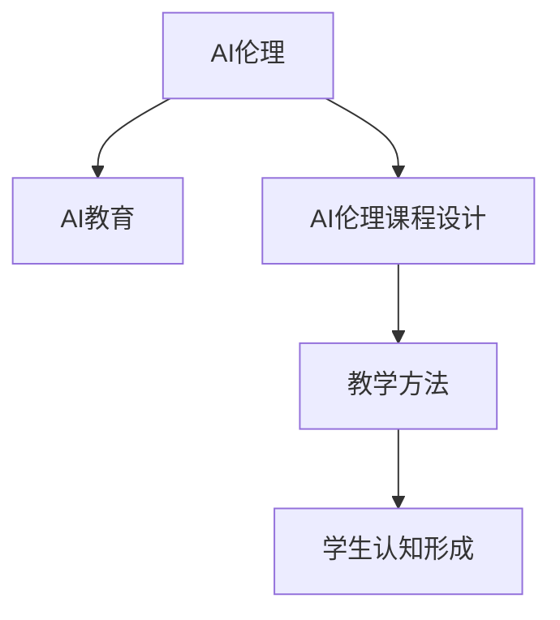

                 

# AI伦理的教育实践:伦理教育的课程设计和教学方法

> 关键词：AI伦理教育, 课程设计, 教学方法, 道德原则, 法律框架, 应用案例

## 1. 背景介绍

### 1.1 问题由来
随着人工智能（AI）技术的迅猛发展，其在医疗、教育、金融、交通等多个领域的应用越来越广泛。然而，随着AI技术的深入应用，其潜在的伦理问题也逐渐显现出来。如何在AI技术的开发和应用中避免伦理风险，确保技术服务于人类的福祉，成为摆在我们面前的重要课题。教育作为传承知识、培养价值观、塑造人格的重要环节，在AI伦理教育中具有不可替代的作用。本博文将系统介绍AI伦理教育的重要性、主要内容和教学方法，以期为教育工作者和AI技术开发者提供有价值的参考。

### 1.2 问题核心关键点
AI伦理教育的核心关键点在于培养学生的道德判断力，使他们能够识别、分析和评估AI技术可能带来的伦理风险。通过课程设计和教学方法，使学生理解AI技术的原理、特点、应用及其潜在的伦理问题，树立正确的AI伦理观，养成良好的技术素养。具体来说，需要把握以下几个方面：
1. AI伦理的基本概念和原则。
2. AI技术的社会影响及潜在风险。
3. 构建AI伦理课程的框架和教学方法。

## 2. 核心概念与联系

### 2.1 核心概念概述

为更好地理解AI伦理教育的重要性，本节将介绍几个密切相关的核心概念：

- **AI伦理**：指AI技术在开发和应用过程中应遵循的道德原则和规范。AI伦理涉及技术、伦理和法律等多个维度，旨在确保AI技术的良性发展，促进社会的公平与正义。
- **AI教育**：指通过教育手段，培养学生对AI技术的理解、兴趣和责任感，使其能够在使用AI技术时，既发挥其优势，又规避其风险。
- **AI伦理课程设计**：指将AI伦理融入教育课程，通过系统的课程设计和科学的教学方法，使学生在掌握AI技术的同时，形成正确的AI伦理观。
- **教学方法**：指在AI伦理课程中，运用何种策略和手段来传授知识、培养能力、激发兴趣。

这些核心概念之间的逻辑关系可以通过以下Mermaid流程图来展示：



这个流程图展示了一个由AI伦理到AI教育，再到AI伦理课程设计和教学方法，最后影响学生认知形成的过程。

## 3. 核心算法原理 & 具体操作步骤
### 3.1 算法原理概述

AI伦理教育的算法原理，主要是围绕着如何构建系统的AI伦理课程，并通过科学的教学方法来培养学生的AI伦理认知。

### 3.2 算法步骤详解

构建AI伦理课程的基本步骤如下：

**Step 1: 确定课程目标**
- 明确课程的教育目标，包括知识目标、能力目标和情感目标。知识目标指让学生掌握AI伦理的基本概念和原则；能力目标指培养学生的伦理判断和分析能力；情感目标指树立正确的AI伦理观。

**Step 2: 设计课程内容**
- 结合学生的年龄和学习阶段，设计合理的课程内容。内容包括但不限于：AI技术的基本原理、AI伦理的基本原则、AI技术在各领域的应用及其潜在的伦理问题、伦理冲突的案例分析、AI伦理法律法规等。

**Step 3: 选择教学方法**
- 根据课程内容和学生特点，选择合适的教学方法。常用的教学方法包括案例教学、角色扮演、辩论、讨论、项目实践等。

**Step 4: 实施教学**
- 将选定的教学方法应用于课堂教学，通过互动和实践，引导学生深入理解AI伦理。

**Step 5: 评估和反馈**
- 对教学效果进行评估，收集学生的反馈意见，不断改进教学方法和课程设计。

### 3.3 算法优缺点

AI伦理教育的算法具有以下优点：
1. 系统性：通过系统的课程设计和科学的教学方法，使学生全面了解AI伦理。
2. 实用性：通过案例分析、角色扮演等方法，使学生能够将理论知识应用于实际问题中，增强解决实际问题的能力。
3. 互动性：通过讨论、辩论等互动方法，激发学生的思维和表达能力，培养其批判性思维。
4. 启发性：通过伦理冲突案例分析，引导学生思考，培养其分析和判断能力。

同时，该算法也存在以下局限性：
1. 时间和资源限制：课程设计和实施需要大量的时间和资源投入。
2. 教学方法单一：单一的教学方法难以适应不同学生的需求。
3. 知识更新慢：AI伦理领域发展迅速，课程内容可能滞后于技术发展。

### 3.4 算法应用领域

AI伦理教育主要应用于高等教育、中小学教育、职业培训等领域。具体来说，可以包括以下几个方面：

1. **高等教育**：在计算机科学、数据科学、人工智能等专业课程中融入AI伦理教育，帮助学生理解和应用AI伦理。
2. **中小学教育**：通过基础学科和综合实践活动，培养学生对AI伦理的初步认识和兴趣。
3. **职业培训**：在技术开发、产品管理、决策支持等职业培训中，加强AI伦理教育，确保技术开发和应用符合伦理规范。

## 4. 数学模型和公式 & 详细讲解 & 举例说明

### 4.1 数学模型构建

在AI伦理教育中，数学模型主要用于分析AI技术的社会影响和潜在风险。

假设有一个AI技术应用X，其社会影响和风险可以用一个矩阵表示：

$$
\begin{bmatrix}
    P_{benefit} & P_{risk} \\
    P_{probability} & P_{distribution}
\end{bmatrix}
$$

其中，$P_{benefit}$表示技术带来的潜在利益；$P_{risk}$表示潜在的风险；$P_{probability}$表示利益和风险发生的概率；$P_{distribution}$表示利益和风险的分布情况。

### 4.2 公式推导过程

假设一个AI技术应用X，对社会带来潜在利益$P_{benefit}$和潜在风险$P_{risk}$的概率分别为$p_{benefit}$和$p_{risk}$，那么该技术应用的社会影响和风险矩阵可以表示为：

$$
\begin{bmatrix}
    p_{benefit}P_{benefit} & (1-p_{benefit})P_{benefit} \\
    p_{risk}P_{risk} & (1-p_{risk})P_{risk}
\end{bmatrix}
$$

对于利益和风险的概率$p_{benefit}$和$p_{risk}$，可以使用贝叶斯网络或其他概率模型进行推导。对于利益和风险的分布情况$P_{distribution}$，可以采用统计分析方法进行估计。

### 4.3 案例分析与讲解

以人脸识别技术为例，分析其社会影响和潜在风险：

**社会影响**：
- **利益**：人脸识别技术在安防、交通、医疗等领域具有广泛应用，能够提高社会管理效率和公共安全水平。
- **风险**：人脸识别技术可能被滥用于隐私侵犯、歧视、误认等，导致个人隐私和权益受到侵害。

**风险评估**：
- **概率**：人脸识别技术被滥用的概率可以通过数据分析和统计模型进行估计。
- **分布**：人脸识别技术滥用的风险分布可以采用统计方法进行分析。

通过以上模型和推导，可以清晰地评估人脸识别技术的应用价值和潜在风险，指导社会决策和应用。

## 5. 项目实践：代码实例和详细解释说明

### 5.1 开发环境搭建

在进行AI伦理教育项目实践前，我们需要准备好开发环境。以下是使用Python进行PyTorch开发的环境配置流程：

1. 安装Anaconda：从官网下载并安装Anaconda，用于创建独立的Python环境。

2. 创建并激活虚拟环境：
```bash
conda create -n pytorch-env python=3.8 
conda activate pytorch-env
```

3. 安装PyTorch：根据CUDA版本，从官网获取对应的安装命令。例如：
```bash
conda install pytorch torchvision torchaudio cudatoolkit=11.1 -c pytorch -c conda-forge
```

4. 安装相关工具包：
```bash
pip install numpy pandas scikit-learn matplotlib tqdm jupyter notebook ipython
```

完成上述步骤后，即可在`pytorch-env`环境中开始AI伦理教育项目实践。

### 5.2 源代码详细实现

下面以一个AI伦理课程设计案例为例，给出使用Python的代码实现。

首先，定义课程内容和教学方法：

```python
import pandas as pd

# 课程内容
course_content = {
    "title": "AI伦理",
    "target": "理解AI伦理的基本概念和原则，培养伦理判断和分析能力，树立正确的AI伦理观。",
    "modules": [
        {
            "title": "AI技术基本原理",
            "description": "介绍AI技术的基本原理和应用场景。",
            "methods": ["lecture", "video"]
        },
        {
            "title": "AI伦理基本原则",
            "description": "讲解AI伦理的基本原则，如公正、透明、可解释等。",
            "methods": ["lecture", "reading"]
        },
        {
            "title": "AI伦理应用案例",
            "description": "分析AI伦理在各领域的应用及其潜在的伦理问题。",
            "methods": ["case study", "role play"]
        },
        {
            "title": "伦理冲突案例",
            "description": "通过案例分析，引导学生思考和讨论。",
            "methods": ["debat", "group discussion"]
        },
        {
            "title": "AI伦理法律法规",
            "description": "讲解与AI伦理相关的法律法规和道德规范。",
            "methods": ["lecture", "workshop"]
        }
    ]
}

# 教学方法
teaching_methods = ["lecture", "video", "case study", "role play", "debat", "group discussion", "workshop"]

# 生成课程表
schedule = []
for module in course_content["modules"]:
    methods = module["methods"]
    for method in methods:
        schedule.append((module["title"], method))

# 输出课程表
print(schedule)
```

接下来，使用Pandas库将课程内容和教学方法可视化：

```python
df = pd.DataFrame(schedule, columns=["Module", "Method"])
df.style.set_properties(**{"font-family": "Arial"})

# 输出课程表
print(df)
```

### 5.3 代码解读与分析

让我们再详细解读一下关键代码的实现细节：

**课程内容定义**：
- `course_content`：定义了AI伦理课程的标题、目标和模块内容。每个模块包括标题、描述和教学方法。

**教学方法选择**：
- `teaching_methods`：定义了各种教学方法的列表，用于生成课程表。

**课程表生成**：
- `schedule`：生成课程表，包含每个模块和对应的教学方法。

**课程表可视化**：
- 使用Pandas库将课程表数据转换为DataFrame，并进行样式设置，以更好地展示课程表。

可以看到，Python和Pandas库使得AI伦理课程设计变得更加简洁高效。开发者可以根据具体需求，灵活调整课程内容和教学方法，以实现最优的教育效果。

## 6. 实际应用场景
### 6.1 智能医疗

智能医疗是AI技术的重要应用场景之一。AI伦理教育在此领域显得尤为重要，因为医疗数据的隐私和安全问题更加敏感。通过AI伦理教育，医护人员能够理解AI技术的应用价值和潜在风险，在应用AI技术时，既能发挥其高效精准的特点，又能避免伦理冲突。

**案例**：
- **利益**：AI技术可以辅助诊断、药物研发、病历管理等，提高医疗效率和诊疗水平。
- **风险**：AI技术可能带来数据隐私泄露、算法歧视等问题。

### 6.2 智能交通

智能交通是另一个AI技术的重要应用领域。AI伦理教育可以帮助交通管理部门和技术人员在应用AI技术时，考虑到安全性、公平性等伦理问题。

**案例**：
- **利益**：AI技术可以优化交通流量、减少事故率、提升出行效率。
- **风险**：AI技术可能带来算法偏见、隐私侵犯等问题。

### 6.3 智能教育

智能教育是AI技术在教育领域的重要应用。AI伦理教育能够帮助教师和学生在使用AI技术时，保持对技术使用的谨慎和理性。

**案例**：
- **利益**：AI技术可以辅助个性化教学、自动化评估等，提升教学效果。
- **风险**：AI技术可能带来数据滥用、隐私侵犯等问题。

### 6.4 未来应用展望

随着AI技术的深入发展，AI伦理教育将在更多领域得到应用，为技术发展提供伦理导向。未来，AI伦理教育可能呈现出以下几个发展趋势：

1. **跨学科融合**：AI伦理教育将与其他学科（如伦理学、社会学、法律学等）进行深入融合，形成更加全面和系统化的教育体系。
2. **技术驱动**：随着AI技术的进步，AI伦理教育也将采用更加先进的技术手段，如虚拟现实、增强现实等，增强教育效果。
3. **全球化发展**：AI伦理教育将面向全球，推动全球范围内的AI伦理认知和实践。
4. **持续更新**：随着AI技术的不断进步，AI伦理教育的内容和形式将不断更新，以适应新的技术和应用场景。

## 7. 工具和资源推荐
### 7.1 学习资源推荐

为了帮助开发者系统掌握AI伦理教育的重要性、内容和教学方法，这里推荐一些优质的学习资源：

1. **《AI伦理》教材**：提供系统的AI伦理理论和实践案例，适合各类教育者和AI技术开发者。
2. **AI伦理在线课程**：提供系统的AI伦理课程，包括视频讲解、案例分析等，适合在线学习。
3. **AI伦理社区**：提供AI伦理问题的讨论和交流平台，有助于分享经验和观点。
4. **AI伦理研究论文**：提供最新的AI伦理研究成果，有助于了解领域前沿。

通过对这些资源的学习实践，相信你一定能够快速掌握AI伦理教育的重要性、内容和教学方法，并用于解决实际的AI伦理问题。
###  7.2 开发工具推荐

高效的开发离不开优秀的工具支持。以下是几款用于AI伦理教育开发的常用工具：

1. **Python编程语言**：Python语言简单易学，适合进行各种教育应用开发。
2. **Jupyter Notebook**：交互式的编程环境，方便进行教育内容的演示和互动。
3. **Pandas库**：用于数据处理和可视化，适合制作课程表和数据图表。
4. **Scikit-learn**：用于数据分析和机器学习，适合进行案例分析和模拟实验。
5. **TensorFlow**：用于深度学习模型开发，适合进行AI伦理技术的应用研究。

合理利用这些工具，可以显著提升AI伦理教育的开发效率，加快创新迭代的步伐。

### 7.3 相关论文推荐

AI伦理教育的研究源于学界的持续研究。以下是几篇奠基性的相关论文，推荐阅读：

1. **《AI伦理教育框架》**：提出AI伦理教育的基本框架和实施方法，提供系统的教育指南。
2. **《AI伦理教育案例分析》**：分析多个AI伦理教育案例，探讨教育效果和改进建议。
3. **《AI伦理法律法规》**：介绍与AI伦理相关的法律法规，提供法律支持。

这些论文代表了大规模AI伦理教育的发展脉络。通过学习这些前沿成果，可以帮助研究者把握学科前进方向，激发更多的创新灵感。

## 8. 总结：未来发展趋势与挑战
### 8.1 总结

本文对AI伦理教育的重要性、内容和教学方法进行了全面系统的介绍。首先阐述了AI伦理教育的重要性，明确了教育目标和内容。其次，从原理到实践，详细讲解了AI伦理课程的设计和教学方法，给出了教育实践的完整代码实例。同时，本文还广泛探讨了AI伦理教育在智能医疗、智能交通、智能教育等多个领域的应用前景，展示了AI伦理教育的广阔前景。此外，本文精选了AI伦理教育的各类学习资源，力求为读者提供全方位的教育指引。

通过本文的系统梳理，可以看到，AI伦理教育在AI技术应用中具有不可替代的作用。AI伦理教育能够培养学生的道德判断力和技术责任感，使他们在应用AI技术时，既发挥其优势，又规避其风险，确保技术服务于人类的福祉。未来，伴随AI技术的不断进步，AI伦理教育将成为推动AI技术健康发展的关键力量。

### 8.2 未来发展趋势

展望未来，AI伦理教育将呈现以下几个发展趋势：

1. **跨学科融合**：AI伦理教育将与其他学科（如伦理学、社会学、法律学等）进行深入融合，形成更加全面和系统化的教育体系。
2. **技术驱动**：随着AI技术的进步，AI伦理教育也将采用更加先进的技术手段，如虚拟现实、增强现实等，增强教育效果。
3. **全球化发展**：AI伦理教育将面向全球，推动全球范围内的AI伦理认知和实践。
4. **持续更新**：随着AI技术的不断进步，AI伦理教育的内容和形式将不断更新，以适应新的技术和应用场景。

### 8.3 面临的挑战

尽管AI伦理教育已经取得了显著成效，但在迈向更加智能化、普适化应用的过程中，它仍面临着诸多挑战：

1. **时间和资源限制**：课程设计和实施需要大量的时间和资源投入。
2. **教学方法单一**：单一的教学方法难以适应不同学生的需求。
3. **知识更新慢**：AI伦理领域发展迅速，课程内容可能滞后于技术发展。
4. **跨学科协作难度大**：AI伦理教育需要跨学科协作，但不同学科的思维方式和研究方法存在差异。

### 8.4 研究展望

面对AI伦理教育所面临的种种挑战，未来的研究需要在以下几个方面寻求新的突破：

1. **跨学科协作**：推动AI伦理教育与其他学科的深入融合，形成跨学科的研究平台和合作机制。
2. **多样化教学方法**：采用多样化的教学方法，如案例教学、角色扮演、辩论等，满足不同学生的需求。
3. **技术手段革新**：引入虚拟现实、增强现实等先进技术，提升AI伦理教育的互动性和沉浸感。
4. **教育内容更新**：持续关注AI伦理领域的最新研究成果，及时更新教育内容，确保教育的前沿性和实用性。

这些研究方向的探索，必将引领AI伦理教育迈向更高的台阶，为构建安全、可靠、可解释、可控的智能系统铺平道路。面向未来，AI伦理教育还需要与其他人工智能技术进行更深入的融合，如知识表示、因果推理、强化学习等，多路径协同发力，共同推动自然语言理解和智能交互系统的进步。只有勇于创新、敢于突破，才能不断拓展AI伦理教育的边界，让智能技术更好地造福人类社会。

## 9. 附录：常见问题与解答

**Q1：AI伦理教育是否适用于所有学生？**

A: AI伦理教育适用于所有学生，尤其是即将走向社会的技术开发者和应用者。通过AI伦理教育，能够使学生理解和应用AI技术时，既能发挥其优势，又规避其风险，确保技术服务于人类的福祉。

**Q2：AI伦理教育如何与实际应用结合？**

A: AI伦理教育可以通过案例分析、项目实践等方式，使学生在实际应用中，思考和解决AI伦理问题。例如，可以让学生在项目中设计AI伦理框架，模拟实际应用中的伦理冲突，提升学生的理解和应用能力。

**Q3：AI伦理教育是否需要专业教师？**

A: AI伦理教育需要具备AI和伦理学知识的专业教师。教师不仅需要掌握AI技术原理，还需要具备伦理学的基本知识，能够在教学中引导学生思考和讨论AI伦理问题。

**Q4：AI伦理教育如何评价效果？**

A: AI伦理教育效果可以通过学生反馈、学习成果、应用实践等方式进行评价。例如，可以通过问卷调查、案例分析、项目评审等方式，评估学生的AI伦理认知和应用能力。

总之，AI伦理教育是确保AI技术健康发展的关键环节。通过系统的课程设计和科学的教学方法，培养学生的道德判断力和技术责任感，使他们在应用AI技术时，既能发挥其优势，又规避其风险，确保技术服务于人类的福祉。未来，随着AI技术的不断进步，AI伦理教育也将不断发展和完善，成为推动AI技术健康发展的关键力量。

