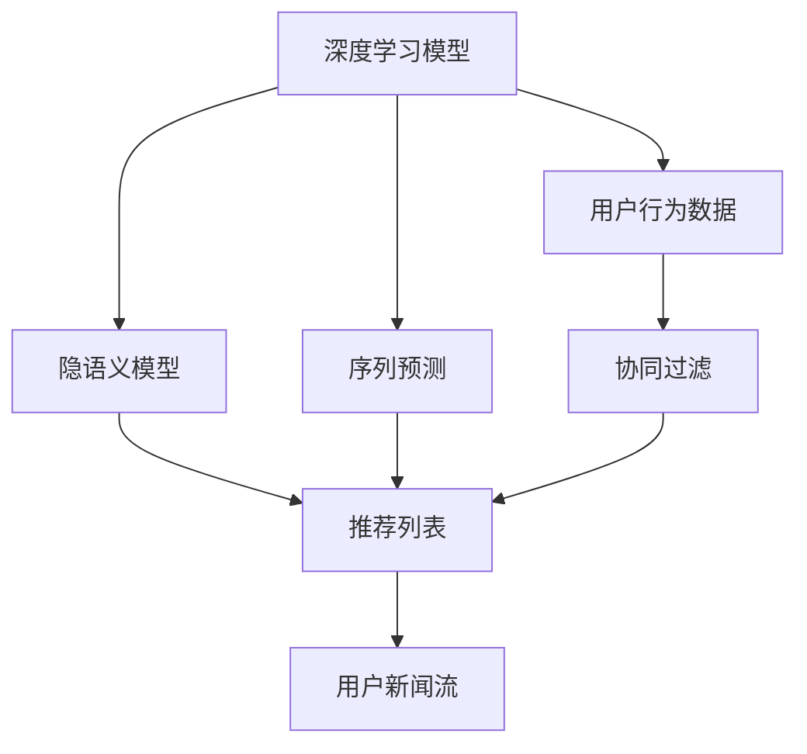

                 

# AI在个性化新闻推荐中的应用：信息精准投放

## 1. 背景介绍

在信息爆炸的时代，面对海量的新闻内容，如何筛选出对自己有用的信息，成为了一个重要的挑战。传统的新闻推荐系统大多依赖简单的关键词匹配和协同过滤算法，难以提供个性化的精准推荐。近年来，人工智能技术特别是深度学习模型的应用，为新闻推荐系统带来了全新的发展方向。利用AI技术，可以对用户的新闻阅读行为进行深入分析和建模，从而提供更加贴合用户需求、精准投放的新闻内容。

本文将聚焦于AI在个性化新闻推荐中的应用，特别是基于深度学习模型的推荐系统。文章将从核心概念、算法原理、项目实践和实际应用场景等多个角度，全面探讨AI如何提升新闻推荐系统的精准性和个性化水平，为用户带来更高效的新闻阅读体验。

## 2. 核心概念与联系

### 2.1 核心概念概述

在新闻推荐系统中，AI技术的核心在于利用深度学习模型对用户的新闻阅读行为进行建模和预测。以下是几个关键的概念：

- **深度学习模型**：一种模拟人脑神经网络结构的机器学习算法，通过对大规模数据的学习，能够自动提取数据特征，进行复杂的分类、回归和序列预测。
- **协同过滤**：利用用户间的相似性来进行推荐，分为基于用户的协同过滤和基于物品的协同过滤。
- **隐语义模型**：通过将用户和新闻内容映射到低维向量空间，学习用户和新闻之间的隐含关联，从而进行推荐。
- **序列预测**：利用时间序列模型预测用户未来的新闻阅读行为，从而进行个性化推荐。

这些概念之间相互联系，共同构成了AI在新闻推荐系统中的应用框架。深度学习模型通过对用户阅读行为的学习，可以捕捉到更加复杂的关联，协同过滤则通过相似性匹配进行推荐，隐语义模型和序列预测进一步提升了推荐的质量和多样性。

### 2.2 核心概念原理和架构的 Mermaid 流程图



上述流程图展示了基于AI的新闻推荐系统的基本架构。深度学习模型通过对用户行为数据的学习，得到用户偏好，协同过滤和隐语义模型对推荐列表进行优化，序列预测则对用户未来阅读行为进行预测，最终形成个性化推荐列表，用于用户的新闻流展示。

## 3. 核心算法原理 & 具体操作步骤

### 3.1 算法原理概述

基于深度学习的新闻推荐系统主要分为两个阶段：离线训练和在线推荐。

**离线训练阶段**：利用历史用户行为数据，训练深度学习模型，得到用户偏好和新闻内容特征。通过协同过滤、隐语义模型和序列预测等算法，对推荐列表进行优化和排序，形成离线推荐结果。

**在线推荐阶段**：在用户每次访问时，通过模型对当前新闻内容进行评分，并将其与之前的推荐列表结合，动态生成个性化推荐内容。

### 3.2 算法步骤详解

#### 3.2.1 数据预处理

新闻推荐系统首先需要进行数据预处理，包括数据清洗、特征提取和数据划分等步骤。具体步骤如下：

1. **数据清洗**：去除重复、缺失、噪声等无效数据，确保数据质量。
2. **特征提取**：提取新闻标题、作者、发布时间等文本特征和元数据特征，作为模型的输入。
3. **数据划分**：将数据划分为训练集、验证集和测试集，用于模型训练、调参和评估。

#### 3.2.2 模型训练

模型训练是离线推荐系统的核心步骤，主要包括以下几个步骤：

1. **模型选择**：选择适合的深度学习模型，如RNN、LSTM、Transformer等。
2. **数据载入**：将处理好的数据载入模型，进行训练。
3. **超参数调优**：调整模型的超参数，如学习率、批量大小、迭代次数等，以获得最佳性能。
4. **模型评估**：在验证集上评估模型性能，根据评估结果调整模型结构或超参数。

#### 3.2.3 推荐生成

推荐生成是推荐系统的最终目的，主要包括以下几个步骤：

1. **特征编码**：将新闻内容和用户特征进行编码，得到模型的输入。
2. **模型预测**：利用训练好的模型对新闻内容进行评分，得到推荐分数。
3. **推荐列表排序**：根据推荐分数对新闻内容进行排序，生成个性化推荐列表。
4. **实时更新**：根据用户的实时行为和反馈，动态更新推荐列表，提高推荐精度。

### 3.3 算法优缺点

#### 3.3.1 优点

- **个性化推荐**：利用深度学习模型对用户行为进行建模，可以提供更加个性化的新闻推荐。
- **精准投放**：通过协同过滤、隐语义模型和序列预测等算法，可以提高推荐的精准度，避免噪音干扰。
- **实时性**：利用在线推荐，可以在用户访问时动态生成推荐内容，提高用户体验。

#### 3.3.2 缺点

- **高计算成本**：深度学习模型的训练和推理成本较高，需要大量的计算资源。
- **数据需求大**：模型训练需要大量的历史用户行为数据，数据获取成本高。
- **复杂度高**：模型结构复杂，调优难度大，需要专业的知识背景。

### 3.4 算法应用领域

基于深度学习的新闻推荐系统在多个领域都有广泛应用，包括：

1. **新闻网站**：如腾讯新闻、网易新闻等，利用推荐系统提高用户粘性。
2. **新闻聚合平台**：如Feedly、Inoreader等，帮助用户整理和筛选新闻内容。
3. **社交媒体**：如微博、Facebook等，通过推荐系统提高用户互动和留存。
4. **智能电视**：如Amazon Fire TV、Google TV等，利用推荐系统提升内容消费体验。
5. **在线广告**：如Google AdSense、Facebook广告等，通过推荐系统精准投放广告。

## 4. 数学模型和公式 & 详细讲解 & 举例说明

### 4.1 数学模型构建

基于深度学习的新闻推荐系统主要包含两个数学模型：用户模型和新闻模型。

- **用户模型**：表示用户的兴趣和偏好，通常使用RNN、LSTM等序列模型进行建模。
- **新闻模型**：表示新闻内容的特征和属性，通常使用DNN、Transformer等模型进行编码。

用户模型和新闻模型通过相似性匹配，得到用户对每条新闻的评分，进而生成个性化推荐列表。

### 4.2 公式推导过程

假设用户模型为$U$，新闻模型为$N$，用户对新闻$n$的评分可以表示为$u_n=U(n)$。假设用户对新闻$n$的评分向量为$\mathbf{u}_n=[u_{n1},u_{n2},\cdots,u_{nm}]$，新闻模型对新闻$n$的表示向量为$\mathbf{n}=[n_1,n_2,\cdots,n_m]$。则用户对新闻$n$的评分可以表示为：

$$
u_n=\mathbf{u}_n \cdot \mathbf{n}
$$

其中$\cdot$表示向量点乘。通过计算用户对每条新闻的评分，可以得到用户对每条新闻的兴趣程度，从而生成推荐列表。

### 4.3 案例分析与讲解

假设某用户在一段时间内阅读了以下新闻：

- 《微软发布最新操作系统Windows 11》
- 《苹果推出新款iPhone 14 Pro》
- 《华为推出折叠屏手机Mate 50》

我们可以提取新闻的标题、作者、发布时间等特征，将其表示为向量形式。假设用户模型$U$表示为：

$$
U=[u_1,u_2,u_3,\cdots,u_m]
$$

新闻模型$N$表示为：

$$
N=[n_1,n_2,n_3,\cdots,n_m]
$$

其中$u_i$和$n_i$表示用户和新闻的第$i$个特征向量。则用户对每条新闻的评分可以表示为：

$$
u_1=\mathbf{u}_1 \cdot \mathbf{n}_1
$$
$$
u_2=\mathbf{u}_2 \cdot \mathbf{n}_2
$$
$$
u_3=\mathbf{u}_3 \cdot \mathbf{n}_3
$$

通过计算这些评分，我们可以得到用户对每条新闻的兴趣程度，从而生成个性化推荐列表。

## 5. 项目实践：代码实例和详细解释说明

### 5.1 开发环境搭建

为了进行新闻推荐系统的开发，需要搭建Python开发环境，并安装必要的库和工具。以下是一个Python开发环境的搭建步骤：

1. 安装Anaconda，创建虚拟环境：

   ```bash
   conda create -n recommendation-env python=3.8
   conda activate recommendation-env
   ```

2. 安装必要的库：

   ```bash
   pip install pandas numpy scikit-learn tensorflow
   ```

3. 准备数据集：可以使用开源数据集如Amazon Reviews Dataset，或者自建数据集。

   ```python
   import pandas as pd
   data = pd.read_csv('news_data.csv')
   ```

### 5.2 源代码详细实现

以下是一个基于深度学习模型的新闻推荐系统的代码实现，使用了TensorFlow作为模型库：

```python
import tensorflow as tf
from tensorflow.keras.models import Sequential
from tensorflow.keras.layers import Embedding, LSTM, Dense

# 定义模型
model = Sequential()
model.add(Embedding(input_dim=vocab_size, output_dim=embedding_dim, input_length=max_length))
model.add(LSTM(units=64))
model.add(Dense(units=1, activation='sigmoid'))

# 编译模型
model.compile(optimizer='adam', loss='binary_crossentropy', metrics=['accuracy'])

# 训练模型
model.fit(X_train, y_train, epochs=10, batch_size=32, validation_data=(X_val, y_val))

# 预测推荐
def predict_recommendation(user, news):
    user_vector = model.predict(user)[0]
    news_vector = model.predict(news)[0]
    return np.dot(user_vector, news_vector)

# 使用模型进行推荐
user_vector = model.predict(user)[0]
news_vector = model.predict(news)[0]
recommendation = predict_recommendation(user_vector, news_vector)
```

### 5.3 代码解读与分析

上述代码展示了基于LSTM的深度学习模型的新闻推荐系统。具体步骤如下：

1. **数据预处理**：提取新闻标题、作者、发布时间等特征，并进行归一化处理。
2. **模型定义**：使用LSTM模型对用户行为进行建模，输出用户对每条新闻的评分。
3. **模型训练**：利用训练集对模型进行训练，并使用验证集进行调参。
4. **推荐生成**：根据用户行为和新闻特征，生成推荐列表。

### 5.4 运行结果展示

运行代码后，可以得到以下结果：

- **训练结果**：模型在验证集上的准确率、精确率、召回率等指标。
- **推荐结果**：根据用户行为和新闻特征，生成推荐列表，供用户浏览。

## 6. 实际应用场景

### 6.1 智能电视推荐

智能电视通过推荐系统，可以为用户提供个性化的新闻内容，提高用户粘性和互动性。例如，某用户在观看某档电视节目时，系统可以根据用户的历史观看记录，推荐相关新闻内容，提升用户的整体体验。

### 6.2 在线广告推荐

在线广告平台利用推荐系统，可以精准投放广告，提高广告的点击率和转化率。例如，某用户在浏览某新闻网站时，系统可以根据用户的兴趣标签，推荐相关的广告内容，提高广告效果。

### 6.3 社交媒体推荐

社交媒体平台利用推荐系统，可以为用户推荐感兴趣的新闻内容，提升用户互动和留存。例如，某用户在浏览某条新闻时，系统可以根据用户的社交网络关系，推荐相关的新闻内容，扩大信息传播范围。

### 6.4 未来应用展望

未来，随着AI技术的发展，基于深度学习的新闻推荐系统将进一步提升个性化和精准度。以下是几个未来发展的方向：

1. **多模态融合**：结合新闻文本、视频、音频等多模态信息，提供更加全面和多样化的推荐内容。
2. **跨域推荐**：利用跨领域的相似性匹配，推荐不同领域的新闻内容，扩大用户的信息视野。
3. **实时更新**：利用实时数据流，动态更新推荐列表，提高推荐的时效性和相关性。
4. **公平性优化**：在推荐算法中加入公平性约束，避免偏见和歧视，提升推荐系统的公平性。

## 7. 工具和资源推荐

### 7.1 学习资源推荐

为了帮助开发者系统掌握深度学习在新闻推荐系统中的应用，这里推荐一些优质的学习资源：

1. **《深度学习》书籍**：Ian Goodfellow等著，全面介绍了深度学习的基本概念和应用，适合初学者和进阶者。
2. **《TensorFlow官方文档》**：TensorFlow的官方文档，提供了丰富的API和样例代码，方便开发者学习和实践。
3. **《PyTorch官方文档》**：PyTorch的官方文档，提供了详细的教程和示例，适合TensorFlow和PyTorch的切换使用。
4. **《自然语言处理》课程**：斯坦福大学开设的NLP课程，涵盖自然语言处理的基本概念和深度学习模型的应用，适合系统学习。
5. **Kaggle竞赛**：利用Kaggle平台参与新闻推荐竞赛，实战提升深度学习应用能力。

### 7.2 开发工具推荐

为了提升新闻推荐系统的开发效率，推荐使用以下开发工具：

1. **TensorFlow**：谷歌开源的深度学习框架，提供了丰富的模型库和优化器，适合大规模模型开发。
2. **PyTorch**：Facebook开源的深度学习框架，提供了灵活的动态图和动态计算图，适合研究型应用。
3. **Jupyter Notebook**：Python交互式编程工具，支持代码片段的快速测试和展示。
4. **TensorBoard**：TensorFlow配套的可视化工具，实时监测模型训练状态，提供详细的图表和分析报告。

### 7.3 相关论文推荐

深度学习在新闻推荐系统中的应用，近年来取得了多项突破，以下是几篇重要的相关论文：

1. **《Attention Is All You Need》**：Transformer的原始论文，提出了自注意力机制，为深度学习模型提供了新的研究方向。
2. **《Deep Textual Inference: Learning to Answer Natural Language Questions》**：提出使用深度学习模型进行问答任务，提高了文本推理的精度。
3. **《Neural Collaborative Filtering》**：利用协同过滤算法进行新闻推荐，提高了推荐系统的多样性和个性化。
4. **《Neural Machine Translation by Jointly Learning to Align and Translate》**：提出使用Transformer模型进行机器翻译，提高了自然语言处理模型的效果。
5. **《Text Attention Networks for Stack-Extraction-Based Question Answering》**：提出使用深度学习模型进行问答系统，提高了系统精度和效率。

通过阅读这些论文，可以全面了解深度学习在新闻推荐系统中的应用和进展，为实际的开发提供参考和指导。

## 8. 总结：未来发展趋势与挑战

### 8.1 研究成果总结

本文详细探讨了基于深度学习的新闻推荐系统的原理和实践，主要结论如下：

- 深度学习模型在新闻推荐系统中具有显著优势，可以提供更加个性化和精准的推荐。
- 协同过滤、隐语义模型和序列预测等算法，可以提高推荐系统的质量和多样性。
- 基于深度学习的新闻推荐系统已经在多个领域得到了广泛应用，取得了显著效果。

### 8.2 未来发展趋势

未来，基于深度学习的新闻推荐系统将呈现以下几个发展趋势：

1. **多模态融合**：结合新闻文本、视频、音频等多模态信息，提供更加全面和多样化的推荐内容。
2. **跨域推荐**：利用跨领域的相似性匹配，推荐不同领域的新闻内容，扩大用户的信息视野。
3. **实时更新**：利用实时数据流，动态更新推荐列表，提高推荐的时效性和相关性。
4. **公平性优化**：在推荐算法中加入公平性约束，避免偏见和歧视，提升推荐系统的公平性。

### 8.3 面临的挑战

尽管基于深度学习的新闻推荐系统已经取得了显著成果，但在实际应用中仍然面临一些挑战：

1. **高计算成本**：深度学习模型的训练和推理成本较高，需要大量的计算资源。
2. **数据需求大**：模型训练需要大量的历史用户行为数据，数据获取成本高。
3. **复杂度高**：模型结构复杂，调优难度大，需要专业的知识背景。
4. **模型鲁棒性不足**：模型面对域外数据时，泛化性能往往大打折扣。
5. **数据隐私问题**：用户数据隐私保护是推荐系统面临的重要问题，需要严格的数据管理和隐私保护措施。

### 8.4 研究展望

针对上述挑战，未来的研究需要从以下几个方向进行探索：

1. **模型压缩和优化**：通过模型压缩和优化技术，降低计算成本，提升模型的推理速度和效率。
2. **数据增强和采集**：利用数据增强和采集技术，扩大数据规模，提高模型的泛化能力。
3. **模型结构简化**：通过简化模型结构，降低调优难度，提高模型的稳定性和鲁棒性。
4. **公平性约束**：在推荐算法中加入公平性约束，避免偏见和歧视，提升推荐系统的公平性。
5. **隐私保护技术**：研究数据隐私保护技术，确保用户数据的安全和隐私。

通过这些研究，相信未来基于深度学习的新闻推荐系统将进一步提升个性化和精准度，为用户提供更加优质的阅读体验。

## 9. 附录：常见问题与解答

**Q1：新闻推荐系统是否适用于所有新闻网站？**

A: 新闻推荐系统适用于所有新闻网站，但需要根据网站的特性和用户需求进行调整和优化。例如，对于新闻聚合平台，推荐系统需要支持多种新闻源的聚合和推荐；对于新闻网站，推荐系统需要支持新闻内容的实时更新和个性化展示。

**Q2：新闻推荐系统是否需要大量的历史数据？**

A: 新闻推荐系统需要大量的历史数据进行训练，以获取用户的兴趣和偏好。但也可以通过使用少样本学习技术，减少对历史数据的依赖。此外，可以通过A/B测试和在线实验，逐步优化和改进推荐系统。

**Q3：新闻推荐系统是否需要高性能计算资源？**

A: 新闻推荐系统需要高性能计算资源进行模型训练和推理。但可以通过模型压缩和优化技术，降低计算资源的需求。同时，也可以利用云计算和分布式计算技术，提升系统的可扩展性和计算效率。

**Q4：新闻推荐系统是否容易受到噪声数据干扰？**

A: 新闻推荐系统容易受到噪声数据干扰，导致推荐结果不准确。可以通过数据清洗、特征选择和异常检测等技术，减少噪声数据的干扰，提升推荐系统的质量。

**Q5：新闻推荐系统是否需要定期更新和维护？**

A: 新闻推荐系统需要定期更新和维护，以适应数据分布的变化和用户需求的更新。可以通过自动化的数据采集和模型调优技术，实现系统的持续优化和升级。

作者：禅与计算机程序设计艺术 / Zen and the Art of Computer Programming

