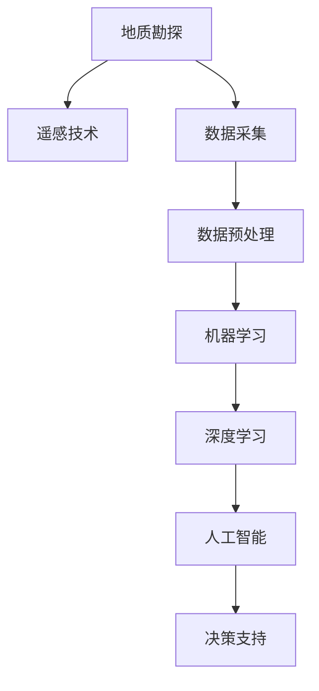

                 

# AI在地质勘探中的应用：提高资源发现效率

## 1. 背景介绍

随着全球人口增长和经济发展的需求不断增加，对各类自然资源的依赖日益加大。地质勘探作为资源开发的重要前导，承担着发现新矿藏和优化采矿效率的使命。传统地质勘探方法依赖于专家经验，成本高、周期长且存在较大的主观偏差。近年来，随着人工智能（AI）技术的飞速发展，地质勘探领域开始引入AI技术，通过智能化的分析手段，提高了资源发现的效率和精度。

### 1.1 地质勘探的挑战

传统的地质勘探方法包括地面勘探、地震勘探、钻探等，这些方法需要耗费大量的人力物力，且对地质环境造成破坏。面对复杂多变的地质结构，传统勘探方法难以精准识别出潜在的资源分布。此外，勘探工作常需要跨越不同地理区域和环境条件，数据获取和处理难度巨大。

### 1.2 AI技术的应用潜力

人工智能通过机器学习、数据挖掘、自然语言处理等技术，可以从海量数据中提取隐含的模式和规律，辅助地质勘探工作。AI技术能够自动化处理复杂的地质数据，减少人工干预，提高勘探的精度和效率。

## 2. 核心概念与联系

### 2.1 核心概念概述

- **地质勘探**：通过地质调查、地球物理勘探、钻探等多种手段，研究地壳构造、矿产分布等，评估资源的可开采性。
- **人工智能（AI）**：利用算法和模型，对数据进行自动处理和分析，辅助决策和预测。
- **机器学习（ML）**：使用数据和算法模型，从数据中学习并预测新数据的表现。
- **深度学习（DL）**：一种特殊的机器学习技术，利用神经网络对数据进行多层次、多维度的抽象。
- **遥感技术**：通过卫星、无人机等手段获取地球表面和内部信息，用于地质勘探。

这些概念之间的联系通过以下Mermaid流程图来展示：



这个流程图展示了从地质勘探到数据采集、预处理，再到机器学习和深度学习的流程，最后通过人工智能进行决策支持的过程。

## 3. 核心算法原理 & 具体操作步骤

### 3.1 算法原理概述

AI在地质勘探中的应用主要基于机器学习与深度学习的原理。以下是对关键算法的概述：

- **监督学习**：使用标注好的数据集训练模型，预测新数据的标签。
- **无监督学习**：使用未标注的数据集，发现数据的内在结构和规律。
- **强化学习**：通过与环境交互，优化策略以最大化奖励。
- **深度学习模型**：包括卷积神经网络（CNN）、循环神经网络（RNN）和变分自编码器（VAE）等，用于处理高维、复杂的数据。

### 3.2 算法步骤详解

AI在地质勘探中的应用主要包括以下步骤：

1. **数据收集与预处理**：使用遥感、地面钻探等手段获取地质数据，并进行清洗、标准化和降维等预处理。
2. **特征提取**：使用深度学习模型从地质数据中提取特征，如岩石类型、矿物成分、地质结构等。
3. **模型训练**：使用监督学习或无监督学习算法训练模型，进行资源预测、灾害预警等任务。
4. **结果分析与优化**：分析模型预测结果，优化模型参数，提升预测精度和鲁棒性。
5. **决策支持**：结合专家经验，进行综合分析，辅助决策。

### 3.3 算法优缺点

AI在地质勘探中的应用具有以下优点：

- **高效性**：AI可以处理大量数据，快速分析复杂地质结构，提高勘探效率。
- **准确性**：通过深度学习模型，可以精准识别出隐含的资源分布规律，减少误判。
- **低成本**：减少对人力资源的依赖，降低勘探成本。

然而，也存在以下缺点：

- **数据质量要求高**：AI模型需要高质量的数据进行训练，数据质量不足可能导致预测结果不准确。
- **算法复杂度**：深度学习模型通常参数量大，训练复杂度高，需要强大的计算资源。
- **依赖专家经验**：AI模型仍需要结合专家经验进行综合分析，难以完全替代人工决策。

### 3.4 算法应用领域

AI技术在地质勘探中的应用领域广泛，主要包括：

- **资源勘探**：预测矿产资源的分布，辅助勘探决策。
- **地质灾害预警**：通过地质数据预测滑坡、地震等灾害，保障人员安全。
- **环境保护**：识别生态敏感区，保护生态环境。
- **地下水监测**：通过遥感技术监测地下水资源分布和变化。

## 4. 数学模型和公式 & 详细讲解

### 4.1 数学模型构建

为了说明AI在地质勘探中的应用，我们可以构建一个简单的数学模型。假设我们有一个包含n个样本的地质数据集，每个样本包含m个特征。模型的目标是通过这些特征预测资源的分布。

我们可以使用监督学习模型，如决策树、支持向量机（SVM）、神经网络等，来进行资源预测。以下是一个简单的监督学习模型框架：

$$
\min_{\theta} \frac{1}{N}\sum_{i=1}^N \ell(y_i, f_\theta(x_i))
$$

其中，$\theta$为模型参数，$x_i$为样本特征，$y_i$为样本标签，$f_\theta(x_i)$为模型预测函数，$\ell$为损失函数，如均方误差或交叉熵损失。

### 4.2 公式推导过程

假设我们使用神经网络模型进行资源预测，其结构如图1所示：


其中，$x_i$为输入层，$h_\theta(x_i)$为隐藏层，$y_i$为输出层，$w$和$b$为模型参数。隐藏层节点数通常设置为2的幂次方，如32、64、128等。

假设输出层的节点数为1，代表资源的预测值。神经网络的输出层为线性激活函数，模型预测函数为：

$$
f_\theta(x_i) = \sigma(\sum_{j=1}^n w_jh_{\theta,j}(x_i) + b_j)
$$

其中，$\sigma$为sigmoid函数，$h_{\theta,j}(x_i)$为隐藏层第j个节点的输出，$w_j$和$b_j$为模型参数。

### 4.3 案例分析与讲解

假设我们有一个含有1000个样本的地质数据集，每个样本包含5个特征。我们通过监督学习模型来预测其中一个特征与资源分布的关系。以下是一个简单的案例分析：

- **数据准备**：将数据集分为训练集和测试集，使用训练集进行模型训练。
- **模型训练**：使用随机梯度下降（SGD）算法，优化模型参数$\theta$。
- **模型评估**：在测试集上评估模型性能，计算均方误差（MSE）等指标。
- **结果优化**：根据评估结果，调整模型参数，提升预测精度。

## 5. 项目实践：代码实例和详细解释说明

### 5.1 开发环境搭建

在进行地质勘探AI应用的开发前，我们需要搭建合适的开发环境。以下是使用Python进行TensorFlow开发的简单配置：

1. 安装Anaconda：从官网下载并安装Anaconda，用于创建独立的Python环境。

2. 创建并激活虚拟环境：
```bash
conda create -n tf-env python=3.8 
conda activate tf-env
```

3. 安装TensorFlow：根据CUDA版本，从官网获取对应的安装命令。例如：
```bash
conda install tensorflow -c conda-forge
```

4. 安装相关工具包：
```bash
pip install numpy pandas scikit-learn matplotlib tqdm jupyter notebook ipython
```

完成上述步骤后，即可在`tf-env`环境中开始AI地质勘探的开发。

### 5.2 源代码详细实现

这里我们以资源预测为例，使用TensorFlow搭建一个简单的神经网络模型：

```python
import tensorflow as tf
from tensorflow.keras.models import Sequential
from tensorflow.keras.layers import Dense, Dropout

# 定义模型
model = Sequential([
    Dense(64, input_dim=5, activation='relu'),
    Dropout(0.2),
    Dense(1, activation='sigmoid')
])

# 编译模型
model.compile(loss='binary_crossentropy', optimizer='adam', metrics=['accuracy'])

# 训练模型
model.fit(X_train, y_train, epochs=50, batch_size=32, validation_data=(X_test, y_test))
```

在这个例子中，我们使用了一个包含64个节点的隐藏层和一个输出层的神经网络模型。输入层有5个节点，代表5个特征。输出层使用sigmoid激活函数，预测资源是否存在。

### 5.3 代码解读与分析

这段代码主要包含以下关键部分：

- **模型定义**：使用Sequential模型，添加两个全连接层，分别包含64个节点和1个节点，并设置激活函数。
- **模型编译**：使用binary_crossentropy损失函数，adam优化器，评估指标为准确率。
- **模型训练**：使用fit方法进行训练，设置训练轮数、批次大小和验证集。

## 6. 实际应用场景

### 6.1 智能钻探

智能钻探技术结合了AI和大数据分析，可以在钻探过程中实时监测地下地质情况，优化钻孔路径和深度。通过深度学习模型，可以对钻孔返回的岩芯进行分析，预测岩石类型、矿物成分等信息，辅助钻探决策。

### 6.2 地质灾害预警

AI技术可以结合遥感数据和地面监测数据，预测地质灾害的发生。通过机器学习模型，可以分析历史地质灾害数据，建立预测模型，提前预警潜在风险。

### 6.3 环境监测

AI技术可以用于分析地下水、土壤、大气等环境数据，监测生态变化。通过深度学习模型，可以对大量环境数据进行分析，发现异常情况，提供决策支持。

### 6.4 未来应用展望

未来，AI在地质勘探中的应用将更加广泛和深入。随着计算资源和数据规模的不断扩大，AI模型将更加强大，可以处理更复杂的地质问题。同时，AI与物联网、区块链等技术的结合，将进一步提升地质勘探的智能化水平。

## 7. 工具和资源推荐

### 7.1 学习资源推荐

为了帮助开发者系统掌握AI在地质勘探中的应用，这里推荐一些优质的学习资源：

1. **《深度学习》教材**：斯坦福大学李飞飞教授的深度学习教材，详细讲解了深度学习的基本概念和算法。
2. **TensorFlow官方文档**：TensorFlow的官方文档，包含丰富的模型示例和代码实现。
3. **GeoAI社区**：汇集了地理空间数据分析和AI应用的最新研究和技术，是学习和交流的好地方。
4. **Coursera地质勘探课程**：Coursera提供的地质勘探课程，结合AI技术，涵盖数据采集、处理和分析等内容。

通过这些资源的学习实践，相信你一定能够快速掌握AI在地质勘探中的应用，并用于解决实际的地质问题。

### 7.2 开发工具推荐

高效的开发离不开优秀的工具支持。以下是几款用于AI地质勘探开发的常用工具：

1. **Jupyter Notebook**：免费的开源笔记本环境，支持Python编程，适合快速迭代研究。
2. **PyTorch**：基于Python的开源深度学习框架，灵活动态的计算图，适合快速迭代研究。
3. **GeoPandas**：用于地理空间数据处理的Python库，方便数据处理和可视化。
4. **Google Colab**：谷歌推出的在线Jupyter Notebook环境，免费提供GPU/TPU算力，方便快速实验。
5. **TensorBoard**：TensorFlow配套的可视化工具，可实时监测模型训练状态，提供丰富的图表呈现方式。

合理利用这些工具，可以显著提升AI地质勘探的开发效率，加快创新迭代的步伐。

### 7.3 相关论文推荐

AI在地质勘探中的应用源于学界的持续研究。以下是几篇奠基性的相关论文，推荐阅读：

1. **《应用机器学习预测石油天然气储量》**：介绍使用机器学习模型进行石油天然气储量预测的技术。
2. **《基于深度学习的地下水监测》**：使用深度学习模型进行地下水资源监测，提高监测精度。
3. **《地质灾害预警的深度学习模型》**：使用深度学习模型进行地质灾害预警，提高预警准确率。
4. **《智能钻探技术》**：介绍智能钻探技术的原理和应用，提升钻探效率和精度。
5. **《利用遥感技术进行地质勘探》**：介绍遥感技术在地质勘探中的应用，提高勘探的全面性和准确性。

这些论文代表了大规模地勘AI的应用发展脉络。通过学习这些前沿成果，可以帮助研究者把握学科前进方向，激发更多的创新灵感。

## 8. 总结：未来发展趋势与挑战

### 8.1 总结

本文对AI在地质勘探中的应用进行了全面系统的介绍。首先阐述了AI技术在地质勘探中的优势和应用背景，明确了AI技术在提高资源发现效率方面的独特价值。其次，从原理到实践，详细讲解了AI地质勘探的数学模型和算法步骤，给出了完整的代码实例。同时，本文还广泛探讨了AI技术在智能钻探、地质灾害预警、环境监测等多个领域的应用前景，展示了AI技术在地质勘探中的巨大潜力。此外，本文精选了AI地质勘探的学习资源、开发工具和相关论文，力求为读者提供全方位的技术指引。

通过本文的系统梳理，可以看到，AI技术在地质勘探中的应用已经初见成效，极大提高了资源发现的效率和精度。未来，随着AI技术的不断进步和应用场景的拓展，相信AI技术将进一步助力地质勘探，推动自然资源的可持续利用。

### 8.2 未来发展趋势

展望未来，AI在地质勘探中的应用将呈现以下几个发展趋势：

1. **多模态数据融合**：将地质数据与遥感、气象等多模态数据进行融合，提高资源预测的准确性和全面性。
2. **自动化钻探**：结合AI和物联网技术，实现智能钻探，提高钻探效率和精度。
3. **全流程智能化**：从数据采集、预处理到分析、决策的全流程自动化，减少人工干预。
4. **实时监测**：结合传感器和物联网技术，实现地质灾害的实时预警和监测。
5. **跨领域应用**：将AI技术应用于环境监测、生态保护等多个领域，实现综合治理。

这些趋势展示了AI技术在地质勘探中的应用前景，将进一步推动地质勘探的智能化和高效化。

### 8.3 面临的挑战

尽管AI在地质勘探中的应用已经取得显著成效，但在迈向更加智能化、普适化应用的过程中，仍面临诸多挑战：

1. **数据质量问题**：地质数据存在噪声、缺失等问题，影响AI模型的预测精度。
2. **算法复杂度**：深度学习模型参数量大，计算资源需求高，限制了模型的部署和应用。
3. **算法透明性**：AI模型的决策过程缺乏透明性，难以解释和调试。
4. **成本问题**：AI技术的应用需要大量的计算资源和数据，增加了勘探成本。
5. **法规和伦理问题**：AI技术的应用需要考虑隐私和伦理问题，确保数据安全和合规性。

这些挑战需要学界和业界共同努力，不断改进和优化AI技术，确保其在地质勘探中的应用效果。

### 8.4 研究展望

未来，AI在地质勘探中的应用需要从以下几个方面进行研究：

1. **数据增强**：通过数据增强技术，提升地质数据的质量和多样性，减少对标注数据的依赖。
2. **轻量化模型**：开发轻量化模型，减少计算资源需求，提高模型的部署效率。
3. **解释性AI**：开发可解释性AI技术，增强模型的透明性和可解释性，帮助专家理解模型决策。
4. **隐私保护**：研究隐私保护技术，确保地质数据的隐私和安全，保障数据合规性。
5. **跨领域应用**：探索AI技术在跨领域的应用，提高资源勘探的全面性和有效性。

这些研究方向将进一步推动AI技术在地质勘探中的应用，为自然资源的可持续利用提供新的技术和思路。

## 9. 附录：常见问题与解答

**Q1：AI技术在地质勘探中的应用是否适用于所有勘探场景？**

A: AI技术在地质勘探中的应用具有一定的局限性，适用于地质结构相对简单、数据丰富、噪声较少的情况。对于一些复杂的勘探场景，如地质结构复杂、数据稀疏、噪声大的情况，AI技术需要结合专家经验进行综合分析。

**Q2：AI模型在地质勘探中的应用需要哪些计算资源？**

A: AI模型在地质勘探中的应用需要大量的计算资源，包括高性能CPU、GPU、TPU等，以支持模型训练和推理。同时，还需要充足的内存和存储空间来存储大量地质数据。

**Q3：AI技术在地质勘探中的应用是否需要专家指导？**

A: AI技术在地质勘探中的应用需要结合专家经验进行综合分析，特别是对于复杂的地质问题，专家知识和经验是不可或缺的。AI技术可以辅助专家进行数据分析和决策，但无法完全替代人工判断。

**Q4：AI技术在地质勘探中的应用是否存在隐私和安全问题？**

A: AI技术在地质勘探中的应用需要考虑隐私和伦理问题，确保数据安全和合规性。特别是对于敏感的地质数据，需要采取严格的保护措施，防止数据泄露和滥用。

**Q5：AI技术在地质勘探中的应用是否需要持续改进？**

A: AI技术在地质勘探中的应用需要不断改进和优化，以应对不断变化的地质条件和数据特征。持续的模型更新和参数优化，可以提高模型的预测精度和鲁棒性。

---

作者：禅与计算机程序设计艺术 / Zen and the Art of Computer Programming

