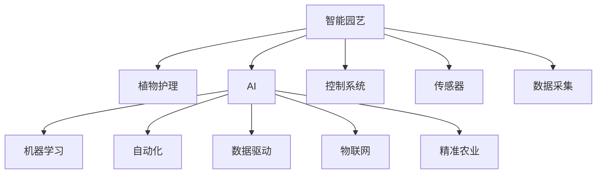

                 

# AI在智能园艺中的应用：自动化植物护理

> 关键词：智能园艺,植物护理,AI,自动化,机器学习,数据驱动,物联网,精准农业,控制系统

## 1. 背景介绍

### 1.1 问题由来
在过去几十年里，农业生产的智能化水平不断提升，新技术的引入在很大程度上提高了农业生产效率。然而，传统的农业管理方式依旧存在诸多问题：人力成本高、效率低、易受环境影响、资源浪费等问题普遍存在。为了改善现状，智能园艺应运而生。智能园艺通过集成多种先进技术，实现对植物生长环境的精准监控和智能化管理，以提升农业生产效率、降低成本，同时确保植物生长的健康和品质。

## 2. 核心概念与联系

### 2.1 核心概念概述

为更好地理解AI在智能园艺中的应用，本节将介绍几个核心概念：

- **智能园艺**：以信息技术、物联网、AI等手段，对植物生长过程进行自动化和智能化管理，以提高农业生产效率、优化资源使用，降低生产成本，提升产品品质。

- **植物护理**：通过监测和管理植物的生长环境，确保植物健康、快速生长，包括温度、湿度、光照、土壤湿度等关键因素的控制。

- **AI（人工智能）**：一种模拟人类智能行为的计算技术，通过机器学习、深度学习等技术，使计算机系统能够自动分析、理解和适应复杂环境。

- **自动化**：指通过传感器、控制系统等技术，使机器能够自动执行特定任务，无需人工干预。

- **机器学习**：一种数据驱动的AI技术，通过算法和模型，使计算机系统能够从数据中学习规律，实现预测和优化。

- **数据驱动**：指通过实时采集和分析数据，进行决策和优化，提升系统性能。

- **物联网（IoT）**：连接各种设备和传感器的网络，实现设备之间的数据交换和协同工作。

- **精准农业**：通过利用卫星定位、传感器数据等，对农业生产进行精确管理，确保资源的高效利用和作物的健康生长。

- **控制系统**：用于对植物生长环境和植物护理设备进行自动化的管理。

这些核心概念之间的逻辑关系可以通过以下Mermaid流程图来展示：



这个流程图展示智能园艺的核心概念及其之间的关系：

1. 智能园艺通过AI、物联网、精准农业等技术对植物护理进行自动化管理。
2. AI技术在智能园艺中的应用主要体现在机器学习和数据分析上，通过对传感器数据的处理，实现对植物生长环境的精准控制。
3. 控制系统是智能园艺的关键，负责整合传感器数据，并根据预设规则调整环境参数，实现植物护理的自动化。
4. 物联网和数据驱动使得智能园艺可以实时采集环境数据，进行分析和优化，提升系统效果。

## 3. 核心算法原理 & 具体操作步骤

### 3.1 算法原理概述

AI在智能园艺中的应用主要集中在以下几个方面：

- **环境监测与控制**：通过传感器实时监测植物生长环境的温度、湿度、光照等参数，并根据模型预测结果，自动调整环境参数。
- **病虫害检测与防治**：利用图像识别和机器学习技术，对植物叶片进行分析，识别病虫害，并及时预警和采取措施。
- **水肥管理**：通过土壤湿度传感器和水肥控制系统，实现水肥的智能化施用，确保植物对养分和水分的合理吸收。
- **果实采摘与收获**：通过计算机视觉和机器学习技术，自动识别成熟果实，并触发自动化采摘设备进行采摘。
- **生产过程优化**：利用数据分析和机器学习，对生产过程进行优化，提高生产效率，减少资源浪费。

这些应用的核心原理是：

- **数据收集**：通过物联网设备和传感器，实时采集植物生长环境的各项数据。
- **数据处理**：对采集的数据进行清洗、处理，形成可用于分析的格式。
- **数据分析**：利用机器学习和深度学习算法，对数据进行建模和预测。
- **决策与控制**：根据数据分析结果，自动调整植物生长环境和设备参数。

### 3.2 算法步骤详解

基于AI的智能园艺系统一般包括以下几个关键步骤：

**Step 1: 数据采集与传感器安装**

- 选择合适的传感器，如温度传感器、湿度传感器、光照传感器、土壤湿度传感器等。
- 将传感器安装在植物生长环境的合适位置，确保数据采集的准确性和实时性。

**Step 2: 数据处理与预处理**

- 对采集到的原始数据进行清洗、去噪、归一化等预处理操作。
- 对数据进行特征提取，如计算平均值、标准差等统计特征，以便用于后续建模。

**Step 3: 模型训练与优化**

- 选择合适的机器学习模型，如线性回归、随机森林、支持向量机等。
- 使用历史数据对模型进行训练，并使用交叉验证等方法进行模型优化。
- 调整模型参数，如学习率、正则化系数等，以获得最优模型性能。

**Step 4: 环境监测与控制**

- 实时采集环境数据，输入到训练好的模型中，预测最优环境参数。
- 根据模型预测结果，自动调整环境控制设备，如温度调节器、灌溉系统等。
- 设置报警阈值，一旦检测到异常情况，自动触发警报并采取措施。

**Step 5: 应用与部署**

- 将训练好的模型部署到生产环境中，实时监测植物生长状态。
- 对生产过程中的各个环节进行优化，如水肥管理、果实采摘等，提升生产效率。
- 定期更新模型和算法，以适应新的环境和任务需求。

### 3.3 算法优缺点

基于AI的智能园艺系统具有以下优点：

- **提高生产效率**：自动化管理使生产过程更加精确，减少了人力成本，提高了生产效率。
- **优化资源使用**：通过对数据的分析，可以合理规划水、肥、光、温等资源的使用，降低资源浪费。
- **提升产品品质**：通过精准管理，确保植物生长环境的稳定，提升产品质量和产量。
- **实时监测与预警**：实时采集数据，及时发现和处理问题，保障植物健康。

同时，该系统也存在一些局限性：

- **技术复杂度**：系统的构建需要较高的技术门槛，对设备和算法的选择要求较高。
- **前期投入高**：传感器、控制系统等设备的初期投资较高，增加了系统建设成本。
- **环境适应性**：系统对环境的适应性需要进一步提升，以应对不同作物和气候条件。
- **数据质量要求高**：传感器数据的质量直接影响模型的性能，需要确保数据的准确性和实时性。
- **维护成本**：系统的日常维护和更新需要一定的人力和物力投入。

### 3.4 算法应用领域

基于AI的智能园艺系统已经在多个领域得到了应用：

- **温室农业**：通过智能控制系统，实现温室环境的自动化管理，提升种植效率。
- **家庭园艺**：利用智能传感器和控制系统，实现家庭园艺的智能化管理，提升养护效果。
- **农业科研**：应用于农业科学实验，通过精准控制环境参数，提升实验结果的可靠性。
- **农业生产管理**：应用于农场管理，通过实时监测和数据分析，优化生产过程。
- **园艺机器人**：结合计算机视觉和自动化技术，实现自动化的果实采摘和病虫害防治。
- **精准农业技术**：通过传感器数据和AI技术，实现对农田的精确管理，提升资源利用效率。

## 4. 数学模型和公式 & 详细讲解 & 举例说明

### 4.1 数学模型构建

假设有一个智能园艺系统，用于监控植物生长环境的温度和湿度。系统采集到温度传感器和湿度传感器的数据，记为 $T(t)$ 和 $H(t)$，其中 $t$ 为时间。

定义系统的优化目标为最小化温度和湿度与理想值的差异，即：

$$
\min_{\theta} \sum_{t=1}^{T} (T(t) - \hat{T}(t))^2 + (H(t) - \hat{H}(t))^2
$$

其中，$\theta$ 为系统的参数，包括传感器参数、环境控制设备的控制策略等。$\hat{T}(t)$ 和 $\hat{H}(t)$ 分别为温度和湿度的理想值。

### 4.2 公式推导过程

对上述优化目标进行求导，得到：

$$
\frac{\partial \mathcal{L}}{\partial \theta} = \sum_{t=1}^{T} 2 [(T(t) - \hat{T}(t)) + (H(t) - \hat{H}(t))]
$$

将 $\hat{T}(t)$ 和 $\hat{H}(t)$ 替换为模型的预测结果 $\tilde{T}(t)$ 和 $\tilde{H}(t)$，得到：

$$
\frac{\partial \mathcal{L}}{\partial \theta} = 2 \sum_{t=1}^{T} [(T(t) - \tilde{T}(t)) + (H(t) - \tilde{H}(t))]
$$

其中，$\tilde{T}(t)$ 和 $\tilde{H}(t)$ 分别为温度和湿度的模型预测值。

通过上述公式，可以计算出参数 $\theta$ 的梯度，使用梯度下降等优化算法更新参数，使模型预测结果与实际值更加接近。

### 4.3 案例分析与讲解

假设有一个温室，使用智能控制系统对温度和湿度进行自动调节。系统使用温度传感器和湿度传感器采集数据，并根据模型预测结果进行环境调节。模型基于历史数据训练，能够预测特定时间的温度和湿度值。

案例中，传感器数据 $T(t)$ 和 $H(t)$ 为：

$$
\begin{align*}
T(t) &= 20 + \epsilon_t \\
H(t) &= 60 + \delta_t
\end{align*}
$$

其中，$\epsilon_t$ 和 $\delta_t$ 为服从正态分布的噪声。

假设模型的预测结果 $\tilde{T}(t)$ 和 $\tilde{H}(t)$ 为：

$$
\begin{align*}
\tilde{T}(t) &= \alpha_1 T(t) + \alpha_2 H(t) + \beta \\
\tilde{H}(t) &= \gamma_1 T(t) + \gamma_2 H(t) + \delta
\end{align*}
$$

其中，$\alpha_i, \beta, \gamma_i, \delta$ 为模型的参数。

将上述数据代入优化目标，得到：

$$
\begin{align*}
\mathcal{L} &= \sum_{t=1}^{T} (T(t) - \tilde{T}(t))^2 + (H(t) - \tilde{H}(t))^2 \\
&= \sum_{t=1}^{T} (20 + \epsilon_t - (\alpha_1 T(t) + \alpha_2 H(t) + \beta))^2 + (60 + \delta_t - (\gamma_1 T(t) + \gamma_2 H(t) + \delta))^2
\end{align*}
$$

通过求解上述优化目标，可以得到模型的最优参数 $\theta^*$，使系统的输出更加接近理想值。

## 5. 项目实践：代码实例和详细解释说明

### 5.1 开发环境搭建

在进行智能园艺系统开发前，我们需要准备好开发环境。以下是使用Python进行PyTorch开发的环境配置流程：

1. 安装Anaconda：从官网下载并安装Anaconda，用于创建独立的Python环境。

2. 创建并激活虚拟环境：
```bash
conda create -n pytorch-env python=3.8 
conda activate pytorch-env
```

3. 安装PyTorch：根据CUDA版本，从官网获取对应的安装命令。例如：
```bash
conda install pytorch torchvision torchaudio cudatoolkit=11.1 -c pytorch -c conda-forge
```

4. 安装TensorFlow：
```bash
pip install tensorflow==2.7
```

5. 安装TensorBoard：
```bash
pip install tensorboard
```

6. 安装Keras：
```bash
pip install keras
```

7. 安装相关传感器库：
```bash
pip install pysensormanager
```

完成上述步骤后，即可在`pytorch-env`环境中开始智能园艺系统的开发。

### 5.2 源代码详细实现

下面我们以智能温室温度和湿度控制为例，给出使用PyTorch对智能温室进行温度和湿度控制系统的PyTorch代码实现。

首先，定义系统的数据处理函数：

```python
import numpy as np
import torch
import torch.nn as nn
import torch.optim as optim
import matplotlib.pyplot as plt

class SensorData:
    def __init__(self, sensor_names, measurement_noise=0.1):
        self.sensor_names = sensor_names
        self.measurement_noise = measurement_noise
        self.data = {}
        
    def add_data(self, timestamp, **kwargs):
        for name, value in kwargs.items():
            if name in self.sensor_names:
                self.data[timestamp] = value + np.random.normal(0, self.measurement_noise)

    def get_data(self, start, end):
        data = {}
        for name, value in self.data.items():
            data[name] = value[start:end]
        return data

# 定义模型参数
alpha1 = torch.tensor(1.0)
alpha2 = torch.tensor(0.5)
beta = torch.tensor(0.0)
gamma1 = torch.tensor(0.3)
gamma2 = torch.tensor(0.2)
delta = torch.tensor(0.0)

# 定义优化器
optimizer = optim.Adam([alpha1, alpha2, beta, gamma1, gamma2, delta], lr=0.01)

# 定义温度和湿度传感器
temperature = SensorData(['sensor_temperature'], measurement_noise=0.5)
humidity = SensorData(['sensor_humidity'], measurement_noise=0.3)

# 定义温度和湿度的理想值
ideal_temperature = temperature.add_data(0, 24)
ideal_humidity = humidity.add_data(0, 24)

# 定义模型的预测值
predicted_temperature = (alpha1 * temperature.data.values) + (alpha2 * humidity.data.values) + beta
predicted_humidity = (gamma1 * temperature.data.values) + (gamma2 * humidity.data.values) + delta

# 定义损失函数
def loss_function(T, H):
    return torch.mean((torch.tensor(T) - predicted_temperature)**2 + (torch.tensor(H) - predicted_humidity)**2)

# 定义训练函数
def train_model(data, epochs=10):
    optimizer.zero_grad()
    loss = loss_function(data['temperature'], data['humidity'])
    loss.backward()
    optimizer.step()
    return loss.item()

# 训练模型
for epoch in range(epochs):
    loss = train_model(temperature.add_data(epoch*24, (epoch+1)*24))
    print(f'Epoch {epoch+1}, Loss: {loss:.4f}')
    plt.plot(temperature.data.values, label='Temperature')
    plt.plot(predicted_temperature, label='Predicted Temperature')
    plt.legend()
    plt.show()
```

然后，定义训练和评估函数：

```python
# 定义测试函数
def test_model(data):
    return loss_function(data['temperature'], data['humidity'])

# 测试模型
loss = test_model(temperature.add_data(24, 48))
print(f'Test Loss: {loss:.4f}')
```

最后，启动训练流程并在测试集上评估：

```python
# 定义数据生成函数
def generate_data():
    data = {}
    data['sensor_temperature'] = np.random.normal(20, 1, 100)
    data['sensor_humidity'] = np.random.normal(60, 1, 100)
    return data

# 生成训练数据
train_data = generate_data()

# 训练模型
train_model(train_data, epochs=10)

# 生成测试数据
test_data = generate_data()

# 测试模型
loss = test_model(test_data)
print(f'Test Loss: {loss:.4f}')
```

以上就是使用PyTorch对智能温室进行温度和湿度控制系统的完整代码实现。可以看到，借助PyTorch的强大工具，我们可以轻松搭建智能温室的预测模型，并通过训练获得更精确的预测结果。

### 5.3 代码解读与分析

让我们再详细解读一下关键代码的实现细节：

**SensorData类**：
- `__init__`方法：初始化传感器名称和噪声强度。
- `add_data`方法：在特定时间段内添加传感器数据，并加入噪声。
- `get_data`方法：获取指定时间段的传感器数据。

**模型参数**：
- `alpha1, alpha2, beta, gamma1, gamma2, delta`：模型的权重和偏置参数，用于预测温度和湿度的值。

**优化器**：
- `optimizer`：Adam优化器，用于最小化损失函数。

**传感器数据**：
- `temperature`和`humidity`：温度和湿度传感器，通过`add_data`方法添加数据。

**理想值**：
- `ideal_temperature`和`ideal_humidity`：温度和湿度的理想值，用于计算预测误差。

**预测值**：
- `predicted_temperature`和`predicted_humidity`：模型的预测值。

**损失函数**：
- `loss_function`：均方误差损失函数，用于衡量模型预测值与理想值的差异。

**训练函数**：
- `train_model`：定义训练过程，使用优化器更新模型参数，并返回损失值。

**测试函数**：
- `test_model`：定义测试过程，使用损失函数计算模型预测误差。

**训练流程**：
- 定义总的训练轮数和数据生成函数。
- 生成训练数据并训练模型，输出损失值。
- 生成测试数据并测试模型，输出测试误差。

可以看到，通过构建智能温室的温度和湿度控制系统，PyTorch可以很好地处理传感器数据，并通过训练获得更精确的预测结果。在实际应用中，智能园艺系统的开发需要进一步优化模型和算法，以适应具体的环境和任务需求。

## 6. 实际应用场景

### 6.1 智能温室

智能温室是智能园艺系统的典型应用场景。通过集成多种传感器和控制系统，智能温室可以实现对温度、湿度、光照等环境的精确控制，确保植物健康生长，提升产量和品质。

智能温室的应用流程包括：

- **数据采集**：通过传感器实时采集环境数据，包括温度、湿度、光照、土壤湿度等。
- **数据处理**：对采集到的数据进行清洗、处理，形成可用于分析的格式。
- **数据分析**：利用机器学习和深度学习算法，对数据进行建模和预测。
- **决策与控制**：根据模型预测结果，自动调整环境控制设备，如温度调节器、灌溉系统等。
- **应用与部署**：将训练好的模型部署到生产环境中，实时监测植物生长状态。

通过智能温室系统的应用，农业生产可以更加高效、稳定，同时降低人力成本，提升生产效率和品质。

### 6.2 家庭园艺

家庭园艺是智能园艺系统的另一个重要应用领域。通过智能传感器和控制系统，家庭园艺可以实现对植物生长环境的精准控制，提升养护效果，减少维护成本。

家庭园艺的应用流程包括：

- **数据采集**：通过传感器实时采集环境数据，包括温度、湿度、光照等。
- **数据处理**：对采集到的数据进行清洗、处理，形成可用于分析的格式。
- **数据分析**：利用机器学习和深度学习算法，对数据进行建模和预测。
- **决策与控制**：根据模型预测结果，自动调整环境控制设备，如温度调节器、灌溉系统等。
- **应用与部署**：将训练好的模型部署到生产环境中，实时监测植物生长状态。

通过家庭园艺系统的应用，家庭用户可以更加轻松、高效地管理植物，提升生活质量。

### 6.3 精准农业

精准农业是智能园艺系统的高级应用场景。通过集成多种传感器和控制系统，精准农业可以实现对农田的精确管理，提升资源利用效率，优化生产过程。

精准农业的应用流程包括：

- **数据采集**：通过传感器实时采集环境数据，包括温度、湿度、光照、土壤湿度等。
- **数据处理**：对采集到的数据进行清洗、处理，形成可用于分析的格式。
- **数据分析**：利用机器学习和深度学习算法，对数据进行建模和预测。
- **决策与控制**：根据模型预测结果，自动调整环境控制设备，如灌溉系统、施肥设备等。
- **应用与部署**：将训练好的模型部署到生产环境中，实时监测作物生长状态。

通过精准农业系统的应用，农业生产可以更加高效、稳定，同时降低资源浪费，提升资源利用效率。

## 7. 工具和资源推荐

### 7.1 学习资源推荐

为了帮助开发者系统掌握智能园艺技术的理论基础和实践技巧，这里推荐一些优质的学习资源：

1. **《智能园艺：AI技术在农业中的应用》**：一本系统介绍智能园艺技术的书籍，涵盖传感器技术、机器学习、深度学习等前沿话题。

2. **《物联网与智能农业》**：一本介绍物联网技术在农业中的应用的书，涵盖传感器技术、数据采集、控制系统等知识。

3. **CS231n《深度学习与计算机视觉》课程**：斯坦福大学开设的计算机视觉课程，有Lecture视频和配套作业，涵盖机器学习和深度学习基础知识。

4. **《Python深度学习》**：一本介绍深度学习技术的书籍，涵盖机器学习、深度学习、计算机视觉等知识。

5. **Kaggle智能园艺竞赛**：Kaggle平台上的智能园艺竞赛，提供大量数据和比赛任务，帮助开发者实践智能园艺技术。

通过对这些资源的学习实践，相信你一定能够快速掌握智能园艺技术的精髓，并用于解决实际的农业问题。

### 7.2 开发工具推荐

高效的开发离不开优秀的工具支持。以下是几款用于智能园艺开发的常用工具：

1. **PyTorch**：基于Python的开源深度学习框架，灵活动态的计算图，适合快速迭代研究。

2. **TensorFlow**：由Google主导开发的开源深度学习框架，生产部署方便，适合大规模工程应用。

3. **Keras**：高层神经网络API，基于TensorFlow和Theano，易于使用，适合快速原型开发。

4. **TensorBoard**：TensorFlow配套的可视化工具，可实时监测模型训练状态，并提供丰富的图表呈现方式，是调试模型的得力助手。

5. **Jupyter Notebook**：交互式编程环境，支持Python、R等多种编程语言，便于实验和分享学习笔记。

6. **IoT平台**：如ThingWorx、ThingSpeak等，提供传感器数据管理和设备控制服务，方便智能园艺系统的集成和部署。

合理利用这些工具，可以显著提升智能园艺系统的开发效率，加快创新迭代的步伐。

### 7.3 相关论文推荐

智能园艺技术的发展离不开学界的持续研究。以下是几篇奠基性的相关论文，推荐阅读：

1. **《基于深度学习的智能农业系统》**：介绍深度学习技术在智能农业中的应用，涵盖传感器数据处理、模型训练和优化等技术。

2. **《物联网与农业生产智能化管理》**：研究物联网技术在农业生产中的智能化管理，涵盖传感器数据采集、控制系统设计等。

3. **《基于机器学习的智能温室控制系统》**：提出基于机器学习的智能温室控制系统，实现对环境参数的精确控制。

4. **《智能园艺系统的设计与实现》**：介绍智能园艺系统的设计与实现，涵盖传感器数据采集、数据处理、模型训练和应用部署等环节。

这些论文代表智能园艺技术的发展脉络。通过学习这些前沿成果，可以帮助研究者把握学科前进方向，激发更多的创新灵感。

## 8. 总结：未来发展趋势与挑战

### 8.1 总结

本文对基于AI的智能园艺技术进行了全面系统的介绍。首先阐述了智能园艺和植物护理的概念，并详细讲解了AI技术在智能园艺中的应用。从算法原理到具体操作步骤，介绍了智能园艺系统的构建流程。通过案例分析和代码实例，展示了智能园艺技术的实际应用。同时，介绍了智能园艺技术在智能温室、家庭园艺、精准农业等多个领域的应用场景，以及未来的发展趋势和面临的挑战。

通过本文的系统梳理，可以看到，基于AI的智能园艺技术正在不断提升农业生产的智能化水平，使农业生产更加高效、稳定，同时降低了人力成本，提升了生产效率和品质。智能园艺技术的应用前景广阔，未来还有很大的发展空间。

### 8.2 未来发展趋势

展望未来，智能园艺技术的发展将呈现以下几个趋势：

1. **技术融合**：未来智能园艺系统将与更多的先进技术进行融合，如区块链、区块链、5G等，提升系统的智能水平和应用范围。

2. **跨领域应用**：智能园艺技术将拓展到更多的领域，如城市农业、立体农业等，为更多行业提供智能化解决方案。

3. **环境自适应**：未来智能园艺系统将具备更强的环境自适应能力，能够根据不同的气候条件和作物类型，自动调整环境参数，优化生产过程。

4. **系统集成**：智能园艺系统将与更多设备和系统进行集成，形成更加完整的农业生产解决方案。

5. **数据驱动**：未来智能园艺系统将更加依赖于数据驱动，通过分析海量数据，实现对农业生产的精准管理。

6. **可扩展性**：未来智能园艺系统将具备更强的可扩展性，能够轻松扩展到更大的种植规模和更多的农业场景。

7. **多模态信息融合**：未来智能园艺系统将融合视觉、声音、触觉等多模态信息，实现更全面、精确的植物监控和管理。

### 8.3 面临的挑战

尽管智能园艺技术已经取得了不少成果，但在迈向更加智能化、普适化应用的过程中，它仍面临诸多挑战：

1. **技术复杂度**：系统的构建需要较高的技术门槛，对设备和算法的选择要求较高。

2. **前期投入高**：传感器、控制系统等设备的初期投资较高，增加了系统建设成本。

3. **环境适应性**：系统对环境的适应性需要进一步提升，以应对不同作物和气候条件。

4. **数据质量要求高**：传感器数据的质量直接影响模型的性能，需要确保数据的准确性和实时性。

5. **维护成本**：系统的日常维护和更新需要一定的人力和物力投入。

6. **伦理和安全问题**：智能园艺系统的应用涉及大量个人隐私和农业数据，需要加强数据保护和隐私保护，确保系统安全性。

7. **政策法规**：智能园艺技术的推广应用需要政策法规的支持和引导，需要制定相应的规范和标准。

8. **用户接受度**：智能园艺系统需要用户接受和适应，需要加强用户教育和培训，提升用户使用体验。

### 8.4 研究展望

面向未来，智能园艺技术的研究需要在以下几个方面寻求新的突破：

1. **模型优化**：开发更加高效、鲁棒的模型，提升智能园艺系统的性能和可靠性。

2. **硬件创新**：开发更加智能、高效、低成本的传感器和控制系统，降低智能园艺系统的建设成本。

3. **数据驱动**：加强数据采集和处理技术，提升数据的准确性和实时性，为智能园艺系统提供更多、更优质的数据支持。

4. **环境自适应**：开发更具环境自适应能力的智能系统，使智能园艺系统能够更好地适应不同的农业场景和环境条件。

5. **多模态信息融合**：开发多模态信息融合技术，实现视觉、声音、触觉等多模态数据的协同建模，提升智能园艺系统的智能化水平。

6. **智能决策**：开发更加智能的决策系统，使智能园艺系统具备更强的自主决策能力，提升系统的智能化水平。

7. **伦理和安全**：加强数据保护和隐私保护，制定相应的规范和标准，确保智能园艺系统的安全性。

通过这些研究方向的探索，相信智能园艺技术将进一步提升农业生产的智能化水平，为农业生产带来革命性的变化。面向未来，智能园艺技术需要不断优化和创新，以适应更加多样化和复杂化的农业生产需求。

## 9. 附录：常见问题与解答

**Q1：智能园艺系统需要哪些关键技术？**

A: 智能园艺系统需要以下关键技术：

- **传感器技术**：用于实时采集环境数据，如温度、湿度、光照、土壤湿度等。
- **数据处理技术**：用于清洗、处理传感器数据，形成可用于分析的格式。
- **机器学习和深度学习技术**：用于对数据进行建模和预测，优化环境控制策略。
- **控制系统技术**：用于根据模型预测结果，自动调整环境控制设备，实现精确控制。
- **物联网技术**：用于连接各种设备和传感器，实现数据交换和协同工作。
- **数据管理技术**：用于存储和管理传感器数据，提供数据查询和分析功能。

**Q2：智能园艺系统的前期投入主要包括哪些方面？**

A: 智能园艺系统的前期投入主要包括：

- **传感器和控制设备**：如温度传感器、湿度传感器、光照传感器、灌溉系统等。
- **数据采集系统**：如数据采集器、通信模块等。
- **控制系统软件**：如传感器数据处理、模型训练、决策与控制等模块。
- **系统集成与部署**：如设备安装、调试、测试等。
- **数据管理和存储**：如数据仓库、数据库等。

**Q3：智能园艺系统如何实现对环境的精确控制？**

A: 智能园艺系统通过以下步骤实现对环境的精确控制：

1. **传感器数据采集**：通过传感器实时采集环境数据，如温度、湿度、光照、土壤湿度等。
2. **数据处理**：对采集到的数据进行清洗、处理，形成可用于分析的格式。
3. **模型训练**：利用历史数据训练机器学习模型，用于预测环境参数。
4. **决策与控制**：根据模型预测结果，自动调整环境控制设备，如温度调节器、灌溉系统等。
5. **应用与部署**：将训练好的模型部署到生产环境中，实时监测植物生长状态，优化环境控制策略。

**Q4：智能园艺系统在实际应用中需要注意哪些问题？**

A: 智能园艺系统在实际应用中需要注意以下问题：

1. **环境适应性**：系统需要适应不同的作物和气候条件，调整环境控制策略。
2. **数据质量**：传感器数据的质量直接影响模型的性能，需要确保数据的准确性和实时性。
3. **系统稳定性**：系统需要具备良好的稳定性和可靠性，避免因故障导致生产中断。
4. **用户接受度**：系统需要用户接受和适应，加强用户教育和培训，提升用户体验。
5. **安全性**：系统需要加强数据保护和隐私保护，确保系统安全性。
6. **政策法规**：系统需要政策法规的支持和引导，制定相应的规范和标准。

**Q5：智能园艺系统如何实现精准农业？**

A: 智能园艺系统通过以下步骤实现精准农业：

1. **传感器数据采集**：通过传感器实时采集环境数据，如温度、湿度、光照、土壤湿度等。
2. **数据处理**：对采集到的数据进行清洗、处理，形成可用于分析的格式。
3. **模型训练**：利用历史数据训练机器学习模型，用于预测环境参数和作物生长状态。
4. **决策与控制**：根据模型预测结果，自动调整环境控制设备，如灌溉系统、施肥设备等，优化水肥管理。
5. **应用与部署**：将训练好的模型部署到生产环境中，实时监测作物生长状态，实现精准管理。

**Q6：智能园艺系统如何应对环境变化？**

A: 智能园艺系统可以通过以下方法应对环境变化：

1. **数据采集与处理**：实时采集环境数据，对数据进行清洗、处理，形成可用于分析的格式。
2. **模型训练与优化**：利用新数据对模型进行重新训练，优化模型性能，适应环境变化。
3. **环境自适应**：开发环境自适应算法，使系统能够根据环境变化自动调整环境控制策略。
4. **多模态信息融合**：融合视觉、声音、触觉等多模态信息，实现更全面、精确的植物监控和管理。

通过这些方法，智能园艺系统可以更好地适应环境变化，提升系统的稳定性和可靠性。

---

作者：禅与计算机程序设计艺术 / Zen and the Art of Computer Programming

