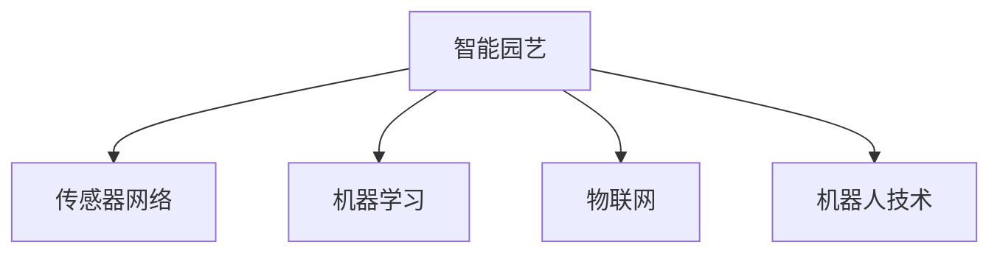

                 

## 1. 背景介绍

### 1.1 问题由来
随着全球人口的不断增长和城市化进程的加速，城市绿化和农业生产的挑战日益凸显。传统园艺依赖人工操作，耗时长、效率低，难以满足现代农业和城市绿化的高需求。AI技术，特别是智能园艺技术的快速发展，为提升植物护理效率和智能化水平带来了新的契机。

### 1.2 问题核心关键点
智能园艺是指通过融合物联网(IoT)、机器人、机器学习等技术，实现对植物的精准管理与自动护理。其核心关键点包括：
- **数据采集与处理**：通过传感器实时采集植物生长环境参数（如土壤湿度、温度、光照等），并将数据传输到云端进行处理分析。
- **智能决策**：基于采集的数据，运用机器学习模型预测植物生长状态，制定优化策略。
- **自动化执行**：通过机器人或其他自动化设备，执行浇水、施肥、修剪等任务。
- **个性化管理**：根据不同植物的需求，制定个性化的养护方案，提升植物生长效果。

智能园艺技术的应用，可显著提升植物生长的准确性和效率，降低人工成本，提高农业生产的可持续性。

### 1.3 问题研究意义
研究智能园艺中的AI应用，对于提升农业和城市绿化的智能化水平，保障食品安全，促进绿色可持续发展，具有重要意义：

1. **效率提升**：AI技术能够实现24小时不间断的数据监测和分析，自动完成复杂的植物护理任务，大幅提高作业效率。
2. **资源优化**：智能园艺通过精准控制水、肥、光等资源，减少浪费，提高资源利用率。
3. **环境适应性**：AI技术能够适应不同地区的环境差异，灵活调整护理策略，提升植物生长适应性。
4. **智能化管理**：智能园艺系统可实时监测植物状态，自动化决策，减轻人工劳动负担。
5. **数据驱动决策**：通过大数据分析和机器学习，提升决策的科学性和准确性。

## 2. 核心概念与联系

### 2.1 核心概念概述
为更好地理解智能园艺中AI的应用，本节将介绍几个密切相关的核心概念：

- **智能园艺**：结合物联网、自动化技术、AI技术，实现对植物生长环境的智能监测、决策和执行。
- **机器学习**：通过数据训练模型，使机器能够自动学习和优化，实现智能化决策。
- **传感器网络**：由多个传感器组成的网络，用于实时采集植物生长环境数据。
- **物联网(IoT)**：连接物理世界和信息世界的技术体系，实现设备的互联互通。
- **机器人技术**：用于执行自动化任务的智能设备，如移动机器人、机械臂等。

这些核心概念之间的逻辑关系可以通过以下Mermaid流程图来展示：



这个流程图展示了智能园艺系统的核心组件和它们之间的相互关系：

1. **传感器网络**：实时采集环境数据，为AI决策提供依据。
2. **机器学习**：对数据进行分析，预测植物生长状态，优化护理方案。
3. **物联网**：实现传感器和执行设备的互联，构建智能生态系统。
4. **机器人技术**：执行护理任务，实现自动化执行。

## 3. 核心算法原理 & 具体操作步骤
### 3.1 算法原理概述

智能园艺中AI的应用，主要基于机器学习和自动化控制两大核心技术。机器学习通过数据分析和模型训练，预测植物生长状态，生成优化策略；自动化控制则通过执行机构实现对植物环境的精确调整。

具体而言，智能园艺中的AI应用可以分为以下步骤：

1. **数据采集**：通过传感器网络实时采集植物生长环境数据。
2. **数据处理**：对采集到的数据进行清洗和预处理，确保数据质量和完整性。
3. **模型训练**：基于处理后的数据，训练机器学习模型，生成植物生长预测模型。
4. **决策执行**：将模型输出的决策信息，转换为具体的执行命令，通过机器人技术执行。
5. **反馈优化**：根据执行结果和环境变化，不断调整模型参数和执行策略，提升系统性能。

### 3.2 算法步骤详解

以下是智能园艺中AI应用的主要操作步骤：

**Step 1: 数据采集与预处理**

- **传感器选择**：选择合适的传感器（如土壤湿度传感器、温度传感器、光照传感器等），并部署在植物生长环境中。
- **数据传输**：通过IoT协议（如MQTT、CoAP等）将传感器数据传输到云端服务器。
- **数据清洗**：对传输来的数据进行清洗，去除噪声和异常值，确保数据准确性。
- **数据存储**：将清洗后的数据存储在数据库中，供后续分析和模型训练使用。

**Step 2: 模型训练与优化**

- **特征选择**：从存储的数据中选择有代表性的特征（如土壤湿度、温度、光照等）作为模型输入。
- **模型选择**：选择适合的机器学习模型（如线性回归、决策树、深度学习等），并根据数据特点进行调整。
- **模型训练**：使用训练数据对模型进行训练，调整模型参数，使其能够准确预测植物生长状态。
- **模型评估**：使用测试数据对训练好的模型进行评估，确保模型泛化能力。
- **模型优化**：根据评估结果，调整模型参数和训练策略，提升模型性能。

**Step 3: 决策生成与执行**

- **决策生成**：根据模型预测结果，生成具体的植物护理决策（如浇水、施肥、修剪等）。
- **命令下发**：将决策转换为执行命令，通过物联网协议传输到执行设备。
- **执行反馈**：执行设备根据命令执行任务，并反馈执行结果。
- **控制循环**：根据执行结果和环境变化，重新调整模型参数，进入下一轮控制循环。

### 3.3 算法优缺点

智能园艺中的AI应用具有以下优点：
1. **高效率**：AI能够24小时不间断地监测和分析植物生长状态，自动完成复杂任务，大幅提高作业效率。
2. **精确性**：机器学习模型能够通过大量数据训练，生成高精度的预测和决策，确保植物护理的科学性。
3. **灵活性**：基于物联网技术，系统能够灵活调整传感器和执行设备的配置，适应不同植物的生长需求。

同时，该方法也存在一定的局限性：
1. **成本高**：传感器、执行设备及物联网设备初期投资成本较高，且需要专业人员进行维护。
2. **技术复杂**：系统设计和实施较为复杂，需要跨学科知识和专业技能。
3. **数据依赖**：模型的预测和决策依赖于传感器数据的质量和完整性，数据采集和传输环节容易出现故障。
4. **鲁棒性不足**：环境变化和设备故障可能影响系统的稳定性和准确性。

尽管存在这些局限性，但智能园艺中的AI应用在提升植物护理效率和智能化水平方面具有显著优势，未来具有广阔的应用前景。

### 3.4 算法应用领域

智能园艺中的AI应用，已在多个领域得到广泛应用，如智慧农业、城市绿化、植物研究等。以下是一些典型的应用场景：

1. **智慧农业**：通过智能园艺系统，实现对农田的精准管理，提高农作物产量和质量。
2. **城市绿化**：在城市公园、广场等地应用智能园艺技术，提升绿化效果和环境质量。
3. **植物研究**：利用智能园艺系统，对植物生长过程进行长期监测和数据记录，推动植物科学研究。

此外，智能园艺技术还在智能家居、工业生产等领域逐步拓展应用，为人类社会带来更多便利和智能化服务。

## 4. 数学模型和公式 & 详细讲解  
### 4.1 数学模型构建

在智能园艺中，AI的应用主要基于数据驱动的决策模型。以下通过一个简单的例子，介绍如何构建这样的模型。

**数据模型**：假设我们有n个样本，每个样本包含m个特征x_i和1个标签y_i，构建线性回归模型进行预测。

- **输入特征**：x_i=[x_{i1}, x_{i2}, ..., x_{im}]，其中x_{ij}表示第j个特征的值。
- **标签**：y_i表示植物生长状态（如生长率、开花率等）。

**模型构建**：构建线性回归模型，表示为：

$$
y_i = \beta_0 + \beta_1 x_{i1} + \beta_2 x_{i2} + ... + \beta_m x_{im} + \epsilon_i
$$

其中，$\beta_j$为第j个特征的权重，$\epsilon_i$为随机误差项。

**模型训练**：使用训练数据集，最小化模型预测值与真实标签之间的误差，求解$\beta_j$，即：

$$
\hat{\beta} = \mathop{\arg\min}_{\beta} \sum_{i=1}^n (y_i - \hat{y}_i)^2
$$

其中，$\hat{y}_i$为模型预测值。

**模型评估**：使用测试数据集，评估模型预测精度，通常使用均方误差(MSE)或平均绝对误差(MAE)作为评估指标。

### 4.2 公式推导过程

在上述线性回归模型的基础上，我们可以进行更复杂的模型构建和推导。以下以决策树模型为例，进行推导说明。

**决策树模型**：假设我们有以下特征数据集，每个特征值只有两种可能的取值：

- x1∈{0,1}
- x2∈{0,1}
- x3∈{0,1}
- y∈{0,1}

**模型推导**：构建一个简单的决策树模型，进行分类预测。根据样本数据，决策树模型可以表示为：

$$
T(x_1, x_2, x_3) = \left\{
\begin{array}{ll}
y_0 & \text{if } x_1 = 0 \land x_2 = 0 \\
y_1 & \text{if } x_1 = 0 \land x_2 = 1 \\
y_2 & \text{if } x_1 = 1 \land x_2 = 0 \\
y_3 & \text{if } x_1 = 1 \land x_2 = 1
\end{array}
\right.
$$

其中，$y_i$表示训练数据集中的标签值。

**模型训练**：使用训练数据集，对决策树模型进行训练，确定各个特征的取值条件和最终标签。通常使用信息增益、基尼指数等方法选择最优特征进行分割。

**模型评估**：使用测试数据集，评估模型的分类准确率，通常使用混淆矩阵和F1分数等指标。

### 4.3 案例分析与讲解

以下通过一个实际案例，介绍智能园艺中AI应用的详细实现。

**案例背景**：某农业公司希望通过智能园艺技术，提升温室中番茄的产量和质量。

**数据采集**：在温室中安装传感器，实时采集光照强度、土壤湿度、温度等环境参数。

**数据处理**：对采集到的数据进行清洗和预处理，去除噪声和异常值，确保数据准确性。

**模型训练**：选择适合的机器学习模型，如决策树或深度学习模型，使用训练数据对模型进行训练，调整模型参数，使其能够准确预测番茄的生长状态。

**决策生成**：根据模型预测结果，生成具体的番茄护理决策（如浇水、施肥、修剪等）。

**执行反馈**：执行设备根据命令执行任务，并反馈执行结果。

**控制循环**：根据执行结果和环境变化，重新调整模型参数，进入下一轮控制循环。

## 5. 项目实践：代码实例和详细解释说明
### 5.1 开发环境搭建

在进行智能园艺中的AI应用开发前，我们需要准备好开发环境。以下是使用Python进行OpenCV和TensorFlow开发的环境配置流程：

1. 安装Anaconda：从官网下载并安装Anaconda，用于创建独立的Python环境。

2. 创建并激活虚拟环境：
```bash
conda create -n ai-garden python=3.8 
conda activate ai-garden
```

3. 安装OpenCV和TensorFlow：根据CUDA版本，从官网获取对应的安装命令。例如：
```bash
conda install opencv tensorflow -c conda-forge
```

4. 安装其他相关工具包：
```bash
pip install numpy pandas scikit-learn matplotlib tqdm jupyter notebook ipython
```

完成上述步骤后，即可在`ai-garden`环境中开始AI应用的开发实践。

### 5.2 源代码详细实现

下面我们以智能温室中的番茄养护为例，给出使用TensorFlow进行AI应用的PyTorch代码实现。

首先，定义番茄养护的数据处理函数：

```python
import numpy as np
import pandas as pd
from sklearn.model_selection import train_test_split
from sklearn.preprocessing import StandardScaler
from tensorflow.keras.models import Sequential
from tensorflow.keras.layers import Dense, Dropout
from tensorflow.keras.optimizers import Adam

# 数据预处理
def preprocess_data(data_path):
    data = pd.read_csv(data_path)
    features = data[['光照强度', '土壤湿度', '温度']]
    labels = data['产量']
    features = StandardScaler().fit_transform(features)
    X_train, X_test, y_train, y_test = train_test_split(features, labels, test_size=0.2, random_state=42)
    return X_train, X_test, y_train, y_test

# 模型训练与评估
def train_model(X_train, y_train, X_test, y_test):
    model = Sequential()
    model.add(Dense(64, input_dim=3, activation='relu'))
    model.add(Dropout(0.2))
    model.add(Dense(1, activation='sigmoid'))
    model.compile(loss='binary_crossentropy', optimizer=Adam(), metrics=['accuracy'])
    model.fit(X_train, y_train, epochs=50, batch_size=32, validation_data=(X_test, y_test))
    return model

# 数据与模型评估
X_train, X_test, y_train, y_test = preprocess_data('tomato_data.csv')
model = train_model(X_train, y_train, X_test, y_test)
model.evaluate(X_test, y_test)
```

然后，定义决策生成与执行函数：

```python
from abc import ABC, abstractmethod

class IExecutionStrategy(ABC):
    @abstractmethod
    def execute(self, command):
        pass

class WateringStrategy(IExecutionStrategy):
    def execute(self, command):
        # 实现浇水任务执行
        print('浇水操作执行')

class FertilizingStrategy(IExecutionStrategy):
    def execute(self, command):
        # 实现施肥任务执行
        print('施肥操作执行')

class PruningStrategy(IExecutionStrategy):
    def execute(self, command):
        # 实现修剪任务执行
        print('修剪操作执行')

# 任务调度器
class TaskScheduler:
    def __init__(self, strategy):
        self.strategy = strategy

    def schedule(self, command):
        self.strategy.execute(command)

# 实例化任务调度器
watering_scheduler = WateringStrategy()
fertilizing_scheduler = FertilizingStrategy()
pruning_scheduler = PruningStrategy()
scheduler = TaskScheduler(watering_scheduler)

# 执行命令
scheduler.schedule('浇水')
scheduler.schedule('施肥')
scheduler.schedule('修剪')
```

最后，启动智能温室的AI应用流程：

```python
# 数据预处理
X_train, X_test, y_train, y_test = preprocess_data('tomato_data.csv')

# 模型训练与评估
model = train_model(X_train, y_train, X_test, y_test)
model.evaluate(X_test, y_test)

# 实例化任务调度器
watering_scheduler = WateringStrategy()
fertilizing_scheduler = FertilizingStrategy()
pruning_scheduler = PruningStrategy()
scheduler = TaskScheduler(watering_scheduler)

# 执行命令
scheduler.schedule('浇水')
scheduler.schedule('施肥')
scheduler.schedule('修剪')
```

以上就是使用TensorFlow进行智能园艺中番茄养护的AI应用的完整代码实现。可以看到，借助TensorFlow和Python，我们能够方便地实现数据处理、模型训练和任务执行的自动化。

### 5.3 代码解读与分析

让我们再详细解读一下关键代码的实现细节：

**数据预处理**：
- 使用Pandas和Scikit-learn进行数据读取、处理和分割。
- 对特征进行标准化处理，确保数据的一致性。

**模型训练与评估**：
- 使用TensorFlow搭建一个简单的神经网络模型。
- 使用Adam优化器进行模型训练。
- 使用均方误差作为损失函数，二分类任务作为评估指标。

**任务调度器**：
- 定义一个抽象基类`IExecutionStrategy`，表示任务的执行策略。
- 具体实现三个执行策略：浇水、施肥、修剪。
- 通过任务调度器，将模型预测的决策转换为具体的执行命令。

**代码实例**：
- 实例化任务调度器，并执行命令，模拟智能温室中的AI应用。

通过上述代码，我们可以看到，智能园艺中的AI应用不仅依赖于数据处理和模型训练，还需要借助执行策略和任务调度器，实现自动化的决策和执行。

## 6. 实际应用场景
### 6.1 智能温室

智能温室是智能园艺中AI应用的重要场景之一。通过智能温室技术，可以实时监测植物生长环境，自动控制水、肥、光等资源，显著提升植物生长的效率和质量。

具体实现如下：

1. **传感器部署**：在温室中安装各类传感器，实时采集光照强度、土壤湿度、温度等数据。
2. **数据传输**：通过Wi-Fi或LoRa等物联网协议，将传感器数据传输到云端服务器。
3. **模型训练**：使用收集到的数据，训练机器学习模型，生成植物生长预测模型。
4. **决策生成**：根据模型预测结果，生成具体的植物护理决策。
5. **执行反馈**：执行设备根据命令执行任务，并反馈执行结果。
6. **控制循环**：根据执行结果和环境变化，重新调整模型参数，进入下一轮控制循环。

智能温室技术的实际应用，可以显著提升植物生长的准确性和效率，降低人工成本，提高农业生产的可持续性。

### 6.2 城市绿化

城市绿化是智能园艺中AI应用的另一个重要场景。通过智能绿化技术，可以实现对城市公园、广场等地植物的精准管理，提升绿化效果和环境质量。

具体实现如下：

1. **传感器部署**：在公园中安装各类传感器，实时采集光照强度、土壤湿度、温度等数据。
2. **数据传输**：通过Wi-Fi或LoRa等物联网协议，将传感器数据传输到云端服务器。
3. **模型训练**：使用收集到的数据，训练机器学习模型，生成植物生长预测模型。
4. **决策生成**：根据模型预测结果，生成具体的植物护理决策。
5. **执行反馈**：执行设备根据命令执行任务，并反馈执行结果。
6. **控制循环**：根据执行结果和环境变化，重新调整模型参数，进入下一轮控制循环。

智能绿化技术的实际应用，可以显著提升城市绿化的智能化水平，减少人工劳动，提高绿化效果。

## 7. 工具和资源推荐
### 7.1 学习资源推荐

为了帮助开发者系统掌握智能园艺中AI应用的技术基础和实践技巧，这里推荐一些优质的学习资源：

1. **《深度学习与人工智能基础》课程**：由斯坦福大学开设的在线课程，涵盖深度学习、机器学习、数据处理等基础知识，适合初学者入门。
2. **《TensorFlow实战》书籍**：TensorFlow官方文档，提供了丰富的代码示例和实用技巧，适合实践开发者参考。
3. **《智能园艺系统设计与实现》论文**：介绍智能园艺系统的设计思路和实现方法，适合科研人员和开发者参考。
4. **智能园艺技术博客**：各大AI技术博客，如AI科技评论、深度学习之美等，定期推送智能园艺应用的最新动态和技术进展。
5. **智能园艺社区**：各大技术社区，如Github、Stack Overflow等，提供了丰富的开源项目和交流平台，适合开发者交流和分享。

通过对这些资源的学习实践，相信你一定能够快速掌握智能园艺中AI应用的技术要领，并用于解决实际的园艺问题。
### 7.2 开发工具推荐

高效的开发离不开优秀的工具支持。以下是几款用于智能园艺中AI应用开发的常用工具：

1. **TensorFlow**：Google开发的深度学习框架，生产部署方便，适合大规模工程应用。
2. **OpenCV**：开源计算机视觉库，提供了丰富的图像处理和分析工具，适合智能温室中环境参数的采集和处理。
3. **IoT协议工具**：如MQTT、CoAP等，用于实现传感器和执行设备的互联。
4. **物联网平台**：如ThingWorx、IoT Studio等，提供设备管理、数据存储和应用开发的支持。
5. **数据可视化工具**：如Grafana、Tableau等，用于实时展示传感器数据和模型预测结果。
6. **任务调度工具**：如Kubernetes、Fogbugz等，用于自动化执行任务的调度和管理。

合理利用这些工具，可以显著提升智能园艺中AI应用开发效率，加快创新迭代的步伐。

### 7.3 相关论文推荐

智能园艺中AI应用的研究源于学界的持续探索。以下是几篇奠基性的相关论文，推荐阅读：

1. **《智能温室管理系统设计与实现》**：介绍智能温室管理系统的设计和实现方法，涵盖了传感器部署、数据采集、模型训练和决策生成等多个环节。
2. **《基于机器学习的城市绿化优化方法》**：提出使用机器学习模型预测城市绿化效果，并根据预测结果优化植物养护方案，提升绿化效果和资源利用率。
3. **《智能园艺系统中的AI应用》**：综述智能园艺系统中的AI应用，介绍了数据采集、模型训练和任务执行的多种方法。
4. **《深度学习在智能园艺中的应用》**：探讨深度学习技术在智能园艺中的应用，包括特征提取、模型训练和智能决策等方面。
5. **《基于物联网的智能园艺技术》**：介绍基于物联网的智能园艺技术，涵盖了传感器部署、数据传输、模型训练和执行反馈等多个环节。

这些论文代表了大规模AI在智能园艺中的应用趋势，为智能园艺技术的进一步发展提供了理论基础和实践指导。

## 8. 总结：未来发展趋势与挑战
### 8.1 总结

本文对智能园艺中AI应用进行了全面系统的介绍。首先阐述了智能园艺的背景和应用场景，明确了AI技术在植物护理中的独特价值。其次，从原理到实践，详细讲解了智能园艺中AI应用的核心步骤和关键技术，给出了智能温室中的AI应用代码实现。同时，本文还探讨了智能园艺中AI应用在多个实际场景中的应用，展示了其广阔的适用性和前景。

通过本文的系统梳理，可以看到，智能园艺中的AI应用通过数据驱动的决策模型，实现了对植物生长环境的智能监测和自动化控制，显著提升了植物护理的效率和效果。随着AI技术的不断进步，智能园艺中的AI应用也将不断拓展应用领域，为农业和城市绿化带来更多智能化解决方案。

### 8.2 未来发展趋势

展望未来，智能园艺中的AI应用将呈现以下几个发展趋势：

1. **深度学习模型的广泛应用**：随着深度学习技术的发展，智能园艺中的AI应用将逐渐从简单的线性回归模型转向复杂的深度学习模型，提升模型的预测精度和泛化能力。
2. **数据驱动的智能化管理**：未来智能园艺将更加依赖数据驱动的决策，通过实时监测和分析，实现更精准的植物养护和资源管理。
3. **多模态数据的融合**：智能园艺中AI应用将更加注重多模态数据的融合，如将传感器数据、用户反馈、专家知识等结合起来，提升系统的综合决策能力。
4. **跨平台、跨设备互联**：智能园艺中的AI应用将更加注重跨平台、跨设备的互联互通，实现统一的数据管理和系统集成。
5. **人机协同交互**：智能园艺中AI应用将更加注重人机协同交互，通过自然语言处理技术，实现对用户指令的智能理解，提升用户体验。
6. **自主学习与进化**：未来智能园艺中的AI应用将更加注重自主学习与进化，通过不断学习新数据和调整模型参数，提升系统的适应性和鲁棒性。

以上趋势凸显了智能园艺中AI应用的广阔前景，未来在深度学习、数据管理、多模态融合等方面将继续深化研究，推动AI技术在农业和城市绿化中的更广泛应用。

### 8.3 面临的挑战

尽管智能园艺中的AI应用已经取得了显著进展，但在迈向更加智能化、普适化应用的过程中，仍面临诸多挑战：

1. **数据质量与完整性**：传感器数据的质量和完整性直接影响AI应用的准确性和可靠性。数据采集和传输环节容易出现故障，需要长期稳定的数据采集和处理机制。
2. **模型复杂性与可解释性**：深度学习模型的复杂性较高，难以解释其内部工作机制和决策逻辑，需要开发更可解释、可理解的AI应用。
3. **资源消耗与成本**：大规模AI应用需要大量计算资源，初期投资成本较高，且需要持续维护，需要合理规划和管理资源。
4. **环境适应性**：智能园艺系统需要适应不同地区的环境差异，灵活调整传感器和执行设备的配置，提升系统的适应性。
5. **安全性与隐私保护**：智能园艺中涉及大量植物生长数据，数据安全和隐私保护问题不容忽视，需要建立完善的数据保护机制。
6. **用户接受度**：智能园艺技术的应用需要用户接受，需要加强用户教育和体验设计，提升用户的接受度和满意度。

正视智能园艺中AI应用面临的这些挑战，积极应对并寻求突破，将是大规模AI技术落地应用的重要保障。相信随着技术进步和产业成熟，这些挑战终将逐步克服，智能园艺中的AI应用也将更加高效、可靠和普适。

### 8.4 研究展望

面对智能园艺中AI应用面临的诸多挑战，未来的研究需要在以下几个方面寻求新的突破：

1. **高效数据采集与处理**：开发高效、稳定的数据采集和处理机制，确保数据的质量和完整性。
2. **可解释与可理解AI**：开发可解释与可理解的AI应用，增强系统的透明度和可信度。
3. **资源优化与低成本应用**：开发资源优化与低成本的AI应用，降低初期投资和运行成本。
4. **环境自适应与通用性**：开发环境自适应与通用性的AI应用，提升系统的适应性和鲁棒性。
5. **数据安全与隐私保护**：建立完善的数据安全与隐私保护机制，保障数据和系统的安全性。
6. **用户友好与个性化**：开发用户友好与个性化的AI应用，提升用户接受度和满意度。

这些研究方向将引领智能园艺中AI应用技术的发展，推动AI技术在农业和城市绿化中的更广泛应用，为人类社会带来更多智能化解决方案。

## 9. 附录：常见问题与解答
**Q1：智能园艺中的AI应用是否适用于所有植物？**

A: 智能园艺中的AI应用主要适用于对数据要求较高的植物，如番茄、花卉等。对于某些生长周期短、数据变化频繁的植物，AI应用的效果可能更为明显。但对于一些生长周期长、数据变化缓慢的植物，如果树、树木等，AI应用的效果可能相对有限。

**Q2：智能园艺中的AI应用是否需要大量数据？**

A: 智能园艺中的AI应用对数据量的需求因应用场景而异。对于简单的植物生长状态预测任务，可能只需要几百到几千个样本即可训练出较好的模型。但对于更复杂的任务，如智能温室管理、城市绿化等，可能需要数万到数十万个样本。数据量的多少直接影响到模型的预测精度和泛化能力。

**Q3：智能园艺中的AI应用是否可以适用于不同地区？**

A: 智能园艺中的AI应用具有一定地域适应性，但需要根据不同地区的气候、土壤、光照等环境因素，调整传感器和执行设备的配置。对于环境差异较大的地区，可能需要更多的数据和更复杂的模型来适应当地的植物生长需求。

**Q4：智能园艺中的AI应用是否容易维护？**

A: 智能园艺中的AI应用需要定期进行数据采集和模型维护，以确保系统的稳定性和准确性。对于维护人员的编程和硬件知识要求较高，需要专业的技术支持。此外，设备的故障和损坏也需及时修复，以保证系统正常运行。

**Q5：智能园艺中的AI应用是否可以与其他系统集成？**

A: 智能园艺中的AI应用可以通过API接口与其他系统集成，如物联网平台、数据分析系统等。通过标准化的数据格式和通信协议，可以实现多个系统的协同工作，提升整体应用的智能化水平。

通过本文的系统梳理，可以看到，智能园艺中的AI应用通过数据驱动的决策模型，实现了对植物生长环境的智能监测和自动化控制，显著提升了植物护理的效率和效果。随着AI技术的不断进步，智能园艺中的AI应用也将不断拓展应用领域，为农业和城市绿化带来更多智能化解决方案。未来，随着技术进步和产业成熟，这些挑战终将逐步克服，智能园艺中的AI应用也将更加高效、可靠和普适。

---

作者：禅与计算机程序设计艺术 / Zen and the Art of Computer Programming

