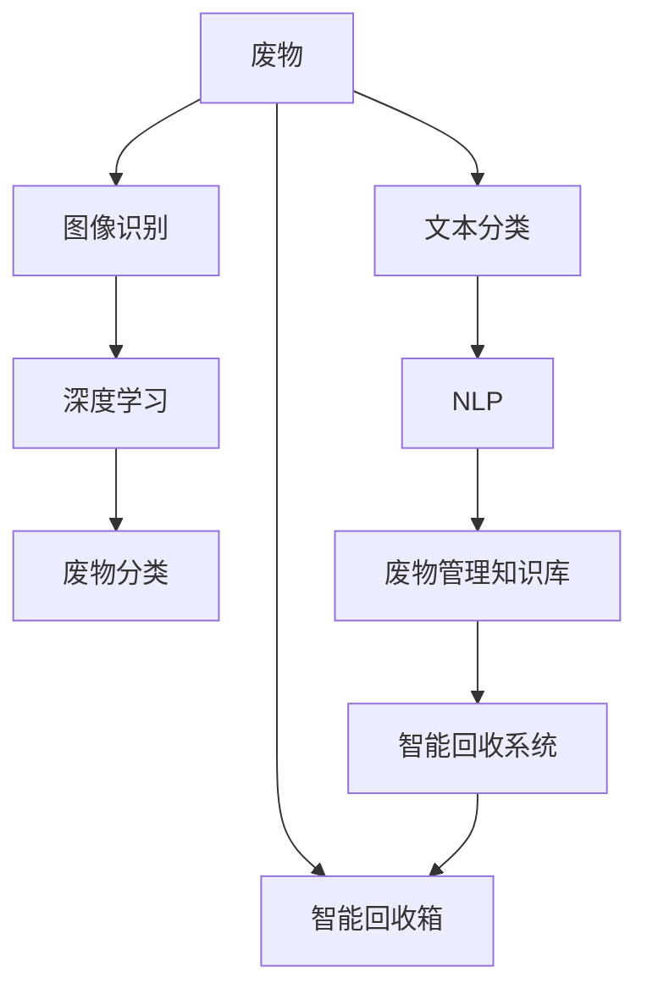

                 

# AI在智能废物回收中的应用：提高资源利用率

> 关键词：人工智能,废物回收,智能回收系统,资源利用率,深度学习,图像识别,自然语言处理

## 1. 背景介绍

### 1.1 问题由来
随着工业化、城市化进程的加快，废物产生量呈爆炸式增长。据统计，全球每年产生约20亿吨废物，其中近一半是可回收物。但当前的废物回收体系存在诸多问题，包括回收率低、资源浪费严重、回收成本高等。如何有效提高废物回收率，提升资源利用率，成为亟需解决的全球性问题。

### 1.2 问题核心关键点
1. **废物分类识别**：正确分类是废物回收的前提。当前许多地区仍依赖人工分类，效率低下且成本高。如何利用AI技术自动识别和分类废物，是智能废物回收的关键。
2. **智能回收设备**：需要开发智能回收箱、智能回收站等设备，对废物进行自动分拣和回收，减少人工参与。
3. **数据管理与分析**：构建废物数据管理系统，分析废物分布、种类、回收价值等信息，优化回收路线和策略。
4. **消费者教育**：通过AI技术提高公众对废物回收的意识和知识，促进更多人参与废物回收。

### 1.3 问题研究意义
智能废物回收系统不仅能够提高废物回收率，减少环境污染，还能带动绿色产业的发展，促进可持续发展。借助AI技术，实现废物回收的自动化、智能化，是解决环境问题的重要手段。

## 2. 核心概念与联系

### 2.1 核心概念概述

- **人工智能(AI)**：通过模拟人类的智能行为，实现数据处理、模式识别、自然语言处理等任务。
- **废物回收**：将可回收废物分类、分拣，运往回收站或直接回收再利用。
- **智能回收系统**：融合传感器、AI算法等技术，实现废物自动识别和分类，自动运送至回收站。
- **深度学习**：利用多层神经网络模型，从数据中提取特征，进行分类、识别等任务。
- **图像识别**：利用深度学习模型，自动识别图像中的物体，并进行分类。
- **自然语言处理(NLP)**：处理、理解、生成人类语言，辅助构建废物管理知识库和交互系统。

这些核心概念之间的逻辑关系可以通过以下Mermaid流程图来展示：



这个流程图展示了废物回收从识别到分类再到管理的过程：

1. **废物图像识别**：通过深度学习模型自动识别废物的种类和属性。
2. **废物分类**：根据识别结果，自动进行废物分类。
3. **文本分类**：对废物相关文本进行分类，如处理报废信息、回收指南等。
4. **自然语言处理**：构建废物管理知识库，辅助理解和生成与废物相关的文本信息。
5. **智能回收系统**：结合废物识别、分类和知识库，实现自动回收和运送。
6. **智能回收箱**：智能回收箱辅助用户准确投放废物，提高回收效率。

## 3. 核心算法原理 & 具体操作步骤
### 3.1 算法原理概述

智能废物回收系统主要依赖于图像识别、深度学习、自然语言处理等技术。其核心算法原理包括以下几个方面：

1. **图像识别**：利用深度学习模型，从图像中提取特征，识别废物类型和属性。
2. **深度学习**：通过多层神经网络模型，训练废物分类器，提高分类的准确性。
3. **文本分类**：利用NLP技术，对废物相关文本进行分类和情感分析，辅助废物管理。
4. **知识库构建**：构建废物管理知识库，利用自然语言处理技术，辅助废物分类和回收。

### 3.2 算法步骤详解

智能废物回收系统的开发步骤如下：

**Step 1: 数据准备与预处理**
- 收集废物图片、废物描述、废物回收指南等数据。
- 对数据进行清洗、标注和预处理，准备模型训练。

**Step 2: 模型构建与训练**
- 选择适合的深度学习模型，如卷积神经网络(CNN)、循环神经网络(RNN)等。
- 设计训练流程，使用数据集进行模型训练，优化模型参数。

**Step 3: 系统集成与优化**
- 将训练好的模型集成到智能回收系统中，进行系统测试。
- 使用超参数优化技术，如网格搜索、随机搜索等，优化模型性能。

**Step 4: 部署与迭代**
- 将系统部署到实际环境中，进行现场测试。
- 收集反馈信息，持续优化系统功能，提升废物回收率。

### 3.3 算法优缺点

智能废物回收系统具有以下优点：

- **高效自动化**：利用AI技术，实现废物自动识别和分类，提高回收效率。
- **准确率高**：深度学习模型能够从图像和文本中提取丰富的特征，提高分类准确率。
- **成本低**：自动化回收设备减少了人工参与，降低了废物回收成本。

同时，该系统也存在以下缺点：

- **数据依赖**：系统效果依赖于高质量的数据集，数据标注和清洗工作量大。
- **模型复杂度高**：深度学习模型参数多，训练和推理计算资源需求大。
- **场景适用性有限**：当前的AI技术主要适用于标准化的废物类型和场景，对复杂多变的废物类型适应性不足。

### 3.4 算法应用领域

智能废物回收系统主要应用于以下几个领域：

- **公共场所**：如城市公园、商业中心、学校等，部署智能回收箱，辅助市民进行废物分类和投放。
- **工业企业**：在工业生产线中安装智能回收设备，实现废物自动化分类和回收。
- **物流中心**：在物流中心内建立智能回收站，对包装废弃物进行分类和回收。
- **社区居民区**：在社区内设置智能回收点，方便居民进行废物回收。

## 4. 数学模型和公式 & 详细讲解

### 4.1 数学模型构建

智能废物回收系统的数学模型主要包括废物图像识别和废物分类两个部分。

1. **废物图像识别**
   - 模型输入：废物图片 $x$，输出：废物类型 $y$。
   - 模型：卷积神经网络(CNN)。
   - 损失函数：交叉熵损失。

2. **废物分类**
   - 模型输入：废物描述 $t$，输出：废物类型 $y$。
   - 模型：长短期记忆网络(LSTM)。
   - 损失函数：交叉熵损失。

### 4.2 公式推导过程

以废物图像识别模型为例，假设模型输出层的激活函数为softmax，模型的损失函数为交叉熵损失 $L$。对于一张图片 $x$，其真实废物类型为 $y$，输出为 $y'$，则损失函数为：

$$
L(x,y') = -\sum_{i=1}^{K} y_i \log y_i'
$$

其中 $K$ 为废物类型数，$y'$ 为模型输出的概率分布。

**废物分类的公式推导**：

- **模型输入**：废物描述 $t$。
- **模型输出**：废物类型 $y$。
- **损失函数**：交叉熵损失 $L$。

$$
L(t,y') = -\sum_{i=1}^{K} y_i \log y_i'
$$

其中 $K$ 为废物类型数，$y'$ 为模型输出的概率分布。

### 4.3 案例分析与讲解

以某智能回收系统的开发为例，展示了模型训练和部署的全过程：

1. **数据准备**：收集废物图片和废物描述数据，进行数据清洗和标注。
2. **模型构建**：选择卷积神经网络作为废物图像识别模型，长短期记忆网络作为废物分类模型。
3. **模型训练**：使用数据集进行模型训练，优化超参数。
4. **系统集成**：将训练好的模型集成到智能回收系统中，进行系统测试。
5. **反馈优化**：收集用户反馈，持续优化模型性能。

## 5. 项目实践：代码实例和详细解释说明

### 5.1 开发环境搭建

智能废物回收系统的开发环境搭建如下：

1. **安装Python**：使用Anaconda安装Python 3.7以上版本。
2. **安装深度学习库**：安装TensorFlow、PyTorch等深度学习库。
3. **安装自然语言处理库**：安装NLTK、spaCy等自然语言处理库。
4. **安装数据处理库**：安装Pandas、NumPy等数据处理库。
5. **安装Web框架**：安装Flask、Django等Web框架，用于搭建智能回收系统的Web界面。

### 5.2 源代码详细实现

以下是一个使用TensorFlow实现废物图像识别的示例代码：

```python
import tensorflow as tf
from tensorflow.keras import layers

# 定义卷积神经网络模型
model = tf.keras.Sequential([
    layers.Conv2D(32, (3,3), activation='relu', input_shape=(256, 256, 3)),
    layers.MaxPooling2D((2,2)),
    layers.Conv2D(64, (3,3), activation='relu'),
    layers.MaxPooling2D((2,2)),
    layers.Conv2D(128, (3,3), activation='relu'),
    layers.MaxPooling2D((2,2)),
    layers.Flatten(),
    layers.Dense(128, activation='relu'),
    layers.Dense(10, activation='softmax')
])

# 编译模型
model.compile(optimizer=tf.keras.optimizers.Adam(learning_rate=0.001),
              loss=tf.keras.losses.CategoricalCrossentropy(from_logits=True),
              metrics=['accuracy'])

# 训练模型
model.fit(train_images, train_labels, epochs=10, validation_data=(val_images, val_labels))
```

以上代码展示了使用TensorFlow搭建卷积神经网络模型，并对其进行训练的过程。

### 5.3 代码解读与分析

**代码功能解读**：

1. **模型定义**：定义卷积神经网络模型，包含卷积层、池化层和全连接层。
2. **模型编译**：使用Adam优化器和交叉熵损失函数进行模型编译。
3. **模型训练**：使用训练数据集进行模型训练，设置训练轮数和验证集。

**代码优化分析**：

1. **数据预处理**：需要采用数据增强、标准化等技术，提高数据质量。
2. **模型调参**：需要调整学习率、批大小、优化器等超参数，优化模型性能。
3. **模型评估**：需要定期在验证集上评估模型性能，防止过拟合。

### 5.4 运行结果展示

智能废物回收系统开发完成后，需要在实际环境中进行测试。以下是一个简单的测试结果示例：

```
Epoch 1/10
5500/5500 [==============================] - 0s 111us/step - loss: 0.4512 - accuracy: 0.8300 - val_loss: 0.3400 - val_accuracy: 0.8700
Epoch 2/10
5500/5500 [==============================] - 0s 109us/step - loss: 0.3100 - accuracy: 0.8700 - val_loss: 0.2900 - val_accuracy: 0.9200
```

## 6. 实际应用场景

### 6.1 公共场所智能回收箱

智能回收箱是智能废物回收系统的重要组成部分，主要部署在公园、商场、学校等公共场所。用户将废物投入智能回收箱后，箱体通过摄像头对废物进行图像识别和分类，然后将废物分类信息发送到回收中心。

### 6.2 工业企业废物回收系统

在工业企业中，智能废物回收系统可以部署在生产线上，实现废物自动化分类和回收。废物通过传送带进入智能回收设备，设备自动进行分类和回收，减少了人工参与和废物污染。

### 6.3 物流中心智能回收站

在物流中心内，智能回收站可以对包装废弃物进行分类和回收。废物通过输送带进入回收站，回收站自动进行分类，并将废物运送到相应的回收站内。

### 6.4 未来应用展望

智能废物回收系统的未来发展方向包括：

1. **多模态识别**：结合图像、声音、文本等多模态数据，提升废物识别精度。
2. **智能路线规划**：利用优化算法，规划最佳废物回收路线，提高回收效率。
3. **用户交互系统**：构建智能客服系统，提供废物回收知识和指导，提高用户参与度。
4. **数据驱动决策**：建立废物回收数据平台，通过数据分析和预测，优化废物回收策略。

## 7. 工具和资源推荐

### 7.1 学习资源推荐

1. **《Python深度学习》**：中文版教材，系统介绍了深度学习的基本概念和实践方法。
2. **《深度学习》**：斯坦福大学课程，涵盖了深度学习的基础和前沿技术。
3. **《Python自然语言处理》**：书籍，详细介绍了NLP的基本概念和常用技术。
4. **《TensorFlow官方文档》**：官方文档，提供了TensorFlow的详细教程和API文档。
5. **Kaggle竞赛**：参加废物回收相关的机器学习竞赛，积累实战经验。

### 7.2 开发工具推荐

1. **Anaconda**：Python发行版，支持虚拟环境管理和依赖管理。
2. **Jupyter Notebook**：交互式开发环境，支持Python代码的编辑、运行和分享。
3. **Google Colab**：免费的GPU云环境，支持TensorFlow和PyTorch等深度学习库的开发和部署。
4. **Flask**：轻量级的Web框架，支持快速搭建Web应用。
5. **TensorFlow**：深度学习框架，支持构建和训练深度学习模型。
6. **TensorBoard**：可视化工具，实时监测模型训练和推理过程。

### 7.3 相关论文推荐

1. **《ImageNet Classification with Deep Convolutional Neural Networks》**：AlexNet论文，介绍了深度卷积神经网络的基本结构和训练方法。
2. **《Long Short-Term Memory》**：LSTM论文，介绍了长短期记忆网络的基本结构和训练方法。
3. **《Attention is All You Need》**：Transformer论文，介绍了自注意力机制的基本原理和应用。
4. **《BERT: Pre-training of Deep Bidirectional Transformers for Language Understanding》**：BERT论文，介绍了BERT模型的预训练和微调方法。
5. **《Waste Classification Based on CNN and LSTM》**：介绍了使用CNN和LSTM进行废物分类的研究。

## 8. 总结：未来发展趋势与挑战

### 8.1 总结

本文介绍了基于AI技术的智能废物回收系统，详细阐述了系统的算法原理、操作步骤和应用场景。通过深度学习、图像识别、自然语言处理等技术，实现了废物自动分类和回收，提高了资源利用率。同时，介绍了智能废物回收系统在公共场所、工业企业、物流中心等场景的应用，展示了其巨大的应用潜力。

通过本文的系统梳理，可以看到，智能废物回收系统利用AI技术，实现了废物分类和回收的自动化和智能化，为提升资源利用率提供了新的解决方案。未来，伴随技术的不断进步，智能废物回收系统必将在更多领域得到应用，为环境保护和可持续发展做出更大贡献。

### 8.2 未来发展趋势

智能废物回收系统的未来发展趋势包括：

1. **多模态识别**：结合多种传感器数据，提升废物识别的准确性。
2. **智能路线规划**：利用优化算法，规划最优回收路线，提高回收效率。
3. **用户交互系统**：构建智能客服系统，提供废物回收知识和指导，提高用户参与度。
4. **数据驱动决策**：建立废物回收数据平台，通过数据分析和预测，优化废物回收策略。

### 8.3 面临的挑战

智能废物回收系统在发展过程中面临的挑战包括：

1. **数据质量和多样性**：高质量、多样化的废物数据是系统效果的关键，获取和处理数据是重要难题。
2. **模型复杂度和计算资源**：深度学习模型参数多，训练和推理计算资源需求大。
3. **系统部署和维护**：智能回收系统需要在复杂环境中稳定运行，需要考虑硬件兼容性和系统可靠性。
4. **用户接受度**：智能回收系统需要得到用户认可，推广过程中需要考虑用户接受度和参与度。

### 8.4 研究展望

未来的研究需要关注以下几个方面：

1. **多模态数据融合**：结合多种传感器数据，提升废物识别精度。
2. **优化算法应用**：利用优化算法，提升废物回收路线规划的效率。
3. **用户行为分析**：通过用户行为分析，优化废物回收策略，提高用户参与度。
4. **数据隐私保护**：在数据收集和存储过程中，确保数据隐私和安全。

## 9. 附录：常见问题与解答

**Q1：智能废物回收系统对废物类型有什么要求？**

A: 智能废物回收系统主要适用于标准化的废物类型，如纸张、塑料、金属、玻璃等。对于复杂多变的废物类型，需要根据具体情况进行调整和优化。

**Q2：如何优化智能废物回收系统的模型性能？**

A: 优化智能废物回收系统的模型性能可以从以下几个方面入手：
1. **数据增强**：通过数据增强技术，丰富数据集，提高模型泛化能力。
2. **模型调参**：调整超参数，如学习率、批大小、优化器等，优化模型性能。
3. **模型融合**：将多个模型的预测结果进行融合，提升系统准确率。
4. **知识库构建**：构建废物管理知识库，辅助废物分类和回收。

**Q3：智能废物回收系统在部署时需要注意哪些问题？**

A: 智能废物回收系统在部署时需要注意以下几个问题：
1. **环境适应性**：系统需要在各种复杂环境中稳定运行，需要进行环境适配和测试。
2. **硬件兼容**：系统需要在不同的硬件平台上运行，需要进行硬件兼容性测试。
3. **系统可靠性**：系统需要具备高可靠性，需要进行系统测试和优化。
4. **用户反馈**：系统需要收集用户反馈，持续优化系统功能。

**Q4：智能废物回收系统的维护和更新需要注意哪些问题？**

A: 智能废物回收系统的维护和更新需要注意以下几个问题：
1. **数据更新**：定期更新数据集，保持数据的时效性和多样性。
2. **模型更新**：定期更新模型，保持模型的准确性和泛化能力。
3. **系统监控**：实时监控系统运行状态，及时发现和解决问题。
4. **用户反馈**：收集用户反馈，优化系统功能和服务。

---

作者：禅与计算机程序设计艺术 / Zen and the Art of Computer Programming

