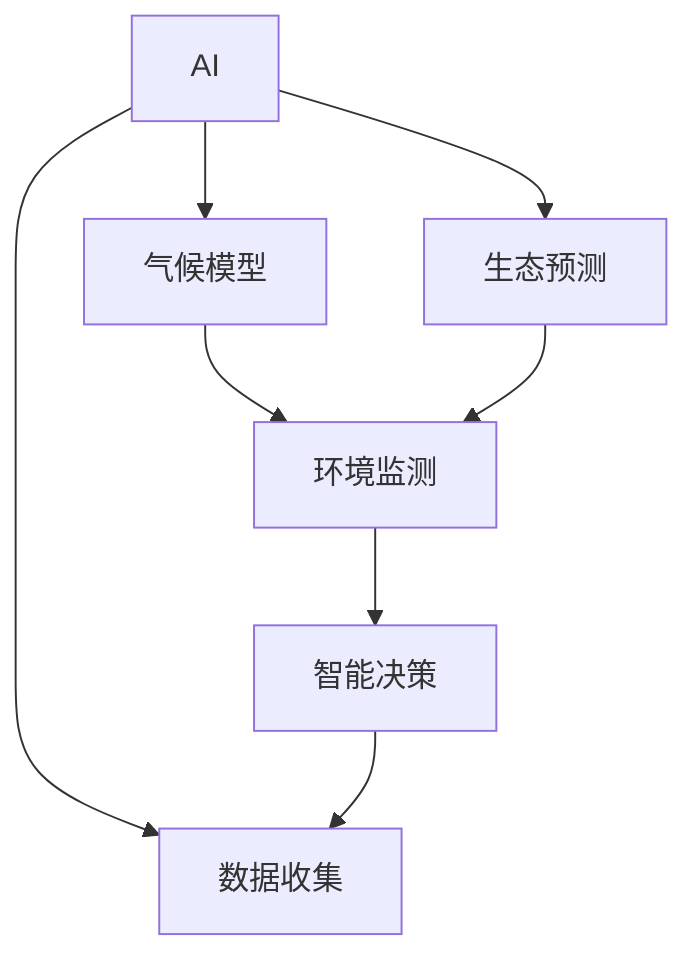

                 

# AI在环境保护中的应用：气候模型与生态预测

> 关键词：AI, 环境保护, 气候模型, 生态预测, 环境监测, 生态系统模拟, 智能决策, 资源管理

## 1. 背景介绍

### 1.1 问题由来

随着全球环境问题的日益严峻，如何有效保护环境、合理利用资源、防止生态系统恶化，成为人类共同面临的重大挑战。AI技术在各个领域的广泛应用，为环境保护提供了新的解决方案和工具，特别是通过气候模型和生态预测技术，能够实时监测、分析和预测环境变化，辅助决策者制定科学、合理的环保政策。

### 1.2 问题核心关键点

1. **AI技术在环境保护中的应用**：AI通过深度学习、数据挖掘等技术，分析海量环境数据，识别环境变化趋势，预测未来环境状况，辅助制定环境管理措施。
2. **气候模型与生态预测**：气候模型通过模拟大气、海洋、陆地等环境要素的相互作用，预测未来气候变化。生态预测则通过模拟生物群落、生态系统、物种分布等，评估生态系统健康和稳定性。
3. **环境监测与智能决策**：利用传感器、无人机、卫星等技术采集环境数据，结合AI模型进行分析，为环境管理提供科学依据，辅助制定资源管理、生态保护等决策。

## 2. 核心概念与联系

### 2.1 核心概念概述

为了更好地理解AI在环境保护中的应用，本节将介绍几个关键概念：

- **AI（人工智能）**：通过算法、模型等技术，赋予计算机系统理解、学习、推理等能力，辅助决策过程。
- **气候模型**：通过数学和物理模型，模拟气候系统（如大气、海洋、陆地）的变化，预测未来气候变化趋势。
- **生态预测**：通过生态模型，模拟生态系统（如生物群落、物种分布）的变化，评估生态系统健康和稳定性。
- **环境监测**：利用传感器、无人机、卫星等技术，采集环境数据，如气温、湿度、水质、空气质量等，实时监测环境状态。
- **智能决策**：基于环境数据和AI模型，辅助决策者进行资源管理、生态保护等决策，优化资源分配和环境保护措施。

这些核心概念之间的关系可以通过以下Mermaid流程图来展示：



这个流程图展示了大语言模型的核心概念及其之间的关系：

1. AI技术通过气候模型和生态预测，分析环境数据，提供科学依据。
2. 环境监测实时采集环境数据，支持AI模型和智能决策。
3. 智能决策辅助制定环境保护和资源管理的策略。

## 3. 核心算法原理 & 具体操作步骤
### 3.1 算法原理概述

AI在环境保护中的应用，主要是通过气候模型和生态预测模型，对环境数据进行分析、预测和模拟。其核心算法原理包括：

- **气候模型**：基于大气动力学、热力学等物理模型，通过数值模拟，预测未来气候变化趋势。主要算法有统计模型、动力学模型、数据驱动模型等。
- **生态预测**：通过生态系统模型，模拟生态系统的结构和功能，评估其健康和稳定性。主要算法有个体基模型、群落模型、系统模型等。
- **数据驱动模型**：利用机器学习、深度学习等技术，直接从环境数据中学习规律，进行预测和分类。主要算法有随机森林、支持向量机、神经网络等。

### 3.2 算法步骤详解

**气候模型算法步骤**：

1. **数据收集**：采集历史和实时的气候数据，如气温、降水量、气压、风速等。
2. **模型训练**：基于收集的数据，训练气候模型，模拟大气、海洋等环境要素的变化规律。
3. **预测生成**：利用训练好的模型，生成未来气候预测结果，评估气候变化趋势。

**生态预测算法步骤**：

1. **数据收集**：采集生态系统的历史和实时数据，如物种分布、种群数量、生物量、生态位等。
2. **模型训练**：基于收集的数据，训练生态模型，模拟生物群落、生态系统的结构和功能。
3. **预测生成**：利用训练好的模型，生成未来生态预测结果，评估生态系统健康和稳定性。

### 3.3 算法优缺点

**气候模型算法优缺点**：

- **优点**：精度高、可解释性强、能够模拟复杂的物理过程。
- **缺点**：计算复杂度高、模型参数复杂、对数据需求大。

**生态预测算法优缺点**：

- **优点**：能够反映生态系统的动态变化、模拟复杂的生物互动。
- **缺点**：模型复杂度高、数据需求大、精度受数据质量影响。

### 3.4 算法应用领域

AI在环境保护中的应用，主要包括以下几个领域：

1. **气候变化预测**：通过气候模型预测未来气候变化趋势，辅助制定气候变化应对措施。
2. **生态系统保护**：通过生态预测模型评估生态系统健康和稳定性，制定生态保护策略。
3. **环境监测**：利用AI技术分析环境数据，实时监测环境状态，提供预警和决策支持。
4. **资源管理**：通过智能决策辅助优化资源分配和环境保护措施，提升资源利用效率。

## 4. 数学模型和公式 & 详细讲解 & 举例说明

### 4.1 数学模型构建

在实际应用中，气候模型和生态预测模型的数学模型构建，通常涉及以下要素：

- **气候模型**：基于物理定律，建立气候系统的数学模型，如大气动力学方程、海洋动力学方程等。
- **生态预测模型**：基于生态学原理，建立生态系统的数学模型，如种群增长模型、食物链模型等。

### 4.2 公式推导过程

以气候模型为例，其核心数学模型为大气动力学方程组，包括质量守恒方程、动量守恒方程、能量守恒方程等。以质量守恒方程为例：

$$ \frac{\partial \rho}{\partial t} + \nabla \cdot (\rho \vec{u}) = 0 $$

其中 $\rho$ 为空气密度，$\vec{u}$ 为空气速度，$t$ 为时间。

### 4.3 案例分析与讲解

以碳循环模型为例，碳循环模型通过模拟大气、海洋、陆地之间的碳交换，评估未来碳排放对气候变化的影响。主要公式包括：

- **碳排放公式**：$C = C_0 \exp(kt)$，其中 $C$ 为未来碳浓度，$C_0$ 为初始浓度，$k$ 为碳排放系数，$t$ 为时间。
- **碳吸收公式**：$C = C_0 - \int_0^t kC(t')dt'$，其中 $C$ 为未来碳浓度，$C_0$ 为初始浓度，$k$ 为碳吸收系数，$t$ 为时间。

## 5. 项目实践：代码实例和详细解释说明
### 5.1 开发环境搭建

在进行环境模型和生态预测项目实践前，我们需要准备好开发环境。以下是使用Python进行PyTorch开发的环境配置流程：

1. 安装Anaconda：从官网下载并安装Anaconda，用于创建独立的Python环境。

2. 创建并激活虚拟环境：
```bash
conda create -n pytorch-env python=3.8 
conda activate pytorch-env
```

3. 安装PyTorch：根据CUDA版本，从官网获取对应的安装命令。例如：
```bash
conda install pytorch torchvision torchaudio cudatoolkit=11.1 -c pytorch -c conda-forge
```

4. 安装TensorFlow：
```bash
pip install tensorflow
```

5. 安装TensorBoard：
```bash
pip install tensorboard
```

6. 安装相关库：
```bash
pip install numpy pandas matplotlib scipy
```

完成上述步骤后，即可在`pytorch-env`环境中开始项目实践。

### 5.2 源代码详细实现

下面是使用PyTorch实现气候模型的代码示例：

```python
import torch
import torch.nn as nn
import torch.optim as optim

# 定义气候模型
class ClimateModel(nn.Module):
    def __init__(self):
        super(ClimateModel, self).__init__()
        self.lstm = nn.LSTM(1, 64, 2)
        self.fc = nn.Linear(64, 1)

    def forward(self, x):
        lstm_out, _ = self.lstm(x)
        output = self.fc(lstm_out)
        return output

# 定义数据处理函数
def load_data(path):
    data = torch.load(path)
    x = data[:, :, 0:1]
    y = data[:, :, 1:2]
    return x, y

# 定义训练函数
def train(model, x, y, optimizer, loss_fn, epochs=100):
    criterion = nn.MSELoss()
    for epoch in range(epochs):
        optimizer.zero_grad()
        output = model(x)
        loss = criterion(output, y)
        loss.backward()
        optimizer.step()
        print('Epoch: {} - Loss: {:.4f}'.format(epoch, loss.item()))

# 加载数据，训练模型
x, y = load_data('climate_data.pt')
model = ClimateModel()
optimizer = optim.Adam(model.parameters(), lr=0.001)
train(model, x, y, optimizer, nn.MSELoss())

# 保存模型
torch.save(model.state_dict(), 'climate_model.pt')
```

### 5.3 代码解读与分析

让我们再详细解读一下关键代码的实现细节：

**ClimateModel类**：
- `__init__`方法：初始化LSTM层和全连接层，定义模型的基本结构。
- `forward`方法：实现前向传播，将输入数据通过LSTM层和全连接层进行计算，输出预测结果。

**load_data函数**：
- 从文件中加载数据，将输入数据和输出数据分离，并进行归一化处理。

**train函数**：
- 定义损失函数和优化器，在每个epoch内进行训练，更新模型参数。
- 输出每个epoch的平均损失值。

通过这段代码，我们可以看到如何使用PyTorch实现一个简单的气候模型，并通过监督学习进行训练。这个模型虽然简单，但已经包含了气候模型中的主要组件和训练流程。

## 6. 实际应用场景

### 6.1 智能农业

智能农业利用气候模型和生态预测技术，通过数据分析和预测，优化农作物的种植和管理，提高农业生产效率和可持续性。例如，基于气候模型预测未来气温、降水量变化，辅助农民调整种植计划，避免灾害性天气对农作物的影响。

### 6.2 自然保护

自然保护通过生态预测模型，评估生态系统健康和稳定性，制定生态保护措施。例如，利用物种分布模型预测物种扩散趋势，确定需要重点保护的生态区域，防止生物多样性丧失。

### 6.3 城市规划

城市规划利用气候模型和生态预测技术，评估城市环境对居民生活的影响，优化城市设计和规划。例如，通过模拟城市气候变化和生态系统，评估不同城市规划方案的环境效益，选择最优方案。

### 6.4 未来应用展望

随着AI技术的发展，气候模型和生态预测技术将更加智能化、精准化，有望在环境保护和资源管理中发挥更大的作用。未来，这些技术可能进一步应用到以下领域：

1. **智能能源管理**：利用AI技术优化能源分配和调度，提升能源利用效率，减少环境污染。
2. **生态系统恢复**：通过生态预测模型，评估生态系统恢复方案的效果，选择最佳方案。
3. **灾害预警**：利用气候模型和生态预测模型，预测自然灾害的发生，提前预警，减少灾害损失。

## 7. 工具和资源推荐
### 7.1 学习资源推荐

为了帮助开发者系统掌握AI在环境保护中的应用，这里推荐一些优质的学习资源：

1. 《气候模型与生态预测》系列博文：由气候模型和生态预测领域专家撰写，深入浅出地介绍了气候模型和生态预测的基本原理和应用实例。

2. CS221《机器学习》课程：斯坦福大学开设的机器学习课程，涵盖了机器学习的基础理论和应用方法，包括监督学习、无监督学习等。

3. 《深度学习与生态系统模拟》书籍：详细介绍了如何使用深度学习技术进行生态系统模拟，包括数据收集、模型训练、结果评估等。

4. CLUE开源项目：气候模型和生态预测领域的重要开源项目，提供了丰富的数据集和模型实现，是学习和研究气候模型和生态预测的重要资源。

5. PyTorch官方文档：PyTorch的官方文档，提供了详细的API文档和代码示例，是学习PyTorch的重要参考资料。

通过对这些资源的学习实践，相信你一定能够快速掌握AI在环境保护中的应用方法，并用于解决实际的环境保护问题。

### 7.2 开发工具推荐

高效的开发离不开优秀的工具支持。以下是几款用于气候模型和生态预测开发的常用工具：

1. PyTorch：基于Python的开源深度学习框架，灵活便捷，适合复杂模型的构建和训练。

2. TensorFlow：由Google主导开发的开源深度学习框架，生产部署方便，适合大规模工程应用。

3. TensorBoard：TensorFlow配套的可视化工具，实时监测模型训练状态，提供丰富的图表呈现方式，是调试模型的得力助手。

4. Weights & Biases：模型训练的实验跟踪工具，可以记录和可视化模型训练过程中的各项指标，方便对比和调优。

5. Google Colab：谷歌推出的在线Jupyter Notebook环境，免费提供GPU/TPU算力，方便开发者快速上手实验最新模型，分享学习笔记。

合理利用这些工具，可以显著提升气候模型和生态预测模型的开发效率，加快创新迭代的步伐。

### 7.3 相关论文推荐

气候模型和生态预测技术的发展源于学界的持续研究。以下是几篇奠基性的相关论文，推荐阅读：

1. "A Primer on Climate Modeling" by IPCC（政府间气候变化专门委员会）：介绍了气候模型的发展历程和基本原理，是气候模型学习的入门教材。

2. "A Mathematical Model for the Dynamic Behavior of a Multiple Species Population" by Yoda：提出了基于生态系统动力学的多物种生态模型，为生态预测提供了数学基础。

3. "Deep Learning for Climate Data Assimilation" by Kristen A New：讨论了深度学习在气候数据同化中的应用，提出了基于深度学习的同化方法。

4. "A Coupled Ecosystem Model for the Amazon: Description of a Generalized Approach" by Julia C. Vivian：介绍了Amazon河流域的生态系统模型，用于评估生态系统的健康和稳定性。

5. "Adaptive Monitoring and Management of Water Resources" by Jonathan D. Siegler：探讨了基于气候模型的水资源管理方法，提出了适应性管理策略。

这些论文代表了大语言模型微调技术的发展脉络。通过学习这些前沿成果，可以帮助研究者把握学科前进方向，激发更多的创新灵感。

## 8. 总结：未来发展趋势与挑战

### 8.1 总结

本文对AI在环境保护中的应用，特别是气候模型和生态预测技术进行了全面系统的介绍。首先阐述了气候模型和生态预测技术的研究背景和意义，明确了其在环境保护和资源管理中的重要价值。其次，从原理到实践，详细讲解了气候模型和生态预测的数学模型构建、公式推导过程和关键步骤，给出了项目实践的完整代码实例。同时，本文还广泛探讨了气候模型和生态预测技术在智能农业、自然保护、城市规划等多个行业领域的应用前景，展示了其巨大的潜力。

通过本文的系统梳理，可以看到，AI技术在环境保护中的应用，特别是气候模型和生态预测技术，为环境保护和资源管理提供了科学依据，辅助制定了优化策略。未来，伴随AI技术的不断演进，气候模型和生态预测技术将更加智能化、精准化，为环境保护和资源管理带来更多创新应用。

### 8.2 未来发展趋势

展望未来，气候模型和生态预测技术将呈现以下几个发展趋势：

1. **模型精度和计算效率的提升**：未来模型将更注重精度和效率的平衡，采用更加高效的算法和模型结构，提升计算速度和资源利用率。
2. **数据融合和知识整合**：模型将更加注重数据融合和知识整合，通过整合卫星数据、地面观测数据、遥感数据等多源数据，提高预测的准确性和可信度。
3. **多模态建模**：模型将更多地融合多模态数据，如气象数据、海洋数据、土壤数据等，进行综合分析和预测，提高模型的适应性和鲁棒性。
4. **智能决策支持**：模型将更加注重智能决策支持，通过与决策支持系统结合，为政策制定和资源管理提供科学依据，提升决策的科学性和合理性。
5. **跨领域应用**：模型将更多地应用于跨领域的环境保护和资源管理，如智能能源管理、灾害预警、城市规划等，为环境保护和资源管理带来更多创新应用。

以上趋势凸显了气候模型和生态预测技术的广阔前景。这些方向的探索发展，必将进一步提升环境保护和资源管理的精度和效率，为构建人机协同的智能系统铺平道路。

### 8.3 面临的挑战

尽管气候模型和生态预测技术已经取得了瞩目成就，但在迈向更加智能化、普适化应用的过程中，它仍面临着诸多挑战：

1. **数据获取和处理**：气候和生态数据来源多样，数据获取和处理成本高，且数据质量参差不齐，成为制约模型发展的瓶颈。
2. **模型复杂性和计算资源**：气候模型和生态预测模型通常复杂度高，计算资源需求大，需要高性能计算设备和算力支持。
3. **模型的可解释性和可解释性**：模型通常被认为是"黑盒"系统，难以解释其内部工作机制和决策逻辑，对政策制定和资源管理造成一定困难。
4. **模型的通用性和鲁棒性**：模型通常局限于特定的应用场景，难以泛化到其他场景，且对输入数据的微小扰动容易产生较大波动。
5. **模型的伦理和安全性**：模型可能学习到有偏见、有害的信息，需要引入伦理导向的评估指标，避免有害输出。

正视模型面临的这些挑战，积极应对并寻求突破，将是大语言模型微调技术迈向成熟的必由之路。相信随着学界和产业界的共同努力，这些挑战终将一一被克服，气候模型和生态预测技术必将在环境保护和资源管理中发挥更大的作用。

### 8.4 研究展望

面对气候模型和生态预测技术所面临的种种挑战，未来的研究需要在以下几个方面寻求新的突破：

1. **无监督和半监督学习**：探索无监督和半监督学习技术，减少对标注数据的依赖，提升模型泛化能力。
2. **参数高效和计算高效**：开发参数高效和计算高效的模型，减少资源消耗，提升计算速度。
3. **多模态融合**：融合多模态数据，提高模型的适应性和鲁棒性，提升预测的准确性和可信度。
4. **智能决策支持**：引入智能决策支持系统，辅助政策制定和资源管理，提升决策的科学性和合理性。
5. **伦理和安全性**：引入伦理导向的评估指标，避免有害输出，确保模型的安全性和可靠性。

这些研究方向的探索，必将引领气候模型和生态预测技术迈向更高的台阶，为构建安全、可靠、可解释、可控的智能系统铺平道路。面向未来，气候模型和生态预测技术还需要与其他人工智能技术进行更深入的融合，如知识表示、因果推理、强化学习等，多路径协同发力，共同推动环境保护和资源管理的进步。

## 9. 附录：常见问题与解答

**Q1：气候模型和生态预测模型是否适用于所有环境问题？**

A: 气候模型和生态预测模型在大多数环境问题上都能取得较好的效果，但也需要根据具体问题进行选择。例如，对于局部小气候问题，可能需要基于地理信息系统(GIS)等模型进行精细化建模。

**Q2：模型训练时如何选择优化器和学习率？**

A: 模型训练时，通常使用AdamW优化器，学习率一般设置为1e-3至1e-5之间。如果模型训练过程中损失函数变化缓慢，可以尝试减小学习率或调整优化器参数。

**Q3：模型在预测未来气候变化时，如何处理不确定性？**

A: 模型在预测未来气候变化时，通常采用蒙特卡洛模拟或贝叶斯方法，引入不确定性因素，提供多个预测结果和概率分布，帮助决策者理解预测的不确定性。

**Q4：生态预测模型如何处理模型复杂性和计算资源？**

A: 生态预测模型通常复杂度高，计算资源需求大，需要采用并行计算、分布式计算等技术，优化模型计算效率。同时，可以考虑使用降维技术、特征选择等方法，减少计算资源消耗。

**Q5：气候模型和生态预测技术在环境保护中面临哪些伦理和安全问题？**

A: 气候模型和生态预测技术在环境保护中的应用，需要注意数据隐私、模型偏见、有害输出等问题。可以通过引入伦理导向的评估指标，避免有害输出，确保模型的安全性和可靠性。

这些问题的解答，可以帮助读者更好地理解气候模型和生态预测技术的应用，同时也展示了其面临的挑战和应对策略。

---

作者：禅与计算机程序设计艺术 / Zen and the Art of Computer Programming

