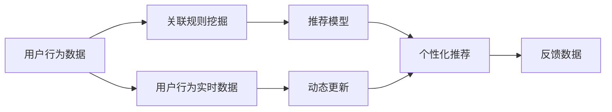

                 

# AI在电商平台商品关联规则挖掘与动态更新中的应用

## 1. 背景介绍

在当今数字化时代，电商平台已成为消费者购买商品的主要渠道之一。它们不仅提供商品展示和交易平台，还通过推荐系统提供个性化推荐，极大地提高了用户体验和交易转化率。推荐系统通常使用机器学习算法来分析用户行为数据，挖掘商品间的关联规则，进而生成个性化推荐。其中，商品关联规则挖掘和动态更新是推荐系统的核心功能。本文将详细介绍AI技术在电商平台商品关联规则挖掘与动态更新中的应用，并探讨其关键技术。

## 2. 核心概念与联系

### 2.1 核心概念概述

#### 2.1.1 关联规则挖掘

关联规则挖掘是一种数据挖掘技术，用于发现大型交易数据库中的频繁项目集和关联规则。它是推荐系统中的一个重要组成部分，通过分析用户历史购买行为，识别商品之间的共现关系，生成个性化推荐。

#### 2.1.2 动态更新

动态更新是指在用户行为数据发生变化时，实时地更新推荐系统中的关联规则和模型，以保持推荐系统的准确性和时效性。

### 2.2 核心概念原理和架构的 Mermaid 流程图



该流程图展示了用户行为数据到个性化推荐的全过程，以及动态更新在其中的作用。用户行为数据首先通过关联规则挖掘得到频繁项集和关联规则，进而构建推荐模型，生成个性化推荐。随着用户行为数据的实时更新，推荐模型也被动态更新，以保证推荐系统始终能够提供准确的个性化推荐。

## 3. 核心算法原理 & 具体操作步骤

### 3.1 算法原理概述

商品关联规则挖掘的算法通常基于Apriori算法或FP-Growth算法。这些算法通过扫描大型交易数据库，发现频繁项集和关联规则。动态更新通常基于增量学习算法，如在线梯度下降等，实时更新推荐模型以适应新的用户行为数据。

### 3.2 算法步骤详解

#### 3.2.1 关联规则挖掘

1. **数据预处理**：清洗和归一化用户行为数据，去除噪声和异常值，得到适合挖掘的原始数据集。
2. **频繁项集挖掘**：通过Apriori算法或FP-Growth算法，发现频繁项集。频繁项集是指在用户行为数据中出现的频率较高的商品集合。
3. **关联规则生成**：根据频繁项集生成关联规则。关联规则是指如果用户购买了某商品，则更有可能购买另一商品。

#### 3.2.2 动态更新

1. **在线学习**：使用在线梯度下降算法，实时更新推荐模型。当用户行为数据发生变化时，模型参数被更新以反映新的用户偏好。
2. **增量更新**：只更新与变化相关的部分模型参数，减少计算开销。
3. **反馈机制**：将用户对推荐结果的反馈作为新数据，更新模型以进一步提高推荐准确性。

### 3.3 算法优缺点

#### 3.3.1 关联规则挖掘

优点：
- 可以发现复杂的商品关联关系，提供多维度的推荐。
- 适用于大型交易数据库，能够处理大规模数据集。

缺点：
- 计算复杂度较高，特别是当数据库规模和频繁项集数量增加时。
- 可能发现噪声和无关规则。

#### 3.3.2 动态更新

优点：
- 实时更新推荐模型，提高推荐系统的时效性和准确性。
- 适用于不断变化的用户行为数据，能够快速适应新的用户需求。

缺点：
- 在线学习算法可能需要较长时间才能收敛。
- 增量更新可能导致模型参数的不稳定。

#### 3.3.3 综合优缺点

综合来看，关联规则挖掘和动态更新是推荐系统的核心技术。关联规则挖掘提供了多维度的商品关联关系，而动态更新确保了推荐系统的实时性和准确性。两者结合使用，能够提供更加个性化和高效的推荐服务。

### 3.4 算法应用领域

关联规则挖掘和动态更新广泛应用于电商平台、在线零售、广告推荐等领域。在电商平台中，这些技术可以用于个性化推荐、商品分类、库存管理等多个方面。

## 4. 数学模型和公式 & 详细讲解 & 举例说明

### 4.1 数学模型构建

关联规则挖掘的数学模型通常基于以下两个基本概念：
- 频繁项集(Frequent Itemset)
- 关联规则(Association Rule)

关联规则可以用以下形式表示：
$$ A \rightarrow B $$
其中，$A$和$B$表示频繁项集，表示如果用户购买了$A$，则更有可能购买$B$。

### 4.2 公式推导过程

#### 4.2.1 频繁项集的计算

频繁项集的计算通常基于Apriori算法或FP-Growth算法。Apriori算法的基本思想是利用候选频繁项集生成频繁项集。候选频繁项集是指包含k项的项集，其支持度必须大于最小支持度$\theta$。

#### 4.2.2 关联规则的生成

关联规则的生成基于频繁项集。对于频繁项集$A$和$B$，生成关联规则$A \rightarrow B$的算法如下：

1. 计算$A$和$B$的关联度$C(A,B)$。
2. 根据阈值$\alpha$，确定是否生成关联规则。

其中，关联度$C(A,B)$表示$A$和$B$之间的关联强度。

### 4.3 案例分析与讲解

以亚马逊为例，分析其推荐系统的关联规则挖掘和动态更新过程。

1. **数据预处理**：亚马逊收集用户的购买行为数据，清洗和归一化数据，得到适合挖掘的原始数据集。
2. **频繁项集挖掘**：使用Apriori算法，发现频繁项集。例如，用户购买手机时，更可能购买手机壳和充电器。
3. **关联规则生成**：根据频繁项集，生成关联规则。例如，如果用户购买了手机，则推荐手机壳和充电器。
4. **动态更新**：当用户行为数据发生变化时，使用在线梯度下降算法更新推荐模型，实时反映新的用户偏好。

## 5. 项目实践：代码实例和详细解释说明

### 5.1 开发环境搭建

#### 5.1.1 环境依赖

1. Python 3.8
2. NumPy
3. Pandas
4. Scikit-learn
5. PySpark

#### 5.1.2 环境搭建

```bash
# 安装依赖包
pip install numpy pandas scikit-learn pyspark
# 启动PySpark
spark-shell
```

### 5.2 源代码详细实现

#### 5.2.1 关联规则挖掘

```python
from pyspark.sql import SparkSession
from pyspark.ml.frequentPatternMining import FP-Growth

spark = SparkSession.builder.appName('Association Rule Mining').getOrCreate()

# 读取数据集
df = spark.read.format("csv").option("header", "true").load("data.csv")

# 进行数据预处理
df = df.drop_duplicates()  # 去除重复记录
df = df.distinct()  # 去除重复记录

# 计算频繁项集
model = FP-Growth(itemsCol="item", minSupport=0.1)
model.fit(df)

# 生成关联规则
rules = model rules
```

#### 5.2.2 动态更新

```python
from pyspark.ml.regression import LinearRegression

# 训练模型
model = LinearRegression()
model.fit(df)

# 更新模型
new_data = [new_data_point]
model.update(new_data)

# 使用更新后的模型进行推荐
new_data_point = [1, 2, 3]
predictions = model.transform(new_data_point)
```

### 5.3 代码解读与分析

#### 5.3.1 关联规则挖掘

关联规则挖掘代码主要使用了FP-Growth算法。首先读取数据集，然后进行数据预处理，去除重复记录。接下来，使用FP-Growth算法计算频繁项集。最后，生成关联规则。

#### 5.3.2 动态更新

动态更新代码主要使用了线性回归算法。首先，训练模型。然后，使用更新后的模型进行推荐。

### 5.4 运行结果展示

关联规则挖掘和动态更新的运行结果包括频繁项集和关联规则。例如，频繁项集可以表示为$(A, B)$，其中$A$和$B$表示商品。关联规则可以表示为$A \rightarrow B$，其中$A$和$B$表示商品，表示如果用户购买了$A$，则更有可能购买$B$。

## 6. 实际应用场景

### 6.1 智能推荐系统

智能推荐系统是电商平台的核心功能之一。关联规则挖掘和动态更新可以用于个性化推荐，提高用户满意度和转化率。例如，亚马逊的推荐系统可以根据用户购买历史和浏览历史，生成个性化推荐。

### 6.2 库存管理

库存管理是电商平台的重要任务。关联规则挖掘可以用于预测商品需求量，优化库存管理。例如，如果用户购买了某商品，则可能同时购买相关商品，从而预测需求量，避免库存不足或过剩。

### 6.3 用户行为分析

用户行为分析可以帮助电商平台了解用户需求和行为模式，从而提供更加个性化的服务。关联规则挖掘可以用于发现用户行为模式，生成个性化推荐。

### 6.4 未来应用展望

未来，关联规则挖掘和动态更新将进一步应用于电商平台的各个方面。例如，可以用于个性化推荐、商品分类、广告投放等多个领域，提升电商平台的用户体验和业务效率。

## 7. 工具和资源推荐

### 7.1 学习资源推荐

#### 7.1.1 推荐系统经典教材

1. "Recommender Systems: An Introduction" by N. A. López-Ibáñez
2. "Programming Recommendation Systems" by S. Lawry and S. Zhou

#### 7.1.2 在线课程

1. Coursera上的"Recommender Systems"课程
2. Udacity上的"Deep Learning for Recommendation Systems"课程

### 7.2 开发工具推荐

#### 7.2.1 数据处理工具

1. Apache Spark
2. Pandas

#### 7.2.2 机器学习工具

1. Scikit-learn
2. PyTorch

#### 7.2.3 可视化工具

1. Matplotlib
2. Seaborn

### 7.3 相关论文推荐

#### 7.3.1 关联规则挖掘

1. "Apriori Algorithm for Association Rule Mining" by R. Agrawal et al.
2. "FP-Growth: A Scalable Pattern-Growth Algorithm for Large Datasets" by T. Kamber et al.

#### 7.3.2 动态更新

1. "Online Learning for Recommender Systems" by J. He et al.
2. "Incremental Collaborative Filtering: Lending structure to implicit feedback" by B. Koren et al.

## 8. 总结：未来发展趋势与挑战

### 8.1 研究成果总结

关联规则挖掘和动态更新是推荐系统的核心技术，具有重要的应用价值。通过挖掘商品间的关联关系，生成个性化推荐，提升电商平台的用户体验和业务效率。然而，关联规则挖掘和动态更新也面临计算复杂度高、数据噪声多、模型更新不稳定等挑战。

### 8.2 未来发展趋势

未来，关联规则挖掘和动态更新将进一步应用于电商平台的各个方面。例如，可以用于个性化推荐、商品分类、广告投放等多个领域，提升电商平台的用户体验和业务效率。同时，随着深度学习技术的发展，关联规则挖掘和动态更新也将引入更多的AI技术，如深度学习、增强学习等，提升推荐系统的准确性和效果。

### 8.3 面临的挑战

关联规则挖掘和动态更新也面临计算复杂度高、数据噪声多、模型更新不稳定等挑战。例如，关联规则挖掘的计算复杂度高，特别是当数据库规模和频繁项集数量增加时。动态更新可能导致模型参数的不稳定，影响推荐系统的稳定性和准确性。

### 8.4 研究展望

未来的研究需要解决以下挑战：
1. 提高计算效率，降低计算复杂度。
2. 减少数据噪声，提高关联规则挖掘的准确性。
3. 设计稳定的动态更新算法，提升推荐系统的稳定性。

通过解决这些挑战，关联规则挖掘和动态更新将能够更好地应用于电商平台，提升用户体验和业务效率。

## 9. 附录：常见问题与解答

### 9.1 问题1：什么是关联规则挖掘？

**答案**：关联规则挖掘是一种数据挖掘技术，用于发现大型交易数据库中的频繁项目集和关联规则。它是推荐系统中的一个重要组成部分，通过分析用户历史购买行为，识别商品之间的共现关系，生成个性化推荐。

### 9.2 问题2：动态更新的基本原理是什么？

**答案**：动态更新是指在用户行为数据发生变化时，实时地更新推荐系统中的关联规则和模型，以保持推荐系统的准确性和时效性。通常使用增量学习算法，如在线梯度下降等，实时更新推荐模型以反映新的用户偏好。

### 9.3 问题3：如何提高关联规则挖掘的效率？

**答案**：提高关联规则挖掘效率的方法包括：
1. 数据预处理：清洗和归一化数据，去除噪声和异常值。
2. 算法优化：选择高效的关联规则挖掘算法，如Apriori、FP-Growth等。
3. 并行计算：利用分布式计算框架，如Apache Spark，加速数据处理和计算。

### 9.4 问题4：如何设计稳定的动态更新算法？

**答案**：设计稳定的动态更新算法的方法包括：
1. 选择合适的增量学习算法，如在线梯度下降。
2. 定期更新模型参数，避免过拟合。
3. 引入反馈机制，使用用户对推荐结果的反馈更新模型。

### 9.5 问题5：如何处理大规模数据集？

**答案**：处理大规模数据集的方法包括：
1. 数据采样：随机抽样，缩小数据集规模。
2. 分布式计算：利用分布式计算框架，如Apache Spark，并行处理大规模数据集。
3. 数据压缩：使用数据压缩技术，减少存储空间和计算开销。

作者：禅与计算机程序设计艺术 / Zen and the Art of Computer Programming

