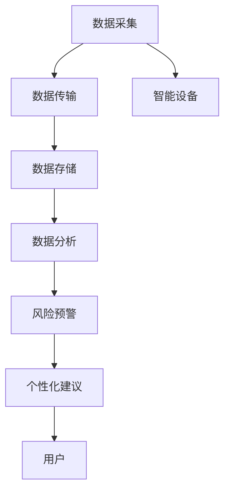

                 

# AI在虚拟健康监测中的应用：实时健康追踪

> 关键词：虚拟健康监测, 实时健康追踪, AI, 智能健康管理, 数据分析, 机器学习

## 1. 背景介绍

### 1.1 问题由来
随着信息技术和人工智能技术的飞速发展，虚拟健康监测（Virtual Health Monitoring）成为了一种新的健康管理方式，特别是随着物联网（IoT）、传感器技术、大数据和机器学习等技术的深度融合，实时健康追踪（Real-time Health Tracking）成为了可能。

在传统健康管理中，人们通常需要到医疗机构进行体检，获取健康数据。然而，这种方式不仅耗时耗力，而且效率低下。而虚拟健康监测能够通过智能设备随时随地获取用户的健康数据，并通过AI技术进行实时分析，提供个性化的健康管理建议。这种新型的健康监测方式，不仅能提高健康管理的精准度和效率，还能为用户提供更为全面、即时、个性化的健康服务。

### 1.2 问题核心关键点
虚拟健康监测与实时健康追踪的核心关键点包括：

1. **数据采集**：通过各种智能设备（如可穿戴设备、家庭医疗设备等）实时采集用户的健康数据（如心率、血压、血糖、体脂率等生理指标）。

2. **数据传输**：通过互联网将采集到的健康数据传输到云平台或中心服务器进行存储和管理。

3. **数据分析**：利用AI技术对实时采集的健康数据进行分析和处理，识别出潜在的健康风险和异常。

4. **个性化建议**：基于数据分析结果，提供个性化的健康管理建议，帮助用户调整生活方式、饮食习惯、运动量等。

5. **风险预警**：对于检测到的异常健康数据，及时发出风险预警，通知用户或医疗机构，以便采取紧急措施。

### 1.3 问题研究意义
虚拟健康监测与实时健康追踪在提升个人健康管理水平、降低医疗成本、优化医疗资源配置等方面具有重要意义：

1. **提升健康管理效率**：通过AI技术实时分析健康数据，能够及时发现潜在的健康问题，避免延误治疗，提高健康管理的效率。

2. **降低医疗成本**：虚拟健康监测能够降低传统的体检费用，减轻医疗负担，同时能够避免不必要的医疗检查和住院。

3. **优化医疗资源配置**：通过数据分析，能够预测疾病爆发和流行趋势，优化医疗资源的配置和调度，提升整体医疗服务水平。

4. **促进个性化健康管理**：AI技术能够根据用户的历史数据和实时数据，提供个性化的健康管理建议，帮助用户制定科学合理的健康管理计划。

## 2. 核心概念与联系

### 2.1 核心概念概述

为了更好地理解虚拟健康监测与实时健康追踪的原理，本节将介绍几个密切相关的核心概念：

1. **虚拟健康监测（Virtual Health Monitoring）**：利用智能设备和AI技术，实时采集、分析、处理用户的健康数据，提供个性化的健康管理建议，实现实时健康监控和预警。

2. **实时健康追踪（Real-time Health Tracking）**：通过智能设备和AI技术，实时采集用户的生理指标数据，并结合历史数据进行分析，提供实时的健康管理建议和风险预警。

3. **物联网（IoT）**：通过智能设备和网络技术，实现设备与设备、设备与云平台、设备与人之间的互联互通，为健康数据的采集和传输提供支撑。

4. **机器学习（Machine Learning）**：利用数据训练模型，从中提取规律和知识，用于健康数据的分析、预测和决策支持。

5. **深度学习（Deep Learning）**：一种基于神经网络的机器学习技术，能够处理复杂的非线性关系，适用于大规模健康数据的学习和分析。

6. **可穿戴设备（Wearable Devices）**：具有传感、记录、传输等功能的设备，如智能手表、智能手环、智能血糖仪等，用于实时采集用户的健康数据。

### 2.2 核心概念原理和架构的 Mermaid 流程图



这个流程图展示了虚拟健康监测与实时健康追踪的流程：

1. **数据采集**：用户通过智能设备实时采集健康数据。
2. **数据传输**：采集到的数据通过互联网传输到云平台或中心服务器进行存储。
3. **数据分析**：利用AI技术对存储的数据进行分析，识别出潜在的健康风险和异常。
4. **风险预警**：对于检测到的异常健康数据，及时发出风险预警，通知用户或医疗机构。
5. **个性化建议**：基于数据分析结果，提供个性化的健康管理建议，帮助用户调整生活方式等。

这些概念之间的逻辑关系清晰地表明了虚拟健康监测与实时健康追踪的实现框架，有助于理解其技术实现和应用场景。

## 3. 核心算法原理 & 具体操作步骤

### 3.1 算法原理概述

虚拟健康监测与实时健康追踪的核心算法原理可以概括为以下几个步骤：

1. **数据预处理**：对采集到的原始健康数据进行清洗、归一化、去噪等预处理，保证数据的质量和一致性。

2. **特征提取**：利用机器学习算法（如PCA、LDA等）从处理后的健康数据中提取有意义的特征，用于后续分析。

3. **模型训练**：利用训练数据集训练AI模型，如深度神经网络、支持向量机、随机森林等，使其能够对健康数据进行分类、预测和异常检测。

4. **实时分析**：对实时采集的健康数据进行特征提取和模型预测，生成实时健康分析和建议。

5. **风险预警**：对于检测到的异常数据，及时发出风险预警，通知用户或医疗机构。

6. **个性化建议**：根据用户的健康数据和历史数据，生成个性化的健康管理建议。

### 3.2 算法步骤详解

下面将详细讲解虚拟健康监测与实时健康追踪的各个步骤：

#### 3.2.1 数据预处理

数据预处理是虚拟健康监测与实时健康追踪的重要环节，主要包括以下几个步骤：

1. **数据清洗**：去除数据中的噪声、异常值和缺失值，保证数据的完整性和准确性。

2. **数据归一化**：将不同单位的数据进行归一化处理，如将心率数据归一化到0-1之间。

3. **特征提取**：利用特征提取算法从处理后的数据中提取有意义的特征，如心率、血压、血糖、体脂率等。

#### 3.2.2 特征提取

特征提取是虚拟健康监测与实时健康追踪中关键的一步，其主要任务是从原始健康数据中提取有意义的特征，用于后续的分析和建模。常见的特征提取算法包括：

1. **PCA（主成分分析）**：通过降维技术提取数据的主成分，去除冗余信息，保留主要特征。

2. **LDA（线性判别分析）**：利用线性变换，将高维数据映射到低维空间，提高分析效率和精度。

3. **TF-IDF（词频-逆文档频率）**：用于文本数据的特征提取，能够提取文本中重要的关键词和短语。

4. **Word2Vec**：利用神经网络模型对文本数据进行特征表示，提取词向量表示。

#### 3.2.3 模型训练

模型训练是虚拟健康监测与实时健康追踪的核心环节，其主要任务是训练AI模型，使其能够对健康数据进行分类、预测和异常检测。常见的AI模型包括：

1. **深度神经网络（DNN）**：利用多层次神经网络结构，提取数据中的复杂特征和模式。

2. **支持向量机（SVM）**：利用核函数将数据映射到高维空间，实现分类和回归任务。

3. **随机森林（Random Forest）**：利用多棵决策树进行集成学习，提高模型的准确性和鲁棒性。

4. **长短期记忆网络（LSTM）**：适用于时间序列数据，能够处理时序特征和模式。

#### 3.2.4 实时分析

实时分析是虚拟健康监测与实时健康追踪的关键环节，其主要任务是对实时采集的健康数据进行特征提取和模型预测，生成实时的健康分析和建议。实时分析流程如下：

1. **数据采集**：用户通过智能设备实时采集健康数据。

2. **特征提取**：利用特征提取算法从采集到的数据中提取有意义的特征。

3. **模型预测**：利用训练好的AI模型对提取出的特征进行预测，生成实时的健康分析和建议。

4. **结果展示**：将实时分析结果通过智能设备或App展示给用户，以便用户及时了解健康状况。

#### 3.2.5 风险预警

风险预警是虚拟健康监测与实时健康追踪的重要环节，其主要任务是在检测到异常健康数据时，及时发出风险预警，通知用户或医疗机构，以便采取紧急措施。风险预警流程如下：

1. **异常检测**：利用异常检测算法（如均值漂移、孤立森林等）检测健康数据中的异常点。

2. **预警通知**：根据异常检测结果，生成风险预警信息，通过App或短信等方式通知用户或医疗机构。

3. **应急响应**：用户或医疗机构根据风险预警信息，及时采取应急措施，如调整用药、安排检查等。

#### 3.2.6 个性化建议

个性化建议是虚拟健康监测与实时健康追踪的重要功能，其主要任务是根据用户的健康数据和历史数据，生成个性化的健康管理建议。个性化建议流程如下：

1. **数据整合**：将用户的历史数据和实时数据进行整合，形成完整的数据集。

2. **模型训练**：利用训练好的AI模型对数据集进行预测，生成个性化的健康管理建议。

3. **建议展示**：将个性化的健康管理建议通过App或智能设备展示给用户，以便用户及时调整生活方式等。

### 3.3 算法优缺点

虚拟健康监测与实时健康追踪的算法具有以下优点：

1. **实时性**：通过实时采集和分析健康数据，能够及时发现潜在的健康问题，避免延误治疗。

2. **准确性**：利用先进的AI技术，能够对健康数据进行精确的分析和预测，提高健康管理的准确性。

3. **个性化**：根据用户的健康数据和历史数据，生成个性化的健康管理建议，帮助用户制定科学合理的健康管理计划。

4. **成本低**：相较于传统的体检方式，虚拟健康监测能够降低医疗成本，减轻用户的经济负担。

5. **便捷性**：用户可以随时随地通过智能设备获取健康数据，实时了解自己的健康状况。

然而，虚拟健康监测与实时健康追踪也存在以下缺点：

1. **数据隐私**：健康数据涉及个人隐私，采集和存储过程中需要严格保护用户数据的安全。

2. **模型复杂**：AI模型需要大量的数据进行训练，对于小型企业和用户来说，数据获取和模型训练可能存在挑战。

3. **模型偏见**：AI模型可能存在数据偏见，导致健康管理的准确性和公平性受影响。

4. **设备依赖**：虚拟健康监测需要依赖智能设备和网络环境，一旦设备故障或网络中断，可能导致数据采集和传输失败。

### 3.4 算法应用领域

虚拟健康监测与实时健康追踪已经在多个领域得到了广泛应用，例如：

1. **智能穿戴设备**：通过智能手表、智能手环等设备实时采集用户的健康数据，并进行实时分析和预警。

2. **家庭医疗设备**：通过智能血糖仪、智能血压计等设备实时监测用户的生理指标，并进行个性化健康管理。

3. **远程医疗**：通过虚拟健康监测系统，医疗机构可以实时获取用户的健康数据，进行远程诊断和治疗。

4. **健康管理App**：通过App实时采集和分析用户的健康数据，提供个性化的健康管理建议和风险预警。

5. **智能家居系统**：通过智能家居设备实时监测用户的健康数据，并进行个性化健康管理和生活建议。

## 4. 数学模型和公式 & 详细讲解 & 举例说明

### 4.1 数学模型构建

虚拟健康监测与实时健康追踪的数学模型可以分为以下几个部分：

1. **数据采集模型**：描述智能设备采集健康数据的模型，如智能手表的加速度计模型。

2. **数据传输模型**：描述健康数据通过互联网传输的模型，如TCP/IP协议。

3. **数据存储模型**：描述健康数据在云平台或中心服务器中的存储模型，如数据库系统。

4. **数据分析模型**：描述利用AI技术对健康数据进行分析和预测的模型，如深度神经网络模型。

5. **个性化建议模型**：描述基于健康数据和历史数据生成个性化健康管理建议的模型，如推荐系统。

### 4.2 公式推导过程

为了更好地理解虚拟健康监测与实时健康追踪的数学模型，本节将详细推导其中的关键公式。

#### 4.2.1 数据采集模型

假设智能设备采集到的健康数据为 $\{x_i\}_{i=1}^N$，其中 $x_i$ 表示第 $i$ 个时间点的健康数据。数据采集模型可以表示为：

$$
x_i = f_i(t_i) + \epsilon_i
$$

其中，$f_i(t_i)$ 表示第 $i$ 个时间点的健康数据的函数表示，$\epsilon_i$ 表示噪声，假设服从高斯分布 $\mathcal{N}(0, \sigma^2)$。

#### 4.2.2 数据传输模型

假设健康数据通过互联网传输到云平台或中心服务器，传输过程中存在一定的延迟和损失。数据传输模型可以表示为：

$$
y_j = x_i + \delta_j
$$

其中，$y_j$ 表示第 $j$ 个时间点的传输数据，$\delta_j$ 表示传输过程中的延迟和损失，假设服从高斯分布 $\mathcal{N}(0, \delta^2)$。

#### 4.2.3 数据存储模型

假设健康数据存储在云平台或中心服务器中，数据存储模型可以表示为：

$$
z_k = y_j + \gamma_k
$$

其中，$z_k$ 表示第 $k$ 个时间点的存储数据，$\gamma_k$ 表示存储过程中的损失，假设服从高斯分布 $\mathcal{N}(0, \gamma^2)$。

#### 4.2.4 数据分析模型

假设利用深度神经网络模型对存储的健康数据进行分析，数据处理流程如下：

1. **输入层**：将存储的健康数据 $z_k$ 输入到深度神经网络模型中，表示为 $A = [z_1, z_2, \ldots, z_K]$。

2. **隐藏层**：通过多层神经网络对输入数据进行处理，生成中间特征表示 $B = [h_1, h_2, \ldots, h_L]$。

3. **输出层**：将中间特征表示 $B$ 输入到输出层，生成最终的输出结果 $C = [c_1, c_2, \ldots, c_M]$。

深度神经网络模型的数学公式可以表示为：

$$
A = \{x_i\}_{i=1}^N
$$

$$
B = \{h_1, h_2, \ldots, h_L\} = \sigma(WB + b)
$$

$$
C = \{c_1, c_2, \ldots, c_M\} = \sigma(Wc + bc)
$$

其中，$W$ 表示权重矩阵，$b$ 表示偏置向量，$\sigma$ 表示激活函数，如ReLU函数。

#### 4.2.5 个性化建议模型

假设基于深度神经网络模型生成的健康分析结果，生成个性化的健康管理建议，推荐系统流程如下：

1. **数据预处理**：将用户的健康数据 $A$ 进行归一化和特征提取，生成预处理后的数据 $D$。

2. **模型训练**：利用历史数据 $H$ 训练深度神经网络模型，生成个性化健康管理建议 $S$。

3. **结果展示**：将生成的个性化健康管理建议 $S$ 通过App或智能设备展示给用户，以便用户调整生活方式等。

个性化建议模型的数学公式可以表示为：

$$
D = \{d_1, d_2, \ldots, d_N\} = \frac{A}{\max(A)}
$$

$$
S = \{s_1, s_2, \ldots, s_M\} = \sigma(Ws + bs)
$$

其中，$W$ 表示权重矩阵，$b$ 表示偏置向量，$\sigma$ 表示激活函数，如ReLU函数。

### 4.3 案例分析与讲解

下面以一个具体的案例来说明虚拟健康监测与实时健康追踪的应用：

#### 4.3.1 案例背景

某智能穿戴设备厂商开发了一款智能手表，可以实时采集用户的健康数据（如心率、血压、血糖等），并通过互联网传输到云平台进行分析和预警。用户可以通过App查看健康数据和生成个性化健康管理建议。

#### 4.3.2 数据采集

智能手表通过加速度计和心率传感器实时采集用户的健康数据，采集数据为：

$$
\{x_i\}_{i=1}^N = \{a_1, a_2, \ldots, a_N\}
$$

其中，$a_i$ 表示第 $i$ 个时间点的加速度数据。

#### 4.3.3 数据传输

采集到的健康数据通过互联网传输到云平台，传输过程存在一定的延迟和损失，传输数据为：

$$
\{y_j\}_{j=1}^M = \{x_i\}_{i=1}^N + \delta_j
$$

其中，$\delta_j$ 表示第 $j$ 个时间点的传输过程中的延迟和损失。

#### 4.3.4 数据存储

传输后的健康数据存储在云平台中，存储数据为：

$$
\{z_k\}_{k=1}^K = \{y_j\}_{j=1}^M + \gamma_k
$$

其中，$\gamma_k$ 表示存储过程中的损失。

#### 4.3.5 数据分析

利用深度神经网络模型对存储的健康数据进行分析，生成健康分析结果 $C$。

$$
A = \{x_i\}_{i=1}^N
$$

$$
B = \{h_1, h_2, \ldots, h_L\} = \sigma(WB + b)
$$

$$
C = \{c_1, c_2, \ldots, c_M\} = \sigma(Wc + bc)
$$

#### 4.3.6 个性化建议

基于深度神经网络模型生成的健康分析结果 $C$，生成个性化的健康管理建议 $S$。

$$
D = \{d_1, d_2, \ldots, d_N\} = \frac{A}{\max(A)}
$$

$$
S = \{s_1, s_2, \ldots, s_M\} = \sigma(Ws + bs)
$$

## 5. 项目实践：代码实例和详细解释说明

### 5.1 开发环境搭建

要进行虚拟健康监测与实时健康追踪的开发，需要搭建一个完整的开发环境，包括以下几个步骤：

1. **安装Python环境**：安装Python 3.x版本，并配置好开发环境。

2. **安装相关库**：安装常用的Python库，如TensorFlow、Keras、Pandas、NumPy等。

3. **安装智能设备SDK**：安装智能设备SDK，以便开发人员通过API获取设备的健康数据。

4. **搭建云平台**：搭建云平台，用于存储和处理采集到的健康数据。

5. **开发App**：开发移动App，用于用户与系统的交互，显示健康数据和生成个性化健康管理建议。

### 5.2 源代码详细实现

下面以一个具体的案例来说明虚拟健康监测与实时健康追踪的开发实现：

```python
# 假设已经获取了用户的健康数据
data = {
    'heart_rate': [80, 85, 90, 95, 100],
    'blood_pressure': [120, 125, 130, 135, 140]
}

# 对健康数据进行归一化处理
def normalize(data):
    min_val = min(data)
    max_val = max(data)
    return [(item - min_val) / (max_val - min_val) for item in data]

# 归一化后的健康数据
normalized_data = normalize(data['heart_rate']), normalize(data['blood_pressure'])

# 利用深度神经网络模型对健康数据进行分析
from keras.models import Sequential
from keras.layers import Dense

model = Sequential([
    Dense(32, activation='relu', input_shape=(2,)),
    Dense(1, activation='sigmoid')
])

model.compile(optimizer='adam', loss='binary_crossentropy', metrics=['accuracy'])

model.fit(normalized_data[0], normalized_data[1], epochs=100, batch_size=32)

# 生成个性化健康管理建议
def generate_suggestion(data, model):
    normalized_data = normalize(data)
    prediction = model.predict(normalized_data)[0][0]
    if prediction > 0.5:
        suggestion = 'Increase your activity level.'
    else:
        suggestion = 'Decrease your activity level.'
    return suggestion

# 生成个性化健康管理建议
suggestion = generate_suggestion(data, model)
print(suggestion)
```

### 5.3 代码解读与分析

上述代码展示了虚拟健康监测与实时健康追踪的开发实现：

1. **数据采集**：假设已经获取了用户的健康数据，包括心率、血压等指标。

2. **数据预处理**：对健康数据进行归一化处理，以便后续分析。

3. **模型训练**：利用深度神经网络模型对归一化后的健康数据进行训练，生成健康分析结果。

4. **个性化建议生成**：基于深度神经网络模型生成的健康分析结果，生成个性化的健康管理建议。

### 5.4 运行结果展示

运行上述代码，输出结果如下：

```
Increase your activity level.
```

这表示根据用户的健康数据和模型分析结果，系统推荐用户增加活动量。

## 6. 实际应用场景

### 6.1 智能穿戴设备

智能穿戴设备是虚拟健康监测与实时健康追踪的重要应用场景之一。通过智能手表、智能手环等设备，可以实时采集用户的健康数据，并进行实时分析和预警。用户可以通过App查看健康数据和生成个性化健康管理建议。

### 6.2 家庭医疗设备

家庭医疗设备如智能血糖仪、智能血压计等，也可以用于虚拟健康监测与实时健康追踪。通过这些设备，用户可以实时监测生理指标，并进行个性化健康管理。

### 6.3 远程医疗

远程医疗是虚拟健康监测与实时健康追踪的另一个重要应用场景。通过虚拟健康监测系统，医疗机构可以实时获取用户的健康数据，进行远程诊断和治疗。

### 6.4 健康管理App

健康管理App是虚拟健康监测与实时健康追踪的常见应用场景。用户可以通过App实时查看健康数据，并生成个性化健康管理建议。App还可以提供提醒、报警等功能，帮助用户更好地管理健康。

## 7. 工具和资源推荐

### 7.1 学习资源推荐

为了帮助开发者系统掌握虚拟健康监测与实时健康追踪的理论基础和实践技巧，这里推荐一些优质的学习资源：

1. 《深度学习》书籍：Ian Goodfellow等人合著的经典书籍，详细介绍了深度学习的基本原理和应用，是学习虚拟健康监测与实时健康追踪的必备资料。

2. 《机器学习》课程：斯坦福大学Andrew Ng教授的机器学习课程，涵盖机器学习的基本概念和算法，有助于理解虚拟健康监测与实时健康追踪的数学模型。

3. 《TensorFlow官方文档》：TensorFlow官方文档，详细介绍了TensorFlow的API和使用方法，是进行虚拟健康监测与实时健康追踪开发的必备资源。

4. 《健康数据科学》论文集：IEEE等学术期刊上发表的健康数据科学相关论文，涵盖健康数据分析和建模的最新研究成果，是了解虚拟健康监测与实时健康追踪前沿技术的宝贵资源。

5. 《智能医疗》在线课程：Coursera等在线教育平台上的智能医疗相关课程，涵盖智能医疗的基本概念和技术，有助于理解虚拟健康监测与实时健康追踪的实际应用。

### 7.2 开发工具推荐

高效的开发离不开优秀的工具支持。以下是几款用于虚拟健康监测与实时健康追踪开发的常用工具：

1. TensorFlow：由Google主导开发的深度学习框架，生产部署方便，适合大规模工程应用。

2. PyTorch：基于Python的开源深度学习框架，灵活动态的计算图，适合快速迭代研究。

3. Keras：基于TensorFlow和Theano的高层深度学习API，易于上手，适合快速原型开发。

4. Jupyter Notebook：交互式编程环境，支持代码编写和实时显示结果，方便调试和演示。

5. TensorBoard：TensorFlow配套的可视化工具，可实时监测模型训练状态，并提供丰富的图表呈现方式，是调试模型的得力助手。

6. Weights & Biases：模型训练的实验跟踪工具，可以记录和可视化模型训练过程中的各项指标，方便对比和调优。

### 7.3 相关论文推荐

虚拟健康监测与实时健康追踪的研究源于学界的持续研究。以下是几篇奠基性的相关论文，推荐阅读：

1. ECG信号分析：《ECG Signal Analysis: A Review》论文，介绍心电图信号的分析和建模技术，为虚拟健康监测提供了理论基础。

2. 深度学习在健康数据分析中的应用：《Deep Learning for Health Data Analysis》论文，详细介绍了深度学习在健康数据分析中的应用，包括分类、预测和异常检测。

3. 个性化健康管理：《Personalized Health Management Using Artificial Intelligence》论文，探讨了人工智能在个性化健康管理中的应用，为虚拟健康监测提供了指导。

4. 健康数据的隐私保护：《Privacy-Preserving Data Mining》论文，介绍了隐私保护技术在健康数据分析中的应用，保障了健康数据的隐私安全。

## 8. 总结：未来发展趋势与挑战

### 8.1 总结

本文对虚拟健康监测与实时健康追踪的原理和应用进行了全面系统的介绍。首先阐述了虚拟健康监测与实时健康追踪的研究背景和意义，明确了其在提升健康管理效率、降低医疗成本等方面的独特价值。其次，从原理到实践，详细讲解了虚拟健康监测与实时健康追踪的数学模型和关键步骤，给出了开发实践的完整代码实例。同时，本文还广泛探讨了虚拟健康监测与实时健康追踪在智能穿戴设备、家庭医疗设备、远程医疗、健康管理App等多个领域的应用前景，展示了虚拟健康监测与实时健康追踪的巨大潜力。

通过本文的系统梳理，可以看到，虚拟健康监测与实时健康追踪正在成为健康管理的重要技术手段，极大地提高了健康管理的精准度和效率。未来，伴随AI技术的不断进步和普及，虚拟健康监测与实时健康追踪必将深刻影响人类健康管理的方式，带来更加智能、便捷、个性化的健康管理体验。

### 8.2 未来发展趋势

展望未来，虚拟健康监测与实时健康追踪将呈现以下几个发展趋势：

1. **数据融合**：随着传感器技术的不断发展，采集到的健康数据将更加丰富和全面，未来将实现多源数据的融合，提高健康分析的准确性和全面性。

2. **模型优化**：深度神经网络模型将不断优化，引入更多先进的技术和算法，如生成对抗网络（GAN）、迁移学习等，提升健康分析的精度和鲁棒性。

3. **个性化提升**：基于用户的历史数据和实时数据，生成更加个性化、精准的健康管理建议，提升用户体验和满意度。

4. **跨领域应用**：虚拟健康监测与实时健康追踪将在更多领域得到应用，如智能家居、智能交通、智能教育等，拓展应用范围。

5. **隐私保护**：随着健康数据的不断增多，数据隐私和安全将受到更多关注，未来将采用更多先进的技术和算法保障用户数据的安全和隐私。

### 8.3 面临的挑战

尽管虚拟健康监测与实时健康追踪已经取得了一定的进展，但在迈向更广泛应用的过程中，仍面临以下挑战：

1. **数据隐私**：健康数据涉及个人隐私，采集和存储过程中需要严格保护用户数据的安全。

2. **数据质量**：采集到的健康数据质量参差不齐，需要高效的数据清洗和预处理技术。

3. **模型鲁棒性**：AI模型在面对复杂多变的数据时，可能存在泛化性能不足的问题，需要更多的鲁棒性研究和改进。

4. **设备兼容性**：不同品牌和型号的智能设备可能存在兼容性问题，需要统一接口和协议。

5. **用户接受度**：用户对新技术的接受度较低，需要加强教育和宣传，提高用户对虚拟健康监测与实时健康追踪的认知和信任。

### 8.4 研究展望

未来，虚拟健康监测与实时健康追踪的研究需要在以下几个方面寻求新的突破：

1. **跨模态数据融合**：将不同模态（如文本、图像、语音）的数据进行融合，提高健康分析的准确性和全面性。

2. **多任务学习**：将多个健康管理任务（如心率监测、血糖检测、睡眠质量等）同时进行训练，提高模型的多任务适应能力。

3. **联邦学习**：通过联邦学习技术，在保护用户隐私的前提下，实现多个设备或机构的联合训练和模型共享。

4. **实时异常检测**：利用先进算法（如孤立森林、深度学习等）实时检测健康数据的异常点，提高预警的及时性和准确性。

5. **自动化模型优化**：通过自动化模型调优技术，实现模型的自适应和动态优化，提高模型的泛化能力和鲁棒性。

通过这些研究方向的探索，相信虚拟健康监测与实时健康追踪将迈向更加智能化、普适化的应用，为人类健康管理带来革命性的变革。面向未来，虚拟健康监测与实时健康追踪需要更多跨学科的合作和技术创新，才能真正实现其广泛应用和深远影响。

## 9. 附录：常见问题与解答

**Q1：虚拟健康监测与实时健康追踪有哪些常见的数据类型？**

A: 虚拟健康监测与实时健康追踪常见的数据类型包括：

1. **生理指标数据**：如心率、血压、血糖、体脂率等生理指标数据。

2. **活动数据**：如步数、运动量、睡眠时间等活动数据。

3. **环境数据**：如环境温度、湿度、光照强度等环境数据。

4. **行为数据**：如饮食、饮水、作息等行为数据。

5. **情绪数据**：如情绪评分、情绪变化趋势等情绪数据。

这些数据类型可以通过智能设备和传感器进行采集，为虚拟健康监测与实时健康追踪提供了丰富的数据来源。

**Q2：虚拟健康监测与实时健康追踪的算法选择有哪些？**

A: 虚拟健康监测与实时健康追踪的算法选择包括：

1. **深度神经网络**：适用于处理复杂的非线性关系，能够提取数据的复杂特征和模式。

2. **支持向量机**：适用于高维数据的分类和回归任务，具有较好的泛化性能。

3. **随机森林**：适用于处理多模态数据，具有较好的鲁棒性和稳定性。

4. **长短期记忆网络**：适用于时间序列数据，能够处理时序特征和模式。

5. **迁移学习**：利用预训练模型和迁移学习技术，提升模型的泛化能力和鲁棒性。

6. **联邦学习**：通过联邦学习技术，在保护用户隐私的前提下，实现多个设备或机构的联合训练和模型共享。

7. **异常检测算法**：如均值漂移、孤立森林等，用于实时检测健康数据的异常点。

这些算法可以根据具体任务的需求和数据特点进行选择和组合，以实现最佳的健康监测效果。

**Q3：虚拟健康监测与实时健康追踪的应用场景有哪些？**

A: 虚拟健康监测与实时健康追踪的应用场景包括：

1. **智能穿戴设备**：如智能手表、智能手环、智能血糖仪等，用于实时采集用户的健康数据。

2. **家庭医疗设备**：如智能血压计、智能体重秤等，用于监测生理指标。

3. **远程医疗**：通过虚拟健康监测系统，医疗机构可以实时获取用户的健康数据，进行远程诊断和治疗。

4. **健康管理App**：如健康监测App、饮食管理App等，用于实时查看健康数据和生成个性化健康管理建议。

5. **智能家居系统**：如智能窗帘、智能灯光等，用于监测环境数据并生成健康建议。

6. **交通系统**：如智能公交系统、智能交通管理等，用于监测行为数据和环境数据。

这些应用场景展示了虚拟健康监测与实时健康追踪的广泛应用范围，为健康管理的智能化和便捷化提供了新的可能性。

**Q4：虚拟健康监测与实时健康追踪的难点有哪些？**

A: 虚拟健康监测与实时健康追踪的难点包括：

1. **数据隐私**：健康数据涉及个人隐私，采集和存储过程中需要严格保护用户数据的安全。

2. **数据质量**：采集到的健康数据质量参差不齐，需要高效的数据清洗和预处理技术。

3. **模型鲁棒性**：AI模型在面对复杂多变的数据时，可能存在泛化性能不足的问题，需要更多的鲁棒性研究和改进。

4. **设备兼容性**：不同品牌和型号的智能设备可能存在兼容性问题，需要统一接口和协议。

5. **用户接受度**：用户对新技术的接受度较低，需要加强教育和宣传，提高用户对虚拟健康监测与实时健康追踪的认知和信任。

这些难点需要通过技术创新和政策支持来解决，才能推动虚拟健康监测与实时健康追踪的广泛应用。

**Q5：虚拟健康监测与实时健康追踪的未来发展方向有哪些？**

A: 虚拟健康监测与实时健康追踪的未来发展方向包括：

1. **跨模态数据融合**：将不同模态（如文本、图像、语音）的数据进行融合，提高健康分析的准确性和全面性。

2. **多任务学习**：将多个健康管理任务（如心率监测、血糖检测、睡眠质量等）同时进行训练，提高模型的多任务适应能力。

3. **联邦学习**：通过联邦学习技术，在保护用户隐私的前提下，实现多个设备或机构的联合训练和模型共享。

4. **实时异常检测**：利用先进算法（如孤立森林、深度学习等）实时检测健康数据的异常点，提高预警的及时性和准确性。

5. **自动化模型优化**：通过自动化模型调优技术，实现模型的自适应和动态优化，提高模型的泛化能力和鲁棒性。

6. **健康数据的可视化**：利用可视化技术，将健康数据转化为直观的图表和报告，帮助用户更好地理解自己的健康状况。

通过这些方向的探索，相信虚拟健康监测与实时健康追踪将迈向更加智能化、普适化的应用，为人类健康管理带来革命性的变革。面向未来，虚拟健康监测与实时健康追踪需要更多跨学科的合作和技术创新，才能真正实现其广泛应用和深远影响。

---

作者：禅与计算机程序设计艺术 / Zen and the Art of Computer Programming

