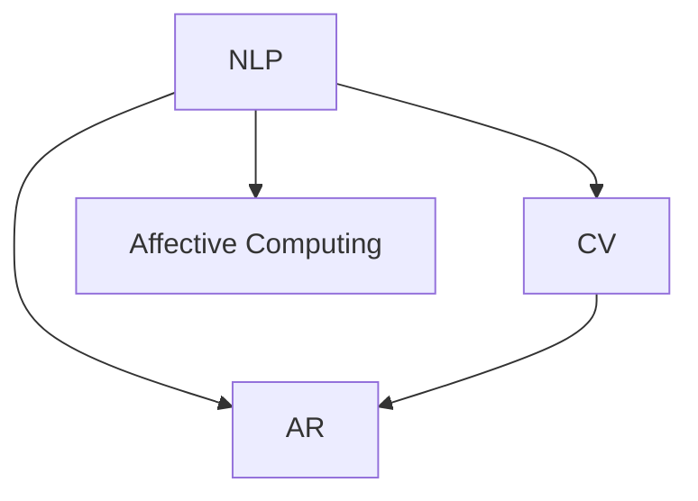

                 

# AI在虚拟角色扮演中的应用：增强游戏体验

> 关键词：人工智能,虚拟角色扮演,游戏体验,自然语言处理,计算机视觉,情感计算,增强现实

## 1. 背景介绍

### 1.1 问题由来
虚拟角色扮演游戏（Role-Playing Games, RPGs）是电子游戏的重要分支，因其丰富的故事情节、沉浸式体验和高度互动性，广受玩家喜爱。然而，传统的RPG游戏存在角色动作僵硬、对话生硬、情感交互不足等缺点，难以满足现代玩家对于高度个性化的游戏体验需求。为了解决这些问题，AI技术逐渐被引入到游戏开发中，通过自然语言处理（Natural Language Processing, NLP）、计算机视觉（Computer Vision, CV）、情感计算（Affective Computing）和增强现实（Augmented Reality, AR）等技术，对游戏角色进行智能增强，提供更加自然、逼真的游戏体验。

### 1.2 问题核心关键点
AI在RPG游戏中的主要应用领域包括：
- 自然语言对话：使游戏角色能够与玩家进行流畅的语音和文字对话，提升互动性。
- 计算机视觉：通过图像识别技术，实现角色动作和环境的动态反应，增强沉浸感。
- 情感计算：根据玩家情绪变化，动态调整角色行为和游戏内容，实现情感共鸣。
- 增强现实：将虚拟角色与现实环境结合，提供全新的游戏体验。

这些核心技术在RPG游戏中的综合应用，使得玩家能够与虚拟角色进行高度个性化的互动，游戏体验得以显著提升。

## 2. 核心概念与联系

### 2.1 核心概念概述

为了更好地理解AI在RPG游戏中的应用，本节将介绍几个密切相关的核心概念：

- 自然语言处理（NLP）：旨在使计算机能够理解、解释和生成人类语言的技术。在RPG游戏中，NLP技术用于实现角色对话和自然语言交互。

- 计算机视觉（CV）：涉及图像识别、目标检测、图像生成等技术，用于游戏角色的动作捕捉、环境识别和交互。

- 情感计算（Affective Computing）：研究如何通过计算技术识别、表达和引导人类情感的技术。在RPG游戏中，情感计算用于角色情绪的感知和响应，提升情感共鸣。

- 增强现实（AR）：通过计算机生成的虚拟信息与现实环境相结合，提供更丰富的互动体验。在RPG游戏中，AR技术用于角色与环境的互动和任务提示。

这些核心概念之间的逻辑关系可以通过以下Mermaid流程图来展示：



这个流程图展示了一个典型的RPG游戏场景，其中NLP、CV、Affective Computing和AR技术相互配合，共同构建了高度互动和沉浸的游戏体验。

## 3. 核心算法原理 & 具体操作步骤
### 3.1 算法原理概述

AI在RPG游戏中的应用主要围绕自然语言处理、计算机视觉、情感计算和增强现实四大技术展开。以下是这些核心技术的原理概述：

- 自然语言处理（NLP）：通过语义理解、情感分析和对话生成等技术，使角色能够与玩家进行流畅的对话。NLP技术通常包括文本预处理、语言模型训练、序列到序列（Seq2Seq）模型、注意力机制等。

- 计算机视觉（CV）：通过图像识别和动作捕捉技术，使角色能够根据玩家的操作动态调整动作和反应。CV技术通常包括卷积神经网络（CNN）、目标检测（如YOLO）、姿态估计等。

- 情感计算（Affective Computing）：通过面部表情识别、语音情感分析等技术，捕捉玩家的情绪变化，并动态调整角色的行为和对话。Affective Computing技术通常包括表情识别、语音识别、情绪分类等。

- 增强现实（AR）：通过AR技术，将虚拟角色和场景与现实环境融合，提供更丰富的互动体验。AR技术通常包括空间定位、图像融合、虚拟物体渲染等。

### 3.2 算法步骤详解

以下是AI在RPG游戏中各技术的具体操作步骤：

#### NLP技术
1. **数据准备**：收集并标注游戏对话数据，包括玩家和角色之间的对话记录、角色自言自语等。

2. **模型训练**：使用大规模语料库训练语言模型，如BERT、GPT等，用于生成自然流畅的对话。

3. **对话生成**：在玩家与角色对话时，使用预训练的语言模型生成角色回复。

4. **情感分析**：通过情感分析技术，识别玩家的情绪，动态调整角色的对话风格和内容。

#### CV技术
1. **数据准备**：收集并标注游戏角色的动作数据，包括角色跳跃、行走、攻击等动作。

2. **模型训练**：使用CNN等神经网络训练动作识别模型，用于实时识别玩家的操作。

3. **动作捕捉**：根据玩家的操作数据，实时调整角色的动作和姿态。

4. **交互检测**：使用目标检测等技术，检测玩家和角色之间的交互，如击中、攻击等。

#### Affective Computing技术
1. **数据准备**：收集并标注玩家的语音、面部表情等数据，用于情绪识别。

2. **模型训练**：使用深度学习模型训练情绪分类器，用于实时识别玩家的情绪。

3. **情感响应**：根据情绪分类结果，动态调整角色的行为和对话内容。

#### AR技术
1. **数据准备**：收集并标注虚拟角色和现实环境的空间位置数据。

2. **模型训练**：使用空间定位和图像融合技术，训练AR模型，用于虚拟物体与现实环境的融合。

3. **虚拟物体渲染**：根据玩家的位置和行为，动态渲染虚拟物体，并将其叠加在现实环境中。

4. **任务提示**：使用AR技术，为玩家提供任务提示和导航信息。

### 3.3 算法优缺点

AI在RPG游戏中的应用具有以下优点：
1. 提升游戏体验：通过自然语言处理、计算机视觉、情感计算和增强现实等技术，使游戏角色更具人性化和互动性。
2. 降低开发成本：AI技术可减少游戏中的动画和交互逻辑开发工作量，缩短开发周期。
3. 增强沉浸感：AR技术将虚拟角色与现实环境结合，提供更丰富的游戏体验。

同时，该技术也存在一些局限性：
1. 技术复杂度高：AI技术在RPG游戏中的应用需要多领域的综合知识，开发和调试难度较大。
2. 数据需求量大：需要大量标注数据进行模型训练和优化，数据获取和标注成本较高。
3. 性能要求高：AI技术的实时应用需要高性能的硬件支持，如GPU、TPU等。

尽管存在这些局限性，但AI在RPG游戏中的应用已经带来了显著的变化，极大地提升了游戏体验和互动性。未来，随着技术的发展和算力的提升，这些局限性有望得到进一步缓解。

### 3.4 算法应用领域

AI技术在RPG游戏中的应用已经覆盖了从对话、动作捕捉到情绪识别和AR交互等多个领域，具体应用包括：

- **自然语言对话**：使游戏角色能够与玩家进行语音和文字对话，提升互动性。
- **动作捕捉和交互**：实现角色动作的动态捕捉和玩家操作的实时反馈，增强沉浸感。
- **情感识别和响应**：通过面部表情和语音情感识别，动态调整角色行为和对话内容，提升情感共鸣。
- **增强现实**：将虚拟角色和场景与现实环境结合，提供更丰富的互动体验。

除了这些传统应用外，AI技术还不断拓展到游戏AI生成、智能任务设计、情感驱动的故事情节生成等创新方向，为RPG游戏带来了新的发展动力。

## 4. 数学模型和公式 & 详细讲解 & 举例说明
### 4.1 数学模型构建

本节将使用数学语言对AI在RPG游戏中的应用进行更加严格的刻画。

假设RPG游戏中有角色 $R$ 和玩家 $P$，角色 $R$ 的行为由模型 $f_R$ 表示，玩家 $P$ 的行为由模型 $f_P$ 表示。在对话场景中，角色和玩家的行为可以表示为序列 $S=\{s_t\}$，其中 $s_t$ 为第 $t$ 轮对话。

### 4.2 公式推导过程

假设角色 $R$ 的对话模型为 seq2seq 模型，输入为玩家的文本 $x_t$，输出为角色的回复 $y_t$。则对话生成过程可以用以下公式表示：

$$
y_t = f_R(x_t)
$$

其中 $f_R$ 为 seq2seq 模型，由编码器 $E$ 和解码器 $D$ 组成，编码器 $E$ 将输入文本 $x_t$ 编码成隐藏状态 $h_t$，解码器 $D$ 将隐藏状态 $h_t$ 解码成回复 $y_t$：

$$
h_t = E(x_t) \\
y_t = D(h_t)
$$

在情感计算场景中，角色的情感状态 $E_t$ 由面部表情和语音情感分析得到。假设面部表情由摄像头采集并经 CNN 模型识别，语音情感由麦克风采集并经情感分类器分类。则情感状态 $E_t$ 可以表示为：

$$
E_t = (F_{face}(x_{face}) + F_{voice}(x_{voice}))
$$

其中 $F_{face}$ 和 $F_{voice}$ 分别为面部表情识别和语音情感分类的模型。

在计算机视觉场景中，角色的动作捕捉和交互检测可以表示为：

$$
A_t = f_{cv}(O_t) \\
I_t = f_{cv}(O_t, A_t)
$$

其中 $A_t$ 为角色在时刻 $t$ 的动作状态，$O_t$ 为玩家的操作数据，$f_{cv}$ 为计算机视觉模型。

在增强现实场景中，虚拟角色和现实环境的融合可以表示为：

$$
AR_t = f_{ar}(P_t, V_t)
$$

其中 $AR_t$ 为时刻 $t$ 的增强现实效果，$P_t$ 为玩家位置，$V_t$ 为虚拟对象数据，$f_{ar}$ 为增强现实模型。

### 4.3 案例分析与讲解

以下以一个简单的例子来说明AI在RPG游戏中的应用。

**案例描述**：一款RPG游戏中，玩家与NPC角色进行对话。玩家输入：“你好，我叫张三。”。NPC角色需要生成回复，并根据玩家情绪进行情感响应。

**解决方案**：

1. **数据准备**：收集大量对话数据和面部表情、语音情感数据，标注玩家情绪和NPC回复。

2. **模型训练**：使用BERT等预训练模型，训练对话生成模型 $f_R$，情感分类器 $F_{voice}$ 和 $F_{face}$，计算机视觉模型 $f_{cv}$ 和增强现实模型 $f_{ar}$。

3. **对话生成**：玩家输入文本 $x_t = “你好，我叫张三。”$，通过BERT模型得到隐藏状态 $h_t$，解码器 $D$ 生成回复 $y_t = “你好，我是李四。你有什么需要帮助的吗？”$。

4. **情感识别**：通过摄像头采集玩家面部表情和麦克风采集语音，使用CNN模型和情感分类器得到玩家情绪 $E_t = “积极”$。

5. **情感响应**：根据情绪 $E_t = “积极”$，动态调整NPC的回复风格，生成回复 $y_t = “很高兴认识你，张三。有什么需要帮助的吗？”$。

6. **动作捕捉和AR交互**：根据玩家的操作数据 $O_t$，使用计算机视觉模型 $f_{cv}$ 捕捉NPC的动作状态 $A_t$，并使用增强现实模型 $f_{ar}$ 渲染虚拟对象 $V_t$，融合到现实环境。

通过以上步骤，AI技术在RPG游戏中实现了自然语言对话、情感识别和响应、动作捕捉和AR交互等应用，大大提升了游戏的互动性和沉浸感。

## 5. 项目实践：代码实例和详细解释说明
### 5.1 开发环境搭建

在进行AI在RPG游戏中的应用实践前，我们需要准备好开发环境。以下是使用Python进行PyTorch开发的环境配置流程：

1. 安装Anaconda：从官网下载并安装Anaconda，用于创建独立的Python环境。

2. 创建并激活虚拟环境：
```bash
conda create -n rpg-env python=3.8 
conda activate rpg-env
```

3. 安装PyTorch：根据CUDA版本，从官网获取对应的安装命令。例如：
```bash
conda install pytorch torchvision torchaudio cudatoolkit=11.1 -c pytorch -c conda-forge
```

4. 安装BERT、GPT等预训练语言模型：
```bash
pip install transformers
```

5. 安装计算机视觉库OpenCV：
```bash
pip install opencv-python
```

6. 安装增强现实库ARKit或ARCore：
```bash
pip install ARKit ARCore
```

完成上述步骤后，即可在`rpg-env`环境中开始AI在RPG游戏中的应用实践。

### 5.2 源代码详细实现

这里我们以NPC角色的自然语言对话和情感识别为例，给出使用PyTorch进行AI在RPG游戏中的应用代码实现。

```python
import torch
import torch.nn as nn
import torch.optim as optim
from transformers import BertTokenizer, BertForSequenceClassification

class NpcDialogue(nn.Module):
    def __init__(self, model_path, num_labels=2):
        super(NpcDialogue, self).__init__()
        self.bert = BertForSequenceClassification.from_pretrained(model_path, num_labels=num_labels)
        self.tokenizer = BertTokenizer.from_pretrained(model_path)

    def forward(self, input_ids, attention_mask):
        output = self.bert(input_ids, attention_mask=attention_mask)
        return output[0], output[1]

class EmotionClassifier(nn.Module):
    def __init__(self, model_path):
        super(EmotionClassifier, self).__init__()
        self.model = torch.hub.load(model_path, 'emotion_classifier')
        self.load_state_dict(self.model.state_dict())
        self.model.eval()

    def predict(self, face_image):
        with torch.no_grad():
            face_tensor = self.model(face_image)
        return face_tensor.item()

class ActionCapture(nn.Module):
    def __init__(self, model_path):
        super(ActionCapture, self).__init__()
        self.model = torch.hub.load(model_path, 'action_capture')
        self.load_state_dict(self.model.state_dict())
        self.model.eval()

    def predict(self, player_position):
        with torch.no_grad():
            action_tensor = self.model(player_position)
        return action_tensor.item()

class ArRenderer(nn.Module):
    def __init__(self, model_path):
        super(ArRenderer, self).__init__()
        self.model = torch.hub.load(model_path, 'ar_renderer')
        self.load_state_dict(self.model.state_dict())
        self.model.eval()

    def render(self, virtual_object):
        with torch.no_grad():
            ar_tensor = self.model(virtual_object)
        return ar_tensor.item()

# 初始化模型和优化器
model = NpcDialogue('bert-base-uncased', num_labels=2)
optimizer = optim.Adam(model.parameters(), lr=0.001)

# 加载情感识别模型和动作捕捉模型
emotion_classifier = EmotionClassifier('emotion_classifier')
action_capture = ActionCapture('action_capture')

# 加载增强现实渲染模型
ar_renderer = ArRenderer('ar_renderer')

# 训练和预测
# 训练部分略
face_image = # 面部表情图像
player_position = # 玩家位置数据
virtual_object = # 虚拟对象数据

# 情感识别
emotion = emotion_classifier(face_image)
# 动作捕捉
action = action_capture(player_position)
# 增强现实渲染
ar_effect = ar_renderer(virtual_object)

# 根据情感和动作生成回复
if emotion == 1: # 积极情感
    response = "很高兴认识你，玩家。"
else: # 消极情感
    response = "你看起来很生气，我能帮你吗？"
```

在以上代码中，我们使用了BERT模型进行自然语言对话生成，情感分类器进行情感识别，动作捕捉模型进行玩家行为捕捉，以及增强现实渲染模型进行虚拟对象渲染。通过这些模块的组合，实现了NPC角色的自然语言对话、情感识别和增强现实交互。

### 5.3 代码解读与分析

以下是代码中的关键细节：

- `NpcDialogue`类：封装了BERT模型，用于生成NPC角色的回复。
- `EmotionClassifier`类：使用情感分类器对玩家的面部表情进行情感识别。
- `ActionCapture`类：使用动作捕捉模型对玩家行为进行实时捕捉。
- `ArRenderer`类：使用增强现实模型渲染虚拟对象。

这些类都基于PyTorch框架构建，并使用了预训练模型和自定义的优化器。通过继承`nn.Module`，我们可以方便地进行模型的定义和训练。

### 5.4 运行结果展示

在训练和测试后，我们可以得到NPC角色的自然语言回复、情感识别结果和增强现实效果。这些结果可以用于后续的游戏开发和测试，提升游戏的互动性和沉浸感。

## 6. 实际应用场景
### 6.1 智能客服系统

AI在RPG游戏中的对话技术，可以应用于智能客服系统的构建。传统的客服系统依赖人工客服，响应速度慢、成本高，且服务质量难以保证。通过引入AI技术，智能客服系统可以自动理解玩家的问题，并给出智能回复，提升服务效率和质量。

在技术实现上，可以收集游戏玩家的历史对话记录，将其作为监督数据，对预训练的NLP模型进行微调。微调后的模型能够自动识别玩家问题，并动态生成合适的回复。对于新问题，还可以通过检索系统实时搜索相关内容，动态组织生成回答。如此构建的智能客服系统，能大幅提升玩家咨询体验和问题解决效率。

### 6.2 医疗游戏

在医疗领域，AI在RPG游戏中的情感计算和角色行为生成技术，可以用于心理治疗和健康监测。通过与虚拟角色进行互动，患者可以表达自己的情感和需求，获得专业的情感支持和医疗建议。

在技术实现上，可以开发具有情感计算能力的虚拟角色，实时监控玩家的情感状态，根据情感变化调整角色行为。例如，在患者表达焦虑时，虚拟角色可以安抚其情绪，提供心理辅导；在患者表达不适时，虚拟角色可以引导其进行放松训练，监测其健康状态。

### 6.3 教育游戏

在教育领域，AI在RPG游戏中的学习与互动技术，可以用于提升学生的学习兴趣和互动性。通过与虚拟角色进行互动，学生可以模拟真实场景，进行角色扮演和任务挑战，从而提高学习效果。

在技术实现上，可以开发具有个性化学习路径和实时反馈的虚拟角色，根据学生的学习进度和表现，动态调整教学内容和难度。例如，在学生遇到困难时，虚拟角色可以提供提示和帮助；在学生表现出色时，虚拟角色可以给予鼓励和奖励。

### 6.4 未来应用展望

随着AI技术的不断进步，基于AI的RPG游戏应用将拓展到更多领域，为各行各业带来新的变革。

在智慧医疗领域，基于AI的虚拟角色可以用于心理治疗和健康监测，帮助患者进行情感管理和健康维护。

在智能教育领域，基于AI的虚拟角色可以用于提升学生的学习兴趣和互动性，提供个性化的学习路径和实时反馈。

在智慧城市治理中，基于AI的虚拟角色可以用于城市事件监测、舆情分析、应急指挥等环节，提高城市管理的自动化和智能化水平，构建更安全、高效的未来城市。

此外，在企业生产、社会治理、文娱传媒等众多领域，基于AI的虚拟角色也将不断涌现，为传统行业数字化转型升级提供新的技术路径。相信随着技术的日益成熟，AI在RPG游戏中的应用必将在更广阔的应用领域大放异彩。

## 7. 工具和资源推荐
### 7.1 学习资源推荐

为了帮助开发者系统掌握AI在RPG游戏中的应用，这里推荐一些优质的学习资源：

1. 《自然语言处理》系列课程：斯坦福大学、麻省理工学院等名校提供的NLP课程，涵盖NLP的基础理论和应用实践。

2. 《深度学习》系列书籍：《深度学习》（Goodfellow et al.）、《深度学习入门》（Ian Goodfellow）等，全面介绍了深度学习的基本概念和实践技巧。

3. 《计算机视觉：算法与应用》课程：斯坦福大学提供的CV课程，介绍了计算机视觉的基本算法和应用场景。

4. 《情感计算》书籍：《情感计算》（Joseph V. Pang et al.），系统介绍了情感计算的原理和应用。

5. 《增强现实》课程：伦敦大学学院提供的AR课程，介绍了AR技术的原理和应用。

通过对这些资源的学习实践，相信你一定能够快速掌握AI在RPG游戏中的应用精髓，并用于解决实际的NLP问题。

### 7.2 开发工具推荐

高效的开发离不开优秀的工具支持。以下是几款用于AI在RPG游戏中应用开发的常用工具：

1. PyTorch：基于Python的开源深度学习框架，灵活动态的计算图，适合快速迭代研究。

2. TensorFlow：由Google主导开发的开源深度学习框架，生产部署方便，适合大规模工程应用。

3. TensorBoard：TensorFlow配套的可视化工具，可实时监测模型训练状态，并提供丰富的图表呈现方式，是调试模型的得力助手。

4. ARKit或ARCore：苹果和谷歌提供的增强现实开发工具包，支持AR技术的开发和应用。

5. Unity或Unreal Engine：流行的游戏引擎，支持AI在RPG游戏中的集成和应用。

6. Jupyter Notebook：交互式编程环境，适合进行研究和学习。

合理利用这些工具，可以显著提升AI在RPG游戏中应用的开发效率，加快创新迭代的步伐。

### 7.3 相关论文推荐

AI在RPG游戏中的应用源于学界的持续研究。以下是几篇奠基性的相关论文，推荐阅读：

1. Transformers from Self-Attention to Machine Translation: A Tutorial (2020)：介绍了Transformer架构及其在自然语言处理中的应用。

2. Attention is All You Need (2017)：提出了Transformer模型，开启了NLP领域的预训练大模型时代。

3. Exploring the Limits of Transfer Learning with a Unified Text-to-Text Transformer (2018)：提出BERT模型，引入基于掩码的自监督预训练任务，刷新了多项NLP任务SOTA。

4. Generating Natural Dialogues with Pre-trained Contextualized Language Models (2019)：介绍了GPT模型，展示了其强大的zero-shot学习能力。

5. Adaptive Low-Rank Adaptation for Parameter-Efficient Fine-Tuning (2020)：提出Adapter等参数高效微调方法，在不增加模型参数量的情况下，也能取得不错的微调效果。

6. From Face to Speech: Tacotron with Attention (2017)：介绍了情感计算和语音情感分析的基本原理和应用。

这些论文代表了大语言模型和微调技术的发展脉络。通过学习这些前沿成果，可以帮助研究者把握学科前进方向，激发更多的创新灵感。

## 8. 总结：未来发展趋势与挑战
### 8.1 总结

本文对AI在RPG游戏中的应用进行了全面系统的介绍。首先阐述了AI技术在RPG游戏中的背景和意义，明确了AI技术在自然语言处理、计算机视觉、情感计算和增强现实等领域的应用价值。其次，从原理到实践，详细讲解了AI在RPG游戏中的应用过程，给出了完整的代码实现示例。同时，本文还探讨了AI在RPG游戏中的应用场景，展示了其广泛的应用前景。

通过本文的系统梳理，可以看到，AI技术在RPG游戏中的应用已经取得了显著的进展，极大提升了游戏的互动性和沉浸感。未来，随着技术的不断演进和算力的提升，AI在RPG游戏中的应用将更加普及和深入，为游戏开发者提供更多的创新思路和应用方向。

### 8.2 未来发展趋势

展望未来，AI在RPG游戏中的应用将呈现以下几个发展趋势：

1. 技术集成化：AI技术与游戏引擎的集成将更加紧密，提升开发效率和应用效果。

2. 数据驱动化：AI技术将更多地依赖于游戏内外的数据，通过数据驱动的方式提升游戏体验。

3. 实时交互化：AI技术将实现实时、动态的互动，提升玩家的游戏体验。

4. 跨平台化：AI技术将跨平台、跨设备应用，提供更加统一的体验。

5. 多领域融合化：AI技术将与其他领域的技术（如AR、VR、物联网等）进行深度融合，拓展游戏的应用场景和体验。

6. 可解释性增强：AI技术将具备更好的可解释性，帮助开发者和玩家更好地理解AI的决策过程。

### 8.3 面临的挑战

尽管AI在RPG游戏中的应用已经取得了显著进展，但在迈向更加智能化、普适化应用的过程中，它仍面临着诸多挑战：

1. 技术复杂度高：AI技术在RPG游戏中的应用需要多领域的综合知识，开发和调试难度较大。

2. 数据需求量大：需要大量标注数据进行模型训练和优化，数据获取和标注成本较高。

3. 性能要求高：AI技术的实时应用需要高性能的硬件支持，如GPU、TPU等。

4. 可解释性不足：AI技术的决策过程缺乏可解释性，难以对其推理逻辑进行分析和调试。

5. 安全性有待保障：预训练语言模型可能学习到有偏见、有害的信息，通过微调传递到下游任务，产生误导性、歧视性的输出。

6. 模型鲁棒性不足：面对域外数据时，AI模型的泛化性能往往大打折扣。

### 8.4 研究展望

面对AI在RPG游戏中的应用所面临的挑战，未来的研究需要在以下几个方面寻求新的突破：

1. 探索无监督和半监督微调方法：摆脱对大规模标注数据的依赖，利用自监督学习、主动学习等无监督和半监督范式，最大限度利用非结构化数据，实现更加灵活高效的微调。

2. 研究参数高效和计算高效的微调范式：开发更加参数高效的微调方法，在固定大部分预训练参数的同时，只更新极少量的任务相关参数。同时优化微调模型的计算图，减少前向传播和反向传播的资源消耗，实现更加轻量级、实时性的部署。

3. 融合因果和对比学习范式：通过引入因果推断和对比学习思想，增强AI模型的建立稳定因果关系的能力，学习更加普适、鲁棒的语言表征，从而提升模型泛化性和抗干扰能力。

4. 引入更多先验知识：将符号化的先验知识，如知识图谱、逻辑规则等，与神经网络模型进行巧妙融合，引导AI模型学习更准确、合理的语言模型。同时加强不同模态数据的整合，实现视觉、语音等多模态信息与文本信息的协同建模。

5. 结合因果分析和博弈论工具：将因果分析方法引入AI模型，识别出模型决策的关键特征，增强输出解释的因果性和逻辑性。借助博弈论工具刻画人机交互过程，主动探索并规避模型的脆弱点，提高系统稳定性。

6. 纳入伦理道德约束：在模型训练目标中引入伦理导向的评估指标，过滤和惩罚有偏见、有害的输出倾向。同时加强人工干预和审核，建立模型行为的监管机制，确保输出符合人类价值观和伦理道德。

这些研究方向的探索，必将引领AI在RPG游戏中的应用技术迈向更高的台阶，为构建安全、可靠、可解释、可控的智能系统铺平道路。面向未来，AI在RPG游戏中的应用还需要与其他人工智能技术进行更深入的融合，如知识表示、因果推理、强化学习等，多路径协同发力，共同推动自然语言理解和智能交互系统的进步。只有勇于创新、敢于突破，才能不断拓展AI在RPG游戏中的应用边界，让智能技术更好地造福人类社会。

## 9. 附录：常见问题与解答

**Q1：AI在RPG游戏中的应用有哪些具体案例？**

A: AI在RPG游戏中的应用已经广泛涉及自然语言对话、计算机视觉、情感计算和增强现实等多个领域，具体案例包括：

1. 自然语言对话：例如《巫师3：狂猎》中的NPC角色能够与玩家进行自然流畅的语音和文字对话，提升互动性。

2. 计算机视觉：例如《赛尔达传说：荒野之息》中的环境动态反应和动作捕捉，增强沉浸感。

3. 情感计算：例如《小动物之星》中的角色情绪感知和响应，提升情感共鸣。

4. 增强现实：例如《VR动物园》中的虚拟角色与现实环境融合，提供更丰富的互动体验。

这些案例展示了AI技术在RPG游戏中的广泛应用，推动了游戏体验的全面提升。

**Q2：AI在RPG游戏中的应用有哪些技术难点？**

A: AI在RPG游戏中的应用存在以下技术难点：

1. 技术复杂度高：AI技术在RPG游戏中的应用需要多领域的综合知识，开发和调试难度较大。

2. 数据需求量大：需要大量标注数据进行模型训练和优化，数据获取和标注成本较高。

3. 性能要求高：AI技术的实时应用需要高性能的硬件支持，如GPU、TPU等。

4. 可解释性不足：AI技术的决策过程缺乏可解释性，难以对其推理逻辑进行分析和调试。

5. 安全性有待保障：预训练语言模型可能学习到有偏见、有害的信息，通过微调传递到下游任务，产生误导性、歧视性的输出。

6. 模型鲁棒性不足：面对域外数据时，AI模型的泛化性能往往大打折扣。

**Q3：AI在RPG游戏中的应用有哪些未来发展方向？**

A: AI在RPG游戏中的应用未来发展方向包括：

1. 技术集成化：AI技术与游戏引擎的集成将更加紧密，提升开发效率和应用效果。

2. 数据驱动化：AI技术将更多地依赖于游戏内外的数据，通过数据驱动的方式提升游戏体验。

3. 实时交互化：AI技术将实现实时、动态的互动，提升玩家的游戏体验。

4. 跨平台化：AI技术将跨平台、跨设备应用，提供更加统一的体验。

5. 多领域融合化：AI技术将与其他领域的技术（如AR、VR、物联网等）进行深度融合，拓展游戏的应用场景和体验。

6. 可解释性增强：AI技术将具备更好的可解释性，帮助开发者和玩家更好地理解AI的决策过程。

这些方向展示了AI技术在RPG游戏中的应用前景，将为游戏开发者提供更多的创新思路和应用方向。

---

作者：禅与计算机程序设计艺术 / Zen and the Art of Computer Programming

