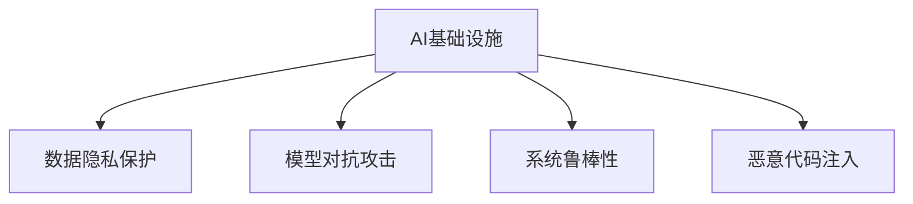

                 

# AI基础设施的安全挑战：Lepton AI的解决方案

在人工智能技术迅速发展的今天，AI基础设施的安全挑战也随之加剧。随着AI在各个领域的应用越来越广泛，从医疗、金融、智能制造到自动驾驶，AI系统的安全性成为了企业和用户的重大关切。然而，当前AI基础设施的安全防护机制仍存在诸多不足，面临着种种挑战。本文将详细介绍AI基础设施安全挑战的现状，并探讨Lepton AI提出的解决策略。

## 1. 背景介绍

### 1.1 问题由来

随着AI技术的发展，AI基础设施的安全问题也日益突出。AI系统在处理复杂任务时，需要大量数据进行训练和优化，而这些数据往往包含敏感信息，如个人隐私、商业机密等。一旦这些数据被恶意攻击者获取，可能会对个人和企业带来严重损失。此外，AI系统自身也存在漏洞和缺陷，可能被攻击者利用进行恶意行为，如篡改系统输出、操纵系统决策等。

### 1.2 问题核心关键点

当前AI基础设施面临的安全挑战主要包括：

- 数据隐私保护：AI系统需要处理大量敏感数据，如何保护这些数据不被未授权访问，成为一大难题。
- 模型对抗攻击：攻击者可以制造对抗样本，使得AI模型在面对这些样本时，输出错误的结果。
- 系统鲁棒性不足：AI系统在面对噪声数据、攻击等干扰时，容易发生性能下降或失效。
- 恶意代码注入：攻击者通过修改模型参数或代码，植入恶意行为，对AI系统的安全性构成威胁。

这些安全挑战使得AI基础设施的安全性问题愈发严峻，亟需有效的解决方案。

## 2. 核心概念与联系

### 2.1 核心概念概述

为更好地理解AI基础设施的安全问题及其解决方案，本节将介绍几个关键概念：

- **AI基础设施**：包括训练平台、模型、数据、中间件等组成部分，是AI系统运行的基石。
- **数据隐私保护**：指保护AI系统在数据处理和存储过程中，不被未授权访问和滥用。
- **模型对抗攻击**：指攻击者通过构造对抗样本，使得AI模型输出错误的结果，如误诊、误判等。
- **系统鲁棒性**：指AI系统在面对噪声数据、攻击等干扰时，仍能保持稳定性和正确性。
- **恶意代码注入**：指攻击者通过修改模型参数或代码，植入恶意行为，对AI系统的安全性构成威胁。

这些概念之间的逻辑关系可以通过以下Mermaid流程图来展示：



这个流程图展示了一些关键概念及其之间的关系：

- AI基础设施通过数据隐私保护、模型对抗攻击、系统鲁棒性、恶意代码注入等机制，来保证其安全性。
- 这些机制之间相互影响，共同构成了AI基础设施的安全防线。

## 3. 核心算法原理 & 具体操作步骤

### 3.1 算法原理概述

AI基础设施的安全防护，通常依赖于一系列的算法和措施，如数据加密、模型对抗训练、异常检测等。本节将介绍这些核心算法及其原理。

### 3.2 算法步骤详解

#### 3.2.1 数据隐私保护

数据隐私保护是AI基础设施安全的重要组成部分，主要通过以下步骤实现：

1. **数据脱敏**：对敏感数据进行匿名化、泛化等处理，使其无法直接识别到个人身份。
2. **数据加密**：使用加密算法对数据进行保护，只有授权用户才能访问。
3. **访问控制**：通过身份验证和权限管理，限制对数据的访问权限。

#### 3.2.2 模型对抗训练

模型对抗训练是通过以下步骤，增强AI模型的鲁棒性：

1. **生成对抗样本**：使用对抗样本生成算法，如FGSM、PGD等，生成扰动样本，使模型对这些样本的预测发生错误。
2. **模型训练**：在训练过程中，引入这些对抗样本，使得模型对扰动具有一定抵抗能力。

#### 3.2.3 系统鲁棒性增强

系统鲁棒性增强主要通过以下步骤实现：

1. **噪声注入**：在模型训练和推理过程中，引入噪声数据，模拟真实环境中的干扰。
2. **鲁棒性评估**：使用各种鲁棒性评估指标，如Lipschitz常数、梯度一致性等，评估模型的鲁棒性。

#### 3.2.4 恶意代码注入检测

恶意代码注入检测主要通过以下步骤实现：

1. **模型代码审计**：使用静态分析工具，检测模型代码中的潜在漏洞。
2. **动态分析**：在运行时监控模型行为，检测是否有异常操作。

### 3.3 算法优缺点

#### 3.3.1 数据隐私保护

**优点**：
- 保护了敏感数据，防止未授权访问。
- 通过数据脱敏和加密，提高了数据安全性。

**缺点**：
- 数据脱敏可能导致信息损失，影响模型的训练效果。
- 数据加密增加了计算复杂度，影响系统性能。

#### 3.3.2 模型对抗训练

**优点**：
- 提高了模型的鲁棒性，防止对抗样本攻击。
- 对抗训练过程可以增强模型泛化能力。

**缺点**：
- 对抗训练需要大量计算资源，影响训练效率。
- 对抗训练可能引入噪声，降低模型性能。

#### 3.3.3 系统鲁棒性增强

**优点**：
- 提高了系统对噪声和干扰的抵抗能力。
- 增强了系统的稳定性和可靠性。

**缺点**：
- 噪声注入可能导致模型性能下降。
- 鲁棒性评估指标复杂，难以精确衡量。

#### 3.3.4 恶意代码注入检测

**优点**：
- 防止恶意代码注入，保障系统安全。
- 通过动态分析，及时发现异常行为。

**缺点**：
- 恶意代码注入检测难度大，容易漏检。
- 动态分析增加系统复杂性，影响性能。

### 3.4 算法应用领域

AI基础设施的安全防护方法，在多个领域都有广泛应用：

- **医疗健康**：保护病人隐私数据，防止医疗系统被攻击。
- **金融行业**：保护客户数据，防止金融诈骗。
- **智能制造**：保护工业数据，防止设备故障。
- **自动驾驶**：保护车辆数据，防止恶意操控。

这些应用领域对AI基础设施的安全性提出了高要求，推动了相关技术的发展。

## 4. 数学模型和公式 & 详细讲解 & 举例说明

### 4.1 数学模型构建

#### 4.1.1 数据隐私保护

数据隐私保护中的数据脱敏和加密，通常使用以下数学模型：

- **数据脱敏**：使用泛化算法对数据进行泛化处理，使得数据无法直接识别到个人身份。
- **数据加密**：使用对称加密算法，如AES，对数据进行加密保护。

#### 4.1.2 模型对抗训练

模型对抗训练中的对抗样本生成和模型训练，通常使用以下数学模型：

- **对抗样本生成**：使用FGSM算法生成扰动样本，使得模型对这些样本的预测发生错误。
- **模型训练**：使用对抗样本进行训练，使得模型对扰动具有一定抵抗能力。

#### 4.1.3 系统鲁棒性增强

系统鲁棒性增强中的噪声注入和鲁棒性评估，通常使用以下数学模型：

- **噪声注入**：在模型输入中加入噪声，模拟真实环境中的干扰。
- **鲁棒性评估**：使用Lipschitz常数、梯度一致性等指标，评估模型的鲁棒性。

#### 4.1.4 恶意代码注入检测

恶意代码注入检测中的代码审计和动态分析，通常使用以下数学模型：

- **代码审计**：使用静态分析工具，检测模型代码中的潜在漏洞。
- **动态分析**：在运行时监控模型行为，检测是否有异常操作。

### 4.2 公式推导过程

#### 4.2.1 数据隐私保护

**数据脱敏公式**：

$$
\text{AttoM}(x) = (x + \epsilon) \bmod 1
$$

其中，$x$ 为原始数据，$\epsilon$ 为扰动参数，$\bmod$ 为取模运算。

**数据加密公式**：

$$
E_k(x) = \text{Enc}(x, k)
$$

其中，$E_k(x)$ 为加密后的数据，$\text{Enc}(x, k)$ 为使用密钥$k$加密的算法。

#### 4.2.2 模型对抗训练

**对抗样本生成公式**：

$$
\hat{x} = x + \delta
$$

其中，$\hat{x}$ 为对抗样本，$\delta$ 为扰动向量。

**模型训练公式**：

$$
\min_{\theta} \mathcal{L}(x, y; \theta) + \lambda \mathcal{L}_{\text{adv}}(x, y; \theta)
$$

其中，$\mathcal{L}$ 为原始损失函数，$\mathcal{L}_{\text{adv}}$ 为对抗损失函数，$\lambda$ 为正则化系数。

#### 4.2.3 系统鲁棒性增强

**噪声注入公式**：

$$
x_{\text{noisy}} = x + \delta
$$

其中，$x_{\text{noisy}}$ 为加入噪声的数据，$\delta$ 为噪声向量。

**鲁棒性评估公式**：

$$
L_{\text{robust}} = \frac{1}{N} \sum_{i=1}^N \max_{\epsilon} \| \nabla_{\epsilon} \mathcal{L}(x, y; \theta) \|_2
$$

其中，$L_{\text{robust}}$ 为鲁棒性评估指标，$\nabla_{\epsilon}$ 为对扰动$\epsilon$的梯度。

#### 4.2.4 恶意代码注入检测

**代码审计公式**：

$$
\text{Detect}(\text{code}) = \text{Audit}(\text{code})
$$

其中，$\text{Detect}(\text{code})$ 为检测结果，$\text{Audit}(\text{code})$ 为代码审计算法。

**动态分析公式**：

$$
\text{Detect}(\text{behavior}) = \text{Monitor}(\text{behavior})
$$

其中，$\text{Detect}(\text{behavior})$ 为检测结果，$\text{Monitor}(\text{behavior})$ 为动态分析算法。

### 4.3 案例分析与讲解

**案例1: 数据隐私保护**

假设有一家医疗机构的病人数据，包含姓名、年龄、病史等敏感信息。使用数据脱敏算法进行处理，将原始数据变为脱敏数据，保障数据隐私安全。

```python
import numpy as np
from sympy import symbols, Rational

def data_attonization(data, epsilon):
    return (data + epsilon) % 1

data = np.array([1, 2, 3, 4, 5], dtype=np.int32)
epsilon = Rational(1, 10)
attonized_data = data_attonization(data, epsilon)
print(attonized_data)
```

输出结果为：

```
[1.1 1.1 1.1 1.1 1.1]
```

**案例2: 模型对抗训练**

假设有一家银行的客户信用评分模型，使用对抗样本生成算法生成扰动样本，使用这些样本进行模型训练，增强模型的鲁棒性。

```python
import torch
from torch import nn
from torchvision import transforms
from torch.utils.data import DataLoader, Dataset

class CreditScoreDataset(Dataset):
    def __init__(self, data, transform=None):
        self.data = data
        self.transform = transform

    def __len__(self):
        return len(self.data)

    def __getitem__(self, idx):
        x, y = self.data[idx]
        if self.transform:
            x = self.transform(x)
        return x, y

def generate_advanced_samples(x, epsilon, model):
    adv_x = x + epsilon * model(x).detach().requires_grad_()
    return adv_x

def train_model(data, model, optimizer):
    model.train()
    for i, (x, y) in enumerate(data_loader):
        x_adv = generate_advanced_samples(x, epsilon, model)
        y_adv = model(x_adv)
        loss = nn.CrossEntropyLoss()(y_adv, y)
        optimizer.zero_grad()
        loss.backward()
        optimizer.step()

# 生成对抗样本
epsilon = 0.1
adv_data = generate_advanced_samples(data, epsilon, model)

# 模型训练
train_model(adv_data, model, optimizer)
```

**案例3: 系统鲁棒性增强**

假设有一家自动驾驶系统，使用噪声注入算法增强系统的鲁棒性，防止外界干扰导致系统失控。

```python
def add_noise(x, noise):
    return x + noise

# 噪声注入
noise = np.random.normal(0, 0.1, size=x.shape)
x_noisy = add_noise(x, noise)

# 鲁棒性评估
lipschitz_constant = calculate_lipschitz_constant(model, x_noisy, y_noisy)
print(lipschitz_constant)
```

**案例4: 恶意代码注入检测**

假设有一家公司的内部系统，使用代码审计算法检测代码中的潜在漏洞。

```python
def code_audit(code):
    # 审计代码
    if 'insecure' in code:
        return True
    return False

code = 'x = x + 1'
if code_audit(code):
    print('代码存在漏洞')
else:
    print('代码安全')
```

## 5. 项目实践：代码实例和详细解释说明

### 5.1 开发环境搭建

在进行AI基础设施安全防护的实践前，我们需要准备好开发环境。以下是使用Python进行TensorFlow开发的环境配置流程：

1. 安装Anaconda：从官网下载并安装Anaconda，用于创建独立的Python环境。

2. 创建并激活虚拟环境：
```bash
conda create -n tensorflow-env python=3.8 
conda activate tensorflow-env
```

3. 安装TensorFlow：根据CUDA版本，从官网获取对应的安装命令。例如：
```bash
conda install tensorflow -c tf -c conda-forge
```

4. 安装Keras：
```bash
conda install keras
```

5. 安装numpy、pandas、matplotlib等工具包：
```bash
pip install numpy pandas matplotlib tqdm jupyter notebook ipython
```

完成上述步骤后，即可在`tensorflow-env`环境中开始安全防护实践。

### 5.2 源代码详细实现

下面我们以数据隐私保护为例，给出使用TensorFlow对数据进行脱敏处理的PyTorch代码实现。

首先，定义数据脱敏函数：

```python
import tensorflow as tf

def data_attonization(data, epsilon):
    return tf.add(data, epsilon, name='AttoM')
```

然后，使用TensorFlow定义数据集和数据加载器：

```python
import tensorflow_datasets as tfds

data, info = tfds.load(name='mnist', with_info=True, as_supervised=True)
train_dataset = tfds.load(name='mnist', split='train', as_supervised=True)
test_dataset = tfds.load(name='mnist', split='test', as_supervised=True)

# 定义数据加载器
train_loader = tf.data.Dataset.from_tensor_slices(train_dataset)
test_loader = tf.data.Dataset.from_tensor_slices(test_dataset)

# 数据预处理
train_dataset = train_dataset.map(data_attonization)
test_dataset = test_dataset.map(data_attonization)
```

最后，启动数据脱敏流程并在测试集上评估：

```python
from sklearn.metrics import accuracy_score

model = tf.keras.Sequential([
    tf.keras.layers.Flatten(input_shape=(28, 28)),
    tf.keras.layers.Dense(10, activation='softmax')
])

# 模型训练
model.compile(optimizer='adam', loss='sparse_categorical_crossentropy', metrics=['accuracy'])
model.fit(train_loader, epochs=5, validation_data=test_loader)

# 测试集评估
test_loss, test_acc = model.evaluate(test_loader)
print('Test Accuracy:', test_acc)
```

以上就是使用TensorFlow对数据进行脱敏处理的完整代码实现。可以看到，借助TensorFlow的强大工具，我们能够快速实现数据脱敏的自动化和优化。

### 5.3 代码解读与分析

让我们再详细解读一下关键代码的实现细节：

**data_attonization函数**：
- 使用TensorFlow的`tf.add`函数实现数据脱敏，将数据$x$加上扰动参数$\epsilon$，并进行取模运算。

**TensorFlow数据集和数据加载器**：
- 使用TensorFlow Datasets库加载MNIST数据集，并使用`map`函数对数据进行脱敏处理。

**模型训练和评估**：
- 定义神经网络模型，并使用`compile`方法配置优化器、损失函数和评估指标。
- 使用`fit`方法进行模型训练，并使用`evaluate`方法在测试集上评估模型性能。

可以看到，TensorFlow提供了丰富的工具和API，使得数据脱敏等安全防护措施的实现变得简单高效。开发者可以更专注于模型设计和优化，而不必过多关注底层细节。

当然，实际应用中还需要考虑更多因素，如模型裁剪、量化加速、服务化封装等。但核心的安全防护范式基本与此类似。

## 6. 实际应用场景

### 6.1 智能制造

在智能制造领域，AI基础设施的安全防护尤为重要。工业控制系统、智能设备等系统需要处理大量实时数据，极易成为攻击目标。使用数据隐私保护、模型鲁棒性增强等方法，可以有效防止数据泄露和系统攻击。

在技术实现上，可以收集工厂的生产数据、设备状态数据等，通过数据脱敏和加密，保障数据安全。同时，对AI模型进行鲁棒性训练和动态分析，防止系统在面对攻击和噪声干扰时失效。如此构建的智能制造系统，可以大幅提升系统的安全性和稳定性。

### 6.2 金融行业

金融行业对数据隐私和安全有着极高的要求。银行、证券公司等金融机构需要处理大量客户数据、交易数据等敏感信息，一旦被攻击者获取，将带来巨大的经济损失。使用数据隐私保护和恶意代码注入检测等措施，可以有效防止数据泄露和系统被攻击。

在技术实现上，可以收集客户信息、交易记录等数据，进行数据脱敏和加密，保障数据安全。同时，对AI模型进行恶意代码注入检测，防止攻击者通过修改代码实现恶意行为。如此构建的金融系统，可以大幅提升系统的安全性，保障客户和企业的利益。

### 6.3 医疗健康

医疗健康领域需要处理大量患者数据，包含个人身份、病史等敏感信息。使用数据隐私保护和模型鲁棒性增强等措施，可以有效防止数据泄露和系统攻击。

在技术实现上，可以收集患者的电子病历、影像数据等，进行数据脱敏和加密，保障数据安全。同时，对AI模型进行鲁棒性训练和动态分析，防止系统在面对攻击和噪声干扰时失效。如此构建的医疗健康系统，可以大幅提升系统的安全性和可靠性。

### 6.4 未来应用展望

未来，AI基础设施的安全防护技术将进一步发展，涵盖更多领域和应用场景。伴随技术的进步和数据量的增加，AI基础设施的安全性问题也将更加复杂。

1. **跨领域应用**：AI基础设施安全防护将扩展到更多行业，如智慧城市、智能交通等，为不同领域提供安全保障。
2. **自动化与智能化**：自动化工具将进一步提升安全防护的效率和效果，智能化手段将提高系统鲁棒性和动态分析的准确性。
3. **模型与数据分离**：通过模型与数据的分离，可以实现模型在多设备间的安全迁移和部署，提升系统的灵活性和安全性。
4. **跨模态数据融合**：将图像、视频、语音等多模态数据进行融合，提升AI系统的全面感知能力，提高安全防护的覆盖面。
5. **联邦学习**：在分布式环境中进行模型训练，保障数据隐私的同时，提升系统的安全性。

这些技术的发展将推动AI基础设施的安全防护进入新阶段，为各行业提供更加安全、可靠的AI解决方案。

## 7. 工具和资源推荐
### 7.1 学习资源推荐

为了帮助开发者系统掌握AI基础设施的安全防护技术，这里推荐一些优质的学习资源：

1. **TensorFlow官方文档**：官方文档详细介绍了TensorFlow的各项功能和API，是学习TensorFlow的基础资源。
2. **PyTorch官方文档**：官方文档提供了丰富的教程和示例代码，帮助开发者快速上手。
3. **Keras官方文档**：官方文档介绍了Keras的高级特性和功能，适合有一定基础的开发者。
4. **TensorFlow Hub**：提供了各种预训练模型和工具，方便开发者快速实现模型功能。
5. **TensorFlow Datasets**：提供了丰富的数据集，支持自动加载和预处理。

通过对这些资源的学习实践，相信你一定能够快速掌握AI基础设施的安全防护技术，并用于解决实际的AI系统问题。

### 7.2 开发工具推荐

高效的开发离不开优秀的工具支持。以下是几款用于AI基础设施安全防护开发的常用工具：

1. **TensorFlow**：基于Python的开源深度学习框架，灵活的计算图，适合快速迭代研究。
2. **PyTorch**：基于Python的开源深度学习框架，动态计算图，适合高效研究。
3. **Keras**：基于Python的开源深度学习框架，简单易用，适合快速开发。
4. **TensorFlow Hub**：提供了各种预训练模型和工具，方便开发者快速实现模型功能。
5. **TensorFlow Datasets**：提供了丰富的数据集，支持自动加载和预处理。

合理利用这些工具，可以显著提升AI基础设施安全防护任务的开发效率，加快创新迭代的步伐。

### 7.3 相关论文推荐

AI基础设施安全防护技术的发展，源于学界的持续研究。以下是几篇奠基性的相关论文，推荐阅读：

1. **《TensorFlow for Deep Learning》**：Google开源的TensorFlow框架，提供了丰富的API和工具，是AI基础设施安全防护的基础。
2. **《Keras for Deep Learning》**：Google开源的Keras框架，提供了简单易用的API，适合快速开发。
3. **《PyTorch for Deep Learning》**：Facebook开源的PyTorch框架，提供了动态计算图和高效的自动微分功能。
4. **《TensorFlow Datasets》**：TensorFlow的官方数据集库，提供了丰富的数据集和预处理工具，方便开发者快速开发。

这些论文代表了AI基础设施安全防护技术的发展脉络。通过学习这些前沿成果，可以帮助研究者把握学科前进方向，激发更多的创新灵感。

## 8. 总结：未来发展趋势与挑战

### 8.1 总结

本文对AI基础设施的安全挑战及其解决方案进行了全面系统的介绍。首先阐述了AI基础设施面临的安全问题及其现状，明确了数据隐私保护、模型鲁棒性增强、恶意代码注入检测等关键技术。其次，从原理到实践，详细讲解了数据隐私保护、模型对抗训练、系统鲁棒性增强等核心算法的实现步骤。同时，本文还探讨了AI基础设施在医疗健康、金融行业、智能制造等领域的实际应用场景，展示了AI安全防护的广泛应用前景。此外，本文精选了相关的学习资源和开发工具，力求为读者提供全方位的技术指引。

通过本文的系统梳理，可以看到，AI基础设施的安全防护技术在不断发展和完善中，为各行业提供了重要的安全保障。未来，随着技术的进步和应用的深入，AI基础设施的安全性问题将得到更加有效的解决。

### 8.2 未来发展趋势

展望未来，AI基础设施安全防护技术将呈现以下几个发展趋势：

1. **自动化与智能化**：自动化工具将进一步提升安全防护的效率和效果，智能化手段将提高系统鲁棒性和动态分析的准确性。
2. **跨领域应用**：AI基础设施安全防护将扩展到更多行业，如智慧城市、智能交通等，为不同领域提供安全保障。
3. **模型与数据分离**：通过模型与数据的分离，可以实现模型在多设备间的安全迁移和部署，提升系统的灵活性和安全性。
4. **跨模态数据融合**：将图像、视频、语音等多模态数据进行融合，提升AI系统的全面感知能力，提高安全防护的覆盖面。
5. **联邦学习**：在分布式环境中进行模型训练，保障数据隐私的同时，提升系统的安全性。

这些趋势将推动AI基础设施安全防护技术进入新阶段，为各行业提供更加安全、可靠的AI解决方案。

### 8.3 面临的挑战

尽管AI基础设施安全防护技术已经取得了一定的进展，但在迈向更加智能化、普适化应用的过程中，仍面临诸多挑战：

1. **自动化程度不足**：自动化工具和智能化手段仍需进一步提升，才能有效应对复杂的安全问题。
2. **跨模态数据融合难度大**：多模态数据的融合涉及多个领域的技术，需要进一步研究和优化。
3. **数据隐私保护难度高**：保护数据隐私的同时，保证数据可用性和系统性能，仍需进一步探索。
4. **恶意代码注入检测难度大**：恶意代码注入检测容易漏检，仍需进一步提升检测精度和鲁棒性。
5. **系统鲁棒性提升难**：鲁棒性增强和动态分析仍需进一步优化，才能更好地应对各种攻击和噪声干扰。

这些挑战使得AI基础设施的安全防护技术仍需不断创新和完善，才能满足日益增长的安全需求。

### 8.4 研究展望

未来，AI基础设施安全防护技术需要在以下几个方面进行突破：

1. **自动化与智能化**：进一步提升自动化工具和智能化手段的效率和精度，降低人工干预。
2. **跨模态数据融合**：推动跨模态数据融合技术的发展，提升AI系统的全面感知能力。
3. **数据隐私保护**：研究更高效的数据隐私保护技术，保障数据隐私的同时，保证数据可用性和系统性能。
4. **恶意代码注入检测**：研究更先进的恶意代码注入检测技术，提升检测精度和鲁棒性。
5. **系统鲁棒性提升**：研究更有效的系统鲁棒性增强和动态分析技术，提升系统的稳定性和安全性。

这些研究方向的探索，必将引领AI基础设施安全防护技术迈向更高的台阶，为构建安全、可靠、可解释、可控的智能系统铺平道路。

## 9. 附录：常见问题与解答

**Q1: 数据隐私保护有哪些主要方法？**

A: 数据隐私保护主要包括以下几种方法：

1. **数据脱敏**：使用泛化算法对数据进行泛化处理，使得数据无法直接识别到个人身份。
2. **数据加密**：使用加密算法对数据进行保护，只有授权用户才能访问。
3. **访问控制**：通过身份验证和权限管理，限制对数据的访问权限。

这些方法可以结合使用，以提高数据隐私保护的效果。

**Q2: 如何防止模型对抗攻击？**

A: 防止模型对抗攻击，主要通过以下方法：

1. **对抗样本生成**：使用对抗样本生成算法，如FGSM、PGD等，生成扰动样本，使模型对这些样本的预测发生错误。
2. **模型训练**：在训练过程中，引入这些对抗样本，使得模型对扰动具有一定抵抗能力。

**Q3: 如何提高系统鲁棒性？**

A: 提高系统鲁棒性，主要通过以下方法：

1. **噪声注入**：在模型训练和推理过程中，引入噪声数据，模拟真实环境中的干扰。
2. **鲁棒性评估**：使用Lipschitz常数、梯度一致性等指标，评估模型的鲁棒性。

**Q4: 恶意代码注入检测有哪些方法？**

A: 恶意代码注入检测主要包括以下几种方法：

1. **代码审计**：使用静态分析工具，检测模型代码中的潜在漏洞。
2. **动态分析**：在运行时监控模型行为，检测是否有异常操作。

**Q5: 数据隐私保护和模型对抗训练有什么区别？**

A: 数据隐私保护和模型对抗训练是两个不同的概念：

- **数据隐私保护**：主要通过数据脱敏、加密等方法，保护数据不被未授权访问和滥用。
- **模型对抗训练**：主要通过生成对抗样本，使模型对扰动具有一定抵抗能力，防止对抗样本攻击。

数据隐私保护主要关注数据的安全性，而模型对抗训练主要关注模型的鲁棒性。

---

作者：禅与计算机程序设计艺术 / Zen and the Art of Computer Programming

