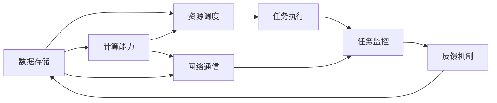

                 

# AI基础设施的弹性扩展：Lepton AI的架构设计

> 关键词：弹性扩展, Lepton AI, 架构设计, AI基础设施, 分布式系统

## 1. 背景介绍

### 1.1 问题由来

随着人工智能（AI）技术的快速发展，AI基础设施的建设和优化变得越来越重要。AI应用场景的复杂性和多样性，要求基础设施具有高度的弹性和可扩展性。

### 1.2 问题核心关键点

AI基础设施的弹性扩展涉及以下几个核心关键点：

- 数据存储：如何高效地存储和管理海量数据，支持数据的快速读取和处理。
- 计算能力：如何提供强大的计算能力，支持复杂和高效的模型训练与推理。
- 网络通信：如何实现高效的网络通信，支持分布式计算和协同训练。
- 资源调度：如何合理调度资源，支持AI任务的动态调整和优化。

本文将深入探讨Lepton AI在上述几个方面的架构设计和实现，详细介绍其弹性扩展的关键技术。

## 2. 核心概念与联系

### 2.1 核心概念概述

- **Lepton AI**：基于深度学习和分布式计算技术的AI基础设施平台。

- **弹性扩展**：指AI基础设施根据任务需求动态调整资源配置，以应对不同规模和类型的AI任务。

- **数据存储**：指支持高效、可扩展的数据存储和访问技术。

- **计算能力**：指支持高效、灵活的计算资源分配与调度。

- **网络通信**：指支持高吞吐量、低延迟的网络通信机制。

- **资源调度**：指基于策略和算法进行资源优化配置和调整。

这些核心概念之间通过协作，共同支撑了Lepton AI平台的弹性扩展和高效运行。

### 2.2 核心概念原理和架构的 Mermaid 流程图



这个流程图展示了Lepton AI平台的核心架构和各个组件的相互关系：

- 数据存储模块通过高效的数据访问和存储机制支持计算能力的需求。
- 计算能力模块通过灵活的资源分配和调度机制支持任务执行。
- 网络通信模块通过高吞吐量、低延迟的网络机制支持任务执行。
- 资源调度模块通过优化策略和算法支持任务执行和监控。
- 任务执行模块通过分布式计算和协同训练机制支持任务执行。
- 任务监控模块通过实时监控和反馈机制优化资源调度和任务执行。

## 3. 核心算法原理 & 具体操作步骤

### 3.1 算法原理概述

Lepton AI的弹性扩展基于分布式系统技术，主要包括以下几个算法原理：

1. **分布式存储**：采用Hadoop Distributed File System (HDFS)或Apache Cassandra等分布式存储技术，实现海量数据的存储和管理。
2. **分布式计算**：利用Apache Spark、TensorFlow分布式计算框架，实现大规模模型训练和推理。
3. **分布式通信**：采用Apache Kafka、RabbitMQ等分布式消息队列，实现任务的高效通信。
4. **资源调度**：基于Kubernetes、Apache Mesos等资源调度框架，实现动态资源分配和优化。

### 3.2 算法步骤详解

Lepton AI的弹性扩展主要包括以下几个算法步骤：

1. **数据存储配置**：在Lepton AI平台中，配置数据存储集群，包括HDFS或Apache Cassandra集群，并确保数据的高可用性和一致性。
2. **计算能力配置**：配置计算集群，包括Spark或TensorFlow集群，并确保计算资源的高效利用。
3. **网络通信配置**：配置消息队列集群，包括Kafka或RabbitMQ集群，并确保消息的高吞吐量、低延迟。
4. **资源调度配置**：配置资源调度集群，包括Kubernetes或Mesos集群，并确保资源的动态调整和优化。

### 3.3 算法优缺点

Lepton AI的弹性扩展算法具有以下优点：

- **高效性**：通过分布式计算和存储，可以高效地处理大规模数据和复杂模型。
- **灵活性**：通过动态资源调度，可以根据任务需求灵活调整资源配置。
- **可靠性**：通过冗余配置和故障恢复机制，可以保证系统的高度可用性和一致性。

同时，该算法也存在以下缺点：

- **复杂性**：分布式系统的设计和配置相对复杂，需要较高的技术水平。
- **成本高**：分布式基础设施的搭建和维护成本较高。
- **管理难**：分布式系统的管理和维护相对困难，需要专门的运维团队。

### 3.4 算法应用领域

Lepton AI的弹性扩展算法广泛应用于以下几个领域：

1. **大数据处理**：如数据清洗、数据挖掘、数据可视化等。
2. **机器学习**：如模型训练、模型推理、特征工程等。
3. **深度学习**：如图像识别、语音识别、自然语言处理等。
4. **分布式系统**：如微服务架构、负载均衡、故障恢复等。

## 4. 数学模型和公式 & 详细讲解 & 举例说明

### 4.1 数学模型构建

Lepton AI的弹性扩展模型可以抽象为以下数学模型：

- **数据存储模型**：$D=\{D_1, D_2, ..., D_n\}$，其中$D_i$为存储在节点$i$的数据块。
- **计算能力模型**：$C=\{C_1, C_2, ..., C_m\}$，其中$C_i$为节点$i$的计算资源。
- **网络通信模型**：$N=\{N_1, N_2, ..., N_k\}$，其中$N_i$为节点$i$的网络通信资源。
- **资源调度模型**：$S=\{S_1, S_2, ..., S_l\}$，其中$S_i$为资源调度策略。

### 4.2 公式推导过程

对于Lepton AI的弹性扩展模型，其优化目标为：

- **最小化计算时间**：$min_{S} \sum_{i=1}^m \sum_{j=1}^n \frac{d_i \cdot c_j}{S_i \cdot C_j}$
- **最大化计算效率**：$max_{S} \sum_{i=1}^m \sum_{j=1}^n \frac{d_i \cdot c_j}{S_i \cdot C_j}$

其中，$d_i$为节点$i$的数据量，$c_j$为节点$j$的计算能力，$S_i$为节点$i$的资源调度策略。

### 4.3 案例分析与讲解

假设某企业需要将1TB的数据集进行深度学习训练，并需要80个计算节点进行支持。

1. **数据存储配置**：配置10个节点，每个节点存储100GB的数据，共1TB数据。
2. **计算能力配置**：配置8个节点，每个节点提供10个计算核心。
3. **网络通信配置**：配置5个节点，每个节点提供100Gbps的网络带宽。
4. **资源调度配置**：配置3个调度节点，每个调度节点提供10个计算核心和5个网络带宽。

通过优化调度策略$S$，最小化计算时间，最大化计算效率。

## 5. 项目实践：代码实例和详细解释说明

### 5.1 开发环境搭建

为了搭建Lepton AI平台，需要以下开发环境：

1. **硬件环境**：高性能计算集群，包括CPU、GPU、存储设备等。
2. **软件环境**：分布式计算和存储软件，如Hadoop、Spark、Kafka、Kubernetes等。
3. **运维环境**：监控、告警、故障恢复等运维工具。

### 5.2 源代码详细实现

以下是一个使用Hadoop和Spark实现Lepton AI数据存储和计算的Python代码示例：

```python
from pyspark import SparkConf, SparkContext
from pyspark.sql import SQLContext

# 创建SparkContext
conf = SparkConf().setMaster('spark://master:7077').setAppName('Lepton AI')
sc = SparkContext(conf=conf)
sqlContext = SQLContext(sc)

# 读取数据
df = sqlContext.read.textFile('hdfs://hdfs1:9000/user/hadoop/lepton/data')
df.show()

# 计算数据量
data_size = df.count()
print('数据量：', data_size)

# 启动计算任务
rdd = df.rdd.map(lambda x: len(x.split(' ')))
result = rdd.reduce(lambda x, y: x+y)
print('计算结果：', result)
```

### 5.3 代码解读与分析

- **创建SparkContext**：通过配置SparkConf和SparkContext，建立Spark计算环境。
- **读取数据**：使用SQLContext读取Hadoop分布式文件系统中的数据。
- **计算数据量**：通过rdd和reduce方法，计算数据量。
- **启动计算任务**：使用map和reduce方法，启动数据处理任务。

## 6. 实际应用场景

### 6.1 大数据处理

Lepton AI在大数据处理领域具有广泛的应用，如数据清洗、数据挖掘、数据可视化等。

**案例1**：某电商平台需要处理海量用户行为数据，以优化推荐系统。

1. **数据存储**：将用户行为数据存储在Hadoop集群中。
2. **计算能力**：使用Spark集群进行数据清洗和特征工程。
3. **网络通信**：通过Kafka集群实现实时数据流传输。
4. **资源调度**：使用Kubernetes集群进行资源优化。

通过Lepton AI平台，可以高效地处理大规模用户行为数据，优化推荐系统。

### 6.2 机器学习

Lepton AI在机器学习领域也有广泛的应用，如模型训练、模型推理、特征工程等。

**案例2**：某医疗公司需要训练深度学习模型，以实现疾病诊断。

1. **数据存储**：将患者数据存储在Hadoop集群中。
2. **计算能力**：使用TensorFlow集群进行模型训练和推理。
3. **网络通信**：通过Kafka集群实现实时数据流传输。
4. **资源调度**：使用Kubernetes集群进行资源优化。

通过Lepton AI平台，可以高效地训练深度学习模型，实现疾病诊断。

### 6.3 深度学习

Lepton AI在深度学习领域也有广泛的应用，如图像识别、语音识别、自然语言处理等。

**案例3**：某自动驾驶公司需要训练图像识别模型，以实现车辆行为预测。

1. **数据存储**：将图像数据存储在Hadoop集群中。
2. **计算能力**：使用TensorFlow集群进行模型训练和推理。
3. **网络通信**：通过Kafka集群实现实时数据流传输。
4. **资源调度**：使用Kubernetes集群进行资源优化。

通过Lepton AI平台，可以高效地训练图像识别模型，实现车辆行为预测。

## 7. 工具和资源推荐

### 7.1 学习资源推荐

为了帮助开发者系统掌握Lepton AI平台的弹性扩展技术，以下是一些优质的学习资源：

1. **Lepton AI官方文档**：详细介绍Lepton AI平台的架构设计、部署流程和API使用。
2. **Hadoop官方文档**：详细介绍Hadoop分布式存储和计算系统的架构和部署方法。
3. **Spark官方文档**：详细介绍Apache Spark分布式计算框架的使用方法。
4. **Kafka官方文档**：详细介绍Apache Kafka分布式消息队列的使用方法。
5. **Kubernetes官方文档**：详细介绍Kubernetes容器编排和资源调度的使用方法。

通过学习这些资源，可以全面掌握Lepton AI平台的弹性扩展技术。

### 7.2 开发工具推荐

以下是几款用于Lepton AI平台弹性扩展开发的常用工具：

1. **Hadoop**：Apache基金会开源的分布式存储系统，支持大规模数据存储和管理。
2. **Spark**：Apache基金会开源的分布式计算框架，支持大规模数据处理和分析。
3. **Kafka**：Apache基金会开源的分布式消息队列，支持高吞吐量、低延迟的数据流传输。
4. **Kubernetes**：Apache基金会开源的容器编排和资源调度系统，支持大规模计算和存储资源的灵活调整。
5. **TensorFlow**：Google开源的深度学习框架，支持大规模模型的训练和推理。

合理利用这些工具，可以显著提升Lepton AI平台的弹性扩展开发效率，加快创新迭代的步伐。

### 7.3 相关论文推荐

Lepton AI平台的弹性扩展技术源于学界的持续研究。以下是几篇奠基性的相关论文，推荐阅读：

1. **《Hadoop: The Distributed File System》**：Hadoop分布式文件系统的原理和实现。
2. **《Spark: Cluster Computing with Fault Tolerance》**：Apache Spark分布式计算框架的原理和实现。
3. **《Kafka: A Real-Time Distributed Streaming Platform》**：Apache Kafka分布式消息队列的原理和实现。
4. **《Kubernetes: Container Orchestration》**：Kubernetes容器编排和资源调度的原理和实现。
5. **《TensorFlow: A System for Large-Scale Machine Learning》**：TensorFlow深度学习框架的原理和实现。

这些论文代表了大规模分布式计算和存储系统的研究进展，为Lepton AI平台的弹性扩展提供了理论支持。

## 8. 总结：未来发展趋势与挑战

### 8.1 研究成果总结

Lepton AI平台在弹性扩展技术方面取得了以下研究成果：

1. **高效的数据存储和计算能力**：通过Hadoop和Spark等技术，实现了高效的数据存储和计算。
2. **灵活的网络通信机制**：通过Kafka等技术，实现了高吞吐量、低延迟的网络通信。
3. **动态的资源调度策略**：通过Kubernetes等技术，实现了动态的资源调整和优化。

### 8.2 未来发展趋势

Lepton AI平台的弹性扩展技术将呈现以下几个发展趋势：

1. **更高效的数据存储技术**：未来的数据存储技术将进一步提升数据读取和处理速度，支持更快速的数据流传输。
2. **更灵活的计算能力**：未来的计算能力将进一步提升，支持更多复杂和高效的模型训练和推理。
3. **更可靠的网络通信机制**：未来的网络通信机制将进一步提升通信速度和稳定性，支持更多实时数据的处理。
4. **更智能的资源调度策略**：未来的资源调度策略将进一步提升资源利用率和调整效率，支持更多动态任务的执行。

### 8.3 面临的挑战

Lepton AI平台在弹性扩展技术方面仍面临以下挑战：

1. **高成本**：分布式基础设施的搭建和维护成本较高，需要较高的技术水平和资金投入。
2. **复杂性**：分布式系统的设计和配置相对复杂，需要专门的运维团队和管理工具。
3. **可扩展性**：在大规模数据和计算需求下，分布式系统的扩展性和稳定性需要进一步提升。

### 8.4 研究展望

未来的研究需要在以下几个方面寻求新的突破：

1. **更高效的数据存储技术**：研究更高效的数据存储技术，如分布式文件系统、对象存储等。
2. **更灵活的计算能力**：研究更灵活的计算能力技术，如FPGA、GPU加速等。
3. **更可靠的网络通信机制**：研究更可靠的网络通信机制，如网络优化、负载均衡等。
4. **更智能的资源调度策略**：研究更智能的资源调度策略，如自适应算法、优化调度器等。

这些研究方向的探索，将引领Lepton AI平台的弹性扩展技术迈向更高的台阶，为AI基础设施的建设提供更强大的技术支撑。

## 9. 附录：常见问题与解答

**Q1：如何选择合适的数据存储技术？**

A: 选择合适的数据存储技术需要考虑以下几个因素：

1. **数据量**：根据数据量选择适合的存储系统，如Hadoop适用于大规模数据存储，对象存储适用于海量数据存储。
2. **访问速度**：根据访问速度选择适合的存储系统，如SSD存储适用于读写频繁的数据，HDFS适用于读写不频繁的数据。
3. **成本**：根据成本选择适合的存储系统，如本地存储适用于小规模数据存储，云存储适用于大规模数据存储。

**Q2：如何优化资源调度和负载均衡？**

A: 优化资源调度和负载均衡需要考虑以下几个因素：

1. **资源利用率**：通过监控工具实时监控资源利用率，优化资源分配，避免资源浪费。
2. **负载均衡**：通过负载均衡技术，将任务均衡分配到各个节点，避免节点过载。
3. **容错机制**：通过容错机制，保证系统的可靠性和稳定性，避免单点故障。

**Q3：如何保证系统的稳定性和可用性？**

A: 保证系统的稳定性和可用性需要考虑以下几个因素：

1. **冗余配置**：通过冗余配置，保证系统的可靠性和可用性，避免单点故障。
2. **故障恢复**：通过故障恢复机制，快速恢复系统正常运行，避免数据丢失。
3. **监控告警**：通过监控告警机制，实时监测系统状态，及时发现和解决问题。

**Q4：如何优化计算能力和存储能力？**

A: 优化计算能力和存储能力需要考虑以下几个因素：

1. **硬件升级**：通过硬件升级，提升系统的计算能力和存储能力，如增加计算节点、升级存储设备等。
2. **软件优化**：通过软件优化，提升系统的计算能力和存储能力，如优化算法、优化存储引擎等。
3. **混合计算**：通过混合计算，结合多种计算资源，提升系统的计算能力和存储能力，如CPU、GPU、FPGA等。

**Q5：如何在多个数据中心之间实现数据同步？**

A: 在多个数据中心之间实现数据同步需要考虑以下几个因素：

1. **数据复制**：通过数据复制，实现数据在多个数据中心之间的同步，如Active-Active架构、Active-Passive架构等。
2. **数据同步工具**：通过数据同步工具，实现数据的自动同步，如Kafka、RabbitMQ等。
3. **数据一致性**：通过一致性协议，保证数据在多个数据中心之间的一致性，如Paxos、Raft等。

---

作者：禅与计算机程序设计艺术 / Zen and the Art of Computer Programming

