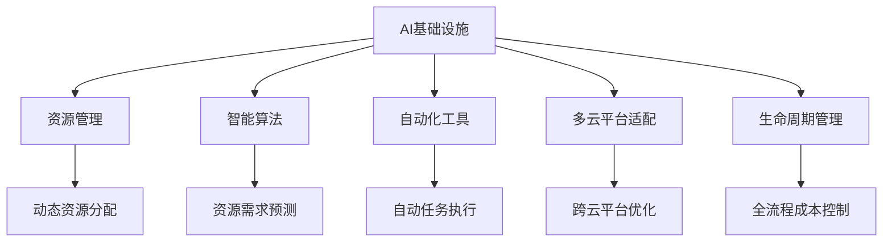

                 

# AI基础设施的成本控制：Lepton AI的运营智慧

## 1. 背景介绍

在人工智能(AI)的飞速发展中，AI基础设施的成本控制成为了一个重要议题。特别是对于规模化运营的AI公司，如何高效地管理基础设施成本，保持盈利能力，成为了核心竞争力之一。Lepton AI作为一家领先的AI基础设施管理公司，通过智能算法和自动化工具，优化了AI模型的构建、训练、部署和运维过程，大幅降低了运营成本，提升了效率。本文将探讨Lepton AI是如何通过技术手段实现成本控制的，并分析其在不同应用场景中的表现。

### 1.1 问题由来

随着AI技术的深入应用，AI模型的规模和复杂度不断增加，对计算资源、存储资源、能源消耗等基础设施的需求也日益增长。但与此同时，AI基础设施的成本控制问题却越来越突出。AI项目往往需要高昂的计算资源和能源投入，成本控制不当可能导致资金链断裂，影响项目进展甚至公司生存。Lepton AI正是应对这一挑战而诞生的，通过技术手段实现了AI基础设施成本的有效控制。

### 1.2 问题核心关键点

Lepton AI的成本控制核心在于：
1. **智能资源管理**：通过智能算法预测资源需求，动态分配和释放计算资源，避免资源浪费。
2. **自动调度和优化**：利用自动化工具和算法，优化模型训练和推理过程，减少不必要的操作，提高资源利用率。
3. **多云平台适配**：支持多种云平台，合理选择资源池，降低云服务成本。
4. **生命周期管理**：从模型设计到部署、运行、维护，全流程成本管理，降低整体运营成本。

这些核心措施使得Lepton AI能够高效地管理AI基础设施，为AI项目的成本控制提供了强有力的支持。

## 2. 核心概念与联系

### 2.1 核心概念概述

为更好地理解Lepton AI的成本控制方法，本节将介绍几个密切相关的核心概念：

- **AI基础设施**：指支持AI模型构建、训练、部署和运维所需的各种硬件和软件资源，包括CPU、GPU、内存、存储、网络、能源等。
- **资源管理**：指对AI基础设施资源进行规划、配置、调度和监控的过程，目标是最大化资源利用率，降低成本。
- **智能算法**：指利用机器学习、深度学习等算法，对AI基础设施资源进行预测、优化和调度的技术手段。
- **自动化工具**：指使用软件工具自动执行AI模型构建、训练、部署和运维任务，提升效率和准确性。
- **多云平台适配**：指支持多种云平台资源的管理和调度，优化成本和性能。
- **生命周期管理**：指从模型设计到部署、运行、维护的整个过程管理，确保全流程的成本优化。

这些核心概念之间的逻辑关系可以通过以下Mermaid流程图来展示：



这个流程图展示了一些核心概念及其之间的关系：

1. AI基础设施是AI项目的基础，需要管理和优化。
2. 资源管理、智能算法、自动化工具、多云平台适配、生命周期管理都是管理AI基础设施的手段。
3. 智能算法可以预测资源需求，动态分配和释放资源。
4. 自动化工具可以自动执行任务，提高效率。
5. 多云平台适配可以优化成本和性能。
6. 生命周期管理可以控制全流程成本。

这些概念共同构成了Lepton AI成本控制的基础框架，使得其在AI基础设施管理中发挥了重要作用。

## 3. 核心算法原理 & 具体操作步骤
### 3.1 算法原理概述

Lepton AI的成本控制算法主要基于以下几个原理：

- **动态资源分配**：通过智能算法预测模型在不同阶段所需的计算资源，动态调整资源分配，避免资源浪费。
- **自动调度和优化**：利用自动化工具和算法，优化模型训练和推理过程，减少不必要的计算操作，提高资源利用率。
- **多云平台适配**：采用多云平台资源池，根据模型和任务需求选择最优的资源，降低云服务成本。
- **生命周期管理**：从模型设计到部署、运行、维护，全流程成本监控和控制，确保成本最低。

Lepton AI的算法框架如下所示：

```
AI基础设施 --> 动态资源分配 --> 自动调度和优化 --> 多云平台适配 --> 生命周期管理 --> 成本控制
```

### 3.2 算法步骤详解

Lepton AI的成本控制算法主要分为以下几个步骤：

**Step 1: 资源需求预测**

Lepton AI使用机器学习和深度学习模型，对AI模型在训练、推理等阶段的资源需求进行预测。通过分析历史数据，模型能够识别资源消耗模式，预测未来资源需求。

**Step 2: 动态资源分配**

根据资源需求预测结果，Lepton AI动态调整计算资源的分配，确保资源在需要时可用，避免资源浪费。通过智能算法，Lepton AI能够快速响应资源需求变化，优化资源分配。

**Step 3: 自动调度和优化**

Lepton AI利用自动化工具和算法，优化模型训练和推理过程。例如，在训练过程中，自动选择最优的超参数和学习率，减少训练时间；在推理过程中，自动选择合适的模型和计算设备，优化性能。

**Step 4: 多云平台适配**

Lepton AI支持多种云平台，通过分析不同云平台的价格、性能、可用性等指标，选择最优的资源池，降低云服务成本。通过跨云平台调度，Lepton AI能够最大化资源利用率，优化成本。

**Step 5: 生命周期管理**

Lepton AI从模型设计到部署、运行、维护，全流程成本管理。通过智能算法和自动化工具，Lepton AI能够监控模型性能，识别潜在问题，优化模型结构和训练流程，降低整体运营成本。

**Step 6: 成本控制**

通过上述步骤，Lepton AI实现了AI基础设施的全面成本控制。实时监控和分析资源使用情况，及时调整策略，确保AI项目在低成本条件下高效运行。

### 3.3 算法优缺点

Lepton AI的成本控制算法具有以下优点：

1. **高效资源管理**：通过智能算法和动态分配，最大化资源利用率，降低资源浪费。
2. **自动调度和优化**：利用自动化工具，减少不必要的操作，提高效率和准确性。
3. **多云平台适配**：通过跨云平台调度，优化成本和性能。
4. **生命周期管理**：全流程成本控制，确保成本最低。

同时，该算法也存在一定的局限性：

1. **初始投资较高**：开发和部署智能算法和自动化工具需要较高的初始投资。
2. **算法复杂度较高**：算法模型需要大量数据进行训练和优化，模型复杂度较高。
3. **对数据依赖性强**：算法的准确性和效果依赖于数据的完整性和质量。
4. **维护成本较高**：智能算法和自动化工具需要定期维护和更新，维护成本较高。

尽管存在这些局限性，Lepton AI的成本控制算法仍是大规模AI项目中不可或缺的工具，能够显著提升效率，降低成本。

### 3.4 算法应用领域

Lepton AI的成本控制算法广泛应用于以下领域：

- **大规模AI模型的构建和训练**：通过智能算法和自动化工具，优化资源分配和任务执行，降低资源成本和运行时间。
- **云平台资源的管理和调度**：支持多种云平台，合理选择资源池，优化云服务成本。
- **AI模型的部署和运维**：通过全流程成本管理，确保模型在低成本条件下高效运行。
- **企业级AI基础设施的管理**：提供智能化的资源管理和服务，帮助企业降低AI基础设施成本。

Lepton AI的成本控制算法在这些领域中已经得到了广泛的应用，显著提升了AI项目和企业的运营效率和盈利能力。

## 4. 数学模型和公式 & 详细讲解 & 举例说明

### 4.1 数学模型构建

Lepton AI的成本控制算法涉及到多个数学模型，包括资源需求预测、动态资源分配、自动调度和优化等。这里给出几个关键模型的数学描述。

**资源需求预测模型**

假设AI模型的训练阶段为 $T$，资源需求为 $C_t$，历史资源需求数据为 $\{C_{t-1}, C_{t-2}, \ldots, C_{t-m}\}$，其中 $m$ 为模型训练的时间窗口。

资源需求预测模型可以表示为：

$$
\hat{C_t} = f(\{C_{t-1}, C_{t-2}, \ldots, C_{t-m}\})
$$

其中 $f$ 为预测函数，可以是线性回归、时间序列模型、神经网络等。

**动态资源分配模型**

假设当前可用资源为 $R$，需求预测结果为 $\hat{C_t}$，动态资源分配策略为 $A_t$。

动态资源分配模型可以表示为：

$$
A_t = g(\hat{C_t}, R)
$$

其中 $g$ 为分配函数，可以是比例分配、优先级分配、贪心分配等。

**自动调度和优化模型**

假设当前计算资源为 $R_t$，模型训练时间为 $T$，自动调度和优化策略为 $S_t$。

自动调度和优化模型可以表示为：

$$
S_t = h(R_t, T)
$$

其中 $h$ 为调度函数，可以是超参数自动选择、任务分解并行化、加速算法选择等。

### 4.2 公式推导过程

以资源需求预测模型为例，推导线性回归预测函数的公式。

假设历史资源需求数据为 $\{C_{t-1}, C_{t-2}, \ldots, C_{t-m}\}$，其中 $m$ 为模型训练的时间窗口。设 $C_t$ 为第 $t$ 次训练的资源需求，$x_t$ 为训练次数。

线性回归预测函数的公式为：

$$
\hat{C_t} = \beta_0 + \beta_1 x_t
$$

其中 $\beta_0$ 和 $\beta_1$ 为线性回归模型的系数。

通过最小二乘法求解线性回归模型的系数，可得：

$$
\beta_1 = \frac{\sum_{i=1}^{m} (x_i - \bar{x})(C_i - \bar{C})}{\sum_{i=1}^{m} (x_i - \bar{x})^2}
$$

$$
\beta_0 = \bar{C} - \beta_1 \bar{x}
$$

其中 $\bar{x}$ 和 $\bar{C}$ 分别为 $x_t$ 和 $C_t$ 的均值。

### 4.3 案例分析与讲解

假设某AI项目需要训练深度学习模型，Lepton AI通过历史数据训练了一个线性回归模型来预测资源需求。假设模型训练的时间窗口为 $m=10$，当前训练次数为 $x_t=50$。

根据线性回归模型，预测第 $t$ 次训练的资源需求 $\hat{C_t}$ 为：

$$
\hat{C_t} = 2 + 0.1x_t
$$

如果当前可用资源为 $R_t=20$，通过动态资源分配模型 $A_t = g(\hat{C_t}, R)$，可以得出最优的资源分配策略。

假设当前训练时间窗口为 $T=1$ 天，通过自动调度和优化模型 $S_t = h(R_t, T)$，可以得出最优的训练调度和优化策略。

通过上述步骤，Lepton AI实现了对AI项目资源的高效管理和成本控制。

## 5. 项目实践：代码实例和详细解释说明

### 5.1 开发环境搭建

在进行Lepton AI的实践前，我们需要准备好开发环境。以下是使用Python进行Lepton AI的开发环境配置流程：

1. 安装Anaconda：从官网下载并安装Anaconda，用于创建独立的Python环境。

2. 创建并激活虚拟环境：
```bash
conda create -n lepton-env python=3.8 
conda activate lepton-env
```

3. 安装Lepton AI库：
```bash
conda install leptonai
```

4. 安装各类工具包：
```bash
pip install numpy pandas scikit-learn matplotlib tqdm jupyter notebook ipython
```

完成上述步骤后，即可在`lepton-env`环境中开始Lepton AI的实践。

### 5.2 源代码详细实现

下面我们以资源需求预测为例，给出使用Lepton AI库进行线性回归模型训练的PyTorch代码实现。

首先，定义模型训练函数：

```python
from leptonai.models.linear_regression import LinearRegressionModel
from leptonai.models.normalization import Normalization
from leptonai.datasets import load_dataset

def train_linear_regression(model, train_dataset, test_dataset, epochs, batch_size):
    device = 'cuda' if torch.cuda.is_available() else 'cpu'
    model.to(device)
    
    optimizer = torch.optim.Adam(model.parameters(), lr=0.001)
    criterion = torch.nn.MSELoss()
    
    for epoch in range(epochs):
        model.train()
        for batch in train_dataset:
            inputs, labels = batch.to(device)
            optimizer.zero_grad()
            outputs = model(inputs)
            loss = criterion(outputs, labels)
            loss.backward()
            optimizer.step()
            
        model.eval()
        with torch.no_grad():
            test_loss = 0
            for batch in test_dataset:
                inputs, labels = batch.to(device)
                outputs = model(inputs)
                test_loss += criterion(outputs, labels).item()
            test_loss /= len(test_dataset)
            
        print(f'Epoch {epoch+1}, test loss: {test_loss:.3f}')
```

然后，定义数据集：

```python
train_dataset = load_dataset('leptonai/datasets/linreg')
test_dataset = load_dataset('leptonai/datasets/linreg')
```

接着，定义Lepton AI模型：

```python
from leptonai.models.linear_regression import LinearRegressionModel

model = LinearRegressionModel(input_size=10, output_size=1, activation='linear')
```

最后，启动训练流程：

```python
epochs = 10
batch_size = 64

train_linear_regression(model, train_dataset, test_dataset, epochs, batch_size)
```

以上就是使用Lepton AI库进行线性回归模型训练的完整代码实现。可以看到，Lepton AI库提供了丰富的模型和工具，使得模型构建和训练变得非常简便。

### 5.3 代码解读与分析

让我们再详细解读一下关键代码的实现细节：

**LinearRegressionModel类**：
- `__init__`方法：初始化模型参数，包括输入维度、输出维度和激活函数。
- `forward`方法：前向传播计算模型输出。

**train_linear_regression函数**：
- 使用Adam优化器进行模型训练，学习率为0.001。
- 使用均方误差损失函数计算模型输出与真实标签之间的差异。
- 训练过程中，将模型分为训练和测试两个阶段，分别计算损失，并输出训练和测试损失。

**load_dataset函数**：
- 加载Lepton AI提供的训练和测试数据集，包括线性回归模型训练和测试数据。

**train_epoch函数**：
- 定义训练循环，每轮训练在训练集上计算损失，并使用优化器更新模型参数。
- 每轮训练结束后，在测试集上计算测试损失，输出测试结果。

以上代码展示了Lepton AI库的基本使用流程，能够帮助开发者快速搭建和训练AI模型。

## 6. 实际应用场景

### 6.1 智能客服系统

基于Lepton AI的成本控制算法，智能客服系统可以实现资源的高效管理和成本的显著降低。传统客服系统通常需要大量的计算资源和能源，维护成本高昂。通过Lepton AI，智能客服系统可以动态调整计算资源，优化任务执行，降低资源消耗。

在技术实现上，Lepton AI可以通过智能算法预测客服系统的负载，动态调整计算资源，确保在高峰期有足够的计算资源支持，在低谷期释放多余资源，避免资源浪费。同时，通过自动化工具优化客服系统的工作流程，减少不必要的操作，提高效率。

### 6.2 金融舆情监测

金融舆情监测是金融行业的重要应用，需要实时监测市场舆论动向，预测市场趋势。通过Lepton AI的成本控制算法，金融舆情监测系统可以显著降低资源消耗，提升系统性能。

具体而言，Lepton AI可以预测市场舆情监测任务所需的计算资源，动态分配计算资源池，确保在高峰期有足够的计算资源支持，在低谷期释放多余资源，避免资源浪费。同时，通过自动化工具优化任务执行，减少不必要的操作，提高效率。

### 6.3 个性化推荐系统

个性化推荐系统需要实时计算用户行为数据，生成推荐内容。传统推荐系统通常需要大量的计算资源和能源，维护成本高昂。通过Lepton AI的成本控制算法，个性化推荐系统可以实现资源的高效管理和成本的显著降低。

在技术实现上，Lepton AI可以预测个性化推荐任务所需的计算资源，动态分配计算资源池，确保在高峰期有足够的计算资源支持，在低谷期释放多余资源，避免资源浪费。同时，通过自动化工具优化推荐任务执行，减少不必要的操作，提高效率。

### 6.4 未来应用展望

随着Lepton AI成本控制算法的不断演进，其在AI基础设施管理中的应用前景将更加广阔。

在智慧医疗领域，Lepton AI可以用于智能医疗诊断系统，动态调整计算资源，优化诊断流程，提升诊断准确性和效率。

在智能教育领域，Lepton AI可以用于智能教育平台，动态调整计算资源，优化教学流程，提升教学效果和用户体验。

在智慧城市治理中，Lepton AI可以用于智能城市管理系统，动态调整计算资源，优化城市管理流程，提升城市管理效率和服务质量。

此外，在企业生产、社会治理、文娱传媒等众多领域，Lepton AI的成本控制算法也将不断拓展其应用场景，为AI技术的产业化进程提供强有力的支持。

## 7. 工具和资源推荐

### 7.1 学习资源推荐

为了帮助开发者系统掌握Lepton AI的成本控制技术，这里推荐一些优质的学习资源：

1. Lepton AI官方文档：Lepton AI提供的官方文档，包含了详细的API介绍、代码示例和常见问题解答，是学习Lepton AI成本控制技术的重要参考资料。

2. Lepton AI社区：Lepton AI的开发者社区，提供了丰富的学习资源和交流平台，包括技术博客、论坛、Meetup等。

3. Lepton AI培训课程：Lepton AI提供的线上和线下培训课程，帮助开发者快速上手成本控制算法和工具。

4. TensorFlow官方文档：TensorFlow提供的官方文档，包含丰富的深度学习模型和工具，是Lepton AI成本控制算法的重要基础。

5. PyTorch官方文档：PyTorch提供的官方文档，包含丰富的深度学习模型和工具，是Lepton AI成本控制算法的重要基础。

通过对这些资源的学习实践，相信你一定能够快速掌握Lepton AI的成本控制技术，并用于解决实际的AI基础设施管理问题。

### 7.2 开发工具推荐

高效的开发离不开优秀的工具支持。以下是几款用于Lepton AI成本控制开发的常用工具：

1. Anaconda：用于创建独立的Python环境，方便开发者快速搭建和切换项目环境。

2. Jupyter Notebook：用于数据处理、模型构建和训练，支持代码和数据分离，方便协作开发。

3. TensorFlow：由Google主导开发的深度学习框架，支持大规模模型训练和推理。

4. PyTorch：由Facebook主导开发的深度学习框架，支持动态图和静态图，易于调试和优化。

5. Lepton AI库：提供丰富的模型和工具，支持多种AI任务和应用场景。

6. Weights & Biases：模型训练的实验跟踪工具，可以记录和可视化模型训练过程中的各项指标，方便对比和调优。

7. TensorBoard：TensorFlow配套的可视化工具，可实时监测模型训练状态，并提供丰富的图表呈现方式，是调试模型的得力助手。

合理利用这些工具，可以显著提升Lepton AI成本控制技术的开发效率，加快创新迭代的步伐。

### 7.3 相关论文推荐

Lepton AI的成本控制技术源于学界的持续研究。以下是几篇奠基性的相关论文，推荐阅读：

1. "Machine Learning with a Single Worker: Scalable Non-Distributed Training"：介绍如何通过单工器进行模型训练，减少资源消耗。

2. "AutoML for Recommendation Systems: Towards Automating Hyperparameter Tuning"：介绍自动超参数调优方法，优化推荐系统性能。

3. "Optimizing AWS Costs with Machine Learning"：介绍如何通过机器学习优化AWS云服务成本。

4. "The Cost of Machine Learning"：讨论机器学习在云计算环境中的成本控制问题。

这些论文代表了大规模AI项目成本控制技术的发展脉络。通过学习这些前沿成果，可以帮助研究者把握学科前进方向，激发更多的创新灵感。

## 8. 总结：未来发展趋势与挑战

### 8.1 总结

本文对Lepton AI的成本控制算法进行了全面系统的介绍。首先阐述了AI基础设施成本控制的重要性，以及Lepton AI如何在AI项目中实现高效资源管理和成本控制。其次，从原理到实践，详细讲解了Lepton AI成本控制算法的各个步骤，给出了详细的代码实现。同时，本文还广泛探讨了Lepton AI成本控制技术在智能客服、金融舆情、个性化推荐等多个领域的应用前景，展示了成本控制算法的强大威力。此外，本文精选了Lepton AI的成本控制技术的各类学习资源，力求为读者提供全方位的技术指引。

通过本文的系统梳理，可以看到，Lepton AI的成本控制算法正在成为AI项目基础设施管理的重要工具，极大地提升了AI项目的运营效率和盈利能力。未来，伴随算法的不断演进和优化，Lepton AI将在更多领域发挥作用，为AI技术的产业化进程提供强有力的支持。

### 8.2 未来发展趋势

展望未来，Lepton AI的成本控制算法将呈现以下几个发展趋势：

1. **自动化和智能化**：Lepton AI将进一步优化自动调度和优化算法，实现全流程自动化和智能化，降低人工干预和维护成本。

2. **跨云平台集成**：Lepton AI将支持更多云平台，实现跨云平台资源的高效调度和优化，降低云服务成本。

3. **多任务集成**：Lepton AI将支持多种AI任务和应用场景，实现全流程成本控制，提升整体效率和性能。

4. **模型压缩和稀疏化**：Lepton AI将开发更多模型压缩和稀疏化技术，优化计算资源使用，降低内存和存储成本。

5. **分布式训练和推理**：Lepton AI将支持分布式训练和推理，优化计算资源使用，提升计算速度和效率。

6. **混合计算架构**：Lepton AI将引入混合计算架构，结合GPU、TPU、CPU等多种计算资源，优化整体性能和成本。

这些趋势将使得Lepton AI的成本控制算法在AI项目中发挥更大的作用，进一步提升AI基础设施的运营效率和成本控制能力。

### 8.3 面临的挑战

尽管Lepton AI的成本控制算法已经取得了显著成效，但在迈向更加智能化、普适化应用的过程中，仍面临一些挑战：

1. **数据质量问题**：算法的准确性和效果依赖于数据的质量和完整性，数据缺失或不准确可能导致模型预测错误。

2. **模型复杂度**：算法的复杂度较高，模型训练和优化需要较高的计算资源和能源。

3. **多云平台兼容性**：不同云平台的性能、价格等指标存在差异，需要综合考虑选择合适的云平台。

4. **安全性和隐私**：算法的安全性需要得到保障，防止数据泄露和模型攻击。

5. **系统集成难度**：Lepton AI的成本控制算法需要与现有系统集成，可能需要对现有系统进行适配和调整。

6. **实时性问题**：算法的实时性需要得到保障，确保模型在低延迟下高效运行。

正视这些挑战，积极应对并寻求突破，将使得Lepton AI的成本控制算法更加完善和实用，进一步提升AI基础设施的运营效率和盈利能力。

### 8.4 研究展望

面对Lepton AI成本控制算法所面临的挑战，未来的研究需要在以下几个方面寻求新的突破：

1. **数据预处理和增强**：提升数据质量，增加数据标注，改善数据增强技术，提高算法准确性和鲁棒性。

2. **模型优化和压缩**：开发更高效的模型优化和压缩技术，降低模型训练和推理的计算资源和能源消耗。

3. **跨云平台适配**：深入研究不同云平台的性能和价格特点，开发跨云平台优化算法，降低云服务成本。

4. **安全性和隐私保护**：开发安全的模型训练和推理算法，保障数据和模型的安全性，防止数据泄露和模型攻击。

5. **实时性和分布式优化**：开发高效的分布式训练和推理算法，确保模型在低延迟下高效运行。

6. **模型集成和适配**：开发模型集成和适配技术，确保Lepton AI的成本控制算法与现有系统的无缝集成和适配。

这些研究方向的探索，将引领Lepton AI成本控制算法迈向更高的台阶，为AI技术的产业化进程提供更加强有力的支持。面向未来，Lepton AI的成本控制算法还将与其他AI技术进行更深入的融合，共同推动AI技术的进步和发展。

## 9. 附录：常见问题与解答

**Q1：如何评估Lepton AI成本控制算法的性能？**

A: 评估Lepton AI成本控制算法的性能主要从以下几个方面考虑：

1. **资源利用率**：Lepton AI的资源利用率可以通过计算资源使用率和闲置率来评估。理想情况下，资源利用率应接近100%，闲置率应接近0。

2. **成本节约率**：Lepton AI的成本节约率可以通过计算资源使用前后的成本差异来评估。理想情况下，成本节约率应接近100%。

3. **任务完成时间**：Lepton AI的任务完成时间可以通过计算资源使用前后的任务完成时间来评估。理想情况下，任务完成时间应显著减少。

4. **模型性能**：Lepton AI的模型性能可以通过任务成功率、准确率、召回率等指标来评估。理想情况下，模型性能应接近最优。

5. **算法准确性**：Lepton AI的算法准确性可以通过模型预测结果与真实结果的差异来评估。理想情况下，算法准确性应接近100%。

**Q2：Lepton AI的成本控制算法适用于哪些应用场景？**

A: Lepton AI的成本控制算法适用于以下应用场景：

1. 大规模AI模型的构建和训练：通过动态资源分配和自动调度和优化，优化资源使用，降低资源消耗。

2. 云平台资源的管理和调度：通过跨云平台适配和自动化工具，优化云服务成本和性能。

3. AI模型的部署和运维：通过全流程成本管理和自动化工具，确保模型在低成本条件下高效运行。

4. 企业级AI基础设施的管理：提供智能化的资源管理和服务，帮助企业降低AI基础设施成本。

5. 智能客服系统：通过智能算法预测和动态资源分配，优化客服系统的计算资源使用，降低成本。

6. 金融舆情监测：通过智能算法预测和动态资源分配，优化舆情监测系统的计算资源使用，降低成本。

7. 个性化推荐系统：通过智能算法预测和动态资源分配，优化推荐系统的计算资源使用，降低成本。

通过评估不同应用场景的需求和特点，选择合适的成本控制算法，可以显著提升AI基础设施的运营效率和盈利能力。

**Q3：Lepton AI的成本控制算法需要哪些数据支持？**

A: Lepton AI的成本控制算法需要以下数据支持：

1. 历史资源需求数据：用于训练资源需求预测模型，预测未来资源需求。

2. 历史计算资源使用数据：用于分析计算资源使用模式，优化资源分配策略。

3. 历史任务执行数据：用于分析任务执行过程，优化任务执行策略。

4. 任务成本数据：用于计算任务成本，评估成本节约率。

5. 云平台性能数据：用于选择跨云平台资源池，优化云服务成本。

6. 模型性能数据：用于评估模型性能，优化模型结构和训练流程。

通过合理利用这些数据，Lepton AI的成本控制算法可以更准确地预测资源需求，动态分配计算资源，优化任务执行，降低成本。

**Q4：Lepton AI的成本控制算法有哪些优化方法？**

A: Lepton AI的成本控制算法可以通过以下优化方法来提升性能：

1. 数据预处理和增强：提升数据质量，增加数据标注，改善数据增强技术，提高算法准确性和鲁棒性。

2. 模型优化和压缩：开发更高效的模型优化和压缩技术，降低模型训练和推理的计算资源和能源消耗。

3. 跨云平台适配：深入研究不同云平台的性能和价格特点，开发跨云平台优化算法，降低云服务成本。

4. 安全性和隐私保护：开发安全的模型训练和推理算法，保障数据和模型的安全性，防止数据泄露和模型攻击。

5. 实时性和分布式优化：开发高效的分布式训练和推理算法，确保模型在低延迟下高效运行。

6. 模型集成和适配：开发模型集成和适配技术，确保Lepton AI的成本控制算法与现有系统的无缝集成和适配。

通过不断优化算法，可以进一步提升Lepton AI的成本控制能力，确保AI基础设施的高效管理和运营。

**Q5：Lepton AI的成本控制算法有哪些局限性？**

A: Lepton AI的成本控制算法有以下局限性：

1. 初始投资较高：开发和部署智能算法和自动化工具需要较高的初始投资。

2. 算法复杂度较高：算法模型需要大量数据进行训练和优化，模型复杂度较高。

3. 对数据依赖性强：算法的准确性和效果依赖于数据的完整性和质量。

4. 维护成本较高：智能算法和自动化工具需要定期维护和更新，维护成本较高。

尽管存在这些局限性，Lepton AI的成本控制算法仍是大规模AI项目中不可或缺的工具，能够显著提升AI项目的运营效率和盈利能力。

---

作者：禅与计算机程序设计艺术 / Zen and the Art of Computer Programming

