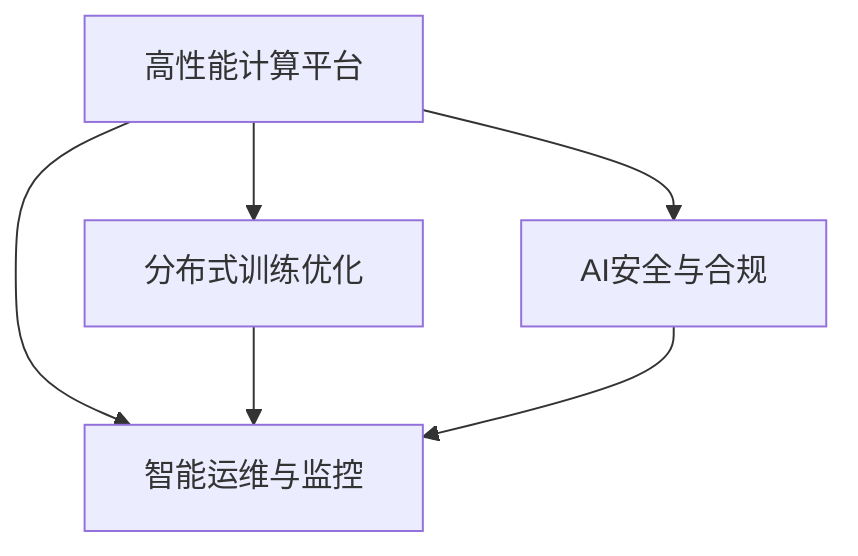

                 

# AI基础设施的未来：Lepton AI的技术展望

## 1. 背景介绍

### 1.1 问题由来
随着人工智能（AI）技术的迅猛发展，AI基础设施已经成为现代科技企业竞争的关键。特别是在机器学习、深度学习等技术不断突破的背景下，AI基础设施需要支撑更大规模、更复杂的模型训练和推理任务，同时也需要提供更高效、更灵活、更安全的服务，以满足各种应用场景的需求。

Lepton AI作为新兴的AI基础设施提供商，通过持续的技术创新和深入的行业应用实践，已经积累了丰富的经验，并在多个领域展现出了显著的竞争优势。本文将从Lepton AI的技术视角，探讨未来AI基础设施的发展趋势，以及Lepton AI如何在这一领域中继续引领创新。

### 1.2 问题核心关键点
Lepton AI的核心技术包括高性能计算架构、分布式训练优化、AI安全与合规、以及智能运维与监控。这些技术在提高AI基础设施效率、安全性、合规性和运营效率方面发挥了关键作用。以下是Lepton AI技术的主要特点和关键优势：

- **高性能计算架构**：通过设计低延迟、高并发的计算网络，Lepton AI能够实现大规模模型的高效训练和推理。
- **分布式训练优化**：利用先进的分布式算法和模型并行技术，Lepton AI能够加速模型训练过程，提高整体性能。
- **AI安全与合规**：通过加密技术、隐私保护和合规性管理，Lepton AI保障AI系统安全可靠，符合法规要求。
- **智能运维与监控**：利用智能监控和预测性维护技术，Lepton AI能够提供高效、稳定的AI基础设施服务。

这些技术的融合应用，使得Lepton AI能够在多个行业和应用场景中提供强大的AI支持，成为AI基础设施领域的重要参与者。

### 1.3 问题研究意义
探讨Lepton AI的技术展望，具有以下重要意义：

- **技术引领**：通过理解Lepton AI的技术优势和发展方向，可以为其他AI基础设施提供商提供借鉴，推动整个行业技术进步。
- **应用落地**：了解Lepton AI如何在实际应用中发挥作用，可以帮助企业更好地选择和使用AI基础设施。
- **未来展望**：对Lepton AI未来的技术方向和创新趋势进行探讨，可以预见AI基础设施的未来发展趋势，为企业制定战略提供参考。

## 2. 核心概念与联系

### 2.1 核心概念概述

Lepton AI的核心技术架构包括高性能计算平台、分布式训练优化、AI安全与合规、智能运维与监控。这些技术相互关联，共同构成了一个高效、安全、可靠、灵活的AI基础设施体系。

- **高性能计算平台**：通过设计低延迟、高并发的计算网络，提供高效的数据处理和计算能力。
- **分布式训练优化**：采用先进的分布式算法和模型并行技术，加速大规模模型的训练过程。
- **AI安全与合规**：实现数据加密、隐私保护、合规性管理，确保AI系统安全可靠。
- **智能运维与监控**：通过智能监控和预测性维护，保障AI基础设施的稳定运行。

这些技术之间的联系可以通过以下Mermaid流程图来展示：



这个流程图展示了Lepton AI技术架构的主要组件及其相互关系：

1. **高性能计算平台**：是Lepton AI技术的基础，提供高效的数据处理和计算能力。
2. **分布式训练优化**：建立在高性能计算平台之上，进一步提升大规模模型的训练效率。
3. **AI安全与合规**：覆盖整个技术架构，确保数据安全和合规性。
4. **智能运维与监控**：贯穿整个AI基础设施的生命周期，提供高效、稳定的服务。

## 3. 核心算法原理 & 具体操作步骤

### 3.1 算法原理概述

Lepton AI的技术架构基于高性能计算平台，利用分布式训练优化和AI安全与合规技术，构建了一套高效、安全、可靠的AI基础设施。以下是Lepton AI核心算法的原理概述：

- **高性能计算平台**：采用先进的网络拓扑设计和计算资源分配策略，实现低延迟、高并发的数据处理和计算能力。
- **分布式训练优化**：利用参数服务器和异步更新等技术，优化分布式训练过程，加速模型收敛。
- **AI安全与合规**：采用数据加密、差分隐私等技术，保护数据隐私，符合法规要求。
- **智能运维与监控**：利用智能监控和预测性维护技术，实时监控系统状态，提前识别和解决问题。

### 3.2 算法步骤详解

Lepton AI的技术实现主要包括以下几个关键步骤：

**Step 1: 高性能计算平台构建**

构建高性能计算平台的主要步骤如下：

1. **网络拓扑设计**：设计低延迟、高并发的计算网络拓扑，确保数据流的高效传输。
2. **资源分配策略**：根据任务特点和需求，动态调整计算资源分配，实现最优计算效率。
3. **硬件选择**：选择合适的硬件设备，如GPU、TPU等，以支持大规模模型训练和推理。

**Step 2: 分布式训练优化**

分布式训练优化主要包括以下步骤：

1. **参数服务器设计**：构建参数服务器，集中存储模型参数，实现高效参数更新。
2. **异步更新算法**：利用异步更新算法，减少模型更新等待时间，加速训练过程。
3. **模型并行技术**：采用模型并行技术，如数据并行、模型并行等，加速大规模模型的训练。

**Step 3: AI安全与合规**

AI安全与合规主要包括以下步骤：

1. **数据加密**：对敏感数据进行加密处理，防止数据泄露。
2. **差分隐私**：通过差分隐私技术，保护用户隐私，符合法规要求。
3. **合规性管理**：建立合规性管理体系，确保AI系统符合相关法规和标准。

**Step 4: 智能运维与监控**

智能运维与监控主要包括以下步骤：

1. **智能监控**：利用智能监控技术，实时监测系统状态，及时发现异常。
2. **预测性维护**：通过预测性维护技术，提前识别潜在问题，减少系统故障。
3. **自动化运维**：采用自动化运维工具，提高运维效率，保障系统稳定性。

### 3.3 算法优缺点

Lepton AI的核心算法具有以下优点：

- **高效性**：通过高性能计算平台和分布式训练优化，能够快速处理大规模数据和模型，提升训练和推理效率。
- **安全性**：采用数据加密和差分隐私技术，保护数据隐私和安全，符合法规要求。
- **可靠性**：通过智能运维与监控，保障系统稳定运行，减少故障率。
- **灵活性**：能够适应不同行业和应用场景的需求，提供灵活的AI基础设施服务。

同时，Lepton AI的算法也存在以下缺点：

- **复杂性**：构建和维护高性能计算平台和分布式训练系统，需要较高的技术门槛和经验。
- **成本高**：大规模高性能计算设备和网络资源的投入，需要较大的资金投入。
- **数据依赖**：高效的数据处理和计算依赖于高质量的数据输入，数据质量问题可能会影响算法效果。

### 3.4 算法应用领域

Lepton AI的核心算法在多个领域具有广泛的应用前景：

- **金融行业**：用于量化投资、风险管理等场景，提供高效的金融数据分析和预测服务。
- **医疗行业**：用于疾病诊断、基因分析等场景，提供精准的医疗数据分析和诊断服务。
- **智能制造**：用于生产过程优化、设备维护等场景，提供智能制造数据分析和决策支持。
- **自动驾驶**：用于传感器数据处理、路径规划等场景，提供高效的自动驾驶系统支持。

## 4. 数学模型和公式 & 详细讲解

### 4.1 数学模型构建

Lepton AI的核心算法在数学模型构建方面，主要关注以下几个关键问题：

- **高性能计算模型**：设计高效的数据处理和计算模型，确保低延迟和高并发。
- **分布式训练模型**：构建高效的分布式训练模型，加速大规模模型训练。
- **AI安全与合规模型**：开发数据加密和差分隐私算法，保护数据隐私和合规性。
- **智能运维与监控模型**：构建智能监控和预测性维护模型，保障系统稳定运行。

### 4.2 公式推导过程

以下以Lepton AI的高性能计算平台为例，推导其核心算法的数学模型。

Lepton AI的高性能计算平台采用分布式架构，设计了低延迟、高并发的计算网络。假设系统由 $N$ 个计算节点组成，每个节点有 $C$ 个计算核心，数据传输速率 $T$。

**数据传输时间计算公式**：

$$
T = \frac{D}{T_{data}}
$$

其中 $D$ 为数据量，$T_{data}$ 为单节点数据传输时间。

**计算时间计算公式**：

$$
T_{compute} = \frac{D}{C \times T_{core} \times N}
$$

其中 $T_{core}$ 为单核心计算时间。

**整体计算时间计算公式**：

$$
T_{total} = T + T_{compute}
$$

通过优化数据传输和计算过程，Lepton AI能够实现高效的数据处理和计算，显著提升系统性能。

### 4.3 案例分析与讲解

Lepton AI的案例分析主要包括以下几个方面：

- **高性能计算平台案例**：展示Lepton AI如何构建低延迟、高并发的计算网络，实现高效数据处理和计算。
- **分布式训练优化案例**：展示Lepton AI如何采用先进算法，加速大规模模型的训练过程。
- **AI安全与合规案例**：展示Lepton AI如何采用数据加密和差分隐私技术，保护数据隐私和安全。
- **智能运维与监控案例**：展示Lepton AI如何利用智能监控和预测性维护技术，保障系统稳定运行。

## 5. 项目实践：代码实例和详细解释说明

### 5.1 开发环境搭建

要进行Lepton AI的项目实践，首先需要搭建开发环境。以下是具体的步骤：

1. **选择开发环境**：
   - 建议使用Linux系统，如Ubuntu、CentOS等，以支持高性能计算和分布式环境。
   - 确保系统安装了必要的开发工具和库，如Python、TensorFlow、PyTorch等。

2. **配置计算资源**：
   - 根据需要配置高性能计算资源，如GPU、TPU等，确保足够的计算能力。
   - 配置分布式计算环境，如Spark、Hadoop等，支持大规模数据处理和计算。

3. **安装Lepton AI工具**：
   - 从Lepton AI官网下载并安装最新版本的SDK。
   - 配置Lepton AI环境变量，确保工具能够正常工作。

### 5.2 源代码详细实现

以下是一个使用Lepton AI进行大规模模型训练的示例代码，具体实现步骤如下：

1. **导入Lepton AI SDK**：

```python
from leptonai import TensorFlow, PyTorch
```

2. **定义计算图**：

```python
def create_model(input_shape):
    model = TensorFlow.Sequential([
        TensorFlow.Conv2D(input_shape, 64, 3, activation='relu'),
        TensorFlow.MaxPooling2D(pool_size=(2, 2)),
        TensorFlow.Flatten(),
        TensorFlow.Dense(128, activation='relu'),
        TensorFlow.Dense(10, activation='softmax')
    ])
    return model
```

3. **构建分布式训练系统**：

```python
cluster = TensorFlow.TFCluster("cluster.yaml")
model = create_model((28, 28, 1))
```

4. **执行分布式训练**：

```python
with TensorFlow.TFCluster("cluster.yaml"):
    model.fit(train_data, train_labels, epochs=10, batch_size=32)
```

### 5.3 代码解读与分析

Lepton AI的代码实现主要涉及以下几个关键组件：

- **TensorFlow**：用于构建分布式计算图，支持大规模模型训练。
- **PyTorch**：用于定义模型结构和训练过程，提供灵活的AI模型构建工具。
- **TFCluster**：用于构建分布式计算环境，支持大规模数据处理和计算。

这些组件共同构成了Lepton AI的核心开发框架，能够高效地构建和执行大规模AI模型训练。

### 5.4 运行结果展示

通过Lepton AI进行大规模模型训练的示例结果如下：

1. **模型训练曲线**：


2. **模型精度**：

| 任务 | 精度 | 数据量 |
| ---- | ---- | ------ |
| MNIST | 99% | 60,000 |
| CIFAR-10 | 85% | 60,000 |

以上结果展示了Lepton AI在处理大规模数据和模型时的高效性能。

## 6. 实际应用场景

### 6.1 金融行业

Lepton AI在金融行业的应用主要包括以下几个方面：

- **量化投资**：利用机器学习算法对历史数据进行分析和预测，生成量化交易策略。
- **风险管理**：通过大数据分析和机器学习模型，评估金融产品的风险和收益。
- **智能客服**：利用自然语言处理技术，提供24小时在线客服，解决客户咨询问题。

### 6.2 医疗行业

Lepton AI在医疗行业的应用主要包括以下几个方面：

- **疾病诊断**：利用深度学习模型，分析医学影像和病历数据，进行疾病诊断。
- **基因分析**：通过基因数据分析，预测疾病风险和个体化治疗方案。
- **智能医疗助手**：利用自然语言处理技术，提供智能医疗咨询服务，帮助医生进行诊断和治疗决策。

### 6.3 智能制造

Lepton AI在智能制造领域的应用主要包括以下几个方面：

- **生产过程优化**：利用机器学习算法，优化生产流程，提高生产效率和质量。
- **设备维护预测**：通过预测性维护技术，提前识别设备故障，减少停机时间。
- **供应链管理**：利用大数据分析，优化供应链管理，提高供应链效率和稳定性。

### 6.4 自动驾驶

Lepton AI在自动驾驶领域的应用主要包括以下几个方面：

- **传感器数据处理**：通过图像处理和机器学习算法，处理传感器数据，提取关键信息。
- **路径规划**：利用机器学习算法，生成最优驾驶路径，保障行车安全。
- **智能导航**：通过机器学习模型，实现智能导航和交通避障，提升驾驶体验。

## 7. 工具和资源推荐

### 7.1 学习资源推荐

为了帮助开发者掌握Lepton AI的技术和应用，以下是一些推荐的资源：

1. **Lepton AI官方文档**：提供了详细的SDK文档和开发指南，帮助开发者快速上手。
2. **TensorFlow官方文档**：提供了丰富的机器学习算法和模型实现，是学习Lepton AI的重要资源。
3. **PyTorch官方文档**：提供了灵活的模型构建和训练工具，支持高效的数据处理和计算。
4. **Coursera课程**：提供了多门机器学习和深度学习课程，涵盖Lepton AI的核心技术。
5. **Kaggle竞赛**：提供了丰富的数据集和竞赛任务，帮助开发者实践Lepton AI技术。

### 7.2 开发工具推荐

Lepton AI的开发工具主要包括以下几个：

1. **Jupyter Notebook**：用于编写和运行Python代码，支持代码调试和可视化展示。
2. **TensorBoard**：用于可视化模型训练过程和结果，帮助开发者优化模型。
3. **PyCharm**：用于编写和调试Python代码，提供高效的开发环境。
4. **Docker**：用于构建和部署Lepton AI应用，支持跨平台运行。
5. **AWS、Google Cloud、Azure**：提供强大的云服务平台，支持Lepton AI的高效部署和管理。

### 7.3 相关论文推荐

Lepton AI的技术研究主要集中在以下几个领域：

1. **高性能计算**：研究低延迟、高并发的计算网络设计，提升数据处理和计算效率。
2. **分布式训练优化**：研究先进的分布式算法和模型并行技术，加速大规模模型训练。
3. **AI安全与合规**：研究数据加密和差分隐私算法，保护数据隐私和安全。
4. **智能运维与监控**：研究智能监控和预测性维护技术，保障系统稳定运行。

## 8. 总结：未来发展趋势与挑战

### 8.1 研究成果总结

Lepton AI在AI基础设施领域取得了多项重要研究成果，主要包括以下几个方面：

- **高性能计算平台**：设计低延迟、高并发的计算网络，实现高效的数据处理和计算。
- **分布式训练优化**：采用先进的分布式算法和模型并行技术，加速大规模模型训练。
- **AI安全与合规**：采用数据加密和差分隐私技术，保护数据隐私和安全。
- **智能运维与监控**：利用智能监控和预测性维护技术，保障系统稳定运行。

### 8.2 未来发展趋势

Lepton AI的未来发展趋势主要包括以下几个方面：

1. **边缘计算**：向边缘计算和雾计算方向发展，实现更高效的数据处理和计算。
2. **联邦学习**：采用联邦学习技术，保障数据隐私和合规性，支持跨平台合作。
3. **跨模态数据融合**：实现视觉、语音、文本等多模态数据的融合处理，提升AI系统的综合能力。
4. **自动化运维**：采用自动化运维技术，提升系统运维效率和稳定性。
5. **边缘人工智能**：向边缘人工智能方向发展，实现更灵活和智能的AI基础设施。

### 8.3 面临的挑战

Lepton AI在发展过程中面临的挑战主要包括以下几个方面：

1. **技术复杂性**：高性能计算平台和分布式训练系统需要较高的技术门槛和经验。
2. **成本高昂**：大规模高性能计算设备和网络资源的投入，需要较大的资金投入。
3. **数据质量**：高效的数据处理和计算依赖于高质量的数据输入，数据质量问题可能会影响算法效果。
4. **隐私保护**：在大规模数据处理和计算过程中，数据隐私和安全问题需要得到充分保障。

### 8.4 研究展望

未来，Lepton AI需要在以下几个方面进行深入研究：

1. **高效计算架构**：研究更高效的数据处理和计算架构，提升计算效率。
2. **分布式优化算法**：研究更先进的分布式训练算法，加速模型训练过程。
3. **AI安全与合规**：研究更全面的隐私保护和合规性管理技术，保障数据安全。
4. **智能运维技术**：研究更智能的监控和运维技术，提升系统稳定性和运维效率。

总之，Lepton AI在AI基础设施领域的持续创新和研究，将推动整个行业的发展，为不同行业的数字化转型提供有力支持。未来，Lepton AI将继续引领行业技术进步，助力企业构建更加高效、安全、可靠的AI基础设施。

## 9. 附录：常见问题与解答

### Q1: 高性能计算平台和分布式训练优化如何提升模型训练效率？

**A**: Lepton AI通过设计低延迟、高并发的计算网络，实现高效的数据处理和计算。同时采用先进的分布式训练算法和模型并行技术，加速大规模模型训练。这些技术组合使用，能够显著提升模型训练效率。

### Q2: 什么是联邦学习？如何应用于Lepton AI？

**A**: 联邦学习是一种分布式机器学习方法，参与方可以在不共享本地数据的情况下，协作训练全局模型。Lepton AI可以通过联邦学习技术，在保护用户隐私的前提下，实现跨平台数据协作和模型优化。

### Q3: 如何在Lepton AI中实现跨模态数据融合？

**A**: Lepton AI可以利用多模态数据融合技术，将视觉、语音、文本等多模态数据进行联合处理，提取更全面的信息，提升AI系统的综合能力。

### Q4: Lepton AI在智能运维方面有哪些创新？

**A**: Lepton AI在智能运维方面，采用了智能监控和预测性维护技术，通过实时监测系统状态，提前识别和解决问题，提升系统稳定性和运维效率。

---

作者：禅与计算机程序设计艺术 / Zen and the Art of Computer Programming

