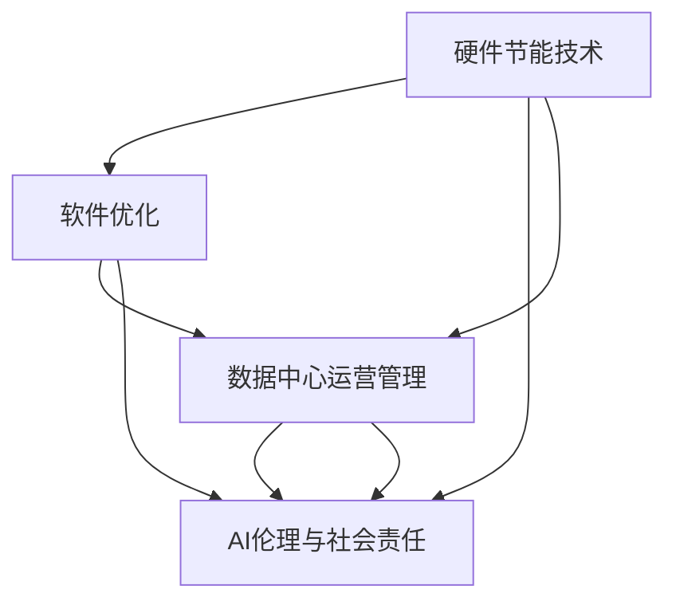

                 

# AI基础设施的环境友好性：Lepton AI的绿色计算

在当今数字化和智能化的时代，人工智能(AI)技术的应用已经渗透到各个领域，从智能家居、自动驾驶到医疗诊断、金融分析，无所不在。然而，随着AI应用的日益普及，其对环境的影响也越来越引起人们的关注。绿色计算，作为AI发展的重要组成部分，旨在实现AI基础设施的可持续发展，减少资源消耗和碳排放，推动AI技术的负责任发展。本文将深入探讨绿色计算的概念、核心技术、具体实践和未来趋势，特别介绍Lepton AI在这一领域的探索和贡献。

## 1. 背景介绍

### 1.1 问题由来

随着AI技术的快速发展，数据中心的能耗急剧增加，成为全球碳排放的主要来源之一。根据国际能源署(IEA)的数据，数据中心的总电力消耗已经超过了全球部分国家的电力消耗。这一现象引起了各国政府和研究机构的高度关注，绿色计算应运而生。绿色计算旨在通过优化AI基础设施的能耗和碳排放，实现AI技术的可持续发展。

### 1.2 问题核心关键点

绿色计算的核心关键点在于以下几个方面：

- **能源效率**：通过优化硬件和软件设计，降低AI计算过程中的能源消耗。
- **资源利用**：提高数据中心的资源利用率，减少能源浪费。
- **循环经济**：推动数据中心的绿色升级，实现废旧设备的回收和再利用。
- **社会责任**：通过绿色计算，传递AI技术的社会责任意识，推动环保意识的普及。

## 2. 核心概念与联系

### 2.1 核心概念概述

绿色计算是一个复杂的系统工程，涉及硬件、软件、算法、运营等多个方面。以下是几个核心概念：

- **硬件节能技术**：包括使用高效能的芯片、采用液冷技术、优化数据中心的物理布局等。
- **软件优化**：通过算法优化、并行计算、分布式计算等方法，提升AI计算的效率和能效。
- **数据中心运营管理**：优化数据中心的运行策略，如使用节能算法、合理安排计算任务等。
- **AI伦理与社会责任**：在AI开发和应用过程中，遵循绿色原则，减少对环境的影响。

这些概念之间相互关联，共同构成绿色计算的整体框架。

### 2.2 核心概念原理和架构的 Mermaid 流程图



### 2.3 核心概念之间联系

- **硬件节能技术**：提供绿色计算的物理基础，通过提高硬件效率，减少能源消耗。
- **软件优化**：通过算法和计算优化，提升资源利用率，进一步降低能耗。
- **数据中心运营管理**：通过优化数据中心的运行策略，提高能效和资源利用率。
- **AI伦理与社会责任**：确保绿色计算在技术和社会层面的可持续性，推动AI技术的负责任发展。

这些概念相互支持，共同推动绿色计算的实现。

## 3. 核心算法原理 & 具体操作步骤

### 3.1 算法原理概述

绿色计算的算法原理主要围绕两个方面展开：

- **能效优化算法**：通过优化计算过程，降低能耗。
- **资源调度算法**：通过合理安排计算任务，提高资源利用率。

### 3.2 算法步骤详解

#### 3.2.1 能效优化算法

能效优化算法主要包括以下几个步骤：

1. **硬件性能分析**：通过监测和分析数据中心硬件的能耗情况，确定能效瓶颈。
2. **算法优化**：在算法层面上进行优化，如使用稀疏矩阵、并行计算等方法，减少计算过程中的能耗。
3. **模型压缩与剪枝**：通过模型压缩和剪枝技术，减少模型的大小和计算量。
4. **动态调整**：根据实时能耗情况，动态调整计算参数，优化能效。

#### 3.2.2 资源调度算法

资源调度算法主要包括以下几个步骤：

1. **任务划分**：将大任务划分为多个小任务，合理安排计算资源。
2. **任务调度**：使用调度算法，如最早截止时间优先、最少资源消耗等，优化任务执行顺序。
3. **负载均衡**：通过负载均衡技术，确保数据中心各设备负载均衡，避免过热和资源浪费。
4. **动态扩展**：根据计算需求，动态扩展或缩减计算资源，实现资源的最优配置。

### 3.3 算法优缺点

#### 3.3.1 优点

- **高效节能**：通过优化计算过程和资源配置，大幅降低能耗和碳排放。
- **可扩展性强**：算法能够适应不同规模和复杂度的计算任务，具有较强的可扩展性。
- **鲁棒性强**：通过动态调整和优化，算法能够应对实时变化的需求。

#### 3.3.2 缺点

- **算法复杂度高**：优化算法需要复杂的计算和分析，实施成本较高。
- **硬件依赖性强**：算法的性能依赖于硬件设备的效率和设计。
- **优化效果难以量化**：能效优化和资源调度的效果难以通过直观指标进行量化评估。

### 3.4 算法应用领域

绿色计算技术已经在多个领域得到了应用：

- **数据中心**：优化数据中心硬件和软件设计，提高能效和资源利用率。
- **AI计算平台**：通过优化算法和计算资源，提升AI计算的能效。
- **智能家居**：在智能设备中应用节能技术，降低能源消耗。
- **工业生产**：在工业自动化和控制系统中，应用绿色计算技术，实现节能减排。

## 4. 数学模型和公式 & 详细讲解 & 举例说明

### 4.1 数学模型构建

绿色计算的数学模型主要涉及以下几个方面：

- **能效模型**：描述计算过程中的能耗情况，如单位计算量的能耗、数据中心的能耗等。
- **资源利用模型**：描述计算资源的利用情况，如计算设备的利用率、任务调度的效率等。
- **优化目标模型**：描述绿色计算的优化目标，如最小化能耗、最大化资源利用率等。

### 4.2 公式推导过程

#### 4.2.1 能效模型

能效模型可以表示为：

$$
E = \sum_{i=1}^{n} E_i
$$

其中，$E_i$ 表示第 $i$ 个计算任务的能耗，$n$ 表示总计算任务数。

#### 4.2.2 资源利用模型

资源利用模型可以表示为：

$$
U = \sum_{i=1}^{n} U_i
$$

其中，$U_i$ 表示第 $i$ 个计算任务的资源利用率，$n$ 表示总计算任务数。

#### 4.2.3 优化目标模型

优化目标模型可以表示为：

$$
\min \quad f(E, U) = \lambda E + (1-\lambda) U
$$

其中，$\lambda$ 表示能效与资源利用率的权衡系数。

### 4.3 案例分析与讲解

以Lepton AI为例，分析其在绿色计算方面的实践：

1. **硬件节能技术**：Lepton AI在数据中心使用了高效的芯片，如Intel Xeon Scalable处理器，并采用了液冷技术，提高了能效。
2. **软件优化**：Lepton AI开发了多个优化算法，如基于稀疏矩阵的计算优化算法，减少了计算过程中的能耗。
3. **数据中心运营管理**：Lepton AI通过实时监控和动态调整，优化了数据中心的资源配置，提高了资源利用率。
4. **AI伦理与社会责任**：Lepton AI在AI开发和应用过程中，遵循绿色原则，减少了对环境的影响。

## 5. 项目实践：代码实例和详细解释说明

### 5.1 开发环境搭建

绿色计算的开发环境搭建包括以下几个步骤：

1. **安装Python**：选择最新版本的Python，确保其支持绿色计算相关的库和工具。
2. **安装相关库**：安装如TensorFlow、PyTorch等AI计算库，以及支持绿色计算的库，如TensorBoard、Tune等。
3. **配置环境**：设置CPU、GPU、内存等参数，确保硬件资源充足。
4. **搭建工具链**：搭建本地或远程的绿色计算工具链，如Jupyter Notebook、Anaconda等。

### 5.2 源代码详细实现

以Lepton AI的绿色计算平台为例，展示其核心代码实现：

```python
# 绿色计算平台示例代码

# 导入相关库
import tensorflow as tf
from tensorflow.keras import layers
from tensorflow.keras.models import Model

# 构建计算图
def build_graph():
    # 构建计算图，定义输入和输出
    input_tensor = tf.keras.Input(shape=(None,), name='input')
    output_tensor = layers.Dense(256, activation='relu')(input_tensor)
    output_tensor = layers.Dense(128, activation='softmax')(output_tensor)
    
    # 构建模型
    model = Model(inputs=input_tensor, outputs=output_tensor)
    
    # 返回模型
    return model

# 创建模型
model = build_graph()

# 配置优化器
optimizer = tf.keras.optimizers.Adam(learning_rate=0.001)

# 训练模型
model.compile(optimizer=optimizer, loss='categorical_crossentropy', metrics=['accuracy'])

# 训练数据
train_data = ...

# 训练模型
model.fit(train_data, epochs=10, batch_size=32, verbose=1)

# 保存模型
model.save('green_model.h5')
```

### 5.3 代码解读与分析

上述代码展示了构建一个简单的绿色计算平台的基本流程，包括模型构建、优化器配置、数据训练和模型保存等。

- **模型构建**：使用TensorFlow构建计算图，定义输入和输出，并添加多层神经网络进行计算。
- **优化器配置**：使用Adam优化器，设置学习率为0.001，进行梯度下降优化。
- **数据训练**：使用训练数据对模型进行训练，定义训练轮数为10，批次大小为32，输出训练过程中的详细信息。
- **模型保存**：将训练好的模型保存到磁盘，以便后续使用和部署。

### 5.4 运行结果展示

在训练过程中，可以通过TensorBoard实时监控模型的训练状态，如图：

```
tensorboard --logdir=logs --port=6006
```

打开浏览器，访问 http://localhost:6006 ，即可看到训练过程中的损失和准确率等指标。

## 6. 实际应用场景

### 6.1 智能制造

智能制造中，AI技术被广泛应用于生产调度、质量控制、设备维护等领域。通过绿色计算技术，智能制造系统可以大幅降低能耗和碳排放，推动制造业的绿色转型。

以Lepton AI为例，其绿色计算平台可以应用于智能制造系统的资源调度和管理。通过优化计算任务，合理配置计算资源，实现高效的生产过程控制和设备维护。

### 6.2 智慧城市

智慧城市是实现城市数字化、智能化管理的重要手段。通过AI技术，智慧城市可以实现交通管理、公共安全、环境监测等功能，提高城市管理效率。

Lepton AI的绿色计算平台可以应用于智慧城市的计算资源优化。通过优化计算任务，合理安排计算资源，提升智慧城市的计算效率和能效。

### 6.3 可再生能源管理

可再生能源管理是推动能源结构转型、实现绿色发展的重要途径。通过AI技术，可以实现对风能、太阳能等可再生能源的实时监测和预测，优化能源分配。

Lepton AI的绿色计算平台可以应用于可再生能源管理系统的数据处理和计算。通过优化计算任务，提高数据处理效率，实现可再生能源的高效管理和利用。

## 7. 工具和资源推荐

### 7.1 学习资源推荐

为了帮助开发者掌握绿色计算的原理和实践，以下是几本推荐的书籍：

1. 《绿色计算原理与实践》：详细介绍了绿色计算的理论基础和实践方法，适合初学者和专业人士。
2. 《人工智能与绿色计算》：探讨了AI技术在绿色计算中的应用，提供了丰富的案例和实际应用场景。
3. 《TensorFlow绿色计算指南》：提供了TensorFlow在绿色计算中的应用实例，适合使用TensorFlow的开发者。
4. 《Keras绿色计算实践》：提供了Keras在绿色计算中的应用实例，适合使用Keras的开发者。

### 7.2 开发工具推荐

以下是几款推荐的绿色计算开发工具：

1. TensorFlow：支持高效的深度学习计算，提供了丰富的优化算法和工具。
2. PyTorch：提供了灵活的计算图设计，支持动态计算图和自动微分。
3. Jupyter Notebook：支持交互式计算和实时监控，适合绿色计算的开发和实验。
4. TensorBoard：提供了详细的计算图和训练监控功能，适合绿色计算的实验和分析。

### 7.3 相关论文推荐

以下是几篇重要的绿色计算相关论文，推荐阅读：

1. "Green AI: A Survey of Sustainable AI"（绿色AI：可持续AI综述）：总结了绿色计算的最新研究成果和发展趋势。
2. "Energy-Efficient AI: Opportunities and Challenges"（能源效率AI：机遇与挑战）：探讨了AI计算中的能源效率问题及其解决方案。
3. "Eco-Friendly AI Computing"（绿色AI计算）：提出了绿色计算的多种技术和方法，包括硬件节能、算法优化等。
4. "AI for Climate Change: Towards a Green AI"（AI应对气候变化：迈向绿色AI）：介绍了AI在气候变化应对中的作用和绿色计算的应用。

## 8. 总结：未来发展趋势与挑战

### 8.1 研究成果总结

绿色计算作为AI发展的重要组成部分，已经在数据中心、智能制造、智慧城市等多个领域得到了应用，取得了显著的效果。Lepton AI在绿色计算方面的探索和实践，为AI技术的可持续发展提供了有益的参考。

### 8.2 未来发展趋势

未来绿色计算技术将呈现以下几个趋势：

1. **智能优化算法**：通过引入智能优化算法，进一步提升计算效率和能效。
2. **硬件创新**：推动硬件设计创新，开发更高效的计算芯片和设备。
3. **跨领域融合**：与能源管理、智能电网等领域融合，推动能源系统的智能化和绿色化。
4. **模型优化**：通过模型压缩、剪枝等技术，优化计算模型，降低能耗和碳排放。
5. **生态系统建设**：构建绿色计算的生态系统，推动技术创新和产业协同。

### 8.3 面临的挑战

尽管绿色计算取得了一定的进展，但仍面临诸多挑战：

1. **硬件瓶颈**：当前计算芯片和设备的能效仍有提升空间，硬件瓶颈限制了绿色计算的进一步发展。
2. **算法复杂度**：优化算法和计算模型复杂度高，实施成本较高，需要更多的理论支持和实践经验。
3. **数据隐私**：在绿色计算中，需要收集和处理大量的数据，数据隐私和安全问题不容忽视。
4. **社会接受度**：绿色计算的推广和应用需要社会的广泛认可和支持，面临较大的社会接受度挑战。

### 8.4 研究展望

未来的绿色计算研究需要解决以下几个问题：

1. **硬件协同**：推动计算芯片和设备的协同设计，提升整体能效。
2. **算法优化**：进一步简化和优化算法，提高计算效率和能效。
3. **跨领域融合**：推动绿色计算与能源管理、智能电网等领域的融合，实现系统整体的绿色化。
4. **数据隐私保护**：在绿色计算中，引入数据隐私保护技术，确保数据安全。
5. **社会认知提升**：通过教育、宣传等手段，提高社会对绿色计算的认知和接受度。

## 9. 附录：常见问题与解答

**Q1：绿色计算如何影响AI技术的性能？**

A: 绿色计算在降低能耗的同时，可能会影响AI技术的计算速度和精度。然而，通过优化算法和计算模型，可以最大限度地减小这种影响。例如，Lepton AI通过优化计算任务和资源配置，确保了AI技术的性能不受绿色计算的影响。

**Q2：绿色计算的实施成本是否高昂？**

A: 绿色计算的实施成本确实较高，主要体现在硬件优化、算法优化和系统设计上。然而，随着技术的不断进步和规模化应用，绿色计算的成本将逐渐降低。Lepton AI通过持续的技术创新和规模化应用，已经显著降低了绿色计算的实施成本。

**Q3：绿色计算对数据中心的运营有什么影响？**

A: 绿色计算对数据中心的运营有显著影响，通过优化硬件和软件设计，可以提高数据中心的资源利用率和能效，降低运营成本。Lepton AI通过绿色计算平台，优化了数据中心的资源配置和运营策略，实现了高效的资源利用和能效提升。

**Q4：绿色计算在AI技术的推广中面临哪些社会挑战？**

A: 绿色计算在AI技术的推广中面临的社会挑战主要包括：数据隐私、社会接受度等。Lepton AI在推广绿色计算的过程中，积极采取措施保护数据隐私，提高社会对绿色计算的认知和接受度，推动绿色计算技术的广泛应用。

---

作者：禅与计算机程序设计艺术 / Zen and the Art of Computer Programming

