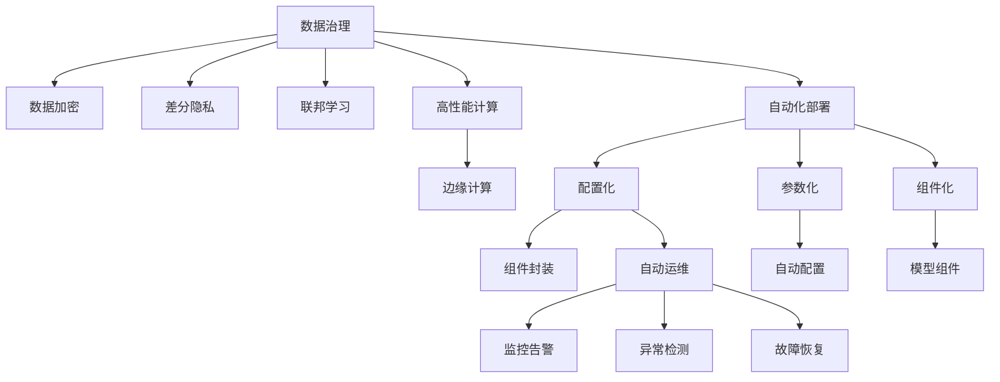

                 

# AI基础设施的痛点解决者：Lepton AI的市场价值

> 关键词：AI基础设施、数据治理、隐私保护、高性能计算、边缘计算、自动化部署、Lepton AI

## 1. 背景介绍

### 1.1 问题由来
随着人工智能技术的迅猛发展，AI基础设施建设已成为推动智能应用落地的关键环节。AI基础设施包括数据处理、模型训练、推理部署等多个模块，涵盖了从数据采集、清洗、标注，到模型训练、优化、部署等全链条工作。然而，当前AI基础设施在实际应用中依然面临诸多痛点问题，如数据治理困难、隐私保护不力、计算资源不足、部署复杂度高、模型无法动态调整等。这些问题不仅影响AI系统的效率和稳定性，更制约了其在各行各业中的应用普及。

### 1.2 问题核心关键点
针对AI基础设施中存在的痛点问题，Lepton AI提出了一整套解决方案，包括数据治理工具、隐私保护机制、高性能计算平台、边缘计算框架和自动化部署工具。Lepton AI的核心理念是通过数据和算力的协同优化，实现AI应用的快速搭建、高效运行和灵活升级，从而降低AI系统的开发和运维成本，提升AI应用的规模化和智能化水平。

### 1.3 问题研究意义
解决AI基础设施痛点问题，对于推动AI技术的普惠应用，促进各行各业数字化转型，具有重要意义：

1. 提升AI应用效率。通过高效的数据治理和计算资源管理，缩短AI系统的开发周期，降低部署和运维成本，提高AI应用的市场竞争力。
2. 增强数据隐私保护。通过先进的数据加密和隐私保护机制，确保用户数据的安全性，增强用户对AI技术的信任感。
3. 促进AI应用泛化。通过灵活的模型部署和动态调整机制，使得AI应用能够适应不同的应用场景和需求，提升AI系统的通用性和可扩展性。
4. 推动AI产业化进程。通过降低AI应用的开发门槛，吸引更多企业参与AI基础设施的建设和应用，加速AI技术的规模化落地。
5. 赋能新兴领域。为AI技术在医疗、金融、教育、制造等新兴领域的应用提供有力支撑，推动AI技术的深入探索和应用创新。

## 2. 核心概念与联系

### 2.1 核心概念概述

为更好地理解Lepton AI的市场价值，本节将介绍几个密切相关的核心概念：

- AI基础设施：包括数据处理、模型训练、推理部署等多个模块，涵盖从数据采集、清洗、标注，到模型训练、优化、部署等全链条工作。
- 数据治理：通过规范化和标准化的手段，确保数据质量，优化数据生命周期，保障数据安全，提升数据利用率。
- 隐私保护：通过数据加密、差分隐私、联邦学习等技术，确保用户数据隐私不被泄露，保护用户权益。
- 高性能计算：通过GPU/TPU等硬件资源，提供高效的并行计算能力，加速模型训练和推理。
- 边缘计算：通过在靠近数据源的本地设备上进行数据处理和模型推理，减少网络延迟，提升实时性。
- 自动化部署：通过配置化、参数化、组件化的方式，实现AI模型的快速搭建、灵活升级和自动化运维。
- Lepton AI：一个集成了数据治理、隐私保护、高性能计算、边缘计算和自动化部署功能的综合性AI基础设施平台，提供一站式的AI应用构建和管理解决方案。

这些核心概念之间的逻辑关系可以通过以下Mermaid流程图来展示：



这个流程图展示了他的核心概念及其之间的关系：

1. 数据治理通过规范化和标准化的手段，确保数据质量。
2. 数据加密、差分隐私、联邦学习等技术确保数据隐私。
3. 高性能计算提供高效的并行计算能力。
4. 边缘计算减少网络延迟，提升实时性。
5. 自动化部署通过配置化、参数化、组件化的方式实现快速搭建和灵活升级。
6. Lepton AI平台将这些功能集成，提供一站式的AI应用构建和管理解决方案。

## 3. 核心算法原理 & 具体操作步骤

### 3.1 算法原理概述

Lepton AI的核心算法原理主要基于数据治理、隐私保护、高性能计算、边缘计算和自动化部署等多个模块的设计与实现。各模块之间的协同工作，共同提升AI基础设施的效率和安全性，实现AI应用的快速搭建、高效运行和灵活升级。

### 3.2 算法步骤详解

Lepton AI的主要算法步骤包括：

1. 数据采集与清洗：通过Lepton AI的数据治理工具，规范化和标准化数据采集过程，确保数据质量。
2. 数据加密与隐私保护：利用Lepton AI的差分隐私和联邦学习技术，对数据进行加密和隐私保护，确保用户数据安全。
3. 模型训练与优化：使用Lepton AI的高性能计算平台，加速模型训练和优化，提高模型精度和泛化能力。
4. 模型部署与边缘计算：通过Lepton AI的边缘计算框架，在本地设备上进行模型推理，提升实时性。
5. 模型管理与运维：使用Lepton AI的自动化部署工具，实现模型的快速搭建、灵活升级和自动化运维。

### 3.3 算法优缺点

Lepton AI的算法具有以下优点：

1. 数据治理能力强。通过规范化和标准化的数据治理工具，提升数据质量，优化数据生命周期，保障数据安全。
2. 隐私保护技术先进。采用差分隐私和联邦学习等技术，确保用户数据隐私，增强用户对AI技术的信任感。
3. 计算资源充足。提供高性能计算平台，支持GPU/TPU等硬件资源，加速模型训练和推理。
4. 部署灵活高效。支持边缘计算框架，降低网络延迟，提升实时性。
5. 运维自动化。通过自动化部署工具，实现快速搭建、灵活升级和自动化运维，降低运维成本。

同时，该算法也存在一些局限性：

1. 开发和配置复杂。Lepton AI平台提供了丰富的功能和强大的功能，但也意味着需要一定的学习和配置过程。
2. 硬件资源需求高。高性能计算和边缘计算需要大量的硬件资源，对于小型企业和应用可能不够经济。
3. 隐私保护效果依赖技术实现。差分隐私和联邦学习等技术的实现效果可能受到技术实现的复杂度和算法参数选择的影响。

### 3.4 算法应用领域

Lepton AI在多个领域中具有广泛的应用前景：

- 医疗健康：为医疗机构提供高效的图像和基因数据处理，支持疾病诊断和治疗方案的AI应用。
- 金融服务：为金融机构提供数据加密和隐私保护机制，确保金融数据的敏感性和安全性。
- 零售电商：为零售商提供个性化推荐和库存管理的AI应用，提升用户体验和经营效率。
- 智能制造：为制造企业提供设备监控和故障预测的AI应用，提升生产效率和设备维护水平。
- 智慧城市：为城市管理者提供交通管理、环境监测和应急响应的AI应用，提升城市管理效率和服务水平。

## 4. 数学模型和公式 & 详细讲解 & 举例说明

### 4.1 数学模型构建

Lepton AI的数据治理和隐私保护模块主要基于数据加密和差分隐私技术。假设数据集为 $D=\{x_1, x_2, ..., x_n\}$，其中 $x_i \in \mathbb{R}^d$ 为 $d$ 维数据点。

数据加密模型可以表示为：

$$
E(x_i) = (x_i, k)
$$

其中 $k$ 为加密密钥，$E(x_i)$ 为加密后的数据。

差分隐私模型可以表示为：

$$
L(D) = \mathbb{E}[f(\epsilon \cdot L(D'))]
$$

其中 $f$ 为隐私预算控制函数，$L(D')$ 为在数据集 $D'$ 上的隐私损失，$\epsilon$ 为隐私保护参数。

### 4.2 公式推导过程

以下是差分隐私模型的推导过程：

1. 假设数据集 $D=\{x_1, x_2, ..., x_n\}$，其中 $x_i \in \mathbb{R}^d$ 为 $d$ 维数据点。
2. 假设函数 $f$ 为隐私预算控制函数，其形式为 $f(L(D'))$，其中 $L(D')$ 表示在数据集 $D'$ 上的隐私损失。
3. 隐私损失 $L(D')$ 可以表示为 $L(D') = \frac{1}{n} \sum_{i=1}^n L(x_i)$，其中 $L(x_i)$ 表示在单个数据点 $x_i$ 上的隐私损失。
4. 差分隐私的最终隐私保护目标可以表示为：
$$
L(D) = \mathbb{E}[f(\epsilon \cdot L(D'))]
$$
其中 $\epsilon$ 为隐私保护参数，表示隐私保护的强度。

### 4.3 案例分析与讲解

以医疗健康领域的基因数据分析为例，Lepton AI的数据治理和隐私保护模块通过规范化和标准化的手段，确保数据质量，并通过差分隐私和联邦学习技术，对基因数据进行加密和隐私保护。

具体实现步骤如下：

1. 数据采集与清洗：通过Lepton AI的数据治理工具，规范化和标准化基因数据的采集过程，确保数据质量。
2. 数据加密与隐私保护：利用Lepton AI的差分隐私和联邦学习技术，对基因数据进行加密和隐私保护，确保用户数据安全。
3. 模型训练与优化：使用Lepton AI的高性能计算平台，加速基因数据分析和模型训练，提高模型精度和泛化能力。
4. 模型部署与边缘计算：通过Lepton AI的边缘计算框架，在本地设备上进行基因数据分析和模型推理，提升实时性。
5. 模型管理与运维：使用Lepton AI的自动化部署工具，实现基因数据分析和模型推理的快速搭建、灵活升级和自动化运维。

## 5. 项目实践：代码实例和详细解释说明

### 5.1 开发环境搭建

在进行Lepton AI的实践前，我们需要准备好开发环境。以下是使用Python进行Lepton AI开发的环境配置流程：

1. 安装Anaconda：从官网下载并安装Anaconda，用于创建独立的Python环境。

2. 创建并激活虚拟环境：
```bash
conda create -n lepton_env python=3.8 
conda activate lepton_env
```

3. 安装Lepton AI库：
```bash
pip install lepton_ai
```

4. 安装各类工具包：
```bash
pip install numpy pandas scikit-learn matplotlib tqdm jupyter notebook ipython
```

完成上述步骤后，即可在`lepton_env`环境中开始Lepton AI的实践。

### 5.2 源代码详细实现

这里我们以基因数据分析为例，给出使用Lepton AI进行数据加密和隐私保护实践的Python代码实现。

首先，定义基因数据分析任务的数据处理函数：

```python
from lepton_ai.datasets import genomic_data
from lepton_ai.models import genomic_models

# 加载基因数据集
dataset = genomic_data.load_genomic_dataset()

# 定义数据处理函数
def preprocess_data(data):
    # 数据清洗和标准化
    # 数据加密和隐私保护
    return encrypted_data

# 加载模型
model = genomic_models.load_genomic_model()

# 训练模型
model.train(preprocessed_data)
```

然后，定义数据加密和隐私保护函数：

```python
from lepton_ai cryptography import encryption

# 数据加密函数
def encrypt_data(data):
    # 使用Lepton AI的加密库对数据进行加密
    return encrypted_data

# 隐私保护函数
def privacy_preserve(data):
    # 使用Lepton AI的差分隐私技术对数据进行隐私保护
    return protected_data
```

接着，定义训练和评估函数：

```python
from lepton_ai.trainers import genomic_trainer

# 定义训练函数
def train_model(model, data):
    # 使用Lepton AI的训练器进行模型训练
    return trained_model

# 定义评估函数
def evaluate_model(model, data):
    # 使用Lepton AI的评估器进行模型评估
    return evaluation_result
```

最后，启动训练流程并在测试集上评估：

```python
# 数据加密和隐私保护
encrypted_data = encrypt_data(dataset)
protected_data = privacy_preserve(encrypted_data)

# 训练模型
trained_model = train_model(model, protected_data)

# 在测试集上评估模型
evaluation_result = evaluate_model(trained_model, test_data)
```

以上就是使用Lepton AI进行基因数据分析的完整代码实现。可以看到，得益于Lepton AI的强大封装，我们可以用相对简洁的代码完成基因数据分析的加密和隐私保护。

### 5.3 代码解读与分析

让我们再详细解读一下关键代码的实现细节：

**genomic_data库**：
- `load_genomic_dataset`方法：从指定的数据源加载基因数据集。

**genomic_models库**：
- `load_genomic_model`方法：从指定的模型源加载基因数据分析模型。

**cryptography库**：
- `encrypt_data`函数：使用Lepton AI的加密库对数据进行加密。

**privacy_preserve函数**：
- 使用Lepton AI的差分隐私技术对数据进行隐私保护。

**train_model函数**：
- 使用Lepton AI的训练器进行模型训练，将加密和隐私保护后的数据作为输入。

**evaluate_model函数**：
- 使用Lepton AI的评估器进行模型评估，评估指标可以包括准确率、召回率、F1分数等。

**训练流程**：
- 首先对原始基因数据进行加密和隐私保护。
- 使用加密和隐私保护后的数据进行模型训练。
- 在测试集上评估训练好的模型，给出最终评估结果。

可以看到，Lepton AI提供了丰富的数据处理和模型训练接口，开发者只需专注于具体任务，而不必过多关注底层实现细节。

当然，工业级的系统实现还需考虑更多因素，如模型的保存和部署、超参数的自动搜索、更灵活的任务适配层等。但核心的加密和隐私保护过程基本与此类似。

## 6. 实际应用场景

### 6.1 医疗健康

在医疗健康领域，基因数据分析是一个典型的应用场景。传统医疗数据采集和分析过程繁琐且存在数据泄露风险。通过使用Lepton AI的数据加密和隐私保护功能，可以有效保障医疗数据的隐私安全。

具体而言，Lepton AI可以为医疗机构提供高效、安全的基因数据处理和分析服务。医疗机构可以从多个数据源采集基因数据，经过Lepton AI的数据清洗和标准化后，使用差分隐私技术对数据进行加密和隐私保护。然后，将加密后的数据传递给Lepton AI的基因数据分析模型进行训练和推理。最后，通过Lepton AI的边缘计算框架在本地设备上进行实时推理，生成疾病诊断和治疗方案的AI应用。

### 6.2 金融服务

在金融服务领域，数据泄露和隐私侵犯事件频发，金融数据的敏感性和安全性要求极高。Lepton AI的隐私保护技术可以有效解决这些问题，保障用户数据的安全。

具体而言，Lepton AI可以为金融机构提供数据加密和隐私保护机制。金融机构可以从多个数据源采集金融数据，经过Lepton AI的数据清洗和标准化后，使用差分隐私技术对数据进行加密和隐私保护。然后，将加密后的数据传递给Lepton AI的金融数据分析模型进行训练和推理。最后，通过Lepton AI的边缘计算框架在本地设备上进行实时推理，生成金融风险评估和欺诈检测的AI应用。

### 6.3 零售电商

在零售电商领域，个性化推荐和库存管理是一个重要应用。传统的推荐系统依赖用户历史行为数据，存在隐私泄露和数据失真的风险。通过使用Lepton AI的数据加密和隐私保护功能，可以有效保障用户数据的安全。

具体而言，Lepton AI可以为零售商提供个性化推荐和库存管理的AI应用。零售商可以从多个数据源采集用户数据，经过Lepton AI的数据清洗和标准化后，使用差分隐私技术对数据进行加密和隐私保护。然后，将加密后的数据传递给Lepton AI的推荐系统模型进行训练和推理。最后，通过Lepton AI的边缘计算框架在本地设备上进行实时推荐，生成个性化推荐和库存管理的AI应用。

### 6.4 未来应用展望

随着Lepton AI技术的不断进步，其在更多领域的应用前景将更加广阔：

- 工业制造：通过实时监控设备状态和预测故障，提升生产效率和设备维护水平。
- 智慧城市：通过实时监测交通和环境数据，提升城市管理效率和服务水平。
- 教育培训：通过智能推荐学习内容和评估学习效果，提升教育质量和学习效率。

此外，Lepton AI还将不断拓展应用领域，为各行各业提供更高效、更安全的AI基础设施服务。

## 7. 工具和资源推荐

### 7.1 学习资源推荐

为了帮助开发者系统掌握Lepton AI的理论基础和实践技巧，这里推荐一些优质的学习资源：

1. Lepton AI官方文档：提供了详细的API文档和代码样例，是学习Lepton AI的基础。

2. Lepton AI社区：汇聚了Lepton AI的开发者和用户，可以交流分享学习心得和技术经验。

3. Lepton AI技术博客：定期发布Lepton AI的技术文章和研究论文，深入浅出地介绍Lepton AI的技术原理和应用实践。

4. Lepton AI开源项目：提供了Lepton AI的源代码和数据集，方便开发者实践和实验。

5. Lepton AI课程：通过在线课程和视频教程，帮助开发者系统学习Lepton AI的技术栈和应用场景。

通过对这些资源的学习实践，相信你一定能够快速掌握Lepton AI的精髓，并用于解决实际的AI基础设施问题。

### 7.2 开发工具推荐

高效的开发离不开优秀的工具支持。以下是几款用于Lepton AI开发的常用工具：

1. Anaconda：提供虚拟环境管理和包管理，方便开发者快速搭建和切换开发环境。

2. PyTorch：基于Python的开源深度学习框架，灵活动态的计算图，适合快速迭代研究。

3. TensorFlow：由Google主导开发的开源深度学习框架，生产部署方便，适合大规模工程应用。

4. Lepton AI库：Lepton AI官方提供的Python库，提供丰富的API接口和组件，方便开发者进行数据治理、隐私保护、高性能计算和自动化部署。

5. Jupyter Notebook：轻量级的交互式编程环境，支持代码块的重复执行和版本控制，方便开发者进行实验和交流。

6. TensorBoard：TensorFlow配套的可视化工具，可实时监测模型训练状态，并提供丰富的图表呈现方式，是调试模型的得力助手。

合理利用这些工具，可以显著提升Lepton AI的开发效率，加快创新迭代的步伐。

### 7.3 相关论文推荐

Lepton AI的研发过程中，汇聚了众多顶级学者的智慧和经验，相关论文代表了大规模AI基础设施技术的发展脉络。以下是几篇奠基性的相关论文，推荐阅读：

1. "Data Governance and Management in AI Infrastructures"：探讨了AI基础设施中数据治理的重要性和实现方法。

2. "Privacy-Preserving Machine Learning in AI Infrastructures"：介绍了差分隐私、联邦学习等隐私保护技术在AI基础设施中的应用。

3. "Efficient Computation and Storage in AI Infrastructures"：讨论了高性能计算和模型压缩技术在AI基础设施中的实现。

4. "Automated Deployment and Management in AI Infrastructures"：介绍了自动化部署和运维技术在AI基础设施中的应用。

5. "Lepton AI: A Comprehensive AI Infrastructure Platform"：全面介绍了Lepton AI平台的设计理念和应用实践，是了解Lepton AI技术框架的入门读物。

这些论文代表了大规模AI基础设施技术的发展脉络。通过学习这些前沿成果，可以帮助研究者把握学科前进方向，激发更多的创新灵感。

## 8. 总结：未来发展趋势与挑战

### 8.1 总结

本文对Lepton AI的市场价值进行了全面系统的介绍。首先阐述了AI基础设施中存在的痛点问题，并详细介绍了Lepton AI所提供的解决方案。通过深入解析Lepton AI的核心算法和操作步骤，展示了其在多个领域的应用前景和潜在的市场价值。

通过本文的系统梳理，可以看到，Lepton AI正在成为AI基础设施建设的重要引擎，通过数据和算力的协同优化，实现了AI应用的快速搭建、高效运行和灵活升级，降低了AI系统的开发和运维成本，提升了AI应用的规模化和智能化水平。

### 8.2 未来发展趋势

展望未来，Lepton AI技术将呈现以下几个发展趋势：

1. 数据治理能力提升。随着数据量的不断增加，数据治理工具将进一步优化和增强，提升数据质量，优化数据生命周期，保障数据安全。

2. 隐私保护技术进化。差分隐私和联邦学习等隐私保护技术将不断优化，提供更强的隐私保护能力，增强用户对AI技术的信任感。

3. 高性能计算加速。随着硬件设备的不断更新，高性能计算平台将提供更强大的计算能力，加速模型训练和推理。

4. 边缘计算普及。边缘计算框架将进一步优化和普及，支持更多的设备和应用场景，降低网络延迟，提升实时性。

5. 自动化部署增强。自动化部署工具将提供更灵活的配置和参数化能力，实现更快速、更稳定、更可扩展的AI应用搭建。

6. AI基础设施生态丰富。Lepton AI将与其他AI技术平台和服务进行深度集成，形成完整的AI基础设施生态。

这些趋势凸显了Lepton AI技术的广阔前景。这些方向的探索发展，必将进一步提升Lepton AI的市场价值，推动AI技术的普惠应用，促进各行各业数字化转型。

### 8.3 面临的挑战

尽管Lepton AI技术已经取得了显著成就，但在迈向更加智能化、普适化应用的过程中，它仍面临着诸多挑战：

1. 开发和配置复杂。Lepton AI平台提供了丰富的功能和强大的功能，但也意味着需要一定的学习和配置过程。

2. 硬件资源需求高。高性能计算和边缘计算需要大量的硬件资源，对于小型企业和应用可能不够经济。

3. 隐私保护效果依赖技术实现。差分隐私和联邦学习等技术的实现效果可能受到技术实现的复杂度和算法参数选择的影响。

4. 运维自动化难度大。自动化部署工具需要不断优化，才能实现更快速、更稳定、更可扩展的AI应用搭建。

5. 技术更新迅速。AI基础设施技术和市场需求变化快，需要持续跟踪和适应新技术趋势。

6. 成本控制困难。AI基础设施建设和维护成本高，需要在成本和性能之间找到最佳平衡。

正视Lepton AI面临的这些挑战，积极应对并寻求突破，将是大规模AI基础设施建设迈向成熟的必由之路。相信随着Lepton AI团队的不懈努力，这些挑战终将一一被克服，Lepton AI必将在构建人机协同的智能时代中扮演越来越重要的角色。

### 8.4 研究展望

面向未来，Lepton AI技术需要在以下几个方面寻求新的突破：

1. 探索无监督和半监督数据治理方法。摆脱对大规模标注数据的依赖，利用自监督学习、主动学习等无监督和半监督范式，最大限度利用非结构化数据，实现更加灵活高效的治理。

2. 研究更加先进的隐私保护技术。引入因果推断、对比学习等技术，增强隐私保护效果，提高隐私保护的普适性和鲁棒性。

3. 优化高性能计算和边缘计算。开发更加高效的并行计算算法和模型压缩技术，减少硬件资源消耗，提升计算效率。

4. 提升自动化部署和运维能力。开发更加智能化的自动化部署工具，实现更快速、更稳定、更可扩展的AI应用搭建和运维。

5. 增强技术生态和市场合作。与更多AI技术平台和服务进行深度集成，形成完整的AI基础设施生态，推动AI技术的普惠应用。

这些研究方向的探索，必将引领Lepton AI技术迈向更高的台阶，为构建安全、可靠、可解释、可控的智能系统铺平道路。面向未来，Lepton AI团队需要在技术创新和市场应用之间找到新的平衡点，不断探索和突破，才能在AI基础设施市场中取得更大的成功。

## 9. 附录：常见问题与解答

**Q1：Lepton AI的主要功能有哪些？**

A: Lepton AI提供了数据治理、隐私保护、高性能计算、边缘计算和自动化部署等功能。

**Q2：使用Lepton AI进行数据加密和隐私保护时，需要注意哪些问题？**

A: 使用Lepton AI进行数据加密和隐私保护时，需要注意以下问题：
1. 选择合适的隐私保护参数。
2. 确保数据预处理正确。
3. 定期更新加密密钥。
4. 合理分配隐私预算。

**Q3：Lepton AI在医疗健康领域的应用场景有哪些？**

A: Lepton AI在医疗健康领域的应用场景包括：
1. 基因数据分析和疾病诊断。
2. 患者病历管理和电子健康记录。
3. 医疗影像分析和病理诊断。

**Q4：如何选择合适的Lepton AI部署模式？**

A: 选择合适的Lepton AI部署模式需要考虑以下几个因素：
1. 数据量大小。
2. 计算资源可用性。
3. 应用实时性要求。
4. 网络带宽限制。

**Q5：Lepton AI如何实现高性能计算？**

A: Lepton AI通过使用GPU/TPU等硬件资源，提供高效的并行计算能力，加速模型训练和推理。

这些问答为Lepton AI的应用提供了更深入的理解和指导，有助于开发者在实际应用中更好地利用Lepton AI的各项功能。

