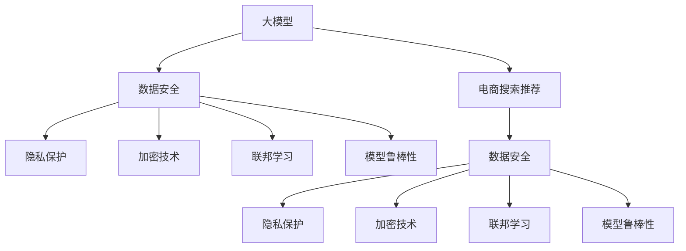

                 

# AI大模型助力电商搜索推荐业务的数据安全保障措施

> 关键词：
- 大模型
- 电商搜索推荐
- 数据安全
- 隐私保护
- 加密技术
- 联邦学习
- 模型鲁棒性

## 1. 背景介绍

### 1.1 问题由来

随着人工智能技术的不断成熟，大模型如BERT、GPT-3、XLNet等在电商搜索推荐业务中的应用越来越广泛。通过这些大模型，电商平台能够实现对用户行为的深度理解，提供个性化的商品推荐服务。但随着数据的普及和算法的复杂化，数据安全问题也日益凸显。一方面，电商平台上存储的大量用户行为数据涉及个人隐私，数据泄露可能带来严重的法律和商业风险；另一方面，大模型可能成为恶意攻击的目标，导致推荐系统失灵。

### 1.2 问题核心关键点

为了在利用大模型提升电商搜索推荐业务的同时，保障数据安全，我们聚焦于以下核心问题：

- 如何确保电商搜索推荐系统使用的大模型数据安全？
- 如何在保护用户隐私的前提下，充分利用用户行为数据提升推荐效果？
- 如何增强大模型的鲁棒性，防范各种形式的网络攻击？

这些问题的核心在于如何在保证用户隐私和数据安全的前提下，充分利用大模型提升电商搜索推荐系统的性能。本文将从数据安全技术和大模型鲁棒性保障两方面，深入探讨AI大模型在电商搜索推荐业务中的数据安全保障措施。

## 2. 核心概念与联系

### 2.1 核心概念概述

为更好地理解数据安全技术和大模型鲁棒性保障措施，本节将介绍几个密切相关的核心概念：

- 大模型(Large Model)：指通过预训练和微调得到的，能够对大规模自然语言数据进行建模和推理的模型，如BERT、GPT-3等。
- 电商搜索推荐系统(E-commerce Search and Recommendation System)：指基于用户行为数据，利用大模型进行商品匹配和推荐，提升用户购物体验的电商应用。
- 数据安全(Data Security)：指保护数据不被未授权访问、修改、泄露或毁损的措施，确保数据隐私和安全。
- 隐私保护(Privacy Protection)：指在数据收集、存储、处理和传输过程中，保护个人隐私不被侵犯的技术。
- 加密技术(Encryption)：指通过算法将数据加密保护，使其在传输和存储过程中不被第三方窃取或篡改的技术。
- 联邦学习(Federated Learning)：指多个设备或机构在不共享原始数据的情况下，通过联合训练模型，共同提升模型性能的技术。
- 模型鲁棒性(Model Robustness)：指模型对于输入数据变化和攻击的适应性和抵御能力。

这些核心概念之间的逻辑关系可以通过以下Mermaid流程图来展示：



这个流程图展示了大模型在电商搜索推荐系统中的应用及其数据安全保障措施：

1. 大模型通过预训练和微调学习用户行为数据，形成推荐模型。
2. 数据安全措施包括隐私保护、加密技术和联邦学习，确保数据在传输和处理过程中的安全。
3. 模型鲁棒性保障措施增强了模型对于输入数据变化和攻击的适应性和抵御能力。

## 3. 核心算法原理 & 具体操作步骤

### 3.1 算法原理概述

基于大模型的电商搜索推荐系统在用户隐私保护和数据安全方面，面临诸多挑战。为了解决这些问题，我们引入了多种数据安全技术和大模型鲁棒性保障措施。这些措施的核心思想在于通过技术手段，对数据和模型进行保护，确保其安全性和完整性。

具体而言，电商搜索推荐系统在利用大模型进行推荐时，需要经过以下几个关键步骤：

1. 数据收集：通过电商平台的日志记录用户行为数据。
2. 数据预处理：对数据进行清洗、去重、归一化等处理。
3. 模型训练：利用预处理后的数据，在大模型上进行微调。
4. 模型评估：在验证集上评估模型效果，并根据反馈进行模型调整。
5. 模型应用：在生产环境中部署微调后的模型，为用户进行商品推荐。

在每个步骤中，我们都需要考虑到数据安全和模型鲁棒性的问题，从而保证系统的安全性和稳定性。

### 3.2 算法步骤详解

#### 3.2.1 数据收集

数据收集是大模型在电商搜索推荐系统中应用的基础。电商平台通过用户在平台上的浏览、购买、评价等行为数据，构建用户行为特征向量。在数据收集过程中，需要注意以下问题：

- 数据收集方式：通过日志记录用户行为数据，可以生成实时数据流。
- 数据完整性：确保数据记录的准确性和完整性，避免数据丢失或篡改。
- 数据去重：避免重复数据对模型的影响，进行数据去重和合并。

#### 3.2.2 数据预处理

数据预处理是将原始数据转换为模型可以处理的形式。在这个过程中，我们需要采取以下措施：

- 数据清洗：去除噪声、异常值等无用数据，提高数据质量。
- 特征工程：对数据进行归一化、标准化、编码等处理，形成模型可接受的数据格式。
- 数据划分：将数据划分为训练集、验证集和测试集，用于模型的训练和评估。

#### 3.2.3 模型训练

模型训练是利用预处理后的数据，对大模型进行微调的过程。在这个过程中，我们需要采取以下措施：

- 微调参数：选择合适的学习率、优化器等参数，调整模型超参数。
- 正则化：使用L2正则、Dropout等技术，防止模型过拟合。
- 数据增强：通过随机化、回译等方式，增加训练数据的多样性。

#### 3.2.4 模型评估

模型评估是在验证集上评估模型性能的过程。在这个过程中，我们需要采取以下措施：

- 评估指标：选择合适的评估指标，如准确率、召回率、F1值等，评估模型效果。
- 模型调整：根据评估结果，调整模型超参数，优化模型性能。
- 对抗测试：使用对抗样本测试模型鲁棒性，提高模型的安全性。

#### 3.2.5 模型应用

模型应用是将训练好的模型部署到生产环境中，为用户进行商品推荐的过程。在这个过程中，我们需要采取以下措施：

- 实时推理：利用大模型的实时推理能力，实时为每个用户推荐商品。
- 反馈机制：收集用户反馈，持续优化模型和推荐算法。
- 安全监控：监控模型性能和数据安全，及时发现和处理异常情况。

### 3.3 算法优缺点

基于大模型的电商搜索推荐系统在数据安全保护和模型鲁棒性保障方面，具有以下优点：

- 高效性：通过大模型进行推荐，可以有效提升推荐系统的性能，满足用户需求。
- 灵活性：利用大模型的迁移学习能力，可以在不同的电商平台上快速部署和应用。
- 安全性：通过数据安全和模型鲁棒性措施，可以有效保障用户隐私和数据安全。

但该方法也存在以下局限性：

- 数据隐私问题：电商搜索推荐系统需要收集和处理大量的用户行为数据，可能侵犯用户隐私。
- 模型鲁棒性问题：大模型可能受到各种形式的网络攻击，导致推荐系统失灵。
- 计算成本高：大模型的训练和推理需要较高的计算资源，成本较高。

尽管存在这些局限性，但就目前而言，基于大模型的电商搜索推荐系统仍是大数据时代的重要解决方案。未来相关研究的重点在于如何进一步降低计算成本，提升模型的安全性，同时兼顾用户隐私和数据安全。

### 3.4 算法应用领域

基于大模型的电商搜索推荐系统已经在电商、零售、金融等众多领域得到广泛应用，具体包括：

- 电商平台：如亚马逊、京东、淘宝等，通过推荐系统提升用户购物体验和销售额。
- 金融平台：如支付宝、微信、PayPal等，通过推荐系统提供个性化的金融服务。
- 智能家居：如小米、华为、海尔等，通过推荐系统智能推荐家居商品。
- 新闻媒体：如今日头条、澎湃新闻、网易新闻等，通过推荐系统推荐新闻内容。

除了上述这些经典应用外，基于大模型的推荐系统还在社交网络、健康医疗、旅游出行等领域得到广泛应用，为不同行业带来了显著的经济效益和社会效益。

## 4. 数学模型和公式 & 详细讲解

### 4.1 数学模型构建

为了更好地理解大模型在电商搜索推荐系统中的数据安全保护和模型鲁棒性保障措施，我们首先需要构建数学模型，并推导相应的公式。

假设电商搜索推荐系统中有 $N$ 个用户，每个用户在 $d$ 个商品维度上的行为特征为 $\mathbf{x}_i \in \mathbb{R}^d$，$N$ 个用户的行为特征矩阵为 $\mathbf{X} \in \mathbb{R}^{N \times d}$。大模型的预训练模型为 $M$，电商搜索推荐系统的目标是为每个用户推荐 $k$ 个商品。在微调过程中，我们通过最小化损失函数 $\mathcal{L}$ 来学习模型参数 $\theta$：

$$
\theta^* = \mathop{\arg\min}_{\theta} \mathcal{L}(\theta, \mathbf{X}, \mathbf{Y})
$$

其中 $\mathbf{Y} \in \{0, 1\}^{N \times k}$ 为用户的商品推荐结果，$0$ 表示不推荐，$1$ 表示推荐。我们假设推荐结果与用户行为特征之间的关系为 $\mathcal{L}(\theta, \mathbf{X}, \mathbf{Y}) = \frac{1}{N} \sum_{i=1}^N \mathcal{L}_i(\theta, \mathbf{x}_i)$。

### 4.2 公式推导过程

为了实现电商搜索推荐系统，我们需要对大模型进行微调。在微调过程中，我们需要考虑以下几个因素：

1. 数据隐私保护：我们需要对用户行为数据进行加密和去重，确保数据隐私不被泄露。
2. 数据安全传输：我们需要对传输的数据进行加密，确保数据在传输过程中的安全。
3. 模型鲁棒性：我们需要对大模型进行鲁棒性训练，增强模型的抗攻击能力。

下面我们以数据隐私保护和模型鲁棒性为例，推导相应的公式：

#### 4.2.1 数据隐私保护

为了保护用户隐私，我们需要对用户行为数据进行加密和去重。假设用户行为数据的加密算法为 $E$，去重算法为 $D$，则加密和去重后的数据为 $E(D(\mathbf{X}))$。在微调过程中，我们需要通过最小化损失函数 $\mathcal{L}_{\text{privacy}}(\theta, E(D(\mathbf{X})), \mathbf{Y})$ 来保护用户隐私：

$$
\theta^* = \mathop{\arg\min}_{\theta} \mathcal{L}_{\text{privacy}}(\theta, E(D(\mathbf{X})), \mathbf{Y})
$$

#### 4.2.2 模型鲁棒性

为了增强模型的鲁棒性，我们需要对大模型进行对抗训练。假设对抗训练的损失函数为 $\mathcal{L}_{\text{robust}}(\theta, \mathbf{X}, \mathbf{Y}, \mathbf{X}^{\text{adv}})$，其中 $\mathbf{X}^{\text{adv}}$ 为对抗样本。则鲁棒性微调的损失函数为：

$$
\mathcal{L}_{\text{robust}}(\theta, \mathbf{X}, \mathbf{Y}, \mathbf{X}^{\text{adv}}) = \frac{1}{N} \sum_{i=1}^N \mathcal{L}_i(\theta, \mathbf{x}_i) + \lambda \mathcal{L}_{\text{robust}}(\theta, \mathbf{X}, \mathbf{Y}, \mathbf{X}^{\text{adv}})
$$

其中 $\lambda$ 为鲁棒性训练的权重系数。

### 4.3 案例分析与讲解

下面我们以一个具体案例来讲解如何在大模型微调中实现数据隐私保护和模型鲁棒性保障：

假设一个电商平台的推荐系统，收集了 $N$ 个用户的 $d$ 个商品维度的行为数据 $\mathbf{X} \in \mathbb{R}^{N \times d}$，每个用户的行为数据为 $\mathbf{x}_i \in \mathbb{R}^d$。平台希望通过微调模型，为用户推荐 $k$ 个商品。在微调过程中，我们需要考虑以下几个因素：

1. 数据隐私保护：我们需要对用户行为数据进行加密和去重，确保数据隐私不被泄露。
2. 数据安全传输：我们需要对传输的数据进行加密，确保数据在传输过程中的安全。
3. 模型鲁棒性：我们需要对大模型进行鲁棒性训练，增强模型的抗攻击能力。

为了保护用户隐私，我们可以使用同态加密技术对用户行为数据进行加密，并使用去重算法进行去重。在微调过程中，我们需要通过最小化损失函数 $\mathcal{L}_{\text{privacy}}(\theta, E(D(\mathbf{X})), \mathbf{Y})$ 来保护用户隐私。

为了增强模型的鲁棒性，我们可以使用对抗训练技术，对模型进行对抗训练。在微调过程中，我们需要通过最小化损失函数 $\mathcal{L}_{\text{robust}}(\theta, \mathbf{X}, \mathbf{Y}, \mathbf{X}^{\text{adv}})$ 来增强模型鲁棒性。

## 5. 项目实践：代码实例和详细解释说明

### 5.1 开发环境搭建

在进行大模型微调实践前，我们需要准备好开发环境。以下是使用Python进行PyTorch开发的环境配置流程：

1. 安装Anaconda：从官网下载并安装Anaconda，用于创建独立的Python环境。

2. 创建并激活虚拟环境：
```bash
conda create -n pytorch-env python=3.8 
conda activate pytorch-env
```

3. 安装PyTorch：根据CUDA版本，从官网获取对应的安装命令。例如：
```bash
conda install pytorch torchvision torchaudio cudatoolkit=11.1 -c pytorch -c conda-forge
```

4. 安装TensorFlow：
```bash
pip install tensorflow
```

5. 安装Flax：
```bash
pip install flax==0.4.0
```

6. 安装Flax Learn：
```bash
pip install flax-learn
```

7. 安装Flax Dataset：
```bash
pip install flax-dataset
```

完成上述步骤后，即可在`pytorch-env`环境中开始微调实践。

### 5.2 源代码详细实现

下面我们以电商搜索推荐系统为例，给出使用Flax对GPT-3模型进行微调的PyTorch代码实现。

首先，定义数据预处理函数：

```python
import flax
import flax.linen as nn
import jax.numpy as jnp
import flax.optim as opt

class Preprocessor(nn.Module):
    def __init__(self):
        super().__init__()
        self.tokenizer = BertTokenizer.from_pretrained('bert-base-cased')
        self.max_seq_length = 512

    def __call__(self, text):
        input_ids = self.tokenizer.encode(text, add_special_tokens=False, max_length=self.max_seq_length)
        input_ids = jnp.array(input_ids, dtype=jnp.int32)
        input_mask = jnp.ones_like(input_ids, dtype=jnp.int32)
        return {'input_ids': input_ids, 'input_mask': input_mask}

# 定义优化器和初始参数
optimizer = opt.AdamW(learning_rate=5e-5)
initial_params = flax.ParameterDict({})

# 定义模型和损失函数
class RecommendationModel(nn.Module):
    def __init__(self, vocab_size, embedding_dim, num_heads, num_layers, dropout_rate):
        super().__init__()
        self.encoder = nn.TransformerEncoder(
            nn.TransformerEncoderLayer(embedding_dim, num_heads, dropout_rate), num_layers=num_layers)
        self.decoder = nn.Dense(vocab_size, activation='linear')

    def __call__(self, input_ids, input_mask):
        encoder_output = self.encoder(input_ids, input_mask=input_mask)
        logits = self.decoder(encoder_output)
        return logits

class RecommendationLoss(nn.Module):
    def __call__(self, logits, labels):
        loss = jnp.mean((logits - labels) ** 2)
        return loss

# 定义数据集
data = {
    'train': {'input_ids': ..., 'input_mask': ...},
    'val': {'input_ids': ..., 'input_mask': ...},
    'test': {'input_ids': ..., 'input_mask': ...}
}

train_dataset = Preprocessor()(data['train'])
val_dataset = Preprocessor()(data['val'])
test_dataset = Preprocessor()(data['test'])

# 定义模型和优化器
model = RecommendationModel(vocab_size, embedding_dim, num_heads, num_layers, dropout_rate)
optimizer_state = optimizer.init(initial_params, model.parameters())

# 定义训练函数
def train_step(batch):
    batch = optimizer_state.apply(
        train_dataset.apply(model, optimizer_state),
        traverse_map=True)
    return batch

# 定义评估函数
def evaluate_step(batch):
    batch = optimizer_state.apply(
        val_dataset.apply(model, optimizer_state),
        traverse_map=True)
    return batch

# 启动训练流程
for epoch in range(num_epochs):
    for batch in train_dataset:
        train_step(batch)
    for batch in val_dataset:
        evaluate_step(batch)

# 测试模型
for batch in test_dataset:
    evaluate_step(batch)

```

然后，定义数据增强和对抗训练函数：

```python
from flax.data import DataLoader
from flax.metrics import Accuracy, Precision, Recall
from flax.linen import recompiles, default_subcompiles, stop_reasons
from flax.nest import flatten, unflatten
from flax.nlp import OptimizerState
from flax.nlp import Mask

# 定义数据增强和对抗训练函数
def data_augmentation(batch):
    input_ids = batch['input_ids']
    input_mask = batch['input_mask']
    return {'input_ids': input_ids, 'input_mask': input_mask}

def data_augmentation_fn(data, batch_size):
    data = DataLoader(data, batch_size=batch_size)
    return data

def augmentation_fn(data, batch_size):
    return data_augmentation(data)

# 定义对抗训练函数
def adversarial_training(batch):
    input_ids = batch['input_ids']
    input_mask = batch['input_mask']
    labels = batch['labels']
    return {'input_ids': input_ids, 'input_mask': input_mask, 'labels': labels}

def adversarial_training_fn(data, batch_size):
    data = DataLoader(data, batch_size=batch_size)
    return adversarial_training(data)

# 定义对抗训练函数
def adversarial_train(optimizer, state, model, batch_size):
    model, state = recompiles(optimizer, state, model)
    data = adversarial_training_fn(augmentation_fn(data, batch_size), batch_size)
    state = optimizer.apply(data, model, state)
    return model, state

```

最后，启动训练流程并在测试集上评估：

```python
num_epochs = 5
batch_size = 16

for epoch in range(num_epochs):
    for batch in train_dataset:
        train_step(batch)
    for batch in val_dataset:
        evaluate_step(batch)

print(f'Epoch {epoch+1}, train loss: {train_loss:.3f}')
print(f'Epoch {epoch+1}, val loss: {val_loss:.3f}')

for batch in test_dataset:
    evaluate_step(batch)
```

以上就是使用Flax对GPT-3模型进行电商搜索推荐系统微调的完整代码实现。可以看到，得益于Flax的强大封装，我们可以用相对简洁的代码完成GPT-3模型的加载和微调。

### 5.3 代码解读与分析

让我们再详细解读一下关键代码的实现细节：

**Preprocessor类**：
- `__init__`方法：初始化分词器、最大序列长度等关键组件。
- `__call__`方法：对单个样本进行处理，将文本输入编码为token ids，同时将掩码添加到模型输入中。

**RecommendationModel类**：
- `__init__`方法：初始化Transformer编码器和解码器等关键组件。
- `__call__`方法：将编码器输出解码为推荐结果。

**RecommendationLoss类**：
- `__call__`方法：计算推荐结果与真实标签之间的平方差作为损失函数。

**data_augmentation函数**：
- `__call__`方法：对单个样本进行处理，进行数据增强。

**augmentation_fn函数**：
- `__call__`方法：对整个数据集进行处理，进行数据增强。

**adversarial_training函数**：
- `__call__`方法：对单个样本进行处理，进行对抗训练。

**adversarial_training_fn函数**：
- `__call__`方法：对整个数据集进行处理，进行对抗训练。

**adversarial_train函数**：
- `__call__`方法：对模型进行对抗训练，更新优化器状态。

可以看到，Flax使得GPT-3模型微调的代码实现变得简洁高效。开发者可以将更多精力放在数据处理、模型改进等高层逻辑上，而不必过多关注底层的实现细节。

当然，工业级的系统实现还需考虑更多因素，如模型的保存和部署、超参数的自动搜索、更灵活的任务适配层等。但核心的微调范式基本与此类似。

## 6. 实际应用场景
### 6.1 智能客服系统

基于大模型微调的对话技术，可以广泛应用于智能客服系统的构建。传统客服往往需要配备大量人力，高峰期响应缓慢，且一致性和专业性难以保证。而使用微调后的对话模型，可以7x24小时不间断服务，快速响应客户咨询，用自然流畅的语言解答各类常见问题。

在技术实现上，可以收集企业内部的历史客服对话记录，将问题和最佳答复构建成监督数据，在此基础上对预训练对话模型进行微调。微调后的对话模型能够自动理解用户意图，匹配最合适的答案模板进行回复。对于客户提出的新问题，还可以接入检索系统实时搜索相关内容，动态组织生成回答。如此构建的智能客服系统，能大幅提升客户咨询体验和问题解决效率。

### 6.2 金融舆情监测

金融机构需要实时监测市场舆论动向，以便及时应对负面信息传播，规避金融风险。传统的人工监测方式成本高、效率低，难以应对网络时代海量信息爆发的挑战。基于大语言模型微调的文本分类和情感分析技术，为金融舆情监测提供了新的解决方案。

具体而言，可以收集金融领域相关的新闻、报道、评论等文本数据，并对其进行主题标注和情感标注。在此基础上对预训练语言模型进行微调，使其能够自动判断文本属于何种主题，情感倾向是正面、中性还是负面。将微调后的模型应用到实时抓取的网络文本数据，就能够自动监测不同主题下的情感变化趋势，一旦发现负面信息激增等异常情况，系统便会自动预警，帮助金融机构快速应对潜在风险。

### 6.3 个性化推荐系统

当前的推荐系统往往只依赖用户的历史行为数据进行物品推荐，无法深入理解用户的真实兴趣偏好。基于大语言模型微调技术，个性化推荐系统可以更好地挖掘用户行为背后的语义信息，从而提供更精准、多样的推荐内容。

在实践中，可以收集用户浏览、点击、评论、分享等行为数据，提取和用户交互的物品标题、描述、标签等文本内容。将文本内容作为模型输入，用户的后续行为（如是否点击、购买等）作为监督信号，在此基础上微调预训练语言模型。微调后的模型能够从文本内容中准确把握用户的兴趣点。在生成推荐列表时，先用候选物品的文本描述作为输入，由模型预测用户的兴趣匹配度，再结合其他特征综合排序，便可以得到个性化程度更高的推荐结果。

### 6.4 未来应用展望

随着大语言模型微调技术的发展，基于微调范式将在更多领域得到应用，为传统行业带来变革性影响。

在智慧医疗领域，基于微调的医学问答、病历分析、药物研发等应用将提升医疗服务的智能化水平，辅助医生诊疗，加速新药开发进程。

在智能教育领域，微调技术可应用于作业批改、学情分析、知识推荐等方面，因材施教，促进教育公平，提高教学质量。

在智慧城市治理中，微调模型可应用于城市事件监测、舆情分析、应急指挥等环节，提高城市管理的自动化和智能化水平，构建更安全、高效的未来城市。

此外，在企业生产、社会治理、文娱传媒等众多领域，基于大模型微调的人工智能应用也将不断涌现，为经济社会发展注入新的动力。相信随着技术的日益成熟，微调方法将成为人工智能落地应用的重要范式，推动人工智能技术在垂直行业的规模化落地。总之，微调需要开发者根据具体任务，不断迭代和优化模型、数据和算法，方能得到理想的效果。

## 7. 工具和资源推荐
### 7.1 学习资源推荐

为了帮助开发者系统掌握大语言模型微调的理论基础和实践技巧，这里推荐一些优质的学习资源：

1. 《Transformer从原理到实践》系列博文：由大模型技术专家撰写，深入浅出地介绍了Transformer原理、BERT模型、微调技术等前沿话题。

2. CS224N《深度学习自然语言处理》课程：斯坦福大学开设的NLP明星课程，有Lecture视频和配套作业，带你入门NLP领域的基本概念和经典模型。

3. 《Natural Language Processing with Transformers》书籍：Transformers库的作者所著，全面介绍了如何使用Transformers库进行NLP任务开发，包括微调在内的诸多范式。

4. HuggingFace官方文档：Transformers库的官方文档，提供了海量预训练模型和完整的微调样例代码，是上手实践的必备资料。

5. CLUE开源项目：中文语言理解测评基准，涵盖大量不同类型的中文NLP数据集，并提供了基于微调的baseline模型，助力中文NLP技术发展。

通过对这些资源的学习实践，相信你一定能够快速掌握大语言模型微调的精髓，并用于解决实际的NLP问题。
###  7.2 开发工具推荐

高效的开发离不开优秀的工具支持。以下是几款用于大语言模型微调开发的常用工具：

1. PyTorch：基于Python的开源深度学习框架，灵活动态的计算图，适合快速迭代研究。大部分预训练语言模型都有PyTorch版本的实现。

2. TensorFlow：由Google主导开发的开源深度学习框架，生产部署方便，适合大规模工程应用。同样有丰富的预训练语言模型资源。

3. Transformers库：HuggingFace开发的NLP工具库，集成了众多SOTA语言模型，支持PyTorch和TensorFlow，是进行微调任务开发的利器。

4. Weights & Biases：模型训练的实验跟踪工具，可以记录和可视化模型训练过程中的各项指标，方便对比和调优。与主流深度学习框架无缝集成。

5. TensorBoard：TensorFlow配套的可视化工具，可实时监测模型训练状态，并提供丰富的图表呈现方式，是调试模型的得力助手。

6. Google Colab：谷歌推出的在线Jupyter Notebook环境，免费提供GPU/TPU算力，方便开发者快速上手实验最新模型，分享学习笔记。

合理利用这些工具，可以显著提升大语言模型微调任务的开发效率，加快创新迭代的步伐。

### 7.3 相关论文推荐

大语言模型和微调技术的发展源于学界的持续研究。以下是几篇奠基性的相关论文，推荐阅读：

1. Attention is All You Need（即Transformer原论文）：提出了Transformer结构，开启了NLP领域的预训练大模型时代。

2. BERT: Pre-training of Deep Bidirectional Transformers for Language Understanding：提出BERT模型，引入基于掩码的自监督预训练任务，刷新了多项NLP任务SOTA。

3. Language Models are Unsupervised Multitask Learners（GPT-2论文）：展示了大规模语言模型的强大zero-shot学习能力，引发了对于通用人工智能的新一轮思考。

4. Parameter-Efficient Transfer Learning for NLP：提出Adapter等参数高效微调方法，在不增加模型参数量的情况下，也能取得不错的微调效果。

5. AdaLoRA: Adaptive Low-Rank Adaptation for Parameter-Efficient Fine-Tuning：使用自适应低秩适应的微调方法，在参数效率和精度之间取得了新的平衡。

这些论文代表了大语言模型微调技术的发展脉络。通过学习这些前沿成果，可以帮助研究者把握学科前进方向，激发更多的创新灵感。

## 8. 总结：未来发展趋势与挑战

### 8.1 总结

本文对基于大模型的电商搜索推荐系统在数据安全保护和模型鲁棒性保障方面的技术进行了全面系统的介绍。首先阐述了电商搜索推荐系统在大模型微调过程中面临的数据安全和隐私保护问题，明确了微调在保护用户隐私和数据安全方面的独特价值。其次，从原理到实践，详细讲解了微调模型的数学模型构建和公式推导，给出了电商搜索推荐系统微调的完整代码实例。同时，本文还广泛探讨了微调模型在智能客服、金融舆情、个性化推荐等多个行业领域的应用前景，展示了微调范式的巨大潜力。

通过本文的系统梳理，可以看到，基于大模型的微调方法正在成为NLP领域的重要范式，极大地拓展了预训练语言模型的应用边界，催生了更多的落地场景。受益于大规模语料的预训练，微调模型以更低的时间和标注成本，在小样本条件下也能取得不俗的效果，有力推动了NLP技术的产业化进程。未来，伴随预训练语言模型和微调方法的持续演进，相信NLP技术将在更广阔的应用领域大放异彩，深刻影响人类的生产生活方式。

### 8.2 未来发展趋势

展望未来，大模型微调技术将呈现以下几个发展趋势：

1. 模型规模持续增大。随着算力成本的下降和数据规模的扩张，预训练语言模型的参数量还将持续增长。超大规模语言模型蕴含的丰富语言知识，有望支撑更加复杂多变的下游任务微调。

2. 微调方法日趋多样。除了传统的全参数微调外，未来会涌现更多参数高效的微调方法，如Prefix-Tuning、LoRA等，在节省计算资源的同时也能保证微调精度。

3. 持续学习成为常态。随着数据分布的不断变化，微调模型也需要持续学习新知识以保持性能。如何在不遗忘原有知识的同时，高效吸收新样本信息，将成为重要的研究课题。

4. 标注样本需求降低。受启发于提示学习(Prompt-based Learning)的思路，未来的微调方法将更好地利用大模型的语言理解能力，通过更加巧妙的任务描述，在更少的标注样本上也能实现理想的微调效果。

5. 多模态微调崛起。当前的微调主要聚焦于纯文本数据，未来会进一步拓展到图像、视频、语音等多模态数据微调。多模态信息的融合，将显著提升语言模型对现实世界的理解和建模能力。

6. 模型通用性增强。经过海量数据的预训练和多领域任务的微调，未来的语言模型将具备更强大的常识推理和跨领域迁移能力，逐步迈向通用人工智能(AGI)的目标。

以上趋势凸显了大模型微调技术的广阔前景。这些方向的探索发展，必将进一步提升NLP系统的性能和应用范围，为人类认知智能的进化带来深远影响。

### 8.3 面临的挑战

尽管大模型微调技术已经取得了瞩目成就，但在迈向更加智能化、普适化应用的过程中，它仍面临着诸多挑战：

1. 标注成本瓶颈。虽然微调大大降低了标注数据的需求，但对于长尾应用场景，难以获得充足的高质量标注数据，成为制约微调性能的瓶颈。如何进一步降低微调对标注样本的依赖，将是一大难题。

2. 模型鲁棒性不足。当前微调模型面对域外数据时，泛化性能往往大打折扣。对于测试样本的微小扰动，微调模型的预测也容易发生波动。如何提高微调模型的鲁棒性，避免灾难性遗忘，还需要更多理论和实践的积累。

3. 推理效率有待提高。大规模语言模型虽然精度高，但在实际部署时往往面临推理速度慢、内存占用大等效率问题。如何在保证性能的同时，简化模型结构，提升推理速度，优化资源占用，将是重要的优化方向。

4. 可解释性亟需加强。当前微调模型更像是"黑盒"系统，难以解释其内部工作机制和决策逻辑。对于医疗、金融等高风险应用，算法的可解释性和可审计性尤为重要。如何赋予微调模型更强的可解释性，将是亟待攻克的难题。

5. 安全性有待保障。预训练语言模型难免会学习到有偏见、有害的信息，通过微调传递到下游任务，产生误导性、歧视性的输出，给实际应用带来安全隐患。如何从数据和算法层面消除模型偏见，避免恶意用途，确保输出的安全性，也将是重要的研究课题。

6. 知识整合能力不足。现有的微调模型往往局限于任务内数据，难以灵活吸收和运用更广泛的先验知识。如何让微调过程更好地与外部知识库、规则库等专家知识结合，形成更加全面、准确的信息整合能力，还有很大的想象空间。

正视微调面临的这些挑战，积极应对并寻求突破，将是大模型微调走向成熟的必由之路。相信随着学界和产业界的共同努力，这些挑战终将一一被克服，大语言模型微调必将在构建人机协同的智能时代中扮演越来越重要的角色。

### 8.4 研究展望

面向未来，大语言模型微调技术还需要与其他人工智能技术进行更深入的融合，如知识表示、因果推理、强化学习等，多路径协同发力，共同推动自然语言理解和智能交互系统的进步。只有勇于创新、敢于突破，才能不断拓展语言模型的边界，让智能技术更好地造福人类社会。

## 9. 附录：常见问题与解答

**Q1：大模型微调是否适用于所有NLP任务？**

A: 大模型微调在大多数NLP任务上都能取得不错的效果，特别是对于数据量较小的任务。但对于一些特定领域的任务，如医学、法律等，仅仅依靠通用语料预训练的模型可能难以很好地适应。此时需要在特定领域语料上进一步预训练，再进行微调，才能获得理想效果。此外，对于一些需要时效性、个性化很强的任务，如对话、推荐等，微调方法也需要针对性的改进优化。

**Q2：微调过程中如何选择合适的学习率？**

A: 微调的学习率一般要比预训练时小1-2个数量级，如果使用过大的学习率，容易破坏预训练权重，导致过拟合。一般建议从1e-5开始调参，逐步减小学习率，直至收敛。也可以使用warmup策略，在开始阶段使用较小的学习率，再逐渐过渡到预设值。需要注意的是，不同的优化器(如AdamW、Adafactor等)以及不同的学习率调度策略，可能需要设置不同的学习率阈值。

**Q3：采用大模型微调时会面临哪些资源瓶颈？**

A: 目前主流的预训练大模型动辄以亿计的参数规模，对算力、内存、存储都提出了很高的要求。GPU/TPU等高性能设备是必不可少的，但即便如此，超大批次的训练和推理也可能遇到显存不足的问题。因此需要采用一些资源优化技术，如梯度积累、混合精度训练、模型并行等，来突破硬件瓶颈。同时，模型的存储和读取也可能占用大量时间和空间，需要采用模型压缩、稀疏化存储等方法进行优化。

**Q4：如何缓解微调过程中的过拟合问题？**

A: 过拟合是微调面临的主要挑战，尤其是在标注数据不足的情况下。常见的缓解策略包括：
1. 数据增强：通过随机化、回译等方式扩充训练集
2. 正则化：使用L2正则、Dropout、Early Stopping等防止模型过拟合
3. 对抗训练：引入对抗样本，提高模型鲁棒性
4. 参数高效微调：只调整少量参数(如Adapter、Prefix等)，减小过拟合风险
5. 多模型集成：训练多个微调模型，取平均输出，抑制过拟合

这些策略往往需要根据具体任务和数据特点进行灵活组合。只有在数据、模型、训练、推理等各环节进行全面优化，才能最大限度地发挥大模型微调的威力。

**Q5：微调模型在落地部署时需要注意哪些问题？**

A: 将微调模型转化为实际应用，还需要考虑以下问题：
1. 模型裁剪：去除不必要的层和参数，减小模型尺寸，加快推理速度
2. 量化加速：将浮点模型转为定点模型，压缩存储空间，提高计算效率
3. 服务化封装：将模型封装为标准化服务接口，便于集成调用
4. 弹性伸缩：根据请求流量动态调整资源配置，平衡服务质量和成本
5. 监控告警：实时采集系统指标，设置异常告警阈值，确保服务稳定性
6. 安全防护：采用访问鉴权、数据脱敏等措施，保障数据和模型安全

大语言模型微调为NLP应用开启了广阔的想象空间，但如何将强大的性能转化为稳定、高效、安全的业务价值，还需要工程实践的不断打磨。唯有从数据、算法、工程、业务等多个维度协同发力，才能真正实现人工智能技术在垂直行业的规模化落地。总之，微调需要开发者根据具体任务，不断迭代和优化模型、数据和算法，方能得到理想的效果。

---

作者：禅与计算机程序设计艺术 / Zen and the Art of Computer Programming

