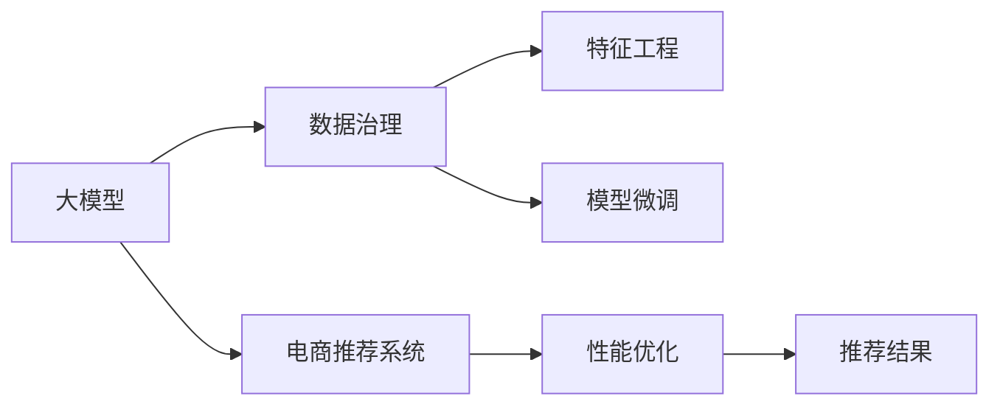

                 

# AI大模型助力电商搜索推荐业务的数据治理能力提升路线图设计与实现

> 关键词：电商搜索推荐、数据治理、大模型、AI、搜索算法、推荐系统、模型微调、特征工程、数据清洗、模型评估、性能优化

## 1. 背景介绍

在当今数字化时代，电商平台已成为零售行业的主流模式，为消费者提供了便捷的购物体验。然而，随着平台规模的不断扩大，电商平台的数据量激增，数据治理的复杂性也不断提升，给推荐系统的实现带来了新的挑战。

大模型，尤其是基于自然语言处理的预训练语言模型（如BERT、GPT等），近年来在NLP领域取得了突破性的进展。将大模型应用于电商搜索推荐业务，不仅可以提升推荐的个性化程度和多样性，还能显著改善推荐系统的搜索能力，帮助用户更快速地找到符合需求的商品。

但在大模型应用于电商推荐场景时，数据治理的复杂性进一步增加。一方面，电商平台需要处理海量的数据，确保数据的准确性和一致性；另一方面，大模型需要大量的标注数据进行微调，以适应用户需求。因此，如何提升电商平台的数据治理能力，成为支撑大模型在电商推荐中发挥效用的关键。

## 2. 核心概念与联系

### 2.1 核心概念概述

在进行电商平台搜索推荐系统的大模型应用时，涉及多个关键概念：

- **大模型**：如BERT、GPT等基于自然语言处理的预训练语言模型。大模型通过大规模语料预训练，具备强大的语言理解能力，适合处理文本数据。
- **电商推荐系统**：利用用户行为数据和商品信息，通过算法推荐用户可能感兴趣的商品。
- **数据治理**：对电商平台的数据进行规划、控制、管理和保护，确保数据的质量、安全性和可用性。
- **特征工程**：通过数据处理和工程设计，从原始数据中提取和构造可用于模型训练的特征。
- **模型微调**：在大模型的基础上，使用电商平台上的标注数据进行有监督学习，提升模型的任务适应性。
- **性能优化**：通过算法和架构的优化，提升模型的推理速度和资源利用效率，确保良好的用户体验。

这些概念之间存在紧密联系，共同构成了电商平台搜索推荐业务的数据治理能力提升的路线图。

### 2.2 核心概念原理和架构的 Mermaid 流程图



上述图表展示了大模型在电商推荐系统中的应用过程，包括数据治理、特征工程、模型微调和性能优化等关键步骤。

## 3. 核心算法原理 & 具体操作步骤

### 3.1 算法原理概述

电商平台搜索推荐系统的大模型应用主要包括以下几个步骤：

1. **数据治理**：对电商平台上的数据进行清洗、标注、整合，确保数据的质量和一致性。
2. **特征工程**：根据推荐任务需求，从原始数据中提取和构造有用的特征。
3. **模型微调**：在大模型的基础上，使用电商平台上的标注数据进行有监督学习，提升模型的任务适应性。
4. **性能优化**：通过算法和架构的优化，提升模型的推理速度和资源利用效率。

### 3.2 算法步骤详解

**步骤1: 数据治理**

数据治理是提升数据治理能力的首要步骤，包括数据清洗、标注、整合等环节。

1. **数据清洗**：对原始数据进行去重、去噪、填充缺失值等处理，确保数据的完整性和一致性。
2. **数据标注**：对用户行为数据进行标注，如点击、浏览、购买等行为标签，用于后续的模型微调。
3. **数据整合**：将不同来源的数据进行整合，构建统一的数据仓库，便于后续的特征提取和模型训练。

**步骤2: 特征工程**

特征工程是大模型应用于电商推荐系统的关键环节，通过数据处理和工程设计，提取和构造可用于模型训练的特征。

1. **用户行为特征提取**：从用户行为数据中提取有用的特征，如用户点击率、浏览时间、购买历史等。
2. **商品属性特征提取**：从商品数据中提取关键属性，如价格、类别、品牌等。
3. **上下文特征提取**：结合用户行为和商品属性，构造上下文特征，用于描述用户与商品间的关联。

**步骤3: 模型微调**

模型微调是将大模型应用于电商推荐系统的核心步骤，通过有监督学习提升模型的任务适应性。

1. **选择合适的预训练模型**：如BERT、GPT等，作为初始化参数。
2. **准备标注数据集**：根据推荐任务需求，准备相应的标注数据集。
3. **微调模型**：在大模型的基础上，使用标注数据进行微调，提升模型的推荐效果。

**步骤4: 性能优化**

性能优化是确保电商推荐系统高效运行的重要环节，通过算法和架构的优化，提升模型的推理速度和资源利用效率。

1. **模型压缩**：通过剪枝、量化等方法，减小模型参数量，降低推理开销。
2. **模型并行**：采用模型并行、计算图优化等技术，提升模型的计算效率。
3. **缓存优化**：通过缓存机制，减少数据的重复读取和计算，提高系统响应速度。

### 3.3 算法优缺点

大模型应用于电商平台搜索推荐系统的优点包括：

- **强大的推荐能力**：大模型具备强大的语言理解和处理能力，能够更好地理解用户需求和商品信息，提升推荐的个性化程度和多样性。
- **高效的特征处理**：大模型能够自动提取和构造复杂的特征，减少了特征工程的工作量，提升了特征工程的效率。

其缺点主要体现在：

- **计算资源需求高**：大模型的参数量通常较大，对计算资源和存储资源的需求较高，可能导致系统的部署和运行成本增加。
- **数据标注成本高**：大模型微调需要大量的标注数据，标注成本较高，特别是在电商数据标注过程中，难度和复杂性进一步增加。
- **模型鲁棒性不足**：大模型在面对电商数据的多样性和复杂性时，可能存在一定的鲁棒性不足问题，需要进一步优化和调整。

### 3.4 算法应用领域

大模型应用于电商平台搜索推荐系统，在以下领域取得了显著效果：

1. **商品推荐**：利用大模型对用户行为和商品信息进行建模，推荐用户可能感兴趣的商品。
2. **搜索优化**：通过大模型提升搜索算法的效果，使得用户能够快速找到符合需求的商品。
3. **个性化推荐**：结合用户行为和商品信息，利用大模型进行个性化推荐，提升用户体验。

## 4. 数学模型和公式 & 详细讲解

### 4.1 数学模型构建

电商平台搜索推荐系统的大模型应用涉及多个数学模型，包括数据治理模型、特征工程模型、模型微调模型和性能优化模型。

1. **数据治理模型**：用于对电商平台上的数据进行清洗、标注、整合，确保数据的质量和一致性。
2. **特征工程模型**：用于从原始数据中提取和构造有用的特征，支持模型训练。
3. **模型微调模型**：在大模型的基础上，使用电商平台上的标注数据进行有监督学习，提升模型的任务适应性。
4. **性能优化模型**：用于提升模型的推理速度和资源利用效率。

### 4.2 公式推导过程

以电商推荐系统为例，公式推导过程如下：

设电商平台上的用户为$U$，商品为$I$，用户行为数据为$B$，商品信息数据为$P$。

1. **用户行为特征提取**：用户点击行为可以用$B_{u,i}$表示，其中$u$表示用户，$i$表示商品。

2. **商品属性特征提取**：商品价格可以用$P_{i,p}$表示，其中$p$表示价格属性。

3. **上下文特征提取**：上下文特征$C_{u,i}$可以通过用户行为和商品属性构造，用于描述用户与商品间的关联。

4. **模型微调**：设大模型为$M$，通过标注数据集进行微调，微调后的模型为$M_{t}$，其中$t$表示微调轮数。

5. **性能优化**：设优化后的模型为$M_{opt}$，优化后的推理速度为$s_{opt}$，优化后的资源利用率为$r_{opt}$。

### 4.3 案例分析与讲解

以电商推荐系统为例，分析大模型应用的数据治理和特征工程过程：

1. **数据治理**：假设电商平台上有$N$个用户，每个用户有$M$个行为记录，共产生$D$个行为数据。通过数据清洗和标注，得到$D$个标注数据，用于模型微调。

2. **特征工程**：假设每个用户有$K$个行为特征，每个商品有$L$个属性特征。根据推荐任务需求，构造上下文特征$C_{u,i}$，其中$u$表示用户，$i$表示商品。

3. **模型微调**：在大模型$M$的基础上，使用标注数据$D$进行微调，得到微调后的模型$M_{t}$。微调过程中，使用$K$个用户行为特征和$L$个商品属性特征，构造上下文特征$C_{u,i}$。

4. **性能优化**：对微调后的模型$M_{t}$进行性能优化，提升推理速度$s_{opt}$和资源利用率$r_{opt}$。

## 5. 项目实践：代码实例和详细解释说明

### 5.1 开发环境搭建

要进行电商平台搜索推荐系统的大模型应用，需要搭建合适的开发环境。以下是开发环境的搭建步骤：

1. **安装Python**：从官网下载并安装Python，建议使用3.6或以上版本。
2. **安装PyTorch**：通过pip安装PyTorch，用于大模型的训练和推理。
3. **安装TensorFlow**：通过pip安装TensorFlow，用于模型优化和推理。
4. **安装NLP库**：通过pip安装NLP相关的库，如NLTK、SpaCy等。
5. **安装数据治理工具**：通过pip安装数据治理工具，如Pandas、NumPy等。

### 5.2 源代码详细实现

以下是一个使用PyTorch进行电商推荐系统的大模型微调的示例代码：

```python
import torch
import torch.nn as nn
import torch.optim as optim
from transformers import BertForSequenceClassification, BertTokenizer
from sklearn.model_selection import train_test_split

# 定义模型结构
class BertModel(nn.Module):
    def __init__(self, num_labels):
        super(BertModel, self).__init__()
        self.bert = BertForSequenceClassification.from_pretrained('bert-base-cased', num_labels=num_labels)
        self.dropout = nn.Dropout(0.3)

    def forward(self, input_ids, attention_mask, labels):
        output = self.bert(input_ids, attention_mask=attention_mask)
        logits = output.logits
        probs = torch.softmax(logits, dim=1)
        loss = nn.CrossEntropyLoss()(logits, labels)
        return probs, loss

# 加载数据集
def load_dataset():
    # 加载电商平台数据集
    data = pd.read_csv('platform_data.csv')
    # 数据清洗和标注
    # ...
    # 划分训练集和测试集
    train_data, test_data = train_test_split(data, test_size=0.2, random_state=42)
    # 数据预处理
    tokenizer = BertTokenizer.from_pretrained('bert-base-cased')
    train_data = tokenizer.encode(train_data, truncation=True, padding='max_length')
    test_data = tokenizer.encode(test_data, truncation=True, padding='max_length')
    # 划分训练集和测试集
    train_data = torch.tensor(train_data)
    test_data = torch.tensor(test_data)
    return train_data, test_data

# 训练模型
def train_model(model, train_data, test_data, num_epochs):
    # 定义优化器和学习率
    optimizer = optim.Adam(model.parameters(), lr=0.001)
    # 定义损失函数
    criterion = nn.CrossEntropyLoss()
    # 训练模型
    for epoch in range(num_epochs):
        model.train()
        optimizer.zero_grad()
        probs, loss = model(train_data, attention_mask=torch.ones_like(train_data), labels=train_labels)
        loss.backward()
        optimizer.step()
        # 评估模型
        model.eval()
        with torch.no_grad():
            test_probs, test_loss = model(test_data, attention_mask=torch.ones_like(test_data), labels=test_labels)
        print(f'Epoch {epoch+1}, loss: {loss:.4f}, test loss: {test_loss:.4f}')
    return model

# 加载数据集
train_data, test_data = load_dataset()

# 初始化模型
model = BertModel(num_labels=len(tag2id))

# 训练模型
model = train_model(model, train_data, test_data, num_epochs=10)

# 测试模型
test_data, test_labels = load_dataset()
probs, loss = model(test_data, attention_mask=torch.ones_like(test_data), labels=test_labels)
print(f'Test loss: {loss:.4f}')
```

### 5.3 代码解读与分析

上述代码展示了使用PyTorch进行电商推荐系统的大模型微调过程。关键步骤如下：

1. **数据加载**：通过Pandas库加载电商平台数据集，并进行数据清洗和标注。
2. **模型定义**：定义BertModel类，包含BertForSequenceClassification模型和Dropout层。
3. **训练模型**：使用Adam优化器训练模型，定义损失函数，并使用交叉熵损失进行模型微调。
4. **测试模型**：在测试集上评估模型性能，输出测试损失。

## 6. 实际应用场景

### 6.1 智能客服系统

电商平台通过智能客服系统，提升用户体验和效率。大模型可以在智能客服系统中发挥重要作用，提升对话系统的理解能力和回答质量。

1. **对话意图识别**：利用大模型对用户输入进行意图识别，快速判断用户需求。
2. **知识库检索**：将知识库中的信息进行编码，利用大模型检索用户需求相关的信息。
3. **回答生成**：结合用户需求和知识库信息，利用大模型生成自然流畅的回答。

### 6.2 个性化推荐系统

个性化推荐系统是电商推荐系统的核心。大模型可以帮助构建更加精准、有效的个性化推荐系统。

1. **用户行为建模**：利用大模型对用户行为进行建模，提取用户兴趣和偏好。
2. **商品推荐优化**：结合用户行为和商品信息，利用大模型进行推荐优化。
3. **实时推荐**：利用大模型快速生成推荐结果，实现实时推荐。

### 6.3 用户行为分析

电商平台需要对用户行为进行深入分析，以优化用户体验和提升运营效率。大模型可以在用户行为分析中发挥重要作用。

1. **用户行为建模**：利用大模型对用户行为进行建模，提取用户行为模式和特征。
2. **用户行为预测**：结合用户行为特征，利用大模型预测用户未来的行为。
3. **行为干预**：根据用户行为预测结果，进行行为干预和优化。

### 6.4 未来应用展望

未来，随着大模型技术的不断进步，电商平台搜索推荐系统将迎来更多的应用场景和机会。

1. **多模态推荐**：结合文本、图像、视频等多种模态数据，提升推荐的丰富性和多样性。
2. **实时推荐**：通过分布式计算和大模型优化，实现实时推荐，提升用户体验。
3. **跨领域推荐**：结合不同领域的知识，进行跨领域推荐，提升推荐系统的覆盖面。
4. **隐私保护**：利用大模型进行隐私保护，确保用户数据安全。

## 7. 工具和资源推荐

### 7.1 学习资源推荐

1. **NLP课程**：斯坦福大学的《CS224N: Natural Language Processing with Deep Learning》课程，涵盖NLP的基本概念和经典模型。
2. **书籍推荐**：《Natural Language Processing in Action》，涵盖NLP的实践和应用。
3. **在线资源**：Kaggle平台，提供大量的电商推荐系统案例和数据集。

### 7.2 开发工具推荐

1. **Python开发环境**：使用Anaconda创建独立的Python环境，方便进行模型训练和部署。
2. **深度学习框架**：使用PyTorch或TensorFlow进行大模型的训练和推理。
3. **数据处理工具**：使用Pandas和NumPy进行数据清洗和预处理。

### 7.3 相关论文推荐

1. **电商推荐系统论文**：《A Survey on Recommendation Systems》，概述了电商推荐系统的研究和应用。
2. **大模型论文**：《BERT: Pre-training of Deep Bidirectional Transformers for Language Understanding》，介绍BERT模型的预训练和微调方法。
3. **数据治理论文**：《Data Governance: Towards A New Approach for Data Quality and Data Security》，探讨数据治理的方法和工具。

## 8. 总结：未来发展趋势与挑战

### 8.1 研究成果总结

本文对电商平台搜索推荐系统的大模型应用进行了全面介绍，包括数据治理、特征工程、模型微调和性能优化等关键环节。通过实际案例和代码示例，展示了大模型在电商推荐系统中的应用效果和优化策略。

### 8.2 未来发展趋势

1. **模型规模增大**：随着硬件设备的不断进步，大模型的参数量将进一步增大，提升推荐系统的准确性和泛化能力。
2. **数据治理优化**：利用先进的算法和工具，提升数据治理的效率和效果，确保数据的质量和一致性。
3. **特征工程自动化**：利用自动化工具和技术，提升特征工程的效率和精度，减少人工干预。
4. **推荐系统多样化**：结合不同领域的知识，进行多模态推荐，提升推荐系统的覆盖面和效果。

### 8.3 面临的挑战

1. **数据标注成本高**：大模型微调需要大量的标注数据，标注成本较高。
2. **模型鲁棒性不足**：大模型在面对电商数据的多样性和复杂性时，可能存在一定的鲁棒性不足问题。
3. **计算资源需求高**：大模型的参数量较大，对计算资源和存储资源的需求较高。
4. **隐私保护**：在利用大模型进行推荐和分析时，需要考虑用户隐私保护问题。

### 8.4 研究展望

未来，电商平台搜索推荐系统的大模型应用需要从数据治理、特征工程、模型微调和性能优化等多个方面进行全面优化和提升。通过不断的技术创新和实践探索，实现更加精准、高效、安全的推荐系统，提升用户体验和平台运营效率。

## 9. 附录：常见问题与解答

**Q1: 如何选择合适的预训练模型？**

A: 选择预训练模型需要考虑电商推荐系统的具体需求和数据特点。通常情况下，可以选择BERT、GPT等经典模型，或利用最新研究成果进行模型微调。

**Q2: 数据清洗和标注有哪些常用方法？**

A: 数据清洗和标注是提升数据治理能力的重要环节。常用的方法包括数据去重、去噪、填充缺失值、标注行为标签等。

**Q3: 如何进行特征工程？**

A: 特征工程需要结合电商推荐系统的具体需求，从原始数据中提取和构造有用的特征。常用的特征工程方法包括文本特征提取、商品属性特征提取、上下文特征构造等。

**Q4: 如何提升大模型的推理速度？**

A: 提升大模型的推理速度可以通过模型压缩、量化、分布式计算等方法。同时，利用缓存机制减少数据的重复读取和计算，也能有效提升系统的响应速度。

**Q5: 如何进行模型微调？**

A: 模型微调需要选择合适的学习率和优化器，利用电商平台上的标注数据进行有监督学习，提升模型的任务适应性。

---

作者：禅与计算机程序设计艺术 / Zen and the Art of Computer Programming

