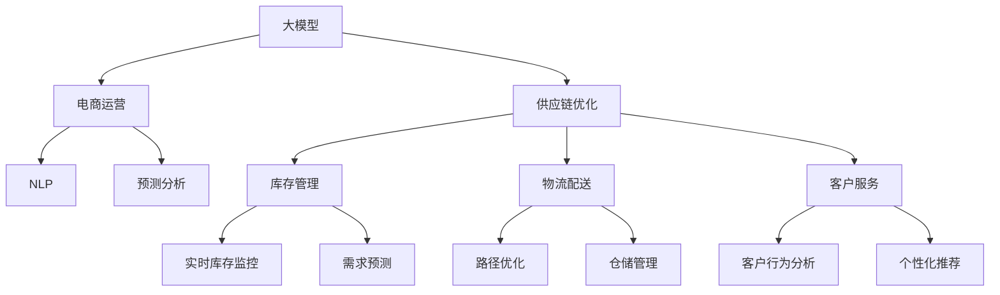

                 

# AI大模型在电商平台供应链优化中的应用

> 关键词：
1. 人工智能(AI)
2. 大模型
3. 电商平台
4. 供应链优化
5. 深度学习
6. 预测分析
7. 自然语言处理(NLP)

## 1. 背景介绍

在当今数字化时代，电商平台凭借其低成本、高效率的优势，迅速崛起，成为零售行业的主流。然而，随着用户需求的多样化和市场竞争的加剧，电商平台的运营难度日益增大，供应链优化成为了其面临的重要挑战。传统的人工运营和规则引擎无法满足实时性、高效性和灵活性的需求。为此，电商平台逐渐引入AI技术，特别是大模型，以期实现更智能、更高效的供应链管理。

大模型是指具有大规模参数、高复杂度、高表现能力的深度学习模型。近年来，得益于大数据和计算能力的提升，预训练大模型在自然语言处理、图像识别、语音识别等领域取得了显著进展。这些模型通过在大量无标签数据上进行预训练，学习到了丰富的知识表示，具备了强大的泛化能力，能够应对各种复杂场景。本文将聚焦于大模型在电商平台供应链优化中的应用，探讨其背后的技术原理和实际操作方法。

## 2. 核心概念与联系

### 2.1 核心概念概述

为了更好地理解AI大模型在电商平台供应链优化中的应用，本节将介绍几个核心概念：

- **大模型**：如BERT、GPT、ViT等，具有大规模参数和复杂结构，通过在大规模无标签数据上进行预训练，学习到丰富的知识表示。
- **供应链优化**：指通过分析和优化供应链中的各个环节，以最小化成本、提高效率和响应速度为目标的管理活动。
- **电商运营**：包括商品采购、库存管理、物流配送、客户服务等环节，旨在提升用户体验和平台收益。
- **自然语言处理(NLP)**：涉及文本数据的处理、理解和生成，是AI大模型在电商平台应用的重要领域。
- **预测分析**：利用历史数据和模型预测未来趋势，辅助决策制定。

这些核心概念之间的逻辑关系可以通过以下Mermaid流程图来展示：



这个流程图展示了大模型与电商供应链优化之间的联系：

1. 大模型通过预训练获得了强大的知识表示能力，能够理解和处理自然语言数据。
2. 在电商运营中，大模型可用于商品管理、库存监控、物流优化等环节。
3. 利用NLP和大模型，可以进行实时需求预测和客户行为分析，指导供应链管理。
4. 通过预测分析，辅助决策者制定更好的库存和配送策略。

## 3. 核心算法原理 & 具体操作步骤

### 3.1 算法原理概述

大模型在电商平台供应链优化中的应用，主要基于监督学习和大规模分布式训练。其核心思想是通过大量的历史数据，构建一个能够预测供应链行为和优化决策的模型。具体步骤如下：

1. **数据采集**：收集电商平台的各项运营数据，如订单量、库存量、物流信息、客户反馈等。
2. **数据预处理**：对原始数据进行清洗、归一化、特征工程等预处理操作，使其适合模型训练。
3. **模型训练**：使用大模型（如BERT、GPT等）在处理过的数据集上进行预训练，学习到各种数据间的关联关系。
4. **任务适配**：针对具体的供应链优化任务，在大模型上进行微调（fine-tuning），使得模型输出能够满足特定任务的需求。
5. **模型评估与部署**：在验证集上评估微调后的模型，将其部署到实际的供应链优化系统中，持续监测和优化。

### 3.2 算法步骤详解

以下是具体的步骤详解：

**Step 1: 数据采集与预处理**

- 收集电商平台的订单数据、库存数据、物流数据、客户行为数据等，形成原始数据集。
- 清洗数据，去除重复、缺失、异常值等，保证数据质量。
- 进行特征工程，如时间特征、地点特征、商品特征等，提取对预测有用的信息。

**Step 2: 模型选择与预训练**

- 选择适合电商平台的预训练大模型，如BERT、GPT等。
- 在大规模无标签数据集上进行预训练，学习通用的知识表示。

**Step 3: 任务适配与微调**

- 确定供应链优化任务，如需求预测、库存管理、路径优化等。
- 针对具体任务设计损失函数和输出层，在大模型上进行微调。
- 设定合适的超参数，如学习率、批大小、迭代轮数等。
- 使用优化算法（如Adam、SGD等）更新模型参数。

**Step 4: 模型评估与部署**

- 在验证集上评估模型性能，检查是否达到预期效果。
- 部署微调后的模型到电商平台的供应链优化系统中。
- 持续监测模型的性能，根据反馈数据不断调整模型参数，优化决策策略。

### 3.3 算法优缺点

基于大模型的电商平台供应链优化方法具有以下优点：

1. **精度高**：大模型通过在大规模数据上预训练，学习到了丰富的知识表示，能够实现高精度的预测和决策。
2. **泛化能力强**：大模型在预训练过程中学习了通用的知识表示，能够适应多种供应链场景。
3. **可解释性好**：大模型通过特征提取和表征学习，能够提供详细的输出解释，有助于理解模型决策过程。
4. **可扩展性强**：大模型通过分布式训练，能够处理大规模数据集，适用于电商平台的复杂运营环境。

同时，该方法也存在一些缺点：

1. **计算成本高**：大模型的训练和微调需要大量的计算资源和存储资源，成本较高。
2. **数据依赖性强**：模型的性能高度依赖于数据的质量和多样性，数据采集和预处理工作量较大。
3. **模型复杂度高**：大模型的结构复杂，训练和推理过程较为复杂，难以理解和调试。

### 3.4 算法应用领域

基于大模型的电商平台供应链优化方法，主要应用于以下领域：

1. **需求预测**：通过分析历史订单数据，预测未来的订单量，指导库存管理和采购决策。
2. **库存管理**：利用大模型对库存水平进行实时监控和动态调整，避免库存积压或缺货。
3. **路径优化**：通过分析物流数据，优化配送路径，提高物流效率和降低成本。
4. **客户行为分析**：分析客户购买行为和反馈，进行个性化推荐和营销活动，提升客户满意度。
5. **风险管理**：利用大模型对供应链中的风险进行预测和监控，防范潜在问题。

## 4. 数学模型和公式 & 详细讲解

### 4.1 数学模型构建

假设电商平台收集到的订单数据为 $\mathcal{X}$，其中 $\mathcal{X} = \{(x_i, t_i)\}_{i=1}^N$，$x_i$ 为订单信息，$t_i$ 为时间戳。模型的目标是预测未来 $T$ 天的订单量 $y_i$，即 $\hat{y} = \mathcal{M}(x_i; \theta)$，其中 $\mathcal{M}$ 为模型，$\theta$ 为模型参数。

在微调过程中，模型的损失函数 $\mathcal{L}$ 通常采用均方误差（MSE）或交叉熵（CE）损失，即：

$$
\mathcal{L} = \frac{1}{N} \sum_{i=1}^N (\hat{y}_i - y_i)^2 \text{ 或 } \mathcal{L} = -\frac{1}{N} \sum_{i=1}^N t_i \log(\hat{y}_i) + (1-t_i) \log(1-\hat{y}_i)
$$

### 4.2 公式推导过程

以均方误差损失函数为例，我们进行详细推导：

1. **目标函数**：
   $$
   \mathcal{L} = \frac{1}{N} \sum_{i=1}^N (\hat{y}_i - y_i)^2
   $$

2. **梯度计算**：
   $$
   \nabla_{\theta} \mathcal{L} = \frac{1}{N} \sum_{i=1}^N 2(\hat{y}_i - y_i) \nabla_{\theta} \hat{y}_i
   $$

3. **反向传播**：
   - 将梯度反向传播到模型的各个层，更新模型参数 $\theta$。
   - 使用优化算法（如Adam、SGD等），更新模型参数。

### 4.3 案例分析与讲解

以电商平台的路径优化为例，分析大模型的应用。假设物流公司想要优化配送路径，以减少配送成本和提高效率。可以收集历史配送数据，包括配送点、时间、距离等信息，构建模型进行路径优化。

1. **数据预处理**：
   - 收集历史配送数据，清洗、归一化数据，提取特征。
   - 将配送点坐标、时间戳、配送距离等信息作为输入特征。

2. **模型选择**：
   - 选择如BERT、GPT等大模型，作为路径优化任务的基础模型。
   - 在大模型上进行微调，学习路径优化相关的特征表示。

3. **任务适配**：
   - 设计损失函数，如最小化路径长度或配送时间的损失。
   - 设计输出层，如回归模型输出配送路径距离，分类模型输出配送路径合理性等。
   - 设定合适的超参数，如学习率、批大小、迭代轮数等。

4. **模型评估**：
   - 在验证集上评估模型性能，检查路径优化效果。
   - 部署模型到物流公司，进行实时路径优化。

## 5. 项目实践：代码实例和详细解释说明

### 5.1 开发环境搭建

在进行电商平台供应链优化的大模型应用时，需要搭建相应的开发环境。以下是使用Python进行PyTorch开发的环境配置流程：

1. 安装Anaconda：从官网下载并安装Anaconda，用于创建独立的Python环境。

2. 创建并激活虚拟环境：
```bash
conda create -n pytorch-env python=3.8 
conda activate pytorch-env
```

3. 安装PyTorch：根据CUDA版本，从官网获取对应的安装命令。例如：
```bash
conda install pytorch torchvision torchaudio cudatoolkit=11.1 -c pytorch -c conda-forge
```

4. 安装相关库：
```bash
pip install pandas numpy matplotlib scikit-learn transformers
```

完成上述步骤后，即可在`pytorch-env`环境中开始开发实践。

### 5.2 源代码详细实现

以下是一个简单的例子，展示如何使用大模型进行电商平台的库存管理。

```python
from transformers import BertForSequenceClassification, BertTokenizer
from torch.utils.data import DataLoader
import torch
import pandas as pd

# 定义模型
model = BertForSequenceClassification.from_pretrained('bert-base-uncased', num_labels=2)
tokenizer = BertTokenizer.from_pretrained('bert-base-uncased')

# 数据处理
df = pd.read_csv('order_data.csv')  # 读取订单数据
features = tokenizer(df['description'], return_tensors='pt', padding=True, truncation=True)

# 模型训练
optimizer = torch.optim.Adam(model.parameters(), lr=1e-5)
loss_fn = torch.nn.CrossEntropyLoss()
device = torch.device('cuda') if torch.cuda.is_available() else torch.device('cpu')
model.to(device)
for epoch in range(10):
    model.train()
    for batch in DataLoader(features, batch_size=32):
        inputs = {key: val.to(device) for key, val in batch.items()}
        outputs = model(**inputs)
        loss = loss_fn(outputs.logits, inputs['labels'].to(device))
        loss.backward()
        optimizer.step()

# 模型评估
model.eval()
for batch in DataLoader(features, batch_size=32):
    inputs = {key: val.to(device) for key, val in batch.items()}
    outputs = model(**inputs)
    loss = loss_fn(outputs.logits, inputs['labels'].to(device))
    print(loss.item())

# 保存模型
torch.save(model.state_dict(), 'inventory_model.pt')
```

### 5.3 代码解读与分析

这里我们详细解读一下代码的关键部分：

**模型定义**：
- 使用`BertForSequenceClassification`定义一个序列分类模型，适合处理序列数据（如订单描述）。
- 加载预训练的BERT模型，并设置分类数为2（库存高或低）。

**数据处理**：
- 使用`BertTokenizer`对订单描述进行分词、编码，并转换成PyTorch张量。
- 使用`DataLoader`对数据进行批处理，方便模型训练。

**模型训练**：
- 定义优化器和损失函数，将模型移到GPU上加速计算。
- 循环多次训练，每次前向传播计算损失，反向传播更新模型参数。
- 使用`Adam`优化器，学习率为1e-5。

**模型评估**：
- 将模型设置为评估模式，计算评估集上的损失。
- 将模型保存为`inventory_model.pt`文件，方便后续使用。

## 6. 实际应用场景

### 6.1 库存管理

在电商平台中，库存管理是供应链优化的核心环节。传统的库存管理依赖于经验丰富的运营人员和简单的统计模型，难以满足实时性和准确性的要求。大模型的引入，能够通过分析历史订单数据和实时反馈，进行动态库存调整。

具体而言，可以利用大模型对订单数据进行分类，判断当前库存是否充足，预测未来订单需求，从而制定合理的采购计划。例如，当模型预测未来订单量大幅增加时，可以提前增加库存，避免缺货情况。

### 6.2 路径优化

物流配送是电商运营中的重要环节，其效率直接影响用户体验和平台收益。通过大模型进行路径优化，能够实现配送路径的最优化，降低配送成本，提高配送效率。

例如，可以使用大模型对历史配送数据进行分析，学习到最优的配送路径特征，进行路径优化。当有新的配送需求时，大模型可以实时计算出最优路径，指导配送员进行操作。

### 6.3 个性化推荐

电商平台的推荐系统需要根据用户行为和偏好，推荐最合适的商品。传统规则引擎和基于协同过滤的方法，无法满足个性化推荐的需求。大模型的引入，能够通过分析用户行为数据和商品特征，提供个性化的推荐服务。

例如，可以利用大模型分析用户的历史购买行为，预测其未来购买意向，推荐相关商品。同时，大模型还可以根据用户的浏览和搜索行为，进行实时推荐，提升用户满意度和转化率。

### 6.4 未来应用展望

随着大模型的不断发展和优化，其在电商平台供应链优化中的应用前景广阔，未来将会有更多创新和突破。以下是一些可能的趋势：

1. **多模态融合**：大模型不仅能够处理文本数据，还能够处理图像、语音等多模态数据，提升供应链管理的全面性和准确性。
2. **联邦学习**：在数据隐私保护的前提下，通过联邦学习技术，在不同电商平台间共享大模型，提升整体供应链优化水平。
3. **自适应模型**：大模型能够根据实时反馈，动态调整模型参数，适应供应链中的变化和不确定性。
4. **实时预测**：利用大模型进行实时预测和决策，快速响应供应链中的变化和异常。
5. **模型集成**：结合不同的大模型和算法，构建更加鲁棒和高效的供应链优化系统。

## 7. 工具和资源推荐

### 7.1 学习资源推荐

为了帮助开发者系统掌握大模型在电商平台供应链优化中的应用，这里推荐一些优质的学习资源：

1. **《Transformers: From Discrete to Continuous Latents》**：详细介绍了大模型的原理和应用，包括自然语言处理、图像处理等领域。
2. **Deep Learning Specialization by Andrew Ng**：斯坦福大学的在线课程，涵盖了深度学习的多个方面，包括序列模型、卷积神经网络等。
3. **《Python Machine Learning》**：介绍了机器学习的基本概念和算法，并提供了Python实现代码。
4. **《Deep Learning for NLP》**：Hugging Face的在线课程，详细讲解了NLP中的深度学习技术，包括预训练和微调等。
5. **PyTorch官方文档**：提供了详细的API文档和教程，帮助开发者快速上手使用。

通过学习这些资源，相信你一定能够掌握大模型在电商平台供应链优化中的基本原理和技术细节，并应用于实际项目中。

### 7.2 开发工具推荐

高效的开发离不开优秀的工具支持。以下是几款用于大模型开发的常用工具：

1. **PyTorch**：基于Python的开源深度学习框架，灵活动态的计算图，适合快速迭代研究。
2. **TensorFlow**：由Google主导开发的开源深度学习框架，生产部署方便，适合大规模工程应用。
3. **Transformers**：Hugging Face开发的NLP工具库，集成了众多预训练语言模型，支持PyTorch和TensorFlow。
4. **TensorBoard**：TensorFlow配套的可视化工具，可实时监测模型训练状态，并提供丰富的图表呈现方式。
5. **Weights & Biases**：模型训练的实验跟踪工具，可以记录和可视化模型训练过程中的各项指标，方便对比和调优。

这些工具可以显著提升大模型开发的效率和质量，帮助开发者在实际项目中快速迭代和优化模型。

### 7.3 相关论文推荐

大模型和供应链优化技术的发展源于学界的持续研究。以下是几篇奠基性的相关论文，推荐阅读：

1. **《bert: Pre-training of Deep Bidirectional Transformers for Language Understanding》**：提出BERT模型，引入掩码语言模型预训练任务，提升了NLP任务的性能。
2. **《Attention is All You Need》**：提出Transformer模型，改变了传统的卷积和循环神经网络结构，开启了大模型的时代。
3. **《Training Recurrent Neural Networks with Sequential Data》**：介绍递归神经网络的原理和应用，是NLP领域的基础。
4. **《Deep Learning for Image Recognition》**：介绍卷积神经网络在图像识别中的应用，是计算机视觉领域的基础。
5. **《Data-Parallel Training of Deep Neural Networks》**：介绍分布式训练的技术原理和实现方法，适合大规模模型训练。

这些论文代表了大模型和供应链优化技术的发展脉络。通过学习这些前沿成果，可以帮助研究者把握学科前进方向，激发更多的创新灵感。

## 8. 总结：未来发展趋势与挑战

### 8.1 总结

本文对大模型在电商平台供应链优化中的应用进行了全面系统的介绍。首先阐述了供应链优化和电商运营的背景，明确了大模型在供应链管理中的应用价值。其次，从原理到实践，详细讲解了大模型的数学模型和操作步骤，给出了具体的代码实现。同时，本文还广泛探讨了大模型在供应链优化中的实际应用场景，展示了其潜在的巨大潜力。此外，本文精选了大模型相关的学习资源，力求为读者提供全方位的技术指引。

通过本文的系统梳理，可以看到，大模型在电商平台供应链优化中的应用正在逐渐普及，极大地提升了供应链管理的智能化水平。大模型通过学习和理解复杂的自然语言，能够进行实时预测和决策，显著提高了供应链优化的效率和精度。未来，伴随大模型的不断发展和优化，相信电商平台供应链优化将迎来更加智能化、高效化的发展。

### 8.2 未来发展趋势

展望未来，大模型在电商平台供应链优化中的应用将呈现以下几个发展趋势：

1. **模型复杂度提升**：随着算力成本的下降和数据规模的扩张，大模型的参数量还将持续增长，模型复杂度不断提升。超大规模大模型能够更全面地学习供应链中的复杂关系，提升预测和决策的准确性。
2. **多模态融合**：大模型不仅能够处理文本数据，还能够处理图像、语音等多模态数据，提升供应链管理的全面性和准确性。多模态数据的融合，将显著提升供应链系统对现实世界的理解和建模能力。
3. **实时预测与决策**：利用大模型进行实时预测和决策，快速响应供应链中的变化和异常，实现更加智能化的供应链管理。
4. **联邦学习**：在数据隐私保护的前提下，通过联邦学习技术，在不同电商平台间共享大模型，提升整体供应链优化水平。
5. **自适应模型**：大模型能够根据实时反馈，动态调整模型参数，适应供应链中的变化和不确定性。

以上趋势凸显了大模型在电商平台供应链优化中的广阔前景。这些方向的探索发展，必将进一步提升供应链系统的性能和应用范围，为电商平台的智能化转型提供新的技术路径。

### 8.3 面临的挑战

尽管大模型在电商平台供应链优化中的应用已经取得了显著进展，但在迈向更加智能化、普适化应用的过程中，仍面临诸多挑战：

1. **数据质量与多样性**：供应链优化高度依赖于数据质量，如何获取和处理高质量、多源异构的数据，是数据采集和预处理的关键。
2. **计算资源与成本**：大模型的训练和微调需要大量的计算资源和存储资源，成本较高。如何在保证模型性能的前提下，降低资源消耗，是一个重要的研究方向。
3. **模型复杂度与可解释性**：大模型的结构复杂，难以理解和调试。如何在保证性能的同时，提高模型的可解释性和可解释性，是模型优化的一个重要方向。
4. **鲁棒性与泛化性**：大模型在面对域外数据时，泛化性能往往大打折扣。如何提高模型的鲁棒性，避免灾难性遗忘，还需要更多理论和实践的积累。
5. **安全与隐私**：供应链优化涉及大量敏感数据，如何保护数据隐私和模型安全，是模型应用的重要挑战。

### 8.4 研究展望

面对大模型在电商平台供应链优化中所面临的挑战，未来的研究需要在以下几个方面寻求新的突破：

1. **数据增强与数据融合**：采用数据增强和融合技术，提高数据的质量和多样性，增强模型的泛化能力和鲁棒性。
2. **轻量化模型设计**：设计轻量化的大模型，减少计算资源和存储资源的消耗，提高模型的实时性和可部署性。
3. **模型解释与可解释性**：引入可解释性模型和解释工具，增强模型的可解释性和可解释性，帮助运营人员理解和调试模型。
4. **联邦学习与联邦数据治理**：在保护数据隐私的前提下，通过联邦学习技术，共享大模型和知识，提升供应链优化的整体水平。
5. **隐私保护与安全防护**：采用隐私保护技术和安全防护措施，确保供应链优化过程中数据和模型的安全。

这些研究方向的探索，必将引领大模型在电商平台供应链优化中的应用走向成熟，为构建高效、智能、安全的供应链管理系统提供新的技术路径。总之，大模型在电商平台供应链优化中的应用，将不断拓展其应用边界，为电商平台的智能化转型提供新的动力。

