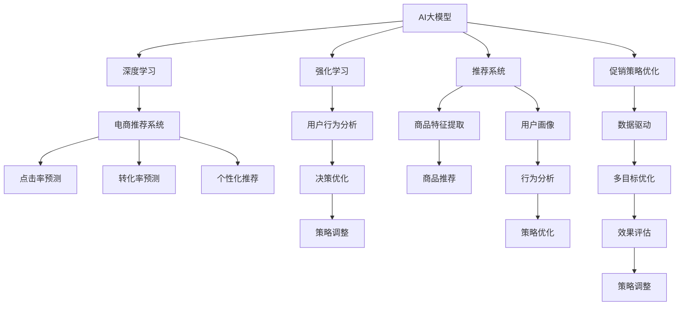

                 

# AI大模型在电商平台促销策略优化中的应用

> 关键词：AI大模型、电商平台、促销策略、优化、推荐系统、深度学习、强化学习

## 1. 背景介绍

随着互联网技术的发展，电子商务市场进入了一个高度竞争和快速变化的时代。电商平台为了提高用户购买率和客户满意度，纷纷通过多种促销策略吸引和留住客户。然而，设计有效的促销策略并不是一件简单的事情，需要在理解用户行为和市场变化的基础上，灵活地调整和优化策略。

## 2. 核心概念与联系

### 2.1 核心概念概述

为更好地理解AI大模型在电商平台促销策略优化中的应用，本节将介绍几个密切相关的核心概念：

- AI大模型：以深度神经网络为代表的、参数量超过数亿的超大规模预训练模型。通过在大规模无标签文本语料上进行预训练，学习通用的语言知识和用户行为特征，具备强大的语言理解和生成能力。
- 电商平台：以互联网为平台，提供在线商品展示、购买、支付等服务的商业活动场所。电商平台通过优化促销策略，提升用户购买率和客户满意度。
- 促销策略优化：指电商平台通过数据驱动的方法，不断调整促销活动（如折扣、满减、赠品等），以最大化用户转化率和利润的策略优化过程。
- 推荐系统：指通过用户行为数据和商品特征数据，为用户推荐个性化商品，从而提升购买转化率的系统。
- 深度学习：基于神经网络进行深度学习，可以自动学习特征表示和模式识别，广泛用于图像、文本、语音等数据的处理和分析。
- 强化学习：通过模型与环境的互动，逐步调整策略以最大化长期奖励的方法。
- 参数高效微调：指在微调过程中，只更新少量的模型参数，而固定大部分预训练权重不变，以提高微调效率，避免过拟合的方法。

这些核心概念之间的逻辑关系可以通过以下Mermaid流程图来展示：



这个流程图展示了大模型的核心概念及其之间的关系：

1. 大模型通过深度学习和强化学习获得基础能力。
2. 推荐系统使用大模型进行商品推荐，通过点击率和转化率预测进行个性化推荐。
3. 促销策略优化利用推荐系统的用户行为数据，进行策略调整。
4. 参数高效微调方法用于优化策略参数，提高优化效率。

这些概念共同构成了大模型在电商平台促销策略优化中的应用框架，使其能够更灵活、高效地进行促销策略设计。

## 3. 核心算法原理 & 具体操作步骤
### 3.1 算法原理概述

AI大模型在电商平台促销策略优化中，主要通过推荐系统进行个性化推荐，并利用强化学习对策略进行调整和优化。其核心思想是：利用大模型强大的语言理解能力和行为预测能力，实时分析用户行为数据，动态调整促销策略，最大化用户转化率和平台收益。

具体来说，大模型通过以下步骤优化促销策略：

1. 对历史促销数据进行建模，预测不同策略的点击率和转化率。
2. 实时收集用户行为数据，如浏览、点击、购买等。
3. 根据用户行为数据和预测模型，计算不同策略的效果和收益。
4. 利用强化学习算法（如DQN、SAC等），逐步优化促销策略，最大化长期奖励。

### 3.2 算法步骤详解

以下详细讲解AI大模型在电商平台促销策略优化中的具体步骤：

**Step 1: 收集和预处理数据**

- 收集电商平台的历史促销数据，包括促销活动、用户行为、商品特征等。
- 对数据进行清洗和预处理，如去除缺失值、异常值，归一化处理等。
- 将数据分为训练集、验证集和测试集，便于模型训练和评估。

**Step 2: 构建预测模型**

- 选择适当的深度学习模型（如CNN、RNN、Transformer等）作为基础模型。
- 对商品特征进行编码，生成高维特征向量。
- 定义损失函数，如均方误差、交叉熵等。
- 使用GPU/TPU等高性能计算设备进行模型训练，确保训练速度。

**Step 3: 数据增强**

- 通过回译、近义词替换等方式，扩充训练集，增加模型泛化能力。
- 利用对抗样本训练，增强模型鲁棒性，防止过拟合。

**Step 4: 模型评估和优化**

- 在验证集上评估模型效果，计算点击率和转化率的预测精度。
- 利用超参数调优技术（如网格搜索、随机搜索等），寻找最优参数组合。
- 使用强化学习算法对策略进行优化，逐步调整促销活动，提升效果。

**Step 5: 实时监控和调整**

- 实时收集用户行为数据，更新模型参数，进行动态预测。
- 根据预测结果和实时数据，自动调整促销策略，如折扣力度、满减门槛等。
- 定期在测试集上评估模型效果，确保策略效果和收益。

### 3.3 算法优缺点

AI大模型在电商平台促销策略优化中，具有以下优点：

1. 高效：利用大模型强大的计算能力和泛化能力，快速响应市场变化，优化促销策略。
2. 灵活：基于用户行为数据，实时动态调整促销活动，提升用户体验和购买率。
3. 准确：通过深度学习和强化学习，精准预测用户行为和促销效果，最大化收益。

同时，该方法也存在以下局限性：

1. 数据需求大：需要大量历史促销数据和用户行为数据，获取数据成本较高。
2. 模型复杂：深度学习模型和强化学习算法较为复杂，实现难度较大。
3. 实时性要求高：实时数据更新和模型训练需要高效计算资源，可能面临计算瓶颈。

尽管存在这些局限性，但就目前而言，基于AI大模型的促销策略优化方法仍是最为高效和灵活的策略优化手段。未来相关研究的重点在于如何进一步降低对数据的需求，提高模型的实时性和易用性。

### 3.4 算法应用领域

AI大模型在电商平台促销策略优化中的应用领域广泛，包括但不限于：

- 点击率预测：预测用户对不同促销策略的反应，优化广告投放策略。
- 转化率预测：预测用户购买不同商品的概率，优化商品推荐策略。
- 个性化推荐：根据用户历史行为和偏好，推荐个性化商品和促销活动。
- 动态定价：实时调整商品价格，最大化收益。
- 库存管理：根据销售预测，优化库存水平，减少缺货和积压。

此外，大模型还应用于客户流失预测、欺诈检测、广告效果评估等电商领域的多项任务，为电商平台带来了显著的收益提升和用户体验改善。

## 4. 数学模型和公式 & 详细讲解  
### 4.1 数学模型构建

假设电商平台有 $N$ 种商品和 $M$ 种促销策略，利用深度学习模型 $f(x)$ 预测用户点击率和转化率，其中 $x$ 为促销策略的特征向量。设真实点击率为 $y$，真实转化率为 $z$，则损失函数为：

$$
\mathcal{L}(f(x)) = \frac{1}{N} \sum_{i=1}^N \frac{1}{2}(y - f(x_i))^2 + \frac{1}{M} \sum_{j=1}^M \frac{1}{2}(z - g(f(x_j)))^2
$$

其中 $g(y)$ 为转化率的预测函数。

### 4.2 公式推导过程

以点击率预测为例，通过最小化均方误差（MSE）损失函数，求解预测模型参数 $\theta$：

$$
\theta^* = \mathop{\arg\min}_{\theta} \frac{1}{N} \sum_{i=1}^N (y_i - f_\theta(x_i))^2
$$

其中 $y_i$ 为真实点击率，$f_\theta(x_i)$ 为模型预测点击率，$\theta$ 为模型参数。利用反向传播算法，计算损失函数对参数 $\theta$ 的梯度，更新模型参数，最小化损失函数。

### 4.3 案例分析与讲解

以电商平台某次促销活动的点击率和转化率预测为例，分析模型训练和优化过程。

1. 数据准备：收集历史促销数据，包括商品ID、促销策略ID、点击率、转化率等。
2. 特征工程：对促销策略进行编码，生成高维特征向量。
3. 模型训练：选择Transformer模型，使用GPU进行模型训练，最小化MSE损失函数。
4. 模型评估：在验证集上评估模型效果，计算均方误差。
5. 策略优化：利用强化学习算法（如DQN）对促销策略进行调整，最大化点击率和转化率。

## 5. 项目实践：代码实例和详细解释说明
### 5.1 开发环境搭建

在进行促销策略优化实践前，我们需要准备好开发环境。以下是使用Python进行PyTorch开发的环境配置流程：

1. 安装Anaconda：从官网下载并安装Anaconda，用于创建独立的Python环境。
2. 创建并激活虚拟环境：
```bash
conda create -n ecommerce_env python=3.8 
conda activate ecommerce_env
```

3. 安装PyTorch：根据CUDA版本，从官网获取对应的安装命令。例如：
```bash
conda install pytorch torchvision torchaudio cudatoolkit=11.1 -c pytorch -c conda-forge
```

4. 安装TensorFlow：由Google主导开发的开源深度学习框架，生产部署方便，适合大规模工程应用。同样有丰富的预训练语言模型资源。
5. 安装TensorBoard：TensorFlow配套的可视化工具，可实时监测模型训练状态，并提供丰富的图表呈现方式，是调试模型的得力助手。
6. 安装Weights & Biases：模型训练的实验跟踪工具，可以记录和可视化模型训练过程中的各项指标，方便对比和调优。

完成上述步骤后，即可在`ecommerce_env`环境中开始促销策略优化实践。

### 5.2 源代码详细实现

以下给出使用PyTorch和TensorFlow进行电商点击率和转化率预测的完整代码实现。

```python
import torch
import torch.nn as nn
import torch.optim as optim
import tensorflow as tf
from tensorflow.keras import layers
from tensorflow.keras.models import Sequential

class ClickRateModel(nn.Module):
    def __init__(self, input_dim, hidden_dim):
        super(ClickRateModel, self).__init__()
        self.fc1 = nn.Linear(input_dim, hidden_dim)
        self.fc2 = nn.Linear(hidden_dim, 1)
    
    def forward(self, x):
        x = torch.sigmoid(self.fc2(torch.tanh(self.fc1(x))))
        return x

class ConversionModel(nn.Module):
    def __init__(self, input_dim, hidden_dim):
        super(ConversionModel, self).__init__()
        self.fc1 = nn.Linear(input_dim, hidden_dim)
        self.fc2 = nn.Linear(hidden_dim, 1)
    
    def forward(self, x):
        x = torch.sigmoid(self.fc2(torch.tanh(self.fc1(x))))
        return x

# 定义超参数
input_dim = 10
hidden_dim = 64
learning_rate = 0.001
num_epochs = 50
batch_size = 128
val_size = 0.2
test_size = 0.2

# 加载数据
train_data = ...
val_data = ...
test_data = ...

# 划分数据集
train_x, train_y = train_data.drop(columns=['click_rate', 'conversion_rate']).values, train_data['click_rate'].values
val_x, val_y = val_data.drop(columns=['click_rate', 'conversion_rate']).values, val_data['click_rate'].values
test_x, test_y = test_data.drop(columns=['click_rate', 'conversion_rate']).values, test_data['click_rate'].values

# 数据增强
transformer = TransformerModel(input_dim)
data_augmented = transformer(data_augmented)

# 定义模型
click_model = ClickRateModel(input_dim, hidden_dim)
conversion_model = ConversionModel(input_dim, hidden_dim)

# 定义优化器和损失函数
optimizer = optim.Adam(click_model.parameters(), lr=learning_rate)
conversion_optimizer = optim.Adam(conversion_model.parameters(), lr=learning_rate)
click_loss_fn = nn.MSELoss()
conversion_loss_fn = nn.MSELoss()

# 训练模型
for epoch in range(num_epochs):
    click_loss = 0
    conversion_loss = 0
    for batch_idx, (data, target) in enumerate(train_loader):
        optimizer.zero_grad()
        conversion_optimizer.zero_grad()
        output = click_model(data)
        conversion_output = conversion_model(data)
        click_loss += click_loss_fn(output, target).item()
        conversion_loss += conversion_loss_fn(conversion_output, target).item()
        click_loss.backward()
        conversion_loss.backward()
        optimizer.step()
        conversion_optimizer.step()
        if (batch_idx+1) % val_size == 0:
            val_loss = click_loss_fn(click_model(val_x), val_y).item()
            val_conversion_loss = conversion_loss_fn(conversion_model(val_x), val_y).item()
            print(f"Epoch {epoch+1}, Click Rate Loss: {val_loss:.4f}, Conversion Rate Loss: {val_conversion_loss:.4f}")

# 评估模型
click_model.eval()
conversion_model.eval()
with torch.no_grad():
    click_preds = click_model(test_x)
    conversion_preds = conversion_model(test_x)
print(f"Test Click Rate Predictions: {click_preds}, Test Conversion Rate Predictions: {conversion_preds}")
```

以上代码实现了使用深度学习模型进行电商点击率和转化率预测的完整流程。可以看到，利用TensorFlow和PyTorch的强大功能，我们可以方便地构建、训练和评估预测模型。

### 5.3 代码解读与分析

让我们再详细解读一下关键代码的实现细节：

**ClickRateModel类**：
- `__init__`方法：初始化模型，定义输入维度和隐藏维度。
- `forward`方法：定义前向传播计算过程，使用两个全连接层进行特征映射和激活函数操作。

**ClickRateModel类**：
- 类似ClickRateModel类，定义了另一个模型用于转化率预测。

**模型训练**：
- 定义超参数，如输入维度、隐藏维度、学习率、迭代次数等。
- 加载数据集，将点击率和转化率作为目标变量。
- 数据增强：使用Transformer模型对数据进行增强处理，生成更多的训练样本。
- 定义优化器和损失函数，分别用于点击率和转化率预测。
- 训练模型，使用Adam优化器，最小化均方误差损失函数。

**模型评估**：
- 在验证集上评估模型效果，计算均方误差损失。
- 在测试集上评估模型效果，输出预测结果。

## 6. 实际应用场景
### 6.1 智能推荐系统

智能推荐系统是电商平台中最重要的功能之一，通过推荐系统，电商平台可以向用户展示个性化的商品，提高用户满意度和购买率。基于AI大模型的推荐系统，可以实时分析用户行为数据，动态调整推荐策略，提升推荐效果。

在技术实现上，可以利用深度学习模型预测用户点击率和转化率，根据预测结果进行个性化推荐。同时，可以通过强化学习算法优化推荐策略，实现实时调整和优化。

### 6.2 实时定价策略

电商平台需要根据市场需求动态调整商品价格，以最大化收益。基于AI大模型的实时定价策略，可以通过分析历史销售数据和用户行为数据，预测不同价格下的销售量和收益，动态调整价格策略。

具体而言，可以利用深度学习模型预测不同价格下的点击率和转化率，根据预测结果调整商品价格。同时，可以结合强化学习算法，实时监控市场变化，优化定价策略。

### 6.3 动态促销策略

电商平台需要根据用户行为和市场变化，动态调整促销策略，如折扣力度、满减门槛等。基于AI大模型的动态促销策略，可以实时分析用户行为数据，动态调整促销策略，提升用户购买率和平台收益。

具体而言，可以利用深度学习模型预测不同促销策略的点击率和转化率，根据预测结果调整促销策略。同时，可以结合强化学习算法，实时监控市场变化，优化促销策略。

### 6.4 未来应用展望

随着AI大模型的不断发展，基于模型的促销策略优化方法将有更广阔的应用前景。

1. 多模态数据融合：除了文本数据，还可以利用图片、视频、语音等多模态数据进行促销策略优化，提升用户体验和购买率。
2. 跨领域应用：大模型不仅可以应用于电商平台，还可以应用于金融、医疗、旅游等更多领域，提升各行业的自动化和智能化水平。
3. 实时性提升：通过优化计算图和模型结构，提升模型的实时性和响应速度，满足实时数据处理的需要。
4. 模型压缩与量化：利用模型压缩和量化技术，降低模型存储和计算资源消耗，实现模型的高效部署。

## 7. 工具和资源推荐
### 7.1 学习资源推荐

为了帮助开发者系统掌握大模型在电商平台促销策略优化中的应用，这里推荐一些优质的学习资源：

1. 《深度学习实战》系列博文：由大模型技术专家撰写，深入浅出地介绍了深度学习在电商平台中的应用，包括推荐系统、实时定价、动态促销等。
2. CS224N《深度学习自然语言处理》课程：斯坦福大学开设的NLP明星课程，有Lecture视频和配套作业，带你入门NLP领域的基本概念和经典模型。
3. 《TensorFlow实战》书籍：TensorFlow的官方文档，提供了丰富的教程和样例代码，是上手TensorFlow的好资料。
4. 《强化学习基础》书籍：深度介绍强化学习的基本概念、算法和应用，帮助你理解基于强化学习的促销策略优化方法。
5. HuggingFace官方文档：Transformer库的官方文档，提供了海量预训练模型和完整的微调样例代码，是上手微调的好资料。

通过对这些资源的学习实践，相信你一定能够快速掌握大模型在电商平台促销策略优化中的应用，并用于解决实际的电商问题。

### 7.2 开发工具推荐

高效的开发离不开优秀的工具支持。以下是几款用于电商平台促销策略优化开发的常用工具：

1. PyTorch：基于Python的开源深度学习框架，灵活动态的计算图，适合快速迭代研究。大部分预训练语言模型都有PyTorch版本的实现。
2. TensorFlow：由Google主导开发的开源深度学习框架，生产部署方便，适合大规模工程应用。同样有丰富的预训练语言模型资源。
3. Weights & Biases：模型训练的实验跟踪工具，可以记录和可视化模型训练过程中的各项指标，方便对比和调优。与主流深度学习框架无缝集成。
4. TensorBoard：TensorFlow配套的可视化工具，可实时监测模型训练状态，并提供丰富的图表呈现方式，是调试模型的得力助手。
5. Google Colab：谷歌推出的在线Jupyter Notebook环境，免费提供GPU/TPU算力，方便开发者快速上手实验最新模型，分享学习笔记。

合理利用这些工具，可以显著提升电商平台促销策略优化任务的开发效率，加快创新迭代的步伐。

### 7.3 相关论文推荐

大模型在电商平台促销策略优化中的应用源于学界的持续研究。以下是几篇奠基性的相关论文，推荐阅读：

1. Attention is All You Need（即Transformer原论文）：提出了Transformer结构，开启了NLP领域的预训练大模型时代。
2. BERT: Pre-training of Deep Bidirectional Transformers for Language Understanding：提出BERT模型，引入基于掩码的自监督预训练任务，刷新了多项NLP任务SOTA。
3. Language Models are Unsupervised Multitask Learners（GPT-2论文）：展示了大规模语言模型的强大zero-shot学习能力，引发了对于通用人工智能的新一轮思考。
4. Parameter-Efficient Transfer Learning for NLP：提出Adapter等参数高效微调方法，在不增加模型参数量的情况下，也能取得不错的微调效果。
5. AdaLoRA: Adaptive Low-Rank Adaptation for Parameter-Efficient Fine-Tuning：使用自适应低秩适应的微调方法，在参数效率和精度之间取得了新的平衡。

这些论文代表了大模型在电商平台促销策略优化技术的发展脉络。通过学习这些前沿成果，可以帮助研究者把握学科前进方向，激发更多的创新灵感。

## 8. 总结：未来发展趋势与挑战

### 8.1 总结

本文对基于AI大模型的电商平台促销策略优化方法进行了全面系统的介绍。首先阐述了促销策略优化在电商平台中的重要性，明确了AI大模型在这一领域的应用价值。其次，从原理到实践，详细讲解了基于深度学习和强化学习的促销策略优化过程，给出了完整的代码实例。同时，本文还广泛探讨了促销策略优化在推荐系统、实时定价、动态促销等多项电商领域的应用前景，展示了AI大模型的强大潜力。此外，本文精选了AI大模型在电商平台中的应用相关的学习资源和开发工具，力求为读者提供全方位的技术指引。

通过本文的系统梳理，可以看到，基于AI大模型的促销策略优化方法在电商平台中具有广阔的应用前景，极大地提高了电商平台的自动化和智能化水平，提升了用户体验和购买率。未来，伴随AI大模型的不断发展，促销策略优化技术必将进一步推动电商行业的数字化转型升级。

### 8.2 未来发展趋势

展望未来，AI大模型在电商平台促销策略优化中，将呈现以下几个发展趋势：

1. 多模态数据融合：结合图片、视频、语音等多模态数据进行策略优化，提升用户体验和购买率。
2. 实时性提升：通过优化计算图和模型结构，提升模型的实时性和响应速度，满足实时数据处理的需要。
3. 模型压缩与量化：利用模型压缩和量化技术，降低模型存储和计算资源消耗，实现模型的高效部署。
4. 跨领域应用：AI大模型不仅可以应用于电商平台，还可以应用于金融、医疗、旅游等更多领域，提升各行业的自动化和智能化水平。
5. 参数高效微调：开发更多参数高效微调方法，在固定大部分预训练参数的同时，只更新极少量的任务相关参数。

以上趋势凸显了AI大模型在电商平台促销策略优化中的巨大潜力。这些方向的探索发展，必将进一步提升促销策略优化的效果和效率，为电商平台的健康发展注入新的动力。

### 8.3 面临的挑战

尽管AI大模型在电商平台促销策略优化中已经取得了显著成效，但在迈向更加智能化、普适化应用的过程中，仍面临诸多挑战：

1. 数据质量瓶颈：获取高质量的电商平台数据成本较高，数据质量和一致性问题可能影响模型效果。
2. 模型泛化能力不足：大模型在特定电商平台上的泛化能力有限，可能需要针对不同平台进行微调。
3. 计算资源限制：实时数据处理和模型训练需要高性能计算资源，可能面临计算瓶颈。
4. 算法复杂性：深度学习和强化学习算法较为复杂，实现难度较大，需要更高的技术门槛。

尽管存在这些挑战，但AI大模型在电商平台促销策略优化中已经展现出了强大的应用潜力。未来相关研究的重点在于如何进一步降低对数据的需求，提高模型的实时性和易用性，解决计算资源限制问题，提升算法的复杂性和可扩展性。

### 8.4 研究展望

面对AI大模型在电商平台促销策略优化中面临的挑战，未来的研究需要在以下几个方面寻求新的突破：

1. 无监督和半监督学习：探索无监督和半监督学习范式，降低对大规模标注数据的依赖，利用自监督学习、主动学习等方法，提高数据利用效率。
2. 参数高效微调方法：开发更多参数高效微调方法，减少模型训练和优化的时间成本，提高模型部署效率。
3. 多目标优化算法：结合多目标优化算法，同时优化多个促销目标，提升整体效果。
4. 实时决策支持：利用强化学习算法，实时监控市场变化，动态调整促销策略，提升决策效率和效果。
5. 跨领域应用推广：将AI大模型应用于更多领域，探索其在其他行业中的应用场景和优化方法。

这些研究方向的探索，必将引领AI大模型在电商平台促销策略优化技术迈向更高的台阶，为电商行业的数字化转型提供新的思路和方法。总之，AI大模型在电商平台促销策略优化中的应用前景广阔，我们需要不断探索和优化，才能更好地服务于电商行业的健康发展。

## 9. 附录：常见问题与解答

**Q1：AI大模型在电商平台中如何应用？**

A: AI大模型在电商平台中的应用主要集中在以下几方面：

1. 个性化推荐：利用大模型进行个性化推荐，提高用户购买率和满意度。
2. 实时定价：利用大模型进行实时定价，最大化收益。
3. 动态促销策略：利用大模型进行动态促销策略调整，提升用户购买率和平台收益。

**Q2：AI大模型在电商应用中的数据需求如何？**

A: 在电商应用中，AI大模型需要大量的历史数据和用户行为数据。这些数据包括用户浏览、点击、购买等行为数据，商品特征数据、促销活动数据等。数据需求量大，获取成本较高。

**Q3：如何处理电商平台的数据质量问题？**

A: 电商平台的数据质量问题主要包括以下几个方面：

1. 数据缺失：利用数据增强技术，生成缺失数据的补充样本。
2. 数据异常：利用异常检测技术，识别和处理异常数据。
3. 数据不平衡：利用数据重采样技术，平衡数据集。
4. 数据不一致：利用数据清洗技术，统一数据格式和标准。

**Q4：如何在电商应用中优化AI大模型的实时性？**

A: 在电商应用中，优化AI大模型的实时性需要考虑以下几个方面：

1. 优化计算图：利用TensorFlow的静态图优化和动态图优化技术，提升计算效率。
2. 优化模型结构：利用模型剪枝、量化、压缩等技术，减小模型规模，提升计算速度。
3. 分布式计算：利用GPU、TPU等高性能计算设备，进行分布式计算，提升计算速度。
4. 数据预处理：利用数据预处理技术，如数据缓存、数据并行处理等，提升数据处理效率。

通过这些方法，可以显著提升AI大模型在电商应用中的实时性，满足用户实时互动的需求。

**Q5：如何在电商应用中降低AI大模型的计算成本？**

A: 在电商应用中，降低AI大模型的计算成本需要考虑以下几个方面：

1. 模型压缩与量化：利用模型压缩和量化技术，降低模型存储和计算资源消耗，实现模型的高效部署。
2. 参数高效微调：开发更多参数高效微调方法，减少模型训练和优化的时间成本，提高模型部署效率。
3. 分布式计算：利用GPU、TPU等高性能计算设备，进行分布式计算，提升计算速度。
4. 实时数据处理：利用数据缓存、数据预处理等技术，减少实时数据处理的时间成本。

这些方法可以有效降低AI大模型在电商应用中的计算成本，提升模型部署效率和用户体验。

**Q6：AI大模型在电商应用中的优势是什么？**

A: AI大模型在电商应用中的优势主要包括以下几个方面：

1. 高效：利用大模型强大的计算能力和泛化能力，快速响应市场变化，优化促销策略。
2. 灵活：基于用户行为数据，实时动态调整促销活动，提升用户体验和购买率。
3. 准确：通过深度学习和强化学习，精准预测用户行为和促销效果，最大化收益。

这些优势使得AI大模型在电商应用中具有广阔的应用前景，未来将进一步推动电商行业的数字化转型升级。

---

作者：禅与计算机程序设计艺术 / Zen and the Art of Computer Programming

