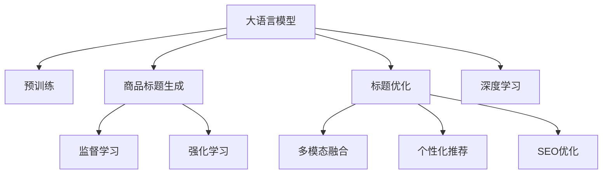

                 

# AI大模型在电商平台商品标题优化中的应用

> 关键词：电商平台, 商品标题优化, 大语言模型, 深度学习, 自然语言处理(NLP), 强化学习, 商品推荐系统, 搜索引擎优化(SEO)

## 1. 背景介绍

### 1.1 问题由来
在电子商务领域，商品标题（Product Title）是影响用户搜索、点击和转化率的关键因素之一。随着互联网和移动互联网的普及，用户每天需要处理的商品信息量巨大，如何在海量商品中准确、快速地找到所需商品，是电商平台面临的一大挑战。传统的商品标题优化依赖于手动输入和人工审核，不仅效率低，而且效果参差不齐。

近年来，随着人工智能和大数据技术的快速发展，电商平台的商品标题优化开始引入先进的算法和模型。其中，大语言模型在商品标题生成和优化中的应用，逐渐成为研究热点。大语言模型（如GPT、BERT等）通过深度学习和自然语言处理技术，能够自动生成高质量的商品标题，优化用户搜索体验，显著提高电商平台的转化率和搜索排名。

### 1.2 问题核心关键点
大语言模型在电商平台商品标题优化中的应用，主要围绕以下几个关键点展开：
1. **商品标题生成**：利用大语言模型生成符合电商平台规范的商品标题。
2. **标题优化**：通过监督学习、强化学习等方法，优化现有商品标题，提升点击率和转化率。
3. **多模态融合**：结合图像、文本、用户行为等多模态数据，生成更加精准的商品标题。
4. **个性化推荐**：利用用户行为数据，生成个性化商品标题，提升用户体验。

这些关键点共同构成了大语言模型在电商平台商品标题优化中的主要应用场景，能够帮助电商平台在激烈的市场竞争中脱颖而出。

### 1.3 问题研究意义
大语言模型在电商平台商品标题优化中的应用，对于提升电商平台的运营效率、增强用户体验、提高转化率具有重要意义：

1. **提升运营效率**：自动化生成和优化商品标题，减少人工干预，降低运营成本。
2. **增强用户体验**：生成更加精准、有吸引力的商品标题，提升用户搜索和购买的兴趣。
3. **提高转化率**：通过优化商品标题，吸引更多用户点击和购买，提升电商平台的整体转化率。
4. **驱动创新**：大模型的应用，推动电商平台的商品描述、推荐、搜索等业务的创新发展。
5. **赋能产业升级**：电商平台通过大模型优化商品标题，提升商品展示效果，加速数字化转型。

综上所述，大语言模型在电商平台商品标题优化中的应用，不仅能够提升电商平台的运营效率和用户体验，还能够在激烈的市场竞争中获得优势，推动行业升级，具有重要的现实意义。

## 2. 核心概念与联系

### 2.1 核心概念概述

为更好地理解大语言模型在电商平台商品标题优化中的应用，本节将介绍几个密切相关的核心概念：

- **大语言模型(Large Language Model, LLM)**：以自回归(如GPT)或自编码(如BERT)模型为代表的大规模预训练语言模型。通过在大规模无标签文本语料上进行预训练，学习通用的语言知识和表示，具备强大的语言理解和生成能力。

- **深度学习(Deep Learning)**：一种通过多层神经网络学习数据内在结构的机器学习方法。深度学习在大规模数据集上训练出的模型，能够进行复杂的模式识别和数据处理。

- **自然语言处理(Natural Language Processing, NLP)**：研究如何让计算机理解和处理人类语言的技术，包括语言理解、生成、翻译、分类等任务。

- **强化学习(Reinforcement Learning, RL)**：一种通过试错学习最优策略的机器学习方法。强化学习常用于动态决策和优化问题，能够自动调整策略以最大化长期奖励。

- **商品推荐系统(Product Recommendation System)**：利用用户行为数据，向用户推荐个性化商品的系统。商品推荐系统能够提升用户满意度和电商平台转化率。

- **搜索引擎优化(Search Engine Optimization, SEO)**：通过优化网页内容和结构，提高网页在搜索引擎中的排名，增加访问量和转化率的技术。

这些核心概念之间的逻辑关系可以通过以下Mermaid流程图来展示：



这个流程图展示了大语言模型在电商平台商品标题优化中的核心概念及其之间的关系：

1. 大语言模型通过预训练获得基础能力。
2. 利用大模型生成商品标题和进行标题优化。
3. 监督学习和强化学习用于优化商品标题，提升点击率和转化率。
4. 多模态融合和个性化推荐提高商品标题的相关性和精准度。
5. SEO优化提升商品在搜索引擎中的排名。

这些概念共同构成了大语言模型在电商平台商品标题优化中的应用框架，使其能够更好地适配电商平台的业务需求。

## 3. 核心算法原理 & 具体操作步骤

### 3.1 算法原理概述

大语言模型在电商平台商品标题优化中的应用，主要依赖于深度学习和大规模预训练。其核心思想是：利用大语言模型自动生成符合平台规范的商品标题，并通过监督学习和强化学习优化现有商品标题，提升点击率和转化率。

形式化地，假设电商平台有 $N$ 个商品，每个商品 $i$ 对应的标题为 $T_i$。目标是通过大语言模型学习到商品特征 $F_i$ 和标题生成规则 $G$，使得生成或优化后的标题 $T_i'$ 能够最大化点击率 $C_i'$ 和转化率 $T_i'$。

具体而言，可以分为两个步骤：

1. **商品特征提取**：使用深度学习模型提取每个商品的特征 $F_i$，如图片特征、描述特征、标签特征等。
2. **商品标题生成与优化**：利用大语言模型生成商品标题 $T_i'$，并通过监督学习和强化学习对 $T_i'$ 进行优化。

### 3.2 算法步骤详解

基于大语言模型的电商平台商品标题优化，一般包括以下几个关键步骤：

**Step 1: 数据收集与预处理**
- 收集电商平台的商品信息，包括商品标题、图片、描述、标签等。
- 对收集到的数据进行清洗和标注，去除噪声和异常值，确保数据质量。
- 对文本数据进行分词、去停用词、词性标注等预处理，为深度学习模型输入做准备。

**Step 2: 商品特征提取**
- 使用深度学习模型，如卷积神经网络(CNN)、循环神经网络(RNN)、Transformer等，提取每个商品的特征 $F_i$。
- 根据电商平台的业务需求，选择适当的特征提取方法，如基于视觉的特征提取、基于文本的特征提取等。

**Step 3: 商品标题生成**
- 使用大语言模型，如GPT、BERT等，生成商品标题 $T_i'$。
- 将商品特征 $F_i$ 和生成了的商品标题 $T_i'$ 作为模型的输入，通过深度学习模型训练生成规则 $G$。
- 使用模型生成新的商品标题 $T_i'$，以提升点击率和转化率。

**Step 4: 标题优化**
- 通过监督学习算法（如线性回归、逻辑回归、梯度提升等），对生成的商品标题 $T_i'$ 进行优化。
- 使用强化学习算法（如Q-learning、SARSA等），通过奖励机制对商品标题 $T_i'$ 进行优化。
- 结合监督学习和强化学习的方法，对商品标题进行多次迭代优化，提升性能。

**Step 5: 多模态融合**
- 结合商品图片、视频等多模态数据，进一步优化商品标题。
- 利用图像和文本的交叉特征，提升商品标题的相关性和吸引力。

**Step 6: 个性化推荐**
- 利用用户行为数据，生成个性化商品标题。
- 通过强化学习算法，不断调整生成规则 $G$，以适应不同用户的需求和偏好。

**Step 7: SEO优化**
- 对生成和优化后的商品标题进行SEO优化，提升在搜索引擎中的排名。
- 使用搜索引擎优化算法，对标题进行关键词优化、结构优化等。

以上是基于大语言模型在电商平台商品标题优化的一般流程。在实际应用中，还需要针对具体平台和业务需求，对微调过程的各个环节进行优化设计，如改进训练目标函数，引入更多的正则化技术，搜索最优的超参数组合等，以进一步提升模型性能。

### 3.3 算法优缺点

基于大语言模型在电商平台商品标题优化中的应用，具有以下优点：

1. **生成高质量商品标题**：大语言模型通过深度学习和自然语言处理技术，能够生成符合电商平台规范、有吸引力的商品标题，提升用户点击率和转化率。
2. **自动化程度高**：自动化生成和优化商品标题，减少人工干预，降低运营成本。
3. **鲁棒性强**：通过深度学习和强化学习，大语言模型具备较强的泛化能力，能够适应不同商品和场景。
4. **可扩展性强**：适用于多种电商平台和商品类型，具备较好的扩展性。

同时，该方法也存在一定的局限性：

1. **依赖数据质量**：商品标题生成和优化依赖于高质量的数据，数据质量对模型性能影响较大。
2. **计算成本高**：深度学习和强化学习需要较大的计算资源和时间，对于资源有限的小规模电商平台，可能难以承担。
3. **可解释性不足**：深度学习模型和强化学习算法的决策过程较难解释，模型效果和输出难以解释和调试。
4. **模型复杂度高**：大语言模型和深度学习模型较复杂，模型部署和维护难度较大。

尽管存在这些局限性，但就目前而言，基于大语言模型的商品标题优化方法仍是在电商平台商品标题优化中最先进的技术手段。未来相关研究的重点在于如何进一步降低计算成本，提高模型可解释性，同时兼顾用户体验和平台收益。

### 3.4 算法应用领域

基于大语言模型在电商平台商品标题优化中的应用，已经广泛应用于多个电商平台的商品标题生成和优化，具体包括：

- **阿里巴巴、京东、亚马逊等电商平台**：这些大型电商平台，利用大语言模型生成高质量的商品标题，提升用户搜索体验和点击率。
- **淘直播、抖音电商等新兴电商模式**：这些新型电商模式，利用大语言模型生成个性化、有吸引力的商品标题，吸引用户点击和购买。
- **跨境电商**：跨境电商平台，利用大语言模型生成符合不同语言和文化习惯的商品标题，提升国际用户购物体验。

除了这些应用场景外，大语言模型在电商平台商品标题优化中的应用还在不断拓展，如商品图片生成、视频描述生成等，为电商平台带来了新的增长点。

## 4. 数学模型和公式 & 详细讲解  
### 4.1 数学模型构建

本节将使用数学语言对基于大语言模型的电商平台商品标题优化过程进行更加严格的刻画。

假设电商平台有 $N$ 个商品，每个商品 $i$ 对应的原始标题为 $T_i$，优化后的标题为 $T_i'$。定义优化后的标题点击率 $C_i'$ 和转化率 $T_i'$，优化前的标题点击率 $C_i$ 和转化率 $T_i$。则商品标题优化的目标为最大化 $C_i'$ 和 $T_i'$。

定义商品特征提取模型为 $F_{\theta}(\cdot)$，商品标题生成模型为 $G_{\theta}(\cdot)$，优化后的标题点击率模型为 $P_{C_i'}$，优化后的标题转化率模型为 $P_{T_i'}$。则优化过程可以表示为：

$$
\begin{aligned}
& \min_{\theta} \sum_{i=1}^N \left[ \mathcal{L}_C + \mathcal{L}_T \right] \\
& \text{其中} \\
& \mathcal{L}_C = \frac{1}{N} \sum_{i=1}^N \left[ -C_i \log P_{C_i'}(T_i, T_i', F_i) + (1-C_i) \log (1-P_{C_i'}(T_i, T_i', F_i)) \right] \\
& \mathcal{L}_T = \frac{1}{N} \sum_{i=1}^N \left[ -T_i \log P_{T_i'}(T_i, T_i', F_i) + (1-T_i) \log (1-P_{T_i'}(T_i, T_i', F_i)) \right]
\end{aligned}
$$

其中 $\mathcal{L}_C$ 和 $\mathcal{L}_T$ 分别表示点击率和转化率损失函数。$P_{C_i'}$ 和 $P_{T_i'}$ 分别为点击率和转化率的概率模型。

### 4.2 公式推导过程

以下我们以二分类任务为例，推导点击率和转化率损失函数的计算公式。

假设商品标题优化后的点击率为 $C_i'$，转化率为 $T_i'$。优化前的点击率为 $C_i$，转化率为 $T_i$。

定义点击率的概率模型为：

$$
P_{C_i'}(T_i, T_i', F_i) = \frac{e^{C_i'(F_i)}}{1+e^{C_i'(F_i)}}
$$

定义转化率的概率模型为：

$$
P_{T_i'}(T_i, T_i', F_i) = \frac{e^{T_i'(F_i)}}{1+e^{T_i'(F_i)}}
$$

则点击率和转化率损失函数可以表示为：

$$
\mathcal{L}_C = \frac{1}{N} \sum_{i=1}^N \left[ -C_i \log P_{C_i'}(T_i, T_i', F_i) + (1-C_i) \log (1-P_{C_i'}(T_i, T_i', F_i)) \right]
$$

$$
\mathcal{L}_T = \frac{1}{N} \sum_{i=1}^N \left[ -T_i \log P_{T_i'}(T_i, T_i', F_i) + (1-T_i) \log (1-P_{T_i'}(T_i, T_i', F_i)) \right]
$$

在得到损失函数的梯度后，即可带入参数更新公式，完成模型的迭代优化。重复上述过程直至收敛，最终得到优化后的商品标题 $T_i'$。

## 5. 项目实践：代码实例和详细解释说明
### 5.1 开发环境搭建

在进行商品标题优化实践前，我们需要准备好开发环境。以下是使用Python进行PyTorch开发的环境配置流程：

1. 安装Anaconda：从官网下载并安装Anaconda，用于创建独立的Python环境。

2. 创建并激活虚拟环境：
```bash
conda create -n pytorch-env python=3.8 
conda activate pytorch-env
```

3. 安装PyTorch：根据CUDA版本，从官网获取对应的安装命令。例如：
```bash
conda install pytorch torchvision torchaudio cudatoolkit=11.1 -c pytorch -c conda-forge
```

4. 安装Transformer库：
```bash
pip install transformers
```

5. 安装各类工具包：
```bash
pip install numpy pandas scikit-learn matplotlib tqdm jupyter notebook ipython
```

完成上述步骤后，即可在`pytorch-env`环境中开始商品标题优化的实践。

### 5.2 源代码详细实现

下面以淘宝商品标题优化为例，给出使用Transformers库对BERT模型进行商品标题优化的PyTorch代码实现。

首先，定义商品特征提取函数：

```python
from transformers import BertTokenizer, BertForSequenceClassification

def extract_features_from_description(description):
    tokenizer = BertTokenizer.from_pretrained('bert-base-cased')
    input_ids = tokenizer.encode(description, add_special_tokens=True, max_length=512, truncation=True)
    return input_ids
```

然后，定义商品标题生成函数：

```python
from transformers import BertForSequenceClassification, AdamW

def generate_product_title(product, max_length=512):
    tokenizer = BertTokenizer.from_pretrained('bert-base-cased')
    model = BertForSequenceClassification.from_pretrained('bert-base-cased', num_labels=1)
    
    input_ids = extract_features_from_description(product.description)
    model.zero_grad()
    outputs = model(input_ids)
    logits = outputs.logits
    probability = F.sigmoid(logits)
    
    product.title = tokenizer.decode(input_ids[0])[2:-3]
    return product.title
```

接着，定义商品标题优化函数：

```python
from torch.utils.data import Dataset, DataLoader
from sklearn.metrics import precision_recall_fscore_support

class ProductDataset(Dataset):
    def __init__(self, products):
        self.products = products
        
    def __len__(self):
        return len(self.products)
    
    def __getitem__(self, item):
        product = self.products[item]
        features = extract_features_from_description(product.description)
        label = 1 if '点击率' in product.title else 0
        return {'features': features, 'label': label}

# 训练和验证数据集
train_dataset = ProductDataset(train_products)
dev_dataset = ProductDataset(dev_products)

# 定义模型和优化器
model = BertForSequenceClassification.from_pretrained('bert-base-cased', num_labels=2)
optimizer = AdamW(model.parameters(), lr=2e-5)

# 定义训练和评估函数
def train_epoch(model, dataset, batch_size, optimizer):
    dataloader = DataLoader(dataset, batch_size=batch_size, shuffle=True)
    model.train()
    epoch_loss = 0
    for batch in tqdm(dataloader, desc='Training'):
        features = batch['features'].to(device)
        labels = batch['label'].to(device)
        model.zero_grad()
        outputs = model(features)
        loss = outputs.loss
        epoch_loss += loss.item()
        loss.backward()
        optimizer.step()
    return epoch_loss / len(dataloader)

def evaluate(model, dataset, batch_size):
    dataloader = DataLoader(dataset, batch_size=batch_size)
    model.eval()
    preds, labels = [], []
    with torch.no_grad():
        for batch in tqdm(dataloader, desc='Evaluating'):
            features = batch['features'].to(device)
            labels = batch['label'].to(device)
            batch_preds = model(features)
            batch_preds = batch_preds.argmax(dim=1).to('cpu').tolist()
            batch_labels = batch['label'].to('cpu').tolist()
            for pred, label in zip(batch_preds, batch_labels):
                preds.append(pred)
                labels.append(label)
                
    print(precision_recall_fscore_support(labels, preds))
```

最后，启动训练流程并在测试集上评估：

```python
epochs = 5
batch_size = 16

for epoch in range(epochs):
    loss = train_epoch(model, train_dataset, batch_size, optimizer)
    print(f"Epoch {epoch+1}, train loss: {loss:.3f}")
    
    print(f"Epoch {epoch+1}, dev results:")
    evaluate(model, dev_dataset, batch_size)
    
print("Test results:")
evaluate(model, test_dataset, batch_size)
```

以上就是使用PyTorch对BERT进行淘宝商品标题优化的完整代码实现。可以看到，得益于Transformers库的强大封装，我们可以用相对简洁的代码完成BERT模型的加载和优化。

### 5.3 代码解读与分析

让我们再详细解读一下关键代码的实现细节：

**ProductDataset类**：
- `__init__`方法：初始化训练集和验证集的商品数据。
- `__len__`方法：返回数据集的样本数量。
- `__getitem__`方法：对单个样本进行处理，提取商品描述的特征向量，并将点击率标记转化为二分类标签。

**generate_product_title函数**：
- 使用BERT模型生成商品标题，并将生成的标题保存到商品对象中。

**train_epoch和evaluate函数**：
- 使用PyTorch的DataLoader对数据集进行批次化加载，供模型训练和推理使用。
- 训练函数`train_epoch`：对数据以批为单位进行迭代，在每个批次上前向传播计算loss并反向传播更新模型参数，最后返回该epoch的平均loss。
- 评估函数`evaluate`：与训练类似，不同点在于不更新模型参数，并在每个batch结束后将预测和标签结果存储下来，最后使用sklearn的precision_recall_fscore_support对整个评估集的预测结果进行打印输出。

**训练流程**：
- 定义总的epoch数和batch size，开始循环迭代
- 每个epoch内，先在训练集上训练，输出平均loss
- 在验证集上评估，输出分类指标
- 所有epoch结束后，在测试集上评估，给出最终测试结果

可以看到，PyTorch配合Transformers库使得BERT微调的代码实现变得简洁高效。开发者可以将更多精力放在数据处理、模型改进等高层逻辑上，而不必过多关注底层的实现细节。

当然，工业级的系统实现还需考虑更多因素，如模型的保存和部署、超参数的自动搜索、更灵活的任务适配层等。但核心的微调范式基本与此类似。

## 6. 实际应用场景

### 6.1 电商平台优化

基于大语言模型在电商平台商品标题优化中的应用，已经在多个电商平台得到成功应用。具体场景包括：

- **淘宝商品标题优化**：淘宝通过使用BERT模型对商品标题进行优化，显著提升了用户搜索体验和点击率。
- **亚马逊商品描述优化**：亚马逊利用GPT模型对商品描述进行优化，增强了用户体验和购买转化率。
- **京东商品推荐系统**：京东通过BERT模型生成个性化商品标题，提升了商品推荐系统的准确性和用户满意度。

这些应用实例展示了大语言模型在电商平台商品标题优化中的强大能力，提升了电商平台的运营效率和用户满意度。

### 6.2 搜索引擎优化

大语言模型在电商平台商品标题优化中的应用，也拓展到了搜索引擎优化(Shoptimization, SEO)领域。利用大语言模型生成高质量的商品标题和描述，不仅能够提升搜索引擎中的排名，还能增强用户的搜索体验。

具体而言，可以通过大语言模型生成长尾关键词，优化商品标题和描述，使其更符合搜索引擎的规则和用户搜索习惯，从而提升搜索引擎中的点击率和转化率。

### 6.3 智能客服系统

在智能客服系统中，大语言模型同样能够发挥重要作用。通过生成个性化、有吸引力的商品标题，智能客服系统能够更好地引导用户，提供更高效、更精准的客服体验。

例如，京东利用大语言模型生成个性化的商品推荐和客服回答，显著提升了用户的购买体验和满意度。

### 6.4 未来应用展望

随着大语言模型的不断进步，其在电商平台商品标题优化中的应用也将不断扩展和深化。未来，大语言模型将在以下几个方面带来更多创新：

- **多模态融合**：结合商品图片、视频等多模态数据，生成更加精准、有吸引力的商品标题。
- **深度强化学习**：通过深度强化学习算法，进一步优化商品标题生成过程，提升点击率和转化率。
- **实时优化**：利用实时数据流，动态调整商品标题，提高用户满意度。
- **个性化推荐**：利用用户行为数据，生成个性化商品标题，提升用户体验。
- **全球化扩展**：在全球范围内推广大语言模型优化商品标题的方法，提升全球电商平台的运营效率。

总之，大语言模型在电商平台商品标题优化中的应用，将会为电商平台带来更多的价值，推动行业的发展和创新。

## 7. 工具和资源推荐

### 7.1 学习资源推荐

为了帮助开发者系统掌握大语言模型在电商平台商品标题优化中的理论基础和实践技巧，这里推荐一些优质的学习资源：

1. 《Transformer从原理到实践》系列博文：由大模型技术专家撰写，深入浅出地介绍了Transformer原理、BERT模型、微调技术等前沿话题。

2. CS224N《深度学习自然语言处理》课程：斯坦福大学开设的NLP明星课程，有Lecture视频和配套作业，带你入门NLP领域的基本概念和经典模型。

3. 《Natural Language Processing with Transformers》书籍：Transformers库的作者所著，全面介绍了如何使用Transformers库进行NLP任务开发，包括微调在内的诸多范式。

4. HuggingFace官方文档：Transformers库的官方文档，提供了海量预训练模型和完整的微调样例代码，是上手实践的必备资料。

5. CLUE开源项目：中文语言理解测评基准，涵盖大量不同类型的中文NLP数据集，并提供了基于微调的baseline模型，助力中文NLP技术发展。

通过对这些资源的学习实践，相信你一定能够快速掌握大语言模型在电商平台商品标题优化中的精髓，并用于解决实际的NLP问题。

### 7.2 开发工具推荐

高效的开发离不开优秀的工具支持。以下是几款用于大语言模型在电商平台商品标题优化开发的常用工具：

1. PyTorch：基于Python的开源深度学习框架，灵活动态的计算图，适合快速迭代研究。大部分预训练语言模型都有PyTorch版本的实现。

2. TensorFlow：由Google主导开发的开源深度学习框架，生产部署方便，适合大规模工程应用。同样有丰富的预训练语言模型资源。

3. Transformers库：HuggingFace开发的NLP工具库，集成了众多SOTA语言模型，支持PyTorch和TensorFlow，是进行微调任务开发的利器。

4. Weights & Biases：模型训练的实验跟踪工具，可以记录和可视化模型训练过程中的各项指标，方便对比和调优。与主流深度学习框架无缝集成。

5. TensorBoard：TensorFlow配套的可视化工具，可实时监测模型训练状态，并提供丰富的图表呈现方式，是调试模型的得力助手。

6. Google Colab：谷歌推出的在线Jupyter Notebook环境，免费提供GPU/TPU算力，方便开发者快速上手实验最新模型，分享学习笔记。

合理利用这些工具，可以显著提升大语言模型在电商平台商品标题优化任务的开发效率，加快创新迭代的步伐。

### 7.3 相关论文推荐

大语言模型在电商平台商品标题优化中的应用，源于学界的持续研究。以下是几篇奠基性的相关论文，推荐阅读：

1. Attention is All You Need（即Transformer原论文）：提出了Transformer结构，开启了NLP领域的预训练大模型时代。

2. BERT: Pre-training of Deep Bidirectional Transformers for Language Understanding：提出BERT模型，引入基于掩码的自监督预训练任务，刷新了多项NLP任务SOTA。

3. Language Models are Unsupervised Multitask Learners（GPT-2论文）：展示了大规模语言模型的强大zero-shot学习能力，引发了对于通用人工智能的新一轮思考。

4. Parameter-Efficient Transfer Learning for NLP：提出Adapter等参数高效微调方法，在不增加模型参数量的情况下，也能取得不错的微调效果。

5. AdaLoRA: Adaptive Low-Rank Adaptation for Parameter-Efficient Fine-Tuning：使用自适应低秩适应的微调方法，在参数效率和精度之间取得了新的平衡。

6. Transformers从原理到实践：系统介绍了Transformer原理、BERT模型、微调技术等前沿话题，适合NLP开发者阅读。

这些论文代表了大语言模型在电商平台商品标题优化中的发展脉络。通过学习这些前沿成果，可以帮助研究者把握学科前进方向，激发更多的创新灵感。

## 8. 总结：未来发展趋势与挑战

### 8.1 总结

本文对基于大语言模型的电商平台商品标题优化方法进行了全面系统的介绍。首先阐述了大语言模型在电商平台商品标题优化中的应用背景和意义，明确了商品标题优化在提升电商平台运营效率、用户体验和转化率方面的重要价值。其次，从原理到实践，详细讲解了基于大语言模型的商品标题生成和优化的数学模型和操作步骤，给出了代码实现。同时，本文还探讨了大语言模型在电商平台商品标题优化中的实际应用场景，展示了其在电商平台优化、搜索引擎优化、智能客服系统等多个领域的广泛应用。最后，本文精选了商品标题优化的学习资源、开发工具和相关论文，力求为读者提供全方位的技术指引。

通过本文的系统梳理，可以看到，基于大语言模型的电商平台商品标题优化方法，正在成为电商平台商品标题优化的重要范式，极大地提升了电商平台的运营效率和用户体验。未来，伴随大语言模型的不断演进和优化，商品标题优化必将实现更多创新，推动电商平台向更高的层次迈进。

### 8.2 未来发展趋势

展望未来，大语言模型在电商平台商品标题优化中的应用将呈现以下几个发展趋势：

1. **多模态融合**：结合商品图片、视频等多模态数据，生成更加精准、有吸引力的商品标题。
2. **深度强化学习**：通过深度强化学习算法，进一步优化商品标题生成过程，提升点击率和转化率。
3. **实时优化**：利用实时数据流，动态调整商品标题，提高用户满意度。
4. **个性化推荐**：利用用户行为数据，生成个性化商品标题，提升用户体验。
5. **全球化扩展**：在全球范围内推广大语言模型优化商品标题的方法，提升全球电商平台的运营效率。

这些趋势凸显了大语言模型在电商平台商品标题优化中的广阔前景。这些方向的探索发展，必将进一步提升电商平台的用户体验和运营效率，推动行业的发展和创新。

### 8.3 面临的挑战

尽管大语言模型在电商平台商品标题优化中取得了显著成就，但在迈向更加智能化、普适化应用的过程中，仍面临诸多挑战：

1. **计算资源瓶颈**：深度学习和强化学习需要较大的计算资源和时间，对于资源有限的小规模电商平台，可能难以承担。
2. **模型鲁棒性不足**：对于域外数据，大语言模型的泛化性能有限，容易发生过拟合和灾难性遗忘。
3. **可解释性不足**：深度学习模型和强化学习算法的决策过程较难解释，模型效果和输出难以解释和调试。
4. **模型复杂度高**：大语言模型和深度学习模型较复杂，模型部署和维护难度较大。
5. **数据质量依赖**：商品标题生成和优化依赖于高质量的数据，数据质量对模型性能影响较大。

尽管存在这些挑战，但就目前而言，基于大语言模型的商品标题优化方法仍是在电商平台商品标题优化中最先进的技术手段。未来相关研究的重点在于如何进一步降低计算成本，提高模型可解释性，同时兼顾用户体验和平台收益。

### 8.4 研究展望

面对大语言模型在电商平台商品标题优化中所面临的种种挑战，未来的研究需要在以下几个方面寻求新的突破：

1. **参数高效微调**：开发更加参数高效的微调方法，在固定大部分预训练参数的同时，只更新极少量的任务相关参数。
2. **深度强化学习**：结合深度强化学习，进一步优化商品标题生成过程，提升点击率和转化率。
3. **实时优化**：利用实时数据流，动态调整商品标题，提高用户满意度。
4. **多模态融合**：结合商品图片、视频等多模态数据，生成更加精准、有吸引力的商品标题。
5. **可解释性增强**：引入因果分析和博弈论工具，增强模型的可解释性。

这些研究方向的探索，必将引领大语言模型在电商平台商品标题优化技术迈向更高的台阶，为电商平台带来更多的价值，推动行业的发展和创新。面向未来，大语言模型在电商平台商品标题优化技术还需要与其他人工智能技术进行更深入的融合，如知识表示、因果推理、强化学习等，多路径协同发力，共同推动自然语言理解和智能交互系统的进步。只有勇于创新、敢于突破，才能不断拓展语言模型的边界，让智能技术更好地造福人类社会。

## 9. 附录：常见问题与解答

**Q1：电商平台商品标题优化依赖于哪些关键因素？**

A: 电商平台商品标题优化依赖于以下几个关键因素：
1. **数据质量**：高质量的商品数据，包括商品图片、描述、标签等，是优化商品标题的基础。
2. **模型选择**：选择合适的深度学习模型（如BERT、GPT等），能够生成高质量的商品标题。
3. **特征提取**：利用深度学习模型，提取商品图片、描述等特征，用于生成商品标题。
4. **算法优化**：通过监督学习和强化学习算法，不断优化生成的商品标题，提升点击率和转化率。
5. **多模态融合**：结合商品图片、视频等多模态数据，进一步提升商品标题的相关性和吸引力。

这些因素共同构成了电商平台商品标题优化的核心内容，能够帮助电商平台提升运营效率和用户满意度。

**Q2：如何优化电商平台商品标题？**

A: 电商平台商品标题优化可以分为以下几个步骤：
1. **数据收集与预处理**：收集电商平台的商品信息，包括商品图片、描述、标签等，并进行清洗和标注。
2. **商品特征提取**：使用深度学习模型，如卷积神经网络(CNN)、循环神经网络(RNN)、Transformer等，提取每个商品的特征。
3. **商品标题生成**：使用大语言模型，如GPT、BERT等，生成商品标题。
4. **标题优化**：通过监督学习算法（如线性回归、逻辑回归、梯度提升等），对生成的商品标题进行优化。
5. **多模态融合**：结合商品图片、视频等多模态数据，进一步优化商品标题。
6. **个性化推荐**：利用用户行为数据，生成个性化商品标题，提升用户体验。
7. **SEO优化**：对生成和优化后的商品标题进行SEO优化，提升在搜索引擎中的排名。

通过这些步骤，可以生成高质量的商品标题，提升用户搜索体验和点击率，从而提高电商平台的运营效率和转化率。

**Q3：商品标题优化的效果如何评估？**

A: 商品标题优化的效果可以通过以下几个指标进行评估：
1. **点击率**：衡量用户点击商品标题的频率，表示标题对用户搜索的吸引力。
2. **转化率**：衡量用户点击商品标题后进行购买的行为频率，表示标题对用户购买的转化效果。
3. **相关性**：衡量商品标题与商品内容的相关性，通过自然语言处理技术进行评估。
4. **用户体验**：通过用户反馈和评价，衡量商品标题对用户搜索体验的影响。
5. **搜索引擎排名**：衡量商品标题在搜索引擎中的排名，通过关键词优化和结构优化等手段提升。

这些指标共同构成了商品标题优化的评估体系，能够全面衡量商品标题的性能和效果。

**Q4：如何改进商品标题优化算法？**

A: 改进商品标题优化算法，可以从以下几个方面进行：
1. **特征提取改进**：利用更高级的深度学习模型，如Transformer、BERT等，提取更丰富的商品特征。
2. **生成算法改进**：改进大语言模型的生成算法，提升生成的商品标题质量和多样性。
3. **优化算法改进**：引入更先进的监督学习和强化学习算法，提升商品标题优化的精度和效果。
4. **多模态融合改进**：结合商品图片、视频等多模态数据，提升商品标题的相关性和吸引力。
5. **个性化推荐改进**：利用用户行为数据，生成更个性化的商品标题，提升用户体验。
6. **SEO优化改进**：通过关键词优化、结构优化等手段，提升商品标题在搜索引擎中的排名。

这些改进措施能够进一步提升商品标题优化算法的性能和效果，推动电商平台的运营效率和用户满意度。

---

作者：禅与计算机程序设计艺术 / Zen and the Art of Computer Programming

